# Powder Diffraction

## Learning Objectives

 Introduction to Powder X-ray Diffracion

 Bragg’s Law of Diffraction

 Application of Powder XRD

 Determination of an Unknown

 Strengths and Limitations of X-ray Powder Diffraction

## 15.1 Introduction to Powder X-ray Diffraction

Powder X-ray diffraction (PXRD) is perhaps the most widely used analytical technique for characterizing materials. As the name suggests, the sample is usually in a powdery form, consisting of fine grains of single crystalline material to be studied. The technique is also used widely for studying particles in liquid suspensions or polycrystalline solids (bulk or thin film materials).

The term 'powder' really means that the crytalline domains are randomly oriented in the sample. Therefore when the 2-D diffraction pattern is recorded, it shows concentric rings of scattering peaks corresponding to the various d spacings in the crystal lattice.

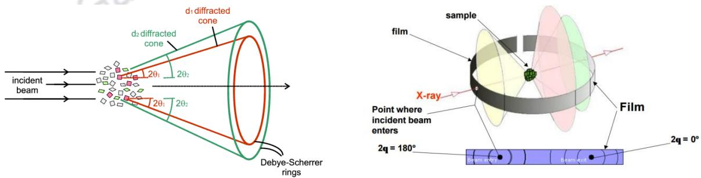

> 🧠 **[Cognis Multimodal Enrichment]**
> * **Classification:** Scientific Figure
> * **Extracted Text (OCR):** `d1 diffracted cone, d2 diffracted cone, Debye-Scherrer rings, incident beam, 2θ1, 2θ2, 2θ3, film, sample, X-ray, Point where incident beam enters, 2q = 0°, Beam entry, Beam exit`
> * **VLM Visual Summary:** ### FIGURE TYPE:
>   Diffraction Pattern
>   
>   ### SCIENTIFIC PURPOSE:
>   This figure explains the Debye-Scherrer method, which is used to obtain a two-dimensional diffraction pattern from a powder sample. The method involves the use of X-rays to diffract from the crystalline domains within the powder sample, resulting in a series of concentric rings of scattering peaks.
>   
>   ### KEY KNOWLEDGE:
>   1. **Debye-Scherrer Rings**: The figure illustrates the formation of Debye-Scherrer rings, which are concentric circles of diffraction peaks. These rings correspond to different d-spacings in the crystal lattice.
>   2. **Diffracted Cones**: The figure shows the incident beam, which diffracts from the crystalline domains within the powder sample, forming cones of diffracted X-rays.
>   3. **2θ Values**: The angles between the incident beam and the diffracted cones are labeled with values such as \(2\theta_1\) and \(2\theta_2\), indicating the diffraction angles for different d-spacings.
>   4. **Sample Orientation**: The sample is shown to have crystalline domains randomly oriented, which results in the observed diffraction pattern.
>   
>   ### LABEL INTERPRETATION:
>   - **Incident Beam**: The incoming X-ray beam that interacts with the powder sample.
>   - **Debye-Scherrer Rings**: Concentric circles of diffraction peaks corresponding to different d-spacings.
>   - **Diffracted Cone**: The cone of diffracted X-rays formed by the interaction of the incident beam with the crystalline domains.
>   - **2θ Values**: Angles between the incident beam and the diffracted cones, indicating the diffraction angles for different d-spacings.
>   
>   ### ENGINEERING/SCIENTIFIC INSIGHTS:
>   - **Powder X-ray Diffraction (PXRD)**: The method is widely used to characterize materials in a powdery form, providing information about their crystalline structure.
>   - **Bragg's Law**: The diffraction peaks correspond to the positions where Bragg's law is satisfied, i.e., \(2q = 2n\theta\), where \(q\) is the wave vector of the X-rays, \(\theta\) is the diffraction angle, and \(n\) is an integer.
>   - **Phase Identification**: The positions and intensities of the diffraction peaks can identify the underlying structure of the material, distinguishing
> * **Figure Caption:** The term 'powder' really means that the crytalline domains are randomly oriented in the sample. Therefore when the 2-D diffraction pattern is recorded, it shows concentric rings of scattering peaks corresponding to the various d spacings in the crystal lattice. | The positions and the intensities of the peaks are used for identifying the underlying structure (or phase) of the material. For example, the diffraction lines of graphite would be different from diamond even though they both are made of carbon atoms. This phase identification is important because the material properties are highly dependent on structure (just think of graphite and diamond).
> * **Surrounding Context (+/- 300 words):**
>   * **[Before]:** *... [Section: Powder Diffraction > Learning Objectives]  Introduction to Powder X-ray Diffracion  Bragg’s Law of Diffraction  Application of Powder XRD  Determination of an Unknown  Strengths and Limitations of X-ray Powder Diffraction [Section: Powder Diffraction > 15.1 Introduction to Powder X-ray Diffraction] Powder X-ray diffraction (PXRD) is perhaps the most widely used analytical technique for characterizing materials. As the name suggests, the sample is usually in a powdery form, consisting of fine grains of single crystalline material to be studied. The technique is also used widely for studying particles in liquid suspensions or polycrystalline solids (bulk or thin film materials). The term 'powder' really means that the crytalline domains are randomly oriented in the sample. Therefore when the 2-D diffraction pattern is recorded, it shows concentric rings of scattering peaks corresponding to the various d spacings in the crystal lattice.*
>   * **[After]:** *The positions and the intensities of the peaks are used for identifying the underlying structure (or phase) of the material. For example, the diffraction lines of graphite would be different from diamond even though they both are made of carbon atoms. This phase identification is important because the material properties are highly dependent on structure (just think of graphite and diamond). Powder diffraction data can be collected using either reflection or transmission geometry, as shown below. [Section: Powder Diffraction > 15.1 Introduction to Powder X-ray Diffraction] Because the particles in the powder sample are randomly oriented, these two methods will yield the same data. A powder XRD scan typically represents a plot of scattering intensity v/s. the scattering angle 2θ or the corresponding d-spacing. The peak positions, intensities, widths and shapes all provide important information about the structure of the material. The diffraction from ideal crystalline substances are characterized by well defined Bragg peaks in X-ray diffraction. The crystalline substances have long range order. The amorphous substances do not possess this long range order. So the diffraction from them do not show sharp Bragg peaks. In amorphous phase, X-rays will be scattered in many directions leading to a large bump distributed in a wide range (2θ) instead of high intensity narrower peaks. Max von Laue, in 1912, discovered that crystalline substances act as three-dimensional diffraction gratings for X-ray wavelengths similar to the spacing of planes in a crystal lattice. X-ray diffraction is based on constructive interference of monochromatic X-rays and a crystalline sample. These X-rays are generated by a cathode ray tube, filtered to produce monochromatic radiation, collimated to concentrate, and directed toward the sample. In principle, X-ray diffractometers consist of three basic elements: an X-ray tube, a sample holder, and an X-ray detector. [Section: Powder Diffraction > 15.1 Introduction ...*

The positions and the intensities of the peaks are used for identifying the underlying structure (or phase) of the material. For example, the diffraction lines of graphite would be different from diamond even though they both are made of carbon atoms. This phase identification is important because the material properties are highly dependent on structure (just think of graphite and diamond).

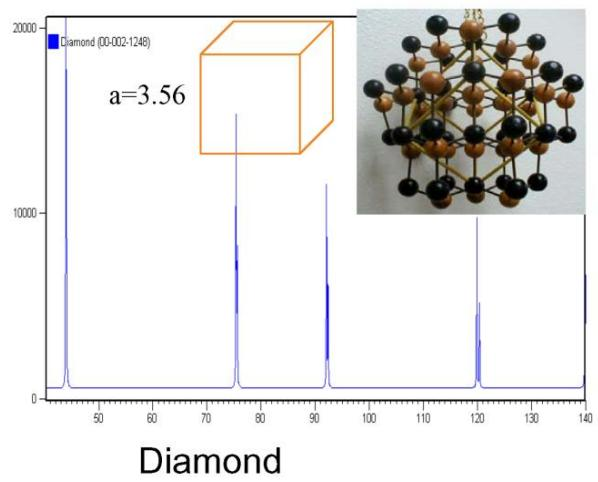

> 🧠 **[Cognis Multimodal Enrichment]**
> * **Classification:** Scientific Figure
> * **Extracted Text (OCR):** `Diamond (00-002-1248), a=3.56, Diamond`
> * **VLM Visual Summary:** ### FIGURE TYPE:
>   Diffraction Pattern
>   
>   ### SCIENTIFIC PURPOSE:
>   This figure explains the use of powder diffraction patterns to identify the underlying structure of a material, specifically distinguishing between graphite and diamond.
>   
>   ### KEY KNOWLEDGE:
>   1. **Bragg's Law of Diffraction**: The diffraction pattern is determined by Bragg's law, which states that constructive interference occurs when the path difference between the incident and diffracted waves is an integer multiple of the wavelength.
>   2. **Powder Diffraction Patterns**: When a powder sample is analyzed with X-rays, the diffraction pattern consists of a series of concentric rings corresponding to the various d-spacings in the crystal lattice.
>   3. **Diamond Structure**: Diamond has a cubic structure with a lattice parameter \(a = 3.56\) Å.
>   4. **Graphite Structure**: Graphite has a hexagonal structure with a lattice parameter \(a = 3.36\) Å.
>   5. **Phase Identification**: The positions and intensities of the peaks in the diffraction pattern are crucial for identifying the underlying structure of the material. Different materials have distinct diffraction patterns due to their unique crystal structures.
>   
>   ### LABEL INTERPRETATION:
>   - **Diamond (00-002-1248)**: This label indicates the specific diffraction pattern being analyzed, which corresponds to the diamond structure.
>   - **a = 3.56**: This label provides the lattice parameter of the diamond structure.
>   
>   ### ENGINEERING/SCIENTIFIC INSIGHTS:
>   A reader should learn that the diffraction pattern of a material reveals its crystal structure, allowing for the identification of whether the material is graphite or diamond. Understanding the specific diffraction pattern helps in determining the material's composition and properties.
>   
>   ### USER-RELEVANT INFORMATION:
>   The diffraction pattern of diamond (00-002-1248) with a lattice parameter \(a = 3.56\) Å is distinctive and can be used to identify diamond among other materials. The presence of this specific diffraction pattern is a key indicator of the diamond structure.
> * **Figure Caption:** The positions and the intensities of the peaks are used for identifying the underlying structure (or phase) of the material. For example, the diffraction lines of graphite would be different from diamond even though they both are made of carbon atoms. This phase identification is important because the material properties are highly dependent on structure (just think of graphite and diamond). | Powder diffraction data can be collected using either reflection or transmission geometry, as shown below.
> * **Surrounding Context (+/- 300 words):**
>   * **[Before]:** *... [Section: Powder Diffraction > Learning Objectives]  Introduction to Powder X-ray Diffracion  Bragg’s Law of Diffraction  Application of Powder XRD  Determination of an Unknown  Strengths and Limitations of X-ray Powder Diffraction [Section: Powder Diffraction > 15.1 Introduction to Powder X-ray Diffraction] Powder X-ray diffraction (PXRD) is perhaps the most widely used analytical technique for characterizing materials. As the name suggests, the sample is usually in a powdery form, consisting of fine grains of single crystalline material to be studied. The technique is also used widely for studying particles in liquid suspensions or polycrystalline solids (bulk or thin film materials). The term 'powder' really means that the crytalline domains are randomly oriented in the sample. Therefore when the 2-D diffraction pattern is recorded, it shows concentric rings of scattering peaks corresponding to the various d spacings in the crystal lattice. The positions and the intensities of the peaks are used for identifying the underlying structure (or phase) of the material. For example, the diffraction lines of graphite would be different from diamond even though they both are made of carbon atoms. This phase identification is important because the material properties are highly dependent on structure (just think of graphite and diamond).*
>   * **[After]:** *Powder diffraction data can be collected using either reflection or transmission geometry, as shown below. [Section: Powder Diffraction > 15.1 Introduction to Powder X-ray Diffraction] Because the particles in the powder sample are randomly oriented, these two methods will yield the same data. A powder XRD scan typically represents a plot of scattering intensity v/s. the scattering angle 2θ or the corresponding d-spacing. The peak positions, intensities, widths and shapes all provide important information about the structure of the material. The diffraction from ideal crystalline substances are characterized by well defined Bragg peaks in X-ray diffraction. The crystalline substances have long range order. The amorphous substances do not possess this long range order. So the diffraction from them do not show sharp Bragg peaks. In amorphous phase, X-rays will be scattered in many directions leading to a large bump distributed in a wide range (2θ) instead of high intensity narrower peaks. Max von Laue, in 1912, discovered that crystalline substances act as three-dimensional diffraction gratings for X-ray wavelengths similar to the spacing of planes in a crystal lattice. X-ray diffraction is based on constructive interference of monochromatic X-rays and a crystalline sample. These X-rays are generated by a cathode ray tube, filtered to produce monochromatic radiation, collimated to concentrate, and directed toward the sample. In principle, X-ray diffractometers consist of three basic elements: an X-ray tube, a sample holder, and an X-ray detector. [Section: Powder Diffraction > 15.1 Introduction to Powder X-ray Diffraction] The X-ray wavelengths are characteristic of the target material (Cu, Fe, Mo, Cr). Filtering, by foils or crystal monochrometers, is required to produce monochromatic X-rays needed for diffraction. $\mathrm { K } _ { { \mathfrak { a l } } }$ and $\mathrm { K } _ { 0 2 }$ are sufficiently close in wavelength ...*

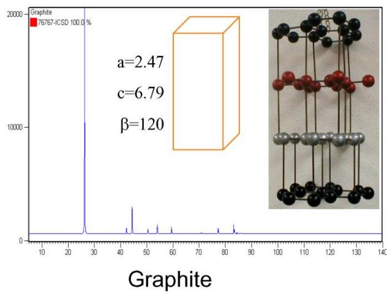

> 🧠 **[Cognis Multimodal Enrichment]**
> * **Classification:** Scientific Figure
> * **Extracted Text (OCR):** `Graphite, 76767-ICSD 100.0%, a=2.47, c=6.79, β=120, Graphite`
> * **VLM Visual Summary:** ### FIGURE TYPE:
>   Diffraction Pattern
>   
>   ### SCIENTIFIC PURPOSE:
>   This figure explains the use of powder diffraction data to identify the underlying structure of a material. Specifically, it demonstrates how the positions and intensities of diffraction peaks can be used to determine the phase of a material, such as graphite.
>   
>   ### KEY KNOWLEDGE:
>   1. **Bragg's Law of Diffraction**: The diffraction peaks are determined by Bragg's Law, which states that constructive interference occurs when the path difference between the incident and diffracted waves is an integer multiple of the wavelength.
>   2. **Crystal Structure**: The crystal structure of graphite is shown with its unit cell dimensions \(a = 2.47\), \(c = 6.79\), and the angle \(\beta = 120^\circ\).
>   3. **Phase Identification**: Different materials have distinct diffraction patterns. For example, graphite and diamond have different diffraction lines due to their different crystal structures.
>   4. **Powder Diffraction**: The diffraction pattern is obtained from a powdered sample where the crystalline domains are randomly oriented, resulting in a pattern of concentric rings.
>   
>   ### LABEL INTERPRETATION:
>   - **Graphite**: The diffraction pattern of graphite.
>   - **Unit Cell Dimensions**: \(a = 2.47\), \(c = 6.79\), and \(\beta = 120^\circ\).
>   
>   ### ENGINEERING/SCIENTIFIC INSIGHTS:
>   A reader should learn that powder diffraction is a powerful technique for identifying the phase of a material based on its diffraction pattern. This method is particularly useful for materials that are in powder form, allowing for the determination of their crystal structure without needing to know the specific crystal orientation.
>   
>   ### USER-RELEVANT INFORMATION:
>   - The positions and intensities of the diffraction peaks.
>   - The unit cell dimensions of graphite.
>   - The angle \(\beta\) of graphite.
>   - The diffraction pattern of graphite.
> * **Figure Caption:** The positions and the intensities of the peaks are used for identifying the underlying structure (or phase) of the material. For example, the diffraction lines of graphite would be different from diamond even though they both are made of carbon atoms. This phase identification is important because the material properties are highly dependent on structure (just think of graphite and diamond). | Powder diffraction data can be collected using either reflection or transmission geometry, as shown below.
> * **Surrounding Context (+/- 300 words):**
>   * **[Before]:** *... [Section: Powder Diffraction > Learning Objectives]  Introduction to Powder X-ray Diffracion  Bragg’s Law of Diffraction  Application of Powder XRD  Determination of an Unknown  Strengths and Limitations of X-ray Powder Diffraction [Section: Powder Diffraction > 15.1 Introduction to Powder X-ray Diffraction] Powder X-ray diffraction (PXRD) is perhaps the most widely used analytical technique for characterizing materials. As the name suggests, the sample is usually in a powdery form, consisting of fine grains of single crystalline material to be studied. The technique is also used widely for studying particles in liquid suspensions or polycrystalline solids (bulk or thin film materials). The term 'powder' really means that the crytalline domains are randomly oriented in the sample. Therefore when the 2-D diffraction pattern is recorded, it shows concentric rings of scattering peaks corresponding to the various d spacings in the crystal lattice. The positions and the intensities of the peaks are used for identifying the underlying structure (or phase) of the material. For example, the diffraction lines of graphite would be different from diamond even though they both are made of carbon atoms. This phase identification is important because the material properties are highly dependent on structure (just think of graphite and diamond).*
>   * **[After]:** *Powder diffraction data can be collected using either reflection or transmission geometry, as shown below. [Section: Powder Diffraction > 15.1 Introduction to Powder X-ray Diffraction] Because the particles in the powder sample are randomly oriented, these two methods will yield the same data. A powder XRD scan typically represents a plot of scattering intensity v/s. the scattering angle 2θ or the corresponding d-spacing. The peak positions, intensities, widths and shapes all provide important information about the structure of the material. The diffraction from ideal crystalline substances are characterized by well defined Bragg peaks in X-ray diffraction. The crystalline substances have long range order. The amorphous substances do not possess this long range order. So the diffraction from them do not show sharp Bragg peaks. In amorphous phase, X-rays will be scattered in many directions leading to a large bump distributed in a wide range (2θ) instead of high intensity narrower peaks. Max von Laue, in 1912, discovered that crystalline substances act as three-dimensional diffraction gratings for X-ray wavelengths similar to the spacing of planes in a crystal lattice. X-ray diffraction is based on constructive interference of monochromatic X-rays and a crystalline sample. These X-rays are generated by a cathode ray tube, filtered to produce monochromatic radiation, collimated to concentrate, and directed toward the sample. In principle, X-ray diffractometers consist of three basic elements: an X-ray tube, a sample holder, and an X-ray detector. [Section: Powder Diffraction > 15.1 Introduction to Powder X-ray Diffraction] The X-ray wavelengths are characteristic of the target material (Cu, Fe, Mo, Cr). Filtering, by foils or crystal monochrometers, is required to produce monochromatic X-rays needed for diffraction. $\mathrm { K } _ { { \mathfrak { a l } } }$ and $\mathrm { K } _ { 0 2 }$ are sufficiently close in wavelength ...*

Powder diffraction data can be collected using either reflection or transmission geometry, as shown below.

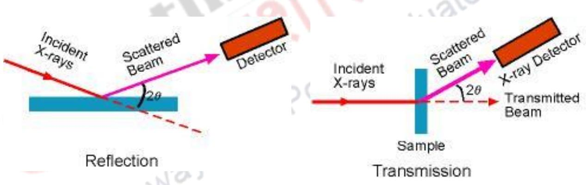

> 🧠 **[Cognis Multimodal Enrichment]**
> * **Classification:** Scientific Figure
> * **Extracted Text (OCR):** `Incident X-rays, Scattered Beam, Detector, Incident X-rays, Scattered Beam, X-ray Detector, Transmitted Beam, Sample, Reflection, Transmission, 2θ, 2θ`
> * **VLM Visual Summary:** ### FIGURE TYPE:
>   Experimental Setup
>   
>   ### SCIENTIFIC PURPOSE:
>   This figure illustrates the two primary geometries used in powder X-ray diffraction: reflection and transmission.
>   
>   ### KEY KNOWLEDGE:
>   1. **Reflection Geometry**: 
>      - Incident X-rays enter the sample at an angle.
>      - The scattered beam reflects off the sample surface.
>      - The scattered beam is detected by a detector.
>      - The angle between the incident beam and the scattered beam is \(2\theta\).
>   
>   2. **Transmission Geometry**:
>      - Incident X-rays pass through the sample.
>      - The transmitted beam is detected by an X-ray detector.
>      - The angle between the incident beam and the transmitted beam is \(2\theta\).
>   
>   ### LABEL INTERPRETATION:
>   - **Incident X-rays**: The incoming X-ray beam.
>   - **Scattered Beam**: The beam that has been deflected by the sample.
>   - **Detector**: The device used to measure the scattered beam.
>   - **Sample**: The material being analyzed.
>   - **Transmitted Beam**: The portion of the incident beam that passes through the sample without being scattered.
>   
>   ### ENGINEERING/SCIENTIFIC INSIGHTS:
>   A reader should learn that powder X-ray diffraction involves two distinct geometries: reflection and transmission. Both geometries are used to collect diffraction data from powdered samples. Reflection geometry measures the scattered beam that reflects off the sample's surface, while transmission geometry measures the scattered beam that passes through the sample. Understanding these geometries is crucial for interpreting diffraction patterns and determining the crystalline structure of materials.
>   
>   ### USER-RELEVANT INFORMATION:
>   The information provided in the figure helps answer future questions by illustrating how X-rays interact with a powdered sample in both reflection and transmission geometries. This understanding is essential for interpreting diffraction patterns and determining the crystalline structure of materials.
> * **Figure Caption:** Powder diffraction data can be collected using either reflection or transmission geometry, as shown below. | [Section: Powder Diffraction > 15.1 Introduction to Powder X-ray Diffraction]
> * **Surrounding Context (+/- 300 words):**
>   * **[Before]:** *... [Section: Powder Diffraction > Learning Objectives]  Introduction to Powder X-ray Diffracion  Bragg’s Law of Diffraction  Application of Powder XRD  Determination of an Unknown  Strengths and Limitations of X-ray Powder Diffraction [Section: Powder Diffraction > 15.1 Introduction to Powder X-ray Diffraction] Powder X-ray diffraction (PXRD) is perhaps the most widely used analytical technique for characterizing materials. As the name suggests, the sample is usually in a powdery form, consisting of fine grains of single crystalline material to be studied. The technique is also used widely for studying particles in liquid suspensions or polycrystalline solids (bulk or thin film materials). The term 'powder' really means that the crytalline domains are randomly oriented in the sample. Therefore when the 2-D diffraction pattern is recorded, it shows concentric rings of scattering peaks corresponding to the various d spacings in the crystal lattice. The positions and the intensities of the peaks are used for identifying the underlying structure (or phase) of the material. For example, the diffraction lines of graphite would be different from diamond even though they both are made of carbon atoms. This phase identification is important because the material properties are highly dependent on structure (just think of graphite and diamond). Powder diffraction data can be collected using either reflection or transmission geometry, as shown below.*
>   * **[After]:** *[Section: Powder Diffraction > 15.1 Introduction to Powder X-ray Diffraction] Because the particles in the powder sample are randomly oriented, these two methods will yield the same data. A powder XRD scan typically represents a plot of scattering intensity v/s. the scattering angle 2θ or the corresponding d-spacing. The peak positions, intensities, widths and shapes all provide important information about the structure of the material. The diffraction from ideal crystalline substances are characterized by well defined Bragg peaks in X-ray diffraction. The crystalline substances have long range order. The amorphous substances do not possess this long range order. So the diffraction from them do not show sharp Bragg peaks. In amorphous phase, X-rays will be scattered in many directions leading to a large bump distributed in a wide range (2θ) instead of high intensity narrower peaks. Max von Laue, in 1912, discovered that crystalline substances act as three-dimensional diffraction gratings for X-ray wavelengths similar to the spacing of planes in a crystal lattice. X-ray diffraction is based on constructive interference of monochromatic X-rays and a crystalline sample. These X-rays are generated by a cathode ray tube, filtered to produce monochromatic radiation, collimated to concentrate, and directed toward the sample. In principle, X-ray diffractometers consist of three basic elements: an X-ray tube, a sample holder, and an X-ray detector. [Section: Powder Diffraction > 15.1 Introduction to Powder X-ray Diffraction] The X-ray wavelengths are characteristic of the target material (Cu, Fe, Mo, Cr). Filtering, by foils or crystal monochrometers, is required to produce monochromatic X-rays needed for diffraction. $\mathrm { K } _ { { \mathfrak { a l } } }$ and $\mathrm { K } _ { 0 2 }$ are sufficiently close in wavelength such that a weighted average of the two is used. Copper is the most common ...*

Because the particles in the powder sample are randomly oriented, these two methods will yield the same data.

A powder XRD scan typically represents a plot of scattering intensity v/s. the scattering angle 2θ or the corresponding d-spacing. The peak positions, intensities, widths and shapes all provide important information about the structure of the material.

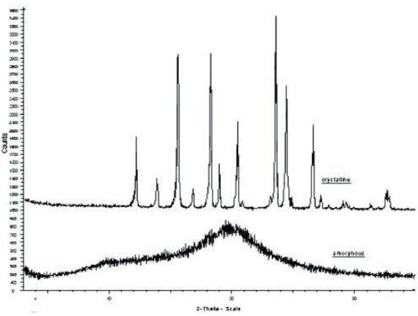

> 🧠 **[Cognis Multimodal Enrichment]**
> * **Classification:** Scientific Figure
> * **Extracted Text (OCR):** `crystalline, amorphous`
> * **VLM Visual Summary:** ### FIGURE TYPE:
>   Diffraction Pattern
>   
>   ### SCIENTIFIC PURPOSE:
>   This figure explains the difference between the diffraction patterns of crystalline and amorphous materials using X-ray diffraction (XRD).
>   
>   ### KEY KNOWLEDGE:
>   1. **Crystalline Materials**:
>      - Show well-defined Bragg peaks in X-ray diffraction.
>      - Have long-range order.
>      - Peaks are sharp and well-defined.
>      - Example: Graphite and diamond.
>   
>   2. **Amorphous Materials**:
>      - Do not show sharp Bragg peaks.
>      - Lack long-range order.
>      - Peaks are broad and diffuse.
>      - Example: Glass or plastic.
>   
>   ### LABEL INTERPRETATION:
>   - **"crystalline"**: Indicates the diffraction pattern of a crystalline material.
>   - **"amorphous"**: Indicates the diffraction pattern of an amorphous material.
>   
>   ### ENGINEERING/SCIENTIFIC INSIGHTS:
>   - The figure demonstrates how X-ray diffraction can distinguish between crystalline and amorphous materials.
>   - It highlights the key difference in peak shape and intensity between the two types of materials.
>   - This distinction is crucial for material characterization and understanding the structural properties of materials.
>   
>   ### USER-RELEVANT INFORMATION:
>   - The peak positions, intensities, widths, and shapes of the diffraction peaks provide important information about the structure of the material.
>   - The presence of sharp Bragg peaks in crystalline materials indicates long-range order.
>   - The absence of sharp peaks in amorphous materials indicates the lack of long-range order.
>   - This information can be used to identify the underlying structure of materials and understand their properties.
> * **Figure Caption:** A powder XRD scan typically represents a plot of scattering intensity v/s. the scattering angle 2θ or the corresponding d-spacing. The peak positions, intensities, widths and shapes all provide important information about the structure of the material. | The diffraction from ideal crystalline substances are characterized by well defined Bragg peaks in X-ray diffraction. The crystalline substances have long range order. The amorphous substances do not possess this long range order. So the diffraction from them do not show sharp Bragg peaks. In amorphous phase, X-rays will be scattered in many directions leading to a large bump distributed in a wide range (2θ) instead of high intensity narrower peaks.
> * **Surrounding Context (+/- 300 words):**
>   * **[Before]:** *... [Section: Powder Diffraction > Learning Objectives]  Introduction to Powder X-ray Diffracion  Bragg’s Law of Diffraction  Application of Powder XRD  Determination of an Unknown  Strengths and Limitations of X-ray Powder Diffraction [Section: Powder Diffraction > 15.1 Introduction to Powder X-ray Diffraction] Powder X-ray diffraction (PXRD) is perhaps the most widely used analytical technique for characterizing materials. As the name suggests, the sample is usually in a powdery form, consisting of fine grains of single crystalline material to be studied. The technique is also used widely for studying particles in liquid suspensions or polycrystalline solids (bulk or thin film materials). The term 'powder' really means that the crytalline domains are randomly oriented in the sample. Therefore when the 2-D diffraction pattern is recorded, it shows concentric rings of scattering peaks corresponding to the various d spacings in the crystal lattice. The positions and the intensities of the peaks are used for identifying the underlying structure (or phase) of the material. For example, the diffraction lines of graphite would be different from diamond even though they both are made of carbon atoms. This phase identification is important because the material properties are highly dependent on structure (just think of graphite and diamond). Powder diffraction data can be collected using either reflection or transmission geometry, as shown below. [Section: Powder Diffraction > 15.1 Introduction to Powder X-ray Diffraction] Because the particles in the powder sample are randomly oriented, these two methods will yield the same data. A powder XRD scan typically represents a plot of scattering intensity v/s. the scattering angle 2θ or the corresponding d-spacing. The peak positions, intensities, widths and shapes all provide important information about the structure of the material.*
>   * **[After]:** *The diffraction from ideal crystalline substances are characterized by well defined Bragg peaks in X-ray diffraction. The crystalline substances have long range order. The amorphous substances do not possess this long range order. So the diffraction from them do not show sharp Bragg peaks. In amorphous phase, X-rays will be scattered in many directions leading to a large bump distributed in a wide range (2θ) instead of high intensity narrower peaks. Max von Laue, in 1912, discovered that crystalline substances act as three-dimensional diffraction gratings for X-ray wavelengths similar to the spacing of planes in a crystal lattice. X-ray diffraction is based on constructive interference of monochromatic X-rays and a crystalline sample. These X-rays are generated by a cathode ray tube, filtered to produce monochromatic radiation, collimated to concentrate, and directed toward the sample. In principle, X-ray diffractometers consist of three basic elements: an X-ray tube, a sample holder, and an X-ray detector. [Section: Powder Diffraction > 15.1 Introduction to Powder X-ray Diffraction] The X-ray wavelengths are characteristic of the target material (Cu, Fe, Mo, Cr). Filtering, by foils or crystal monochrometers, is required to produce monochromatic X-rays needed for diffraction. $\mathrm { K } _ { { \mathfrak { a l } } }$ and $\mathrm { K } _ { 0 2 }$ are sufficiently close in wavelength such that a weighted average of the two is used. Copper is the most common target material for single-crystal diffraction, with $\operatorname { C u K } _ { \alpha } \operatorname { r a d i a t i o n } = 1 . 5 4 1 8 \mathrm { \AA }$ . These X-rays are collimated and directed onto the sample. As the sample and detector are rotated, the intensity of the reflected X-rays is recorded. When ...*

The diffraction from ideal crystalline substances are characterized by well defined Bragg peaks in X-ray diffraction. The crystalline substances have long range order. The amorphous substances do not possess this long range order. So the diffraction from them do not show sharp Bragg peaks. In amorphous phase, X-rays will be scattered in many directions leading to a large bump distributed in a wide range (2θ) instead of high intensity narrower peaks.

Max von Laue, in 1912, discovered that crystalline substances act as three-dimensional diffraction gratings for X-ray wavelengths similar to the spacing of planes in a crystal lattice. X-ray diffraction is based on constructive interference of monochromatic X-rays and a crystalline sample. These X-rays are generated by a cathode ray tube, filtered to produce monochromatic radiation, collimated to concentrate, and directed toward the sample. In principle, X-ray diffractometers consist of three basic elements: an X-ray tube, a sample holder, and an X-ray detector.

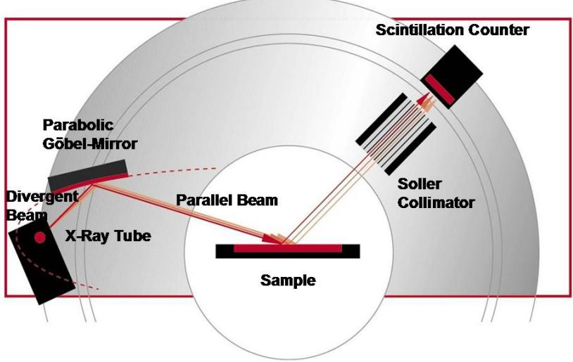

> 🧠 **[Cognis Multimodal Enrichment]**
> * **Classification:** Scientific Figure
> * **Extracted Text (OCR):** `Parabolic Gobel-Mirror, Divergent Beam, X-Ray Tube, Parallel Beam, Sample, Soller Collimator, Scintillation Counter`
> * **VLM Visual Summary:** ### FIGURE TYPE:
>   Instrument Schematic
>   
>   ### SCIENTIFIC PURPOSE:
>   This figure illustrates the experimental setup for powder X-ray diffraction (PXRD), which is used to determine the crystal structure of materials by analyzing the diffraction patterns produced by X-rays.
>   
>   ### KEY KNOWLEDGE:
>   1. **X-ray Tube**: The source of X-rays, which are generated by electrons轰击a target material (e.g., Cu, Fe, Mo, Cr).
>   2. **Parabolic Göbel-Mirror**: Reflects the divergent X-ray beam into a parallel beam.
>   3. **Divergent Beam**: The initial, divergent X-ray beam before it is focused.
>   4. **Parallel Beam**: The focused, parallel X-ray beam after being reflected by the Göbel-Mirror.
>   5. **Sample**: The material whose crystal structure is being analyzed.
>   6. **Soller Collimator**: Focuses the parallel beam onto the sample.
>   7. **Scintillation Counter**: Detects the diffracted X-rays and converts their intensity into a count rate.
>   8. **Bragg Equation**: Relates the wavelength of X-rays to the diffraction angle and the lattice spacing in a crystalline sample.
>   9. **Bragg Peaks**: Sharp peaks in the diffraction pattern that correspond to constructive interference.
>   
>   ### LABEL INTERPRETATION:
>   - **X-Ray Tube**: The source of X-rays.
>   - **Parabolic Göbel-Mirror**: Reflects the divergent X-ray beam into a parallel beam.
>   - **Divergent Beam**: The initial, divergent X-ray beam.
>   - **Parallel Beam**: The focused, parallel X-ray beam.
>   - **Sample**: The material being analyzed.
>   - **Soller Collimator**: Focuses the parallel beam onto the sample.
>   - **Scintillation Counter**: Detects the diffracted X-rays.
>   
>   ### ENGINEERING/SCIENTIFIC INSIGHTS:
>   A reader should learn that PXRD involves focusing X-rays onto a sample, where they interact with the crystal structure, producing diffracted X-rays. These diffracted X-rays are then detected and analyzed to determine the crystal structure of the material.
>   
>   ### USER-RELEVANT INFORMATION:
>   The information provided in the figure helps answer questions about the process of powder X-ray diffraction, including the role of each component (X-ray tube, Göbel-Mirror, collimator, and scintillation counter) and how they contribute to the detection and analysis of
> * **Figure Caption:** [Section: Powder Diffraction > 15.1 Introduction to Powder X-ray Diffraction] | The X-ray wavelengths are characteristic of the target material (Cu, Fe, Mo, Cr). Filtering, by foils or crystal monochrometers, is required to produce monochromatic X-rays needed for diffraction. $\mathrm { K } _ { { \mathfrak { a l } } }$ and $\mathrm { K } _ { 0 2 }$ are sufficiently close in wavelength such that a weighted average of the two is used. Copper is the most common target material for single-crystal diffraction, with $\operatorname { C u K } _ { \alpha } \operatorname { r a d i a t i o n } = 1 . 5 4 1 8 \mathrm { \AA }$ . These X-rays are collimated and directed onto the sample. As the sample and detector are rotated, the intensity of the reflected X-rays is recorded. When the geometry of the incident X-rays impinging the sample satisfies the Bragg Equation, constructive interference occurs and a peak in intensity occurs. A detector records and processes this X-ray signal and converts the signal to a count rate which is then output to a device such as a printer or computer monitor.
> * **Surrounding Context (+/- 300 words):**
>   * **[Before]:** *... intensities of the peaks are used for identifying the underlying structure (or phase) of the material. For example, the diffraction lines of graphite would be different from diamond even though they both are made of carbon atoms. This phase identification is important because the material properties are highly dependent on structure (just think of graphite and diamond). Powder diffraction data can be collected using either reflection or transmission geometry, as shown below. [Section: Powder Diffraction > 15.1 Introduction to Powder X-ray Diffraction] Because the particles in the powder sample are randomly oriented, these two methods will yield the same data. A powder XRD scan typically represents a plot of scattering intensity v/s. the scattering angle 2θ or the corresponding d-spacing. The peak positions, intensities, widths and shapes all provide important information about the structure of the material. The diffraction from ideal crystalline substances are characterized by well defined Bragg peaks in X-ray diffraction. The crystalline substances have long range order. The amorphous substances do not possess this long range order. So the diffraction from them do not show sharp Bragg peaks. In amorphous phase, X-rays will be scattered in many directions leading to a large bump distributed in a wide range (2θ) instead of high intensity narrower peaks. Max von Laue, in 1912, discovered that crystalline substances act as three-dimensional diffraction gratings for X-ray wavelengths similar to the spacing of planes in a crystal lattice. X-ray diffraction is based on constructive interference of monochromatic X-rays and a crystalline sample. These X-rays are generated by a cathode ray tube, filtered to produce monochromatic radiation, collimated to concentrate, and directed toward the sample. In principle, X-ray diffractometers consist of three basic elements: an X-ray tube, a sample holder, and an X-ray detector. [Section: Powder Diffraction > 15.1 Introduction to Powder X-ray Diffraction]*
>   * **[After]:** *The X-ray wavelengths are characteristic of the target material (Cu, Fe, Mo, Cr). Filtering, by foils or crystal monochrometers, is required to produce monochromatic X-rays needed for diffraction. $\mathrm { K } _ { { \mathfrak { a l } } }$ and $\mathrm { K } _ { 0 2 }$ are sufficiently close in wavelength such that a weighted average of the two is used. Copper is the most common target material for single-crystal diffraction, with $\operatorname { C u K } _ { \alpha } \operatorname { r a d i a t i o n } = 1 . 5 4 1 8 \mathrm { \AA }$ . These X-rays are collimated and directed onto the sample. As the sample and detector are rotated, the intensity of the reflected X-rays is recorded. When the geometry of the incident X-rays impinging the sample satisfies the Bragg Equation, constructive interference occurs and a peak in intensity occurs. A detector records and processes this X-ray signal and converts the signal to a count rate which is then output to a device such as a printer or computer monitor. [Section: Powder Diffraction > 15.1 Introduction to Powder X-ray Diffraction] The interaction of the incident rays with the sample produces constructive interference (and a diffracted ray) when conditions satisfy Bragg's Law. This law relates the wavelength of electromagnetic radiation to the diffraction angle and the lattice spacing in a crystalline sample. These diffracted X-rays are then detected, processed and counted. By scanning the sample through a range of 2θ angles, all possible diffraction directions of the lattice should be attained due to the random orientation of the powdered material. Conversion of the diffraction peaks to d-spacings allows identification of the material because each material has a set of unique d-spacings. Typically, ...*

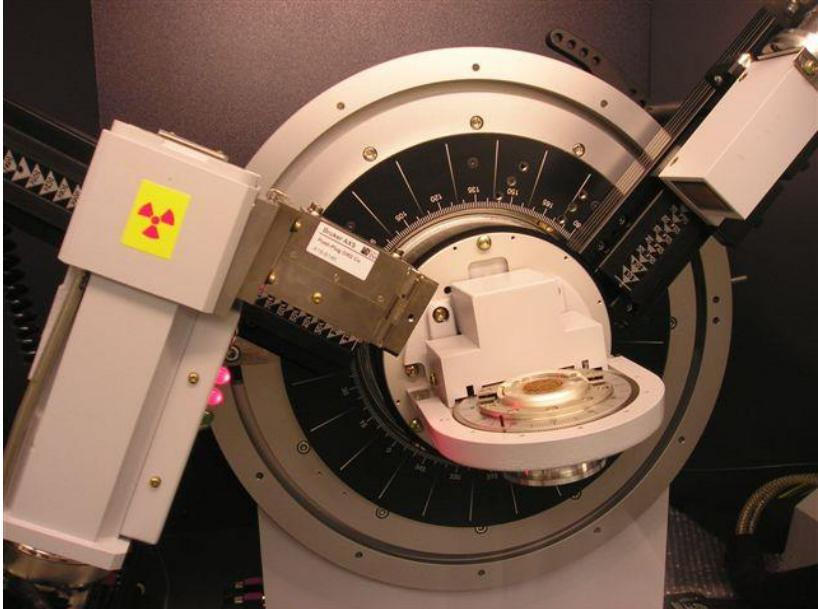

> 🧠 **[Cognis Multimodal Enrichment]**
> * **Classification:** Scientific Figure
> * **VLM Visual Summary:** **FIGURE TYPE:** 
>   - **Instrument Schematic**
>   
>   **SCIENTIFIC PURPOSE:** 
>   This figure illustrates the internal components and layout of a powder X-ray diffraction (PXRD) instrument, specifically focusing on the X-ray source, sample holder, and detector.
>   
>   **KEY KNOWLEDGE:**
>   1. **X-ray Source:** The X-ray tube is depicted at the top left, emitting monochromatic X-rays.
>   2. **Sample Holder:** The central part of the instrument shows the sample holder where the powdered sample is placed.
>   3. **Detector:** The bottom right section indicates the detector, which records the diffraction pattern.
>   4. **Filtering Mechanism:** The presence of foils or crystal monochromators suggests the filtering process necessary to produce monochromatic X-rays.
>   5. **Bragg Equation:** The figure highlights the importance of satisfying the Bragg Equation for constructive interference, which leads to the formation of diffraction peaks.
>   
>   **LABEL INTERPRETATION:**
>   - **X-ray Tube:** The X-ray tube is labeled with the symbol for radiation.
>   - **Sample Holder:** The sample holder is labeled with the word "Sample."
>   - **Detector:** The detector is labeled with the word "Detector."
>   
>   **ENGINEERING/SCIENTIFIC INSIGHTS:**
>   A reader should learn that PXRD instruments use monochromatic X-rays to analyze the crystalline structure of materials. The key components include the X-ray source, sample holder, and detector. The instrument must filter the X-rays to produce monochromatic radiation, which is essential for accurate diffraction patterns. The Bragg Equation plays a crucial role in determining the diffraction angles and identifying the crystalline phases of materials.
>   
>   **USER-RELEVANT INFORMATION:**
>   The information provided in the figure helps answer questions about the internal workings of PXRD instruments, the role of X-rays in diffraction, and how to interpret diffraction patterns to identify materials. Understanding the components and their functions is crucial for interpreting PXRD data accurately.
> * **Figure Caption:** [Section: Powder Diffraction > 15.1 Introduction to Powder X-ray Diffraction] | The X-ray wavelengths are characteristic of the target material (Cu, Fe, Mo, Cr). Filtering, by foils or crystal monochrometers, is required to produce monochromatic X-rays needed for diffraction. $\mathrm { K } _ { { \mathfrak { a l } } }$ and $\mathrm { K } _ { 0 2 }$ are sufficiently close in wavelength such that a weighted average of the two is used. Copper is the most common target material for single-crystal diffraction, with $\operatorname { C u K } _ { \alpha } \operatorname { r a d i a t i o n } = 1 . 5 4 1 8 \mathrm { \AA }$ . These X-rays are collimated and directed onto the sample. As the sample and detector are rotated, the intensity of the reflected X-rays is recorded. When the geometry of the incident X-rays impinging the sample satisfies the Bragg Equation, constructive interference occurs and a peak in intensity occurs. A detector records and processes this X-ray signal and converts the signal to a count rate which is then output to a device such as a printer or computer monitor.
> * **Surrounding Context (+/- 300 words):**
>   * **[Before]:** *... intensities of the peaks are used for identifying the underlying structure (or phase) of the material. For example, the diffraction lines of graphite would be different from diamond even though they both are made of carbon atoms. This phase identification is important because the material properties are highly dependent on structure (just think of graphite and diamond). Powder diffraction data can be collected using either reflection or transmission geometry, as shown below. [Section: Powder Diffraction > 15.1 Introduction to Powder X-ray Diffraction] Because the particles in the powder sample are randomly oriented, these two methods will yield the same data. A powder XRD scan typically represents a plot of scattering intensity v/s. the scattering angle 2θ or the corresponding d-spacing. The peak positions, intensities, widths and shapes all provide important information about the structure of the material. The diffraction from ideal crystalline substances are characterized by well defined Bragg peaks in X-ray diffraction. The crystalline substances have long range order. The amorphous substances do not possess this long range order. So the diffraction from them do not show sharp Bragg peaks. In amorphous phase, X-rays will be scattered in many directions leading to a large bump distributed in a wide range (2θ) instead of high intensity narrower peaks. Max von Laue, in 1912, discovered that crystalline substances act as three-dimensional diffraction gratings for X-ray wavelengths similar to the spacing of planes in a crystal lattice. X-ray diffraction is based on constructive interference of monochromatic X-rays and a crystalline sample. These X-rays are generated by a cathode ray tube, filtered to produce monochromatic radiation, collimated to concentrate, and directed toward the sample. In principle, X-ray diffractometers consist of three basic elements: an X-ray tube, a sample holder, and an X-ray detector. [Section: Powder Diffraction > 15.1 Introduction to Powder X-ray Diffraction]*
>   * **[After]:** *The X-ray wavelengths are characteristic of the target material (Cu, Fe, Mo, Cr). Filtering, by foils or crystal monochrometers, is required to produce monochromatic X-rays needed for diffraction. $\mathrm { K } _ { { \mathfrak { a l } } }$ and $\mathrm { K } _ { 0 2 }$ are sufficiently close in wavelength such that a weighted average of the two is used. Copper is the most common target material for single-crystal diffraction, with $\operatorname { C u K } _ { \alpha } \operatorname { r a d i a t i o n } = 1 . 5 4 1 8 \mathrm { \AA }$ . These X-rays are collimated and directed onto the sample. As the sample and detector are rotated, the intensity of the reflected X-rays is recorded. When the geometry of the incident X-rays impinging the sample satisfies the Bragg Equation, constructive interference occurs and a peak in intensity occurs. A detector records and processes this X-ray signal and converts the signal to a count rate which is then output to a device such as a printer or computer monitor. [Section: Powder Diffraction > 15.1 Introduction to Powder X-ray Diffraction] The interaction of the incident rays with the sample produces constructive interference (and a diffracted ray) when conditions satisfy Bragg's Law. This law relates the wavelength of electromagnetic radiation to the diffraction angle and the lattice spacing in a crystalline sample. These diffracted X-rays are then detected, processed and counted. By scanning the sample through a range of 2θ angles, all possible diffraction directions of the lattice should be attained due to the random orientation of the powdered material. Conversion of the diffraction peaks to d-spacings allows identification of the material because each material has a set of unique d-spacings. Typically, ...*
  
The X-ray wavelengths are characteristic of the target material (Cu, Fe, Mo, Cr). Filtering, by foils or crystal monochrometers, is required to produce monochromatic X-rays needed for diffraction. $\mathrm { K } _ { { \mathfrak { a l } } }$ and $\mathrm { K } _ { 0 2 }$ are sufficiently close in wavelength such that a weighted average of the two is used. Copper is the most common target material for single-crystal diffraction, with $\operatorname { C u K } _ { \alpha } \operatorname { r a d i a t i o n } = 1 . 5 4 1 8 \mathrm { \AA }$ . These X-rays are collimated and directed onto the sample. As the sample and detector are rotated, the intensity of the reflected X-rays is recorded. When the geometry of the incident X-rays impinging the sample satisfies the Bragg Equation, constructive interference occurs and a peak in intensity occurs. A detector records and processes this X-ray signal and converts the signal to a count rate which is then output to a device such as a printer or computer monitor.

The interaction of the incident rays with the sample produces constructive interference (and a diffracted ray) when conditions satisfy Bragg's Law. This law relates the wavelength of electromagnetic radiation to the diffraction angle and the lattice spacing in a crystalline sample. These diffracted X-rays are then detected, processed and counted. By scanning the sample through a range of 2θ angles, all possible diffraction directions of the lattice should be attained due to the random orientation of the powdered material. Conversion of the diffraction peaks to d-spacings allows identification of the material because each material has a set of unique d-spacings. Typically, this is achieved by comparison of dspacings with standard reference patterns.

## BRAGG'SLAWOFDIFFRACTION

Nopeakisobservedunlesstheconditionforconstructiveinterference (δ=n,with nan integer)ispreciselymet:

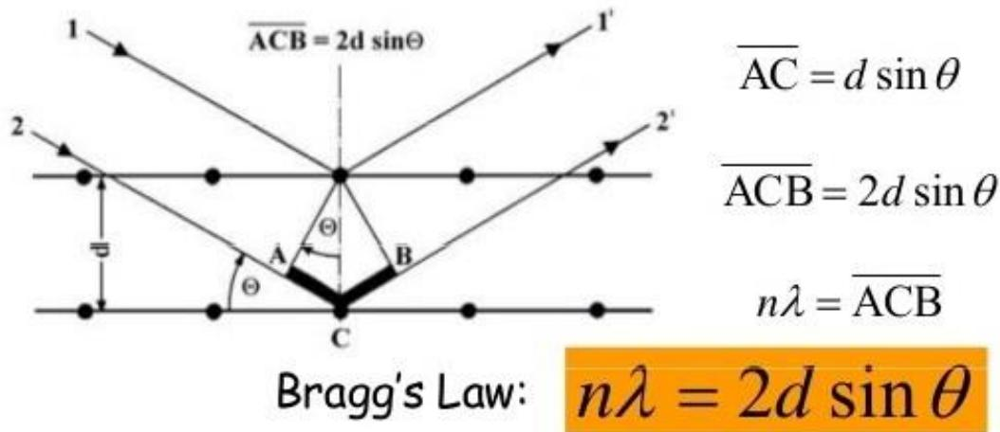

> 🧠 **[Cognis Multimodal Enrichment]**
> * **Classification:** Scientific Figure
> * **Extracted Text (OCR):** `Bragg's Law: nλ = 2d sinθ`
> * **VLM Visual Summary:** ### FIGURE TYPE:
>   **Diffraction Pattern**
>   
>   ### SCIENTIFIC PURPOSE:
>   This figure explains Bragg's Law, which describes the condition under which constructive interference occurs in a crystal lattice, leading to the formation of diffraction peaks.
>   
>   ### KEY KNOWLEDGE:
>   1. **Bragg's Law**: \( n\lambda = 2d\sin\theta \)
>      - Where \( n \) is an integer (the order of the reflection),
>      - \( \lambda \) is the wavelength of the incident X-rays,
>      - \( d \) is the distance between lattice planes,
>      - \( \theta \) is the angle of incidence relative to the lattice planes.
>   
>   2. **Constructive Interference**: For constructive interference to occur, the path difference between the incident and reflected beams must be an integer multiple of the wavelength (\( n\lambda \)).
>   
>   3. **Bragg Reflection**: The condition for constructive interference is met when \( \theta = \frac{n\pi}{d} \), where \( n \) is an integer.
>   
>   4. **Crystal Lattice**: The crystal lattice consists of repeating units of atoms or molecules arranged in a three-dimensional space.
>   
>   5. **X-ray Diffraction**: X-rays interact with the crystal lattice, causing them to diffract (bend) and reflect back in different directions depending on the crystal structure.
>   
>   6. **Bragg Reflections**: The reflected beams interfere constructively at specific angles, leading to the formation of diffraction peaks.
>   
>   ### LABEL INTERPRETATION:
>   - **A**: Center point of the crystal lattice.
>   - **B**: Point where the incident beam reflects.
>   - **C**: Point where the reflected beam intersects with another beam.
>   - **d**: Distance between adjacent lattice planes.
>   - **θ**: Angle of incidence relative to the lattice planes.
>   
>   ### ENGINEERING/SCIENTIFIC INSIGHTS:
>   - **Understanding Crystal Structures**: This figure helps in understanding how crystals diffract X-rays based on their internal structure.
>   - **Bragg Reflections**: It illustrates why certain angles result in constructive interference, leading to diffraction peaks.
>   - **Bragg's Law**: Provides a mathematical relationship between the wavelength of X-rays, the lattice spacing, and the diffraction angle.
>   
>   ### USER-RELEVANT INFORMATION:
>   - **Bragg's Law Equation**: \( n\lambda = 2d\sin\theta \)
>   - **Constructive Interference
> * **Figure Caption:** Nopeakisobservedunlesstheconditionforconstructiveinterference (δ=n,with nan integer)ispreciselymet: | When Bragg'sLawissatisfied,"reflected"beamsareinphase andinterfereconstructively.Specular"reflections"can occuronlyat theseangles.
> * **Surrounding Context (+/- 300 words):**
>   * **[Before]:** *... required to produce monochromatic X-rays needed for diffraction. $\mathrm { K } _ { { \mathfrak { a l } } }$ and $\mathrm { K } _ { 0 2 }$ are sufficiently close in wavelength such that a weighted average of the two is used. Copper is the most common target material for single-crystal diffraction, with $\operatorname { C u K } _ { \alpha } \operatorname { r a d i a t i o n } = 1 . 5 4 1 8 \mathrm { \AA }$ . These X-rays are collimated and directed onto the sample. As the sample and detector are rotated, the intensity of the reflected X-rays is recorded. When the geometry of the incident X-rays impinging the sample satisfies the Bragg Equation, constructive interference occurs and a peak in intensity occurs. A detector records and processes this X-ray signal and converts the signal to a count rate which is then output to a device such as a printer or computer monitor. [Section: Powder Diffraction > 15.1 Introduction to Powder X-ray Diffraction] The interaction of the incident rays with the sample produces constructive interference (and a diffracted ray) when conditions satisfy Bragg's Law. This law relates the wavelength of electromagnetic radiation to the diffraction angle and the lattice spacing in a crystalline sample. These diffracted X-rays are then detected, processed and counted. By scanning the sample through a range of 2θ angles, all possible diffraction directions of the lattice should be attained due to the random orientation of the powdered material. Conversion of the diffraction peaks to d-spacings allows identification of the material because each material has a set of unique d-spacings. Typically, this is achieved by comparison of dspacings with standard reference patterns. [Section: Powder Diffraction > BRAGG'SLAWOFDIFFRACTION] Nopeakisobservedunlesstheconditionforconstructiveinterference (δ=n,with nan integer)ispreciselymet:*
>   * **[After]:** *When Bragg'sLawissatisfied,"reflected"beamsareinphase andinterfereconstructively.Specular"reflections"can occuronlyat theseangles. The geometry of an X-ray diffractometer is such that the sample rotates in the path of the collimated X-ray beam at an angle θ while the X-ray detector is mounted on an arm to collect the diffracted X-rays and rotates at an angle of 2θ. The instrument used to maintain the angle and rotate the sample is termed a goniometer. For typical powder patterns, data is collected at 2θ from ${ \sim } 5 ^ { \circ }$ to 70°, angles that are preset in the X-ray scan. [Section: Powder Diffraction > Top-loading a bulk powder into a well:] 1) Deposit powder in a shallow well of a sample holder. Use a slightly rough flat surface to press down on the powder, packing it into the well. 2) Using a slightly rough surface to pack the powder can help minimize preferred orientation. 3) Mixing the sample with filler such as flour or glass powder may also help minimize preferred orientation. 4) Powder may need to be mixed with a binder to prevent it from falling out of the sample holder 5) Alternatively, the well of the sample holder can be coated with a thin layer of Vaseline. [Section: Powder Diffraction > Dispersing a thin powder layer on a smooth surface:] 1) A smooth surface such as a glass slide or a Zero Background Holder (ZBH) may be used to hold a thin layer of powder. a) glass will contribute an amorphous hump to the diffraction pattern. b) the ZBH avoids this problem by using an off-axis cut single crystal. 2) Dispersing the powder with alcohol onto the sample holder and then allowing the alcohol to evaporate, often provides a nice, even coating of powder that will adhere to the sample holder. 3) Powder may be ...*
  
When Bragg'sLawissatisfied,"reflected"beamsareinphase andinterfereconstructively.Specular"reflections"can occuronlyat theseangles.

The geometry of an X-ray diffractometer is such that the sample rotates in the path of the collimated X-ray beam at an angle θ while the X-ray detector is mounted on an arm to collect the diffracted X-rays and rotates at an angle of 2θ. The instrument used to maintain the angle and rotate the sample is termed a goniometer. For typical powder patterns, data is collected at 2θ from ${ \sim } 5 ^ { \circ }$ to 70°, angles that are preset in the X-ray scan.

## 15.2. Ways to prepare a powder sample

## Top-loading a bulk powder into a well:

1) Deposit powder in a shallow well of a sample holder. Use a slightly rough flat surface to press down on the powder, packing it into the well.

2) Using a slightly rough surface to pack the powder can help minimize preferred orientation.

3) Mixing the sample with filler such as flour or glass powder may also help minimize preferred orientation.

4) Powder may need to be mixed with a binder to prevent it from falling out of the sample holder

5) Alternatively, the well of the sample holder can be coated with a thin layer of Vaseline.

## Dispersing a thin powder layer on a smooth surface:

1) A smooth surface such as a glass slide or a Zero Background Holder (ZBH) may be used to hold a thin layer of powder.

a) glass will contribute an amorphous hump to the diffraction pattern.

b) the ZBH avoids this problem by using an off-axis cut single crystal.

2) Dispersing the powder with alcohol onto the sample holder and then allowing the alcohol to evaporate, often provides a nice, even coating of powder that will adhere to the sample holder.

3) Powder may be gently sprinkled onto a piece of double-sided tape or a thin layer of Vaseline to adhere it to the sample holder.

a) The double-sided tape will contribute to the diffraction pattern.

4) These methods are necessary for mounting small amounts of powder.

5) These methods help alleviate problems with preferred orientation.

6) The constant volume assumption is not valid for this type of sample, and so quantitative and Rietveld analysis will require extra work and may not be possible.

## Important characteristics of samples for XRPD:

## 1) A flat plate sample for XRPD should have a smooth flat surface

If the surface is not smooth and flat, X-ray absorption may reduce the intensity of low angle peaks.

Parallel-beam optics can be used to analyze samples with odd shapes or rough surfaces

## 2) Densely packed

3) Randomly oriented grains/crystallites

4) Grain size less than 10 microns infinitely thick

## 15.3. Applications

X-ray powder diffraction is most widely used for the identification of unknown crystalline materials (e.g. minerals, inorganic compounds). Determination of unknown solids is critical to studies in geology, environmental science, material science, engineering and biology.

Other applications include:

characterization of crystalline materials

identification of fine-grained minerals such as clays

 determination of unit cell dimensions

measurement of sample purity

## With specialized techniques, XRD can be used to:

 determine crystal structures using Rietveld refinement

determine the amounts of minerals (quantitative analysis)

characterize thin films samples by:

o determining lattice mismatch between film and substrate and to inferring stress and strain

o determining dislocation density and quality of the film by rocking curve measurements

o measuring superlattices in multilayered epitaxial structures

o determining the thickness, roughness and density of the film using glancing incidence Xray reflectivity measurements

 make textural measurements, such as the orientation of grains, in a polycrystalline sample

## 15.4. Strengths and Limitations of X-ray Powder Diffraction (XRD)?

## Strengths

 Powerful and rapid (< 20 min) technique for identification of an unknown mineral

 In most cases, it provides an unambiguous mineral determination

Minimal sample preparation is required

XRD units are widely available

Data interpretation is relatively straight forward

## Limitations

Homogeneous and single phase material is best for identification of an unknown

 Must have access to a standard reference file of inorganic compounds (d-spacings, hkl’s)

Requires atleast 100 mg of material which must be ground into a powder

 For unit cell determinations, indexing of patterns for non-isometric crystal systems is complicated

 Peak overlay may occur and worsens for high angle 'reflections'

Determination of an unknown requires: the material, an instrument for grinding, and a sample holder.

Obtain a few tenths of a gram (or more) of the material, as pure as possible

Grind the sample to a fine powder, typically in a fluid to minimize inducing extra strain (surface energy) that can offset peak positions, and to randomize orientation. Powder less than \~10 μm(or 200-mesh) in size is preferred

Place into a sample holder or onto the sample surface:

## 15.5. Determination of an Unknown

The d-spacing of each peak is then obtained by solution of the Bragg equation for the appropriate value of λ. Once all d-spacings have been determined, automated search/match routines compare the d’s of the unknown to those of known materials. Because each mineral has a unique set of d-spacings, matching these d-spacings provides an identification of the unknown sample.

> 🧠 **[Cognis Multimodal Enrichment]**
> * **Classification:** Logo / Decorative Image (filtered out)

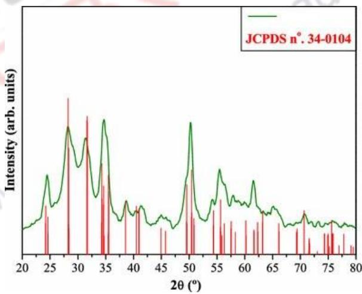

> 🧠 **[Cognis Multimodal Enrichment]**
> * **Classification:** Scientific Figure
> * **Extracted Text (OCR):** `JCPDS n° 34-0104`
> * **VLM Visual Summary:** ### FIGURE TYPE:
>   Diffraction Pattern
>   
>   ### SCIENTIFIC PURPOSE:
>   This figure illustrates a powder diffraction pattern, which is used to identify the crystalline structure of a material based on its diffraction peaks. The diffraction pattern is a graphical representation of the intensity of diffracted radiation as a function of the angle of incidence (2θ).
>   
>   ### KEY KNOWLEDGE:
>   1. **Powder Diffraction**: This technique involves scattering of X-rays or neutrons by powdered samples to produce a diffraction pattern.
>   2. **Bragg Equation**: The diffraction peaks are calculated using the Bragg equation \( n\lambda = 2d\sin\theta \), where \( n \) is an integer, \( \lambda \) is the wavelength of the incident radiation, \( d \) is the spacing between lattice planes, and \( \theta \) is the Bragg angle.
>   3. **Identification Process**: By comparing the d-spacings of the unknown sample with those of known materials in a database like the Powder Diffraction File (PDF), the unknown sample can be identified.
>   4. **Intensity and Peak Position**: The intensity of the diffraction peaks indicates the relative abundance of the corresponding crystallographic planes in the sample.
>   
>   ### LABEL INTERPRETATION:
>   - **Intensity (arb. units)**: Represents the intensity of the diffracted radiation.
>   - **2θ (°)**: The angle of incidence at which the diffracted radiation is detected.
>   
>   ### ENGINEERING/SCIENTIFIC INSIGHTS:
>   - **Identification of Materials**: The diffraction pattern provides a quick and reliable method to identify the crystalline structure of a material.
>   - **Sample Preparation**: The sample needs to be ground into a fine powder to ensure uniformity and minimize strain effects.
>   - **Data Interpretation**: The diffraction pattern must be interpreted carefully to match the d-spacings with known materials in a database.
>   
>   ### USER-RELEVANT INFORMATION:
>   - **D-Spacings**: The d-spacings of the diffraction peaks provide key structural information about the material.
>   - **PDF Database**: The Powder Diffraction File (PDF) contains d-spacings for thousands of inorganic compounds, making it a valuable resource for material identification.
>   - **Sample Size**: Typically, a few tenths of a gram of the material is needed, but ideally, a finer powder (less than ~10 μm) is preferred to minimize strain effects and
> * **Figure Caption:** The d-spacing of each peak is then obtained by solution of the Bragg equation for the appropriate value of λ. Once all d-spacings have been determined, automated search/match routines compare the d’s of the unknown to those of known materials. Because each mineral has a unique set of d-spacings, matching these d-spacings provides an identification of the unknown sample. | A systematic procedure is used by ordering the d-spacings in terms of their intensity beginning with the most intense peak. Files of d-spacings for hundreds of thousands of inorganic compounds are available from the International Centre for Diffraction Data as the Powder Diffraction File (PDF). Many other sites contain d-spacings of minerals such as the American Mineralogist Crystal Structure Database. Commonly this information is an integral portion of the software that comes with the instrumentation.
> * **Surrounding Context (+/- 300 words):**
>   * **[Before]:** *... rocking curve measurements o measuring superlattices in multilayered epitaxial structures o determining the thickness, roughness and density of the film using glancing incidence Xray reflectivity measurements  make textural measurements, such as the orientation of grains, in a polycrystalline sample [Section: Powder Diffraction > Strengths]  Powerful and rapid (< 20 min) technique for identification of an unknown mineral  In most cases, it provides an unambiguous mineral determination Minimal sample preparation is required XRD units are widely available Data interpretation is relatively straight forward [Section: Powder Diffraction > Limitations] Homogeneous and single phase material is best for identification of an unknown  Must have access to a standard reference file of inorganic compounds (d-spacings, hkl’s) Requires atleast 100 mg of material which must be ground into a powder  For unit cell determinations, indexing of patterns for non-isometric crystal systems is complicated  Peak overlay may occur and worsens for high angle 'reflections' Determination of an unknown requires: the material, an instrument for grinding, and a sample holder. Obtain a few tenths of a gram (or more) of the material, as pure as possible Grind the sample to a fine powder, typically in a fluid to minimize inducing extra strain (surface energy) that can offset peak positions, and to randomize orientation. Powder less than \~10 μm(or 200-mesh) in size is preferred Place into a sample holder or onto the sample surface: [Section: Powder Diffraction > 15.5. Determination of an Unknown] The d-spacing of each peak is then obtained by solution of the Bragg equation for the appropriate value of λ. Once all d-spacings have been determined, automated search/match routines compare the d’s of the unknown to those of known materials. Because each mineral has a unique set of d-spacings, matching these d-spacings provides an identification of the unknown sample.*
>   * **[After]:** *A systematic procedure is used by ordering the d-spacings in terms of their intensity beginning with the most intense peak. Files of d-spacings for hundreds of thousands of inorganic compounds are available from the International Centre for Diffraction Data as the Powder Diffraction File (PDF). Many other sites contain d-spacings of minerals such as the American Mineralogist Crystal Structure Database. Commonly this information is an integral portion of the software that comes with the instrumentation. [Section: Powder Diffraction > 15.5. Determination of an Unknown] <table><tr><td colspan="10">PDF #461212,Wavelength = 1.540562 (A) -□</td></tr><tr><td>46-1212 Quality: *</td><td colspan="8">cx-Al2 03</td></tr><tr><td>CAS Number:</td><td colspan="10" rowspan="2">Aluminum Oxide Ref: Huang,T et al.,Adv.X-Ray Anal.,33, 295 [1990]</td></tr><tr><td>Molecular Weight:101.96</td></tr><tr><td>Volume[CD]:254.81 Dx3.987 Dm</td><td rowspan="2">4</td><td colspan="8"></td></tr><tr><td>Sys: Hexagonal Lattice:_Rhomb-centered</td><td></td><td></td><td></td><td></td><td></td><td></td><td>0660</td><td></td></tr><tr><td>S.G.: R3c [167] Cell Parameters:</td><td>ptrej g spexi</td><td colspan="2"></td><td></td><td colspan="2"></td><td></td><td></td><td></td><td></td><td></td></tr><tr><td>a 4.758b c 12.99 x β Y</td><td></td><td></td><td></td><td></td><td></td><td></td><td>1.5</td><td>1.3</td><td></td><td></td><td></td></tr><tr><td>SS/FOM: F25=358(.0028, 25)</td><td></td><td></td><td>5.9</td><td>3.0</td><td></td><td>2.0</td><td></td><td></td><td></td><td>d[A]</td><td></td></tr><tr><td>I/lcor: Rad:CuKa1</td><td>dA]</td><td>Int-f</td><td>h</td><td>k 一</td><td>[A]</td><td>Int-f</td><td>h k</td><td>一</td><td>dA]</td><td>Int-f h k</td><td></td></tr><tr><td>Lambda: 1.540562</td><td>3.4797</td><td>45</td><td>0</td><td>24 1</td><td>1.5150</td><td>214</td><td>1 2</td><td>284058</td><td>1.1897</td><td>2 20</td><td></td></tr><tr><td>Filter:</td><td>2.5508</td><td>100</td><td>1</td><td>0</td><td>1.5110</td><td></td><td>0 1</td><td></td><td>1.1600</td><td>21 3</td><td>0 6</td></tr><tr><td>d-sp: diffractometer</td><td>2.3794</td><td>21</td><td>1 1</td><td>0</td><td>1.4045</td><td>23</td><td>2 1</td><td></td><td>1.1472</td><td>3 2</td><td>2 3</td></tr><tr><td>Mineral Name:</td><td></td><td></td><td>0</td><td>0 6</td><td>1.3737</td><td>27</td><td>3 0</td><td></td><td>1.1386</td><td>&lt;1 1</td><td>3 1</td></tr><tr><td>Corundum, syn</td><td>2.1654</td><td></td><td></td><td></td><td>1.3359</td><td></td><td>1 2</td><td></td><td>1.1256</td><td>3</td><td>2</td></tr><tr><td></td><td>2.0853</td><td>266134</td><td>12012</td><td>3 1</td><td>1.2755</td><td>1228</td><td>2</td><td>0</td><td>1.1241</td><td>1</td><td>8</td></tr><tr><td></td><td>1.9643</td><td></td><td></td><td>0 2 2 4</td><td>1.2391</td><td></td><td>1</td><td>010</td><td>1.0990</td><td>239 0</td><td>210</td></tr><tr><td></td><td>1.7400</td><td>89</td><td></td><td>1 6</td><td>1.2343</td><td>12</td><td>1</td><td>1 9</td><td></td><td></td><td></td></tr><tr><td></td><td>1.6015</td><td></td><td>Y</td><td></td><td>1.1931</td><td>1</td><td>2</td><td>1 7</td><td></td><td></td><td></td></tr><tr><td></td><td>1.5466</td><td>1</td><td></td><td>1</td><td></td><td></td><td></td><td></td><td></td><td></td><td></td></tr></table> [Section: Powder Diffraction > Determination of Unit Cell Dimensions] For determination of unit cell parameters, each reflection must be indexed to a specific hkl. [Section: Powder Diffraction > 15.6. Use of Powder diffraction in identification of compounds in Kidney stones] The Figure given below shows the powder diffraction pattern with different d-spacing. The scale of plot is intensity peak on y-axis and 2θ on x-axis. Uric acid and whewellite are the compounds identified in the kidney stones using powder diffraction pattern. Fe:P.23.raw-Star:2.0000-End:80.005-Step:0.007-Stepme13.6s-Anode:Ou-WL.1:1.5406-Creao13.07.201612:21:44 Operations:Smooth0.0g2|Background 0.0o,0.00o|mrt File: P-23.raw - Start: 2.0000 \* - End: 80.0058 \* - Step: 0.0067 \* - Step time: 13.6 s - Anode: Cu - WL1: 1.5406 - Creation: 13.07.2016 12:21:44 Opessons: Smoeth 0.092 | Background 0.000,0.00o | Import 31-1982(\*)-Umicathd-CSH6M4O3-Y:50.00%-dxby:1,-WL: 1.5406-Mongdini -1ilcPDF 0.9-S-Q 59.3%- 7-1962(C)-WawdCaNCOO}2H2O-Y:50.C0%dxby:1.WL:1.506-Monclnc-cPOF1.4-S-Q40.7 %- [Section: Powder Diffraction > 15.7. Data formats] Powder diffractograms comes in ...*

A systematic procedure is used by ordering the d-spacings in terms of their intensity beginning with the most intense peak. Files of d-spacings for hundreds of thousands of inorganic compounds are available from the International Centre for Diffraction Data as the Powder Diffraction File (PDF). Many other sites contain d-spacings of minerals such as the American Mineralogist Crystal Structure Database. Commonly this information is an integral portion of the software that comes with the instrumentation.

<table><tr><td colspan="10">PDF #461212,Wavelength = 1.540562 (A) -□</td></tr><tr><td>46-1212 Quality: *</td><td colspan="8">cx-Al2 03</td></tr><tr><td>CAS Number:</td><td colspan="10" rowspan="2">Aluminum Oxide Ref: Huang,T et al.,Adv.X-Ray Anal.,33, 295 [1990]</td></tr><tr><td>Molecular Weight:101.96</td></tr><tr><td>Volume[CD]:254.81 Dx3.987 Dm</td><td rowspan="2">4</td><td colspan="8"></td></tr><tr><td>Sys: Hexagonal Lattice:_Rhomb-centered</td><td></td><td></td><td></td><td></td><td></td><td></td><td>0660</td><td></td></tr><tr><td>S.G.: R3c [167] Cell Parameters:</td><td>ptrej g spexi</td><td colspan="2"></td><td></td><td colspan="2"></td><td></td><td></td><td></td><td></td><td></td></tr><tr><td>a 4.758b c 12.99 x β Y</td><td></td><td></td><td></td><td></td><td></td><td></td><td>1.5</td><td>1.3</td><td></td><td></td><td></td></tr><tr><td>SS/FOM: F25=358(.0028, 25)</td><td></td><td></td><td>5.9</td><td>3.0</td><td></td><td>2.0</td><td></td><td></td><td></td><td>d[A]</td><td></td></tr><tr><td>I/lcor: Rad:CuKa1</td><td>dA]</td><td>Int-f</td><td>h</td><td>k 一</td><td>[A]</td><td>Int-f</td><td>h k</td><td>一</td><td>dA]</td><td>Int-f h k</td><td></td></tr><tr><td>Lambda: 1.540562</td><td>3.4797</td><td>45</td><td>0</td><td>24 1</td><td>1.5150</td><td>214</td><td>1 2</td><td>284058</td><td>1.1897</td><td>2 20</td><td></td></tr><tr><td>Filter:</td><td>2.5508</td><td>100</td><td>1</td><td>0</td><td>1.5110</td><td></td><td>0 1</td><td></td><td>1.1600</td><td>21 3</td><td>0 6</td></tr><tr><td>d-sp: diffractometer</td><td>2.3794</td><td>21</td><td>1 1</td><td>0</td><td>1.4045</td><td>23</td><td>2 1</td><td></td><td>1.1472</td><td>3 2</td><td>2 3</td></tr><tr><td>Mineral Name:</td><td></td><td></td><td>0</td><td>0 6</td><td>1.3737</td><td>27</td><td>3 0</td><td></td><td>1.1386</td><td>&lt;1 1</td><td>3 1</td></tr><tr><td>Corundum, syn</td><td>2.1654</td><td></td><td></td><td></td><td>1.3359</td><td></td><td>1 2</td><td></td><td>1.1256</td><td>3</td><td>2</td></tr><tr><td></td><td>2.0853</td><td>266134</td><td>12012</td><td>3 1</td><td>1.2755</td><td>1228</td><td>2</td><td>0</td><td>1.1241</td><td>1</td><td>8</td></tr><tr><td></td><td>1.9643</td><td></td><td></td><td>0 2 2 4</td><td>1.2391</td><td></td><td>1</td><td>010</td><td>1.0990</td><td>239 0</td><td>210</td></tr><tr><td></td><td>1.7400</td><td>89</td><td></td><td>1 6</td><td>1.2343</td><td>12</td><td>1</td><td>1 9</td><td></td><td></td><td></td></tr><tr><td></td><td>1.6015</td><td></td><td>Y</td><td></td><td>1.1931</td><td>1</td><td>2</td><td>1 7</td><td></td><td></td><td></td></tr><tr><td></td><td>1.5466</td><td>1</td><td></td><td>1</td><td></td><td></td><td></td><td></td><td></td><td></td><td></td></tr></table>

## Determination of Unit Cell Dimensions

For determination of unit cell parameters, each reflection must be indexed to a specific hkl.

## 15.6. Use of Powder diffraction in identification of compounds in Kidney stones

The Figure given below shows the powder diffraction pattern with different d-spacing. The scale of plot is intensity peak on y-axis and 2θ on x-axis. Uric acid and whewellite are the compounds identified in the kidney stones using powder diffraction pattern.

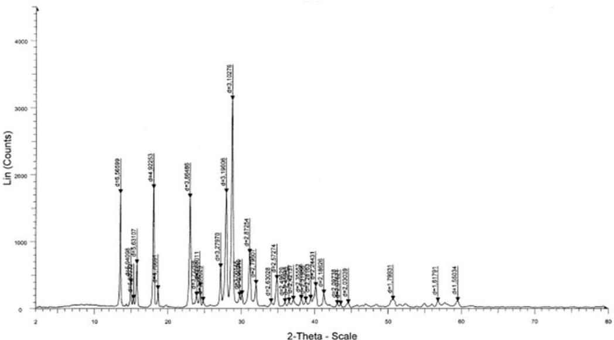

> 🧠 **[Cognis Multimodal Enrichment]**
> * **Classification:** Scientific Figure
> * **Extracted Text (OCR):** `Lin (Counts), 2-Theta - Scale`
> * **VLM Visual Summary:** ### FIGURE TYPE:
>   Diffraction Pattern
>   
>   ### SCIENTIFIC PURPOSE:
>   This figure illustrates the powder diffraction pattern, which is used to identify the crystalline structure of materials based on the diffraction of X-rays. Specifically, it is used to determine the presence and composition of minerals in kidney stones.
>   
>   ### KEY KNOWLEDGE:
>   1. **Powder Diffraction**: This technique involves the scattering of X-rays by powdered samples, which results in a diffraction pattern where peaks correspond to the lattice planes of the crystal.
>   2. **2θ Scale**: The horizontal axis represents the angle of incidence (2θ), which is related to the wavelength of the incident X-rays.
>   3. **Intensity Peaks**: The vertical axis represents the intensity of the diffracted X-rays, which is proportional to the number of atoms in the crystal at that particular spacing.
>   4. **Identification of Compounds**: The diffraction pattern can be compared against a database of known diffraction patterns to identify the crystalline phases present in the sample.
>   
>   ### LABEL INTERPRETATION:
>   - **2θ Scale**: Represents the angle of incidence of the X-rays.
>   - **Intensity Peaks**: Indicate the intensity of the diffracted X-rays, corresponding to the lattice planes of the crystal.
>   - **Compounds Identified**: Uric acid and whewellite are identified as the compounds present in the kidney stones.
>   
>   ### ENGINEERING/SCIENTIFIC INSIGHTS:
>   - **Identification of Minerals**: The diffraction pattern helps in identifying the crystalline phases present in kidney stones, which is crucial for understanding their composition and potential health implications.
>   - **Crystal Structure Analysis**: By analyzing the diffraction peaks, one can determine the crystal structure of the material, including the lattice parameter, space group, and unit cell dimensions.
>   
>   ### USER-RELEVANT INFORMATION:
>   - **D-spacing Values**: The d-spacings of the peaks can be used to determine the lattice parameters of the crystals.
>   - **Identification of Compounds**: The specific peaks and their intensities can be matched against a database to identify the crystalline phases present in the sample.
>   - **Crystal Structure Visualization**: The diffraction pattern provides a visual representation of the crystal structure, which can be further analyzed using computational tools to understand the material's properties and behavior.
> * **Figure Caption:** The Figure given below shows the powder diffraction pattern with different d-spacing. The scale of plot is intensity peak on y-axis and 2θ on x-axis. Uric acid and whewellite are the compounds identified in the kidney stones using powder diffraction pattern. | Fe:P.23.raw-Star:2.0000-End:80.005-Step:0.007-Stepme13.6s-Anode:Ou-WL.1:1.5406-Creao13.07.201612:21:44 Operations:Smooth0.0g2|Background 0.0o,0.00o|mrt
> * **Surrounding Context (+/- 300 words):**
>   * **[Before]:** *... d-spacing of each peak is then obtained by solution of the Bragg equation for the appropriate value of λ. Once all d-spacings have been determined, automated search/match routines compare the d’s of the unknown to those of known materials. Because each mineral has a unique set of d-spacings, matching these d-spacings provides an identification of the unknown sample. A systematic procedure is used by ordering the d-spacings in terms of their intensity beginning with the most intense peak. Files of d-spacings for hundreds of thousands of inorganic compounds are available from the International Centre for Diffraction Data as the Powder Diffraction File (PDF). Many other sites contain d-spacings of minerals such as the American Mineralogist Crystal Structure Database. Commonly this information is an integral portion of the software that comes with the instrumentation. [Section: Powder Diffraction > 15.5. Determination of an Unknown] <table><tr><td colspan="10">PDF #461212,Wavelength = 1.540562 (A) -□</td></tr><tr><td>46-1212 Quality: *</td><td colspan="8">cx-Al2 03</td></tr><tr><td>CAS Number:</td><td colspan="10" rowspan="2">Aluminum Oxide Ref: Huang,T et al.,Adv.X-Ray Anal.,33, 295 [1990]</td></tr><tr><td>Molecular Weight:101.96</td></tr><tr><td>Volume[CD]:254.81 Dx3.987 Dm</td><td rowspan="2">4</td><td colspan="8"></td></tr><tr><td>Sys: Hexagonal Lattice:_Rhomb-centered</td><td></td><td></td><td></td><td></td><td></td><td></td><td>0660</td><td></td></tr><tr><td>S.G.: R3c [167] Cell Parameters:</td><td>ptrej g spexi</td><td colspan="2"></td><td></td><td colspan="2"></td><td></td><td></td><td></td><td></td><td></td></tr><tr><td>a 4.758b c 12.99 x β Y</td><td></td><td></td><td></td><td></td><td></td><td></td><td>1.5</td><td>1.3</td><td></td><td></td><td></td></tr><tr><td>SS/FOM: F25=358(.0028, 25)</td><td></td><td></td><td>5.9</td><td>3.0</td><td></td><td>2.0</td><td></td><td></td><td></td><td>d[A]</td><td></td></tr><tr><td>I/lcor: Rad:CuKa1</td><td>dA]</td><td>Int-f</td><td>h</td><td>k 一</td><td>[A]</td><td>Int-f</td><td>h k</td><td>一</td><td>dA]</td><td>Int-f h k</td><td></td></tr><tr><td>Lambda: 1.540562</td><td>3.4797</td><td>45</td><td>0</td><td>24 1</td><td>1.5150</td><td>214</td><td>1 2</td><td>284058</td><td>1.1897</td><td>2 20</td><td></td></tr><tr><td>Filter:</td><td>2.5508</td><td>100</td><td>1</td><td>0</td><td>1.5110</td><td></td><td>0 1</td><td></td><td>1.1600</td><td>21 3</td><td>0 6</td></tr><tr><td>d-sp: diffractometer</td><td>2.3794</td><td>21</td><td>1 1</td><td>0</td><td>1.4045</td><td>23</td><td>2 1</td><td></td><td>1.1472</td><td>3 2</td><td>2 3</td></tr><tr><td>Mineral Name:</td><td></td><td></td><td>0</td><td>0 6</td><td>1.3737</td><td>27</td><td>3 0</td><td></td><td>1.1386</td><td>&lt;1 1</td><td>3 1</td></tr><tr><td>Corundum, syn</td><td>2.1654</td><td></td><td></td><td></td><td>1.3359</td><td></td><td>1 2</td><td></td><td>1.1256</td><td>3</td><td>2</td></tr><tr><td></td><td>2.0853</td><td>266134</td><td>12012</td><td>3 1</td><td>1.2755</td><td>1228</td><td>2</td><td>0</td><td>1.1241</td><td>1</td><td>8</td></tr><tr><td></td><td>1.9643</td><td></td><td></td><td>0 2 2 4</td><td>1.2391</td><td></td><td>1</td><td>010</td><td>1.0990</td><td>239 0</td><td>210</td></tr><tr><td></td><td>1.7400</td><td>89</td><td></td><td>1 6</td><td>1.2343</td><td>12</td><td>1</td><td>1 9</td><td></td><td></td><td></td></tr><tr><td></td><td>1.6015</td><td></td><td>Y</td><td></td><td>1.1931</td><td>1</td><td>2</td><td>1 7</td><td></td><td></td><td></td></tr><tr><td></td><td>1.5466</td><td>1</td><td></td><td>1</td><td></td><td></td><td></td><td></td><td></td><td></td><td></td></tr></table> [Section: Powder Diffraction > Determination of Unit Cell Dimensions] For determination of unit cell parameters, each reflection must be indexed to a specific hkl. [Section: Powder Diffraction > 15.6. Use of Powder diffraction in identification of compounds in Kidney stones] The Figure given below shows the powder diffraction pattern with different d-spacing. The scale of plot is intensity peak on y-axis and 2θ on x-axis. Uric acid and whewellite are the compounds identified in the kidney stones using powder diffraction pattern.*
>   * **[After]:** *Fe:P.23.raw-Star:2.0000-End:80.005-Step:0.007-Stepme13.6s-Anode:Ou-WL.1:1.5406-Creao13.07.201612:21:44 Operations:Smooth0.0g2|Background 0.0o,0.00o|mrt File: P-23.raw - Start: 2.0000 \* - End: 80.0058 \* - Step: 0.0067 \* - Step time: 13.6 s - Anode: Cu - WL1: 1.5406 - Creation: 13.07.2016 12:21:44 Opessons: Smoeth 0.092 | Background 0.000,0.00o | Import 31-1982(\*)-Umicathd-CSH6M4O3-Y:50.00%-dxby:1,-WL: 1.5406-Mongdini -1ilcPDF 0.9-S-Q 59.3%- 7-1962(C)-WawdCaNCOO}2H2O-Y:50.C0%dxby:1.WL:1.506-Monclnc-cPOF1.4-S-Q40.7 %- [Section: Powder Diffraction > 15.7. Data formats] Powder diffractograms comes in many formats; typically every manufacturer and each synchrotron has their own format. Most manufacturers offer the possibility to transfer the data into a set whose formats are generally accepted. The simplest format of all is the xy-format; one column with 2θ- values and one with recorded intensities. There are some variations of that simple theme, for instance by starting the file with information on wavelength, measuring time etc. Many programs will be able to read the data anyway, but sometimes it is necessary to delete those initial lines. Another common and more compact format is to start with a line giving start, stop and step values in 2θ and in the following lines giving the recorded intensities with ten intensity values per line. One disadvantage with rewriting into the general formats is that the information on the measurement like time, wavelength, diffractometer settings etc, are lost in the translation. [Section: Powder Diffraction > 15.8. Rietveld method:] The basic idea behind the Rietveld method is to calculate the entire powder pattern using a variety of refinable parameters and to improve a selection of these parameters by minimizing the weighted sum of the squared differences between the observed and the calculated powder pattern using least squares methods. That way, the intrinsic problem of the powder diffraction method with systematic and accidental peak overlap is overcome in a clever way. It was the intention of Hugo Rietveld, who invented the method a few decades ago, ...*
  
Fe:P.23.raw-Star:2.0000-End:80.005-Step:0.007-Stepme13.6s-Anode:Ou-WL.1:1.5406-Creao13.07.201612:21:44 Operations:Smooth0.0g2|Background 0.0o,0.00o|mrt

File: P-23.raw - Start: 2.0000 \* - End: 80.0058 \* - Step: 0.0067 \* - Step time: 13.6 s - Anode: Cu - WL1: 1.5406 - Creation: 13.07.2016 12:21:44 Opessons: Smoeth 0.092 | Background 0.000,0.00o | Import  
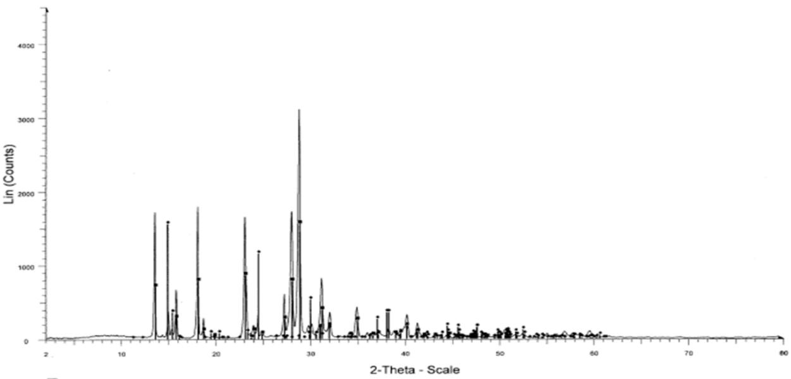

> 🧠 **[Cognis Multimodal Enrichment]**
> * **Classification:** Scientific Figure
> * **Extracted Text (OCR):** `Lin (Counts), 2-Theta - Scale`
> * **VLM Visual Summary:** ### FIGURE TYPE:
>   Diffraction Pattern
>   
>   ### SCIENTIFIC PURPOSE:
>   This figure represents a powder diffraction pattern, which is used to identify the crystalline structure of a material based on its X-ray scattering properties. The pattern shows the intensity of X-rays scattered at various angles (2θ), which corresponds to the spacing of the crystal lattice planes.
>   
>   ### KEY KNOWLEDGE:
>   1. **Powder Diffraction**: This technique involves scattering X-rays from a powdered sample to determine the crystal structure.
>   2. **2θ Scale**: The horizontal axis represents the angle of incidence of the X-rays, measured in degrees.
>   3. **Intensity (Lin)**: The vertical axis represents the intensity of the scattered X-rays, which is proportional to the number of atoms contributing to the scattering at that angle.
>   4. **Diffractometer Settings**: The instrument settings include the wavelength of the X-rays (1.540562 Å), the cell parameters (a = 4.758 Å, b = 12.99 Å, c = 1.5 Å), and the unit cell volume (V = 254.81 ų).
>   
>   ### LABEL INTERPRETATION:
>   - **2-Theta (2θ)**: The angle of incidence of the X-rays.
>   - **Lin (Counts)**: The intensity of the scattered X-rays.
>   - **Anode**: The anode material used in the X-ray tube, which is Cu in this case.
>   - **WL1**: The wavelength of the X-rays, which is 1.5406 Å.
>   - **Creation Date**: The date the data was created, 13.07.2016.
>   
>   ### ENGINEERING/SCIENTIFIC INSIGHTS:
>   - **Identification of Materials**: The peaks in the diffraction pattern correspond to specific crystallographic planes, allowing the identification of the material's crystal structure.
>   - **Crystal Structure Analysis**: By analyzing the positions and intensities of the diffraction peaks, the crystal structure can be determined, including the unit cell dimensions and space group.
>   
>   ### USER-RELEVANT INFORMATION:
>   - **Diffractometer Settings**: The wavelength, cell parameters, and unit cell volume provide crucial information about the material being analyzed.
>   - **Peak Intensities**: The relative heights of the peaks indicate the relative abundance of the corresponding crystallographic planes.
>   - **Identification of Peaks**: Matching the observed
> * **Figure Caption:** File: P-23.raw - Start: 2.0000 \* - End: 80.0058 \* - Step: 0.0067 \* - Step time: 13.6 s - Anode: Cu - WL1: 1.5406 - Creation: 13.07.2016 12:21:44 Opessons: Smoeth 0.092 | Background 0.000,0.00o | Import | 31-1982(\*)-Umicathd-CSH6M4O3-Y:50.00%-dxby:1,-WL: 1.5406-Mongdini -1ilcPDF 0.9-S-Q 59.3%-
> * **Surrounding Context (+/- 300 words):**
>   * **[Before]:** *... each mineral has a unique set of d-spacings, matching these d-spacings provides an identification of the unknown sample. A systematic procedure is used by ordering the d-spacings in terms of their intensity beginning with the most intense peak. Files of d-spacings for hundreds of thousands of inorganic compounds are available from the International Centre for Diffraction Data as the Powder Diffraction File (PDF). Many other sites contain d-spacings of minerals such as the American Mineralogist Crystal Structure Database. Commonly this information is an integral portion of the software that comes with the instrumentation. [Section: Powder Diffraction > 15.5. Determination of an Unknown] <table><tr><td colspan="10">PDF #461212,Wavelength = 1.540562 (A) -□</td></tr><tr><td>46-1212 Quality: *</td><td colspan="8">cx-Al2 03</td></tr><tr><td>CAS Number:</td><td colspan="10" rowspan="2">Aluminum Oxide Ref: Huang,T et al.,Adv.X-Ray Anal.,33, 295 [1990]</td></tr><tr><td>Molecular Weight:101.96</td></tr><tr><td>Volume[CD]:254.81 Dx3.987 Dm</td><td rowspan="2">4</td><td colspan="8"></td></tr><tr><td>Sys: Hexagonal Lattice:_Rhomb-centered</td><td></td><td></td><td></td><td></td><td></td><td></td><td>0660</td><td></td></tr><tr><td>S.G.: R3c [167] Cell Parameters:</td><td>ptrej g spexi</td><td colspan="2"></td><td></td><td colspan="2"></td><td></td><td></td><td></td><td></td><td></td></tr><tr><td>a 4.758b c 12.99 x β Y</td><td></td><td></td><td></td><td></td><td></td><td></td><td>1.5</td><td>1.3</td><td></td><td></td><td></td></tr><tr><td>SS/FOM: F25=358(.0028, 25)</td><td></td><td></td><td>5.9</td><td>3.0</td><td></td><td>2.0</td><td></td><td></td><td></td><td>d[A]</td><td></td></tr><tr><td>I/lcor: Rad:CuKa1</td><td>dA]</td><td>Int-f</td><td>h</td><td>k 一</td><td>[A]</td><td>Int-f</td><td>h k</td><td>一</td><td>dA]</td><td>Int-f h k</td><td></td></tr><tr><td>Lambda: 1.540562</td><td>3.4797</td><td>45</td><td>0</td><td>24 1</td><td>1.5150</td><td>214</td><td>1 2</td><td>284058</td><td>1.1897</td><td>2 20</td><td></td></tr><tr><td>Filter:</td><td>2.5508</td><td>100</td><td>1</td><td>0</td><td>1.5110</td><td></td><td>0 1</td><td></td><td>1.1600</td><td>21 3</td><td>0 6</td></tr><tr><td>d-sp: diffractometer</td><td>2.3794</td><td>21</td><td>1 1</td><td>0</td><td>1.4045</td><td>23</td><td>2 1</td><td></td><td>1.1472</td><td>3 2</td><td>2 3</td></tr><tr><td>Mineral Name:</td><td></td><td></td><td>0</td><td>0 6</td><td>1.3737</td><td>27</td><td>3 0</td><td></td><td>1.1386</td><td>&lt;1 1</td><td>3 1</td></tr><tr><td>Corundum, syn</td><td>2.1654</td><td></td><td></td><td></td><td>1.3359</td><td></td><td>1 2</td><td></td><td>1.1256</td><td>3</td><td>2</td></tr><tr><td></td><td>2.0853</td><td>266134</td><td>12012</td><td>3 1</td><td>1.2755</td><td>1228</td><td>2</td><td>0</td><td>1.1241</td><td>1</td><td>8</td></tr><tr><td></td><td>1.9643</td><td></td><td></td><td>0 2 2 4</td><td>1.2391</td><td></td><td>1</td><td>010</td><td>1.0990</td><td>239 0</td><td>210</td></tr><tr><td></td><td>1.7400</td><td>89</td><td></td><td>1 6</td><td>1.2343</td><td>12</td><td>1</td><td>1 9</td><td></td><td></td><td></td></tr><tr><td></td><td>1.6015</td><td></td><td>Y</td><td></td><td>1.1931</td><td>1</td><td>2</td><td>1 7</td><td></td><td></td><td></td></tr><tr><td></td><td>1.5466</td><td>1</td><td></td><td>1</td><td></td><td></td><td></td><td></td><td></td><td></td><td></td></tr></table> [Section: Powder Diffraction > Determination of Unit Cell Dimensions] For determination of unit cell parameters, each reflection must be indexed to a specific hkl. [Section: Powder Diffraction > 15.6. Use of Powder diffraction in identification of compounds in Kidney stones] The Figure given below shows the powder diffraction pattern with different d-spacing. The scale of plot is intensity peak on y-axis and 2θ on x-axis. Uric acid and whewellite are the compounds identified in the kidney stones using powder diffraction pattern. Fe:P.23.raw-Star:2.0000-End:80.005-Step:0.007-Stepme13.6s-Anode:Ou-WL.1:1.5406-Creao13.07.201612:21:44 Operations:Smooth0.0g2|Background 0.0o,0.00o|mrt File: P-23.raw - Start: 2.0000 \* - End: 80.0058 \* - Step: 0.0067 \* - Step time: 13.6 s - Anode: Cu - WL1: 1.5406 - Creation: 13.07.2016 12:21:44 Opessons: Smoeth 0.092 | Background 0.000,0.00o | Import*
>   * **[After]:** *31-1982(\*)-Umicathd-CSH6M4O3-Y:50.00%-dxby:1,-WL: 1.5406-Mongdini -1ilcPDF 0.9-S-Q 59.3%- 7-1962(C)-WawdCaNCOO}2H2O-Y:50.C0%dxby:1.WL:1.506-Monclnc-cPOF1.4-S-Q40.7 %- [Section: Powder Diffraction > 15.7. Data formats] Powder diffractograms comes in many formats; typically every manufacturer and each synchrotron has their own format. Most manufacturers offer the possibility to transfer the data into a set whose formats are generally accepted. The simplest format of all is the xy-format; one column with 2θ- values and one with recorded intensities. There are some variations of that simple theme, for instance by starting the file with information on wavelength, measuring time etc. Many programs will be able to read the data anyway, but sometimes it is necessary to delete those initial lines. Another common and more compact format is to start with a line giving start, stop and step values in 2θ and in the following lines giving the recorded intensities with ten intensity values per line. One disadvantage with rewriting into the general formats is that the information on the measurement like time, wavelength, diffractometer settings etc, are lost in the translation. [Section: Powder Diffraction > 15.8. Rietveld method:] The basic idea behind the Rietveld method is to calculate the entire powder pattern using a variety of refinable parameters and to improve a selection of these parameters by minimizing the weighted sum of the squared differences between the observed and the calculated powder pattern using least squares methods. That way, the intrinsic problem of the powder diffraction method with systematic and accidental peak overlap is overcome in a clever way. It was the intention of Hugo Rietveld, who invented the method a few decades ago, to extract as much information as possible from a powder pattern. At the beginning this was mainly restricted to atomic positions from neutron diffraction patterns. On the other hand, there is much more information hidden in a powder pattern which ...*
  
31-1982(\*)-Umicathd-CSH6M4O3-Y:50.00%-dxby:1,-WL: 1.5406-Mongdini -1ilcPDF 0.9-S-Q 59.3%-  
7-1962(C)-WawdCaNCOO}2H2O-Y:50.C0%dxby:1.WL:1.506-Monclnc-cPOF1.4-S-Q40.7 %-

## 15.7. Data formats

Powder diffractograms comes in many formats; typically every manufacturer and each synchrotron has their own format. Most manufacturers offer the possibility to transfer the data into a set whose formats are generally accepted. The simplest format of all is the xy-format; one column with 2θ- values and one with recorded intensities. There are some variations of that simple theme, for instance by starting the file with information on wavelength, measuring time etc. Many programs will be able to read the data anyway, but sometimes it is necessary to delete those initial lines. Another common and more compact format is to start with a line giving start, stop and step values in 2θ and in the following lines giving the recorded intensities with ten intensity values per line. One disadvantage with rewriting into the general formats is that the information on the measurement like time, wavelength, diffractometer settings etc, are lost in the translation.

## 15.8. Rietveld method:

The basic idea behind the Rietveld method is to calculate the entire powder pattern using a variety of refinable parameters and to improve a selection of these parameters by minimizing the weighted sum of the squared differences between the observed and the calculated powder pattern using least squares methods. That way, the intrinsic problem of the powder diffraction method with systematic and accidental peak overlap is overcome in a clever way. It was the intention of Hugo Rietveld, who invented the method a few decades ago, to extract as much information as possible from a powder pattern. At the beginning this was mainly restricted to atomic positions from neutron diffraction patterns. On the other hand, there is much more information hidden in a powder pattern which may be subjected to Rietveld refinement. Simultaneous Rietveld refinements of several datasets can e.g. be used for full texture analysis. In general, fast detectors like image plate readers in combination with powerful microcomputers reveal a new aspect of Rietveld-refinement: time dependence. By recording full powder patterns in short time intervals, the change of the crystal structure in dependence on pressure, temperature or during a chemical reaction is monitored and dynamical processes can be visualized.

The Rietveld method is a least-squares procedure, which minimizes the quantity

$$
S _ { y } = \sum _ { i } w _ { i } ( Y _ { i } - Y _ { c i } ) ^ { 2 }
$$

Where, $\mathrm { Y _ { i } }$ is the observed intensity at point i of the observed powder pattern and $\mathrm { Y _ { c i } }$ is the calculated intensity. The weight, $\mathrm { W _ { i } , }$ is based on the counting statistics, $\mathrm { { \bf W } i = } \mathrm { { Y } _ { i } ^ { - 1 } }$ , although at different stages of the refinements it may be advantageous to use for instance $\mathrm { \mathbf { W _ { i } } \mathrm { = Y _ { c i } } \tilde { \Phi } ^ { - 1 } }$ . The contribution to $\mathrm { Y _ { c i } }$ from Bragg reflections, diffraction optics effects and instrumental factors is expressed as

$$
Y _ { c i } \mathrm { \large = } s \sum _ { H } L M _ { H } | F _ { H } | ^ { 2 } \varphi ( 2 \theta _ { i } - 2 \theta _ { H } ) P _ { H } A + Y _ { b i }
$$

Where,

s is the overall scale factor,

H represents the Miller indices for the Bragg reflection,

L contains the Lorentz and polarization factors,

$\mathbf { M } _ { \mathrm { H } }$ is the multiplicity,

FH is the structure factor for Hth Bragg reflection, and

$\varphi ( 2 \theta _ { i } - 2 \theta _ { H } )$ is a profile function, where $2 \theta _ { i }$ is corrected for the 2θ zero error,

$\mathrm { P _ { H } }$ is a preferred orientation function,

A is the absorption factor,

$\mathrm { Y _ { b i } }$ is the background intensity at step i.

The Bragg reflections contained in the summation at each point of the powder pattern are determined from a sorted list of the possible reflections and their profile widths at 2θi. The structure factor as usual contains the structural information

$$
F _ { H } = \sum f _ { j } g _ { i } e x p - 2 \pi i ( h x _ { j } + k y _ { j } + l z _ { j } ) \mathrm { e x p } ( - B _ { j } s i n ^ { 2 } \theta / \lambda ^ { 2 } )
$$

## Where,

fj is the scattering factor, or in the case of neutron data the scattering length, of atom j, gj is the occupancy factor, $\mathbf { X _ { i } } , \mathbf { y _ { i } }$ and $\mathrm { Z i }$ are the fractional coordinates, and $\mathrm { B _ { j } }$ the temperature factor coefficient. We can obtain the parameters from Eq. $\begin{array} { r } { S _ { y } = \sum _ { i } w _ { i } ( Y _ { i } - Y _ { c i } ) ^ { 2 } } \end{array}$ , by putting its derivatives with respect to its parameters to zero. It gives us a set of non-linear equations, which are as Taylor series, where only the first term is retained.

Rietveld method requires digitized data (i.e., it cannot be used on analogic chart recordings or traces) and knowledge of an approximate structural model (ie., lattice parameters, space group symmetry and fractional atomic coordinates). A number of other starting parameters, mostly instrumental, can be guessed by visual inspection (background coefficients, zero angle, etc.) or refined to reasonable values from arbitrary choices (this is particularly true for the scale factor, which can be determined by linear least squares in a single cycle at the very beginning of the simulation). The most reliable values which can be obtained by a standard Rietveld approach are probably the lattice parameters, since they are less biased by errors in the structural model.

For the three dimensional molecular structure determination using powder XRD, there are some limitations in the Rietveld method. The total number of atoms in the molecule has to be around 30. SIRPOW is a computer program to obtain the molecular structure from the powder pattern. This program is from Prof. C. Giacovazzo’s group from university of Bari, Bari, Italy.

## Summary

 The module deals with the introduction of powder X-ray diffraction which is one of the widely used analytical methods to study materials.

 The module throws light on how to and in what cases the powder diffraction can be used. The conditions and methodology to be followed are detailed.

 The Bragg’s law of diffraction is explained in detail.

 The applications of powder XRD are discussed along with the strengths and limitations of technique.