## Thin film Characterization Techniques

## 1. Introduction

The growth mechanism and properties of the films can be well understood by their characterizations using a variety of investigative techniques. The optimization is the most important aspect to control material processing and regularize sensor performance. Before using the films in applications, one has to characterize the films to achieve optimum performance of the films prepared. The complete characterization of any material consists of phase analysis, compositional characterization, structural elucidation, micro-structural analysis and surface characterization, which have strong bearing on the properties of materials. In this section, the structural, morphological, electrical and optical analysis was carried out by X-ray diffraction, field emission scanning electron microscope (FESEM), Atomic force microscope (AFM), electrical resistivity, optical spectroscopy, etc. Further, gas sensing performance of the as-characterized undoped and doped ZnO films was tested using a homemade gas sensor assembly.

The intent of this section is to facilitate the comprehension of the work by an inexperienced reader in characterization and, in some way, to include a general description of a group of essential characterization techniques in a clear way. For that, different analytical instrumental techniques used to characterize our thin films are described with relevant principles of their operation and working.

2. Differential Thermal Analyses and Thermo Gravimetric Analysis Thermal analysis includes a group of techniques in which physical and chemical property of a substance is measured as a function of temperature while the substance is subjected to a controlled temperature program in different gas environments. Modern thermal analysis instrument measures phase transition temperature, weight losses in materials, and energies of transitions, dimensional changes, and modulus and viscoelastic properties. Current applications include environmental measurements, product reliability, compositional analysis, stability, chemical reactions and dynamic properties.

## a. Differential Thermal Analysis (DTA)

In DTA, the temperature of a sample and a thermally inert reference material are measured as a function of temperature (usually sample temperature). Any phase transition that the sample undergoes will result in liberation or absorption of energy by the sample with a corresponding deviation of its temperature from that of the reference. This differential temperature (DT) versus the programmed temperature (T) at which the whole system is being changed yields the temperature of transitions and the nature of the transition such as exothermic or endothermic.

## b. Thermo Gravimetric Analysis (TGA)

It provides a quantitative measurement of any weight change associated with a transition. Thermogravimetric can directly record the loss or gain in weight with time or temperature due to oxide phase formation, dehydration or decomposition. Thermogravimetric curves are characteristic for a given compound or systems because of the unique sequence of physiochemical reactions, which occur over definite temperature ranges and at rates that are function of the molecular structures. Changes in weight are due to rupture or formation of various physical and chemical bonds at elevated temperatures that lead to the evolution of volatile products or the formation of heavier reaction products.

From such curves data are obtained concerning the thermodynamics and kinetics of the various chemical reactions, reaction mechanism and the intermediate and final reaction products. The usual temperature range is from ambient to $1 2 0 0 ^ { \circ } \mathrm { C }$ with inert or reactive atmospheres. All weightchange processes absorb or release energy and are thus measurable by DTA or DSC, but not all energy-change processes are accompanied by changes in weight. This difference in the two techniques enables a clear distinction to be made between physical and chemical changes when the samples are subjected to both DTA and TGA tests.

In general, each substance will give a DSC or DTA curve whose shape, number and position of the various endothermic and exothermic features serve as a means of qualitative and quantitative identification of the substance. When an endothermic change occurs the sample temperature lags behind the reference temperature because of the heat in the sample. The initiation point for a phase change or chemical reaction is the point at which the curve first deviates from the base line.

When the transition is complete thermal diffusion brings the sample back to equilibrium quickly. The peak (or minimum) temperature indicates the temperature at which the reaction is completed. Endotherms generally represent physical rather than chemical changes. Sharp endotherms are indicative of crystalline rearrangements, fusion, or solid-state transition for relatively pure materials. Broader endotherms cover behavior ranging from dehydration, temperature-dependent phase behaviors to melting of polymers. Exothermic behavior (without decomposition) is associated with the decrease in enthalpy of a phase or chemical system. Narrow exotherms usually indicate crystallization (ordering) of a metastable system, whether it is super cooled organic, inorganic, amorphous polymer or liquid, or annealing of stored energy resulting from mechanical stress.

Broad exotherms denote chemical reactions, polymerization or curing of thermosetting resins. Exotherms with decomposition can be either narrow or broad depending on kinetics of the behavior. The area of exotherms or endotherms can be used to calculate the heat of the reaction or the heat of a phase formation.

## Specifications

It is SDT-2960 from TA Instruments, USA. It is capable of performing both DSC and TGA at the same time. DTA can also be carried out using SDT 2960. It measures the heat flow and weight changes associated with transitions and reactions in material over the temperature range from RT to $1 5 0 0 ^ { \circ } \mathrm { C }$ . These experiments can be carried out in either of the optional environment like N2, O2, Ar or air at pre decided flow-rate (ml/min) and heating rate (°C/min). The gas-switching accessory is used to turn on and off or to switch between two different purge gases during SDT experiment. Heat-flow accuracy is equal to 1 % where as DTA sensitivity is $0 . 0 0 1 \ ^ { \circ } \mathrm { C }$ and that of weight is 0.1 μ gm. This SDT- 2960 controller is connected to PC and the special software makes the thermal analysis. It stores the data as well as runs the analysis programs.

## 3. Thickness Measurement

The thickness of the film is the most significant parameter that affects the properties of the thin film. It may be measured either by in situ monitoring of the rate of the deposition or after the film is taken out from deposition chamber. Technique of the first type often referred to as monitor methods generally allow both monitoring and controlling of deposition rate film thickness. Any known physical quantity related to film thickness can be used to measure the thickness. The method chosen should be convenient, reliable and simple.

One of the most convenient and advanced methods for determining film thickness is surface profilometer method. Basically, profilometer is a measuring instrument used to measure a surface's profile, in order to quantify its roughness. Vertical resolution is usually in the nanometer level, though lateral resolution is usually poorer.

## Contact Profilometer

A diamond stylus is moved vertically in contact with a sample and then moved laterally across the sample for a specified distance and specified contact force. A profilometer can measure small surface variations in vertical stylus displacement as a function of position.

A typical profilometer can measure small vertical features ranging in height from 10 nm to 1 mm. The height position of the diamond stylus generates an analog signal which is converted into a digital signal stored, analyzed and displayed. The radius of diamond stylus ranges from 20 nm to 25 μm, and the horizontal resolution is controlled by the scan speed and data signal sampling rate. The stylus tracking force can range from less than 1 to 50 milligrams.

## Non-contact Profilometer

An optical profilometer is a non-contact method for providing much of the same information as a stylus based profilometer. There are many different techniques which are currently being employed, such as laser triangulation (triangulation sensor), confocal microscopy (used for profiling of very small objects) and digital holography.

In order to measure the film thickness, a ‘step’ has to be made on the film (either by doctor blade or by dipping the film in acidic medium).

While measurement the stylus is scanned over this step at various (step) positions and the average step height will prove the film thickness.

Roughness is a measure of the texture of a surface. It is quantified by the vertical deviations of a real surface from its ideal form.

If these deviations are large, the surface is rough; if they are small the surface is smooth. Roughness is typically considered to be the high frequency, short wavelength component of a measured surface.

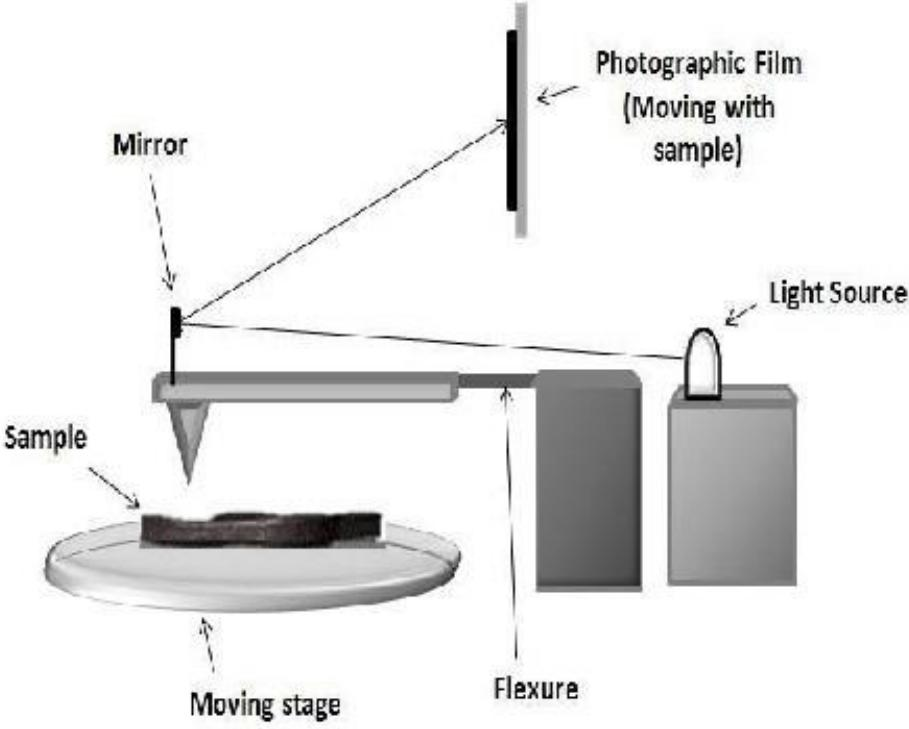

> 🧠 **[Cognis Multimodal Enrichment]**
> * **Classification:** Scientific Figure
> * **Extracted Text (OCR):** `Photographic Film, Moving with sample, Mirror, Light Source, Sample, Moving stage, Flexure`
> * **VLM Visual Summary:** ### FIGURE TYPE:
>   Instrument Schematic
>   
>   ### SCIENTIFIC PURPOSE:
>   This figure illustrates the schematic of a surface profilometer, which is used to measure the roughness of a surface.
>   
>   ### KEY KNOWLEDGE:
>   - **Surface Profilometer**: Measures small surface variations in vertical stylus displacement as a function of position.
>   - **Vertical Resolution**: Typically in the nanometer level.
>   - **Lateral Resolution**: Controlled by scan speed and data signal sampling rate.
>   - **Stylus Tracking Force**: Can range from less than 1 to 50 milligrams.
>   - **Roughness**: Quantified by vertical deviations from an ideal form; roughness indicates high-frequency, short-wavelength components of a measured surface.
>   
>   ### LABEL INTERPRETATION:
>   - **Sample**: The object being measured.
>   - **Moving Stage**: The stage that moves the sample during measurement.
>   - **Flexure**: The flexible arm that supports the mirror and light source.
>   - **Light Source**: Provides illumination for the measurement.
>   - **Photographic Film**: Captures the image of the sample's surface, moving with the sample.
>   
>   ### ENGINEERING/SCIENTIFIC INSIGHTS:
>   A reader should learn that a surface profilometer measures the roughness of a surface by analyzing the vertical deviations of a real surface from its ideal form. The instrument uses a stylus to scan the sample, capturing images that are then analyzed to determine the surface's roughness.
>   
>   ### USER-RELEVANT INFORMATION:
>   The information provided in this figure helps answer future questions about how to use a surface profilometer to measure surface roughness, including the vertical and lateral resolutions, the range of stylus tracking forces, and the importance of the photographic film in capturing the surface image.
> * **Figure Caption:** If these deviations are large, the surface is rough; if they are small the surface is smooth. Roughness is typically considered to be the high frequency, short wavelength component of a measured surface. | Surface Profilometer
> * **Surrounding Context (+/- 300 words):**
>   * **[Before]:** *... quantify its roughness. Vertical resolution is usually in the nanometer level, though lateral resolution is usually poorer. [Section: Contact Profilometer] A diamond stylus is moved vertically in contact with a sample and then moved laterally across the sample for a specified distance and specified contact force. A profilometer can measure small surface variations in vertical stylus displacement as a function of position. A typical profilometer can measure small vertical features ranging in height from 10 nm to 1 mm. The height position of the diamond stylus generates an analog signal which is converted into a digital signal stored, analyzed and displayed. The radius of diamond stylus ranges from 20 nm to 25 μm, and the horizontal resolution is controlled by the scan speed and data signal sampling rate. The stylus tracking force can range from less than 1 to 50 milligrams. [Section: Non-contact Profilometer] An optical profilometer is a non-contact method for providing much of the same information as a stylus based profilometer. There are many different techniques which are currently being employed, such as laser triangulation (triangulation sensor), confocal microscopy (used for profiling of very small objects) and digital holography. In order to measure the film thickness, a ‘step’ has to be made on the film (either by doctor blade or by dipping the film in acidic medium). While measurement the stylus is scanned over this step at various (step) positions and the average step height will prove the film thickness. Roughness is a measure of the texture of a surface. It is quantified by the vertical deviations of a real surface from its ideal form. If these deviations are large, the surface is rough; if they are small the surface is smooth. Roughness is typically considered to be the high frequency, short wavelength component of a measured surface.*
>   * **[After]:** *Surface Profilometer [Section: 4. X-Ray Diffraction] X-ray diffraction (XRD) is a powerful technique used to uniquely identify the crystalline phases present in materials and to measure the structural properties (strain state, grain size, epitaxy, phase composition, preferred orientation, and defect structure) of these phases. XRD is also used to determine the thickness of thin films and multilayers, and atomic arrangements in amorphous materials (including polymers) and at interfaces. XRD offers unparalleled accuracy in the measurement of atomic spacing and is the technique of choice for determining strain states in thin films. XRD is noncontact and nondestructive, which makes it ideal for in situ studies. The intensities measured with XRD can provide quantitative, accurate information on the atomic arrangements at interfaces (e.g., in multilayers). Materials composed of any element can be successfully studied with XRD, but XRD is most sensitive to high-Z elements, since the diffracted intensity from these is much larger than from low-Z elements. As a consequence, the sensitivity of XRD depends on the material of interest. Schematics of X-ray Diffractometer This figure shows the schematics of X-ray diffractometer. Diffraction in general occurs only when the wavelength of the wave motion is of the same order of magnitude as the repeat distance between scattering centers. [Section: 4. X-Ray Diffraction] This condition of diffraction is nothing but Bragg’s law and is given as, $$ 2 \mathsf { d } \sin \Theta = \mathsf { n } \lambda $$ where, d = interplaner spacing, Ө= diffraction angle, λ = wavelength of $\mathbf { X - }$ ray, n = order of diffraction. Table 1: X-ray diffraction methods <table><tr><td rowspan=1 colspan=1>Method</td><td rowspan=1 colspan=1>入</td><td rowspan=1 colspan=1>0</td></tr><tr><td rowspan=1 colspan=1>Laue Method</td><td rowspan=1 colspan=1>Variable</td><td rowspan=1 colspan=1>Fixed</td></tr><tr><td rowspan=1 colspan=1>Rotating CrystalMethod</td><td rowspan=1 colspan=1>Fixed</td><td rowspan=1 colspan=1>Variable(in part)</td></tr><tr><td rowspan=1 colspan=1>Powder Method</td><td rowspan=1 colspan=1>Fixed</td><td rowspan=1 colspan=1>Variable</td></tr></table> In crystalline solids the atoms ...*
  
Surface Profilometer

## 4. X-Ray Diffraction

X-ray diffraction (XRD) is a powerful technique used to uniquely identify the crystalline phases present in materials and to measure the structural properties (strain state, grain size, epitaxy, phase composition, preferred orientation, and defect structure) of these phases. XRD is also used to determine the thickness of thin films and multilayers, and atomic arrangements in amorphous materials (including polymers) and at interfaces. XRD offers unparalleled accuracy in the measurement of atomic spacing and is the technique of choice for determining strain states in thin films. XRD is noncontact and nondestructive, which makes it ideal for in situ studies. The intensities measured with XRD can provide quantitative, accurate information on the atomic arrangements at

interfaces (e.g., in multilayers). Materials composed of any element can be successfully studied with XRD, but XRD is most sensitive to high-Z elements, since the diffracted intensity from these is much larger than from low-Z elements. As a consequence, the sensitivity of XRD depends on the material of interest.

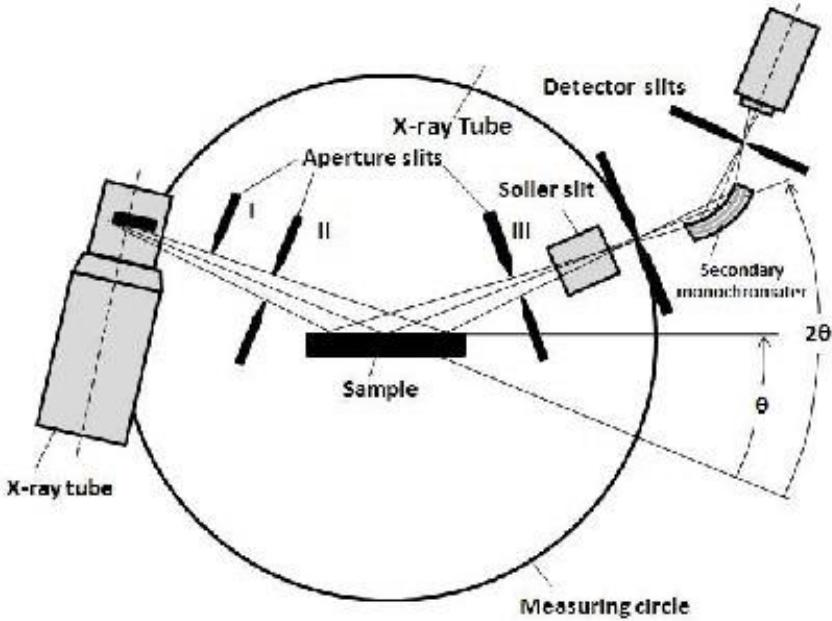

> 🧠 **[Cognis Multimodal Enrichment]**
> * **Classification:** Scientific Figure
> * **Extracted Text (OCR):** `X-ray Tube, Detector slits, X-ray tube, Aperture slits, Soller slit, Secondary monochromator, Sample, Measuring circle, 2θ, θ`
> * **VLM Visual Summary:** ### FIGURE TYPE:
>   Instrument Schematic
>   
>   ### SCIENTIFIC PURPOSE:
>   This figure explains the schematic layout of an X-ray diffractometer, which is used to study materials and structures using X-ray diffraction techniques.
>   
>   ### KEY KNOWLEDGE:
>   1. **X-ray Tube**: The source of X-rays.
>   2. **Aperture Slits**: To control the beam width and focus.
>   3. **Detector Slits**: To collect diffracted X-rays.
>   4. **Sample**: The material being analyzed.
>   5. **Secondary Monochromator**: To further refine the X-ray beam.
>   6. **Measuring Circle**: For measuring the diffraction angles.
>   7. **Soller Slit**: To reduce the beam divergence.
>   8. **Diffraction Angle (θ)**: The angle at which the diffracted X-rays are detected.
>   9. **Bragg's Law**: \(2d\sin\theta = n\lambda\), where \(d\) is the interplanar spacing, \(\theta\) is the diffraction angle, \(\lambda\) is the wavelength of X-rays, and \(n\) is the order of diffraction.
>   
>   ### LABEL INTERPRETATION:
>   - **X-ray tube**: The device that emits X-rays.
>   - **Aperture slits**: Narrow openings to control the beam width.
>   - **Detector slits**: To collect diffracted X-rays.
>   - **Sample**: The material being analyzed.
>   - **Secondary monochromator**: Further refines the X-ray beam.
>   - **Measuring circle**: For measuring the diffraction angles.
>   - **Soller slit**: Reduces beam divergence.
>   - **Diffraction angle (\(\theta\))**: The angle at which the diffracted X-rays are detected.
>   
>   ### ENGINEERING/SCIENTIFIC INSIGHTS:
>   A reader should learn that X-ray diffraction is a powerful technique used to study materials and structures, providing detailed information about their crystalline phases, structural properties, and atomic arrangements. The figure illustrates how X-rays interact with a sample, diffract, and how the diffracted beams are collected and measured to determine the material's properties.
>   
>   ### USER-RELEVANT INFORMATION:
>   The information from this figure could help answer future questions by providing a clear understanding of the components and principles involved in X-ray diffraction experiments.
> * **Figure Caption:** interfaces (e.g., in multilayers). Materials composed of any element can be successfully studied with XRD, but XRD is most sensitive to high-Z elements, since the diffracted intensity from these is much larger than from low-Z elements. As a consequence, the sensitivity of XRD depends on the material of interest. | Schematics of X-ray Diffractometer
> * **Surrounding Context (+/- 300 words):**
>   * **[Before]:** *... which are currently being employed, such as laser triangulation (triangulation sensor), confocal microscopy (used for profiling of very small objects) and digital holography. In order to measure the film thickness, a ‘step’ has to be made on the film (either by doctor blade or by dipping the film in acidic medium). While measurement the stylus is scanned over this step at various (step) positions and the average step height will prove the film thickness. Roughness is a measure of the texture of a surface. It is quantified by the vertical deviations of a real surface from its ideal form. If these deviations are large, the surface is rough; if they are small the surface is smooth. Roughness is typically considered to be the high frequency, short wavelength component of a measured surface. Surface Profilometer [Section: 4. X-Ray Diffraction] X-ray diffraction (XRD) is a powerful technique used to uniquely identify the crystalline phases present in materials and to measure the structural properties (strain state, grain size, epitaxy, phase composition, preferred orientation, and defect structure) of these phases. XRD is also used to determine the thickness of thin films and multilayers, and atomic arrangements in amorphous materials (including polymers) and at interfaces. XRD offers unparalleled accuracy in the measurement of atomic spacing and is the technique of choice for determining strain states in thin films. XRD is noncontact and nondestructive, which makes it ideal for in situ studies. The intensities measured with XRD can provide quantitative, accurate information on the atomic arrangements at interfaces (e.g., in multilayers). Materials composed of any element can be successfully studied with XRD, but XRD is most sensitive to high-Z elements, since the diffracted intensity from these is much larger than from low-Z elements. As a consequence, the sensitivity of XRD depends on the material of interest.*
>   * **[After]:** *Schematics of X-ray Diffractometer This figure shows the schematics of X-ray diffractometer. Diffraction in general occurs only when the wavelength of the wave motion is of the same order of magnitude as the repeat distance between scattering centers. [Section: 4. X-Ray Diffraction] This condition of diffraction is nothing but Bragg’s law and is given as, $$ 2 \mathsf { d } \sin \Theta = \mathsf { n } \lambda $$ where, d = interplaner spacing, Ө= diffraction angle, λ = wavelength of $\mathbf { X - }$ ray, n = order of diffraction. Table 1: X-ray diffraction methods <table><tr><td rowspan=1 colspan=1>Method</td><td rowspan=1 colspan=1>入</td><td rowspan=1 colspan=1>0</td></tr><tr><td rowspan=1 colspan=1>Laue Method</td><td rowspan=1 colspan=1>Variable</td><td rowspan=1 colspan=1>Fixed</td></tr><tr><td rowspan=1 colspan=1>Rotating CrystalMethod</td><td rowspan=1 colspan=1>Fixed</td><td rowspan=1 colspan=1>Variable(in part)</td></tr><tr><td rowspan=1 colspan=1>Powder Method</td><td rowspan=1 colspan=1>Fixed</td><td rowspan=1 colspan=1>Variable</td></tr></table> In crystalline solids the atoms are ordered in particular repeated pattern referred as unit cell with its interatomic spacing comparable to wave length of x-rays (0.5 to 2.5Å). Hence crystals are the best gratings for the diffraction of x-rays. The directions of diffracted x-rays give information about the atomic arrangements and hence the crystal structure and phase formation can be confirmed by x-ray diffraction studies. The way of satisfying Bragg’s condition is devised and this can be done by continuously varying either l or q during the experiment. The way, in which these quantities are varied, distinguish the three main diffraction methods and tabulated in Table 1. [Section: 4. X-Ray Diffraction] In powder method the crystal to be examined is reduced to a fine powder and placed in a beam of a monochromatic x-rays. Each particle of the powder is the tiny crystal, or assemblage of smaller crystals, oriented at random with respect to incident beam. Some of the crystals will be correctly oriented so that their (100) planes, for example, can reflect ...*
  
Schematics of X-ray Diffractometer

This figure shows the schematics of X-ray diffractometer. Diffraction in general occurs only when the wavelength of the wave motion is of the same order of magnitude as the repeat distance between scattering centers.

This condition of diffraction is nothing but Bragg’s law and is given as,

$$
2 \mathsf { d } \sin \Theta = \mathsf { n } \lambda
$$

where, d = interplaner spacing, Ө= diffraction angle, λ = wavelength of $\mathbf { X - }$ ray, n = order of diffraction.

Table 1: X-ray diffraction methods
<table><tr><td rowspan=1 colspan=1>Method</td><td rowspan=1 colspan=1>入</td><td rowspan=1 colspan=1>0</td></tr><tr><td rowspan=1 colspan=1>Laue Method</td><td rowspan=1 colspan=1>Variable</td><td rowspan=1 colspan=1>Fixed</td></tr><tr><td rowspan=1 colspan=1>Rotating CrystalMethod</td><td rowspan=1 colspan=1>Fixed</td><td rowspan=1 colspan=1>Variable(in part)</td></tr><tr><td rowspan=1 colspan=1>Powder Method</td><td rowspan=1 colspan=1>Fixed</td><td rowspan=1 colspan=1>Variable</td></tr></table>

In crystalline solids the atoms are ordered in particular repeated pattern referred as unit cell with its interatomic spacing comparable to wave length of x-rays (0.5 to 2.5Å). Hence crystals are the best gratings for the diffraction of x-rays. The directions of diffracted x-rays give information about the atomic arrangements and hence the crystal structure and phase formation can be confirmed by x-ray diffraction studies.

The way of satisfying Bragg’s condition is devised and this can be done by continuously varying either l or q during the experiment. The way, in which these quantities are varied, distinguish the three main diffraction methods and tabulated in Table 1.

In powder method the crystal to be examined is reduced to a fine powder and placed in a beam of a monochromatic x-rays. Each particle of the powder is the tiny crystal, or assemblage of smaller crystals, oriented at random with respect to incident beam. Some of the crystals will be correctly oriented so that their (100) planes, for example, can reflect the incident beam. Other crystals will be correctly oriented for (110) reflections and so on. The result is that every set of lattice planes will be capable of reflection. This is the principle of a powder diffractometer.

Ideally, according to Bragg’s law, for the particular d value, the constructive interference of x-rays should occur only at particular Ө value i. e Bragg’s angle and for all other angles there should be destructive interference and intensity of diffracted beam will be minimum there.

## Identification of Phases

One of the most important uses of thin-film XRD is phase identification. Although other techniques (e.g., RBS, XPS, and XRF) yield film stoichiometries, XRD provides positive phase identification. This identification is done by comparing the measured d-spacing in the diffraction pattern and, to a lesser extent, their integrated intensities with known standards in the JCPDS Powder Diffraction File (Joint Committee on Powder Diffraction Standards, Swathmore, Pennsylvania, 1986) and the reflections can be indexed with Miller indices.

However, if the size of the diffracting tiny crystal is small, there is no more complete destructive interference at ${ \mathsf { q } } { \pm } \_ { \mathsf { q } } .$ , which broadens the peak corresponding to diffracted beam in proportion to the size of the tiny crystal. This can be used to calculate the particle size. The relation for the same is given by Debye-Scherer and formulated as,

$$
\mathrm { D = 0 . 9 \ : \lambda / \beta \cos { \Theta _ { B } } }
$$

Where, D =particle size, $\Theta _ { \mathbf { B } }$ =diffraction angle, λ =wavelength of X-rays and $\beta$ line broadening at Full Width at Half Maxima (FWHM).

Further, the powder diffractometer can also be used for X-ray diffraction from thin films. Epitaxial or polycrystalline (may or may not be oriented) thin films can be considered as single crystal or powder (crystals or assembly of crystals spread on substrate) respectively.

Hence, a typical epitaxial or oriented film may not show all corresponding reflections and show only few reflections for example say, a c-axis oriented film will show only (hkl) for which h and k indices are zero and l is non zero. However, these hidden peaks can be detected by small angle X-ray diffraction technique.

## 5. Transmission Electron Microscopy (TEM)

The Transmission electron microscopy (TEM) is an imaging technique whereby a beam of electrons is focused onto a specimen causing an enlarged version to appear on a fluorescent screen or a layer of photographic film, or to be detected by a CCD camera.

Virtually, TEM is useful for determining size, shape and arrangement of the particles which make up the specimen. Transmission electron microscopy (TEM) is typically used for high resolution imaging of thin films of a solid sample for Nano structural and compositional analysis.

The technique involves: (i) irradiation of a very thin sample by a high energy electron beam, which is diffracted by the lattices of crystalline or semi crystalline material and propagates along different directions, (ii) imaging and angular distribution analysis of the forward-scattered electrons (unlike SEM where back scattered electrons are detected), and (iii) energy analysis of the emitted X-rays.

The topographic information obtained by TEM in the vicinity of atomic resolution can be utilized for structural characterization and identification of various phases of mesoporous materials, viz., hexagonal, cubic or lamellar. TEM also provides real space image on the atomic distribution in the bulk and surface of a nanocrystal.

TEM operates on principles similar to that of the optical microscope. The sample illumination source in a TEM is a beam of electrons. This beam of electrons travels through a column under vacuum and is then focused into a very narrow beam with electromagnetic lenses. Some electrons will scatter and those that do not scatter strike a fluorescent screen giving rise to a contrast image based on sample density. Since the limit of resolution is in the order of a few angstroms, it is a very useful and powerful tool for nanoparticles characterization. Low resolution TEM can generally provide information regarding the size and overall shape of the sample and is routinely used to elucidate such information.

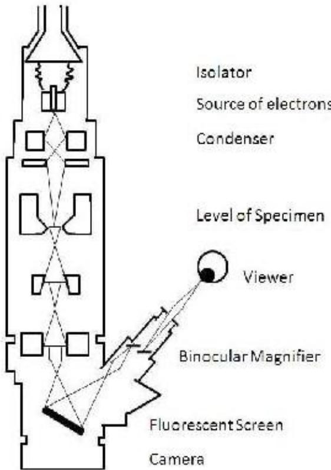

> 🧠 **[Cognis Multimodal Enrichment]**
> * **Classification:** Scientific Figure
> * **Extracted Text (OCR):** `Isolator, Source of electrons, Condenser, Level of Specimen, Viewer, Binocular Magnifier, Fluorescent Screen, Camera`
> * **VLM Visual Summary:** ### FIGURE TYPE:
>   Instrument Schematic
>   
>   ### SCIENTIFIC PURPOSE:
>   This figure explains the principles and components of a Transmission Electron Microscope (TEM).
>   
>   ### KEY KNOWLEDGE:
>   1. **Sample Illumination Source**: The sample illumination source in a TEM is a beam of electrons.
>   2. **Column Under Vacuum**: The beam of electrons travels through a column under vacuum.
>   3. **Electromagnetic Lenses**: The beam is focused into a very narrow beam using electromagnetic lenses.
>   4. **Scattering and Contrast**: Some electrons scatter, and those that do not scatter strike a fluorescent screen, creating a contrast image based on sample density.
>   5. **Resolution Limit**: The limit of resolution is in the order of a few angstroms.
>   6. **Low Resolution TEM**: Low-resolution TEM can provide information about the size and overall shape of the sample.
>   7. **Fluorescent Screen**: The formed image is made visible on a fluorescent screen.
>   8. **Camera**: The image can also be documented on photographic material or captured by a CCD camera.
>   
>   ### LABEL INTERPRETATION:
>   - **Isolator**: Source of electrons
>   - **Condenser**: Focuses the electron beam
>   - **Level of Specimen**: Where the sample is placed
>   - **Viewer**: Observes the image
>   - **Binocular Magnifier**: Enlarges the image
>   - **Fluorescent Screen**: Displays the contrast image
>   - **Camera**: Captures the image
>   
>   ### ENGINEERING/SCIENTIFIC INSIGHTS:
>   A reader should learn that TEM operates on principles similar to the optical microscope but uses a beam of electrons instead of light. The key components include the electron source, condenser, lenses, and detector. The figure illustrates how electrons travel through the sample, scattering and focusing to create a high-resolution image.
>   
>   ### USER-RELEVANT INFORMATION:
>   The figure shows the essential components of a TEM, including the isolator, condenser, level of specimen, viewer, binocular magnifier, fluorescent screen, and camera. Understanding these components helps in interpreting the image quality and resolving power of the TEM.
> * **Figure Caption:** TEM operates on principles similar to that of the optical microscope. The sample illumination source in a TEM is a beam of electrons. This beam of electrons travels through a column under vacuum and is then focused into a very narrow beam with electromagnetic lenses. Some electrons will scatter and those that do not scatter strike a fluorescent screen giving rise to a contrast image based on sample density. Since the limit of resolution is in the order of a few angstroms, it is a very useful and powerful tool for nanoparticles characterization. Low resolution TEM can generally provide information regarding the size and overall shape of the sample and is routinely used to elucidate such information. | Ray Diagram of Transmission Electron Microscope
> * **Surrounding Context (+/- 300 words):**
>   * **[Before]:** *... onto a specimen causing an enlarged version to appear on a fluorescent screen or a layer of photographic film, or to be detected by a CCD camera. Virtually, TEM is useful for determining size, shape and arrangement of the particles which make up the specimen. Transmission electron microscopy (TEM) is typically used for high resolution imaging of thin films of a solid sample for Nano structural and compositional analysis. The technique involves: (i) irradiation of a very thin sample by a high energy electron beam, which is diffracted by the lattices of crystalline or semi crystalline material and propagates along different directions, (ii) imaging and angular distribution analysis of the forward-scattered electrons (unlike SEM where back scattered electrons are detected), and (iii) energy analysis of the emitted X-rays. The topographic information obtained by TEM in the vicinity of atomic resolution can be utilized for structural characterization and identification of various phases of mesoporous materials, viz., hexagonal, cubic or lamellar. TEM also provides real space image on the atomic distribution in the bulk and surface of a nanocrystal. [Section: 5. Transmission Electron Microscopy (TEM)] TEM operates on principles similar to that of the optical microscope. The sample illumination source in a TEM is a beam of electrons. This beam of electrons travels through a column under vacuum and is then focused into a very narrow beam with electromagnetic lenses. Some electrons will scatter and those that do not scatter strike a fluorescent screen giving rise to a contrast image based on sample density. Since the limit of resolution is in the order of a few angstroms, it is a very useful and powerful tool for nanoparticles characterization. Low resolution TEM can generally provide information regarding the size and overall shape of the sample and is routinely used to elucidate such information.*
>   * **[After]:** *Ray Diagram of Transmission Electron Microscope [Section: 5. Transmission Electron Microscopy (TEM)] The ray diagram of TEM is shown in the figure. The accelerated ray of electrons passes a drill-hole at the bottom of the anode. The lens-systems consist of electronic coils generating an electromagnetic field. The ray is first focused by a condenser. It then passes through the object, where it is partially deflected. The degree of deflection depends on the electron density of the object. The greater the mass of the atoms, the greater is the degree of deflection. After passing the object the scattered electrons are collected by an objective. Thereby an image is formed, that is subsequently enlarged by an additional lens-system (called projective with electron microscopes). Thus the formed image is made visible on a fluorescent screen or it is documented on photographic material. Photos taken with electron microscopes are always black and white. [Section: 6. Scanning Electron Microscopy (SEM)] Scanning electron microscope (SEM) is an instrument that is used to observe the morphology of the sample at higher magnification, higher resolution and depth of focus as compared to an optical microscope shown in figure. [Section: Schematic representation of scanning electron microscope] Basically SEM is used for topographical and compositional observations of surfaces, elemental analysis of specimen, internal structure observation, internal characteristics observation, crystalline structure and magnetic domain observation. Mostly scanning electron microscopy is convenient method for grain size determination and studying the microstructural aspects. Electron interaction with elements has been extensively used for the characterization of materials. Scattering of electron from the electrons of the atom results into secondary and backscattered electrons. These scattered electrons give information about the microstructure of sample in the form of image. These images are classified as (a) secondary electron image and (b) backscattered electron image. A secondary electron ...*
  
Ray Diagram of Transmission Electron Microscope

The ray diagram of TEM is shown in the figure. The accelerated ray of electrons passes a drill-hole at the bottom of the anode. The lens-systems consist of electronic coils generating an electromagnetic field. The ray is first focused by a condenser. It then passes through the object, where it is partially deflected. The degree of deflection depends on the electron density of the object. The greater the mass of the atoms, the greater is the degree of deflection. After passing the object the scattered electrons are collected by an objective. Thereby an image is formed, that is subsequently enlarged by an additional lens-system (called projective with electron microscopes). Thus the formed image is made visible on a fluorescent screen or it is documented on photographic material. Photos taken with electron microscopes are always black and white.

## 6. Scanning Electron Microscopy (SEM)

Scanning electron microscope (SEM) is an instrument that is used to observe the morphology of the sample at higher magnification, higher resolution and depth of focus as compared to an optical microscope shown in figure.

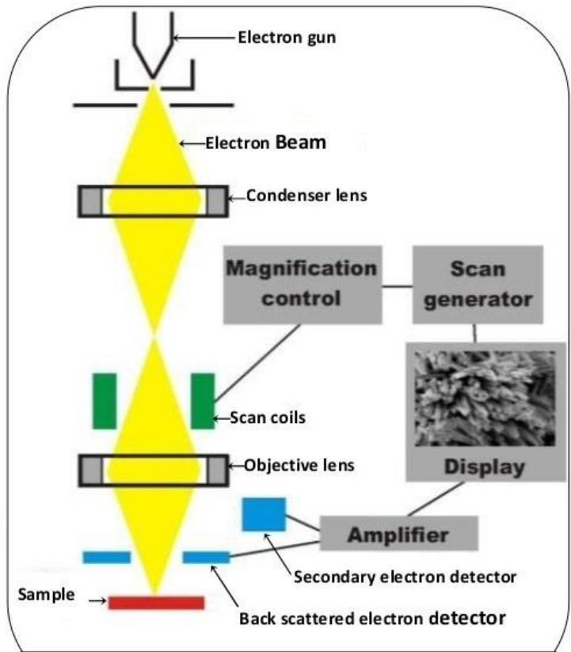

> 🧠 **[Cognis Multimodal Enrichment]**
> * **Classification:** Scientific Figure
> * **Extracted Text (OCR):** `Electron gun, Electron Beam, Condenser lens, Magnification control, Scan generator, Scan coils, Objective lens, Display, Amplifier, Secondary electron detector, Back scattered electron detector, Sample`
> * **VLM Visual Summary:** ### FIGURE TYPE:
>   Instrument Schematic
>   
>   ### SCIENTIFIC PURPOSE:
>   This figure explains the schematic representation of a Scanning Electron Microscope (SEM).
>   
>   ### KEY KNOWLEDGE:
>   1. **Components of SEM**:
>      - **Electron Gun**: Source of high-energy electrons.
>      - **Condenser Lens**: Focuses the electron beam.
>      - **Objective Lens**: Further focuses the electron beam onto the sample.
>      - **Scan Coils**: Control the scanning motion of the electron beam across the sample.
>      - **Secondary Electron Detector**: Captures secondary electrons emitted from the sample.
>      - **Backscattered Electron Detector**: Captures backscattered electrons from the sample.
>      - **Amplifier**: Amplifies the signal from the detectors.
>      - **Display**: Shows the image of the sample.
>   
>   2. **Functionality**:
>      - The electron beam scans the sample, interacting with its surface and subsurface layers.
>      - Secondary and backscattered electrons are detected and used to reconstruct the image of the sample.
>   
>   3. **Applications**:
>      - Used for topographical and compositional observations of surfaces.
>      - Elemental analysis of specimens.
>      - Internal structure observation.
>      - Crystalline structure and magnetic domain observation.
>   
>   4. **Resolution and Magnification**:
>      - Offers higher magnification and resolution compared to optical microscopes.
>      - Depth of focus is enhanced due to the use of multiple lenses.
>   
>   5. **Image Formation**:
>      - Secondary electrons are detected and used to create an image of the sample's surface.
>      - Backscattered electrons provide information about the microstructure and composition.
>   
>   ### LABEL INTERPRETATION:
>   - **Sample**: The object being examined by the SEM.
>   - **Secondary electron detector**: Captures secondary electrons emitted from the sample.
>   - **Backscattered electron detector**: Captures backscattered electrons from the sample.
>   - **Objective lens**: Focuses the electron beam onto the sample.
>   - **Scan coils**: Control the scanning motion of the electron beam.
>   - **Display**: Shows the reconstructed image of the sample.
>   
>   ### ENGINEERING/SCIENTIFIC INSIGHTS:
>   - Understanding the components and function of the SEM provides insight into how high-resolution imaging is achieved using electron interactions with matter.
>   - The ability to observe both surface and subsurface features enhances the versatility of SEM in various scientific applications.
>   
>   ### USER-RELEVANT INFORMATION:
>   - The specific components and their functions (e.g
> * **Figure Caption:** Scanning electron microscope (SEM) is an instrument that is used to observe the morphology of the sample at higher magnification, higher resolution and depth of focus as compared to an optical microscope shown in figure. | [Section: Schematic representation of scanning electron microscope]
> * **Surrounding Context (+/- 300 words):**
>   * **[Before]:** *... of the optical microscope. The sample illumination source in a TEM is a beam of electrons. This beam of electrons travels through a column under vacuum and is then focused into a very narrow beam with electromagnetic lenses. Some electrons will scatter and those that do not scatter strike a fluorescent screen giving rise to a contrast image based on sample density. Since the limit of resolution is in the order of a few angstroms, it is a very useful and powerful tool for nanoparticles characterization. Low resolution TEM can generally provide information regarding the size and overall shape of the sample and is routinely used to elucidate such information. Ray Diagram of Transmission Electron Microscope [Section: 5. Transmission Electron Microscopy (TEM)] The ray diagram of TEM is shown in the figure. The accelerated ray of electrons passes a drill-hole at the bottom of the anode. The lens-systems consist of electronic coils generating an electromagnetic field. The ray is first focused by a condenser. It then passes through the object, where it is partially deflected. The degree of deflection depends on the electron density of the object. The greater the mass of the atoms, the greater is the degree of deflection. After passing the object the scattered electrons are collected by an objective. Thereby an image is formed, that is subsequently enlarged by an additional lens-system (called projective with electron microscopes). Thus the formed image is made visible on a fluorescent screen or it is documented on photographic material. Photos taken with electron microscopes are always black and white. [Section: 6. Scanning Electron Microscopy (SEM)] Scanning electron microscope (SEM) is an instrument that is used to observe the morphology of the sample at higher magnification, higher resolution and depth of focus as compared to an optical microscope shown in figure.*
>   * **[After]:** *[Section: Schematic representation of scanning electron microscope] Basically SEM is used for topographical and compositional observations of surfaces, elemental analysis of specimen, internal structure observation, internal characteristics observation, crystalline structure and magnetic domain observation. Mostly scanning electron microscopy is convenient method for grain size determination and studying the microstructural aspects. Electron interaction with elements has been extensively used for the characterization of materials. Scattering of electron from the electrons of the atom results into secondary and backscattered electrons. These scattered electrons give information about the microstructure of sample in the form of image. These images are classified as (a) secondary electron image and (b) backscattered electron image. A secondary electron image is most generally used to study, the surface topography. In this case, detector is sensitive to electrons that emerge from the specimen to produce a synchronous visual display of the signal on a cathode ray tube screen. With energy > 50 eV are produce by the electron gun, several electromagnetic lenses then focuses this into narrow beam of nearly 2 nm diameter on the sample then the electron beam is scanned across the specimen by the use of scan coils. The secondary electron current produced will vary according to the condition mentioned below. 1) Acceleration potential of incident beam. [Section: Schematic representation of scanning electron microscope] 2) The surface morphology and by specially the angle which incident beam, makes with any particular surface site. 3) The density of any surface site which influences penetration of the incident beam and absorption of the secondary electron. 4) The surface chemistry and crystallography, which influences the potential barrier of secondary emission. 5) The local surface charge accumulation. Interaction of electrons with elements is well understood and has been extensively used for characterizing of the materials. As the electrons can be focused to ...*

## Schematic representation of scanning electron microscope

Basically SEM is used for topographical and compositional observations of surfaces, elemental analysis of specimen, internal structure observation, internal characteristics observation, crystalline structure and magnetic domain observation. Mostly scanning electron microscopy is convenient method for grain size determination and studying the microstructural aspects.

Electron interaction with elements has been extensively used for the characterization of materials. Scattering of electron from the electrons of the atom results into secondary and backscattered electrons. These scattered electrons give information about the microstructure of sample in the form of image. These images are classified as (a) secondary electron image and (b) backscattered electron image.

A secondary electron image is most generally used to study, the surface topography. In this case, detector is sensitive to electrons that emerge from the specimen to produce a synchronous visual display of the signal on a cathode ray tube screen. With energy > 50 eV are produce by the electron gun, several electromagnetic lenses then focuses this into narrow beam of nearly 2 nm diameter on the sample then the electron beam is scanned across the specimen by the use of scan coils.

The secondary electron current produced will vary according to the condition mentioned below.

1) Acceleration potential of incident beam.

2) The surface morphology and by specially the angle which incident beam, makes with any particular surface site.

3) The density of any surface site which influences penetration of the incident beam and absorption of the secondary electron.

4) The surface chemistry and crystallography, which influences the potential barrier of secondary emission.

5) The local surface charge accumulation.

Interaction of electrons with elements is well understood and has been extensively used for characterizing of the materials. As the electrons can be focused to micron or submicron size, it is well suited for analyzing sub-micron sized areas or features. When an electron strikes the atom, variety of interaction products are evolved. This figure shows the regions from which different signals are detected.

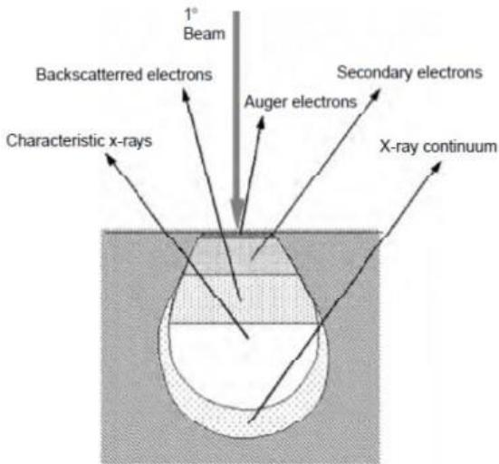

> 🧠 **[Cognis Multimodal Enrichment]**
> * **Classification:** Scientific Figure
> * **Extracted Text (OCR):** `1° Beam, Backscattered electrons, Secondary electrons, Auger electrons, Characteristic x-rays, X-ray continuum`
> * **VLM Visual Summary:** ### FIGURE TYPE:
>   Instrument Schematic
>   
>   ### SCIENTIFIC PURPOSE:
>   This figure illustrates the interaction of electrons with materials using a scanning electron microscope (SEM). It shows the various types of signals that can be detected during the electron-beam-surface interaction, including backscattered electrons, secondary electrons, Auger electrons, characteristic x-rays, and x-ray continuum.
>   
>   ### KEY KNOWLEDGE:
>   1. **Backscattered Electrons**: These are electrons that are scattered back towards the source after interacting with the specimen. They provide information about the microstructure of the sample.
>   2. **Secondary Electrons**: These are electrons that are emitted from the surface of the specimen due to the interaction of primary electrons with the atoms in the specimen. They are useful for imaging the surface topography.
>   3. **Auger Electrons**: These are electrons ejected from the specimen's surface when an inner shell electron is excited by a primary electron. They provide information about the chemical composition of the specimen.
>   4. **Characteristic X-Rays**: These are emitted x-rays that correspond to specific elements in the specimen. They provide information about the chemical composition and elemental distribution.
>   5. **X-Ray Continuum**: This is a broad range of x-rays that result from the interaction of primary electrons with the specimen. It provides information about the overall composition and electronic structure of the specimen.
>   
>   ### LABEL INTERPRETATION:
>   - **Beam**: The primary electron beam used in the SEM.
>   - **Backscattered Electrons**: Electrons scattered back towards the source.
>   - **Secondary Electrons**: Electrons emitted from the surface of the specimen.
>   - **Auger Electrons**: Electrons ejected from the specimen's surface.
>   - **Characteristic X-Rays**: X-rays corresponding to specific elements.
>   - **X-Ray Continuum**: Broad range of x-rays resulting from the interaction of primary electrons with the specimen.
>   
>   ### ENGINEERING/SCIENTIFIC INSIGHTS:
>   A reader should learn that the interaction of electrons with materials using an SEM can provide detailed information about the microstructure, surface topography, chemical composition, and elemental distribution of the specimen. This technique is widely used in materials science and nanotechnology for characterizing sub-micron-sized areas and features.
>   
>   ### USER-RELEVANT INFORMATION:
>   The information provided by this figure includes the types of signals that can be detected in an SEM, such as backscattered electrons, secondary electrons, Auger electrons, characteristic x-rays, and x-ray continuum.
> * **Figure Caption:** Interaction of electrons with elements is well understood and has been extensively used for characterizing of the materials. As the electrons can be focused to micron or submicron size, it is well suited for analyzing sub-micron sized areas or features. When an electron strikes the atom, variety of interaction products are evolved. This figure shows the regions from which different signals are detected. | Illustration of several signals generated by the electron beam-specimen interaction in the SEM and the regions from which the signals can be detected.
> * **Surrounding Context (+/- 300 words):**
>   * **[Before]:** *... is convenient method for grain size determination and studying the microstructural aspects. Electron interaction with elements has been extensively used for the characterization of materials. Scattering of electron from the electrons of the atom results into secondary and backscattered electrons. These scattered electrons give information about the microstructure of sample in the form of image. These images are classified as (a) secondary electron image and (b) backscattered electron image. A secondary electron image is most generally used to study, the surface topography. In this case, detector is sensitive to electrons that emerge from the specimen to produce a synchronous visual display of the signal on a cathode ray tube screen. With energy > 50 eV are produce by the electron gun, several electromagnetic lenses then focuses this into narrow beam of nearly 2 nm diameter on the sample then the electron beam is scanned across the specimen by the use of scan coils. The secondary electron current produced will vary according to the condition mentioned below. 1) Acceleration potential of incident beam. [Section: Schematic representation of scanning electron microscope] 2) The surface morphology and by specially the angle which incident beam, makes with any particular surface site. 3) The density of any surface site which influences penetration of the incident beam and absorption of the secondary electron. 4) The surface chemistry and crystallography, which influences the potential barrier of secondary emission. 5) The local surface charge accumulation. Interaction of electrons with elements is well understood and has been extensively used for characterizing of the materials. As the electrons can be focused to micron or submicron size, it is well suited for analyzing sub-micron sized areas or features. When an electron strikes the atom, variety of interaction products are evolved. This figure shows the regions from which different signals are detected.*
>   * **[After]:** *Illustration of several signals generated by the electron beam-specimen interaction in the SEM and the regions from which the signals can be detected. [Section: Schematic representation of scanning electron microscope] Scattering of electron from the electrons of the atom results into production of backscattered electrons and secondary electrons. Electron may get transmitted through the sample if it is thin. Primary electrons with sufficient energy may knock out the electron from the inner shells of atom and the excited atom may relax with the liberation of Auger electrons or X-ray photons. All these interactions carry information about the sample. Scanning electron microscope is an instrument that uses electrons instead of light waves which are used in conventional microscopes, to observe the morphology of a sample at higher magnification, higher resolution and depth of focus. Of these, backscattered electrons, secondary electrons and transmitted electrons give information about the microstructure of the sample. Auger electron, ejected electrons and X-rays are energies specific to the element from which they are coming. These characteristic signals give information about the chemical identification and composition of the sample. [Section: The SEM work principle is as follows:] 1. Using an electron gun a beam of electrons produces. Electrons may be emitted from a conducting cathode material either by heating it to the point where outer orbital electrons gain sufficient energy to overcome the work function barrier of the conductor (thermionic sources) or by applying an electric field sufficiently strong that electrons "tunnel" through the barrier (field emission sources). Tungsten filament is used as cathode in electron guns. The energy required for a material to give up electrons is related to its work function. For Tungsten this energy is around 4.5 eV. 2. The electron beam follows a vertical path through the microscope, which is held within a vacuum. ...*
  
Illustration of several signals generated by the electron beam-specimen interaction in the SEM and the regions from which the signals can be detected.

Scattering of electron from the electrons of the atom results into production of backscattered electrons and secondary electrons. Electron may get transmitted through the sample if it is thin. Primary electrons with sufficient energy may knock out the electron from the inner shells of atom and the excited atom may relax with the liberation of Auger electrons or X-ray photons. All these interactions carry information about the sample. Scanning electron microscope is an instrument that uses electrons instead of light waves which are used in conventional microscopes, to observe the morphology of a sample at higher magnification, higher resolution and depth of focus.

Of these, backscattered electrons, secondary electrons and transmitted electrons give information about the microstructure of the sample.

Auger electron, ejected electrons and X-rays are energies specific to the element from which they are coming. These characteristic signals give information about the chemical identification and composition of the sample.

## The SEM work principle is as follows:

1. Using an electron gun a beam of electrons produces. Electrons may be emitted from a conducting cathode material either by heating it to the point where outer orbital electrons gain sufficient energy to overcome the work function barrier of the conductor (thermionic sources) or by applying an electric field sufficiently strong that electrons "tunnel" through the barrier (field emission sources). Tungsten filament is used as cathode in electron guns. The energy required for a material to give up electrons is related to its work function. For Tungsten this energy is around 4.5 eV.

2. The electron beam follows a vertical path through the microscope, which is held within a vacuum. The beam travels through electromagnetic fields and electromagnetic lenses, which focus the beam down toward the sample. Once the beam hits the sample, electrons and X-rays are ejected from the sample.

3. Detectors collect these X-rays, backscattered electrons, and secondary electrons and convert them into a signal that is sent to a screen similar to a television screen. This produces the final image.

In scanning electron microscopy, (SEM) an electron beam is scanned across a sample's surface. When the electrons strike the sample, a variety of signals are generated, and it is the detection of specific signals which produces an image or a sample's elemental composition.

The three signals which provide the greatest amount of information in SEM are the secondary electrons, backscattered electrons, and X-rays.

Secondary electrons are emitted from the atoms occupying the top surface and produce a readily interpretable image of the surface. The contrast in the image is determined by the sample morphology. A high resolution image can be obtained because of the small diameter of the primary electron beam.

Backscattered electrons are primary beam electrons which are 'reflected' from atoms in the solid. The contrast in the image produced is determined by the atomic number of the elements in the sample. The image will therefore show the distribution of different chemical phases in the sample. Because these electrons are emitted from a depth in the sample, the resolution in the image is not as good as for secondary electrons.

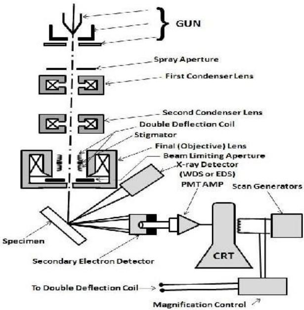

> 🧠 **[Cognis Multimodal Enrichment]**
> * **Classification:** Scientific Figure
> * **Extracted Text (OCR):** `GUN, Spray Aperture, First Condenser Lens, Second Condenser Lens, Double Deflection Coil, Stigmator, Final (Objective) Lens, Beam Limiting Aperture, X-ray Detector (WDS or EDS), PMTAMP, Scan Generators, Specimen, Secondary Electron Detector, To Double Deflection Coil, Magnification Control`
> * **VLM Visual Summary:** ### FIGURE TYPE:
>   Instrument Schematic
>   
>   ### SCIENTIFIC PURPOSE:
>   This figure explains the schematic diagram of a Scanning Electron Microscope (SEM).
>   
>   ### KEY KNOWLEDGE:
>   1. **Primary Beam Path**: The electron beam enters the microscope through the spray aperture and first condenser lens.
>   2. **Deflection and Magnification Control**: The beam is deflected using double deflection coils and magnified using the final objective lens.
>   3. **Sample Interaction**: The electron beam scans across the sample's surface, interacting with atoms to generate various signals.
>   4. **Detectors**: The detectors collect backscattered electrons, secondary electrons, and X-rays.
>   5. **Image Formation**: The detected signals are converted into a signal that is sent to a screen, producing the final image.
>   6. **Contrast Mechanism**: Contrast in the image is determined by the atomic number of the elements in the sample.
>   7. **Resolution**: The resolution is better than for secondary electrons but worse than for backscattered electrons due to the depth of emission.
>   8. **X-ray Detection**: X-rays are detected using X-ray detectors (WDS or EDS), providing elemental composition analysis.
>   9. **Conductive Sample Preparation**: Conductive samples need to be electrically conductive and grounded to avoid charging issues.
>   10. **Field Emission SEM (FESEM)**: FESEM uses field emission instead of conventional emission.
>   
>   ### LABEL INTERPRETATION:
>   - **GUN**: Electron gun
>   - **Spray Aperture**: Entrance to the electron beam
>   - **First Condenser Lens**: First focusing lens
>   - **Second Condenser Lens**: Second focusing lens
>   - **Double Deflection Coil**: Coil for deflecting the electron beam
>   - **Stigmator**: Stigmatic lens
>   - **Final (Objective) Lens**: Final focusing lens
>   - **Beam Limiting Aperture**: Aperture to limit the beam size
>   - **X-ray Detector**: X-ray detector (WDS or EDS)
>   - **PMT/AMP**: Photomultiplier tube/amplifier
>   - **Scan Generators**: Generators for scanning the sample
>   - **CRT**: Cathode ray tube (screen)
>   - **Specimen**: Sample being analyzed
>   - **Secondary Electron Detector**: Detector for secondary electrons
>   - **Magnification Control**: Controls the magnification of the image
>   
>   ### ENGINEERING/SCIENTIFIC INSIGHTS:
>   - **Understanding SEM Operation**: Readers should
> * **Figure Caption:** Backscattered electrons are primary beam electrons which are 'reflected' from atoms in the solid. The contrast in the image produced is determined by the atomic number of the elements in the sample. The image will therefore show the distribution of different chemical phases in the sample. Because these electrons are emitted from a depth in the sample, the resolution in the image is not as good as for secondary electrons. | Schematic Diagram of Scanning Electron Diagram(SEM)
> * **Surrounding Context (+/- 300 words):**
>   * **[Before]:** *... is used as cathode in electron guns. The energy required for a material to give up electrons is related to its work function. For Tungsten this energy is around 4.5 eV. 2. The electron beam follows a vertical path through the microscope, which is held within a vacuum. The beam travels through electromagnetic fields and electromagnetic lenses, which focus the beam down toward the sample. Once the beam hits the sample, electrons and X-rays are ejected from the sample. 3. Detectors collect these X-rays, backscattered electrons, and secondary electrons and convert them into a signal that is sent to a screen similar to a television screen. This produces the final image. In scanning electron microscopy, (SEM) an electron beam is scanned across a sample's surface. When the electrons strike the sample, a variety of signals are generated, and it is the detection of specific signals which produces an image or a sample's elemental composition. [Section: The SEM work principle is as follows:] The three signals which provide the greatest amount of information in SEM are the secondary electrons, backscattered electrons, and X-rays. Secondary electrons are emitted from the atoms occupying the top surface and produce a readily interpretable image of the surface. The contrast in the image is determined by the sample morphology. A high resolution image can be obtained because of the small diameter of the primary electron beam. Backscattered electrons are primary beam electrons which are 'reflected' from atoms in the solid. The contrast in the image produced is determined by the atomic number of the elements in the sample. The image will therefore show the distribution of different chemical phases in the sample. Because these electrons are emitted from a depth in the sample, the resolution in the image is not as good as for secondary electrons.*
>   * **[After]:** *Schematic Diagram of Scanning Electron Diagram(SEM) [Section: The SEM work principle is as follows:] Interaction of the primary beam with atoms in the sample causes shell transitions which result in the emission of an X-ray. The emitted X-ray has an energy characteristic of the parent element. Detection and measurement of the energy permits elemental analysis (Energy Dispersive X-ray Spectroscopy or EDS). EDS can provide rapid qualitative, or with adequate standards, quantitative analysis of elemental composition with a sampling depth of 1-2 microns. X-rays may also be used to form maps or line profiles, showing the elemental distribution in a sample surface. [Section: Why Conductive Samples?] Specimens must be electrically conductive, at least at the surface, and electrically grounded to prevent the accumulation of electrostatic charge at the surface. Metal objects require little special preparation for SEM except for cleaning and mounting on a specimen stub. Non-conductive specimens tend to charge when scanned by the electron beam, and especially in secondary electron imaging mode, this causes scanning faults and other image artifacts. They are therefore usually coated with an ultra-thin coating of electrically conducting material, commonly gold, deposited on the sample either by low vacuum sputter coating or by high vacuum evaporation. Conductive materials currently use for specimen coating include gold, gold/palladium alloy, platinum, osmium, iridium, tungsten, chromium and graphite. Coating prevents the accumulation of static electric charge on the specimen during electron irradiation. Two reasons for coating, even when there is enough specimen conductivity to prevent charging, are to increase signal and surface resolution, especially with samples of low atomic number (Z). The improvement in resolution arises because backscattering and secondary electron emission near the surface are enhanced and thus an image of the surface is formed. [Section: Field emission Scanning Electron Microscopy (FESEM)] Field emission Scanning Electron Microscopy or ...*
  
Schematic Diagram of Scanning Electron Diagram(SEM)

Interaction of the primary beam with atoms in the sample causes shell transitions which result in the emission of an X-ray. The emitted X-ray has an energy characteristic of the parent element. Detection and measurement of the energy permits elemental analysis (Energy Dispersive X-ray Spectroscopy or EDS). EDS can provide rapid qualitative, or with adequate standards, quantitative analysis of elemental composition with a sampling depth of 1-2 microns. X-rays may also be used to form maps or line profiles, showing the elemental distribution in a sample surface.

## Why Conductive Samples?

Specimens must be electrically conductive, at least at the surface, and electrically grounded to prevent the accumulation of electrostatic charge at the surface. Metal objects require little special preparation for SEM except for cleaning and mounting on a specimen stub. Non-conductive specimens tend to charge when scanned by the electron beam, and especially in secondary electron imaging mode, this causes scanning faults and other image artifacts. They are therefore usually coated with an ultra-thin coating of electrically conducting material, commonly gold, deposited on the sample either by low vacuum sputter coating or by high vacuum evaporation. Conductive materials currently use for specimen coating include gold, gold/palladium alloy, platinum, osmium, iridium, tungsten, chromium and graphite. Coating prevents the accumulation of static electric charge on the specimen during electron irradiation.

Two reasons for coating, even when there is enough specimen conductivity to prevent charging, are to increase signal and surface resolution, especially with samples of low atomic number (Z).

The improvement in resolution arises because backscattering and secondary electron emission near the surface are enhanced and thus an image of the surface is formed.

## Field emission Scanning Electron Microscopy (FESEM)

Field emission Scanning Electron Microscopy or FESEM uses field emission gun instead of typical electron gun sources. A field emission gun is a type of electron gun in which a sharply-pointed Muller-type emitter is held at several kilovolts negative potential relative to a nearby electrode, so that there is sufficient potential gradient at the emitter surface to cause field electron emission. Emitters are either of coldcathode type, usually made of single crystal tungsten sharpened to a tip radius of about 100 nm, or of the Schottky type, in which thermionic emission is enhanced by barrier lowering in the presence of a high electric field.

Schottky emitters are made by coating a tungsten tip with a layer of zirconium oxide, which has the unusual property of increasing in electrical conductivity at high temperature.

In electron microscopes, a field emission gun is used to produce an electron beam that is smaller in diameter, more coherent and with up to three orders of magnitude greater current density or brightness than can be achieved with conventional thermionic emitters such as tungsten or lanthanum hexaboride (LaB6)-tipped filaments.

The result in both scanning and transmission electron microscopy is significantly improved signal-to-noise ratio and spatial resolution, and greatly increased emitter life and reliability compared with thermionic devices.

Table 2: Comparison of thermionic and field emission guns
<table><tr><td rowspan=1 colspan=1>Type of Gun</td><td rowspan=1 colspan=1>Brightness (A/mm sr)</td><td rowspan=1 colspan=1>Source Diameter(um)</td></tr><tr><td rowspan=1 colspan=1>Tungsten Hairpin</td><td rowspan=1 colspan=1> $\overline { { 1 0 ^ { 2 } – 1 0 ^ { 3 } } }$ </td><td rowspan=1 colspan=1>50</td></tr><tr><td rowspan=1 colspan=1>Tungsten point,thermionic LaB6</td><td rowspan=1 colspan=1> $\overline { { 1 0 ^ { 3 } – 1 0 ^ { 4 } } }$ </td><td rowspan=1 colspan=1>1-10</td></tr><tr><td rowspan=1 colspan=1>Tungsten point, Fieldemission</td><td rowspan=1 colspan=1>106</td><td rowspan=1 colspan=1>0.01-0.1</td></tr></table>

## 7. Atomic Force Microscopy (AFM)

The principal behind the operation of an AFM in the contact mode is shown in this figure.

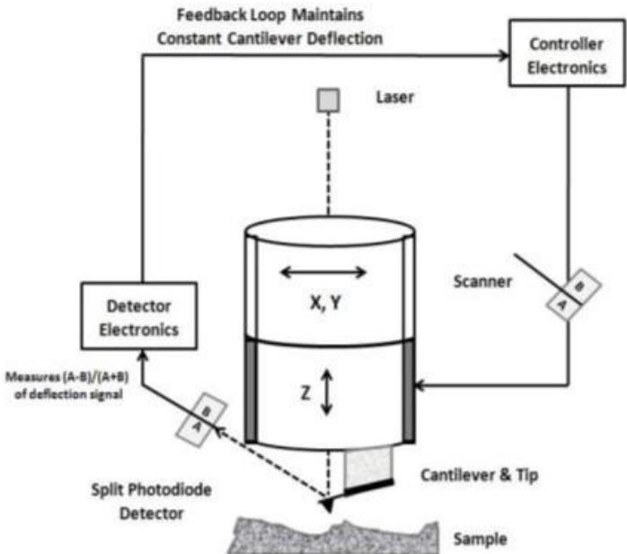

> 🧠 **[Cognis Multimodal Enrichment]**
> * **Classification:** Scientific Figure
> * **Extracted Text (OCR):** `Feedback Loop Maintains, Constant Cantilever Deflection, Controller Electronics, Laser, X, Y, Z, Scanner, Detector Electronics, Measures (A-B)/(A+B) of deflection signal, Split Photodiode Detector, Cantilever & Tip, Sample`
> * **VLM Visual Summary:** ### FIGURE TYPE:
>   Instrument Schematic
>   
>   ### SCIENTIFIC PURPOSE:
>   This figure explains the operation principle of an Atomic Force Microscope (AFM) in contact mode.
>   
>   ### KEY KNOWLEDGE:
>   1. **Atomic Force Microscopy (AFM)**: An imaging technique used to study the surface morphology of materials at the nanoscale.
>   2. **Contact Mode**: The most common mode of AFM, where the tip makes physical contact with the sample surface.
>   3. **Cantilever**: A thin beam with one end fixed and the other free, used to detect small deflections.
>   4. **Deflection Signal**: The movement of the cantilever due to the interaction with the sample.
>   5. **Feedback Loop**: Maintains constant cantilever deflection to ensure accurate measurement.
>   6. **Piezoelectric Actuator**: Moves the scanner in the z-direction to adjust the tip-sample distance.
>   7. **Split Photodiode Detector**: Measures the deflection signal to determine the cantilever's position.
>   8. **Laser Beam**: Reflects off the cantilever surface to provide reference points for the detector.
>   9. **Hooke's Law**: Relates the force acting on the tip to its displacement, used to calculate the force between the tip and the sample.
>   
>   ### LABEL INTERPRETATION:
>   - **Detector Electronics**: Measures the deflection signal.
>   - **Controller Electronics**: Manages the feedback loop to maintain constant cantilever deflection.
>   - **Scanner**: Adjusts the tip-sample distance in the z-direction.
>   - **Sample**: The material being studied.
>   - **Cantilever & Tip**: The movable part of the AFM that interacts with the sample.
>   - **X, Y, Z**: Coordinates for positioning within the sample space.
>   - **Split Photodiode Detector**: Measures the deflection signal.
>   
>   ### ENGINEERING/SCIENTIFIC INSIGHTS:
>   - Understanding how the AFM operates in contact mode is crucial for interpreting topographical images and analyzing surface properties.
>   - The feedback loop ensures precise control over the tip-sample distance, which is essential for obtaining accurate measurements.
>   - The use of Hooke's Law helps in calculating the forces acting on the tip, which is fundamental to understanding the interactions between the tip and the sample.
>   
>   ### USER-RELEVANT INFORMATION:
>   - The specific configuration of the AFM, including the components and their functions, is critical for interpreting the data obtained from the microscope.
>   -
> * **Figure Caption:** The principal behind the operation of an AFM in the contact mode is shown in this figure. | Schematic diagram showing the operation principles of the AFM in contact mode.
> * **Surrounding Context (+/- 300 words):**
>   * **[Before]:** *... a type of electron gun in which a sharply-pointed Muller-type emitter is held at several kilovolts negative potential relative to a nearby electrode, so that there is sufficient potential gradient at the emitter surface to cause field electron emission. Emitters are either of coldcathode type, usually made of single crystal tungsten sharpened to a tip radius of about 100 nm, or of the Schottky type, in which thermionic emission is enhanced by barrier lowering in the presence of a high electric field. Schottky emitters are made by coating a tungsten tip with a layer of zirconium oxide, which has the unusual property of increasing in electrical conductivity at high temperature. In electron microscopes, a field emission gun is used to produce an electron beam that is smaller in diameter, more coherent and with up to three orders of magnitude greater current density or brightness than can be achieved with conventional thermionic emitters such as tungsten or lanthanum hexaboride (LaB6)-tipped filaments. The result in both scanning and transmission electron microscopy is significantly improved signal-to-noise ratio and spatial resolution, and greatly increased emitter life and reliability compared with thermionic devices. Table 2: Comparison of thermionic and field emission guns [Section: Field emission Scanning Electron Microscopy (FESEM)] <table><tr><td rowspan=1 colspan=1>Type of Gun</td><td rowspan=1 colspan=1>Brightness (A/mm sr)</td><td rowspan=1 colspan=1>Source Diameter(um)</td></tr><tr><td rowspan=1 colspan=1>Tungsten Hairpin</td><td rowspan=1 colspan=1> $\overline { { 1 0 ^ { 2 } – 1 0 ^ { 3 } } }$ </td><td rowspan=1 colspan=1>50</td></tr><tr><td rowspan=1 colspan=1>Tungsten point,thermionic LaB6</td><td rowspan=1 colspan=1> $\overline { { 1 0 ^ { 3 } – 1 0 ^ { 4 } } }$ </td><td rowspan=1 colspan=1>1-10</td></tr><tr><td rowspan=1 colspan=1>Tungsten point, Fieldemission</td><td rowspan=1 colspan=1>106</td><td rowspan=1 colspan=1>0.01-0.1</td></tr></table> [Section: 7. Atomic Force Microscopy (AFM)] The principal behind the operation of an AFM in the contact mode is shown in this figure.*
>   * **[After]:** *Schematic diagram showing the operation principles of the AFM in contact mode. The AFM tip is first brought (manually) close to the sample surface, and then the scanner makes an ultimate adjustment in tip–sample distance based on a set point determined by the user. The tip, now in contact with the sample surface through any adsorbed gas layer, is then scanned across the sample under the action of a piezoelectric actuator, either by moving the sample or the tip relative to the other. A laser beam aimed at the back of the cantilever–tip assembly reflects off the cantilever surface to a split photodiode, which detects the small cantilever deflections. A feedback loop, shown schematically in figure, maintains constant tip–sample separation by moving the scanner in the z direction to maintain the set point deflection. Without this feedback loop, the tip would “crash” into a sample with even small topographic features (although this phenomenon can happen even with careful AFM operation). [Section: 7. Atomic Force Microscopy (AFM)] By maintaining a constant tip-sample separation and using Hooke’s Law (F = - k x) where F is force, k is the spring constant, and x is the cantilever deflection), the force between the tip and the sample is calculated. Finally, the distance the scanner moves in the z direction is stored in the computer relative to spatial variation in the x-y plane to generate the topographic image of the sample surface. [Section: Contact Mode] In the so-called contact-AFM mode, the tip makes soft “physical contact” with the surface of the sample. The deflection of the cantilever is proportional to the force acting on the tip, via Hook’s law. In contactmode the tip either scans at a constant small height above the surface or under the conditions of a constant force. In the constant ...*
  
Schematic diagram showing the operation principles of the AFM in contact mode.

The AFM tip is first brought (manually) close to the sample surface, and then the scanner makes an ultimate adjustment in tip–sample distance based on a set point determined by the user. The tip, now in contact with the sample surface through any adsorbed gas layer, is then scanned across the sample under the action of a piezoelectric actuator, either by moving the sample or the tip relative to the other. A laser beam aimed at the back of the cantilever–tip assembly reflects off the cantilever surface to a split photodiode, which detects the small cantilever deflections. A feedback loop, shown schematically in figure, maintains constant tip–sample separation by moving the scanner in the z direction to maintain the set point deflection. Without this feedback loop, the tip would “crash” into a sample with even small topographic features (although this phenomenon can happen even with careful AFM operation).

By maintaining a constant tip-sample separation and using Hooke’s Law (F = - k x) where F is force, k is the spring constant, and x is the cantilever deflection), the force between the tip and the sample is calculated. Finally, the distance the scanner moves in the z direction is stored in the computer relative to spatial variation in the x-y plane to generate the topographic image of the sample surface.

## Modes of operation

## Contact Mode

In the so-called contact-AFM mode, the tip makes soft “physical contact” with the surface of the sample. The deflection of the cantilever is proportional to the force acting on the tip, via Hook’s law. In contactmode the tip either scans at a constant small height above the surface or under the conditions of a constant force. In the constant height mode the height of the tip is fixed, whereas in the constant-force mode the deflection of the cantilever is fixed and the motion of the scanner in z direction is recorded. By using contact-mode AFM, even “atomic resolution” images are obtained.

## Non-Contact Mode

In this mode, the probe operates in the attractive force region and the tipsample interaction is minimized. The use of non-contact mode allowed scanning without influencing the shape of the sample by the tip (sample forces. In most cases, the cantilever of choice for this mode is the one having high spring constant of 100 N/m so that it does not stick to the sample surface at small amplitudes. The tips mainly used for this mode are silicon probes.

## Tapping Mode (intermittent contact Mode)

In tapping mode-AFM the cantilever is oscillating close to its resonance frequency an electronic feedback loop ensures that the oscillation amplitude remains constant, such that a constant tip-sample interaction is maintained during scanning.

Table 3: Properties of the different operation modes in AFM
<table><tr><td rowspan=1 colspan=1>Operationmode</td><td rowspan=1 colspan=1>Contact mode</td><td rowspan=1 colspan=1>Non-contactmode</td><td rowspan=1 colspan=1>Tapping mode</td></tr><tr><td rowspan=1 colspan=1>Tip loadingforce</td><td rowspan=1 colspan=1>Low → high</td><td rowspan=1 colspan=1>low</td><td rowspan=1 colspan=1>low</td></tr><tr><td rowspan=1 colspan=1>Contact with sample surface</td><td rowspan=1 colspan=1>Yes</td><td rowspan=1 colspan=1>No</td><td rowspan=1 colspan=1>Periodical</td></tr><tr><td rowspan=1 colspan=1>Manipulation of sample</td><td rowspan=1 colspan=1>Yes</td><td rowspan=1 colspan=1>No</td><td rowspan=1 colspan=1>Yes</td></tr><tr><td rowspan=1 colspan=1>Contaminationof AFM tip</td><td rowspan=1 colspan=1>Yes</td><td rowspan=1 colspan=1>No</td><td rowspan=1 colspan=1>Yes</td></tr></table>

## 8. Gas Sensing Measurement Assembly

Before giving a description of the assemblies that we have utilized to carry out gas sensitivity measurements on our films, we briefly give below the methodology used to achieve the desired gas concentrations for sensing studies.

The desired gas concentration in parts per million (ppm) was attained by taking a measured quantity of the gas from a canister, containing pressurized gas (\~ 20 kg/cm2) at 1000 ppm concentration, by means of a syringe, and introducing it into an airtight SS housing having a volume of 250 cm3. The gas was injected through a septum in the housing. The “unit” ppm being a volume ratio, 1 ppm of a given gas therefore occupies a volume of $2 . 5 { \times } 1 0 ^ { - 4 } ~ \mathrm { c m } ^ { 3 }$ in $2 5 0 ~ \mathrm { c m } ^ { 3 }$ housing. Therefore, the volume of gas required to be taken in a syringe from a canister containing the gas at 1000 ppm such that it gives rise to 1 ppm of gas concentration in a 250 cm3 housing is $\left( 2 . 5 { \times } 1 0 ^ { - 4 } { \times } 1 0 6 ~ \mathrm { c m } ^ { 3 } \right) / \left( 1 0 0 0 \right) = 0 . 2 5 ~ \mathrm { c m } ^ { 3 }$

Other gas concentrations employed in our gas sensing studies were thus obtained proportionally.

We now describe the set-up, shown in figure below, which was exploited to establish the optimum operating temperature of a deposited film. It consists of an SS heater block that is contained in an airtight SS enclosure having a volume of 250 cm3 with a provision for gas inlet through a septum with a rubber gasket. It also contains a pair of spring-enabled pressure contacts made of nichrome rods, the upper ends of which are brazed to copper wires that go to the connector within the enclosure.

A “Rigol DM3062 model” digital multimeter/ data acquisition system connected to the external leads from the connector was used for resistance measurements. The heater temperature was monitored and controlled using an ON/OFF digital temperature controller unit.

For the purpose of verifying the optimum operating temperature, films were deposited over the entire substrate area of $\sim 8 \times 5 ~ \mathrm { m m } ^ { 2 }$ . Electrical contacts onto the film surfaces were then made by means of pressed aluminum foil. Such a film was then placed on the heater block and its resistance was monitored after placing the pressure contacts onto the Au colloidal pads on the film surface. Sensitivity of the films at a given gas concentration was measured at different temperatures in the range 298- 673 K depending on their nature and response. Once the optimum operating temperature was determined, the undoped and doped ZnO films were applied for the sensing characteristics measurements at their respective optimum temperatures on the above set-up.

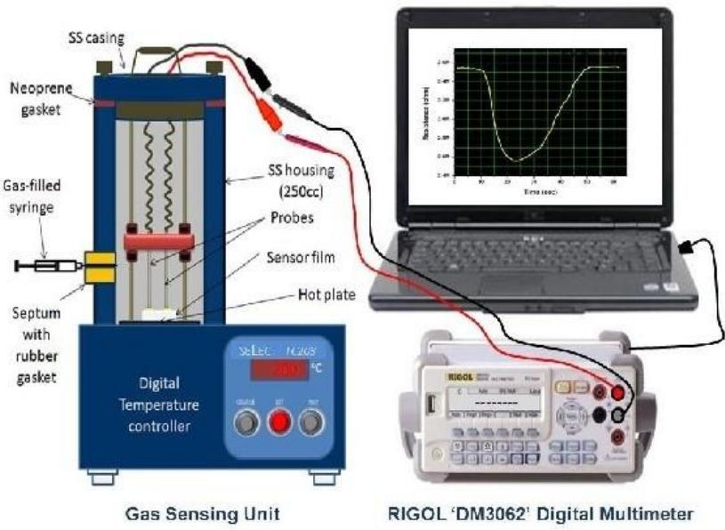

> 🧠 **[Cognis Multimodal Enrichment]**
> * **Classification:** Scientific Figure
> * **Extracted Text (OCR):** `SS casing, Neoprene gasket, Gas-filled syringe, SS housing (250cc), Probes, Sensorfilm, Hot plate, Digital Temperature controller, Gas Sensing Unit, RIGOL 'DM3062' Digital Multimeter`
> * **VLM Visual Summary:** ### FIGURE TYPE:
>   **Experimental Setup**
>   
>   ### SCIENTIFIC PURPOSE:
>   The figure illustrates an experimental setup designed for evaluating the sensitivity of gas sensors under different temperatures. This setup includes a gas-filled chamber, a heating element, and a digital multimeter for monitoring resistance changes.
>   
>   ### KEY KNOWLEDGE:
>   - **Gas Sensor Evaluation System**: The setup consists of an airtight SS chamber containing the sensor film, which is connected to a temperature controller circuit.
>   - **Sensor Film**: The sensor film is placed on a heater block and its resistance is monitored.
>   - **Digital Temperature Controller**: Used to control the temperature of the sensor film.
>   - **Digital Multimeter**: Used to measure the resistance of the sensor film at different temperatures.
>   - **Gas Concentration**: The sensor's sensitivity is measured at various gas concentrations and temperatures.
>   
>   ### LABEL INTERPRETATION:
>   - **Neoprene Gasket**: Seals the chamber.
>   - **SS casing**: Made of stainless steel for durability and heat resistance.
>   - **Gas-filled syringe**: Injects gas into the chamber.
>   - **Septum with rubber gasket**: Provides a seal for the gas inlet.
>   - **Probes**: Connectors for electrical signals.
>   - **Sensorfilm**: The actual sensing material.
>   - **Hot plate**: Heating element for controlling temperature.
>   - **Digital Temperature controller**: Controls the temperature of the sensor film.
>   - **RIGOL 'DM3062' Digital Multimeter**: Measures the resistance of the sensor film.
>   
>   ### ENGINEERING/SCIENTIFIC INSIGHTS:
>   - **Temperature Sensitivity**: The figure demonstrates how the resistance of the sensor film changes with temperature, which is crucial for understanding the optimal operating temperature for the sensor.
>   - **Gas Sensitivity**: The setup allows for the measurement of the sensor's sensitivity to different gas concentrations at various temperatures.
>   
>   ### USER-RELEVANT INFORMATION:
>   - **Optimum Operating Temperature**: The specific temperature at which the sensor exhibits maximum sensitivity.
>   - **Gas Concentration Range**: The range of gas concentrations tested.
>   - **Resistance vs. Time**: The relationship between resistance and time, which helps in understanding the response and recovery characteristics of the sensor.
>   
>   This figure provides a clear and detailed view of the experimental setup used to evaluate gas sensor performance, highlighting key components and their functions.
> * **Figure Caption:** For the purpose of verifying the optimum operating temperature, films were deposited over the entire substrate area of $\sim 8 \times 5 ~ \mathrm { m m } ^ { 2 }$ . Electrical contacts onto the film surfaces were then made by means of pressed aluminum foil. Such a film was then placed on the heater block and its resistance was monitored after placing the pressure contacts onto the Au colloidal pads on the film surface. Sensitivity of the films at a given gas concentration was measured at different temperatures in the range 298- 673 K depending on their nature and response. Once the optimum operating temperature was determined, the undoped and doped ZnO films were applied for the sensing characteristics measurements at their respective optimum temperatures on the above set-up. | Schematic diagram of the sensor evaluation system consisting of an airtight SS chamber with the assembly housing the sensor film connected to a temperature controller circuit.
> * **Surrounding Context (+/- 300 words):**
>   * **[Before]:** *... 1 0 0 0 \right) = 0 . 2 5 ~ \mathrm { c m } ^ { 3 }$ Other gas concentrations employed in our gas sensing studies were thus obtained proportionally. [Section: 8. Gas Sensing Measurement Assembly] We now describe the set-up, shown in figure below, which was exploited to establish the optimum operating temperature of a deposited film. It consists of an SS heater block that is contained in an airtight SS enclosure having a volume of 250 cm3 with a provision for gas inlet through a septum with a rubber gasket. It also contains a pair of spring-enabled pressure contacts made of nichrome rods, the upper ends of which are brazed to copper wires that go to the connector within the enclosure. A “Rigol DM3062 model” digital multimeter/ data acquisition system connected to the external leads from the connector was used for resistance measurements. The heater temperature was monitored and controlled using an ON/OFF digital temperature controller unit. [Section: 8. Gas Sensing Measurement Assembly] For the purpose of verifying the optimum operating temperature, films were deposited over the entire substrate area of $\sim 8 \times 5 ~ \mathrm { m m } ^ { 2 }$ . Electrical contacts onto the film surfaces were then made by means of pressed aluminum foil. Such a film was then placed on the heater block and its resistance was monitored after placing the pressure contacts onto the Au colloidal pads on the film surface. Sensitivity of the films at a given gas concentration was measured at different temperatures in the range 298- 673 K depending on their nature and response. Once the optimum operating temperature was determined, the undoped and doped ZnO films were applied for the sensing characteristics measurements at their respective optimum temperatures on the above set-up.*
>   * **[After]:** *Schematic diagram of the sensor evaluation system consisting of an airtight SS chamber with the assembly housing the sensor film connected to a temperature controller circuit. [Section: Response and recovery measurements] For response and recovery measurements, film response to a particular gas is studied by introducing the gas of known concentration into the housing and recording the resistance using Rigol digital multimeter as a function of time till its steady state value is reached. The housing is then opened to the atmosphere and the subsequent film recovery on gas removal is recorded that is characterized by the resistance reaching its base value. The response and recovery characteristics of films exposed to different gas concentrations are thus studied by plotting their resistance as a function of time. [Section: 9. Raman Spectral Study] Raman spectroscopy is different from the rotational and vibrational spectroscopy considered above in that it is concern with the scattering of radiation by the simple, rather than an absorption process. It is named after the Indian physicists who first observe it in 1928, C. V. Raman. Both rotational and vibrational spectroscopies are possible. The energy of the exciting radiation will determine which type of the transition occursrotational transitions are lower in energy than vibrational transitions. In addition to this, rotational transitions are around three orders of magnitude slower than vibrational transitions. Therefore, collisions with other molecule may occur in the time in which the transition is occurring. A collision is likely to change the rotational state of the molecule, and so the definition of the spectrum obtained will destroyed. Rotational spectroscopy is therefore carried out on gases at low pressure to ensure that the time between the collisions is greater than the time for transition. The basic set up of Raman spectrometer is shown below. Basic set up of ...*
  
Schematic diagram of the sensor evaluation system consisting of an airtight SS chamber with the assembly housing the sensor film connected to a temperature controller circuit.

## Response and recovery measurements

For response and recovery measurements, film response to a particular gas is studied by introducing the gas of known concentration into the housing and recording the resistance using Rigol digital multimeter as a function of time till its steady state value is reached.

The housing is then opened to the atmosphere and the subsequent film recovery on gas removal is recorded that is characterized by the resistance reaching its base value. The response and recovery characteristics of films exposed to different gas concentrations are thus studied by plotting their resistance as a function of time.

## 9. Raman Spectral Study

Raman spectroscopy is different from the rotational and vibrational spectroscopy considered above in that it is concern with the scattering of radiation by the simple, rather than an absorption process. It is named after the Indian physicists who first observe it in 1928, C. V. Raman. Both rotational and vibrational spectroscopies are possible. The energy of the exciting radiation will determine which type of the transition occursrotational transitions are lower in energy than vibrational transitions. In addition to this, rotational transitions are around three orders of magnitude slower than vibrational transitions. Therefore, collisions with other molecule may occur in the time in which the transition is occurring. A collision is likely to change the rotational state of the molecule, and so the definition of the spectrum obtained will destroyed. Rotational spectroscopy is therefore carried out on gases at low pressure to ensure that the time between the collisions is greater than the time for transition. The basic set up of Raman spectrometer is shown below.

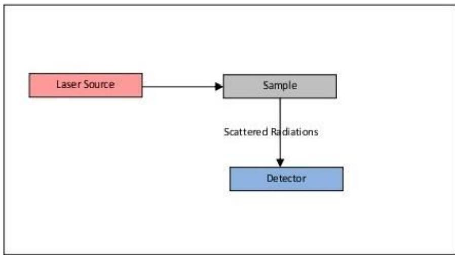

> 🧠 **[Cognis Multimodal Enrichment]**
> * **Classification:** Scientific Figure
> * **Extracted Text (OCR):** `Laser Source, Sample, Scattered Radiations, Detector`
> * **VLM Visual Summary:** ### FIGURE TYPE:
>   Instrument Schematic
>   
>   ### SCIENTIFIC PURPOSE:
>   The figure illustrates the basic setup of a Raman spectrometer.
>   
>   ### KEY KNOWLEDGE:
>   - **Laser Source:** Provides intense monochromatic radiation, typically a laser.
>   - **Sample:** The substance being analyzed.
>   - **Scattered Radiations:** The scattered light produced by the sample.
>   - **Detector:** Captures the scattered light to detect the Raman signal.
>   
>   ### LABEL INTERPRETATION:
>   - **Laser Source:** Red box labeled "Laser Source."
>   - **Sample:** Grey box labeled "Sample."
>   - **Scattered Radiations:** Arrow pointing from the Sample to the Detector, labeled "Scattered Radiations."
>   - **Detector:** Blue box labeled "Detector."
>   
>   ### ENGINEERING/SCIENTIFIC INSIGHTS:
>   A reader should learn that Raman spectroscopy involves the scattering of radiation by a sample, which is detected by a sensitive instrument. This technique is used to study molecular vibrations and rotations by observing the scattered light's frequency shift relative to the incident radiation.
>   
>   ### USER-RELEVANT INFORMATION:
>   The information provided in the figure helps answer questions about the fundamental components of a Raman spectrometer, including the role of each part in the measurement process. Understanding the flow of radiation through the system and how it is detected is crucial for interpreting Raman spectra and applying the technique in various scientific fields.
> * **Figure Caption:** Raman spectroscopy is different from the rotational and vibrational spectroscopy considered above in that it is concern with the scattering of radiation by the simple, rather than an absorption process. It is named after the Indian physicists who first observe it in 1928, C. V. Raman. Both rotational and vibrational spectroscopies are possible. The energy of the exciting radiation will determine which type of the transition occursrotational transitions are lower in energy than vibrational transitions. In addition to this, rotational transitions are around three orders of magnitude slower than vibrational transitions. Therefore, collisions with other molecule may occur in the time in which the transition is occurring. A collision is likely to change the rotational state of the molecule, and so the definition of the spectrum obtained will destroyed. Rotational spectroscopy is therefore carried out on gases at low pressure to ensure that the time between the collisions is greater than the time for transition. The basic set up of Raman spectrometer is shown below. | Basic set up of Raman Spectrometer.
> * **Surrounding Context (+/- 300 words):**
>   * **[Before]:** *... on the above set-up. Schematic diagram of the sensor evaluation system consisting of an airtight SS chamber with the assembly housing the sensor film connected to a temperature controller circuit. [Section: Response and recovery measurements] For response and recovery measurements, film response to a particular gas is studied by introducing the gas of known concentration into the housing and recording the resistance using Rigol digital multimeter as a function of time till its steady state value is reached. The housing is then opened to the atmosphere and the subsequent film recovery on gas removal is recorded that is characterized by the resistance reaching its base value. The response and recovery characteristics of films exposed to different gas concentrations are thus studied by plotting their resistance as a function of time. [Section: 9. Raman Spectral Study] Raman spectroscopy is different from the rotational and vibrational spectroscopy considered above in that it is concern with the scattering of radiation by the simple, rather than an absorption process. It is named after the Indian physicists who first observe it in 1928, C. V. Raman. Both rotational and vibrational spectroscopies are possible. The energy of the exciting radiation will determine which type of the transition occursrotational transitions are lower in energy than vibrational transitions. In addition to this, rotational transitions are around three orders of magnitude slower than vibrational transitions. Therefore, collisions with other molecule may occur in the time in which the transition is occurring. A collision is likely to change the rotational state of the molecule, and so the definition of the spectrum obtained will destroyed. Rotational spectroscopy is therefore carried out on gases at low pressure to ensure that the time between the collisions is greater than the time for transition. The basic set up of Raman spectrometer is shown below.*
>   * **[After]:** *Basic set up of Raman Spectrometer. [Section: 9. Raman Spectral Study] Note that the detector is orthogonal to the direction of the incident radiation, so as to observe only scattered light. The source needs to provide intense monochromatic radiation, and usually laser. The criteria for a molecule to be Raman active are also different to other types of spectroscopy, which required permanent magnetic dipole moment, at least for diatomic molecules. A molecule will only be Raman if the following gross selection rule is fulfilled. [Section: 1) Gross Selection Rule:] For spectroscopic techniques such as infrared spectroscopy, as seen in the first section it is necessary for the molecule being analyzed to have a permanent electric dipole. This is not the case for Raman spectroscopy; rather it is the polarizability (ᾳ) of the molecule which is important. The oscillating electric field of a photon causes charged particles (electrons and, to a lesser extent, nuclei) in the molecule to oscillate. This leads to an induced electric dipole moment, μind $$ { \mathrm { W h e r e ~ } } \mu { \mathrm { i n d } } = ( \alpha ) { \mathrm { ~ E } } $$ This induced dipole moment then emits a photon, leading to either Raman or Raleigh scattering. The energy of this interaction is also dependent on the polarizability: Energy of interaction = -1/2 ᾳ E 2 By comparison with the equation for the interaction energy for other forms of spectroscopy, it can be seen that the energies of Raman transitions are relatively weak. To counter this, a higher intensity of the exciting radiation is used. For Raman scattering to occur, the polarizability of the molecule must vary with its orientation. One of the strengths of Raman spectroscopy is that this will be ...*
  
Basic set up of Raman Spectrometer.

Note that the detector is orthogonal to the direction of the incident radiation, so as to observe only scattered light. The source needs to provide intense monochromatic radiation, and usually laser. The criteria for a molecule to be Raman active are also different to other types of spectroscopy, which required permanent magnetic dipole moment, at least for diatomic molecules. A molecule will only be Raman if the following gross selection rule is fulfilled.

## 1) Gross Selection Rule:

For spectroscopic techniques such as infrared spectroscopy, as seen in the first section it is necessary for the molecule being analyzed to have a permanent electric dipole. This is not the case for Raman spectroscopy; rather it is the polarizability (ᾳ) of the molecule which is important.

The oscillating electric field of a photon causes charged particles (electrons and, to a lesser extent, nuclei) in the molecule to oscillate. This leads to an induced electric dipole moment, μind

$$
{ \mathrm { W h e r e ~ } } \mu { \mathrm { i n d } } = ( \alpha ) { \mathrm { ~ E } }
$$

This induced dipole moment then emits a photon, leading to either Raman or Raleigh scattering. The energy of this interaction is also dependent on the polarizability:

Energy of interaction = -1/2 ᾳ E 2

By comparison with the equation for the interaction energy for other forms of spectroscopy, it can be seen that the energies of Raman transitions are relatively weak.

To counter this, a higher intensity of the exciting radiation is used.

For Raman scattering to occur, the polarizability of the molecule must vary with its orientation. One of the strengths of Raman spectroscopy is that this will be true for both heteronuclear and homonuclear diatomic molecules. Homonuclear diatomic molecules do not possess a permanent electric dipole, and so are undetectable by other methods such as infrared.

## 2) Selection Rules Arising from Quantum Mechanics:

A detailed discussion of the quantum mechanical basis for spectroscopy is beyond the scope of this brief introduction. Here, the quantum numbers and the allowed transitions involved are simply stated.

## 2.1 Rotational

To find allowed rotational transitions, the total angular momentum quantum number for rotational energy states, J, must be considered. Raman spectroscopy involves a 2 photon process, each of which obeys:

$$
\Delta \mathbf { J } = \pm 1
$$

Therefore, for the overall transition

$$
\Delta \mathbf { J } = \pm 2
$$

Where, $\Delta \Theta = 0$ for corresponds to Raleigh scattering,

ΔJ = 0 corresponds to a Stokes transition,

And $\Delta \mathrm { J } = - 2$ corresponds to an anti-Stokes transition.

## 2.2 Vibrational

To find allowed transitions the vibrational quantum number, ʋ must be considered.

For the overall transition,

$$
\Delta \ v = \pm 1
$$

Transitions where $\Delta \ v = \pm 2$ are also possible, but these are of weaker intensity.

## 2.3 Types of Scattering

Consider a light wave as a stream of photons each with energy hʋ When each photon collides with a molecule, many things may happen, 2 of which are considered below:

## a) Elastic, or Raleigh Scattering

This is when the photon simply 'bounces' off the molecule, with no exchange in energy. The vast majority of photons will be scattered in this way.

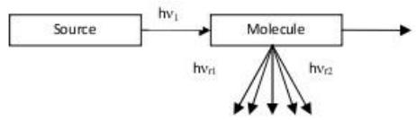

> 🧠 **[Cognis Multimodal Enrichment]**
> * **Classification:** Scientific Figure
> * **Extracted Text (OCR):** `Source,Molecule,hv1,hvr1,hvc`
> * **VLM Visual Summary:** ### FIGURE TYPE:
>   - **Other**
>   
>   ### SCIENTIFIC PURPOSE:
>   The figure explains the concept of Raman scattering, specifically illustrating the process where a photon interacts with a molecule and results in the emission of a photon with a different frequency than the incident photon.
>   
>   ### KEY KNOWLEDGE:
>   1. **Raman Scattering Process**: 
>      - A photon interacts with a molecule.
>      - The molecule can absorb energy from the photon, transitioning to a higher energy state.
>      - The molecule then relaxes back to a lower energy state, emitting a photon with a different frequency.
>      - This process is characterized by the emission of a photon with a frequency \( h\nu_r \) that is different from the incident photon frequency \( h\nu_1 \).
>   
>   2. **Energy States**:
>      - The molecule has three energy states labeled \( E_1 \), \( E_2 \), and \( E_3 \).
>      - The molecule starts in the \( E_2 \) state.
>      - It absorbs energy \( h\nu_1 \) from the incident photon.
>      - The molecule relaxes to either \( E_1 \) or \( E_3 \), emitting a photon with frequency \( h\nu_r \).
>   
>   3. **Transitions**:
>      - The transitions are classified as:
>        - **Stokes Transitions**: \( \Delta \nu = +1 \)
>        - **Anti-Stokes Transitions**: \( \Delta \nu = -1 \)
>   
>   4. **Energy Exchange**:
>      - The molecule gains or loses energy during the transition.
>      - The emitted photon has a frequency \( h\nu_r \) that is different from \( h\nu_1 \).
>   
>   5. **Inelastic Scattering**:
>      - This type of scattering involves an exchange of energy between the photon and the molecule.
>      - The vast majority of photons scatter in this manner.
>   
>   6. **Selection Rules**:
>      - The selection rules for Raman scattering involve changes in the vibrational quantum number \( \nu \) and the rotational quantum number \( J \).
>      - For rotational transitions, \( \Delta J = \pm 1 \).
>      - For vibrational transitions, \( \Delta \nu = \pm 1 \).
>   
>   7. **Quantum Mechanical Basis**:
>      - The quantum mechanical basis for spectroscopy is discussed briefly.
>      - Allowed transitions are determined by the quantum numbers
> * **Figure Caption:** This is when the photon simply 'bounces' off the molecule, with no exchange in energy. The vast majority of photons will be scattered in this way. | [Section: b) Inelastic, or Raman Scattering]
> * **Surrounding Context (+/- 300 words):**
>   * **[Before]:** *... of the exciting radiation is used. For Raman scattering to occur, the polarizability of the molecule must vary with its orientation. One of the strengths of Raman spectroscopy is that this will be true for both heteronuclear and homonuclear diatomic molecules. Homonuclear diatomic molecules do not possess a permanent electric dipole, and so are undetectable by other methods such as infrared. [Section: 2) Selection Rules Arising from Quantum Mechanics:] A detailed discussion of the quantum mechanical basis for spectroscopy is beyond the scope of this brief introduction. Here, the quantum numbers and the allowed transitions involved are simply stated. [Section: 2.1 Rotational] To find allowed rotational transitions, the total angular momentum quantum number for rotational energy states, J, must be considered. Raman spectroscopy involves a 2 photon process, each of which obeys: $$ \Delta \mathbf { J } = \pm 1 $$ Therefore, for the overall transition $$ \Delta \mathbf { J } = \pm 2 $$ Where, $\Delta \Theta = 0$ for corresponds to Raleigh scattering, ΔJ = 0 corresponds to a Stokes transition, And $\Delta \mathrm { J } = - 2$ corresponds to an anti-Stokes transition. [Section: 2.2 Vibrational] To find allowed transitions the vibrational quantum number, ʋ must be considered. For the overall transition, $$ \Delta \ v = \pm 1 $$ Transitions where $\Delta \ v = \pm 2$ are also possible, but these are of weaker intensity. [Section: 2.3 Types of Scattering] Consider a light wave as a stream of photons each with energy hʋ When each photon collides with a molecule, many things may happen, 2 of which are considered below: [Section: a) Elastic, or Raleigh Scattering] This is when the photon simply 'bounces' off the molecule, with no exchange in energy. The vast majority of photons will be scattered in this way.*
>   * **[After]:** *[Section: b) Inelastic, or Raman Scattering] This is when there is an exchange of energy between the photon and the molecule, leading to the emission of another photon with a different frequency to the incident photon: This scattering phenomenon takes place as shown follows. Scattering phenomenon in Raman Spectroscopy [Section: 3) Raman Scattering] The molecule may either gain energy from, or lose energy to, the photon. In the diagram below, 3 energy states of the molecule are shown $( \operatorname { E } _ { 1 } , \operatorname { E } _ { 2 } .$ E3). The molecule is originally at the $\mathrm { E } _ { 2 }$ energy state. The photon interacts with the molecule, exciting it with an energy hʋ1. However, there is no stationary state of the molecule corresponding to this energy, and so the molecule relaxes down to one of the energy levels shown. In doing this, it emits a photon. If the molecule relaxes to energy state E1, it will have lost energy, and so the photon emitted will have energy hʋr1, where $\mathrm { { h } } \mathfrak { v } _ { \mathbf { r } 1 } > \mathrm { { h } } \mathfrak { v } _ { 1 }$ . These transitions are known as anti-Stokes transitions. If the molecule relaxes to energy state $\operatorname { E } _ { 3 } .$ it will have gained energy, and so the photon emitted will have energy h $1 0 \mathbf { r } 2 .$ , where h $\boldsymbol { \ v } _ { \mathbf { r } 2 } < \mathbf { h } \boldsymbol { \ v } _ { 1 }$ These transitions are known as Stokes transitions. For rotational ...*

## b) Inelastic, or Raman Scattering

This is when there is an exchange of energy between the photon and the molecule, leading to the emission of another photon with a different frequency to the incident photon:

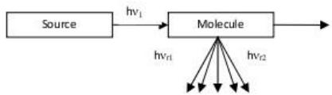

> 🧠 **[Cognis Multimodal Enrichment]**
> * **Classification:** Scientific Figure
> * **Extracted Text (OCR):** `Source, Molecule, hv1, hv2, hv3`
> * **VLM Visual Summary:** ### FIGURE TYPE:
>   - **Other**
>   
>   ### SCIENTIFIC PURPOSE:
>   The figure explains the concept of Raman scattering, specifically how a molecule absorbs a photon of energy \( h\nu_1 \) and then emits a photon of energy \( h\nu_2 \), where \( h\nu_2 \neq h\nu_1 \).
>   
>   ### KEY KNOWLEDGE:
>   1. **Raman Scattering Process**: 
>      - A molecule absorbs a photon of energy \( h\nu_1 \).
>      - The molecule then relaxes to a higher energy level \( E_3 \) and emits a photon of energy \( h\nu_2 \).
>      - The emitted photon has a different frequency than the incident photon (\( h\nu_2 \neq h\nu_1 \)).
>      - This process is called Raman scattering.
>   
>   2. **Energy States**:
>      - The molecule initially exists in an energy state \( E_2 \).
>      - It absorbs a photon of energy \( h\nu_1 \) and relaxes to an energy state \( E_3 \).
>      - The emitted photon has energy \( h\nu_2 \), where \( h\nu_2 < h\nu_1 \) for anti-Stokes transitions and \( h\nu_2 > h\nu_1 \) for Stokes transitions.
>   
>   3. **Transitions**:
>      - The allowed transitions in Raman spectroscopy involve changes in the vibrational quantum number \( \nu \) and the rotational quantum number \( J \).
>      - For rotational spectroscopy, both Stokes and anti-Stokes transitions are observed.
>      - For vibrational spectroscopy, Stokes transitions are more common, and anti-Stokes transitions are often negligible.
>   
>   4. **Photon Energy**:
>      - The energy of a photon is given by \( h\nu \), where \( h \) is Planck's constant and \( \nu \) is the frequency of the photon.
>   
>   5. **Scattering Mechanisms**:
>      - There are two types of scattering: elastic (Raleigh scattering) and inelastic (Raman scattering).
>      - Elastic scattering occurs when the photon simply 'bounces' off the molecule without exchanging energy.
>      - Inelastic scattering occurs when the photon exchanges energy with the molecule, leading to the emission of a photon with a different frequency.
>   
>   6. **Quantum Mechanical Basis**:
>      -
> * **Figure Caption:** This is when there is an exchange of energy between the photon and the molecule, leading to the emission of another photon with a different frequency to the incident photon: | This scattering phenomenon takes place as shown follows.
> * **Surrounding Context (+/- 300 words):**
>   * **[Before]:** *... heteronuclear and homonuclear diatomic molecules. Homonuclear diatomic molecules do not possess a permanent electric dipole, and so are undetectable by other methods such as infrared. [Section: 2) Selection Rules Arising from Quantum Mechanics:] A detailed discussion of the quantum mechanical basis for spectroscopy is beyond the scope of this brief introduction. Here, the quantum numbers and the allowed transitions involved are simply stated. [Section: 2.1 Rotational] To find allowed rotational transitions, the total angular momentum quantum number for rotational energy states, J, must be considered. Raman spectroscopy involves a 2 photon process, each of which obeys: $$ \Delta \mathbf { J } = \pm 1 $$ Therefore, for the overall transition $$ \Delta \mathbf { J } = \pm 2 $$ Where, $\Delta \Theta = 0$ for corresponds to Raleigh scattering, ΔJ = 0 corresponds to a Stokes transition, And $\Delta \mathrm { J } = - 2$ corresponds to an anti-Stokes transition. [Section: 2.2 Vibrational] To find allowed transitions the vibrational quantum number, ʋ must be considered. For the overall transition, $$ \Delta \ v = \pm 1 $$ Transitions where $\Delta \ v = \pm 2$ are also possible, but these are of weaker intensity. [Section: 2.3 Types of Scattering] Consider a light wave as a stream of photons each with energy hʋ When each photon collides with a molecule, many things may happen, 2 of which are considered below: [Section: a) Elastic, or Raleigh Scattering] This is when the photon simply 'bounces' off the molecule, with no exchange in energy. The vast majority of photons will be scattered in this way. [Section: b) Inelastic, or Raman Scattering] This is when there is an exchange of energy between the photon and the molecule, leading to the emission of another photon with a different frequency to the incident photon:*
>   * **[After]:** *This scattering phenomenon takes place as shown follows. Scattering phenomenon in Raman Spectroscopy [Section: 3) Raman Scattering] The molecule may either gain energy from, or lose energy to, the photon. In the diagram below, 3 energy states of the molecule are shown $( \operatorname { E } _ { 1 } , \operatorname { E } _ { 2 } .$ E3). The molecule is originally at the $\mathrm { E } _ { 2 }$ energy state. The photon interacts with the molecule, exciting it with an energy hʋ1. However, there is no stationary state of the molecule corresponding to this energy, and so the molecule relaxes down to one of the energy levels shown. In doing this, it emits a photon. If the molecule relaxes to energy state E1, it will have lost energy, and so the photon emitted will have energy hʋr1, where $\mathrm { { h } } \mathfrak { v } _ { \mathbf { r } 1 } > \mathrm { { h } } \mathfrak { v } _ { 1 }$ . These transitions are known as anti-Stokes transitions. If the molecule relaxes to energy state $\operatorname { E } _ { 3 } .$ it will have gained energy, and so the photon emitted will have energy h $1 0 \mathbf { r } 2 .$ , where h $\boldsymbol { \ v } _ { \mathbf { r } 2 } < \mathbf { h } \boldsymbol { \ v } _ { 1 }$ These transitions are known as Stokes transitions. For rotational spectroscopy, both Stokes and anti-Stokes transitions are seen. For vibrational spectroscopy, Stokes transitions are far more common, and so anti- Stokes transitions can effectively be ignored. Stokes and anti- stokes transition [Section: 10. Fourier Transforms Infrared ...*
  
This scattering phenomenon takes place as shown follows.

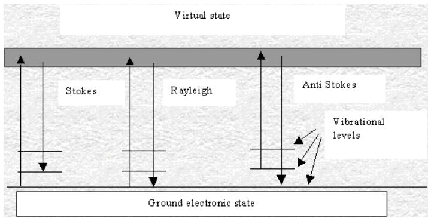

> 🧠 **[Cognis Multimodal Enrichment]**
> * **Classification:** Scientific Figure
> * **Extracted Text (OCR):** `Virtual state, Stokes, Rayleigh, Anti Stokes, Vibrational levels, Ground electronic state`
> * **VLM Visual Summary:** ### FIGURE TYPE:
>   - **Phase Diagram**
>   
>   ### SCIENTIFIC PURPOSE:
>   The figure explains the energy levels and transitions in Raman spectroscopy, specifically focusing on the different types of scattering phenomena that occur during the interaction of light with molecules.
>   
>   ### KEY KNOWLEDGE:
>   1. **Ground Electronic State**: The lowest energy level of the molecule.
>   2. **Virtual State**: An intermediate state that is not physically real but is necessary for understanding the energy levels.
>   3. **Stokes Transition**: Energy is transferred from the incident photon to the molecule, resulting in a higher energy level.
>   4. **Rayleigh Scattering**: No energy transfer occurs; the photon simply 'bounces' off the molecule.
>   5. **Anti-Stokes Transition**: Energy is transferred from the molecule to the incident photon, resulting in a lower energy level.
>   6. **Vibrational Levels**: The energy levels associated with molecular vibrations.
>   7. **Vibrational Transitions**: Transitions between vibrational energy levels within the same electronic state.
>   
>   ### LABEL INTERPRETATION:
>   - **Virtual State**: Uncertain (not explicitly mentioned in the caption)
>   - **Stokes**: Uncertain (not explicitly mentioned in the caption)
>   - **Rayleigh**: Uncertain (not explicitly mentioned in the caption)
>   - **Anti-Stokes**: Uncertain (not explicitly mentioned in the caption)
>   - **Vibrational Levels**: Uncertain (not explicitly mentioned in the caption)
>   
>   ### ENGINEERING/SCIENTIFIC INSIGHTS:
>   A reader should learn that Raman spectroscopy involves the excitation of molecules by light, leading to energy transfers that result in the emission of photons with different frequencies. This leads to the identification of molecular vibrations and the distinction between Stokes and anti-Stokes transitions.
>   
>   ### USER-RELEVANT INFORMATION:
>   The figure provides a clear representation of the energy levels and transitions in Raman spectroscopy, which can be used to understand how molecules absorb and emit light at specific frequencies. This information is crucial for interpreting Raman spectra and identifying molecular structures based on their vibrational modes.
> * **Figure Caption:** This scattering phenomenon takes place as shown follows. | Scattering phenomenon in Raman Spectroscopy
> * **Surrounding Context (+/- 300 words):**
>   * **[Before]:** *... do not possess a permanent electric dipole, and so are undetectable by other methods such as infrared. [Section: 2) Selection Rules Arising from Quantum Mechanics:] A detailed discussion of the quantum mechanical basis for spectroscopy is beyond the scope of this brief introduction. Here, the quantum numbers and the allowed transitions involved are simply stated. [Section: 2.1 Rotational] To find allowed rotational transitions, the total angular momentum quantum number for rotational energy states, J, must be considered. Raman spectroscopy involves a 2 photon process, each of which obeys: $$ \Delta \mathbf { J } = \pm 1 $$ Therefore, for the overall transition $$ \Delta \mathbf { J } = \pm 2 $$ Where, $\Delta \Theta = 0$ for corresponds to Raleigh scattering, ΔJ = 0 corresponds to a Stokes transition, And $\Delta \mathrm { J } = - 2$ corresponds to an anti-Stokes transition. [Section: 2.2 Vibrational] To find allowed transitions the vibrational quantum number, ʋ must be considered. For the overall transition, $$ \Delta \ v = \pm 1 $$ Transitions where $\Delta \ v = \pm 2$ are also possible, but these are of weaker intensity. [Section: 2.3 Types of Scattering] Consider a light wave as a stream of photons each with energy hʋ When each photon collides with a molecule, many things may happen, 2 of which are considered below: [Section: a) Elastic, or Raleigh Scattering] This is when the photon simply 'bounces' off the molecule, with no exchange in energy. The vast majority of photons will be scattered in this way. [Section: b) Inelastic, or Raman Scattering] This is when there is an exchange of energy between the photon and the molecule, leading to the emission of another photon with a different frequency to the incident photon: This scattering phenomenon takes place as shown follows.*
>   * **[After]:** *Scattering phenomenon in Raman Spectroscopy [Section: 3) Raman Scattering] The molecule may either gain energy from, or lose energy to, the photon. In the diagram below, 3 energy states of the molecule are shown $( \operatorname { E } _ { 1 } , \operatorname { E } _ { 2 } .$ E3). The molecule is originally at the $\mathrm { E } _ { 2 }$ energy state. The photon interacts with the molecule, exciting it with an energy hʋ1. However, there is no stationary state of the molecule corresponding to this energy, and so the molecule relaxes down to one of the energy levels shown. In doing this, it emits a photon. If the molecule relaxes to energy state E1, it will have lost energy, and so the photon emitted will have energy hʋr1, where $\mathrm { { h } } \mathfrak { v } _ { \mathbf { r } 1 } > \mathrm { { h } } \mathfrak { v } _ { 1 }$ . These transitions are known as anti-Stokes transitions. If the molecule relaxes to energy state $\operatorname { E } _ { 3 } .$ it will have gained energy, and so the photon emitted will have energy h $1 0 \mathbf { r } 2 .$ , where h $\boldsymbol { \ v } _ { \mathbf { r } 2 } < \mathbf { h } \boldsymbol { \ v } _ { 1 }$ These transitions are known as Stokes transitions. For rotational spectroscopy, both Stokes and anti-Stokes transitions are seen. For vibrational spectroscopy, Stokes transitions are far more common, and so anti- Stokes transitions can effectively be ignored. Stokes and anti- stokes transition [Section: 10. Fourier Transforms Infrared (FTIR) Studies] Studies of the spontaneous orientation of ...*

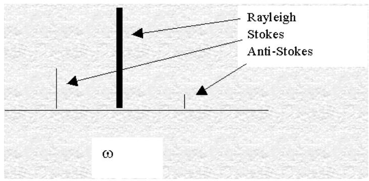

> 🧠 **[Cognis Multimodal Enrichment]**
> * **Classification:** Scientific Figure
> * **Extracted Text (OCR):** `Rayleigh, Stokes, Anti-Stokes, ω`
> * **VLM Visual Summary:** ### FIGURE TYPE:
>   **Other**
>   
>   ### SCIENTIFIC PURPOSE:
>   The figure explains the principles of Raman scattering, specifically focusing on the different types of scattering phenomena that occur when light interacts with molecules.
>   
>   ### KEY KNOWLEDGE:
>   1. **Raleigh Scattering**: This is the elastic scattering, where the photon simply 'bounces' off the molecule without exchanging energy. It is the most common type of scattering.
>   2. **Stokes Scattering**: This occurs when the molecule gains energy from the incident photon, resulting in the emission of a photon with a higher frequency than the incident photon. This is often referred to as an anti-Stokes transition.
>   3. **Anti-Stokes Scattering**: This occurs when the molecule loses energy to the incident photon, resulting in the emission of a photon with a lower frequency than the incident photon. This is often referred to as a Stokes transition.
>   
>   ### LABEL INTERPRETATION:
>   - **Rayleigh**: Refers to the elastic scattering (Raleigh scattering).
>   - **Stokes**: Refers to the Stokes scattering.
>   - **Anti-Stokes**: Refers to the anti-Stokes scattering.
>   
>   ### ENGINEERING/SCIENTIFIC INSIGHTS:
>   A reader should learn that Raman scattering is a form of inelastic scattering where the incident photon exchanges energy with the molecule, leading to the emission of a photon with a different frequency. This phenomenon is crucial in Raman spectroscopy, which is used to study molecular vibrations and rotations.
>   
>   ### USER-RELEVANT INFORMATION:
>   The figure provides a clear illustration of the three types of scattering phenomena (Rayleigh, Stokes, and Anti-Stokes) that occur during the interaction of light with molecules. Understanding these distinctions is essential for interpreting Raman spectra and analyzing molecular properties.
> * **Figure Caption:** This scattering phenomenon takes place as shown follows. | Scattering phenomenon in Raman Spectroscopy
> * **Surrounding Context (+/- 300 words):**
>   * **[Before]:** *... do not possess a permanent electric dipole, and so are undetectable by other methods such as infrared. [Section: 2) Selection Rules Arising from Quantum Mechanics:] A detailed discussion of the quantum mechanical basis for spectroscopy is beyond the scope of this brief introduction. Here, the quantum numbers and the allowed transitions involved are simply stated. [Section: 2.1 Rotational] To find allowed rotational transitions, the total angular momentum quantum number for rotational energy states, J, must be considered. Raman spectroscopy involves a 2 photon process, each of which obeys: $$ \Delta \mathbf { J } = \pm 1 $$ Therefore, for the overall transition $$ \Delta \mathbf { J } = \pm 2 $$ Where, $\Delta \Theta = 0$ for corresponds to Raleigh scattering, ΔJ = 0 corresponds to a Stokes transition, And $\Delta \mathrm { J } = - 2$ corresponds to an anti-Stokes transition. [Section: 2.2 Vibrational] To find allowed transitions the vibrational quantum number, ʋ must be considered. For the overall transition, $$ \Delta \ v = \pm 1 $$ Transitions where $\Delta \ v = \pm 2$ are also possible, but these are of weaker intensity. [Section: 2.3 Types of Scattering] Consider a light wave as a stream of photons each with energy hʋ When each photon collides with a molecule, many things may happen, 2 of which are considered below: [Section: a) Elastic, or Raleigh Scattering] This is when the photon simply 'bounces' off the molecule, with no exchange in energy. The vast majority of photons will be scattered in this way. [Section: b) Inelastic, or Raman Scattering] This is when there is an exchange of energy between the photon and the molecule, leading to the emission of another photon with a different frequency to the incident photon: This scattering phenomenon takes place as shown follows.*
>   * **[After]:** *Scattering phenomenon in Raman Spectroscopy [Section: 3) Raman Scattering] The molecule may either gain energy from, or lose energy to, the photon. In the diagram below, 3 energy states of the molecule are shown $( \operatorname { E } _ { 1 } , \operatorname { E } _ { 2 } .$ E3). The molecule is originally at the $\mathrm { E } _ { 2 }$ energy state. The photon interacts with the molecule, exciting it with an energy hʋ1. However, there is no stationary state of the molecule corresponding to this energy, and so the molecule relaxes down to one of the energy levels shown. In doing this, it emits a photon. If the molecule relaxes to energy state E1, it will have lost energy, and so the photon emitted will have energy hʋr1, where $\mathrm { { h } } \mathfrak { v } _ { \mathbf { r } 1 } > \mathrm { { h } } \mathfrak { v } _ { 1 }$ . These transitions are known as anti-Stokes transitions. If the molecule relaxes to energy state $\operatorname { E } _ { 3 } .$ it will have gained energy, and so the photon emitted will have energy h $1 0 \mathbf { r } 2 .$ , where h $\boldsymbol { \ v } _ { \mathbf { r } 2 } < \mathbf { h } \boldsymbol { \ v } _ { 1 }$ These transitions are known as Stokes transitions. For rotational spectroscopy, both Stokes and anti-Stokes transitions are seen. For vibrational spectroscopy, Stokes transitions are far more common, and so anti- Stokes transitions can effectively be ignored. Stokes and anti- stokes transition [Section: 10. Fourier Transforms Infrared (FTIR) Studies] Studies of the spontaneous orientation of ...*
  
Scattering phenomenon in Raman Spectroscopy

## 3) Raman Scattering

The molecule may either gain energy from, or lose energy to, the photon. In the diagram below, 3 energy states of the molecule are shown $( \operatorname { E } _ { 1 } , \operatorname { E } _ { 2 } .$ E3). The molecule is originally at the $\mathrm { E } _ { 2 }$ energy state. The photon interacts with the molecule, exciting it with an energy hʋ1.

However, there is no stationary state of the molecule corresponding to this energy, and so the molecule relaxes down to one of the energy levels shown.

In doing this, it emits a photon. If the molecule relaxes to energy state E1, it will have lost energy, and so the photon emitted will have energy hʋr1, where $\mathrm { { h } } \mathfrak { v } _ { \mathbf { r } 1 } > \mathrm { { h } } \mathfrak { v } _ { 1 }$ . These transitions are known as anti-Stokes transitions. If the molecule relaxes to energy state $\operatorname { E } _ { 3 } .$ it will have gained energy, and so the photon emitted will have energy h $1 0 \mathbf { r } 2 .$ , where h $\boldsymbol { \ v } _ { \mathbf { r } 2 } < \mathbf { h } \boldsymbol { \ v } _ { 1 }$

These transitions are known as Stokes transitions.

For rotational spectroscopy, both Stokes and anti-Stokes transitions are seen.

For vibrational spectroscopy, Stokes transitions are far more common, and so anti- Stokes transitions can effectively be ignored.

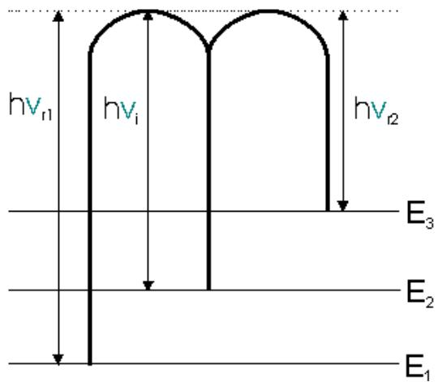

> 🧠 **[Cognis Multimodal Enrichment]**
> * **Classification:** Scientific Figure
> * **Extracted Text (OCR):** `hν₁, hν₂, hν₃, E₁, E₂, E₃`
> * **VLM Visual Summary:** ### FIGURE TYPE:
>   - **Data Plot/Graph**
>   
>   ### SCIENTIFIC PURPOSE:
>   The figure explains the concept of vibrational spectroscopy, specifically focusing on the differences between Stokes and anti-Stokes transitions.
>   
>   ### KEY KNOWLEDGE:
>   1. **Vibrational Spectroscopy**: This technique involves the study of molecular vibrations using infrared or Raman spectroscopy.
>   2. **Stokes Transitions**: These are transitions where the molecule gains energy from the incident photon, leading to an increase in its vibrational energy level.
>   3. **Anti-Stokes Transitions**: These are transitions where the molecule loses energy to the incident photon, resulting in a decrease in its vibrational energy level.
>   4. **Energy Levels**: The figure shows three energy levels labeled \( E_1 \), \( E_2 \), and \( E_3 \).
>   5. **Photon Energy**: The energy of the incident photon is denoted as \( h\tilde{v}_1 \).
>   
>   ### LABEL INTERPRETATION:
>   - **\( h\tilde{v}_1 \)**: Energy of the incident photon.
>   - **\( h\tilde{v}_i \)**: Energy of the initial vibrational state.
>   - **\( h\tilde{v}_r1 \)**: Energy of the final vibrational state after anti-Stokes transition.
>   - **\( h\tilde{v}_r2 \)**: Energy of the final vibrational state after Stokes transition.
>   
>   ### ENGINEERING/SCIENTIFIC INSIGHTS:
>   - **Understanding Vibrational Transitions**: The figure helps in understanding how vibrational energy levels change upon interaction with a photon.
>   - **Application in Spectroscopy**: It provides insight into why Stokes transitions are more common than anti-Stokes transitions in vibrational spectroscopy.
>   
>   ### USER-RELEVANT INFORMATION:
>   - **Energy Levels (\( E_1 \), \( E_2 \), \( E_3 \))**: These represent different vibrational states of the molecule.
>   - **Photon Energy (\( h\tilde{v}_1 \))**: The energy of the incident photon used to excite the molecule.
>   - **Transitions (\( h\tilde{v}_i \rightarrow h\tilde{v}_r1 \), \( h\tilde{v}_i \rightarrow h\tilde{v}_r2 \))**: The transitions between energy levels due to photon absorption or emission.
> * **Figure Caption:** For vibrational spectroscopy, Stokes transitions are far more common, and so anti- Stokes transitions can effectively be ignored. | Stokes and anti- stokes transition
> * **Surrounding Context (+/- 300 words):**
>   * **[Before]:** *... another photon with a different frequency to the incident photon: This scattering phenomenon takes place as shown follows. Scattering phenomenon in Raman Spectroscopy [Section: 3) Raman Scattering] The molecule may either gain energy from, or lose energy to, the photon. In the diagram below, 3 energy states of the molecule are shown $( \operatorname { E } _ { 1 } , \operatorname { E } _ { 2 } .$ E3). The molecule is originally at the $\mathrm { E } _ { 2 }$ energy state. The photon interacts with the molecule, exciting it with an energy hʋ1. However, there is no stationary state of the molecule corresponding to this energy, and so the molecule relaxes down to one of the energy levels shown. In doing this, it emits a photon. If the molecule relaxes to energy state E1, it will have lost energy, and so the photon emitted will have energy hʋr1, where $\mathrm { { h } } \mathfrak { v } _ { \mathbf { r } 1 } > \mathrm { { h } } \mathfrak { v } _ { 1 }$ . These transitions are known as anti-Stokes transitions. If the molecule relaxes to energy state $\operatorname { E } _ { 3 } .$ it will have gained energy, and so the photon emitted will have energy h $1 0 \mathbf { r } 2 .$ , where h $\boldsymbol { \ v } _ { \mathbf { r } 2 } < \mathbf { h } \boldsymbol { \ v } _ { 1 }$ These transitions are known as Stokes transitions. For rotational spectroscopy, both Stokes and anti-Stokes transitions are seen. For vibrational spectroscopy, Stokes transitions are far more common, and so anti- Stokes transitions can effectively be ignored.*
>   * **[After]:** *Stokes and anti- stokes transition [Section: 10. Fourier Transforms Infrared (FTIR) Studies] Studies of the spontaneous orientation of dipole moment in semiconductors are carried out with a non-destructive tool of analysis by means of infrared spectroscopy which can give information on atomic arrangement and inter atomic forces in the crystal lattice. It is possible to investigate how the infrared vibrational frequencies and thus the interatomic forces are affected by the onset of the semiconductor states. If the two energy levels $\mathrm { E } _ { 1 }$ and $\mathrm { E } _ { 2 }$ are placed in an electromagnetic field and the difference in the energy between the two states is equal to a constant $\ " \mathrm { h } ^ { \prime }$ multiplied by the frequency of the incident radiation, a transfer of energy between the molecules can occur, giving therefore; ΔE = hν Where, the symbols have their usual meanings. When the $\Delta \mathrm { E }$ is positive the molecule absorbs energy; when $\Delta \mathrm { E }$ is negative, radiation is emitted during the energy transfer and emission spectra are obtained. When the energies are such that the equation (1) is satisfied, a spectrum unique to the molecule under investigation is obtained. The spectrum is usually represented as a plot of the intensity $\mathrm { V s }$ the frequencies. Frequency ranges that can be encountered in this spectrum vary from those of $" \gamma "$ rays, which have wavelength of about 10-10 cm to radio waves which have wavelength of $1 0 ^ { 1 0 }$ cm. [Section: 10. Fourier Transforms Infrared (FTIR) Studies] The most of spectroscopic investigation are carried out in a relatively small portion of spectrum close to visible light. This region includes UV, visible and ...*
  
Stokes and anti- stokes transition

## 10. Fourier Transforms Infrared (FTIR) Studies

Studies of the spontaneous orientation of dipole moment in semiconductors are carried out with a non-destructive tool of analysis by means of infrared spectroscopy which can give information on atomic arrangement and inter atomic forces in the crystal lattice. It is possible to investigate how the infrared vibrational frequencies and thus the interatomic forces are affected by the onset of the semiconductor states.

If the two energy levels $\mathrm { E } _ { 1 }$ and $\mathrm { E } _ { 2 }$ are placed in an electromagnetic field and the difference in the energy between the two states is equal to a constant $\ " \mathrm { h } ^ { \prime }$ multiplied by the frequency of the incident radiation, a transfer of energy between the molecules can occur, giving therefore;

ΔE = hν

Where, the symbols have their usual meanings. When the $\Delta \mathrm { E }$ is positive the molecule absorbs energy; when $\Delta \mathrm { E }$ is negative, radiation is emitted during the energy transfer and emission spectra are obtained. When the energies are such that the equation (1) is satisfied, a spectrum unique to the molecule under investigation is obtained. The spectrum is usually represented as a plot of the intensity $\mathrm { V s }$ the frequencies.

Frequency ranges that can be encountered in this spectrum vary from those of $" \gamma "$ rays, which have wavelength of about 10-10 cm to radio waves which have wavelength of $1 0 ^ { 1 0 }$ cm.

The most of spectroscopic investigation are carried out in a relatively small portion of spectrum close to visible light. This region includes UV, visible and IR region and is arbitrarily defined as being between wavelength of $1 0 ^ { - 6 }$ cm and $1 0 ^ { - 3 }$ cm. Both the atoms and molecules give rise to spectra but they differ from each other.

The difference between the atomic and molecular spectra lies in the nature of energy levels involved in the transitions. In the atom, the absorption represents transition between the different allowed levels for the orbital electrons. In case of molecules, the atoms within the molecules vibrate and the molecule as a whole rotates and the total energy contributions are represented by the equation:

$$
\mathrm { E } _ { \mathbf { t o t } } = \mathrm { E } _ { \mathbf { e l e c t } } + \mathrm { E } _ { \mathbf { v i b } } + \mathrm { E } _ { \mathbf { r o t } } + \mathrm { E } _ { \mathbf { t r a n s } } , \dots . . . . . 2
$$

Where, $\mathrm { E } _ { \mathbf { e l e c t } }$ is the electronic energy, $\operatorname { E } _ { \mathbf { v i b } }$ is the vibrational energy, Erot is the rotational energy and $\mathrm { E } _ { \mathbf { t r a n s } }$ is the translation energy.

The separate energy levels are quantized and only certain transitions of electronic, vibrational and rotational energy are possible.

Translational energy is usually sufficiently small to be ignored. The vibrational spectrum of a molecule is considered to be a unique physical property and is a characteristic of the molecule. As such, the infrared spectrum can be used as a finger print for identification, in support of Xray diffraction technique for the purpose of characterization, the schematic representation shown in figure below:

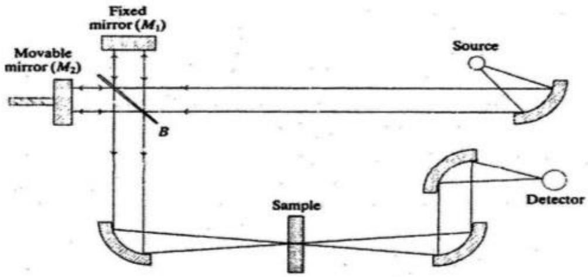

> 🧠 **[Cognis Multimodal Enrichment]**
> * **Classification:** Scientific Figure
> * **Extracted Text (OCR):** `Fixed mirror (M1), Movable mirror (M2), Source, Sample, Detector`
> * **VLM Visual Summary:** ### FIGURE TYPE:
>   Instrument Schematic
>   
>   ### SCIENTIFIC PURPOSE:
>   This figure illustrates the schematic representation of a Fourier Transform Infrared (FTIR) spectrometer, which is used to analyze the vibrational and rotational spectra of molecules to identify their chemical composition and structure.
>   
>   ### KEY KNOWLEDGE:
>   1. **FTIR Spectrometer Components**:
>      - **Source**: The light source emits monochromatic radiation.
>      - **Fixed Mirror (M1)**: Reflects the incident light towards the movable mirror (M2).
>      - **Movable Mirror (M2)**: Reflects the light back towards the sample.
>      - **Sample**: The substance being analyzed.
>      - **Detector**: Captures the reflected light and converts it into electrical signals.
>      - **Sample Holder**: Holds the sample in place during the measurement.
>   
>   2. **Energy Contributions**:
>      - **Electronic Energy ($\mathrm{E}_{\text{elect}}$)**: Transitions between different energy levels of the molecule's electrons.
>      - **Vibrational Energy ($\mathrm{E}_{\text{vib}}$)**: Vibrations of the atoms within the molecule.
>      - **Rotational Energy ($\mathrm{E}_{\text{rot}}$)**: Rotation of the molecule as a whole.
>      - **Translation Energy ($\mathrm{E}_{\text{trans}}$)**: Translation of the molecule along its axis.
>   
>   3. **Equation for Total Energy**:
>      \[
>      \mathrm{E}_{\text{total}} = \mathrm{E}_{\text{elect}} + \mathrm{E}_{\text{vib}} + \mathrm{E}_{\text{rot}} + \mathrm{E}_{\text{trans}}
>      \]
>   
>   4. **Translational Energy**:
>      - Typically, translational energy is small compared to vibrational and rotational energies, so it is often neglected in many applications.
>   
>   5. **Infrared Spectrum**:
>      - The infrared spectrum provides a unique fingerprint for identifying molecules based on their vibrational and rotational modes.
>   
>   6. **Characterization**:
>      - The infrared spectrum can be used alongside X-ray diffraction techniques to characterize the structure and composition of materials.
>   
>   7. **Spectral Analysis**:
>      - Different molecules have distinct vibrational and rotational patterns that can be used to identify them.
>   
>   ### LABEL INTERPRETATION:
>   - **Fixed Mirror (M
> * **Figure Caption:** Translational energy is usually sufficiently small to be ignored. The vibrational spectrum of a molecule is considered to be a unique physical property and is a characteristic of the molecule. As such, the infrared spectrum can be used as a finger print for identification, in support of Xray diffraction technique for the purpose of characterization, the schematic representation shown in figure below: | Schematic representation of FTIR spectrometer
> * **Surrounding Context (+/- 300 words):**
>   * **[Before]:** *... but they differ from each other. The difference between the atomic and molecular spectra lies in the nature of energy levels involved in the transitions. In the atom, the absorption represents transition between the different allowed levels for the orbital electrons. In case of molecules, the atoms within the molecules vibrate and the molecule as a whole rotates and the total energy contributions are represented by the equation: $$ \mathrm { E } _ { \mathbf { t o t } } = \mathrm { E } _ { \mathbf { e l e c t } } + \mathrm { E } _ { \mathbf { v i b } } + \mathrm { E } _ { \mathbf { r o t } } + \mathrm { E } _ { \mathbf { t r a n s } } , \dots . . . . . 2 $$ Where, $\mathrm { E } _ { \mathbf { e l e c t } }$ is the electronic energy, $\operatorname { E } _ { \mathbf { v i b } }$ is the vibrational energy, Erot is the rotational energy and $\mathrm { E } _ { \mathbf { t r a n s } }$ is the translation energy. The separate energy levels are quantized and only certain transitions of electronic, vibrational and rotational energy are possible. [Section: 10. Fourier Transforms Infrared (FTIR) Studies] Translational energy is usually sufficiently small to be ignored. The vibrational spectrum of a molecule is considered to be a unique physical property and is a characteristic of the molecule. As such, the infrared spectrum can be used as a finger print for identification, in support of Xray diffraction technique for the purpose of characterization, the schematic representation shown in figure below:*
>   * **[After]:** *Schematic representation of FTIR spectrometer ...*
  
Schematic representation of FTIR spectrometer