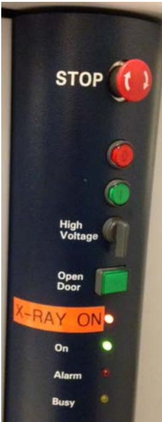
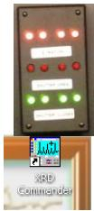
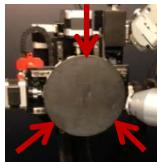
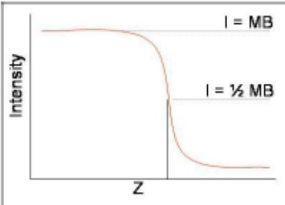
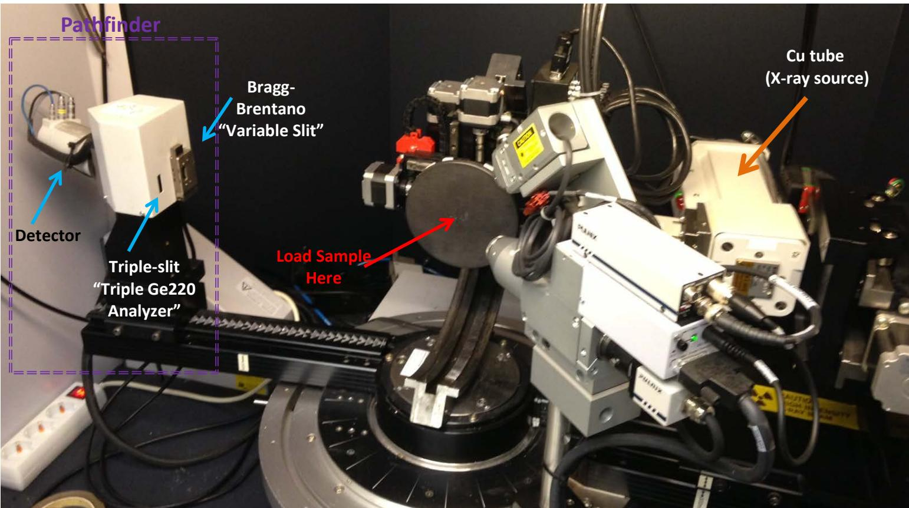
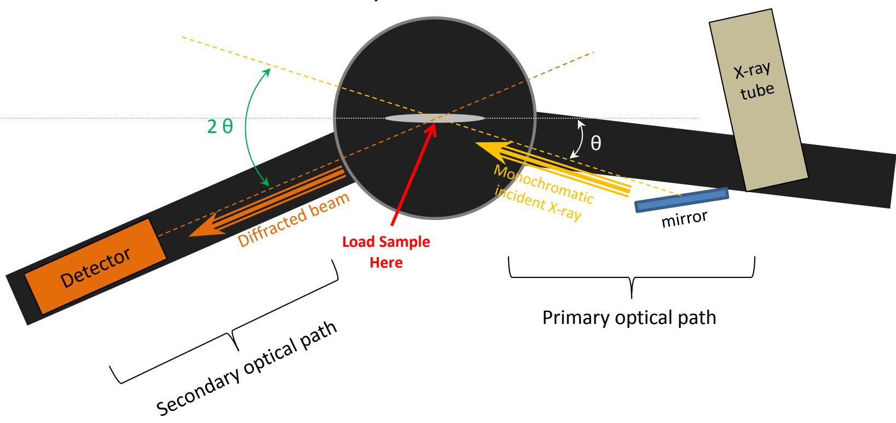
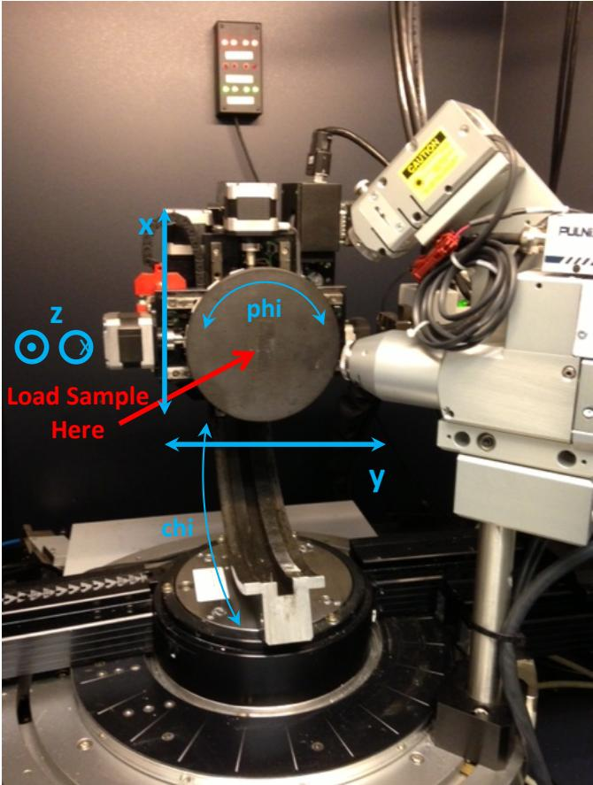

# Operating Procedure for Bruker D8 Discover X-ray Diffractometer

## Preparation:

• Log into login computer

Check System Control Buttons (located at the lower right or left of the system. [see below]). Make sure the “Ready” and “On” LED lights are on. If the D8 is at low current and voltage (standby mode), the “Alarm” LED will blink because the chilled water is too cold. As the current/voltage is increased to maximum intensity (normal usage), the “Alarm” LED will stop blinking.

> 🧠 **[Cognis Multimodal Enrichment]**
> * **Classification:** Scientific Figure
> * **Extracted Text (OCR):** `STOP, High Voltage, Open Door, X-RAY ON, On, Alarm, Busy`
> * **VLM Visual Summary:** ### FIGURE TYPE:
>   **Instrument Schematic**
>   
>   ### SCIENTIFIC PURPOSE:
>   The figure illustrates the control buttons and indicators for a Bruker D8 Discover X-ray diffractometer, which is used for analyzing materials through X-ray diffraction techniques.
>   
>   ### KEY KNOWLEDGE:
>   1. **Control Buttons:**
>      - **STOP:** Emergency stop button.
>      - **High Voltage:** Button to increase the high voltage.
>      - **Open Door:** Button to open the instrument door.
>      - **X-RAY ON:** Button to enable X-ray operation.
>      - **On:** LED light indicating the system is ready.
>      - **Alarm:** LED light indicating an alarm condition.
>      - **Busy:** LED light indicating the system is busy.
>   
>   2. **Indicator Lights:**
>      - **Ready:** LED light indicating the system is ready.
>      - **On:** LED light indicating the system is on.
>      - **Alarm:** LED light indicating an alarm condition.
>      - **Busy:** LED light indicating the system is busy.
>   
>   3. **Safety Features:**
>      - **Emergency Stop:** Button to immediately stop the system.
>      - **High Voltage:** Button to increase the high voltage.
>      - **Open Door:** Button to open the instrument door.
>      - **X-RAY ON:** Button to enable X-ray operation.
>   
>   4. **Operating Modes:**
>      - **Standby Mode:** Low current and voltage, indicated by the blinking Alarm LED.
>      - **Normal Usage:** Maximum intensity, indicated by the non-blinking Alarm LED.
>   
>   5. **System Status Indicators:**
>      - **Chilled Water Too Cold:** Indicates the chilled water is too cold, causing the Alarm LED to blink.
>      - **Maximum Intensity:** Indicates the current/voltage has reached maximum intensity, stopping the blinking Alarm LED.
>   
>   6. **Power Management:**
>      - **Switch Off Power:** Turns off the control electronics, high voltage generator, and all connected components.
>      - **Switch On Power:** Turns on the control electronics, high voltage generator, and all connected components.
>   
>   7. **High Voltage Rotary Switch:**
>      - Used to power up the high voltage system.
>   
>   8. **Door Operation:**
>      - Mechanical latch mechanism for locking and unlocking the door.
>   
>   9. **X-Ray Operation:**
>      - Automatic shutter closure when the door is opened while the X-ray tube shutter is open.
>   
>   10. **Software Initialization:**
>       - X
> * **Figure Caption:** Check System Control Buttons (located at the lower right or left of the system. [see below]). Make sure the “Ready” and “On” LED lights are on. If the D8 is at low current and voltage (standby mode), the “Alarm” LED will blink because the chilled water is too cold. As the current/voltage is increased to maximum intensity (normal usage), the “Alarm” LED will stop blinking. | [Section: Operating Procedure for Bruker D8 Discover X-ray Diffractometer > Stop Button: Emergency Stop!]
> * **Surrounding Context (+/- 300 words):**
>   * **[Before]:** *... [Section: Operating Procedure for Bruker D8 Discover X-ray Diffractometer > Preparation:] • Log into login computer Check System Control Buttons (located at the lower right or left of the system. [see below]). Make sure the “Ready” and “On” LED lights are on. If the D8 is at low current and voltage (standby mode), the “Alarm” LED will blink because the chilled water is too cold. As the current/voltage is increased to maximum intensity (normal usage), the “Alarm” LED will stop blinking.*
>   * **[After]:** *[Section: Operating Procedure for Bruker D8 Discover X-ray Diffractometer > Stop Button: Emergency Stop!] If hit, immediately switches off the control electronics and high-voltage generator. X-ray source is turned off and all moving drives will stop instantly Turn Off Power: Switches off the control electronics, high voltage generator and all components connected to the AC outlets Turn On Power: Switches on the control electronics, high voltage generator and all components connected to the AC outlets High Voltage Rotary Switch: Turning the switch to the right position and hold until the orange “X-RAY ON” status LED starts flashing. Powers up High Voltage: “X-RAY ON” will turn solid orange when done powering up. Open Door Button: Under normal operating conditions the door handles are locked by a mechanical latch. To open the front door(s) this button must be pressed first (to release the latch). Then the front door(s) can be opened. Pressing the “Open Door” button while the X-ray tube shutter is open will cause the shutter to close automatically. [Section: Operating Procedure for Bruker D8 Discover X-ray Diffractometer > Before Loading Specimen:] Before opening the D8 door, check for abnormalities in and around the instrument. On the back wall of the D8, the “X-RAY-ON” four red LED and “SHUTTER CLOSED” four green LED lights should be lit. If XRD Commander is not opened, double-click the icon to open it. The icon is found in the upper right corner of the desktop. Once the software is opened, the computer will communicate with the D8 Discover hardware. o If XRD Commander was not opened initially, upon opening, all drives must be initialized. Select using the check boxes (preferably two at a time rather than all at once) and click initialize drives button: o Set the primary and secondary optics . There is only ...*

## Stop Button: Emergency Stop!

If hit, immediately switches off the control electronics and high-voltage generator. X-ray source is turned off and all moving drives will stop instantly

Turn Off Power: Switches off the control electronics, high voltage generator and all components connected to the AC outlets

Turn On Power: Switches on the control electronics, high voltage generator and all components connected to the AC outlets

High Voltage Rotary Switch: Turning the switch to the right position and hold until the orange “X-RAY ON” status LED starts flashing. Powers up High Voltage: “X-RAY ON” will turn solid orange when done powering up.

Open Door Button: Under normal operating conditions the door handles are locked by a mechanical latch. To open the front door(s) this button must be pressed first (to release the latch). Then the front door(s) can be opened. Pressing the “Open Door” button while the X-ray tube shutter is open will cause the shutter to close automatically.

## Before Loading Specimen:

Before opening the D8 door, check for abnormalities in and around the instrument. On the back wall of the D8, the “X-RAY-ON” four red LED and “SHUTTER CLOSED” four green LED lights should be lit.

If XRD Commander is not opened, double-click the icon to open it. The icon is found in the upper right corner of the desktop. Once the software is opened, the computer will communicate with the D8 Discover hardware.

> 🧠 **[Cognis Multimodal Enrichment]**
> * **Classification:** Scientific Figure
> * **Extracted Text (OCR):** `XRD, Commander`
> * **VLM Visual Summary:** ### FIGURE TYPE:
>   Software Interface Screenshot
>   
>   ### SCIENTIFIC PURPOSE:
>   The figure illustrates the user interface of XRD Commander, which is a software application used to interact with the Bruker D8 Discover X-ray diffractometer. The interface allows users to control various settings and parameters of the X-ray diffractometer.
>   
>   ### KEY KNOWLEDGE:
>   1. **XRD Commander Interface**: The interface includes multiple buttons and fields for controlling different aspects of the X-ray diffractometer.
>   2. **Initialization Process**: Users need to initialize drives before opening the software, which involves selecting and clicking checkboxes for initialization.
>   3. **Operating Modes**: The software communicates with the D8 Discover hardware, allowing users to adjust settings such as voltage and current levels.
>   4. **Safety Features**: The interface includes safety features such as emergency stop buttons and warning lights indicating the status of the X-ray system.
>   
>   ### LABEL INTERPRETATION:
>   - **"XRD Commander"**: This is the name of the software application.
>   - **"Initialize drives"**: This button is used to initialize the drives before opening the software.
>   - **"Theta: 0 X: 0 2 Theta: 0 Y: 0 Chi: 0 Z: -0.9 Phi: 0"**: These fields likely represent parameters such as theta, x, y, z, and phi angles, which are used to set the orientation of the X-ray beam.
>   - **"Secondary Optic Path Name"**: This field indicates the name of the secondary optic path, which is used to select different optical configurations.
>   - **"Mounting location"**: This field specifies the location where the optical components are mounted.
>   - **"Description"**: This field provides additional information about the purpose of each optical configuration.
>   
>   ### ENGINEERING/SCIENTIFIC INSIGHTS:
>   - **Understanding XRD Commander**: Users should familiarize themselves with the XRD Commander interface to effectively control the Bruker D8 Discover X-ray diffractometer.
>   - **Safety Procedures**: Users should be aware of the safety features and emergency stop buttons to ensure safe operation of the X-ray system.
>   
>   ### USER-RELEVANT INFORMATION:
>   - **Initialization Process**: Understanding how to initialize drives is crucial for setting up the XRD Commander correctly.
>   - **Parameter Settings**: Familiarity with the parameter settings (e.g., theta, x, y, z, phi) is essential for performing specific experiments.
>   -
> * **Figure Caption:** If XRD Commander is not opened, double-click the icon to open it. The icon is found in the upper right corner of the desktop. Once the software is opened, the computer will communicate with the D8 Discover hardware. | o If XRD Commander was not opened initially, upon opening, all drives must be initialized. Select using the check boxes (preferably two at a time rather than all at once) and click initialize drives button:
> * **Surrounding Context (+/- 300 words):**
>   * **[Before]:** *... “Ready” and “On” LED lights are on. If the D8 is at low current and voltage (standby mode), the “Alarm” LED will blink because the chilled water is too cold. As the current/voltage is increased to maximum intensity (normal usage), the “Alarm” LED will stop blinking. [Section: Operating Procedure for Bruker D8 Discover X-ray Diffractometer > Stop Button: Emergency Stop!] If hit, immediately switches off the control electronics and high-voltage generator. X-ray source is turned off and all moving drives will stop instantly Turn Off Power: Switches off the control electronics, high voltage generator and all components connected to the AC outlets Turn On Power: Switches on the control electronics, high voltage generator and all components connected to the AC outlets High Voltage Rotary Switch: Turning the switch to the right position and hold until the orange “X-RAY ON” status LED starts flashing. Powers up High Voltage: “X-RAY ON” will turn solid orange when done powering up. Open Door Button: Under normal operating conditions the door handles are locked by a mechanical latch. To open the front door(s) this button must be pressed first (to release the latch). Then the front door(s) can be opened. Pressing the “Open Door” button while the X-ray tube shutter is open will cause the shutter to close automatically. [Section: Operating Procedure for Bruker D8 Discover X-ray Diffractometer > Before Loading Specimen:] Before opening the D8 door, check for abnormalities in and around the instrument. On the back wall of the D8, the “X-RAY-ON” four red LED and “SHUTTER CLOSED” four green LED lights should be lit. If XRD Commander is not opened, double-click the icon to open it. The icon is found in the upper right corner of the desktop. Once the software is opened, the computer will communicate with the D8 Discover hardware.*
>   * **[After]:** *o If XRD Commander was not opened initially, upon opening, all drives must be initialized. Select using the check boxes (preferably two at a time rather than all at once) and click initialize drives button: o Set the primary and secondary optics . There is only one “Default” primary. Theta: 0 X: 0 2 Theta: 0 Y: 0 Chi: 0 Z: -0.9 Phi: 0 [Section: Operating Procedure for Bruker D8 Discover X-ray Diffractometer > Before Loading Specimen:] <table><tr><td rowspan=1 colspan=1>Secondary Optic Path Name</td><td rowspan=1 colspan=1>Mounting location</td><td rowspan=1 colspan=1>Description</td></tr><tr><td rowspan=1 colspan=1>&quot;Default Optic&quot;</td><td rowspan=1 colspan=1>front of detector at 300.Soller slit in front</td><td rowspan=1 colspan=1> Used for grazing incidencedetection (GID) or to maximizethe amount of signal that reachesthe detector</td></tr><tr><td rowspan=1 colspan=1>&quot;Pathfinder: Variable Slit&quot;</td><td rowspan=1 colspan=1>front of Pathfinder at 350.Detector mounted at adiagonal in the back</td><td rowspan=1 colspan=1>Standard Bragg-Brentanomeasurements</td></tr><tr><td rowspan=1 colspan=1>&quot;Pathfinder: Ge 220 Mirror&quot;</td><td rowspan=1 colspan=1>front of Pathfinder at 350.Detector mounted at adiagonal in the back</td><td rowspan=1 colspan=1>Mirrors cut down on signal</td></tr></table> o If the D8 setup is as shown on the reference page (end of document), the secondary optics is “Pathfinder” (mounted at 350), with the path determined by your desired experiment (either Bragg-Brentano or Triple Mirror). “Default” secondary correlates with a soller slit leading to the detector mount (used for Grazing Incident Detection (GID) (detector mount at 300. Soller slit mounted flush in front of it)). [Section: Operating Procedure for Bruker D8 Discover X-ray Diffractometer > Start-Up:] • Increase voltage (kV) and current (mA) from 20/10 (standby) => 40/40 (operating) • Set absorber to the maximum “5145” value to prevent saturation of the detector. o NOTE: after changing the pull-down, you have to click “Set” to the left of the menu for the change to occur. • Move drives. <= Enter values into field and press “Move Drives” button. Perform a Detector ...*

o If XRD Commander was not opened initially, upon opening, all drives must be initialized. Select using the check boxes (preferably two at a time rather than all at once) and click initialize drives button:

o Set the primary and secondary optics . There is only one “Default” primary.

Theta: 0 X: 0   
2 Theta: 0 Y: 0   
Chi: 0 Z: -0.9   
Phi: 0

<table><tr><td rowspan=1 colspan=1>Secondary Optic Path Name</td><td rowspan=1 colspan=1>Mounting location</td><td rowspan=1 colspan=1>Description</td></tr><tr><td rowspan=1 colspan=1>&quot;Default Optic&quot;</td><td rowspan=1 colspan=1>front of detector at 300.Soller slit in front</td><td rowspan=1 colspan=1> Used for grazing incidencedetection (GID) or to maximizethe amount of signal that reachesthe detector</td></tr><tr><td rowspan=1 colspan=1>&quot;Pathfinder: Variable Slit&quot;</td><td rowspan=1 colspan=1>front of Pathfinder at 350.Detector mounted at adiagonal in the back</td><td rowspan=1 colspan=1>Standard Bragg-Brentanomeasurements</td></tr><tr><td rowspan=1 colspan=1>&quot;Pathfinder: Ge 220 Mirror&quot;</td><td rowspan=1 colspan=1>front of Pathfinder at 350.Detector mounted at adiagonal in the back</td><td rowspan=1 colspan=1>Mirrors cut down on signal</td></tr></table>

o If the D8 setup is as shown on the reference page (end of document), the secondary optics is “Pathfinder” (mounted at 350), with the path determined by your desired experiment (either Bragg-Brentano or Triple Mirror). “Default” secondary correlates with a soller slit leading to the detector mount (used for Grazing Incident Detection (GID) (detector mount at 300. Soller slit mounted flush in front of it)).

## Start-Up:

• Increase voltage (kV) and current (mA) from 20/10 (standby) => 40/40 (operating)

• Set absorber to the maximum “5145” value to prevent saturation of the detector.

o NOTE: after changing the pull-down, you have to click “Set” to the left of the menu for the change to occur.

• Move drives. <= Enter values into field and press “Move Drives” button.

Perform a Detector scan (-1 to 1). If a peak is visible, zero initialize (ZI) the peak value. If there is no observable peak, confirm that you have selected the appropriate primary and secondary optics from the pull-down menu and try again.

o DO NOT click “ZI” if you do not see an observable peak as the software will try to find a peak amongst the noise and may significantly alter the zero value.

Set absorber back to “Auto” value.

## Loading Specimen:

• To open the doors, press “Open Door” green button (on system control panel) to disable the mechanical latch. Pull handles toward you and slide both doors open.

• Mount your sample at the center of the stage (large grey circle) using double-sided tape.

To close the doors, slide the doors closed and push handles toward the back of the machine until you hear the “click” of the mechanical latch engaging.

o NOTE: If both handles are not firmly locked, DO NOT continue. Instead, press the “Open Door” button, open the door and shut it again. Failure to close the door properly could result in a full system lock.

Optimizing sample position in the beam path:

• Perform a Z scan (-0.9 to 1.9), setting the Z position center to the location correlated with intensity (I) at ½ maximum beam (MB)

If ½ MB is not visible, spacers need to be added or removed to move the sample to an appropriate z position.

> 🧠 **[Cognis Multimodal Enrichment]**
> * **Classification:** Scientific Figure
> * **VLM Visual Summary:** ### FIGURE TYPE:
>   **Experimental Setup**
>   
>   ### SCIENTIFIC PURPOSE:
>   The figure illustrates the process of optimizing the sample position within a Bruker D8 Discover X-ray diffractometer to ensure that specific intensity peaks are visible for accurate data collection.
>   
>   ### KEY KNOWLEDGE:
>   1. **Sample Positioning**: The sample must be centered on the stage, which is indicated by the large grey circle in the image.
>   2. **Z Position Adjustment**: The sample needs to be moved to an appropriate z position to achieve the desired intensity peak visibility.
>   3. **Spacers**: Metal plates with holes are used to adjust the sample height. These spacers are placed beneath the stage to fine-tune the sample's position relative to the beam path.
>   4. **Hex-Key Set Screws**: Three hex-key set screws are provided for removing the stage, allowing for adjustments to the sample position without altering the instrument setup.
>   
>   ### LABEL INTERPRETATION:
>   - **Stage**: The central platform where the sample is mounted.
>   - **Sample**: The object being analyzed, positioned centrally on the stage.
>   - **Spacers**: Metal plates with holes used to adjust the sample height.
>   - **Hex-Key Set Screws**: Tools used to remove the stage for precise adjustments.
>   
>   ### ENGINEERING/SCIENTIFIC INSIGHTS:
>   - **Precision in Sample Positioning**: Accurate positioning of the sample is crucial for obtaining reliable diffraction patterns.
>   - **Use of Spacers**: The use of spacers allows for fine-tuning the sample height, ensuring that the desired intensity peaks are visible.
>   - **Safety Precautions**: The figure emphasizes the importance of proper sample positioning to avoid damaging the instrument.
>   
>   ### USER-RELEVANT INFORMATION:
>   - **Z Position Adjustment**: The specific z position where the intensity peak is observed (half-maximum beam, or ½ MB).
>   - **Sample Height Adjustment**: The use of spacers to adjust the sample height relative to the beam path.
>   - **Stage Removal**: The ability to remove the stage using hex-key set screws for precise adjustments.
> * **Figure Caption:** If ½ MB is not visible, spacers need to be added or removed to move the sample to an appropriate z position. | Stage can be removed using three hex-key set screws located as shown to the left.
> * **Surrounding Context (+/- 300 words):**
>   * **[Before]:** *... the maximum “5145” value to prevent saturation of the detector. o NOTE: after changing the pull-down, you have to click “Set” to the left of the menu for the change to occur. • Move drives. <= Enter values into field and press “Move Drives” button. Perform a Detector scan (-1 to 1). If a peak is visible, zero initialize (ZI) the peak value. If there is no observable peak, confirm that you have selected the appropriate primary and secondary optics from the pull-down menu and try again. o DO NOT click “ZI” if you do not see an observable peak as the software will try to find a peak amongst the noise and may significantly alter the zero value. Set absorber back to “Auto” value. [Section: Operating Procedure for Bruker D8 Discover X-ray Diffractometer > Loading Specimen:] • To open the doors, press “Open Door” green button (on system control panel) to disable the mechanical latch. Pull handles toward you and slide both doors open. • Mount your sample at the center of the stage (large grey circle) using double-sided tape. To close the doors, slide the doors closed and push handles toward the back of the machine until you hear the “click” of the mechanical latch engaging. o NOTE: If both handles are not firmly locked, DO NOT continue. Instead, press the “Open Door” button, open the door and shut it again. Failure to close the door properly could result in a full system lock. Optimizing sample position in the beam path: • Perform a Z scan (-0.9 to 1.9), setting the Z position center to the location correlated with intensity (I) at ½ maximum beam (MB) If ½ MB is not visible, spacers need to be added or removed to move the sample to an appropriate z position.*
>   * **[After]:** *Stage can be removed using three hex-key set screws located as shown to the left. Spacers are metal plates with holes mounted beneath the stage. Each spacer thickness is twice the smaller-size. Default for thin film/materials is two spacers (smallest and medium size). o Double click on the curve where the intensity is ½ MB • Perform a rocking curve (-1 to 1), double click on the peak location [Section: Operating Procedure for Bruker D8 Discover X-ray Diffractometer > Loading Specimen:] o NOTE: If the peak is not obvious on your sample, you are better off not doubleclicking (leaving theta = 0). Any deviation from zero here will shift your 2 Theta/Omega scan values later. • Perform a Z scan (-1 to 1), double click on the curve where the intensity is ½ MB • Perform a preliminary 2 Theta/Omega scan in the range you expect a strong peak. Double click on the peak (this will enter the 2 Theta value into the 2 Theta field). • Perform a rocking curve (+/- a few degrees equal to ½ the 2 Theta peak). Double click on the peak (this will enter the Theta value into the Theta field). • Perform a Chi scan (-3 to 3), double click on the peak if there is one. [Section: Operating Procedure for Bruker D8 Discover X-ray Diffractometer > Data Collection:] Perform a 2 Theta/Omega (note: “omega” = “theta” except that theta and 2 theta are uncoupled) scan. Choose a 2 Theta range that will encompass your target peak(s) (i.e. 28.443 for Si 111 standard) and step size appropriate for the resolution you desire. o For optimal identification, make sure each peak has a minimum of 3 data points on the rising side and 3 on the falling side. Save the measured data as a ...*

Stage can be removed using three hex-key set screws located as shown to the left.

Spacers are metal plates with holes mounted beneath the stage. Each spacer thickness is twice the smaller-size. Default for thin

> 🧠 **[Cognis Multimodal Enrichment]**
> * **Classification:** Scientific Figure
> * **Extracted Text (OCR):** `I = MB, I = 1/2 MB, Intensity, Z`
> * **VLM Visual Summary:** ### FIGURE TYPE:
>   Data Plot/Graph
>   
>   ### SCIENTIFIC PURPOSE:
>   The figure illustrates the relationship between the intensity of X-ray diffraction peaks and the distance (z) from the sample surface. This type of graph is commonly used in X-ray diffraction studies to determine the spatial distribution of diffraction peaks.
>   
>   ### KEY KNOWLEDGE:
>   1. **Intensity vs. Distance (z):** The graph shows how the intensity of the diffraction peaks changes with respect to the distance from the sample surface.
>   2. **Two Different Intensities:** There are two different intensities labeled as \( I = \frac{1}{2} \text{ MB} \) and \( I = \text{MB} \). These likely represent half-maximum beam intensity and maximum beam intensity, respectively.
>   3. **Spacer Thickness:** The caption indicates that spacers are metal plates with holes mounted beneath the stage, and each spacer thickness is twice the smaller size. This suggests that the distance \( z \) might be related to the thickness of the spacers.
>   
>   ### LABEL INTERPRETATION:
>   - **Intensity:** Represents the strength of the diffraction peaks.
>   - **\( I = \frac{1}{2} \text{ MB} \):** Half-maximum beam intensity.
>   - **\( I = \text{MB} \):** Maximum beam intensity.
>   
>   ### ENGINEERING/SCIENTIFIC INSIGHTS:
>   - **Spatial Distribution Analysis:** The graph helps in understanding how the spatial distribution of diffraction peaks varies with distance from the sample surface.
>   - **Optimization of Sample Positioning:** The figure aids in optimizing the sample position by identifying the appropriate \( z \)-position where the diffraction peaks are most intense.
>   
>   ### USER-RELEVANT INFORMATION:
>   - **Distance (z) Range:** The specific range of \( z \) values where the diffraction peaks are observed.
>   - **Intensity Levels:** The relative intensity levels of the diffraction peaks at different \( z \) positions.
>   - **Spacer Thickness Impact:** Understanding how the thickness of the spacers affects the intensity of the diffraction peaks.
> * **Figure Caption:** Spacers are metal plates with holes mounted beneath the stage. Each spacer thickness is twice the smaller-size. Default for thin | film/materials is two spacers (smallest and medium size).
> * **Surrounding Context (+/- 300 words):**
>   * **[Before]:** *... <= Enter values into field and press “Move Drives” button. Perform a Detector scan (-1 to 1). If a peak is visible, zero initialize (ZI) the peak value. If there is no observable peak, confirm that you have selected the appropriate primary and secondary optics from the pull-down menu and try again. o DO NOT click “ZI” if you do not see an observable peak as the software will try to find a peak amongst the noise and may significantly alter the zero value. Set absorber back to “Auto” value. [Section: Operating Procedure for Bruker D8 Discover X-ray Diffractometer > Loading Specimen:] • To open the doors, press “Open Door” green button (on system control panel) to disable the mechanical latch. Pull handles toward you and slide both doors open. • Mount your sample at the center of the stage (large grey circle) using double-sided tape. To close the doors, slide the doors closed and push handles toward the back of the machine until you hear the “click” of the mechanical latch engaging. o NOTE: If both handles are not firmly locked, DO NOT continue. Instead, press the “Open Door” button, open the door and shut it again. Failure to close the door properly could result in a full system lock. Optimizing sample position in the beam path: • Perform a Z scan (-0.9 to 1.9), setting the Z position center to the location correlated with intensity (I) at ½ maximum beam (MB) If ½ MB is not visible, spacers need to be added or removed to move the sample to an appropriate z position. Stage can be removed using three hex-key set screws located as shown to the left. Spacers are metal plates with holes mounted beneath the stage. Each spacer thickness is twice the smaller-size. Default for thin*
>   * **[After]:** *film/materials is two spacers (smallest and medium size). o Double click on the curve where the intensity is ½ MB • Perform a rocking curve (-1 to 1), double click on the peak location [Section: Operating Procedure for Bruker D8 Discover X-ray Diffractometer > Loading Specimen:] o NOTE: If the peak is not obvious on your sample, you are better off not doubleclicking (leaving theta = 0). Any deviation from zero here will shift your 2 Theta/Omega scan values later. • Perform a Z scan (-1 to 1), double click on the curve where the intensity is ½ MB • Perform a preliminary 2 Theta/Omega scan in the range you expect a strong peak. Double click on the peak (this will enter the 2 Theta value into the 2 Theta field). • Perform a rocking curve (+/- a few degrees equal to ½ the 2 Theta peak). Double click on the peak (this will enter the Theta value into the Theta field). • Perform a Chi scan (-3 to 3), double click on the peak if there is one. [Section: Operating Procedure for Bruker D8 Discover X-ray Diffractometer > Data Collection:] Perform a 2 Theta/Omega (note: “omega” = “theta” except that theta and 2 theta are uncoupled) scan. Choose a 2 Theta range that will encompass your target peak(s) (i.e. 28.443 for Si 111 standard) and step size appropriate for the resolution you desire. o For optimal identification, make sure each peak has a minimum of 3 data points on the rising side and 3 on the falling side. Save the measured data as a “RAW” data file. [Section: Operating Procedure for Bruker D8 Discover X-ray Diffractometer > Shut Down:] • Set voltage (kV) and current (mA) to 20/10 (standby mode). • Minimize XRD Commander. Do not close the program. ...*

film/materials is two spacers (smallest and medium size).

o Double click on the curve where the intensity is ½ MB

• Perform a rocking curve (-1 to 1), double click on the peak location

o NOTE: If the peak is not obvious on your sample, you are better off not doubleclicking (leaving theta = 0). Any deviation from zero here will shift your 2 Theta/Omega scan values later.

• Perform a Z scan (-1 to 1), double click on the curve where the intensity is ½ MB

• Perform a preliminary 2 Theta/Omega scan in the range you expect a strong peak. Double click on the peak (this will enter the 2 Theta value into the 2 Theta field).

• Perform a rocking curve (+/- a few degrees equal to ½ the 2 Theta peak). Double click on the peak (this will enter the Theta value into the Theta field).

• Perform a Chi scan (-3 to 3), double click on the peak if there is one.

## Data Collection:

Perform a 2 Theta/Omega (note: “omega” = “theta” except that theta and 2 theta are uncoupled) scan. Choose a 2 Theta range that will encompass your target peak(s) (i.e. 28.443 for Si 111 standard) and step size appropriate for the resolution you desire.

o For optimal identification, make sure each peak has a minimum of 3 data points on the rising side and 3 on the falling side.

Save the measured data as a “RAW” data file.

## Shut Down:

• Set voltage (kV) and current (mA) to 20/10 (standby mode).

• Minimize XRD Commander. Do not close the program.

• Remove sample(s) and clean up.

• Transfer data if necessary.

## Data Processing:

• Load the saved .raw file in Eva.

• Process the XRD result with options such as background removal, peak smoothing, and Y-scale etc. in Eva.

• Export the processed result to another .raw file. (File > Export > Current Scan (whole data range)

For ease of XRD data processing, we have installed the Bruker software package on one of the computers in Bowen 114 (middle computer of the three computers directly to the right)

• Turn on computer, log in using: User: PRZ-53KG3M1\iacguest and Password: iacguest

Windows Start button => All Programs => Windows Virtual PC => Windows XP Mode

o Or alternatively, double-click “Windows XP Mode” icon on desktop

o This will open up an instance of Windows XP in a window.

Within XP window: USB => HASP HL 3.25 <Attach>

o This enables the security license required for the software(s) operation

Then open the software you need to use. Icons for EVA, Leptos, Topos are available on the XP desktop or through Windows Start => All Programs.

## Converting .raw to .uxd (Excel/Origin Readable Format):

• Load the processed .raw file in File Exchange.

Format the conversion parameter. (File > UXD Format).

Raw Data Format: “Angle + Intensity”

Peak List Format: “Angle + Intensity”

Special Formatting: “Skip Headers Information” and “,” as the field separator.

Convert the .raw to .uxd. (File > Translate > UXD).

• UXD can be opened by text editing software such as Notepad, Excel, and Origin etc.

## Remember:

Reference Diagrams:  

> 🧠 **[Cognis Multimodal Enrichment]**
> * **Classification:** Scientific Figure
> * **Extracted Text (OCR):** `Pathfinder, Bragg-Brentano, Variable Slit, Cu tube (X-ray source), Detector, Triple-slit, Triple Ge220 Analyzer, Load Sample Here`
> * **VLM Visual Summary:** ### FIGURE TYPE:
>   **Experimental Setup**
>   
>   ### SCIENTIFIC PURPOSE:
>   This figure illustrates an experimental setup used for X-ray diffraction analysis, specifically designed for studying materials at the nanoscale level.
>   
>   ### KEY KNOWLEDGE:
>   1. **X-ray Diffraction (XRD)**: The primary technique used to determine the crystal structure of materials.
>   2. **Bragg-Brentano Apparatus**: A type of X-ray diffractometer that uses Bragg's law to analyze the diffraction pattern of X-rays.
>   3. **Variable Slit**: Allows adjustment of the slit width to control the resolution of the diffraction pattern.
>   4. **Triple-Slit Ge220 Analyzer**: A specific type of X-ray detector used for high-resolution XRD measurements.
>   5. **Cu Tube (X-ray Source)**: Provides the X-ray radiation needed for diffraction experiments.
>   6. **Detector**: Captures the diffracted X-rays and converts them into electrical signals.
>   7. **Load Sample Here**: Indicates where the sample should be placed for analysis.
>   
>   ### LABEL INTERPRETATION:
>   - **Pathfinder**: Likely refers to a tool or method used to guide the experiment.
>   - **Bragg-Brentano Variable Slit**: Indicates the adjustable slit used in the Bragg-Brentano apparatus.
>   - **Triple-Slit Ge220 Analyzer**: Specifies the type of X-ray detector used.
>   - **Cu tube (X-ray source)**: Identifies the X-ray generator.
>   - **Detector**: Clearly labeled as the device that captures X-ray diffraction patterns.
>   - **Load Sample Here**: Indicates the location where the sample should be positioned for analysis.
>   
>   ### ENGINEERING/SCIENTIFIC INSIGHTS:
>   - Understanding the components of an X-ray diffraction setup is crucial for interpreting diffraction patterns and determining material structures.
>   - The adjustable slit allows for fine-tuning the resolution, which is essential for distinguishing between closely spaced peaks in the diffraction pattern.
>   - The use of a Cu tube as the X-ray source provides a broad spectrum of X-rays, enhancing the sensitivity and range of the analysis.
>   
>   ### USER-RELEVANT INFORMATION:
>   - The specific components and their functions are critical for interpreting the diffraction pattern accurately.
>   - The position of the sample relative to the X-ray source and detector is crucial for obtaining reliable data.
>   - The adjustable slit width affects the resolution of the diffraction pattern, influencing the ability to distinguish between different crystallog
> * **Figure Caption:** Reference Diagrams: | D8 Discover (Diagram) Top-Down View
> * **Surrounding Context (+/- 300 words):**
>   * **[Before]:** *... (standby mode). • Minimize XRD Commander. Do not close the program. • Remove sample(s) and clean up. • Transfer data if necessary. [Section: Operating Procedure for Bruker D8 Discover X-ray Diffractometer > Data Processing:] • Load the saved .raw file in Eva. • Process the XRD result with options such as background removal, peak smoothing, and Y-scale etc. in Eva. • Export the processed result to another .raw file. (File > Export > Current Scan (whole data range) For ease of XRD data processing, we have installed the Bruker software package on one of the computers in Bowen 114 (middle computer of the three computers directly to the right) • Turn on computer, log in using: User: PRZ-53KG3M1\iacguest and Password: iacguest Windows Start button => All Programs => Windows Virtual PC => Windows XP Mode o Or alternatively, double-click “Windows XP Mode” icon on desktop o This will open up an instance of Windows XP in a window. Within XP window: USB => HASP HL 3.25 <Attach> o This enables the security license required for the software(s) operation Then open the software you need to use. Icons for EVA, Leptos, Topos are available on the XP desktop or through Windows Start => All Programs. [Section: Operating Procedure for Bruker D8 Discover X-ray Diffractometer > Converting .raw to .uxd (Excel/Origin Readable Format):] • Load the processed .raw file in File Exchange. Format the conversion parameter. (File > UXD Format). Raw Data Format: “Angle + Intensity” Peak List Format: “Angle + Intensity” Special Formatting: “Skip Headers Information” and “,” as the field separator. Convert the .raw to .uxd. (File > Translate > UXD). • UXD can be opened by text editing software such as Notepad, Excel, and Origin etc. [Section: Operating Procedure for Bruker D8 Discover X-ray Diffractometer > Remember:] Reference Diagrams:*
>   * **[After]:** *D8 Discover (Diagram) Top-Down View [Section: Operating Procedure for Bruker D8 Discover X-ray Diffractometer > Emergency Information:] Medical Emergencies: Contact 911 and Public Safety (609) 258-1000 Room / facility emergencies: Contact Public Safety (609) 258-1000 Issues related to the instrument: 1. Contact IAC Staff. 2. If unsure, leave system as is. 3. Try to turn off X-rays and shut down system. Audible/Siren Emergency Alerts: Follow previous steps 2 & 3 and leave the building. [Section: Operating Procedure for Bruker D8 Discover X-ray Diffractometer > Emergency Contact Information:] Nan Yao: Office (609)258-6394; Cell (908) 922-2236 Email: nyao@princeton.edu John Schreiber: Office (609)258-0034; Cell (215) 431-4670 Email: js51@princeton.edu Paul Shao: Office (609)258-3851; Cell (847) 721-086 Email: pshao@princeton.edu ...*
  
D8 Discover (Diagram) Top-Down View

> 🧠 **[Cognis Multimodal Enrichment]**
> * **Classification:** Scientific Figure
> * **Extracted Text (OCR):** `2θ, Diffracted beam, Load Sample Here, Monochromatic incident X-ray, θ, X-ray tube, mirror, Detector, Primary optical path, Secondary optical path`
> * **VLM Visual Summary:** ### FIGURE TYPE:
>   Instrument Schematic
>   
>   ### SCIENTIFIC PURPOSE:
>   This figure illustrates the operating principle of a X-ray diffractometer, specifically focusing on the interaction between the incident X-ray beam and the sample, leading to diffraction patterns that are detected by the detector.
>   
>   ### KEY KNOWLEDGE:
>   1. **X-ray Diffraction Principle**: X-rays interact with matter, causing them to scatter in various directions. When the scattered X-rays hit a detector, they create a pattern that corresponds to the crystal structure of the material being analyzed.
>   2. **Incident Beam Path**: The primary optical path describes the trajectory of the incident X-ray beam after reflection from the mirror.
>   3. **Sample Interaction**: The load sample is where the X-ray interacts with the material being analyzed.
>   4. **Diffraction Beam Path**: The secondary optical path shows the path of the diffracted beam, which is detected by the detector.
>   5. **Detector**: The detector records the diffracted X-rays, converting their intensity into a measurable signal.
>   
>   ### LABEL INTERPRETATION:
>   - **X-ray tube**: Source of the incident X-ray beam.
>   - **Mirror**: Reflects the incident X-ray beam towards the sample.
>   - **Load Sample**: Where the X-ray interacts with the material.
>   - **Detector**: Records the diffracted X-rays.
>   - **2θ**: Angle of diffraction, indicating the angle at which the diffracted beam is detected.
>   - **θ**: Incident angle of the X-ray beam.
>   
>   ### ENGINEERING/SCIENTIFIC INSIGHTS:
>   A reader should learn that X-ray diffraction is a powerful technique used to determine the crystal structure of materials. The figure provides a clear understanding of how X-rays interact with a sample and how this interaction is captured by the detector to produce a diffraction pattern.
>   
>   ### USER-RELEVANT INFORMATION:
>   The information provided in the figure helps answer future questions about the mechanism of X-ray diffraction, the relationship between the incident and diffracted beams, and the role of the sample in generating the diffraction pattern. Understanding these concepts is crucial for interpreting X-ray diffraction data and applying it to various scientific fields.
> * **Figure Caption:** D8 Discover (Diagram) Top-Down View | [Section: Operating Procedure for Bruker D8 Discover X-ray Diffractometer > Emergency Information:]
> * **Surrounding Context (+/- 300 words):**
>   * **[Before]:** *... Commander. Do not close the program. • Remove sample(s) and clean up. • Transfer data if necessary. [Section: Operating Procedure for Bruker D8 Discover X-ray Diffractometer > Data Processing:] • Load the saved .raw file in Eva. • Process the XRD result with options such as background removal, peak smoothing, and Y-scale etc. in Eva. • Export the processed result to another .raw file. (File > Export > Current Scan (whole data range) For ease of XRD data processing, we have installed the Bruker software package on one of the computers in Bowen 114 (middle computer of the three computers directly to the right) • Turn on computer, log in using: User: PRZ-53KG3M1\iacguest and Password: iacguest Windows Start button => All Programs => Windows Virtual PC => Windows XP Mode o Or alternatively, double-click “Windows XP Mode” icon on desktop o This will open up an instance of Windows XP in a window. Within XP window: USB => HASP HL 3.25 <Attach> o This enables the security license required for the software(s) operation Then open the software you need to use. Icons for EVA, Leptos, Topos are available on the XP desktop or through Windows Start => All Programs. [Section: Operating Procedure for Bruker D8 Discover X-ray Diffractometer > Converting .raw to .uxd (Excel/Origin Readable Format):] • Load the processed .raw file in File Exchange. Format the conversion parameter. (File > UXD Format). Raw Data Format: “Angle + Intensity” Peak List Format: “Angle + Intensity” Special Formatting: “Skip Headers Information” and “,” as the field separator. Convert the .raw to .uxd. (File > Translate > UXD). • UXD can be opened by text editing software such as Notepad, Excel, and Origin etc. [Section: Operating Procedure for Bruker D8 Discover X-ray Diffractometer > Remember:] Reference Diagrams: D8 Discover (Diagram) Top-Down View*
>   * **[After]:** *[Section: Operating Procedure for Bruker D8 Discover X-ray Diffractometer > Emergency Information:] Medical Emergencies: Contact 911 and Public Safety (609) 258-1000 Room / facility emergencies: Contact Public Safety (609) 258-1000 Issues related to the instrument: 1. Contact IAC Staff. 2. If unsure, leave system as is. 3. Try to turn off X-rays and shut down system. Audible/Siren Emergency Alerts: Follow previous steps 2 & 3 and leave the building. [Section: Operating Procedure for Bruker D8 Discover X-ray Diffractometer > Emergency Contact Information:] Nan Yao: Office (609)258-6394; Cell (908) 922-2236 Email: nyao@princeton.edu John Schreiber: Office (609)258-0034; Cell (215) 431-4670 Email: js51@princeton.edu Paul Shao: Office (609)258-3851; Cell (847) 721-086 Email: pshao@princeton.edu ...*

> 🧠 **[Cognis Multimodal Enrichment]**
> * **Classification:** Scientific Figure
> * **Extracted Text (OCR):** `PULNOR, phi, chi, Load Sample Here, Z, X, Y`
> * **VLM Visual Summary:** ### FIGURE TYPE:
>   **Instrument Schematic**
>   
>   ### SCIENTIFIC PURPOSE:
>   The figure illustrates the top-down view of a Bruker D8 Discover X-ray diffractometer, which is used for analyzing materials at the atomic level. The purpose of the figure is to provide a clear understanding of how the diffractometer operates and its key components.
>   
>   ### KEY KNOWLEDGE:
>   1. **X-ray Diffraction Principle**: The diffractometer uses X-rays to generate diffraction patterns that reveal the internal structure of materials.
>   2. **Sample Loading**: The sample is loaded onto the sample holder, which is positioned on the rotating stage.
>   3. **Rotation Stage**: The rotation stage allows the sample to rotate around the vertical axis (z), enabling the detection of diffraction patterns from different orientations.
>   4. **Theta Axis**: The theta axis (θ) is the angle between the incident X-ray beam and the detector.
>   5. **Phi Axis**: The phi axis (φ) is the angle between the incident X-ray beam and the sample plane.
>   6. **Chi Axis**: The chi axis (χ) is the angle between the incident X-ray beam and the sample surface.
>   
>   ### LABEL INTERPRETATION:
>   - **Load Sample Here**: Indicates where the sample should be placed on the sample holder.
>   - **phi**: Represents the angle between the incident X-ray beam and the sample plane.
>   - **chi**: Represents the angle between the incident X-ray beam and the sample surface.
>   - **theta**: Represents the angle between the incident X-ray beam and the detector.
>   
>   ### ENGINEERING/SCIENTIFIC INSIGHTS:
>   A reader should learn that the Bruker D8 Discover X-ray diffractometer is a powerful tool for structural analysis, capable of providing detailed information about the crystalline structure of materials. Understanding the figure helps in interpreting diffraction patterns correctly and optimizing experimental conditions for better results.
>   
>   ### USER-RELEVANT INFORMATION:
>   The figure provides crucial information about the positioning and orientation of the sample relative to the X-ray beam, which is essential for accurately interpreting the diffraction pattern. This knowledge is vital for anyone working with X-ray diffraction techniques, whether they are performing experiments or analyzing data.
> * **Figure Caption:** D8 Discover (Diagram) Top-Down View | [Section: Operating Procedure for Bruker D8 Discover X-ray Diffractometer > Emergency Information:]
> * **Surrounding Context (+/- 300 words):**
>   * **[Before]:** *... Commander. Do not close the program. • Remove sample(s) and clean up. • Transfer data if necessary. [Section: Operating Procedure for Bruker D8 Discover X-ray Diffractometer > Data Processing:] • Load the saved .raw file in Eva. • Process the XRD result with options such as background removal, peak smoothing, and Y-scale etc. in Eva. • Export the processed result to another .raw file. (File > Export > Current Scan (whole data range) For ease of XRD data processing, we have installed the Bruker software package on one of the computers in Bowen 114 (middle computer of the three computers directly to the right) • Turn on computer, log in using: User: PRZ-53KG3M1\iacguest and Password: iacguest Windows Start button => All Programs => Windows Virtual PC => Windows XP Mode o Or alternatively, double-click “Windows XP Mode” icon on desktop o This will open up an instance of Windows XP in a window. Within XP window: USB => HASP HL 3.25 <Attach> o This enables the security license required for the software(s) operation Then open the software you need to use. Icons for EVA, Leptos, Topos are available on the XP desktop or through Windows Start => All Programs. [Section: Operating Procedure for Bruker D8 Discover X-ray Diffractometer > Converting .raw to .uxd (Excel/Origin Readable Format):] • Load the processed .raw file in File Exchange. Format the conversion parameter. (File > UXD Format). Raw Data Format: “Angle + Intensity” Peak List Format: “Angle + Intensity” Special Formatting: “Skip Headers Information” and “,” as the field separator. Convert the .raw to .uxd. (File > Translate > UXD). • UXD can be opened by text editing software such as Notepad, Excel, and Origin etc. [Section: Operating Procedure for Bruker D8 Discover X-ray Diffractometer > Remember:] Reference Diagrams: D8 Discover (Diagram) Top-Down View*
>   * **[After]:** *[Section: Operating Procedure for Bruker D8 Discover X-ray Diffractometer > Emergency Information:] Medical Emergencies: Contact 911 and Public Safety (609) 258-1000 Room / facility emergencies: Contact Public Safety (609) 258-1000 Issues related to the instrument: 1. Contact IAC Staff. 2. If unsure, leave system as is. 3. Try to turn off X-rays and shut down system. Audible/Siren Emergency Alerts: Follow previous steps 2 & 3 and leave the building. [Section: Operating Procedure for Bruker D8 Discover X-ray Diffractometer > Emergency Contact Information:] Nan Yao: Office (609)258-6394; Cell (908) 922-2236 Email: nyao@princeton.edu John Schreiber: Office (609)258-0034; Cell (215) 431-4670 Email: js51@princeton.edu Paul Shao: Office (609)258-3851; Cell (847) 721-086 Email: pshao@princeton.edu ...*

## Emergency Information:

Medical Emergencies: Contact 911 and Public Safety (609) 258-1000

Room / facility emergencies: Contact Public Safety (609) 258-1000

Issues related to the instrument:

1. Contact IAC Staff.

2. If unsure, leave system as is.

3. Try to turn off X-rays and shut down system.

Audible/Siren Emergency Alerts:

Follow previous steps 2 & 3 and leave the building.

## Emergency Contact Information:

Nan Yao: Office (609)258-6394; Cell (908) 922-2236 Email: nyao@princeton.edu John Schreiber: Office (609)258-0034; Cell (215) 431-4670 Email: js51@princeton.edu Paul Shao: Office (609)258-3851; Cell (847) 721-086 Email: pshao@princeton.edu