# Bruker D8 Discover XRD User’s Guide I. Powder Diffraction Measurement using LynxEye Detector

by Susheng Tan, Ph.D. NanoScale Fabrication and Characterization Facility, University of Pittsburgh M104 Benedum Hall, 3700 O’Hara Street, Pittsburgh, PA 15261 Phone: (412) 383-5978 Email: sut6@pitt.edu

1. Fill in the Log-book with relevant information before you begin analyze your sample.

2. Check System Control Buttons (located at the front side of the system) and make sure the Ready and On LED lights are on.

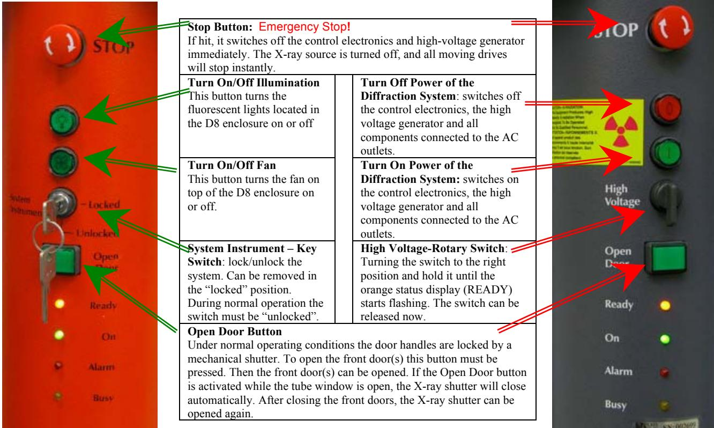

> 🧠 **[Cognis Multimodal Enrichment]**
> * **Classification:** Scientific Figure
> * **Extracted Text (OCR):** `Emergency Stop!, STOP, Turn On/Off Illumination, Turn Off Power of the Diffraction System, Turn On Power of the Diffraction System, High Voltage-Rotary Switch, Open Door Button, -Locked, -Unlocked, Ready, On, Alarm, Busy, High Voltage, Ready, On, Alarm, Busy`
> * **VLM Visual Summary:** ### FIGURE TYPE:
>   Instrument Schematic
>   
>   ### SCIENTIFIC PURPOSE:
>   The figure illustrates the control buttons and their functions for a powder diffraction instrument, specifically the Bruker D8 Discover XRD.
>   
>   ### KEY KNOWLEDGE:
>   1. **Emergency Stop Button**: This button immediately switches off the control electronics and high-voltage generator, turning off the X-ray source and stopping all moving drives.
>   2. **Turn On/Off Illumination Button**: This button controls the fluorescent lights located in the D8 enclosure.
>   3. **Turn On/Off Fan Button**: This button controls the fan on top of the D8 enclosure.
>   4. **System Instrument Key Switch**: This switch locks or unlocks the system. It can be removed in the "locked" position during normal operation.
>   5. **High Voltage Rotary Switch**: Turning the switch to the right position and holding it until the orange status display starts flashing indicates that the system is ready. The switch can be released once the status is ready.
>   6. **Open Door Button**: This button opens the D8 door when the system is ready and the shutter lights are green, indicating the tube is energized.
>   7. **Ready and On LED Lights**: These lights indicate the system's readiness and power status.
>   
>   ### LABEL INTERPRETATION:
>   - **Emergency Stop Button**: Emergency Stop!
>   - **Turn On/Off Illumination Button**: Turn On/Off Illumination
>   - **Turn On/Off Fan Button**: Turn On/Off Fan
>   - **System Instrument Key Switch**: System Instrument – Key Switch
>   - **High Voltage Rotary Switch**: High Voltage-Rotary Switch
>   - **Open Door Button**: Open Door Button
>   - **-Locked**: Locked
>   - **-Unlocked**: Unlocked
>   - **Ready**: Ready
>   - **On**: On
>   - **Alarm**: Alarm
>   - **Busy**: Busy
>   - **High Voltage**: High Voltage
>   - **Ready**: Ready
>   - **On**: On
>   - **Alarm**: Alarm
>   - **Busy**: Busy
>   
>   ### ENGINEERING/SCIENTIFIC INSIGHTS:
>   A reader should learn that the figure provides a detailed schematic of the control buttons and their functions for the Bruker D8 Discover XRD powder diffraction instrument. Understanding these buttons helps ensure proper operation and safety measures are taken during experimental procedures.
>   
>   ### USER-RELEVANT INFORMATION:
>   The information from this figure could help answer future questions about the specific functions of each button and how they contribute to the
> * **Figure Caption:** 2. Check System Control Buttons (located at the front side of the system) and make sure the Ready and On LED lights are on. | [Section: Bruker D8 Discover XRD User’s Guide I. Powder Diffraction Measurement using LynxEye Detector]
> * **Surrounding Context (+/- 300 words):**
>   * **[Before]:** *... [Section: Bruker D8 Discover XRD User’s Guide I. Powder Diffraction Measurement using LynxEye Detector] by Susheng Tan, Ph.D. NanoScale Fabrication and Characterization Facility, University of Pittsburgh M104 Benedum Hall, 3700 O’Hara Street, Pittsburgh, PA 15261 Phone: (412) 383-5978 Email: sut6@pitt.edu 1. Fill in the Log-book with relevant information before you begin analyze your sample. 2. Check System Control Buttons (located at the front side of the system) and make sure the Ready and On LED lights are on.*
>   * **[After]:** *[Section: Bruker D8 Discover XRD User’s Guide I. Powder Diffraction Measurement using LynxEye Detector] > 🧠 **[Cognis Multimodal Enrichment]** > * **Classification:** Scientific Figure > * **Extracted Text (OCR):** `Emergency Stop!, STOP, Turn On/Off Illumination, Turn Off Power of the Diffraction System, Turn On Power of the Diffraction System, High Voltage-Rotary Switch, Open Door Button, -Locked, -Unlocked, Ready, On, Alarm, Busy, High Voltage, Ready, On, Alarm, Busy` > * **VLM Visual Summary:** ### FIGURE TYPE: > **Instrument Schematic** > > ### SCIENTIFIC PURPOSE: > The figure illustrates the control buttons and their functions for a powder diffraction instrument, specifically the Bruker D8 Discover XRD. > > ### KEY KNOWLEDGE: > 1. **Emergency Stop Button**: This button immediately switches off the control electronics and high-voltage generator, turning off the X-ray source and stopping all moving drives. > 2. **Turn On/Off Illumination Button**: This button controls the fluorescent lights located in the D8 enclosure. > 3. **Turn On/Off Fan Button**: This button controls the fan on top of the D8 enclosure. > 4. **System Instrument Key Switch**: This switch locks or unlocks the system. It can be removed in the "locked" position during normal operation. > 5. **High Voltage Rotary Switch**: Turning the switch to the right position and holding it until the orange status display starts flashing indicates that the system is ready. The switch can be released once the status is ready. > 6. **Open Door Button**: This button opens the D8 door when the system is ready and the shutter lights are green, indicating the tube is energized. > 7. **Ready and On LED Lights**: These lights indicate the system's readiness and power status. > > ### LABEL INTERPRETATION: > - **Emergency Stop Button**: Emergency Stop! > - **Turn On/Off Illumination Button**: Turn On/Off Illumination > - **Turn On/Off ...*

> 🧠 **[Cognis Multimodal Enrichment]**
> * **Classification:** Scientific Figure
> * **Extracted Text (OCR):** `Emergency Stop!, STOP, Turn On/Off Illumination, Turn Off Power of the Diffraction System, Turn On Power of the Diffraction System, High Voltage-Rotary Switch, Open Door Button, -Locked, -Unlocked, Ready, On, Alarm, Busy, High Voltage, Ready, On, Alarm, Busy`
> * **VLM Visual Summary:** ### FIGURE TYPE:
>   **Instrument Schematic**
>   
>   ### SCIENTIFIC PURPOSE:
>   The figure illustrates the control buttons and their functions for a powder diffraction instrument, specifically the Bruker D8 Discover XRD.
>   
>   ### KEY KNOWLEDGE:
>   1. **Emergency Stop Button**: This button immediately switches off the control electronics and high-voltage generator, turning off the X-ray source and stopping all moving drives.
>   2. **Turn On/Off Illumination Button**: This button controls the fluorescent lights located in the D8 enclosure.
>   3. **Turn On/Off Fan Button**: This button controls the fan on top of the D8 enclosure.
>   4. **System Instrument Key Switch**: This switch locks or unlocks the system. It can be removed in the "locked" position during normal operation.
>   5. **High Voltage Rotary Switch**: Turning the switch to the right position and holding it until the orange status display starts flashing indicates that the system is ready. The switch can be released once the status is ready.
>   6. **Open Door Button**: This button opens the D8 door when the system is ready and the shutter lights are green, indicating the tube is energized.
>   7. **Ready and On LED Lights**: These lights indicate the system's readiness and power status.
>   
>   ### LABEL INTERPRETATION:
>   - **Emergency Stop Button**: Emergency Stop!
>   - **Turn On/Off Illumination Button**: Turn On/Off Illumination
>   - **Turn On/Off Fan Button**: Turn On/Off Fan
>   - **System Instrument Key Switch**: System Instrument – Key Switch
>   - **High Voltage Rotary Switch**: High Voltage-Rotary Switch
>   - **Open Door Button**: Open Door
>   - **Ready LED Light**: Ready
>   - **On LED Light**: On
>   
>   ### ENGINEERING/SCIENTIFIC INSIGHTS:
>   A reader should learn that the Bruker D8 Discover XRD is a powder diffraction instrument used for analyzing materials. The figure provides essential information about how to operate and safely use the instrument, including emergency procedures, illumination control, ventilation, system locking/unlocking, and safety checks before opening the D8 door.
>   
>   ### USER-RELEVANT INFORMATION:
>   - The location of the Emergency Stop Button, Turn On/Off Illumination Button, Turn On/Off Fan Button, System Instrument Key Switch, High Voltage Rotary Switch, and Open Door Button.
>   - The function of the Ready and On LED Lights.
>   - The importance of checking the shutter lights before opening the D8 door
> * **Figure Caption:** 2. Check System Control Buttons (located at the front side of the system) and make sure the Ready and On LED lights are on. | 3. Before opening the D8 door, check for any abnormalities in and around the instrument. Give particular attention to the shutter lights on the X-ray tube. The green light indicates that the tube is energized (light should be lit). The two red lights indicate the shutter position (if they are lit the shutter is open and you must not open the doors on the D8; if the red lights are off, then it is safe to open the doors and mount the sample stage on the goniometer).
> * **Surrounding Context (+/- 300 words):**
>   * **[Before]:** *... [Section: Bruker D8 Discover XRD User’s Guide I. Powder Diffraction Measurement using LynxEye Detector] by Susheng Tan, Ph.D. NanoScale Fabrication and Characterization Facility, University of Pittsburgh M104 Benedum Hall, 3700 O’Hara Street, Pittsburgh, PA 15261 Phone: (412) 383-5978 Email: sut6@pitt.edu 1. Fill in the Log-book with relevant information before you begin analyze your sample. 2. Check System Control Buttons (located at the front side of the system) and make sure the Ready and On LED lights are on.*
>   * **[After]:** *3. Before opening the D8 door, check for any abnormalities in and around the instrument. Give particular attention to the shutter lights on the X-ray tube. The green light indicates that the tube is energized (light should be lit). The two red lights indicate the shutter position (if they are lit the shutter is open and you must not open the doors on the D8; if the red lights are off, then it is safe to open the doors and mount the sample stage on the goniometer). 4. Mount sample in the appropriate holder and then place the holder in the sample stage on the goniometer. 5. If the XRD COMMANDER is not opened, click the icon, on the desktop to open it. 6. Set up DIFFRACplus XRD Commander 1) Click the Details tab to activate the Details page, [Section: Bruker D8 Discover XRD User’s Guide I. Powder Diffraction Measurement using LynxEye Detector] a. Select the PSD detector (LynxEye). b. Input Discriminator Lower Level: 0.12; Discriminator Window Width: 0.14. c. Click Set Detector button. [Section: Bruker D8 Discover XRD User’s Guide I. Powder Diffraction Measurement using LynxEye Detector > 2) Activate the Adjust page] a. Make sure that for each drive its actual position is shown in blue. If any of the drive positions are displayed in dark red, you will not be able to use the D8 — ask for help. b. Set the X-ray generator voltage to 40 kV and the current to 40mA or other your desired combination. c. Find zero position of the Z drive for your sample: i. Open the Video program by clicking the video icon, , and start live view. ii. In XRD Commander window, click Direct Mode icon, to enter direct laser control mode. iii. In Direct Command window, type RC1 and ...*

3. Before opening the D8 door, check for any abnormalities in and around the instrument. Give particular attention to the shutter lights on the X-ray tube. The green light indicates that the tube is energized (light should be lit). The two red lights indicate the shutter position (if they are lit the shutter is open and you must not open the doors on the D8; if the red lights are off, then it is safe to open the doors and mount the sample stage on the goniometer).

4. Mount sample in the appropriate holder and then place the holder in the sample stage on the goniometer.

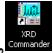

> 🧠 **[Cognis Multimodal Enrichment]**
> * **Classification:** Scientific Figure
> * **Extracted Text (OCR):** `XRD Commander`
> * **VLM Visual Summary:** ### FIGURE TYPE:
>   Procedure Illustration
>   
>   ### SCIENTIFIC PURPOSE:
>   The figure illustrates the procedure for mounting a sample in a powder diffraction instrument, specifically for the Bruker D8 Discover XRD system using the LynxEye detector.
>   
>   ### KEY KNOWLEDGE:
>   1. **Sample Preparation**: The sample needs to be mounted in the appropriate holder and placed in the sample stage on the goniometer.
>   2. **XRD Commander Usage**: If XRD Commander is not already open, it should be opened from the desktop icon.
>   3. **System Controls**: Ensure the Ready and On LED lights are on before opening the D8 door.
>   4. **Detector Selection**: Select the LynxEye detector with specific discriminator settings.
>   5. **Adjustments**: Set the X-ray generator voltage to 40 kV and current to 40 mA or another desired combination.
>   6. **Measurement Parameters**: Define the scan type, range, speed, and increment for the diffraction pattern.
>   
>   ### LABEL INTERPRETATION:
>   - **XRD Commander**: Indicates the software used for controlling the XRD system.
>   - **Sample Stage**: Where the sample is mounted and positioned on the goniometer.
>   - **Goniometer**: The instrument used to measure angles of the diffracted beam.
>   - **LynxEye Detector**: The specific detector used in the XRD system.
>   - **Direct Command Window**: A window within the XRD Commander where direct laser control can be activated and adjusted.
>   
>   ### ENGINEERING/SCIENTIFIC INSIGHTS:
>   A reader should learn how to properly prepare and operate a powder diffraction instrument, including selecting the correct detector, adjusting the X-ray generator settings, and defining measurement parameters accurately.
>   
>   ### USER-RELEVANT INFORMATION:
>   - The specific steps involved in mounting a sample in the XRD system.
>   - The importance of setting the correct detector parameters (e.g., Discriminator Lower Level, Discriminator Window Width).
>   - The need to ensure the system is ready before opening the D8 door.
>   - The significance of adjusting the X-ray generator voltage and current settings.
>   - The necessity of defining measurement parameters such as scan type, range, speed, and increment.
> * **Figure Caption:** 4. Mount sample in the appropriate holder and then place the holder in the sample stage on the goniometer. | [Section: Bruker D8 Discover XRD User’s Guide I. Powder Diffraction Measurement using LynxEye Detector]
> * **Surrounding Context (+/- 300 words):**
>   * **[Before]:** *... open it. 6. Set up DIFFRACplus XRD Commander 1) Click the Details tab to activate the Details page, [Section: Bruker D8 Discover XRD User’s Guide I. Powder Diffraction Measurement using LynxEye Detector] a. Select the PSD detector (LynxEye). b. Input Discriminator Lower Level: 0.12; Discriminator Window Width: 0.14. c. Click Set Detector button. [Section: Bruker D8 Discover XRD User’s Guide I. Powder Diffraction Measurement using LynxEye Detector > 2) Activate the Adjust page] a. Make sure that for each drive its actual position is shown in blue. If any of the drive positions are displayed in dark red, you will not be able to use the D8 — ask for help. b. Set the X-ray generator voltage to 40 kV and the current to 40mA or other your desired combination. c. Find zero position of the Z drive for your sample: i. Open the Video program by clicking the video icon, , and start live view. ii. In XRD Commander window, click Direct Mode icon, to enter direct laser control mode. iii. In Direct Command window, type RC1 and ...* [Section: Bruker D8 Discover XRD User’s Guide I. Powder Diffraction Measurement using LynxEye Detector] 3. Before opening the D8 door, check for any abnormalities in and around the instrument. Give particular attention to the shutter lights on the X-ray tube. The green light indicates that the tube is energized (light should be lit). The two red lights indicate the shutter position (if they are lit the shutter is open and you must not open the doors on the D8; if the red lights are off, then it is safe to open the doors and mount the sample stage on the goniometer). 4. Mount sample in the appropriate holder and then place the holder in the sample stage on the goniometer.*
>   * **[After]:** *[Section: Bruker D8 Discover XRD User’s Guide I. Powder Diffraction Measurement using LynxEye Detector] > 🧠 **[Cognis Multimodal Enrichment]** > * **Classification:** Scientific Figure > * **Extracted Text (OCR):** `XRD Commander` > * **VLM Visual Summary:** ### FIGURE TYPE: > **Procedure Illustration** > > ### SCIENTIFIC PURPOSE: > The figure illustrates the procedure for mounting a sample in a powder diffraction instrument, specifically for the Bruker D8 Discover XRD system using the LynxEye detector. > > ### KEY KNOWLEDGE: > 1. **Sample Preparation**: The sample needs to be mounted in the appropriate holder and placed in the sample stage on the goniometer. > 2. **XRD Commander Usage**: If XRD Commander is not already open, it should be opened from the desktop icon. > 3. **System Controls**: Ensure the Ready and On LED lights are on before opening the D8 door. > 4. **Detector Selection**: Select the LynxEye detector with specific discriminator settings. > 5. **Adjustments**: Set the X-ray generator voltage to 40 kV and current to 40 mA or another desired combination. > 6. **Measurement Parameters**: Define the scan type, range, speed, and increment for the diffraction pattern. > > ### LABEL INTERPRETATION: > - **XRD Commander**: Indicates the software used for controlling the XRD system. > - **Sample Stage**: Where the sample is mounted and positioned on the goniometer. > - **Goniometer**: The instrument used to measure angles of the diffracted beam. > - **LynxEye Detector**: The specific detector used in the XRD system. > - **Direct Command Window**: A window within the XRD Commander where direct laser control can be activated and adjusted. > > ### ENGINEERING/SCIENTIFIC INSIGHTS: > A reader should learn how to properly prepare and operate a powder diffraction instrument, including selecting the correct detector, adjusting the X-ray generator settings, and defining measurement parameters accurately. ...*

> 🧠 **[Cognis Multimodal Enrichment]**
> * **Classification:** Scientific Figure
> * **Extracted Text (OCR):** `XRD Commander`
> * **VLM Visual Summary:** ### FIGURE TYPE:
>   **Procedure Illustration**
>   
>   ### SCIENTIFIC PURPOSE:
>   The figure illustrates the procedure for mounting a sample in a powder diffraction instrument, specifically for the Bruker D8 Discover XRD system using the LynxEye detector.
>   
>   ### KEY KNOWLEDGE:
>   1. **Sample Preparation**: The sample needs to be mounted in the appropriate holder and placed in the sample stage on the goniometer.
>   2. **XRD Commander Usage**: If XRD Commander is not already open, it should be opened from the desktop icon.
>   3. **System Controls**: Ensure the Ready and On LED lights are on before opening the D8 door.
>   4. **Detector Selection**: Select the LynxEye detector with specific discriminator settings.
>   5. **Adjustments**: Set the X-ray generator voltage to 40 kV and current to 40 mA or another desired combination.
>   6. **Measurement Parameters**: Define the scan type, range, speed, and increment for the diffraction pattern.
>   
>   ### LABEL INTERPRETATION:
>   - **XRD Commander**: Indicates the software used for controlling the XRD system.
>   - **Sample Stage**: Where the sample is mounted and positioned on the goniometer.
>   - **Goniometer**: The instrument used to measure angles of the diffracted beam.
>   - **LynxEye Detector**: The specific detector used in the XRD system.
>   - **Direct Command Window**: A window within the XRD Commander where direct laser control can be activated and adjusted.
>   
>   ### ENGINEERING/SCIENTIFIC INSIGHTS:
>   A reader should learn how to properly prepare and operate a powder diffraction instrument, including selecting the correct detector, adjusting the X-ray generator settings, and defining measurement parameters accurately.
>   
>   ### USER-RELEVANT INFORMATION:
>   - **XRD Commander Icon**: The location of the XRD Commander icon on the desktop.
>   - **Detector Settings**: Specific discriminator levels and window width for the LynxEye detector.
>   - **Scan Parameters**: Range, speed, and increment values for the diffraction pattern.
>   - **Sample Mounting Instructions**: Steps for mounting the sample in the appropriate holder and placing it on the goniometer.
>   
>   This figure provides a clear, step-by-step guide for performing powder diffraction measurements using the Bruker D8 Discover XRD system.
> * **Figure Caption:** 4. Mount sample in the appropriate holder and then place the holder in the sample stage on the goniometer. | 5. If the XRD COMMANDER is not opened, click the icon, on the desktop to open it.
> * **Surrounding Context (+/- 300 words):**
>   * **[Before]:** *... [Section: Bruker D8 Discover XRD User’s Guide I. Powder Diffraction Measurement using LynxEye Detector] by Susheng Tan, Ph.D. NanoScale Fabrication and Characterization Facility, University of Pittsburgh M104 Benedum Hall, 3700 O’Hara Street, Pittsburgh, PA 15261 Phone: (412) 383-5978 Email: sut6@pitt.edu 1. Fill in the Log-book with relevant information before you begin analyze your sample. 2. Check System Control Buttons (located at the front side of the system) and make sure the Ready and On LED lights are on. 3. Before opening the D8 door, check for any abnormalities in and around the instrument. Give particular attention to the shutter lights on the X-ray tube. The green light indicates that the tube is energized (light should be lit). The two red lights indicate the shutter position (if they are lit the shutter is open and you must not open the doors on the D8; if the red lights are off, then it is safe to open the doors and mount the sample stage on the goniometer). 4. Mount sample in the appropriate holder and then place the holder in the sample stage on the goniometer.*
>   * **[After]:** *5. If the XRD COMMANDER is not opened, click the icon, on the desktop to open it. 6. Set up DIFFRACplus XRD Commander 1) Click the Details tab to activate the Details page, [Section: Bruker D8 Discover XRD User’s Guide I. Powder Diffraction Measurement using LynxEye Detector] a. Select the PSD detector (LynxEye). b. Input Discriminator Lower Level: 0.12; Discriminator Window Width: 0.14. c. Click Set Detector button. [Section: Bruker D8 Discover XRD User’s Guide I. Powder Diffraction Measurement using LynxEye Detector > 2) Activate the Adjust page] a. Make sure that for each drive its actual position is shown in blue. If any of the drive positions are displayed in dark red, you will not be able to use the D8 — ask for help. b. Set the X-ray generator voltage to 40 kV and the current to 40mA or other your desired combination. c. Find zero position of the Z drive for your sample: i. Open the Video program by clicking the video icon, , and start live view. ii. In XRD Commander window, click Direct Mode icon, to enter direct laser control mode. iii. In Direct Command window, type RC1 and press Enter to activate the direct laser control mode. iv. Type OC16,1 to turn the laser on. v. Close the Direct Command window. vi. Input a specific Z position and click the drive to icon, to adjust the Z drive to center the laser spot at the crosshair. vii. Open the Direct Command window again, and type OC16,0 to turn off the laser. viii. In Video program, stop Grab the live video. 3) Select measurement parameters: a. scan type: Locked Coupled, continuous scan. b. start: >3.5º , stop: <100º , scanspeed: 0.40 Sec/Step, and increment: 0.04º . c. slit size: 0.2 mm; high voltage: 40 kV, ...*

5. If the XRD COMMANDER is not opened, click the icon, on the desktop to open it.

6. Set up DIFFRACplus XRD Commander

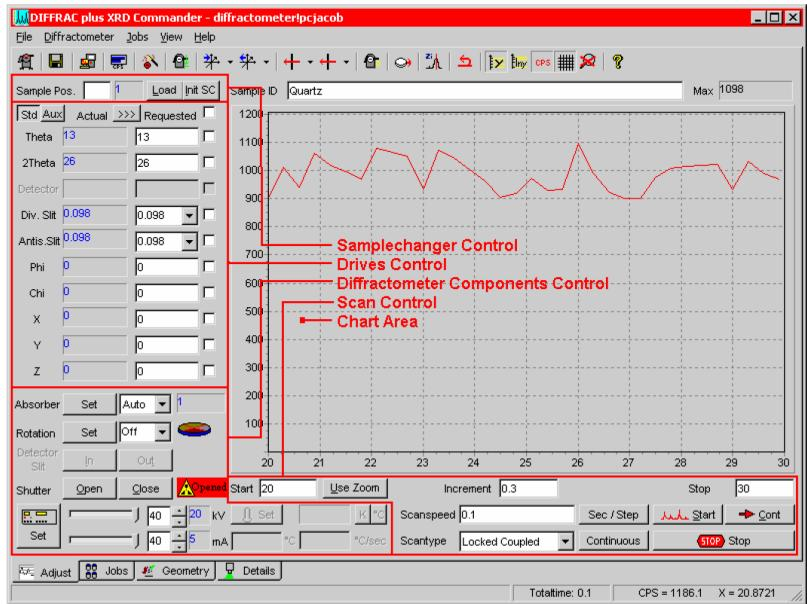

> 🧠 **[Cognis Multimodal Enrichment]**
> * **Classification:** Scientific Figure
> * **Extracted Text (OCR):** `DIFFRACplus XRD Commander, diffractometer/pcjacob, Sample Pos., 1, Load Init SC, Sample ID, Quartz, Std Aux, Actual >>> Requested, Theta, 13, 13, 2Theta, 26, 26, Div. Silt, 0.098, 0.098, Antis Silt, 0.098, 0.098,`
> * **VLM Visual Summary:** ### FIGURE TYPE:
>   Software Interface Screenshot
>   
>   ### SCIENTIFIC PURPOSE:
>   The figure illustrates the user interface of the DIFFRACplus XRD Commander software, which is used for controlling and analyzing powder diffraction data.
>   
>   ### KEY KNOWLEDGE:
>   1. **Sample Position**: The software allows users to set the position of the sample.
>   2. **Theta and 2Theta Values**: These values are typically used to determine the angle of incidence and the Bragg angle, respectively.
>   3. **Detector Settings**: Parameters such as detector slit width and antiscatter slit width are adjustable.
>   4. **Drive Control**: The software controls the movement of the sample stages (X, Y, Z) to align the sample with the diffractometer.
>   5. **Diffractometer Components Control**: Users can control various components of the diffractometer, including the absorber, rotation, and shutter.
>   6. **Scan Control**: The software manages the scanning parameters, such as scan speed, increment, and scan range.
>   7. **Chart Area**: This area displays the diffraction pattern, which is the result of the XRD measurement.
>   8. **Absorber Setting**: The absorber setting determines how much of the X-ray beam is absorbed by the sample.
>   9. **Rotation Setting**: The rotation setting controls the rotation of the sample around the vertical axis.
>   10. **Shutter Control**: The shutter control manages the opening and closing of the X-ray tube shutter.
>   
>   ### LABEL INTERPRETATION:
>   - **Sample Pos.**: Sample
>   - **Theta**: Angle of incidence
>   - **2Theta**: Bragg angle
>   - **Div. Silt**: Detector slit width
>   - **Antis Silt**: Antiscatter slit width
>   - **Phi**: Rotation angle
>   - **Chi**: Rotation angle
>   - **X**: Sample stage movement
>   - **Y**: Sample stage movement
>   - **Z**: Sample stage movement
>   - **Absorber**: Absorber setting
>   - **Rotation**: Rotation setting
>   - **Shutter**: Shutter control
>   
>   ### ENGINEERING/SCIENTIFIC INSIGHTS:
>   A reader should learn that the DIFFRACplus XRD Commander software provides a comprehensive interface for controlling and analyzing powder diffraction data, allowing users to set up their experiment parameters, monitor the diffraction pattern, and manage the scanning process efficiently.
>   
>   ### USER-RELEVANT INFORMATION:
>   Information from this figure could help answer future questions
> * **Figure Caption:** 6. Set up DIFFRACplus XRD Commander | [Section: Bruker D8 Discover XRD User’s Guide I. Powder Diffraction Measurement using LynxEye Detector]
> * **Surrounding Context (+/- 300 words):**
>   * **[Before]:** *... User’s Guide I. Powder Diffraction Measurement using LynxEye Detector] a. Select the PSD detector (LynxEye). b. Input Discriminator Lower Level: 0.12; Discriminator Window Width: 0.14. c. Click Set Detector button. [Section: Bruker D8 Discover XRD User’s Guide I. Powder Diffraction Measurement using LynxEye Detector > 2) Activate the Adjust page] a. Make sure that for each drive its actual position is shown in blue. If any of the drive positions are displayed in dark red, you will not be able to use the D8 — ask for help. b. Set the X-ray generator voltage to 40 kV and the current to 40mA or other your desired combination. c. Find zero position of the Z drive for your sample: i. Open the Video program by clicking the video icon, , and start live view. ii. In XRD Commander window, click Direct Mode icon, to enter direct laser control mode. iii. In Direct Command window, type RC1 and press Enter to activate the direct laser control mode. iv. Type OC16,1 to turn the laser on. v. Close the Direct Command window. vi. Input a specific Z position and click the drive to icon, to adjust the Z drive to center the laser spot at the crosshair. vii. Open the Direct Command window again, and type OC16,0 to turn off the laser. viii. In Video program, stop Grab the live video. 3) Select measurement parameters: a. scan type: Locked Coupled, continuous scan. b. start: >3.5º , stop: <100º , scanspeed: 0.40 Sec/Step, and increment: 0.04º . c. slit size: 0.2 mm; high voltage: 40 kV, ...* [Section: Bruker D8 Discover XRD User’s Guide I. Powder Diffraction Measurement using LynxEye Detector] 5. If the XRD COMMANDER is not opened, click the icon, on the desktop to open it. 6. Set up DIFFRACplus XRD Commander*
>   * **[After]:** *[Section: Bruker D8 Discover XRD User’s Guide I. Powder Diffraction Measurement using LynxEye Detector] > 🧠 **[Cognis Multimodal Enrichment]** > * **Classification:** Scientific Figure > * **Extracted Text (OCR):** `DIFFRACplus XRD Commander, diffractometer/pcjacob, Sample Pos., 1, Load Init SC, Sample ID, Quartz, Std Aux, Actual >>> Requested, Theta, 13, 13, 2Theta, 26, 26, Div. Silt, 0.098, 0.098, Antis Silt, 0.098, 0.098,` > * **VLM Visual Summary:** ### FIGURE TYPE: > Software Interface Screenshot > > ### SCIENTIFIC PURPOSE: > The figure illustrates the user interface of the DIFFRACplus XRD Commander software, which is used for controlling and analyzing powder diffraction data. > > ### KEY KNOWLEDGE: > 1. **Sample Position**: The software allows users to set the position of the sample. > 2. **Theta and 2Theta Values**: These values are typically used to determine the angle of incidence and the Bragg angle, respectively. > 3. **Detector Settings**: Parameters such as detector slit width and antiscatter slit width are adjustable. > 4. **Drive Control**: The software controls the movement of the sample stages (X, Y, Z) to align the sample with the diffractometer. > 5. **Diffractometer Components Control**: Users can control various components of the diffractometer, including the absorber, rotation, and shutter. > 6. **Scan Control**: The software manages the scanning parameters, such as scan speed, increment, and scan range. > 7. **Chart Area**: This area displays the diffraction pattern, which is the result of the XRD measurement. > 8. **Absorber Setting**: The absorber setting determines how much of the X-ray beam is absorbed by the sample. > 9. **Rotation Setting**: The rotation setting controls the rotation of the sample around the vertical axis. > 10. **Shutter Control**: The shutter control manages the opening and closing of the X-ray tube shutter. > > ### LABEL INTERPRETATION: > - **Sample Pos.**: Sample ...*

> 🧠 **[Cognis Multimodal Enrichment]**
> * **Classification:** Scientific Figure
> * **Extracted Text (OCR):** `DIFFRACplus XRD Commander, diffractometer/pcjacob, Sample Pos., 1, Load Init SC, Sample ID, Quartz, Std Aux, Actual >>> Requested, Theta, 13, 13, 2Theta, 26, 26, Div. Silt, 0.098, 0.098, Antis Silt, 0.098, 0.098,`
> * **VLM Visual Summary:** ### FIGURE TYPE:
>   Software Interface Screenshot
>   
>   ### SCIENTIFIC PURPOSE:
>   The figure illustrates the user interface of the DIFFRACplus XRD Commander software, which is used for controlling and analyzing powder diffraction data.
>   
>   ### KEY KNOWLEDGE:
>   1. **Sample Position**: The software allows users to set the position of the sample.
>   2. **Theta and 2Theta Values**: These values are typically used to determine the angle of incidence and the Bragg angle, respectively.
>   3. **Detector Settings**: Parameters such as detector slit width and antiscatter slit width are adjustable.
>   4. **Drive Control**: The software controls the movement of the sample stages (X, Y, Z) to align the sample with the diffractometer.
>   5. **Diffractometer Components Control**: Users can control various components of the diffractometer, including the absorber, rotation, and shutter.
>   6. **Scan Control**: The software manages the scanning parameters, such as scan speed, increment, and scan range.
>   7. **Chart Area**: This area displays the diffraction pattern, which is the result of the XRD measurement.
>   8. **Absorber Setting**: The absorber setting determines how much of the X-ray beam is absorbed by the sample.
>   9. **Rotation Setting**: The rotation setting controls the rotation of the sample around the vertical axis.
>   10. **Shutter Control**: The shutter control manages the opening and closing of the X-ray tube shutter.
>   
>   ### LABEL INTERPRETATION:
>   - **Sample Pos.**: Sample Position
>   - **Theta**: Angle of incidence
>   - **2Theta**: Bragg angle
>   - **Detector**: Detector settings
>   - **Div. Slit**: Detector slit width
>   - **Antis Slit**: Antiscatter slit width
>   - **Phi**: Rotation around the horizontal axis
>   - **Chi**: Rotation around the vertical axis
>   - **X**: Movement along the X-axis
>   - **Y**: Movement along the Y-axis
>   - **Z**: Movement along the Z-axis
>   - **Absorber**: Absorber setting
>   - **Rotation**: Rotation setting
>   - **Shutter**: Shutter control
>   - **Start**: Start button for initiating the measurement
>   - **Stop**: Stop button for ending the measurement
>   - **Increment**: Increment value for the scan
>   - **Scanspeed**: Scan speed
>   - **ScanType**: Scan type (e.g., Locked Coupled)
>   -
> * **Figure Caption:** 6. Set up DIFFRACplus XRD Commander | 1) Click the Details tab to activate the Details page,
> * **Surrounding Context (+/- 300 words):**
>   * **[Before]:** *... [Section: Bruker D8 Discover XRD User’s Guide I. Powder Diffraction Measurement using LynxEye Detector] by Susheng Tan, Ph.D. NanoScale Fabrication and Characterization Facility, University of Pittsburgh M104 Benedum Hall, 3700 O’Hara Street, Pittsburgh, PA 15261 Phone: (412) 383-5978 Email: sut6@pitt.edu 1. Fill in the Log-book with relevant information before you begin analyze your sample. 2. Check System Control Buttons (located at the front side of the system) and make sure the Ready and On LED lights are on. 3. Before opening the D8 door, check for any abnormalities in and around the instrument. Give particular attention to the shutter lights on the X-ray tube. The green light indicates that the tube is energized (light should be lit). The two red lights indicate the shutter position (if they are lit the shutter is open and you must not open the doors on the D8; if the red lights are off, then it is safe to open the doors and mount the sample stage on the goniometer). 4. Mount sample in the appropriate holder and then place the holder in the sample stage on the goniometer. 5. If the XRD COMMANDER is not opened, click the icon, on the desktop to open it. 6. Set up DIFFRACplus XRD Commander*
>   * **[After]:** *1) Click the Details tab to activate the Details page, [Section: Bruker D8 Discover XRD User’s Guide I. Powder Diffraction Measurement using LynxEye Detector] a. Select the PSD detector (LynxEye). b. Input Discriminator Lower Level: 0.12; Discriminator Window Width: 0.14. c. Click Set Detector button. [Section: Bruker D8 Discover XRD User’s Guide I. Powder Diffraction Measurement using LynxEye Detector > 2) Activate the Adjust page] a. Make sure that for each drive its actual position is shown in blue. If any of the drive positions are displayed in dark red, you will not be able to use the D8 — ask for help. b. Set the X-ray generator voltage to 40 kV and the current to 40mA or other your desired combination. c. Find zero position of the Z drive for your sample: i. Open the Video program by clicking the video icon, , and start live view. ii. In XRD Commander window, click Direct Mode icon, to enter direct laser control mode. iii. In Direct Command window, type RC1 and press Enter to activate the direct laser control mode. iv. Type OC16,1 to turn the laser on. v. Close the Direct Command window. vi. Input a specific Z position and click the drive to icon, to adjust the Z drive to center the laser spot at the crosshair. vii. Open the Direct Command window again, and type OC16,0 to turn off the laser. viii. In Video program, stop Grab the live video. 3) Select measurement parameters: a. scan type: Locked Coupled, continuous scan. b. start: >3.5º , stop: <100º , scanspeed: 0.40 Sec/Step, and increment: 0.04º . c. slit size: 0.2 mm; high voltage: 40 kV, current: 40 mA. 4) Click Start button, to begin a measurement. 5) Click Stop button, to end the immediate measurement. [Section: Bruker D8 ...*

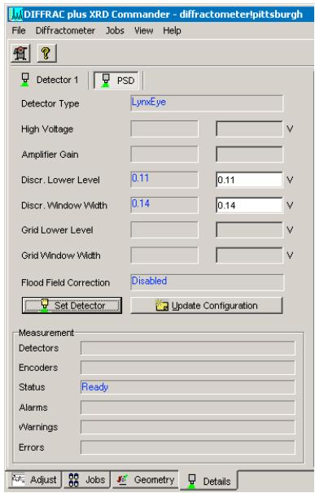

> 🧠 **[Cognis Multimodal Enrichment]**
> * **Classification:** Scientific Figure
> * **Extracted Text (OCR):** `DIFFRACplus XRD Commander - diffractometerPittsburgh, File, Diffractometer, Jobs, View, Help, Detector 1, PSD, Detector Type, LynxEye, High Voltage, Amplifier Gain, Discr. Lower Level, 0.11, 0.11, Discr. Window Width, 0.14, 0.14, Grid Lower Level, Grid Window Width, Flood Field Correction, Disabled,`
> * **VLM Visual Summary:** ### FIGURE TYPE:
>   Software Interface Screenshot
>   
>   ### SCIENTIFIC PURPOSE:
>   This figure illustrates the software interface of DIFFRACplus XRD Commander, which is used for configuring and controlling a powder diffraction instrument. The interface allows users to set up and monitor various parameters such as detector settings, measurement conditions, and status indicators.
>   
>   ### KEY KNOWLEDGE:
>   1. **Detector Configuration**: The user can select different detectors, such as LynxEye, and configure their settings like discriminator levels, window widths, and grid levels.
>   2. **Measurement Parameters**: Users can specify measurement parameters such as scan type, start and stop angles, scan speed, and slit sizes.
>   3. **Status Indicators**: The interface provides real-time status updates, including readiness status and alarms/warnings.
>   4. **Adjustments**: Users can adjust the X-ray generator voltage and current, and set the zero position of the Z drive for precise alignment.
>   
>   ### LABEL INTERPRETATION:
>   - **Detector Type**: Indicates the type of detector being used.
>   - **High Voltage**: Sets the high voltage level for the X-ray generator.
>   - **Amplifier Gain**: Configures the amplifier gain for signal amplification.
>   - **Discr. Lower Level**: Specifies the lower discriminator level.
>   - **Discr. Window Width**: Determines the width of the discriminator window.
>   - **Grid Lower Level**: Configures the lower grid level.
>   - **Grid Window Width**: Sets the width of the grid window.
>   - **Flood Field Correction**: Indicates whether flood field correction is enabled or disabled.
>   - **Set Detector Button**: Allows the user to set the detector configuration.
>   - **Update Configuration Button**: Updates the configuration settings.
>   - **Measurement Parameters**: Displays the current measurement parameters.
>   - **Status Indicator**: Shows the current status of the instrument, such as readiness status.
>   - **Alarms**: Indicates any alarms or warnings.
>   - **Errors**: Lists any errors encountered during the measurement.
>   
>   ### ENGINEERING/SCIENTIFIC INSIGHTS:
>   A reader should learn how to configure and control a powder diffraction instrument using the DIFFRACplus XRD Commander software. They should understand how to set up detector configurations, measure parameters, monitor status, and make adjustments to ensure accurate and reliable data collection.
>   
>   ### USER-RELEVANT INFORMATION:
>   The information provided in this figure includes details about the software interface, such as the type of detector, configuration settings, measurement parameters, and status indicators. This information can help answer future
> * **Figure Caption:** [Section: Bruker D8 Discover XRD User’s Guide I. Powder Diffraction Measurement using LynxEye Detector] | [Section: Bruker D8 Discover XRD User’s Guide I. Powder Diffraction Measurement using LynxEye Detector]
> * **Surrounding Context (+/- 300 words):**
>   * **[Before]:** *... User’s Guide I. Powder Diffraction Measurement using LynxEye Detector] a. Select the PSD detector (LynxEye). b. Input Discriminator Lower Level: 0.12; Discriminator Window Width: 0.14. c. Click Set Detector button. [Section: Bruker D8 Discover XRD User’s Guide I. Powder Diffraction Measurement using LynxEye Detector > 2) Activate the Adjust page] a. Make sure that for each drive its actual position is shown in blue. If any of the drive positions are displayed in dark red, you will not be able to use the D8 — ask for help. b. Set the X-ray generator voltage to 40 kV and the current to 40mA or other your desired combination. c. Find zero position of the Z drive for your sample: i. Open the Video program by clicking the video icon, , and start live view. ii. In XRD Commander window, click Direct Mode icon, to enter direct laser control mode. iii. In Direct Command window, type RC1 and press Enter to activate the direct laser control mode. iv. Type OC16,1 to turn the laser on. v. Close the Direct Command window. vi. Input a specific Z position and click the drive to icon, to adjust the Z drive to center the laser spot at the crosshair. vii. Open the Direct Command window again, and type OC16,0 to turn off the laser. viii. In Video program, stop Grab the live video. 3) Select measurement parameters: a. scan type: Locked Coupled, continuous scan. b. start: >3.5º , stop: <100º , scanspeed: 0.40 Sec/Step, and increment: 0.04º . c. slit size: 0.2 mm; high voltage: 40 kV, current: 40 mA. 4) Click Start button, to begin a measurement. 5) Click Stop button, to end the immediate measurement. [Section: Bruker D8 ...* [Section: Bruker D8 Discover XRD User’s Guide I. Powder Diffraction Measurement using LynxEye Detector]*
>   * **[After]:** *[Section: Bruker D8 Discover XRD User’s Guide I. Powder Diffraction Measurement using LynxEye Detector] > 🧠 **[Cognis Multimodal Enrichment]** > * **Classification:** Scientific Figure > * **Extracted Text (OCR):** `DIFFRACplus XRD Commander - diffractometerPittsburgh, File, Diffractometer, Jobs, View, Help, Detector 1, PSD, Detector Type, LynxEye, High Voltage, Amplifier Gain, Discr. Lower Level, 0.11, 0.11, Discr. Window Width, 0.14, 0.14, Grid Lower Level, Grid Window Width, Flood Field Correction, Disabled,` > * **VLM Visual Summary:** ### FIGURE TYPE: > Software Interface Screenshot > > ### SCIENTIFIC PURPOSE: > This figure illustrates the software interface of DIFFRACplus XRD Commander, which is used for configuring and controlling a powder diffraction instrument. The interface allows users to set up and monitor various parameters such as detector settings, measurement conditions, and status indicators. > > ### KEY KNOWLEDGE: > 1. **Detector Configuration**: The user can select different detectors, such as LynxEye, and configure their settings like discriminator levels, window widths, and grid levels. > 2. **Measurement Parameters**: Users can specify measurement parameters such as scan type, start and stop angles, scan speed, and slit sizes. > 3. **Status Indicators**: The interface provides real-time status updates, including readiness status and alarms/warnings. > 4. **Adjustments**: Users can adjust the X-ray generator voltage and current, and set the zero position of the Z drive for precise alignment. > > ### LABEL INTERPRETATION: > - **Detector Type**: Indicates the type of detector being used. > - **High Voltage**: Sets the high voltage level for the X-ray generator. > - **Amplifier Gain**: Configures the amplifier gain for signal amplification. > - **Discr. Lower Level**: Specifies the lower discriminator level. > - **Discr. Window Width**: Determines the width of the discriminator window. > - **Grid Lower Level**: Configures the lower grid level. > - **Grid Window Width**: Sets the width of ...*

> 🧠 **[Cognis Multimodal Enrichment]**
> * **Classification:** Scientific Figure
> * **Extracted Text (OCR):** `DIFFRACplus XRD Commander - diffractometerPittsburgh, File, Diffractometer, Jobs, View, Help, Detector 1, PSD, Detector Type, LynxEye, High Voltage, Amplifier Gain, Discr. Lower Level, 0.11, 0.11, Discr. Window Width, 0.14, 0.14, Grid Lower Level, Grid Window Width, Flood Field Correction, Disabled,`
> * **VLM Visual Summary:** ### FIGURE TYPE:
>   Software Interface Screenshot
>   
>   ### SCIENTIFIC PURPOSE:
>   This figure illustrates the software interface of DIFFRACplus XRD Commander, which is used for configuring and controlling a powder diffraction instrument. The interface allows users to set up and monitor various parameters such as detector settings, measurement conditions, and status indicators.
>   
>   ### KEY KNOWLEDGE:
>   1. **Detector Configuration**: The user can select different detectors, such as LynxEye, and configure their settings like discriminator levels, window widths, and grid levels.
>   2. **Measurement Parameters**: Users can specify measurement parameters such as scan type, start and stop angles, scan speed, and slit sizes.
>   3. **Status Indicators**: The interface provides real-time status updates, including readiness status and alarms/warnings.
>   4. **Adjustments**: Users can adjust the X-ray generator voltage and current, and set the zero position of the Z drive for precise alignment.
>   
>   ### LABEL INTERPRETATION:
>   - **Detector Type**: Indicates the type of detector being used.
>   - **High Voltage**: Sets the high voltage level for the X-ray generator.
>   - **Amplifier Gain**: Configures the amplifier gain for signal amplification.
>   - **Discr. Lower Level**: Specifies the lower discriminator level.
>   - **Discr. Window Width**: Determines the width of the discriminator window.
>   - **Grid Lower Level**: Configures the lower grid level.
>   - **Grid Window Width**: Sets the width of the grid window.
>   - **Flood Field Correction**: Enables or disables flood field correction.
>   - **Set Detector**: Updates the detector configuration.
>   - **Update Configuration**: Refreshes the configuration settings.
>   - **Measurement Parameters**: Configures the measurement parameters such as scan type, start angle, stop angle, scan speed, and slit size.
>   - **Status**: Displays the current status of the instrument, including readiness and alarms/warnings.
>   - **Adjust**: Provides options to adjust the X-ray generator voltage and current, and set the zero position of the Z drive.
>   
>   ### ENGINEERING/SCIENTIFIC INSIGHTS:
>   - **User-Friendly Interface**: The software provides a user-friendly interface for configuring and monitoring powder diffraction experiments.
>   - **Precision Control**: Users can precisely set and adjust parameters to ensure accurate measurements.
>   - **Real-Time Monitoring**: The interface offers real-time status updates, allowing users to quickly identify and address any issues during the experiment.
>   
>   ### USER-RELEVANT INFORMATION:
>   - **Detector Settings**: Understanding the specific
> * **Figure Caption:** 6. Set up DIFFRACplus XRD Commander | 1) Click the Details tab to activate the Details page,
> * **Surrounding Context (+/- 300 words):**
>   * **[Before]:** *... [Section: Bruker D8 Discover XRD User’s Guide I. Powder Diffraction Measurement using LynxEye Detector] by Susheng Tan, Ph.D. NanoScale Fabrication and Characterization Facility, University of Pittsburgh M104 Benedum Hall, 3700 O’Hara Street, Pittsburgh, PA 15261 Phone: (412) 383-5978 Email: sut6@pitt.edu 1. Fill in the Log-book with relevant information before you begin analyze your sample. 2. Check System Control Buttons (located at the front side of the system) and make sure the Ready and On LED lights are on. 3. Before opening the D8 door, check for any abnormalities in and around the instrument. Give particular attention to the shutter lights on the X-ray tube. The green light indicates that the tube is energized (light should be lit). The two red lights indicate the shutter position (if they are lit the shutter is open and you must not open the doors on the D8; if the red lights are off, then it is safe to open the doors and mount the sample stage on the goniometer). 4. Mount sample in the appropriate holder and then place the holder in the sample stage on the goniometer. 5. If the XRD COMMANDER is not opened, click the icon, on the desktop to open it. 6. Set up DIFFRACplus XRD Commander*
>   * **[After]:** *1) Click the Details tab to activate the Details page, [Section: Bruker D8 Discover XRD User’s Guide I. Powder Diffraction Measurement using LynxEye Detector] a. Select the PSD detector (LynxEye). b. Input Discriminator Lower Level: 0.12; Discriminator Window Width: 0.14. c. Click Set Detector button. [Section: Bruker D8 Discover XRD User’s Guide I. Powder Diffraction Measurement using LynxEye Detector > 2) Activate the Adjust page] a. Make sure that for each drive its actual position is shown in blue. If any of the drive positions are displayed in dark red, you will not be able to use the D8 — ask for help. b. Set the X-ray generator voltage to 40 kV and the current to 40mA or other your desired combination. c. Find zero position of the Z drive for your sample: i. Open the Video program by clicking the video icon, , and start live view. ii. In XRD Commander window, click Direct Mode icon, to enter direct laser control mode. iii. In Direct Command window, type RC1 and press Enter to activate the direct laser control mode. iv. Type OC16,1 to turn the laser on. v. Close the Direct Command window. vi. Input a specific Z position and click the drive to icon, to adjust the Z drive to center the laser spot at the crosshair. vii. Open the Direct Command window again, and type OC16,0 to turn off the laser. viii. In Video program, stop Grab the live video. 3) Select measurement parameters: a. scan type: Locked Coupled, continuous scan. b. start: >3.5º , stop: <100º , scanspeed: 0.40 Sec/Step, and increment: 0.04º . c. slit size: 0.2 mm; high voltage: 40 kV, current: 40 mA. 4) Click Start button, to begin a measurement. 5) Click Stop button, to end the immediate measurement. [Section: Bruker D8 ...*

1) Click the Details tab to activate the Details page,

a. Select the PSD detector (LynxEye).

b. Input Discriminator Lower Level: 0.12; Discriminator Window Width: 0.14.

c. Click Set Detector button.

## 2) Activate the Adjust page

a. Make sure that for each drive its actual position is shown in blue. If any of the drive positions are displayed in dark red, you will not be able to use the D8 — ask for help.

b. Set the X-ray generator voltage to 40 kV and the current to 40mA or other your desired combination.

c. Find zero position of the Z drive for your sample:

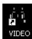

> 🧠 **[Cognis Multimodal Enrichment]**
> * **Classification:** Scientific Figure
> * **Extracted Text (OCR):** `VIDEO`
> * **VLM Visual Summary:** ### FIGURE TYPE:
>   Procedure Illustration
>   
>   ### SCIENTIFIC PURPOSE:
>   The figure illustrates a step-by-step procedure for setting up and performing a powder diffraction measurement using the LynxEye detector in the Bruker D8 Discover XRD system.
>   
>   ### KEY KNOWLEDGE:
>   1. **Opening the Video Program**: The first step involves opening the Video program by clicking the video icon and starting live view.
>   2. **Setting Up XRD Commander**: The next steps involve activating the XRD Commander window, entering direct laser control mode, adjusting the laser position, and turning it off.
>   3. **Adjusting the Z Drive**: The user needs to find the zero position of the Z drive for their sample.
>   4. **Selecting Measurement Parameters**: The user selects measurement parameters such as scan type, start angle, stop angle, scan speed, and slit size.
>   5. **Starting the Measurement**: The user clicks the Start button to begin the measurement.
>   6. **Stopping the Measurement**: The user clicks the Stop button to end the measurement immediately.
>   7. **Saving Data**: The final step involves saving the measured data as a RAW data file.
>   
>   ### LABEL INTERPRETATION:
>   - **Video Icon**: Represents the Video program.
>   - **Direct Command Window**: Indicates the window where direct laser control commands are entered.
>   - **Z Drive**: Refers to the Z-axis drive in the XRD system.
>   - **Scan Parameters**: Specifies the scan type, start angle, stop angle, scan speed, and slit size.
>   
>   ### ENGINEERING/SCIENTIFIC INSIGHTS:
>   A reader should learn how to set up and perform a powder diffraction measurement using the LynxEye detector in the Bruker D8 Discover XRD system, including the necessary steps for opening the Video program, setting up the XRD Commander, adjusting the Z drive, selecting measurement parameters, starting and stopping the measurement, and saving the data.
>   
>   ### USER-RELEVANT INFORMATION:
>   The information provided in the figure includes the steps for setting up and performing a powder diffraction measurement, which can be used to answer future questions related to the setup and execution of similar measurements using the LynxEye detector in the Bruker D8 Discover XRD system.
> * **Figure Caption:** c. Find zero position of the Z drive for your sample: | [Section: Bruker D8 Discover XRD User’s Guide I. Powder Diffraction Measurement using LynxEye Detector > 2) Activate the Adjust page]
> * **Surrounding Context (+/- 300 words):**
>   * **[Before]:** *... Open the Video program by clicking the video icon, , and start live view. ii. In XRD Commander window, click Direct Mode icon, to enter direct laser control mode. iii. In Direct Command window, type RC1 and press Enter to activate the direct laser control mode. iv. Type OC16,1 to turn the laser on. v. Close the Direct Command window. vi. Input a specific Z position and click the drive to icon, to adjust the Z drive to center the laser spot at the crosshair. vii. Open the Direct Command window again, and type OC16,0 to turn off the laser. viii. In Video program, stop Grab the live video. 3) Select measurement parameters: a. scan type: Locked Coupled, continuous scan. b. start: >3.5º , stop: <100º , scanspeed: 0.40 Sec/Step, and increment: 0.04º . c. slit size: 0.2 mm; high voltage: 40 kV, current: 40 mA. 4) Click Start button, to begin a measurement. 5) Click Stop button, to end the immediate measurement. [Section: Bruker D8 ...* [Section: Bruker D8 Discover XRD User’s Guide I. Powder Diffraction Measurement using LynxEye Detector] 1) Click the Details tab to activate the Details page, a. Select the PSD detector (LynxEye). b. Input Discriminator Lower Level: 0.12; Discriminator Window Width: 0.14. c. Click Set Detector button. [Section: Bruker D8 Discover XRD User’s Guide I. Powder Diffraction Measurement using LynxEye Detector > 2) Activate the Adjust page] a. Make sure that for each drive its actual position is shown in blue. If any of the drive positions are displayed in dark red, you will not be able to use the D8 — ask for help. b. Set the X-ray generator voltage to 40 kV and the current to 40mA or other your desired combination. c. Find zero position of the Z drive for your sample:*
>   * **[After]:** *[Section: Bruker D8 Discover XRD User’s Guide I. Powder Diffraction Measurement using LynxEye Detector > 2) Activate the Adjust page] > 🧠 **[Cognis Multimodal Enrichment]** > * **Classification:** Scientific Figure > * **Extracted Text (OCR):** `VIDEO` > * **VLM Visual Summary:** ### FIGURE TYPE: > **Procedure Illustration** > > ### SCIENTIFIC PURPOSE: > The figure illustrates a step-by-step procedure for setting up and performing a powder diffraction measurement using the LynxEye detector in the Bruker D8 Discover XRD system. > > ### KEY KNOWLEDGE: > 1. **Opening the Video Program**: The first step involves opening the Video program by clicking the video icon and starting live view. > 2. **Setting Up XRD Commander**: The next steps involve activating the XRD Commander window, entering direct laser control mode, adjusting the laser position, and turning it off. > 3. **Adjusting the Z Drive**: The user needs to find the zero position of the Z drive for their sample. > 4. **Selecting Measurement Parameters**: The user selects measurement parameters such as scan type, start angle, stop angle, scan speed, and slit size. > 5. **Starting the Measurement**: The user clicks the Start button to begin the measurement. > 6. **Stopping the Measurement**: The user clicks the Stop button to end the measurement immediately. > 7. **Saving Data**: The final step involves saving the measured data as a RAW data file. > > ### LABEL INTERPRETATION: > - **Video Icon**: Represents the Video program. > - **Direct Command Window**: Indicates the window where direct laser control commands are entered. > - **Z Drive**: Refers to the Z-axis drive in the XRD system. > - **Scan Parameters**: Specifies the scan type, start angle, stop angle, scan speed, and slit size. > > ### ENGINEERING/SCIENTIFIC INSIGHTS: > A reader should learn how to set up and ...*

> 🧠 **[Cognis Multimodal Enrichment]**
> * **Classification:** Scientific Figure
> * **Extracted Text (OCR):** `VIDEO`
> * **VLM Visual Summary:** ### FIGURE TYPE:
>   **Procedure Illustration**
>   
>   ### SCIENTIFIC PURPOSE:
>   The figure illustrates a step-by-step procedure for setting up and performing a powder diffraction measurement using the LynxEye detector in the Bruker D8 Discover XRD system.
>   
>   ### KEY KNOWLEDGE:
>   1. **Opening the Video Program**: The first step involves opening the Video program by clicking the video icon and starting live view.
>   2. **Setting Up XRD Commander**: The next steps involve activating the XRD Commander window, entering direct laser control mode, adjusting the laser position, and turning it off.
>   3. **Adjusting the Z Drive**: The user needs to find the zero position of the Z drive for their sample.
>   4. **Selecting Measurement Parameters**: The user selects measurement parameters such as scan type, start angle, stop angle, scan speed, and slit size.
>   5. **Starting the Measurement**: The user clicks the Start button to begin the measurement.
>   6. **Stopping the Measurement**: The user clicks the Stop button to end the measurement immediately.
>   7. **Saving Data**: The final step involves saving the measured data as a RAW data file.
>   
>   ### LABEL INTERPRETATION:
>   - **Video Icon**: Represents the Video program.
>   - **Direct Command Window**: Indicates the window where direct laser control commands are entered.
>   - **Z Drive**: Refers to the Z-axis drive in the XRD system.
>   - **Scan Parameters**: Specifies the scan type, start angle, stop angle, scan speed, and slit size.
>   
>   ### ENGINEERING/SCIENTIFIC INSIGHTS:
>   A reader should learn how to set up and perform a powder diffraction measurement using the LynxEye detector in the Bruker D8 Discover XRD system, including the necessary steps for live view, laser control, and data collection.
>   
>   ### USER-RELEVANT INFORMATION:
>   - **Video Icon**: For starting live view.
>   - **Direct Command Window**: For entering laser control commands.
>   - **Z Drive Position**: To find the zero position for the Z drive.
>   - **Scan Parameters**: For selecting the correct scan settings.
>   - **Start and Stop Buttons**: For initiating and ending the measurement.
>   - **RAW Data File**: For saving the collected data for further analysis.
> * **Figure Caption:** c. Find zero position of the Z drive for your sample: | i. Open the Video program by clicking the video icon, , and start live view.
> * **Surrounding Context (+/- 300 words):**
>   * **[Before]:** *... 1. Fill in the Log-book with relevant information before you begin analyze your sample. 2. Check System Control Buttons (located at the front side of the system) and make sure the Ready and On LED lights are on. 3. Before opening the D8 door, check for any abnormalities in and around the instrument. Give particular attention to the shutter lights on the X-ray tube. The green light indicates that the tube is energized (light should be lit). The two red lights indicate the shutter position (if they are lit the shutter is open and you must not open the doors on the D8; if the red lights are off, then it is safe to open the doors and mount the sample stage on the goniometer). 4. Mount sample in the appropriate holder and then place the holder in the sample stage on the goniometer. 5. If the XRD COMMANDER is not opened, click the icon, on the desktop to open it. 6. Set up DIFFRACplus XRD Commander 1) Click the Details tab to activate the Details page, [Section: Bruker D8 Discover XRD User’s Guide I. Powder Diffraction Measurement using LynxEye Detector] a. Select the PSD detector (LynxEye). b. Input Discriminator Lower Level: 0.12; Discriminator Window Width: 0.14. c. Click Set Detector button. [Section: Bruker D8 Discover XRD User’s Guide I. Powder Diffraction Measurement using LynxEye Detector > 2) Activate the Adjust page] a. Make sure that for each drive its actual position is shown in blue. If any of the drive positions are displayed in dark red, you will not be able to use the D8 — ask for help. b. Set the X-ray generator voltage to 40 kV and the current to 40mA or other your desired combination. c. Find zero position of the Z drive for your sample:*
>   * **[After]:** *i. Open the Video program by clicking the video icon, , and start live view. ii. In XRD Commander window, click Direct Mode icon, to enter direct laser control mode. iii. In Direct Command window, type RC1 and press Enter to activate the direct laser control mode. iv. Type OC16,1 to turn the laser on. v. Close the Direct Command window. vi. Input a specific Z position and click the drive to icon, to adjust the Z drive to center the laser spot at the crosshair. vii. Open the Direct Command window again, and type OC16,0 to turn off the laser. viii. In Video program, stop Grab the live video. 3) Select measurement parameters: a. scan type: Locked Coupled, continuous scan. b. start: >3.5º , stop: <100º , scanspeed: 0.40 Sec/Step, and increment: 0.04º . c. slit size: 0.2 mm; high voltage: 40 kV, current: 40 mA. 4) Click Start button, to begin a measurement. 5) Click Stop button, to end the immediate measurement. [Section: Bruker D8 Discover XRD User’s Guide I. Powder Diffraction Measurement using LynxEye Detector > 7. After the scan is complete] 1) Save the measured data as a RAW data file to your folder on the hard drive. XRD Commander displays the Save As dialog box, and you must enter the RAW filename. The RAW data file can later be examined (e. g., with EVA). Note: by clicking the right mouse button inside the Chart area, you will bring a popup menu: • Apply Ident (applies the sample identification on the top axis) • Print Chart • Remove Peakstick • Dots (shows the scan data as little dots instead of connected lines) • Advanced (shows advanced customized options for the chart area such as Save the chart data as a Text, XML, HTML, or Excel file). ...*

i. Open the Video program by clicking the video icon, , and start live view.

ii. In XRD Commander window, click Direct Mode icon, to enter direct laser control mode.

iii. In Direct Command window, type RC1 and press Enter to activate the direct laser control mode.

iv. Type OC16,1 to turn the laser on.

v. Close the Direct Command window.

vi. Input a specific Z position and click the drive to icon, to adjust the Z drive to center the laser spot at the crosshair.

vii. Open the Direct Command window again, and type OC16,0 to turn off the laser.

viii. In Video program, stop Grab the live video.

3) Select measurement parameters:

a. scan type: Locked Coupled, continuous scan.

b. start: >3.5º , stop: <100º , scanspeed: 0.40 Sec/Step, and increment: 0.04º .

c. slit size: 0.2 mm; high voltage: 40 kV, current: 40 mA.

4) Click Start button, to begin a measurement.

5) Click Stop button, to end the immediate measurement.

## 7. After the scan is complete

1) Save the measured data as a RAW data file to your folder on the hard drive. XRD Commander displays the Save As dialog box, and you must enter the RAW filename. The RAW data file can later be examined (e. g., with EVA).

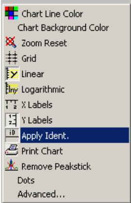

> 🧠 **[Cognis Multimodal Enrichment]**
> * **Classification:** Scientific Figure
> * **Extracted Text (OCR):** `Chart Line Color, Chart Background Color, Zoom Reset, Grid, Linear, Logarithmic, X Labels, Y Labels, Apply Ident., Print Chart, Remove Peakstick, Dots, Advanced...`
> * **VLM Visual Summary:** ### FIGURE TYPE:
>   Software Interface Screenshot
>   
>   ### SCIENTIFIC PURPOSE:
>   The figure illustrates a software interface used for configuring and analyzing data from a powder diffraction experiment. Specifically, it shows how to apply a sample identification to the top axis of a chart, which is likely used for displaying the results of the powder diffraction measurement.
>   
>   ### KEY KNOWLEDGE:
>   1. **Sample Identification**: The ability to apply a sample identification to the top axis of a chart helps in identifying the sample being analyzed.
>   2. **Chart Configuration**: The interface allows users to customize the chart settings, including line color, background color, grid, and axis labels.
>   3. **Data Display Options**: Users can choose between linear and logarithmic scales, and display data as dots or connected lines.
>   4. **Advanced Options**: The advanced options provide more detailed customization, such as saving the chart data as different formats like Text, XML, HTML, or Excel.
>   
>   ### LABEL INTERPRETATION:
>   - **Apply Ident.**: Applies the sample identification to the top axis of the chart.
>   - **Print Chart**: Prints the current chart configuration.
>   - **Remove Peakstick**: Removes peaksticks from the chart.
>   - **Dots**: Displays the scan data as small dots instead of connected lines.
>   - **Advanced**: Shows advanced customized options for the chart area.
>   
>   ### ENGINEERING/SCIENTIFIC INSIGHTS:
>   - **Data Analysis**: Understanding how to configure and analyze data effectively in powder diffraction experiments.
>   - **Customization**: The ability to tailor the presentation of experimental data to meet specific analytical needs.
>   
>   ### USER-RELEVANT INFORMATION:
>   - The figure provides detailed instructions on how to apply sample identification to the top axis of a chart, which is crucial for interpreting the results of a powder diffraction measurement.
>   - The advanced options offer flexibility in how the data is displayed, allowing for better visualization and analysis of the experimental outcomes.
> * **Figure Caption:** 1) Save the measured data as a RAW data file to your folder on the hard drive. XRD Commander displays the Save As dialog box, and you must enter the RAW filename. The RAW data file can later be examined (e. g., with EVA). | [Section: Bruker D8 Discover XRD User’s Guide I. Powder Diffraction Measurement using LynxEye Detector > 7. After the scan is complete]
> * **Surrounding Context (+/- 300 words):**
>   * **[Before]:** *... the sample identification on the top axis) • Print Chart • Remove Peakstick • Dots (shows the scan data as little dots instead of connected lines) • Advanced (shows advanced customized options for the chart area such as Save the chart data as a Text, XML, HTML, or Excel file). ...* [Section: Bruker D8 Discover XRD User’s Guide I. Powder Diffraction Measurement using LynxEye Detector > 2) Activate the Adjust page] i. Open the Video program by clicking the video icon, , and start live view. ii. In XRD Commander window, click Direct Mode icon, to enter direct laser control mode. iii. In Direct Command window, type RC1 and press Enter to activate the direct laser control mode. iv. Type OC16,1 to turn the laser on. v. Close the Direct Command window. vi. Input a specific Z position and click the drive to icon, to adjust the Z drive to center the laser spot at the crosshair. vii. Open the Direct Command window again, and type OC16,0 to turn off the laser. viii. In Video program, stop Grab the live video. 3) Select measurement parameters: a. scan type: Locked Coupled, continuous scan. b. start: >3.5º , stop: <100º , scanspeed: 0.40 Sec/Step, and increment: 0.04º . c. slit size: 0.2 mm; high voltage: 40 kV, current: 40 mA. 4) Click Start button, to begin a measurement. 5) Click Stop button, to end the immediate measurement. [Section: Bruker D8 Discover XRD User’s Guide I. Powder Diffraction Measurement using LynxEye Detector > 7. After the scan is complete] 1) Save the measured data as a RAW data file to your folder on the hard drive. XRD Commander displays the Save As dialog box, and you must enter the RAW filename. The RAW data file can later be examined (e. g., with EVA).*
>   * **[After]:** *[Section: Bruker D8 Discover XRD User’s Guide I. Powder Diffraction Measurement using LynxEye Detector > 7. After the scan is complete] > 🧠 **[Cognis Multimodal Enrichment]** > * **Classification:** Scientific Figure > * **Extracted Text (OCR):** `Chart Line Color, Chart Background Color, Zoom Reset, Grid, Linear, Logarithmic, X Labels, Y Labels, Apply Ident., Print Chart, Remove Peakstick, Dots, Advanced...` > * **VLM Visual Summary:** ### FIGURE TYPE: > Software Interface Screenshot > > ### SCIENTIFIC PURPOSE: > The figure illustrates a software interface used for configuring and analyzing data from a powder diffraction experiment. Specifically, it shows how to apply a sample identification to the top axis of a chart, which is likely used for displaying the results of the powder diffraction measurement. > > ### KEY KNOWLEDGE: > 1. **Sample Identification**: The ability to apply a sample identification to the top axis of a chart helps in identifying the sample being analyzed. > 2. **Chart Configuration**: The interface allows users to customize the chart settings, including line color, background color, grid, and axis labels. > 3. **Data Display Options**: Users can choose between linear and logarithmic scales, and display data as dots or connected lines. > 4. **Advanced Options**: The advanced options provide more detailed customization, such as saving the chart data as different formats like Text, XML, HTML, or Excel. > > ### LABEL INTERPRETATION: > - **Apply Ident.**: Applies the sample identification to the top axis of the chart. > - **Print Chart**: Prints the current chart configuration. > - **Remove Peakstick**: Removes peaksticks from the chart. > - **Dots**: Displays the scan data as small dots instead of connected lines. > - **Advanced**: Shows advanced customized options for the chart area. > > ### ENGINEERING/SCIENTIFIC INSIGHTS: > - **Data Analysis**: Understanding how to configure and analyze ...*

> 🧠 **[Cognis Multimodal Enrichment]**
> * **Classification:** Scientific Figure
> * **Extracted Text (OCR):** `Chart Line Color, Chart Background Color, Zoom Reset, Grid, Linear, Logarithmic, X Labels, Y Labels, Apply Ident., Print Chart, Remove Peakstick, Dots, Advanced...`
> * **VLM Visual Summary:** ### FIGURE TYPE:
>   Software Interface Screenshot
>   
>   ### SCIENTIFIC PURPOSE:
>   The figure illustrates a software interface used for configuring and analyzing data from a powder diffraction experiment. Specifically, it shows how to apply a sample identification to the top axis of a chart, which is likely used for displaying the results of the powder diffraction measurement.
>   
>   ### KEY KNOWLEDGE:
>   1. **Sample Identification**: The ability to apply a sample identification to the top axis of a chart helps in identifying the sample being analyzed.
>   2. **Chart Configuration**: The interface allows users to customize the chart settings, including line color, background color, grid, and axis labels.
>   3. **Data Display Options**: Users can choose between linear and logarithmic scales, and display data as dots or connected lines.
>   4. **Advanced Options**: The advanced options provide more detailed customization, such as saving the chart data as different formats like Text, XML, HTML, or Excel.
>   
>   ### LABEL INTERPRETATION:
>   - **Apply Ident.**: Applies the sample identification to the top axis of the chart.
>   - **Print Chart**: Prints the current chart configuration.
>   - **Remove Peakstick**: Removes peaksticks from the chart.
>   - **Dots**: Displays the scan data as small dots instead of connected lines.
>   - **Advanced**: Shows advanced customized options for the chart area.
>   
>   ### ENGINEERING/SCIENTIFIC INSIGHTS:
>   - **Data Analysis**: Understanding how to configure and analyze powder diffraction data is crucial for interpreting the results accurately.
>   - **Customization**: The ability to customize the chart settings allows for better visualization of the data according to specific needs.
>   
>   ### USER-RELEVANT INFORMATION:
>   - **Sample Identification**: This feature is essential for distinguishing between different samples in a powder diffraction experiment.
>   - **Chart Configuration**: Configuring the chart settings ensures that the data is presented clearly and effectively.
>   - **Data Display Options**: Choosing between linear and logarithmic scales and displaying data as dots or connected lines can significantly affect how the data is perceived and interpreted.
>   - **Advanced Options**: These options provide flexibility in how the data is saved and exported, which is useful for further analysis or sharing the data with others.
> * **Figure Caption:** 1) Save the measured data as a RAW data file to your folder on the hard drive. XRD Commander displays the Save As dialog box, and you must enter the RAW filename. The RAW data file can later be examined (e. g., with EVA). | Note: by clicking the right mouse button inside the Chart area, you will bring a popup menu:
> * **Surrounding Context (+/- 300 words):**
>   * **[Before]:** *... the Adjust page] a. Make sure that for each drive its actual position is shown in blue. If any of the drive positions are displayed in dark red, you will not be able to use the D8 — ask for help. b. Set the X-ray generator voltage to 40 kV and the current to 40mA or other your desired combination. c. Find zero position of the Z drive for your sample: i. Open the Video program by clicking the video icon, , and start live view. ii. In XRD Commander window, click Direct Mode icon, to enter direct laser control mode. iii. In Direct Command window, type RC1 and press Enter to activate the direct laser control mode. iv. Type OC16,1 to turn the laser on. v. Close the Direct Command window. vi. Input a specific Z position and click the drive to icon, to adjust the Z drive to center the laser spot at the crosshair. vii. Open the Direct Command window again, and type OC16,0 to turn off the laser. viii. In Video program, stop Grab the live video. 3) Select measurement parameters: a. scan type: Locked Coupled, continuous scan. b. start: >3.5º , stop: <100º , scanspeed: 0.40 Sec/Step, and increment: 0.04º . c. slit size: 0.2 mm; high voltage: 40 kV, current: 40 mA. 4) Click Start button, to begin a measurement. 5) Click Stop button, to end the immediate measurement. [Section: Bruker D8 Discover XRD User’s Guide I. Powder Diffraction Measurement using LynxEye Detector > 7. After the scan is complete] 1) Save the measured data as a RAW data file to your folder on the hard drive. XRD Commander displays the Save As dialog box, and you must enter the RAW filename. The RAW data file can later be examined (e. g., with EVA).*
>   * **[After]:** *Note: by clicking the right mouse button inside the Chart area, you will bring a popup menu: • Apply Ident (applies the sample identification on the top axis) • Print Chart • Remove Peakstick • Dots (shows the scan data as little dots instead of connected lines) • Advanced (shows advanced customized options for the chart area such as Save the chart data as a Text, XML, HTML, or Excel file). Export→Data→Excel→Save As to your folder on the hard drive. 2) Set the X-ray tube voltage to 20 kV, current to 5mA 3) Minimize XRD Commander. Do not close the program. [Section: Bruker D8 Discover XRD User’s Guide I. Powder Diffraction Measurement using LynxEye Detector > II. Diffraction Evaluation using DIFFRACplus BASIC Evaluation] 1. Double click the evaluation program icon, to open the EVA program. 2. Creating EVA Documents a. On the toolbar, click the Import button. b. Locate the data .RAW file you want to import in the directory of your RAW files. c. Click Open. 3. Working with Scans a. Performing a Background Subtraction i. The DIFFRAC traditional method: prepare data for search/match. 1) Click the Background button on the Data Treatment palette 2) Use the slider to adjust the curvature if there are background humps. 3) Select the Subtract from Scan check box. 4) Click Append to append the background-subtracted scan data to the document ii. An enhanced method: gives a smooth curve. iii. A Bézier method: allows you to draw the background exactly the way you want. 1) Draw a calculated background with the method above; get as close as you can to the background you intend to draw. 2) Check the Bézier box to transform this background into curves. 3) Move the slider to adjust the curve to what you intend to draw. 4) Click ...*

Note: by clicking the right mouse button inside the Chart area, you will bring a popup menu:

• Apply Ident (applies the sample identification on the top axis)

• Print Chart

• Remove Peakstick

• Dots (shows the scan data as little dots instead of connected lines)

• Advanced (shows advanced customized options for the chart area such as Save the chart data as a Text, XML, HTML, or Excel file).

Export→Data→Excel→Save As to your folder on the hard drive.

2) Set the X-ray tube voltage to 20 kV, current to 5mA

3) Minimize XRD Commander. Do not close the program.

## II. Diffraction Evaluation using DIFFRACplus BASIC Evaluation

1. Double click the evaluation program icon, to open the EVA program.

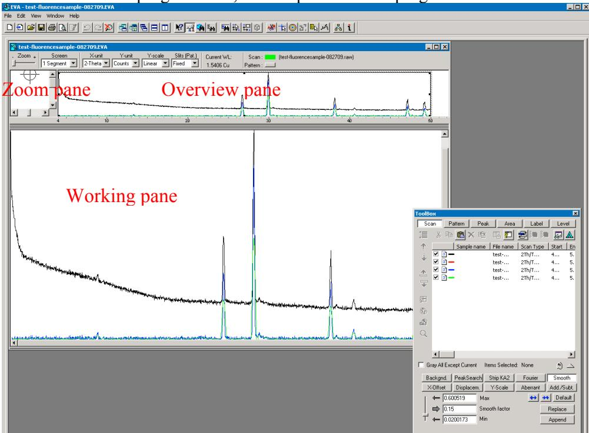

> 🧠 **[Cognis Multimodal Enrichment]**
> * **Classification:** Scientific Figure
> * **Extracted Text (OCR):** `test-fluorescensample-082709.EVA, Zoom pane, Overview pane, Working pane, test..., 2TH/T..., 4...5., test..., 2TH/T..., 4...5., test..., 2TH/T..., 4...5., test..., 2TH/T..., 4...5., Background, Peak-Search, Strp KA2, Fourier, Smooth, X-Offset, Displacement, Y-Scale,`
> * **VLM Visual Summary:** ### FIGURE TYPE:
>   Software Interface Screenshot
>   
>   ### SCIENTIFIC PURPOSE:
>   The figure shows the interface of a software program used for diffraction data analysis, specifically focusing on the evaluation of powder diffraction patterns.
>   
>   ### KEY KNOWLEDGE:
>   1. **Diffraction Pattern**: The figure displays a diffraction pattern, which is a plot of scattering intensity versus Bragg angle (2θ).
>   2. **Overview Pane**: This pane provides an overview of the entire diffraction pattern, showing the general trend and peak positions.
>   3. **Zoom Pane**: This pane zooms in on specific regions of the diffraction pattern, allowing for detailed examination of individual peaks.
>   4. **Working Pane**: This pane shows the detailed data points and peaks, providing precise measurements and calculations.
>   5. **Scan Parameters**: The scan parameters include scan type, start angle, stop angle, scan speed, and slit size.
>   6. **Background Subtraction**: The software offers different methods for background subtraction, including traditional, enhanced, and Bézier methods.
>   7. **Peak Search**: The software allows for automatic peak detection and searching for peaks in the diffraction pattern.
>   8. **Peak Identification**: The software can identify peaks based on their characteristics and provide a DIF pattern for further analysis.
>   
>   ### LABEL INTERPRETATION:
>   - **Overview Pane**: General view of the diffraction pattern.
>   - **Zoom Pane**: Zoomed-in view of specific regions of the diffraction pattern.
>   - **Working Pane**: Detailed data points and peaks.
>   
>   ### ENGINEERING/SCIENTIFIC INSIGHTS:
>   A reader should learn that the software interface shown in the figure is designed for analyzing powder diffraction patterns. It provides tools for evaluating the diffraction data, including methods for background subtraction, peak search, and identification. The interface allows for detailed examination of the diffraction pattern at various levels of magnification, from broad trends to fine details.
>   
>   ### USER-RELEVANT INFORMATION:
>   The information provided by this figure includes the scan parameters, background subtraction methods, and peak identification capabilities. These features are crucial for understanding the diffraction pattern and performing further analysis or research.
> * **Figure Caption:** 1. Double click the evaluation program icon, to open the EVA program. | [Section: Bruker D8 Discover XRD User’s Guide I. Powder Diffraction Measurement using LynxEye Detector > II. Diffraction Evaluation using DIFFRACplus BASIC Evaluation]
> * **Surrounding Context (+/- 300 words):**
>   * **[Before]:** *... in the directory of your RAW files. c. Click Open. 3. Working with Scans a. Performing a Background Subtraction i. The DIFFRAC traditional method: prepare data for search/match. 1) Click the Background button on the Data Treatment palette 2) Use the slider to adjust the curvature if there are background humps. 3) Select the Subtract from Scan check box. 4) Click Append to append the background-subtracted scan data to the document ii. An enhanced method: gives a smooth curve. iii. A Bézier method: allows you to draw the background exactly the way you want. 1) Draw a calculated background with the method above; get as close as you can to the background you intend to draw. 2) Check the Bézier box to transform this background into curves. 3) Move the slider to adjust the curve to what you intend to draw. 4) Click ...* [Section: Bruker D8 Discover XRD User’s Guide I. Powder Diffraction Measurement using LynxEye Detector > 7. After the scan is complete] Note: by clicking the right mouse button inside the Chart area, you will bring a popup menu: • Apply Ident (applies the sample identification on the top axis) • Print Chart • Remove Peakstick • Dots (shows the scan data as little dots instead of connected lines) • Advanced (shows advanced customized options for the chart area such as Save the chart data as a Text, XML, HTML, or Excel file). Export→Data→Excel→Save As to your folder on the hard drive. 2) Set the X-ray tube voltage to 20 kV, current to 5mA 3) Minimize XRD Commander. Do not close the program. [Section: Bruker D8 Discover XRD User’s Guide I. Powder Diffraction Measurement using LynxEye Detector > II. Diffraction Evaluation using DIFFRACplus BASIC Evaluation] 1. Double click the evaluation program icon, to open the EVA program.*
>   * **[After]:** *[Section: Bruker D8 Discover XRD User’s Guide I. Powder Diffraction Measurement using LynxEye Detector > II. Diffraction Evaluation using DIFFRACplus BASIC Evaluation] > 🧠 **[Cognis Multimodal Enrichment]** > * **Classification:** Scientific Figure > * **Extracted Text (OCR):** `test-fluorescensample-082709.EVA, Zoom pane, Overview pane, Working pane, test..., 2TH/T..., 4...5., test..., 2TH/T..., 4...5., test..., 2TH/T..., 4...5., test..., 2TH/T..., 4...5., Background, Peak-Search, Strp KA2, Fourier, Smooth, X-Offset, Displacement, Y-Scale,` > * **VLM Visual Summary:** ### FIGURE TYPE: > Software Interface Screenshot > > ### SCIENTIFIC PURPOSE: > The figure shows the interface of a software program used for diffraction data analysis, specifically focusing on the evaluation of powder diffraction patterns. > > ### KEY KNOWLEDGE: > 1. **Diffraction Pattern**: The figure displays a diffraction pattern, which is a plot of scattering intensity versus Bragg angle (2θ). > 2. **Overview Pane**: This pane provides an overview of the entire diffraction pattern, showing the general trend and peak positions. > 3. **Zoom Pane**: This pane zooms in on specific regions of the diffraction pattern, allowing for detailed examination of individual peaks. > 4. **Working Pane**: This pane shows the detailed data points and peaks, providing precise measurements and calculations. > 5. **Scan Parameters**: The scan parameters include scan type, start angle, stop angle, scan speed, and slit size. > 6. **Background Subtraction**: The software offers different methods for background subtraction, including traditional, enhanced, and Bézier methods. > 7. **Peak Search**: The software allows for automatic peak detection and searching for peaks in the diffraction pattern. > 8. **Peak Identification**: The software can identify peaks based on their characteristics and provide a DIF pattern for further analysis. > > ### LABEL INTERPRETATION: > - **Overview Pane**: General view of the diffraction pattern. > - **Zoom Pane**: Zoomed-in view of specific regions of the diffraction pattern. > - ...*

> 🧠 **[Cognis Multimodal Enrichment]**
> * **Classification:** Scientific Figure
> * **Extracted Text (OCR):** `test-fluorescensample-082709.EVA, Zoom pane, Overview pane, Working pane, test..., 2TH/T..., 4...5., test..., 2TH/T..., 4...5., test..., 2TH/T..., 4...5., test..., 2TH/T..., 4...5., Background, Peak-Search, Strp KA2, Fourier, Smooth, X-Offset, Displacement, Y-Scale,`
> * **VLM Visual Summary:** ### FIGURE TYPE:
>   Software Interface Screenshot
>   
>   ### SCIENTIFIC PURPOSE:
>   The figure shows the interface of a software program used for diffraction data analysis, specifically focusing on the evaluation of powder diffraction patterns.
>   
>   ### KEY KNOWLEDGE:
>   1. **Diffraction Pattern**: The figure displays a diffraction pattern, which is a plot of scattering intensity versus Bragg angle (2θ).
>   2. **Overview Pane**: This pane provides an overview of the entire diffraction pattern, showing the general trend and peak positions.
>   3. **Zoom Pane**: This pane zooms in on specific regions of the diffraction pattern, allowing for detailed examination of individual peaks.
>   4. **Working Pane**: This pane shows the detailed data points and peaks, providing precise measurements and calculations.
>   5. **Scan Parameters**: The scan parameters include scan type, start angle, stop angle, scan speed, and slit size.
>   6. **Background Subtraction**: The software offers different methods for background subtraction, including traditional, enhanced, and Bézier methods.
>   7. **Peak Search**: The software allows for automatic peak detection and searching for peaks in the diffraction pattern.
>   8. **Peak Identification**: The software can identify peaks based on their characteristics and provide a DIF pattern for further analysis.
>   
>   ### LABEL INTERPRETATION:
>   - **Overview Pane**: General view of the diffraction pattern.
>   - **Zoom Pane**: Zoomed-in view of specific regions of the diffraction pattern.
>   - **Working Pane**: Detailed data points and peaks with precise measurements.
>   - **Scan Parameters**: Parameters used during the scan process.
>   - **Background Subtraction Methods**: Different techniques for subtracting the background from the diffraction pattern.
>   - **Peak Search**: Method for finding peaks in the diffraction pattern.
>   - **Peak Identification**: Process for identifying peaks based on their characteristics.
>   
>   ### ENGINEERING/SCIENTIFIC INSIGHTS:
>   - **Understanding Diffraction Patterns**: The figure helps users understand how to interpret diffraction patterns, which are crucial for identifying materials and determining their crystalline structure.
>   - **Data Analysis Techniques**: The software provides various tools for analyzing diffraction data, including background subtraction and peak identification, which are essential for accurate material characterization.
>   
>   ### USER-RELEVANT INFORMATION:
>   - **Scan Parameters**: These settings are crucial for obtaining accurate diffraction data, ensuring that the scan covers the correct range and speed.
>   - **Background Subtraction Methods**: Choosing the appropriate method can significantly improve the quality of the diffraction pattern
> * **Figure Caption:** 1. Double click the evaluation program icon, to open the EVA program. | 2. Creating EVA Documents
> * **Surrounding Context (+/- 300 words):**
>   * **[Before]:** *... specific Z position and click the drive to icon, to adjust the Z drive to center the laser spot at the crosshair. vii. Open the Direct Command window again, and type OC16,0 to turn off the laser. viii. In Video program, stop Grab the live video. 3) Select measurement parameters: a. scan type: Locked Coupled, continuous scan. b. start: >3.5º , stop: <100º , scanspeed: 0.40 Sec/Step, and increment: 0.04º . c. slit size: 0.2 mm; high voltage: 40 kV, current: 40 mA. 4) Click Start button, to begin a measurement. 5) Click Stop button, to end the immediate measurement. [Section: Bruker D8 Discover XRD User’s Guide I. Powder Diffraction Measurement using LynxEye Detector > 7. After the scan is complete] 1) Save the measured data as a RAW data file to your folder on the hard drive. XRD Commander displays the Save As dialog box, and you must enter the RAW filename. The RAW data file can later be examined (e. g., with EVA). Note: by clicking the right mouse button inside the Chart area, you will bring a popup menu: • Apply Ident (applies the sample identification on the top axis) • Print Chart • Remove Peakstick • Dots (shows the scan data as little dots instead of connected lines) • Advanced (shows advanced customized options for the chart area such as Save the chart data as a Text, XML, HTML, or Excel file). Export→Data→Excel→Save As to your folder on the hard drive. 2) Set the X-ray tube voltage to 20 kV, current to 5mA 3) Minimize XRD Commander. Do not close the program. [Section: Bruker D8 Discover XRD User’s Guide I. Powder Diffraction Measurement using LynxEye Detector > II. Diffraction Evaluation using DIFFRACplus BASIC Evaluation] 1. Double click the evaluation program icon, to open the EVA program.*
>   * **[After]:** *2. Creating EVA Documents a. On the toolbar, click the Import button. b. Locate the data .RAW file you want to import in the directory of your RAW files. c. Click Open. 3. Working with Scans a. Performing a Background Subtraction i. The DIFFRAC traditional method: prepare data for search/match. 1) Click the Background button on the Data Treatment palette 2) Use the slider to adjust the curvature if there are background humps. 3) Select the Subtract from Scan check box. 4) Click Append to append the background-subtracted scan data to the document ii. An enhanced method: gives a smooth curve. iii. A Bézier method: allows you to draw the background exactly the way you want. 1) Draw a calculated background with the method above; get as close as you can to the background you intend to draw. 2) Check the Bézier box to transform this background into curves. 3) Move the slider to adjust the curve to what you intend to draw. 4) Click Edit button to display all the control points: the passing points are disks, the tangent points are squares, and the tangent vectors are in dashed lines. You can move, erase, or add a passing point. 5) Check the Subtract box and then click on Append to create your drawn background. b. Performing a Peak Search i. On the Data Treatment palette click the Peak Search button. [Section: Bruker D8 Discover XRD User’s Guide I. Powder Diffraction Measurement using LynxEye Detector > II. Diffraction Evaluation using DIFFRACplus BASIC Evaluation] ii. Move the slider to see ghost peaks in the Overview and Working panes. iii. When no manual editing is required, click Make DIF to transfer the found peaks to a DIF pattern. iv. When manual editing is required, click Append To List. c. Computing $\mathrm { ...*

2. Creating EVA Documents

a. On the toolbar, click the Import button.

b. Locate the data .RAW file you want to import in the directory of your RAW files.

c. Click Open.

3. Working with Scans

a. Performing a Background Subtraction

i. The DIFFRAC traditional method: prepare data for search/match.

1) Click the Background button on the Data Treatment palette

2) Use the slider to adjust the curvature if there are background humps.

3) Select the Subtract from Scan check box.

4) Click Append to append the background-subtracted scan data to the document ii. An enhanced method: gives a smooth curve.

iii. A Bézier method: allows you to draw the background exactly the way you want.

1) Draw a calculated background with the method above; get as close as you can to the background you intend to draw.

2) Check the Bézier box to transform this background into curves.

3) Move the slider to adjust the curve to what you intend to draw.

4) Click Edit button to display all the control points: the passing points are disks, the tangent points are squares, and the tangent vectors are in dashed lines. You can move, erase, or add a passing point.

5) Check the Subtract box and then click on Append to create your drawn background.

b. Performing a Peak Search

i. On the Data Treatment palette click the Peak Search button.

ii. Move the slider to see ghost peaks in the Overview and Working panes.

iii. When no manual editing is required, click Make DIF to transfer the found peaks to a DIF pattern.

iv. When manual editing is required, click Append To List.

c. Computing $\mathrm { K } _ { \alpha ^ { 2 } }$ Stripping

i. Click the Strip $\mathbf { K } _ { \alpha 2 }$ button on the Data Treatment palette.

ii. Use the slider to adjust the Intensity Ratio.

iii. Click Append to append the $\mathrm { K } _ { \alpha ^ { 2 } }$ subtracted scan to the document

d. Smoothing Scans

i. Click the Smooth button on the Data Treatment palette.

ii. Use the slider to adjust the Smooth factor.

iii. Click Append to append the smoothed scan to the document

e. Fourier Smoothing and Expansion

i. Click the Fourier button on the Data Treatment palette.

ii. In the Fourier treatment control panel, select the expansion (x1, x2, x4, x8, and x16).

iii. Use the slider to adjust the cutoff.

iv. Click Append to append the smoothed scan to the document.

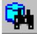

> 🧠 **[Cognis Multimodal Enrichment]**
> * **Classification:** Scientific Figure
> * **VLM Visual Summary:** ### FIGURE TYPE:
>   Procedure Illustration
>   
>   ### SCIENTIFIC PURPOSE:
>   The figure illustrates the steps involved in appending a smoothed scan to a document using a software interface.
>   
>   ### KEY KNOWLEDGE:
>   1. **Appending Scans**: The process involves clicking the "Append" button to add the smoothed scan to the document.
>   2. **Smooth Factor Adjustment**: The slider allows adjustment of the smooth factor before appending the smoothed scan.
>   3. **Document Creation**: The document creation process includes moving sliders, adjusting curves, and adding control points.
>   4. **Data Treatment Palette**: The Data Treatment palette provides tools for performing various data treatments such as peak searching, computing $\mathrm{K}_{\alpha^2}$ stripping, and Fourier smoothing and expansion.
>   5. **General Procedure**: The general procedure for EVA Search/Match involves using the Scroll List mode to match scans and identifying reference patterns.
>   
>   ### LABEL INTERPRETATION:
>   - **Append Button**: Used to append the smoothed scan to the document.
>   - **Smooth Factor Slider**: Adjusts the smooth factor before appending the smoothed scan.
>   - **Document Creation Controls**: Includes moving sliders, adjusting curves, and adding control points.
>   - **Data Treatment Palette**: Contains buttons for performing various data treatments.
>   
>   ### ENGINEERING/SCIENTIFIC INSIGHTS:
>   A reader should learn how to append a smoothed scan to a document using a software interface, understand the importance of adjusting the smooth factor, and recognize the different controls available for document creation and data treatment.
>   
>   ### USER-RELEVANT INFORMATION:
>   - The specific steps for appending a smoothed scan.
>   - The importance of adjusting the smooth factor.
>   - The different controls available for document creation and data treatment.
> * **Figure Caption:** iv. Click Append to append the smoothed scan to the document. | [Section: Bruker D8 Discover XRD User’s Guide I. Powder Diffraction Measurement using LynxEye Detector > II. Diffraction Evaluation using DIFFRACplus BASIC Evaluation]
> * **Surrounding Context (+/- 300 words):**
>   * **[Before]:** *... this background into curves. 3) Move the slider to adjust the curve to what you intend to draw. 4) Click Edit button to display all the control points: the passing points are disks, the tangent points are squares, and the tangent vectors are in dashed lines. You can move, erase, or add a passing point. 5) Check the Subtract box and then click on Append to create your drawn background. b. Performing a Peak Search i. On the Data Treatment palette click the Peak Search button. ii. Move the slider to see ghost peaks in the Overview and Working panes. [Section: Bruker D8 Discover XRD User’s Guide I. Powder Diffraction Measurement using LynxEye Detector > II. Diffraction Evaluation using DIFFRACplus BASIC Evaluation] iii. When no manual editing is required, click Make DIF to transfer the found peaks to a DIF pattern. iv. When manual editing is required, click Append To List. c. Computing $\mathrm { K } _ { \alpha ^ { 2 } }$ Stripping i. Click the Strip $\mathbf { K } _ { \alpha 2 }$ button on the Data Treatment palette. ii. Use the slider to adjust the Intensity Ratio. iii. Click Append to append the $\mathrm { K } _ { \alpha ^ { 2 } }$ subtracted scan to the document d. Smoothing Scans i. Click the Smooth button on the Data Treatment palette. ii. Use the slider to adjust the Smooth factor. iii. Click Append to append the smoothed scan to the document e. Fourier Smoothing and Expansion i. Click the Fourier button on the Data Treatment palette. ii. In the Fourier treatment control panel, select the expansion (x1, x2, x4, x8, and x16). iii. Use the slider to adjust the cutoff. iv. Click Append to append the smoothed scan to the document.*
>   * **[After]:** *[Section: Bruker D8 Discover XRD User’s Guide I. Powder Diffraction Measurement using LynxEye Detector > II. Diffraction Evaluation using DIFFRACplus BASIC Evaluation] > 🧠 **[Cognis Multimodal Enrichment]** > * **Classification:** Scientific Figure > * **VLM Visual Summary:** ### FIGURE TYPE: > **Procedure Illustration** > > ### SCIENTIFIC PURPOSE: > The figure illustrates the steps involved in appending a smoothed scan to a document using a software interface. > > ### KEY KNOWLEDGE: > 1. **Appending Scans**: The process involves clicking the "Append" button to add the smoothed scan to the document. > 2. **Smooth Factor Adjustment**: The slider allows adjustment of the smooth factor before appending the smoothed scan. > 3. **Document Creation**: The document creation process includes moving sliders, adjusting curves, and adding control points. > 4. **Data Treatment Palette**: The Data Treatment palette provides tools for performing various data treatments such as peak searching, computing $\mathrm{K}_{\alpha^2}$ stripping, and Fourier smoothing and expansion. > 5. **General Procedure**: The general procedure for EVA Search/Match involves using the Scroll List mode to match scans and identifying reference patterns. > > ### LABEL INTERPRETATION: > - **Append Button**: Used to append the smoothed scan to the document. > - **Smooth Factor Slider**: Adjusts the smooth factor before appending the smoothed scan. > - **Document Creation Controls**: Includes moving sliders, adjusting curves, and adding control points. > - **Data Treatment Palette**: Contains buttons for performing various data treatments. > > ### ENGINEERING/SCIENTIFIC INSIGHTS: > A reader should learn how to append a smoothed scan to a document using a software interface, understand the importance of adjusting the smooth factor, and recognize the different controls available for document creation and data treatment. > > ### USER-RELEVANT INFORMATION: > - The specific steps for appending a smoothed scan. > - The importance of adjusting the ...*

> 🧠 **[Cognis Multimodal Enrichment]**
> * **Classification:** Scientific Figure
> * **VLM Visual Summary:** ### FIGURE TYPE:
>   **Procedure Illustration**
>   
>   ### SCIENTIFIC PURPOSE:
>   The figure illustrates the steps involved in appending a smoothed scan to a document using a software interface.
>   
>   ### KEY KNOWLEDGE:
>   1. **Appending Scans**: The process involves clicking the "Append" button to add the smoothed scan to the document.
>   2. **Smooth Factor Adjustment**: The slider allows adjustment of the smooth factor before appending the smoothed scan.
>   3. **Document Creation**: The document creation process includes moving sliders, adjusting curves, and adding control points.
>   4. **Data Treatment Palette**: The Data Treatment palette provides tools for performing various data treatments such as peak searching, computing $\mathrm{K}_{\alpha^2}$ stripping, and Fourier smoothing and expansion.
>   5. **General Procedure**: The general procedure for EVA Search/Match involves using the Scroll List mode to match scans and identifying reference patterns.
>   
>   ### LABEL INTERPRETATION:
>   - **Append Button**: Used to append the smoothed scan to the document.
>   - **Smooth Factor Slider**: Adjusts the smooth factor before appending the smoothed scan.
>   - **Document Creation Controls**: Includes moving sliders, adjusting curves, and adding control points.
>   - **Data Treatment Palette**: Contains buttons for performing various data treatments.
>   
>   ### ENGINEERING/SCIENTIFIC INSIGHTS:
>   A reader should learn how to append a smoothed scan to a document using a software interface, understand the importance of adjusting the smooth factor, and recognize the different controls available for document creation and data treatment.
>   
>   ### USER-RELEVANT INFORMATION:
>   - The specific steps for appending a smoothed scan.
>   - The importance of adjusting the smooth factor before appending.
>   - The controls available for document creation and data treatment.
> * **Figure Caption:** iv. Click Append to append the smoothed scan to the document. | 4. Search/Match: (\*\* see the next page for a general procedure.)
> * **Surrounding Context (+/- 300 words):**
>   * **[Before]:** *... this background into curves. 3) Move the slider to adjust the curve to what you intend to draw. 4) Click Edit button to display all the control points: the passing points are disks, the tangent points are squares, and the tangent vectors are in dashed lines. You can move, erase, or add a passing point. 5) Check the Subtract box and then click on Append to create your drawn background. b. Performing a Peak Search i. On the Data Treatment palette click the Peak Search button. [Section: Bruker D8 Discover XRD User’s Guide I. Powder Diffraction Measurement using LynxEye Detector > II. Diffraction Evaluation using DIFFRACplus BASIC Evaluation] ii. Move the slider to see ghost peaks in the Overview and Working panes. iii. When no manual editing is required, click Make DIF to transfer the found peaks to a DIF pattern. iv. When manual editing is required, click Append To List. c. Computing $\mathrm { K } _ { \alpha ^ { 2 } }$ Stripping i. Click the Strip $\mathbf { K } _ { \alpha 2 }$ button on the Data Treatment palette. ii. Use the slider to adjust the Intensity Ratio. iii. Click Append to append the $\mathrm { K } _ { \alpha ^ { 2 } }$ subtracted scan to the document d. Smoothing Scans i. Click the Smooth button on the Data Treatment palette. ii. Use the slider to adjust the Smooth factor. iii. Click Append to append the smoothed scan to the document e. Fourier Smoothing and Expansion i. Click the Fourier button on the Data Treatment palette. ii. In the Fourier treatment control panel, select the expansion (x1, x2, x4, x8, and x16). iii. Use the slider to adjust the cutoff. iv. Click Append to append the smoothed scan to the document.*
>   * **[After]:** *4. Search/Match: (\*\* see the next page for a general procedure.) 5. Saving and Printing in EVA. 6. Export file as ASCII file. a. Export your EVA file as a RAW file; b. Open the RAW File Exchange , or XCH , to convert your RAW and/or processed files to ASCII files. [Section: Bruker D8 Discover XRD User’s Guide I. Powder Diffraction Measurement using LynxEye Detector > II. Diffraction Evaluation using DIFFRACplus BASIC Evaluation] 7. Exit EVA after you complete data processing. 8. Sign off the instrument by filling in the log-book. \*\* The purpose of EVA Search/Match is to search the current scan of an unknown material and then identify reference patterns that are likely to explain the unknown scan. The general procedure for EVA Search/Match is as follows: Use the Scroll List mode to match the scan ...*

4. Search/Match: (\*\* see the next page for a general procedure.)

5. Saving and Printing in EVA.

6. Export file as ASCII file.

a. Export your EVA file as a RAW file;

b. Open the RAW File Exchange , or XCH , to convert your RAW and/or processed files to ASCII files.

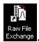

> 🧠 **[Cognis Multimodal Enrichment]**
> * **Classification:** Scientific Figure
> * **Extracted Text (OCR):** `Raw File Exchange`
> * **VLM Visual Summary:** ### FIGURE TYPE:
>   Software Interface Screenshot
>   
>   ### SCIENTIFIC PURPOSE:
>   This figure illustrates the interface of a software tool used for converting raw and processed files to ASCII format, specifically within the context of powder diffraction measurement using a LynxEye detector.
>   
>   ### KEY KNOWLEDGE:
>   1. **RAW File Exchange (XCH):** This is the software tool mentioned in the figure caption, which allows users to convert their raw and processed files into ASCII format.
>   2. **Diffraction Measurement:** The software is designed for use with the LynxEye detector, which is commonly used in powder diffraction measurements.
>   3. **Data Conversion:** The process involves converting raw data into ASCII format, which is necessary for further analysis and interpretation of the diffraction patterns.
>   
>   ### LABEL INTERPRETATION:
>   - **Open the RAW File Exchange, or XCH:** This is the main function of the software tool.
>   - **Convert your RAW and/or processed files to ASCII files:** This indicates the specific action the software performs, which is converting raw and processed files into ASCII format.
>   
>   ### ENGINEERING/SCIENTIFIC INSIGHTS:
>   A reader should learn that this software tool is essential for converting raw diffraction data into a format that can be easily analyzed and interpreted using other software tools like DIFFRACplus BASIC Evaluation. This conversion is crucial for maintaining consistency in data handling across different software applications.
>   
>   ### USER-RELEVANT INFORMATION:
>   The information provided in the figure helps answer future questions related to the conversion of raw diffraction data into ASCII format, which is necessary for advanced analysis.
> * **Figure Caption:** b. Open the RAW File Exchange , or XCH , to convert your RAW and/or processed files to ASCII files. | [Section: Bruker D8 Discover XRD User’s Guide I. Powder Diffraction Measurement using LynxEye Detector > II. Diffraction Evaluation using DIFFRACplus BASIC Evaluation]
> * **Surrounding Context (+/- 300 words):**
>   * **[Before]:** *... d. Smoothing Scans i. Click the Smooth button on the Data Treatment palette. ii. Use the slider to adjust the Smooth factor. iii. Click Append to append the smoothed scan to the document e. Fourier Smoothing and Expansion i. Click the Fourier button on the Data Treatment palette. ii. In the Fourier treatment control panel, select the expansion (x1, x2, x4, x8, and x16). iii. Use the slider to adjust the cutoff. iv. Click Append to append the smoothed scan to the document.* > * **[After]:** *4. Search/Match: (\*\* see the next page for a general procedure.) 5. Saving and Printing in EVA. 6. Export file as ASCII file. a. Export your EVA file as a RAW file; b. Open the RAW File Exchange , or XCH , to convert your RAW and/or processed files to ASCII files. [Section: Bruker D8 Discover XRD User’s Guide I. Powder Diffraction Measurement using LynxEye Detector > II. Diffraction Evaluation using DIFFRACplus BASIC Evaluation] 7. Exit EVA after you complete data processing. 8. Sign off the instrument by filling in the log-book. \*\* The purpose of EVA Search/Match is to search the current scan of an unknown material and then identify reference patterns that are likely to explain the unknown scan. The general procedure for EVA Search/Match is as follows: Use the Scroll List mode to match the scan ...* [Section: Bruker D8 Discover XRD User’s Guide I. Powder Diffraction Measurement using LynxEye Detector > II. Diffraction Evaluation using DIFFRACplus BASIC Evaluation] 4. Search/Match: (\*\* see the next page for a general procedure.) 5. Saving and Printing in EVA. 6. Export file as ASCII file. a. Export your EVA file as a RAW file; b. Open the RAW File Exchange , or XCH , to convert your RAW and/or processed files to ASCII files.*
>   * **[After]:** *[Section: Bruker D8 Discover XRD User’s Guide I. Powder Diffraction Measurement using LynxEye Detector > II. Diffraction Evaluation using DIFFRACplus BASIC Evaluation] > 🧠 **[Cognis Multimodal Enrichment]** > * **Classification:** Scientific Figure > * **Extracted Text (OCR):** `Raw File Exchange` > * **VLM Visual Summary:** **FIGURE TYPE:** Software Interface Screenshot > > **SCIENTIFIC PURPOSE:** This figure illustrates the interface of a software tool used for converting raw and processed files to ASCII format, specifically within the context of powder diffraction measurement using a LynxEye detector. > > **KEY KNOWLEDGE:** > 1. **RAW File Exchange (XCH):** This is the software tool mentioned in the figure caption, which allows users to convert their raw and processed files into ASCII format. > 2. **Diffraction Measurement:** The software is designed for use with the LynxEye detector, which is commonly used in powder diffraction measurements. > 3. **Data Conversion:** The process involves converting raw data into ASCII format, which is necessary for further analysis and interpretation of the diffraction patterns. > > **LABEL INTERPRETATION:** > - **Open the RAW File Exchange, or XCH:** This is the main function of the software tool. > - **Convert your RAW and/or processed files to ASCII files:** This indicates the specific action the software performs, which is converting raw and processed files into ASCII format. > > **ENGINEERING/SCIENTIFIC INSIGHTS:** > A reader should learn that this software tool is essential for converting raw diffraction data into a format that can be easily analyzed and interpreted using other software tools like DIFFRACplus BASIC Evaluation. This conversion is crucial for maintaining consistency in data handling across different software applications. > > **USER-RELEVANT INFORMATION:** > The information provided in the figure helps answer future questions related to the conversion of raw diffraction data into ASCII format, which is necessary for advanced analysis ...*

> 🧠 **[Cognis Multimodal Enrichment]**
> * **Classification:** Scientific Figure
> * **Extracted Text (OCR):** `Raw File Exchange`
> * **VLM Visual Summary:** **FIGURE TYPE:** Software Interface Screenshot
>   
>   **SCIENTIFIC PURPOSE:** This figure illustrates the interface of a software tool used for converting raw and processed files to ASCII format, specifically within the context of powder diffraction measurement using a LynxEye detector.
>   
>   **KEY KNOWLEDGE:**
>   1. **RAW File Exchange (XCH):** This is the software tool mentioned in the figure caption, which allows users to convert their raw and processed files into ASCII format.
>   2. **Diffraction Measurement:** The software is designed for use with the LynxEye detector, which is commonly used in powder diffraction measurements.
>   3. **Data Conversion:** The process involves converting raw data into ASCII format, which is necessary for further analysis and interpretation of the diffraction patterns.
>   
>   **LABEL INTERPRETATION:**
>   - **Open the RAW File Exchange, or XCH:** This is the main function of the software tool.
>   - **Convert your RAW and/or processed files to ASCII files:** This indicates the specific action the software performs, which is converting raw and processed files into ASCII format.
>   
>   **ENGINEERING/SCIENTIFIC INSIGHTS:**
>   A reader should learn that this software tool is essential for converting raw diffraction data into a format that can be easily analyzed and interpreted using other software tools like DIFFRACplus BASIC Evaluation. This conversion is crucial for maintaining consistency in data handling across different software applications.
>   
>   **USER-RELEVANT INFORMATION:**
>   The information provided in the figure helps answer future questions related to the conversion of raw diffraction data into ASCII format, which is necessary for advanced analysis and interpretation of powder diffraction patterns.
> * **Figure Caption:** b. Open the RAW File Exchange , or XCH , to convert your RAW and/or processed files to ASCII files. | [Section: Bruker D8 Discover XRD User’s Guide I. Powder Diffraction Measurement using LynxEye Detector > II. Diffraction Evaluation using DIFFRACplus BASIC Evaluation]
> * **Surrounding Context (+/- 300 words):**
>   * **[Before]:** *... a passing point. 5) Check the Subtract box and then click on Append to create your drawn background. b. Performing a Peak Search i. On the Data Treatment palette click the Peak Search button. [Section: Bruker D8 Discover XRD User’s Guide I. Powder Diffraction Measurement using LynxEye Detector > II. Diffraction Evaluation using DIFFRACplus BASIC Evaluation] ii. Move the slider to see ghost peaks in the Overview and Working panes. iii. When no manual editing is required, click Make DIF to transfer the found peaks to a DIF pattern. iv. When manual editing is required, click Append To List. c. Computing $\mathrm { K } _ { \alpha ^ { 2 } }$ Stripping i. Click the Strip $\mathbf { K } _ { \alpha 2 }$ button on the Data Treatment palette. ii. Use the slider to adjust the Intensity Ratio. iii. Click Append to append the $\mathrm { K } _ { \alpha ^ { 2 } }$ subtracted scan to the document d. Smoothing Scans i. Click the Smooth button on the Data Treatment palette. ii. Use the slider to adjust the Smooth factor. iii. Click Append to append the smoothed scan to the document e. Fourier Smoothing and Expansion i. Click the Fourier button on the Data Treatment palette. ii. In the Fourier treatment control panel, select the expansion (x1, x2, x4, x8, and x16). iii. Use the slider to adjust the cutoff. iv. Click Append to append the smoothed scan to the document. 4. Search/Match: (\*\* see the next page for a general procedure.) 5. Saving and Printing in EVA. 6. Export file as ASCII file. a. Export your EVA file as a RAW file; b. Open the RAW File Exchange , or XCH , to convert your RAW and/or processed files to ASCII files.*
>   * **[After]:** *[Section: Bruker D8 Discover XRD User’s Guide I. Powder Diffraction Measurement using LynxEye Detector > II. Diffraction Evaluation using DIFFRACplus BASIC Evaluation] 7. Exit EVA after you complete data processing. 8. Sign off the instrument by filling in the log-book. \*\* The purpose of EVA Search/Match is to search the current scan of an unknown material and then identify reference patterns that are likely to explain the unknown scan. The general procedure for EVA Search/Match is as follows: Use the Scroll List mode to match the scan ...*

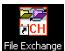

> 🧠 **[Cognis Multimodal Enrichment]**
> * **Classification:** Scientific Figure
> * **Extracted Text (OCR):** `File Exchange`
> * **VLM Visual Summary:** ### FIGURE TYPE:
>   Software Interface Screenshot
>   
>   ### SCIENTIFIC PURPOSE:
>   This figure illustrates the software interface for a powder diffraction measurement tool, specifically focusing on the "File Exchange" feature within the DIFFRACplus BASIC Evaluation software.
>   
>   ### KEY KNOWLEDGE:
>   1. **DIFFRACplus BASIC Evaluation:** This is a software tool used for powder diffraction data evaluation.
>   2. **File Exchange (XCH):** This feature allows users to exchange raw and processed files between different software applications.
>   3. **EVA (Exit Evaluation Area):** This is a step in the data processing workflow where users exit the evaluation area after completing data processing tasks.
>   
>   ### LABEL INTERPRETATION:
>   - **File Exchange (XCH):** This is the main label indicating the function being depicted.
>   - **File Exchange:** This is the function name within the DIFFRACplus BASIC Evaluation software.
>   
>   ### ENGINEERING/SCIENTIFIC INSIGHTS:
>   Understanding how to use the File Exchange feature is crucial for transferring data between different software tools used in powder diffraction analysis. This feature is particularly useful for maintaining consistency in data handling across different stages of the analysis process.
>   
>   ### USER-RELEVANT INFORMATION:
>   - The specific steps involved in using the File Exchange feature, such as exporting files as ASCII, opening the RAW File Exchange, and converting files to ASCII format.
>   - The importance of exiting the evaluation area (EVA) after completing data processing tasks to ensure accurate results.
> * **Figure Caption:** [Section: Bruker D8 Discover XRD User’s Guide I. Powder Diffraction Measurement using LynxEye Detector > II. Diffraction Evaluation using DIFFRACplus BASIC Evaluation] | [Section: Bruker D8 Discover XRD User’s Guide I. Powder Diffraction Measurement using LynxEye Detector > II. Diffraction Evaluation using DIFFRACplus BASIC Evaluation]
> * **Surrounding Context (+/- 300 words):**
>   * **[Before]:** *... Stripping i. Click the Strip $\mathbf { K } _ { \alpha 2 }$ button on the Data Treatment palette. ii. Use the slider to adjust the Intensity Ratio. iii. Click Append to append the $\mathrm { K } _ { \alpha ^ { 2 } }$ subtracted scan to the document d. Smoothing Scans i. Click the Smooth button on the Data Treatment palette. ii. Use the slider to adjust the Smooth factor. iii. Click Append to append the smoothed scan to the document e. Fourier Smoothing and Expansion i. Click the Fourier button on the Data Treatment palette. ii. In the Fourier treatment control panel, select the expansion (x1, x2, x4, x8, and x16). iii. Use the slider to adjust the cutoff. iv. Click Append to append the smoothed scan to the document. 4. Search/Match: (\*\* see the next page for a general procedure.) 5. Saving and Printing in EVA. 6. Export file as ASCII file. a. Export your EVA file as a RAW file; b. Open the RAW File Exchange , or XCH , to convert your RAW and/or processed files to ASCII files.* > * **[After]:** *[Section: Bruker D8 Discover XRD User’s Guide I. Powder Diffraction Measurement using LynxEye Detector > II. Diffraction Evaluation using DIFFRACplus BASIC Evaluation] 7. Exit EVA after you complete data processing. 8. Sign off the instrument by filling in the log-book. \*\* The purpose of EVA Search/Match is to search the current scan of an unknown material and then identify reference patterns that are likely to explain the unknown scan. The general procedure for EVA Search/Match is as follows: Use the Scroll List mode to match the scan ...* [Section: Bruker D8 Discover XRD User’s Guide I. Powder Diffraction Measurement using LynxEye Detector > II. Diffraction Evaluation using DIFFRACplus BASIC Evaluation]*
>   * **[After]:** *[Section: Bruker D8 Discover XRD User’s Guide I. Powder Diffraction Measurement using LynxEye Detector > II. Diffraction Evaluation using DIFFRACplus BASIC Evaluation] > 🧠 **[Cognis Multimodal Enrichment]** > * **Classification:** Scientific Figure > * **Extracted Text (OCR):** `File Exchange` > * **VLM Visual Summary:** **FIGURE TYPE:** Software Interface Screenshot > > **SCIENTIFIC PURPOSE:** This figure illustrates the software interface for a powder diffraction measurement tool, specifically focusing on the "File Exchange" feature within the DIFFRACplus BASIC Evaluation software. > > **KEY KNOWLEDGE:** > 1. **DIFFRACplus BASIC Evaluation:** This is a software tool used for powder diffraction data evaluation. > 2. **File Exchange (XCH):** This feature allows users to exchange raw and processed files between different software applications. > 3. **EVA (Exit Evaluation Area):** This is a step in the data processing workflow where users exit the evaluation area after completing data processing tasks. > > **LABEL INTERPRETATION:** > - **File Exchange (XCH):** This is the main label indicating the function being depicted. > - **File Exchange:** This is the function name within the DIFFRACplus BASIC Evaluation software. > > **ENGINEERING/SCIENTIFIC INSIGHTS:** > - Understanding how to use the File Exchange feature is crucial for transferring data between different software tools used in powder diffraction analysis. > - This feature is particularly useful for maintaining consistency in data handling across different stages of the analysis process. > > **USER-RELEVANT INFORMATION:** > - The specific steps involved in using the File Exchange feature, such as exporting files as ASCII, opening the RAW File Exchange, and converting files to ASCII format. > - The importance of exiting the evaluation area (EVA) after completing data processing tasks to ensure accurate results. > * **Figure Caption:** [Section: Bruker D8 Discover XRD User’s Guide I. Powder Diffraction Measurement using LynxEye Detector > II. Diffraction Evaluation using ...*

> 🧠 **[Cognis Multimodal Enrichment]**
> * **Classification:** Scientific Figure
> * **Extracted Text (OCR):** `File Exchange`
> * **VLM Visual Summary:** **FIGURE TYPE:** Software Interface Screenshot
>   
>   **SCIENTIFIC PURPOSE:** This figure illustrates the software interface for a powder diffraction measurement tool, specifically focusing on the "File Exchange" feature within the DIFFRACplus BASIC Evaluation software.
>   
>   **KEY KNOWLEDGE:**
>   1. **DIFFRACplus BASIC Evaluation:** This is a software tool used for powder diffraction data evaluation.
>   2. **File Exchange (XCH):** This feature allows users to exchange raw and processed files between different software applications.
>   3. **EVA (Exit Evaluation Area):** This is a step in the data processing workflow where users exit the evaluation area after completing data processing tasks.
>   
>   **LABEL INTERPRETATION:**
>   - **File Exchange (XCH):** This is the main label indicating the function being depicted.
>   - **File Exchange:** This is the function name within the DIFFRACplus BASIC Evaluation software.
>   
>   **ENGINEERING/SCIENTIFIC INSIGHTS:**
>   - Understanding how to use the File Exchange feature is crucial for transferring data between different software tools used in powder diffraction analysis.
>   - This feature is particularly useful for maintaining consistency in data handling across different stages of the analysis process.
>   
>   **USER-RELEVANT INFORMATION:**
>   - The specific steps involved in using the File Exchange feature, such as exporting files as ASCII, opening the RAW File Exchange, and converting files to ASCII format.
>   - The importance of exiting the evaluation area (EVA) after completing data processing tasks to ensure accurate results.
> * **Figure Caption:** [Section: Bruker D8 Discover XRD User’s Guide I. Powder Diffraction Measurement using LynxEye Detector > II. Diffraction Evaluation using DIFFRACplus BASIC Evaluation] | 7. Exit EVA after you complete data processing.
> * **Surrounding Context (+/- 300 words):**
>   * **[Before]:** *... Search i. On the Data Treatment palette click the Peak Search button. [Section: Bruker D8 Discover XRD User’s Guide I. Powder Diffraction Measurement using LynxEye Detector > II. Diffraction Evaluation using DIFFRACplus BASIC Evaluation] ii. Move the slider to see ghost peaks in the Overview and Working panes. iii. When no manual editing is required, click Make DIF to transfer the found peaks to a DIF pattern. iv. When manual editing is required, click Append To List. c. Computing $\mathrm { K } _ { \alpha ^ { 2 } }$ Stripping i. Click the Strip $\mathbf { K } _ { \alpha 2 }$ button on the Data Treatment palette. ii. Use the slider to adjust the Intensity Ratio. iii. Click Append to append the $\mathrm { K } _ { \alpha ^ { 2 } }$ subtracted scan to the document d. Smoothing Scans i. Click the Smooth button on the Data Treatment palette. ii. Use the slider to adjust the Smooth factor. iii. Click Append to append the smoothed scan to the document e. Fourier Smoothing and Expansion i. Click the Fourier button on the Data Treatment palette. ii. In the Fourier treatment control panel, select the expansion (x1, x2, x4, x8, and x16). iii. Use the slider to adjust the cutoff. iv. Click Append to append the smoothed scan to the document. 4. Search/Match: (\*\* see the next page for a general procedure.) 5. Saving and Printing in EVA. 6. Export file as ASCII file. a. Export your EVA file as a RAW file; b. Open the RAW File Exchange , or XCH , to convert your RAW and/or processed files to ASCII files. [Section: Bruker D8 Discover XRD User’s Guide I. Powder Diffraction Measurement using LynxEye Detector > II. Diffraction Evaluation using DIFFRACplus BASIC Evaluation]*
>   * **[After]:** *7. Exit EVA after you complete data processing. 8. Sign off the instrument by filling in the log-book. \*\* The purpose of EVA Search/Match is to search the current scan of an unknown material and then identify reference patterns that are likely to explain the unknown scan. The general procedure for EVA Search/Match is as follows: Use the Scroll List mode to match the scan ...*

7. Exit EVA after you complete data processing.

8. Sign off the instrument by filling in the log-book.

\*\* The purpose of EVA Search/Match is to search the current scan of an unknown material and then identify reference patterns that are likely to explain the unknown scan.   
The general procedure for EVA Search/Match is as follows:

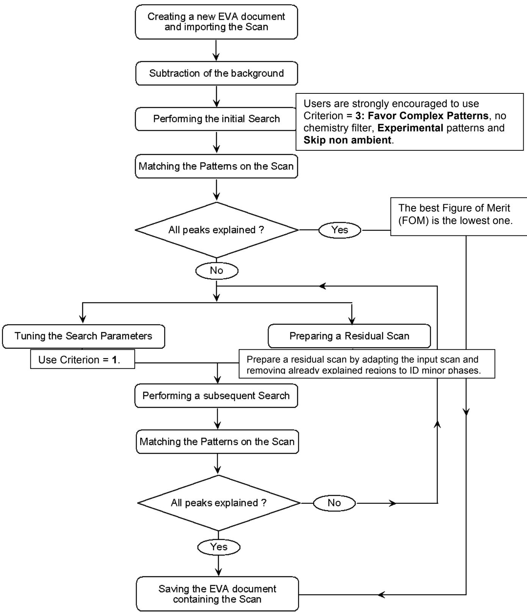

> 🧠 **[Cognis Multimodal Enrichment]**
> * **Classification:** Scientific Figure
> * **Extracted Text (OCR):** `Creating a new EVA document and importing the Scan, Subtraction of the background, Performing the initial Search, Users are strongly encouraged to use Criterion = 3: Favor Complex Patterns, no chemistry filter, Experimental patterns and Skip non ambient, The best Figure of Merit (FOM) is the lowest one, All peaks explained?, No, Tuning the Search Parameters, Use Criterion = 1., Preparing a Residual Scan, Prepare a residual scan by adapting the input scan and removing already`
> * **VLM Visual Summary:** ### FIGURE TYPE:
>   Flowchart
>   
>   ### SCIENTIFIC PURPOSE:
>   This figure illustrates the general procedure for the EVA Search/Match process, which is used to identify reference patterns that explain an unknown scan.
>   
>   ### KEY KNOWLEDGE:
>   1. **EVA Search/Match Process**:
>      - The process involves creating a new EVA document and importing a scan.
>      - Subtracting the background from the scan.
>      - Performing an initial search with specific criteria (Criterion = 3: Favor Complex Patterns, no chemistry filter, experimental patterns, and skip non ambient).
>      - Matching the patterns on the scan.
>      - If all peaks are explained, the best Figure of Merit (FOM) is the lowest one.
>      - If not all peaks are explained, tuning the search parameters (use Criterion = 1) and preparing a residual scan.
>      - Performing a subsequent search with the adjusted parameters.
>      - Matching the patterns on the scan again.
>      - If all peaks are explained, saving the EVA document containing the scan.
>   
>   2. **Search Parameters**:
>      - The search can be performed using different criteria such as Criterion = 1, Criterion = 2, Criterion = 3, etc.
>   
>   3. **Figure of Merit (FOM)**:
>      - The FOM is a measure of how well the search matches the scan.
>   
>   4. **Residual Scan**:
>      - A residual scan is prepared by adapting the input scan and removing regions that have already been explained.
>   
>   5. **Criterion = 3**:
>      - Favor Complex Patterns, no chemistry filter, experimental patterns, and skip non ambient.
>   
>   6. **Criterion = 1**:
>      - Use Criterion = 1 to tune the search parameters.
>   
>   7. **Matching Patterns**:
>      - Matching the patterns on the scan ensures that the identified patterns accurately represent the unknown scan.
>   
>   8. **Saving the EVA Document**:
>      - The final step is to save the EVA document containing the scan once all peaks are explained.
>   
>   ### LABEL INTERPRETATION:
>   - **Creating a new EVA document and importing the Scan**: This step involves starting the process by creating a new EVA document and importing a scan.
>   - **Subtraction of the background**: The background is subtracted from the scan to improve the clarity of the diffraction pattern.
>   - **Performing the initial Search**: An initial search is conducted using specific criteria.
>   - **Users are strongly encouraged to
> * **Figure Caption:** The general procedure for EVA Search/Match is as follows: | [Section: Bruker D8 Discover XRD User’s Guide I. Powder Diffraction Measurement using LynxEye Detector > II. Diffraction Evaluation using DIFFRACplus BASIC Evaluation]
> * **Surrounding Context (+/- 300 words):**
>   * **[Before]:** *... Click the Smooth button on the Data Treatment palette. ii. Use the slider to adjust the Smooth factor. iii. Click Append to append the smoothed scan to the document e. Fourier Smoothing and Expansion i. Click the Fourier button on the Data Treatment palette. ii. In the Fourier treatment control panel, select the expansion (x1, x2, x4, x8, and x16). iii. Use the slider to adjust the cutoff. iv. Click Append to append the smoothed scan to the document. 4. Search/Match: (\*\* see the next page for a general procedure.) 5. Saving and Printing in EVA. 6. Export file as ASCII file. a. Export your EVA file as a RAW file; b. Open the RAW File Exchange , or XCH , to convert your RAW and/or processed files to ASCII files. [Section: Bruker D8 Discover XRD User’s Guide I. Powder Diffraction Measurement using LynxEye Detector > II. Diffraction Evaluation using DIFFRACplus BASIC Evaluation]* > * **[After]:** *7. Exit EVA after you complete data processing. 8. Sign off the instrument by filling in the log-book. \*\* The purpose of EVA Search/Match is to search the current scan of an unknown material and then identify reference patterns that are likely to explain the unknown scan. The general procedure for EVA Search/Match is as follows: Use the Scroll List mode to match the scan ...* [Section: Bruker D8 Discover XRD User’s Guide I. Powder Diffraction Measurement using LynxEye Detector > II. Diffraction Evaluation using DIFFRACplus BASIC Evaluation] 7. Exit EVA after you complete data processing. 8. Sign off the instrument by filling in the log-book. \*\* The purpose of EVA Search/Match is to search the current scan of an unknown material and then identify reference patterns that are likely to explain the unknown scan. The general procedure for EVA Search/Match is as follows:*
>   * **[After]:** *[Section: Bruker D8 Discover XRD User’s Guide I. Powder Diffraction Measurement using LynxEye Detector > II. Diffraction Evaluation using DIFFRACplus BASIC Evaluation] > 🧠 **[Cognis Multimodal Enrichment]** > * **Classification:** Scientific Figure > * **Extracted Text (OCR):** `Creating a new EVA document and importing the Scan, Subtraction of the background, Performing the initial Search, Users are strongly encouraged to use Criterion = 3: Favor Complex Patterns, no chemistry filter, Experimental patterns and Skip non ambient, The best Figure of Merit (FOM) is the lowest one, All peaks explained?, No, Tuning the Search Parameters, Use Criterion = 1., Preparing a Residual Scan, Prepare a residual scan by adapting the input scan and removing already` > * **VLM Visual Summary:** ### FIGURE TYPE: > Flowchart > > ### SCIENTIFIC PURPOSE: > This figure illustrates the general procedure for the EVA Search/Match process, which is used to identify reference patterns that explain an unknown scan. > > ### KEY KNOWLEDGE: > 1. **EVA Search/Match Process**: > - The process involves creating a new EVA document and importing a scan. > - Subtracting the background from the scan. > - Performing an initial search with specific criteria (Criterion = 3: Favor Complex Patterns, no chemistry filter, experimental patterns, and skip non ambient). > - Matching the patterns on the scan. > - If all peaks are explained, the best Figure of Merit (FOM) is the lowest one. > - If not all peaks are explained, tuning the search parameters (use Criterion = 1) and preparing a residual scan. > - Performing a subsequent search with the adjusted parameters. > - Matching the patterns on the scan again. > - If all peaks are explained, saving the EVA document containing the scan. > > 2. **Search Parameters**: > - The search can be performed using ...*

> 🧠 **[Cognis Multimodal Enrichment]**
> * **Classification:** Scientific Figure
> * **Extracted Text (OCR):** `Creating a new EVA document and importing the Scan, Subtraction of the background, Performing the initial Search, Users are strongly encouraged to use Criterion = 3: Favor Complex Patterns, no chemistry filter, Experimental patterns and Skip non ambient, The best Figure of Merit (FOM) is the lowest one, All peaks explained?, No, Tuning the Search Parameters, Use Criterion = 1., Preparing a Residual Scan, Prepare a residual scan by adapting the input scan and removing already`
> * **VLM Visual Summary:** ### FIGURE TYPE:
>   Flowchart
>   
>   ### SCIENTIFIC PURPOSE:
>   This figure illustrates the general procedure for the EVA Search/Match process, which is used to identify reference patterns that explain an unknown scan.
>   
>   ### KEY KNOWLEDGE:
>   1. **EVA Search/Match Process**:
>      - The process involves creating a new EVA document and importing a scan.
>      - Subtracting the background from the scan.
>      - Performing an initial search with specific criteria (Criterion = 3: Favor Complex Patterns, no chemistry filter, experimental patterns, and skip non ambient).
>      - Matching the patterns on the scan.
>      - If all peaks are explained, the best Figure of Merit (FOM) is the lowest one.
>      - If not all peaks are explained, tuning the search parameters (use Criterion = 1) and preparing a residual scan.
>      - Performing a subsequent search with the adjusted parameters.
>      - Matching the patterns on the scan again.
>      - If all peaks are explained, saving the EVA document containing the scan.
>   
>   2. **Search Parameters**:
>      - The search can be performed using Criterion = 1, which favors simpler patterns without a chemistry filter, experimental patterns, and skips non ambient regions.
>   
>   3. **Figure of Merit (FOM)**:
>      - The FOM is a measure of how well the search matches the scan. It is typically the lowest value when all peaks are explained.
>   
>   4. **Scroll List Mode**:
>      - This mode allows users to match the scan using a list of known patterns.
>   
>   5. **Manual Editing**:
>      - Users can append manually edited patterns to the document using the Append To List function.
>   
>   6. **Data Treatment Palette**:
>      - Various tools such as striping, smoothing, Fourier smoothing and expansion, and appending scans to the document are available.
>   
>   7. **Exit EVA**:
>      - Users should exit EVA after completing data processing and sign off the instrument by filling in the log book.
>   
>   ### LABEL INTERPRETATION:
>   - **Creating a new EVA document and importing the Scan**: Start of the process.
>   - **Subtraction of the background**: Preprocessing step.
>   - **Performing the initial Search**: Main search phase.
>   - **Matching the Patterns on the Scan**: Matching the identified patterns.
>   - **All peaks explained?**: Decision point to check if all peaks are explained.
>   - **Yes**: If all peaks are explained, save the document.
>   -
> * **Figure Caption:** The general procedure for EVA Search/Match is as follows: | Use the Scroll List mode to match the scan
> * **Surrounding Context (+/- 300 words):**
>   * **[Before]:** *... Make DIF to transfer the found peaks to a DIF pattern. iv. When manual editing is required, click Append To List. c. Computing $\mathrm { K } _ { \alpha ^ { 2 } }$ Stripping i. Click the Strip $\mathbf { K } _ { \alpha 2 }$ button on the Data Treatment palette. ii. Use the slider to adjust the Intensity Ratio. iii. Click Append to append the $\mathrm { K } _ { \alpha ^ { 2 } }$ subtracted scan to the document d. Smoothing Scans i. Click the Smooth button on the Data Treatment palette. ii. Use the slider to adjust the Smooth factor. iii. Click Append to append the smoothed scan to the document e. Fourier Smoothing and Expansion i. Click the Fourier button on the Data Treatment palette. ii. In the Fourier treatment control panel, select the expansion (x1, x2, x4, x8, and x16). iii. Use the slider to adjust the cutoff. iv. Click Append to append the smoothed scan to the document. 4. Search/Match: (\*\* see the next page for a general procedure.) 5. Saving and Printing in EVA. 6. Export file as ASCII file. a. Export your EVA file as a RAW file; b. Open the RAW File Exchange , or XCH , to convert your RAW and/or processed files to ASCII files. [Section: Bruker D8 Discover XRD User’s Guide I. Powder Diffraction Measurement using LynxEye Detector > II. Diffraction Evaluation using DIFFRACplus BASIC Evaluation] 7. Exit EVA after you complete data processing. 8. Sign off the instrument by filling in the log-book. \*\* The purpose of EVA Search/Match is to search the current scan of an unknown material and then identify reference patterns that are likely to explain the unknown scan. The general procedure for EVA Search/Match is as follows:*
>   * **[After]:** *Use the Scroll List mode to match the scan ...*
  
Use the Scroll List mode to match the scan