# Laboratory Manual

For

# Instrumental Methods of Analysis (CHC506)

AY: 2021-22

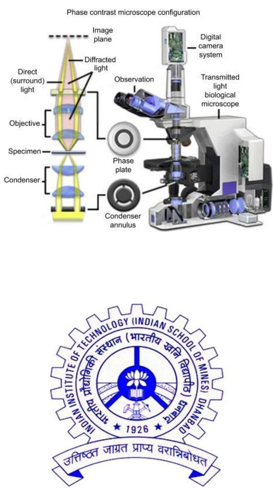

> 🧠 **[Cognis Multimodal Enrichment]**
> * **Classification:** Scientific Figure
> * **Extracted Text (OCR):** `Phase contrast microscope configuration, Image plane, Digital camera system, Transmitted light biological microscope, Observation, Phase plate, Condenser annulus, Condenser, Objective, Specimen, Direct (surround) light, Diffracted light, Indian Institute of Technology (Indian School of Mines), Dehradun, 1926, Utterstt Jagraat Prayya Varasiribodh,`
> * **VLM Visual Summary:** ### FIGURE TYPE:
>   Instrument Schematic
>   
>   ### SCIENTIFIC PURPOSE:
>   The figure explains the configuration of a phase contrast microscope.
>   
>   ### KEY KNOWLEDGE:
>   - **Phase Contrast Microscope Configuration**: The figure shows the components of a phase contrast microscope, including the objective lens, condenser, specimen, phase plate, observation area, and digital camera system.
>   - **Direct Light**: The direct light entering the objective lens.
>   - **Diffracted Light**: The diffracted light that interacts with the phase plate.
>   - **Image Plane**: The plane where the final image is formed.
>   - **Digital Camera System**: Captures the image for further analysis.
>   - **Transmitted Light Biological Microscope**: The base of the microscope setup.
>   
>   ### LABEL INTERPRETATION:
>   - **Objective**: The objective lens of the microscope.
>   - **Condenser**: The condenser used to focus light onto the specimen.
>   - **Specimen**: The material being observed under the microscope.
>   - **Phase Plate**: The component that introduces phase shifts to the light.
>   - **Observation**: The area where the final image is formed.
>   - **Digital Camera System**: The camera used to capture images.
>   - **Transmitted Light Biological Microscope**: The main body of the microscope.
>   
>   ### ENGINEERING/SCIENTIFIC INSIGHTS:
>   A reader should learn about the specific components and their functions within a phase contrast microscope, which is used to enhance the visibility of biological specimens by introducing phase shifts to the light. This technique is particularly useful for observing soft tissues and cells without staining.
>   
>   ### USER-RELEVANT INFORMATION:
>   The information provided in the figure can help answer questions related to the structure and operation of a phase contrast microscope, such as how it enhances image contrast and what components are essential for its function.
> * **Figure Caption:** AY: 2021-22 | Department of Chemical Engineering Indian Institute of Technology(ISM) Dhanbad
> * **Surrounding Context (+/- 300 words):**
>   * **[Before]:** *... [Section: Laboratory Manual] For [Section: Instrumental Methods of Analysis (CHC506)] AY: 2021-22*
>   * **[After]:** *Department of Chemical Engineering Indian Institute of Technology(ISM) Dhanbad [Section: Instrumental Methods of Analysis (CHC506) > Index:-] <table><tr><td rowspan=1 colspan=1>S.No.</td><td rowspan=1 colspan=1>Name of the Experiment</td><td rowspan=1 colspan=1>PageNo.</td></tr><tr><td rowspan=1 colspan=1>1.</td><td rowspan=1 colspan=1>Size reduction studies using Planetary ball mill</td><td rowspan=1 colspan=1>7</td></tr><tr><td rowspan=1 colspan=1>2.</td><td rowspan=1 colspan=1> Particle size distribution measurements using Particle size Analyzer</td><td rowspan=1 colspan=1>9</td></tr><tr><td rowspan=1 colspan=1>3.</td><td rowspan=1 colspan=1>Particle size distribution measurements using Zeta Sizer</td><td rowspan=1 colspan=1>11</td></tr><tr><td rowspan=1 colspan=1>4.</td><td rowspan=1 colspan=1>Detection of functional groups using FTIR Analysis</td><td rowspan=1 colspan=1>13</td></tr><tr><td rowspan=1 colspan=1>5.</td><td rowspan=1 colspan=1>Studies on UV-VIS spectrometry</td><td rowspan=1 colspan=1>17</td></tr><tr><td rowspan=1 colspan=1>6.</td><td rowspan=1 colspan=1> Rheometric analysis of fluids using Rheometer</td><td rowspan=1 colspan=1>20</td></tr><tr><td rowspan=1 colspan=1>7.</td><td rowspan=1 colspan=1>Contact angle measurements techniques using Goniometer</td><td rowspan=1 colspan=1>24</td></tr><tr><td rowspan=1 colspan=1>8.</td><td rowspan=1 colspan=1> Refractive index measurement using Refractometer</td><td rowspan=1 colspan=1>27</td></tr><tr><td rowspan=1 colspan=1>9.</td><td rowspan=1 colspan=1>Ultimate analysis of solid fuel using CHNS analyzer</td><td rowspan=1 colspan=1>29</td></tr><tr><td rowspan=1 colspan=1>10.</td><td rowspan=1 colspan=1>Surface characterization using Optical Microscopy</td><td rowspan=1 colspan=1>33</td></tr></table> [Section: Instrumental Methods of Analysis (CHC506) > Index:-] Lab Manual for Instrumental Methods of Analysis (CHC 506) L: T: P: 0-0-2 Course Title : Instrumental Methods of Analysis Course Objectives : To teach and provide a hands-on experience for different analytical equipment/instruments that are useful for carrying out research in different areas in Chemical Engineering. Learning Outcomes : Students will be proficient for the use of studied instrumental techniques in chemical engineering research. [Section: Instrumental Methods of Analysis (CHC506) > Index:-] <table><tr><td rowspan=1 colspan=1>Units</td><td rowspan=1 colspan=1>Name of the experiment</td></tr><tr><td rowspan=5 colspan=1> 1. Analytical instruments/equipment</td><td rowspan=1 colspan=1> Size reduction studies using Planetary ball mill</td></tr><tr><td rowspan=1 colspan=1>Particle size distribution measurements using Particle sizeAnalyzer</td></tr><tr><td rowspan=1 colspan=1> Particle size distribution measurements using Zeta Sizer</td></tr><tr><td rowspan=1 colspan=1> Detection of functional groups using FTIR Analysis</td></tr><tr><td rowspan=1 colspan=1> Studies on UV-VIS spectrometry</td></tr><tr><td rowspan=2 colspan=1>2. Flowcharacterization &amp; wettability</td><td rowspan=1 colspan=1>Rheometric analysis of fluids using Rheometer</td></tr><tr><td rowspan=1 colspan=1> Contact angle measurements techniques using Goniometer</td></tr><tr><td rowspan=2 colspan=1> ...*

Department of Chemical Engineering Indian Institute of Technology(ISM) Dhanbad

## Lab Manual for Instrumental Methods of Analysis (CHC 506)

## Index:-

<table><tr><td rowspan=1 colspan=1>S.No.</td><td rowspan=1 colspan=1>Name of the Experiment</td><td rowspan=1 colspan=1>PageNo.</td></tr><tr><td rowspan=1 colspan=1>1.</td><td rowspan=1 colspan=1>Size reduction studies using Planetary ball mill</td><td rowspan=1 colspan=1>7</td></tr><tr><td rowspan=1 colspan=1>2.</td><td rowspan=1 colspan=1> Particle size distribution measurements using Particle size Analyzer</td><td rowspan=1 colspan=1>9</td></tr><tr><td rowspan=1 colspan=1>3.</td><td rowspan=1 colspan=1>Particle size distribution measurements using Zeta Sizer</td><td rowspan=1 colspan=1>11</td></tr><tr><td rowspan=1 colspan=1>4.</td><td rowspan=1 colspan=1>Detection of functional groups using FTIR Analysis</td><td rowspan=1 colspan=1>13</td></tr><tr><td rowspan=1 colspan=1>5.</td><td rowspan=1 colspan=1>Studies on UV-VIS spectrometry</td><td rowspan=1 colspan=1>17</td></tr><tr><td rowspan=1 colspan=1>6.</td><td rowspan=1 colspan=1> Rheometric analysis of fluids using Rheometer</td><td rowspan=1 colspan=1>20</td></tr><tr><td rowspan=1 colspan=1>7.</td><td rowspan=1 colspan=1>Contact angle measurements techniques using Goniometer</td><td rowspan=1 colspan=1>24</td></tr><tr><td rowspan=1 colspan=1>8.</td><td rowspan=1 colspan=1> Refractive index measurement using Refractometer</td><td rowspan=1 colspan=1>27</td></tr><tr><td rowspan=1 colspan=1>9.</td><td rowspan=1 colspan=1>Ultimate analysis of solid fuel using CHNS analyzer</td><td rowspan=1 colspan=1>29</td></tr><tr><td rowspan=1 colspan=1>10.</td><td rowspan=1 colspan=1>Surface characterization using Optical Microscopy</td><td rowspan=1 colspan=1>33</td></tr></table>

Lab Manual for Instrumental Methods of Analysis (CHC 506)

L: T: P: 0-0-2

Course Title : Instrumental Methods of Analysis

Course Objectives : To teach and provide a hands-on experience for different analytical equipment/instruments that are useful for carrying out research in different areas in Chemical Engineering.

Learning Outcomes : Students will be proficient for the use of studied instrumental techniques in chemical engineering research.

<table><tr><td rowspan=1 colspan=1>Units</td><td rowspan=1 colspan=1>Name of the experiment</td></tr><tr><td rowspan=5 colspan=1> 1. Analytical instruments/equipment</td><td rowspan=1 colspan=1> Size reduction studies using Planetary ball mill</td></tr><tr><td rowspan=1 colspan=1>Particle size distribution measurements using Particle sizeAnalyzer</td></tr><tr><td rowspan=1 colspan=1> Particle size distribution measurements using Zeta Sizer</td></tr><tr><td rowspan=1 colspan=1> Detection of functional groups using FTIR Analysis</td></tr><tr><td rowspan=1 colspan=1> Studies on UV-VIS spectrometry</td></tr><tr><td rowspan=2 colspan=1>2. Flowcharacterization &amp; wettability</td><td rowspan=1 colspan=1>Rheometric analysis of fluids using Rheometer</td></tr><tr><td rowspan=1 colspan=1> Contact angle measurements techniques using Goniometer</td></tr><tr><td rowspan=2 colspan=1> 3. Optical instruments</td><td rowspan=1 colspan=1> Surface characterization using Optical Microscopy</td></tr><tr><td rowspan=1 colspan=1> Refractive index measurement using Refractometer</td></tr><tr><td rowspan=1 colspan=1>4. Elemental analysis</td><td rowspan=1 colspan=1> Ultimate analysis of solid fuel using CHNS analyzer</td></tr></table>

Dress appropriately

Lab Safety Rules

> 🧠 **[Cognis Multimodal Enrichment]**
> * **Classification:** Scientific Figure
> * **VLM Visual Summary:** **FIGURE TYPE:** Safety Signage
>   
>   **SCIENTIFIC PURPOSE:** This figure serves as a safety signage icon, specifically designed to convey laboratory safety rules and guidelines.
>   
>   **KEY KNOWLEDGE:**
>   - The figure represents a person wearing protective gear, including a lab coat, gloves, and goggles.
>   - It is commonly used to emphasize the importance of adhering to safety protocols in laboratory settings.
>   - The icon helps remind users to wear appropriate protective clothing and eyewear to prevent injuries and contamination.
>   
>   **LABEL INTERPRETATION:** 
>   - The figure includes a person wearing a lab coat, gloves, and goggles, which are standard protective gear in laboratories.
>   - The blue background suggests a laboratory environment.
>   
>   **ENGINEERING/SCIENTIFIC INSIGHTS:**
>   - A reader should learn to prioritize safety in laboratory work by wearing appropriate protective clothing and eyewear.
>   - This figure serves as a visual reminder to follow safety guidelines to ensure a safe working environment.
>   
>   **USER-RELEVANT INFORMATION:**
>   - The figure can help answer questions about the importance of wearing protective gear in laboratory settings.
>   - It can assist in understanding the specific safety measures required in various laboratory activities.
> * **Figure Caption:** Lab Safety Rules | [Section: Lab Safety Rules]
> * **Surrounding Context (+/- 300 words):**
>   * **[Before]:** *... mill</td><td rowspan=1 colspan=1>7</td></tr><tr><td rowspan=1 colspan=1>2.</td><td rowspan=1 colspan=1> Particle size distribution measurements using Particle size Analyzer</td><td rowspan=1 colspan=1>9</td></tr><tr><td rowspan=1 colspan=1>3.</td><td rowspan=1 colspan=1>Particle size distribution measurements using Zeta Sizer</td><td rowspan=1 colspan=1>11</td></tr><tr><td rowspan=1 colspan=1>4.</td><td rowspan=1 colspan=1>Detection of functional groups using FTIR Analysis</td><td rowspan=1 colspan=1>13</td></tr><tr><td rowspan=1 colspan=1>5.</td><td rowspan=1 colspan=1>Studies on UV-VIS spectrometry</td><td rowspan=1 colspan=1>17</td></tr><tr><td rowspan=1 colspan=1>6.</td><td rowspan=1 colspan=1> Rheometric analysis of fluids using Rheometer</td><td rowspan=1 colspan=1>20</td></tr><tr><td rowspan=1 colspan=1>7.</td><td rowspan=1 colspan=1>Contact angle measurements techniques using Goniometer</td><td rowspan=1 colspan=1>24</td></tr><tr><td rowspan=1 colspan=1>8.</td><td rowspan=1 colspan=1> Refractive index measurement using Refractometer</td><td rowspan=1 colspan=1>27</td></tr><tr><td rowspan=1 colspan=1>9.</td><td rowspan=1 colspan=1>Ultimate analysis of solid fuel using CHNS analyzer</td><td rowspan=1 colspan=1>29</td></tr><tr><td rowspan=1 colspan=1>10.</td><td rowspan=1 colspan=1>Surface characterization using Optical Microscopy</td><td rowspan=1 colspan=1>33</td></tr></table> [Section: Instrumental Methods of Analysis (CHC506) > Index:-] Lab Manual for Instrumental Methods of Analysis (CHC 506) L: T: P: 0-0-2 Course Title : Instrumental Methods of Analysis Course Objectives : To teach and provide a hands-on experience for different analytical equipment/instruments that are useful for carrying out research in different areas in Chemical Engineering. Learning Outcomes : Students will be proficient for the use of studied instrumental techniques in chemical engineering research. [Section: Instrumental Methods of Analysis (CHC506) > Index:-] <table><tr><td rowspan=1 colspan=1>Units</td><td rowspan=1 colspan=1>Name of the experiment</td></tr><tr><td rowspan=5 colspan=1> 1. Analytical instruments/equipment</td><td rowspan=1 colspan=1> Size reduction studies using Planetary ball mill</td></tr><tr><td rowspan=1 colspan=1>Particle size distribution measurements using Particle sizeAnalyzer</td></tr><tr><td rowspan=1 colspan=1> Particle size distribution measurements using Zeta Sizer</td></tr><tr><td rowspan=1 colspan=1> Detection of functional groups using FTIR Analysis</td></tr><tr><td rowspan=1 colspan=1> Studies on UV-VIS spectrometry</td></tr><tr><td rowspan=2 colspan=1>2. Flowcharacterization &amp; wettability</td><td rowspan=1 colspan=1>Rheometric analysis of fluids using Rheometer</td></tr><tr><td rowspan=1 colspan=1> Contact angle measurements techniques using Goniometer</td></tr><tr><td rowspan=2 colspan=1> 3. Optical instruments</td><td rowspan=1 colspan=1> Surface characterization using Optical Microscopy</td></tr><tr><td rowspan=1 colspan=1> Refractive index measurement using Refractometer</td></tr><tr><td rowspan=1 colspan=1>4. Elemental analysis</td><td rowspan=1 colspan=1> Ultimate analysis of solid fuel using CHNS analyzer</td></tr></table> Dress appropriately Lab Safety Rules*
>   * **[After]:** *[Section: Lab Safety Rules] Science labs offer great opportunitiesfor learning, teaching,and research. Theyalso pose hazards thatrequire propersafety precautions. Stay safe when conducting your labsby following these guidelines. Proper supervision Dontperform labexperimentswithout instructor supervision (unless given permission todo so). Tieback long hair,and wear suitable gloves, goggles,and otherprotective equipment. [Section: Lab Safety Rules > Know location of emergency numbers&safety equipment] Knowthelocation of safety equipmentand emergencyphone numbers (suchaspoisoncontrol)soyoucanaccessthemquicklyifnecessary [Section: Lab Safety Rules > No food] Donteat ordrink in the laband never taste chemicals. [Section: Lab Safety Rules > ID hazards] Identify hazardousmaterials before beginning labs. Beattentive Beattentive while in the lab. Don'tleavelit Bunsenburners unattended or leaveanexperiment inprogress. [Section: Lab Safety Rules > Becareful when handling hot glassware] Turnoff allheatingappliances when not inuse.Keepflammable objectsawayfromyourworkspace. Keep aclean workspace Don't obstruct work areas, floors,orexits.Keepcoats bags,and otherpersonal items stored indesignatedareas away from thelab.Don'tblock sink drains with debris. Handle glassware carefully Properlydisposeofanything thatbreaks.Reportcuts, spills,and broken glass to yourinstructorimmediately. [Section: Lab Safety Rules > Cleanup] Aftercompleting the lab carefully clean yourworkspace and theequipment,and wash your hands. Lab Manual for Instrumental Methods of Analysis (CHC 506) [Section: Lab Safety Rules > Lab Safety Do's and Don'ts for Students] Use this handy checklist to acquaint students with safety do's and don’ts in the laboratory. [Section: Lab Safety Rules > Conduct] ▪ Do not engage in practical jokes or boisterous conduct in the laboratory. ▪ Never run in the laboratory. ▪ The use of personal audio or video equipment is prohibited in the laboratory ▪ The performance of unauthorized experiments is strictly forbidden ▪ Do not sit on laboratory benches. [Section: Lab Safety Rules > General Work Procedure] Know emergency procedures. ▪ Never work in the laboratory without the supervision of an instructor. ▪ Always perform the experiments or work precisely as directed by your instructor. ▪ Immediately report any spills, accidents, ...*

# Lab Safety Rules

Science labs offer great opportunitiesfor learning, teaching,and research. Theyalso pose hazards thatrequire propersafety precautions.

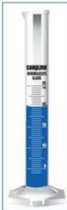

> 🧠 **[Cognis Multimodal Enrichment]**
> * **Classification:** Logo / Decorative Image (filtered out)

Stay safe   
when   
conducting your labsby following   
these   
guidelines.

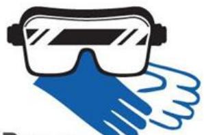

> 🧠 **[Cognis Multimodal Enrichment]**
> * **Classification:** Logo / Decorative Image (filtered out)
  
Proper supervision Dontperform labexperimentswithout instructor supervision (unless given permission todo so).

Tieback long hair,and wear suitable gloves, goggles,and otherprotective equipment.

> 🧠 **[Cognis Multimodal Enrichment]**
> * **Classification:** Logo / Decorative Image (filtered out)

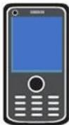

> 🧠 **[Cognis Multimodal Enrichment]**
> * **Classification:** Logo / Decorative Image (filtered out)

## Know location of emergency numbers&safety equipment

Knowthelocation of safety equipmentand emergencyphone numbers (suchaspoisoncontrol)soyoucanaccessthemquicklyifnecessary

> 🧠 **[Cognis Multimodal Enrichment]**
> * **Classification:** Logo / Decorative Image (filtered out)

> 🧠 **[Cognis Multimodal Enrichment]**
> * **Classification:** Logo / Decorative Image (filtered out)

## No food

Donteat ordrink in the laband never taste chemicals.

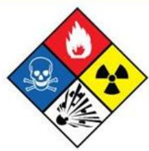

> 🧠 **[Cognis Multimodal Enrichment]**
> * **Classification:** Scientific Figure
> * **VLM Visual Summary:** **FIGURE TYPE:** Safety Signage
>   
>   **SCIENTIFIC PURPOSE:** This figure serves as a warning sign to highlight the potential hazards associated with laboratory activities.
>   
>   **KEY KNOWLEDGE:**
>   - The blue square with a skull and crossbones indicates a hazard related to poisoning or toxicity.
>   - The red triangle with a flame symbolizes a fire hazard.
>   - The yellow diamond with a radiation symbol indicates exposure to radioactive materials.
>   - The black triangle with a burst of energy signifies explosive hazards.
>   
>   **LABEL INTERPRETATION:** 
>   - The blue square with a skull and crossbones indicates a hazard related to poisoning or toxicity.
>   - The red triangle with a flame symbolizes a fire hazard.
>   - The yellow diamond with a radiation symbol indicates exposure to radioactive materials.
>   - The black triangle with a burst of energy signifies explosive hazards.
>   
>   **ENGINEERING/SCIENTIFIC INSIGHTS:** 
>   A reader should learn that laboratory activities can present various hazards such as poisoning, fire, radiation exposure, and explosion risks. Understanding these hazards is crucial for maintaining safety in the laboratory environment.
>   
>   **USER-RELEVANT INFORMATION:**
>   The information provided by this figure helps answer future questions about the specific hazards associated with laboratory activities, which is essential for ensuring proper safety protocols and preventing accidents.
> * **Figure Caption:** Donteat ordrink in the laband never taste chemicals. | [Section: Lab Safety Rules > ID hazards]
> * **Surrounding Context (+/- 300 words):**
>   * **[Before]:** *... using Refractometer</td><td rowspan=1 colspan=1>27</td></tr><tr><td rowspan=1 colspan=1>9.</td><td rowspan=1 colspan=1>Ultimate analysis of solid fuel using CHNS analyzer</td><td rowspan=1 colspan=1>29</td></tr><tr><td rowspan=1 colspan=1>10.</td><td rowspan=1 colspan=1>Surface characterization using Optical Microscopy</td><td rowspan=1 colspan=1>33</td></tr></table> [Section: Instrumental Methods of Analysis (CHC506) > Index:-] Lab Manual for Instrumental Methods of Analysis (CHC 506) L: T: P: 0-0-2 Course Title : Instrumental Methods of Analysis Course Objectives : To teach and provide a hands-on experience for different analytical equipment/instruments that are useful for carrying out research in different areas in Chemical Engineering. Learning Outcomes : Students will be proficient for the use of studied instrumental techniques in chemical engineering research. [Section: Instrumental Methods of Analysis (CHC506) > Index:-] <table><tr><td rowspan=1 colspan=1>Units</td><td rowspan=1 colspan=1>Name of the experiment</td></tr><tr><td rowspan=5 colspan=1> 1. Analytical instruments/equipment</td><td rowspan=1 colspan=1> Size reduction studies using Planetary ball mill</td></tr><tr><td rowspan=1 colspan=1>Particle size distribution measurements using Particle sizeAnalyzer</td></tr><tr><td rowspan=1 colspan=1> Particle size distribution measurements using Zeta Sizer</td></tr><tr><td rowspan=1 colspan=1> Detection of functional groups using FTIR Analysis</td></tr><tr><td rowspan=1 colspan=1> Studies on UV-VIS spectrometry</td></tr><tr><td rowspan=2 colspan=1>2. Flowcharacterization &amp; wettability</td><td rowspan=1 colspan=1>Rheometric analysis of fluids using Rheometer</td></tr><tr><td rowspan=1 colspan=1> Contact angle measurements techniques using Goniometer</td></tr><tr><td rowspan=2 colspan=1> 3. Optical instruments</td><td rowspan=1 colspan=1> Surface characterization using Optical Microscopy</td></tr><tr><td rowspan=1 colspan=1> Refractive index measurement using Refractometer</td></tr><tr><td rowspan=1 colspan=1>4. Elemental analysis</td><td rowspan=1 colspan=1> Ultimate analysis of solid fuel using CHNS analyzer</td></tr></table> Dress appropriately Lab Safety Rules [Section: Lab Safety Rules] Science labs offer great opportunitiesfor learning, teaching,and research. Theyalso pose hazards thatrequire propersafety precautions. Stay safe when conducting your labsby following these guidelines. Proper supervision Dontperform labexperimentswithout instructor supervision (unless given permission todo so). Tieback long hair,and wear suitable gloves, goggles,and otherprotective equipment. [Section: Lab Safety Rules > Know location of emergency numbers&safety equipment] Knowthelocation of safety equipmentand emergencyphone numbers (suchaspoisoncontrol)soyoucanaccessthemquicklyifnecessary [Section: Lab Safety Rules > No food] Donteat ordrink in the laband never taste chemicals.*
>   * **[After]:** *[Section: Lab Safety Rules > ID hazards] Identify hazardousmaterials before beginning labs. Beattentive Beattentive while in the lab. Don'tleavelit Bunsenburners unattended or leaveanexperiment inprogress. [Section: Lab Safety Rules > Becareful when handling hot glassware] Turnoff allheatingappliances when not inuse.Keepflammable objectsawayfromyourworkspace. Keep aclean workspace Don't obstruct work areas, floors,orexits.Keepcoats bags,and otherpersonal items stored indesignatedareas away from thelab.Don'tblock sink drains with debris. Handle glassware carefully Properlydisposeofanything thatbreaks.Reportcuts, spills,and broken glass to yourinstructorimmediately. [Section: Lab Safety Rules > Cleanup] Aftercompleting the lab carefully clean yourworkspace and theequipment,and wash your hands. Lab Manual for Instrumental Methods of Analysis (CHC 506) [Section: Lab Safety Rules > Lab Safety Do's and Don'ts for Students] Use this handy checklist to acquaint students with safety do's and don’ts in the laboratory. [Section: Lab Safety Rules > Conduct] ▪ Do not engage in practical jokes or boisterous conduct in the laboratory. ▪ Never run in the laboratory. ▪ The use of personal audio or video equipment is prohibited in the laboratory ▪ The performance of unauthorized experiments is strictly forbidden ▪ Do not sit on laboratory benches. [Section: Lab Safety Rules > General Work Procedure] Know emergency procedures. ▪ Never work in the laboratory without the supervision of an instructor. ▪ Always perform the experiments or work precisely as directed by your instructor. ▪ Immediately report any spills, accidents, or injuries to your instructor. ▪ Never leave experiments while in progress. ▪ Never attempt to catch a falling object. ▪ Be careful when handling hot glassware and apparatus in the laboratory. Hot glassware looks just like cold glassware. ▪ Never point the open end of a test tube containing a substance at yourself or others. ▪ Never fill a pipette using mouth suction. Always use a pipetting device. ▪ Make sure no flammable solvents are in the surrounding area ...*

## ID hazards

Identify hazardousmaterials before beginning labs.

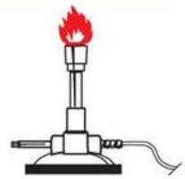

> 🧠 **[Cognis Multimodal Enrichment]**
> * **Classification:** Scientific Figure
> * **VLM Visual Summary:** **FIGURE TYPE:** Laboratory Equipment Photograph
>   
>   **SCIENTIFIC PURPOSE:** This figure illustrates a Bunsen burner, which is commonly used in laboratories for heating purposes.
>   
>   **KEY KNOWLEDGE:**
>   - **Bunsen Burner:** A type of laboratory burner that uses compressed gas to produce a high-temperature flame.
>   - **Flame Types:** The Bunsen burner typically produces a blue flame, which is ideal for most chemical reactions requiring moderate heat.
>   - **Safety Precautions:** It is crucial to handle Bunsen burners safely due to their high temperature and potential for burns.
>   
>   **LABEL INTERPRETATION:**
>   - **Bunsen Burner:** The main object in the image.
>   - **Flame:** The visible part of the Bunsen burner where combustion occurs.
>   
>   **ENGINEERING/SCIENTIFIC INSIGHTS:**
>   - Understanding how to use a Bunsen burner correctly is essential for performing various chemical reactions and experiments accurately.
>   - Proper handling and safety measures are necessary to avoid accidents such as burns or explosions.
>   
>   **USER-RELEVANT INFORMATION:**
>   - The specific design and features of the Bunsen burner can vary depending on the laboratory setting and the type of experiment being conducted.
>   - The flame type (blue) is important for certain reactions but may not be suitable for all types of chemical processes.
>   - Safety protocols related to Bunsen burners include proper placement, use of protective gear, and ensuring that the flame is always attended to.
> * **Figure Caption:** Identify hazardousmaterials before beginning labs. | Beattentive
> * **Surrounding Context (+/- 300 words):**
>   * **[Before]:** *... using CHNS analyzer</td><td rowspan=1 colspan=1>29</td></tr><tr><td rowspan=1 colspan=1>10.</td><td rowspan=1 colspan=1>Surface characterization using Optical Microscopy</td><td rowspan=1 colspan=1>33</td></tr></table> [Section: Instrumental Methods of Analysis (CHC506) > Index:-] Lab Manual for Instrumental Methods of Analysis (CHC 506) L: T: P: 0-0-2 Course Title : Instrumental Methods of Analysis Course Objectives : To teach and provide a hands-on experience for different analytical equipment/instruments that are useful for carrying out research in different areas in Chemical Engineering. Learning Outcomes : Students will be proficient for the use of studied instrumental techniques in chemical engineering research. [Section: Instrumental Methods of Analysis (CHC506) > Index:-] <table><tr><td rowspan=1 colspan=1>Units</td><td rowspan=1 colspan=1>Name of the experiment</td></tr><tr><td rowspan=5 colspan=1> 1. Analytical instruments/equipment</td><td rowspan=1 colspan=1> Size reduction studies using Planetary ball mill</td></tr><tr><td rowspan=1 colspan=1>Particle size distribution measurements using Particle sizeAnalyzer</td></tr><tr><td rowspan=1 colspan=1> Particle size distribution measurements using Zeta Sizer</td></tr><tr><td rowspan=1 colspan=1> Detection of functional groups using FTIR Analysis</td></tr><tr><td rowspan=1 colspan=1> Studies on UV-VIS spectrometry</td></tr><tr><td rowspan=2 colspan=1>2. Flowcharacterization &amp; wettability</td><td rowspan=1 colspan=1>Rheometric analysis of fluids using Rheometer</td></tr><tr><td rowspan=1 colspan=1> Contact angle measurements techniques using Goniometer</td></tr><tr><td rowspan=2 colspan=1> 3. Optical instruments</td><td rowspan=1 colspan=1> Surface characterization using Optical Microscopy</td></tr><tr><td rowspan=1 colspan=1> Refractive index measurement using Refractometer</td></tr><tr><td rowspan=1 colspan=1>4. Elemental analysis</td><td rowspan=1 colspan=1> Ultimate analysis of solid fuel using CHNS analyzer</td></tr></table> Dress appropriately Lab Safety Rules [Section: Lab Safety Rules] Science labs offer great opportunitiesfor learning, teaching,and research. Theyalso pose hazards thatrequire propersafety precautions. Stay safe when conducting your labsby following these guidelines. Proper supervision Dontperform labexperimentswithout instructor supervision (unless given permission todo so). Tieback long hair,and wear suitable gloves, goggles,and otherprotective equipment. [Section: Lab Safety Rules > Know location of emergency numbers&safety equipment] Knowthelocation of safety equipmentand emergencyphone numbers (suchaspoisoncontrol)soyoucanaccessthemquicklyifnecessary [Section: Lab Safety Rules > No food] Donteat ordrink in the laband never taste chemicals. [Section: Lab Safety Rules > ID hazards] Identify hazardousmaterials before beginning labs.*
>   * **[After]:** *Beattentive Beattentive while in the lab. Don'tleavelit Bunsenburners unattended or leaveanexperiment inprogress. [Section: Lab Safety Rules > Becareful when handling hot glassware] Turnoff allheatingappliances when not inuse.Keepflammable objectsawayfromyourworkspace. Keep aclean workspace Don't obstruct work areas, floors,orexits.Keepcoats bags,and otherpersonal items stored indesignatedareas away from thelab.Don'tblock sink drains with debris. Handle glassware carefully Properlydisposeofanything thatbreaks.Reportcuts, spills,and broken glass to yourinstructorimmediately. [Section: Lab Safety Rules > Cleanup] Aftercompleting the lab carefully clean yourworkspace and theequipment,and wash your hands. Lab Manual for Instrumental Methods of Analysis (CHC 506) [Section: Lab Safety Rules > Lab Safety Do's and Don'ts for Students] Use this handy checklist to acquaint students with safety do's and don’ts in the laboratory. [Section: Lab Safety Rules > Conduct] ▪ Do not engage in practical jokes or boisterous conduct in the laboratory. ▪ Never run in the laboratory. ▪ The use of personal audio or video equipment is prohibited in the laboratory ▪ The performance of unauthorized experiments is strictly forbidden ▪ Do not sit on laboratory benches. [Section: Lab Safety Rules > General Work Procedure] Know emergency procedures. ▪ Never work in the laboratory without the supervision of an instructor. ▪ Always perform the experiments or work precisely as directed by your instructor. ▪ Immediately report any spills, accidents, or injuries to your instructor. ▪ Never leave experiments while in progress. ▪ Never attempt to catch a falling object. ▪ Be careful when handling hot glassware and apparatus in the laboratory. Hot glassware looks just like cold glassware. ▪ Never point the open end of a test tube containing a substance at yourself or others. ▪ Never fill a pipette using mouth suction. Always use a pipetting device. ▪ Make sure no flammable solvents are in the surrounding area when lighting a flame. ▪ Do not leave lit Bunsen burners unattended. ...*
  
Beattentive  
Beattentive while in the lab. Don'tleavelit Bunsenburners unattended or leaveanexperiment inprogress.

## Becareful when handling hot glassware

Turnoff allheatingappliances when not inuse.Keepflammable objectsawayfromyourworkspace.

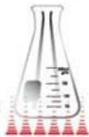

> 🧠 **[Cognis Multimodal Enrichment]**
> * **Classification:** Scientific Figure
> * **VLM Visual Summary:** **FIGURE TYPE:** Laboratory Equipment Photograph
>   
>   **SCIENTIFIC PURPOSE:** This figure illustrates a laboratory safety precaution related to the proper use of heating appliances.
>   
>   **KEY KNOWLEDGE:**
>   - **Turn off all heating appliances when not in use.**
>   - **Keep flammable objects away from your workspace.**
>   - **Keep a clean workspace.**
>   
>   **LABEL INTERPRETATION:**
>   - **Heating Apparatus:** The image shows a heating apparatus, likely a Bunsen burner or a similar instrument used for heating samples in a laboratory setting.
>   
>   **ENGINEERING/SCIENTIFIC INSIGHTS:**
>   - A reader should learn to turn off heating appliances when they are not in use to prevent accidents and ensure safety in the laboratory.
>   
>   **USER-RELEVANT INFORMATION:**
>   - The importance of keeping flammable objects away from the workspace and maintaining a clean environment to avoid hazards and maintain safety standards in the laboratory.
> * **Figure Caption:** Turnoff allheatingappliances when not inuse.Keepflammable objectsawayfromyourworkspace. | Keep aclean workspace
> * **Surrounding Context (+/- 300 words):**
>   * **[Before]:** *... of Analysis (CHC 506) L: T: P: 0-0-2 Course Title : Instrumental Methods of Analysis Course Objectives : To teach and provide a hands-on experience for different analytical equipment/instruments that are useful for carrying out research in different areas in Chemical Engineering. Learning Outcomes : Students will be proficient for the use of studied instrumental techniques in chemical engineering research. [Section: Instrumental Methods of Analysis (CHC506) > Index:-] <table><tr><td rowspan=1 colspan=1>Units</td><td rowspan=1 colspan=1>Name of the experiment</td></tr><tr><td rowspan=5 colspan=1> 1. Analytical instruments/equipment</td><td rowspan=1 colspan=1> Size reduction studies using Planetary ball mill</td></tr><tr><td rowspan=1 colspan=1>Particle size distribution measurements using Particle sizeAnalyzer</td></tr><tr><td rowspan=1 colspan=1> Particle size distribution measurements using Zeta Sizer</td></tr><tr><td rowspan=1 colspan=1> Detection of functional groups using FTIR Analysis</td></tr><tr><td rowspan=1 colspan=1> Studies on UV-VIS spectrometry</td></tr><tr><td rowspan=2 colspan=1>2. Flowcharacterization &amp; wettability</td><td rowspan=1 colspan=1>Rheometric analysis of fluids using Rheometer</td></tr><tr><td rowspan=1 colspan=1> Contact angle measurements techniques using Goniometer</td></tr><tr><td rowspan=2 colspan=1> 3. Optical instruments</td><td rowspan=1 colspan=1> Surface characterization using Optical Microscopy</td></tr><tr><td rowspan=1 colspan=1> Refractive index measurement using Refractometer</td></tr><tr><td rowspan=1 colspan=1>4. Elemental analysis</td><td rowspan=1 colspan=1> Ultimate analysis of solid fuel using CHNS analyzer</td></tr></table> Dress appropriately Lab Safety Rules [Section: Lab Safety Rules] Science labs offer great opportunitiesfor learning, teaching,and research. Theyalso pose hazards thatrequire propersafety precautions. Stay safe when conducting your labsby following these guidelines. Proper supervision Dontperform labexperimentswithout instructor supervision (unless given permission todo so). Tieback long hair,and wear suitable gloves, goggles,and otherprotective equipment. [Section: Lab Safety Rules > Know location of emergency numbers&safety equipment] Knowthelocation of safety equipmentand emergencyphone numbers (suchaspoisoncontrol)soyoucanaccessthemquicklyifnecessary [Section: Lab Safety Rules > No food] Donteat ordrink in the laband never taste chemicals. [Section: Lab Safety Rules > ID hazards] Identify hazardousmaterials before beginning labs. Beattentive Beattentive while in the lab. Don'tleavelit Bunsenburners unattended or leaveanexperiment inprogress. [Section: Lab Safety Rules > Becareful when handling hot glassware] Turnoff allheatingappliances when not inuse.Keepflammable objectsawayfromyourworkspace.*
>   * **[After]:** *Keep aclean workspace Don't obstruct work areas, floors,orexits.Keepcoats bags,and otherpersonal items stored indesignatedareas away from thelab.Don'tblock sink drains with debris. Handle glassware carefully Properlydisposeofanything thatbreaks.Reportcuts, spills,and broken glass to yourinstructorimmediately. [Section: Lab Safety Rules > Cleanup] Aftercompleting the lab carefully clean yourworkspace and theequipment,and wash your hands. Lab Manual for Instrumental Methods of Analysis (CHC 506) [Section: Lab Safety Rules > Lab Safety Do's and Don'ts for Students] Use this handy checklist to acquaint students with safety do's and don’ts in the laboratory. [Section: Lab Safety Rules > Conduct] ▪ Do not engage in practical jokes or boisterous conduct in the laboratory. ▪ Never run in the laboratory. ▪ The use of personal audio or video equipment is prohibited in the laboratory ▪ The performance of unauthorized experiments is strictly forbidden ▪ Do not sit on laboratory benches. [Section: Lab Safety Rules > General Work Procedure] Know emergency procedures. ▪ Never work in the laboratory without the supervision of an instructor. ▪ Always perform the experiments or work precisely as directed by your instructor. ▪ Immediately report any spills, accidents, or injuries to your instructor. ▪ Never leave experiments while in progress. ▪ Never attempt to catch a falling object. ▪ Be careful when handling hot glassware and apparatus in the laboratory. Hot glassware looks just like cold glassware. ▪ Never point the open end of a test tube containing a substance at yourself or others. ▪ Never fill a pipette using mouth suction. Always use a pipetting device. ▪ Make sure no flammable solvents are in the surrounding area when lighting a flame. ▪ Do not leave lit Bunsen burners unattended. ▪ Turn off all heating apparatus, gas valves, and water faucets when not in use. ▪ Do not remove any equipment or chemicals from the laboratory ▪ Store ...*

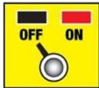

> 🧠 **[Cognis Multimodal Enrichment]**
> * **Classification:** Scientific Figure
> * **Extracted Text (OCR):** `OFF, ON`
> * **VLM Visual Summary:** **FIGURE TYPE:** Safety Signage
>   
>   **SCIENTIFIC PURPOSE:** This figure serves as a safety reminder related to the proper use of laboratory equipment and safety protocols.
>   
>   **KEY KNOWLEDGE:**
>   - **Turn off all heating appliances when not in use.** This is a crucial safety measure to prevent accidents and ensure the safety of the laboratory environment.
>   - **Keep flammable objects away from your workspace.** Flammable materials can cause serious hazards if they come into contact with heat sources or other ignition sources.
>   - **Keep a clean workspace.** Cluttered workspaces increase the risk of accidents and make it difficult to locate necessary tools or equipment quickly.
>   
>   **LABEL INTERPRETATION:**
>   - **OFF:** Indicates that the heating appliance should be turned off.
>   - **ON:** Indicates that the heating appliance should be turned on.
>   
>   **ENGINEERING/SCIENTIFIC INSIGHTS:**
>   - Understanding how to properly turn off and on heating appliances is essential for maintaining a safe working environment in the laboratory.
>   - Keeping flammable objects away from the workspace helps prevent fires and explosions.
>   - Keeping the workspace clean ensures that all necessary tools and equipment are easily accessible and reduces the risk of accidents.
>   
>   **USER-RELEVANT INFORMATION:**
>   - The importance of following these safety guidelines is emphasized in the surrounding text, which includes additional safety rules such as:
>     - Not eating or drinking in the lab.
>     - Not leaving lit Bunsen burners unattended.
>     - Not removing equipment or chemicals from the laboratory.
>     - Storing coats, bags, and other personal items in designated areas.
>     - Reporting cuts, spills, and broken glass immediately.
>   
>   These guidelines collectively contribute to creating a safer and more efficient laboratory environment.
> * **Figure Caption:** Turnoff allheatingappliances when not inuse.Keepflammable objectsawayfromyourworkspace. | Keep aclean workspace
> * **Surrounding Context (+/- 300 words):**
>   * **[Before]:** *... of Analysis (CHC 506) L: T: P: 0-0-2 Course Title : Instrumental Methods of Analysis Course Objectives : To teach and provide a hands-on experience for different analytical equipment/instruments that are useful for carrying out research in different areas in Chemical Engineering. Learning Outcomes : Students will be proficient for the use of studied instrumental techniques in chemical engineering research. [Section: Instrumental Methods of Analysis (CHC506) > Index:-] <table><tr><td rowspan=1 colspan=1>Units</td><td rowspan=1 colspan=1>Name of the experiment</td></tr><tr><td rowspan=5 colspan=1> 1. Analytical instruments/equipment</td><td rowspan=1 colspan=1> Size reduction studies using Planetary ball mill</td></tr><tr><td rowspan=1 colspan=1>Particle size distribution measurements using Particle sizeAnalyzer</td></tr><tr><td rowspan=1 colspan=1> Particle size distribution measurements using Zeta Sizer</td></tr><tr><td rowspan=1 colspan=1> Detection of functional groups using FTIR Analysis</td></tr><tr><td rowspan=1 colspan=1> Studies on UV-VIS spectrometry</td></tr><tr><td rowspan=2 colspan=1>2. Flowcharacterization &amp; wettability</td><td rowspan=1 colspan=1>Rheometric analysis of fluids using Rheometer</td></tr><tr><td rowspan=1 colspan=1> Contact angle measurements techniques using Goniometer</td></tr><tr><td rowspan=2 colspan=1> 3. Optical instruments</td><td rowspan=1 colspan=1> Surface characterization using Optical Microscopy</td></tr><tr><td rowspan=1 colspan=1> Refractive index measurement using Refractometer</td></tr><tr><td rowspan=1 colspan=1>4. Elemental analysis</td><td rowspan=1 colspan=1> Ultimate analysis of solid fuel using CHNS analyzer</td></tr></table> Dress appropriately Lab Safety Rules [Section: Lab Safety Rules] Science labs offer great opportunitiesfor learning, teaching,and research. Theyalso pose hazards thatrequire propersafety precautions. Stay safe when conducting your labsby following these guidelines. Proper supervision Dontperform labexperimentswithout instructor supervision (unless given permission todo so). Tieback long hair,and wear suitable gloves, goggles,and otherprotective equipment. [Section: Lab Safety Rules > Know location of emergency numbers&safety equipment] Knowthelocation of safety equipmentand emergencyphone numbers (suchaspoisoncontrol)soyoucanaccessthemquicklyifnecessary [Section: Lab Safety Rules > No food] Donteat ordrink in the laband never taste chemicals. [Section: Lab Safety Rules > ID hazards] Identify hazardousmaterials before beginning labs. Beattentive Beattentive while in the lab. Don'tleavelit Bunsenburners unattended or leaveanexperiment inprogress. [Section: Lab Safety Rules > Becareful when handling hot glassware] Turnoff allheatingappliances when not inuse.Keepflammable objectsawayfromyourworkspace.*
>   * **[After]:** *Keep aclean workspace Don't obstruct work areas, floors,orexits.Keepcoats bags,and otherpersonal items stored indesignatedareas away from thelab.Don'tblock sink drains with debris. Handle glassware carefully Properlydisposeofanything thatbreaks.Reportcuts, spills,and broken glass to yourinstructorimmediately. [Section: Lab Safety Rules > Cleanup] Aftercompleting the lab carefully clean yourworkspace and theequipment,and wash your hands. Lab Manual for Instrumental Methods of Analysis (CHC 506) [Section: Lab Safety Rules > Lab Safety Do's and Don'ts for Students] Use this handy checklist to acquaint students with safety do's and don’ts in the laboratory. [Section: Lab Safety Rules > Conduct] ▪ Do not engage in practical jokes or boisterous conduct in the laboratory. ▪ Never run in the laboratory. ▪ The use of personal audio or video equipment is prohibited in the laboratory ▪ The performance of unauthorized experiments is strictly forbidden ▪ Do not sit on laboratory benches. [Section: Lab Safety Rules > General Work Procedure] Know emergency procedures. ▪ Never work in the laboratory without the supervision of an instructor. ▪ Always perform the experiments or work precisely as directed by your instructor. ▪ Immediately report any spills, accidents, or injuries to your instructor. ▪ Never leave experiments while in progress. ▪ Never attempt to catch a falling object. ▪ Be careful when handling hot glassware and apparatus in the laboratory. Hot glassware looks just like cold glassware. ▪ Never point the open end of a test tube containing a substance at yourself or others. ▪ Never fill a pipette using mouth suction. Always use a pipetting device. ▪ Make sure no flammable solvents are in the surrounding area when lighting a flame. ▪ Do not leave lit Bunsen burners unattended. ▪ Turn off all heating apparatus, gas valves, and water faucets when not in use. ▪ Do not remove any equipment or chemicals from the laboratory ▪ Store ...*

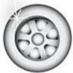

> 🧠 **[Cognis Multimodal Enrichment]**
> * **Classification:** Logo / Decorative Image (filtered out)

> 🧠 **[Cognis Multimodal Enrichment]**
> * **Classification:** Scientific Figure
> * **Extracted Text (OCR):** `coats and bags`
> * **VLM Visual Summary:** **FIGURE TYPE:** Safety Signage
>   
>   **SCIENTIFIC PURPOSE:** This figure serves as a safety sign to remind users to turn off all heating appliances when not in use and to keep flammable objects away from their workspace.
>   
>   **KEY KNOWLEDGE:**
>   - **Safety Precautions:** Turning off heating appliances and keeping flammable objects away are crucial safety measures in laboratories.
>   - **Workplace Organization:** Keeping coats, bags, and other personal items in designated areas helps maintain a clean workspace.
>   - **Proper Handling of Glassware:** Handling glassware carefully and disposing of broken glass properly are essential for maintaining a safe environment.
>   
>   **LABEL INTERPRETATION:** 
>   - The labels indicate specific instructions related to safety and proper workspace management.
>   
>   **ENGINEERING/SCIENTIFIC INSIGHTS:** 
>   - Understanding the importance of turning off heating appliances and keeping flammable objects away can prevent accidents and ensure a safer working environment in laboratories.
>   
>   **USER-RELEVANT INFORMATION:**
>   - The figure emphasizes the need to follow safety guidelines to avoid accidents and maintain a clean workspace.
> * **Figure Caption:** Turnoff allheatingappliances when not inuse.Keepflammable objectsawayfromyourworkspace. | Keep aclean workspace
> * **Surrounding Context (+/- 300 words):**
>   * **[Before]:** *... of Analysis (CHC 506) L: T: P: 0-0-2 Course Title : Instrumental Methods of Analysis Course Objectives : To teach and provide a hands-on experience for different analytical equipment/instruments that are useful for carrying out research in different areas in Chemical Engineering. Learning Outcomes : Students will be proficient for the use of studied instrumental techniques in chemical engineering research. [Section: Instrumental Methods of Analysis (CHC506) > Index:-] <table><tr><td rowspan=1 colspan=1>Units</td><td rowspan=1 colspan=1>Name of the experiment</td></tr><tr><td rowspan=5 colspan=1> 1. Analytical instruments/equipment</td><td rowspan=1 colspan=1> Size reduction studies using Planetary ball mill</td></tr><tr><td rowspan=1 colspan=1>Particle size distribution measurements using Particle sizeAnalyzer</td></tr><tr><td rowspan=1 colspan=1> Particle size distribution measurements using Zeta Sizer</td></tr><tr><td rowspan=1 colspan=1> Detection of functional groups using FTIR Analysis</td></tr><tr><td rowspan=1 colspan=1> Studies on UV-VIS spectrometry</td></tr><tr><td rowspan=2 colspan=1>2. Flowcharacterization &amp; wettability</td><td rowspan=1 colspan=1>Rheometric analysis of fluids using Rheometer</td></tr><tr><td rowspan=1 colspan=1> Contact angle measurements techniques using Goniometer</td></tr><tr><td rowspan=2 colspan=1> 3. Optical instruments</td><td rowspan=1 colspan=1> Surface characterization using Optical Microscopy</td></tr><tr><td rowspan=1 colspan=1> Refractive index measurement using Refractometer</td></tr><tr><td rowspan=1 colspan=1>4. Elemental analysis</td><td rowspan=1 colspan=1> Ultimate analysis of solid fuel using CHNS analyzer</td></tr></table> Dress appropriately Lab Safety Rules [Section: Lab Safety Rules] Science labs offer great opportunitiesfor learning, teaching,and research. Theyalso pose hazards thatrequire propersafety precautions. Stay safe when conducting your labsby following these guidelines. Proper supervision Dontperform labexperimentswithout instructor supervision (unless given permission todo so). Tieback long hair,and wear suitable gloves, goggles,and otherprotective equipment. [Section: Lab Safety Rules > Know location of emergency numbers&safety equipment] Knowthelocation of safety equipmentand emergencyphone numbers (suchaspoisoncontrol)soyoucanaccessthemquicklyifnecessary [Section: Lab Safety Rules > No food] Donteat ordrink in the laband never taste chemicals. [Section: Lab Safety Rules > ID hazards] Identify hazardousmaterials before beginning labs. Beattentive Beattentive while in the lab. Don'tleavelit Bunsenburners unattended or leaveanexperiment inprogress. [Section: Lab Safety Rules > Becareful when handling hot glassware] Turnoff allheatingappliances when not inuse.Keepflammable objectsawayfromyourworkspace.*
>   * **[After]:** *Keep aclean workspace Don't obstruct work areas, floors,orexits.Keepcoats bags,and otherpersonal items stored indesignatedareas away from thelab.Don'tblock sink drains with debris. Handle glassware carefully Properlydisposeofanything thatbreaks.Reportcuts, spills,and broken glass to yourinstructorimmediately. [Section: Lab Safety Rules > Cleanup] Aftercompleting the lab carefully clean yourworkspace and theequipment,and wash your hands. Lab Manual for Instrumental Methods of Analysis (CHC 506) [Section: Lab Safety Rules > Lab Safety Do's and Don'ts for Students] Use this handy checklist to acquaint students with safety do's and don’ts in the laboratory. [Section: Lab Safety Rules > Conduct] ▪ Do not engage in practical jokes or boisterous conduct in the laboratory. ▪ Never run in the laboratory. ▪ The use of personal audio or video equipment is prohibited in the laboratory ▪ The performance of unauthorized experiments is strictly forbidden ▪ Do not sit on laboratory benches. [Section: Lab Safety Rules > General Work Procedure] Know emergency procedures. ▪ Never work in the laboratory without the supervision of an instructor. ▪ Always perform the experiments or work precisely as directed by your instructor. ▪ Immediately report any spills, accidents, or injuries to your instructor. ▪ Never leave experiments while in progress. ▪ Never attempt to catch a falling object. ▪ Be careful when handling hot glassware and apparatus in the laboratory. Hot glassware looks just like cold glassware. ▪ Never point the open end of a test tube containing a substance at yourself or others. ▪ Never fill a pipette using mouth suction. Always use a pipetting device. ▪ Make sure no flammable solvents are in the surrounding area when lighting a flame. ▪ Do not leave lit Bunsen burners unattended. ▪ Turn off all heating apparatus, gas valves, and water faucets when not in use. ▪ Do not remove any equipment or chemicals from the laboratory ▪ Store ...*

Keep aclean workspace

Don't obstruct work areas, floors,orexits.Keepcoats bags,and otherpersonal items stored indesignatedareas away from thelab.Don'tblock sink drains with debris.

> 🧠 **[Cognis Multimodal Enrichment]**
> * **Classification:** Scientific Figure
> * **VLM Visual Summary:** ### FIGURE TYPE:
>   **Laboratory Equipment Photograph**
>   
>   ### SCIENTIFIC PURPOSE:
>   The figure illustrates a common laboratory instrument used for measuring the thickness of materials or coatings. This instrument is typically used in various fields such as chemistry, materials science, and manufacturing to ensure that the coating thickness meets the required specifications.
>   
>   ### KEY KNOWLEDGE:
>   - **Instrument Name:** Thickness Gauge
>   - **Function:** Measures the thickness of thin films, coatings, or layers on surfaces.
>   - **Components:** Includes a probe that contacts the surface being measured, a display screen to show the thickness reading, and a handle for manual operation.
>   - **Usage:** Commonly used in quality control, coating industries, and material science research to ensure uniformity and thickness consistency.
>   
>   ### LABEL INTERPRETATION:
>   - **Scale:** Indicates the range of thickness measurements possible.
>   - **Handle:** Used for manual operation and stability during measurement.
>   - **Display Screen:** Shows the current thickness reading.
>   
>   ### ENGINEERING/SCIENTIFIC INSIGHTS:
>   A reader should learn how to use a thickness gauge correctly to measure the thickness of coatings or thin films accurately. This instrument is essential for ensuring that coatings meet industry standards and for quality control purposes.
>   
>   ### USER-RELEVANT INFORMATION:
>   - **Scale Range:** The specific range of thickness measurements provided by the gauge.
>   - **Accuracy:** The precision of the thickness readings.
>   - **Use Cases:** Common applications include coating thickness testing in automotive, aerospace, and electronic industries.
>   
>   This information can help answer future questions about the specific uses and applications of thickness gauges in various industries.
> * **Figure Caption:** Don't obstruct work areas, floors,orexits.Keepcoats bags,and otherpersonal items stored indesignatedareas away from thelab.Don'tblock sink drains with debris. | Handle glassware carefully
> * **Surrounding Context (+/- 300 words):**
>   * **[Before]:** *... and provide a hands-on experience for different analytical equipment/instruments that are useful for carrying out research in different areas in Chemical Engineering. Learning Outcomes : Students will be proficient for the use of studied instrumental techniques in chemical engineering research. [Section: Instrumental Methods of Analysis (CHC506) > Index:-] <table><tr><td rowspan=1 colspan=1>Units</td><td rowspan=1 colspan=1>Name of the experiment</td></tr><tr><td rowspan=5 colspan=1> 1. Analytical instruments/equipment</td><td rowspan=1 colspan=1> Size reduction studies using Planetary ball mill</td></tr><tr><td rowspan=1 colspan=1>Particle size distribution measurements using Particle sizeAnalyzer</td></tr><tr><td rowspan=1 colspan=1> Particle size distribution measurements using Zeta Sizer</td></tr><tr><td rowspan=1 colspan=1> Detection of functional groups using FTIR Analysis</td></tr><tr><td rowspan=1 colspan=1> Studies on UV-VIS spectrometry</td></tr><tr><td rowspan=2 colspan=1>2. Flowcharacterization &amp; wettability</td><td rowspan=1 colspan=1>Rheometric analysis of fluids using Rheometer</td></tr><tr><td rowspan=1 colspan=1> Contact angle measurements techniques using Goniometer</td></tr><tr><td rowspan=2 colspan=1> 3. Optical instruments</td><td rowspan=1 colspan=1> Surface characterization using Optical Microscopy</td></tr><tr><td rowspan=1 colspan=1> Refractive index measurement using Refractometer</td></tr><tr><td rowspan=1 colspan=1>4. Elemental analysis</td><td rowspan=1 colspan=1> Ultimate analysis of solid fuel using CHNS analyzer</td></tr></table> Dress appropriately Lab Safety Rules [Section: Lab Safety Rules] Science labs offer great opportunitiesfor learning, teaching,and research. Theyalso pose hazards thatrequire propersafety precautions. Stay safe when conducting your labsby following these guidelines. Proper supervision Dontperform labexperimentswithout instructor supervision (unless given permission todo so). Tieback long hair,and wear suitable gloves, goggles,and otherprotective equipment. [Section: Lab Safety Rules > Know location of emergency numbers&safety equipment] Knowthelocation of safety equipmentand emergencyphone numbers (suchaspoisoncontrol)soyoucanaccessthemquicklyifnecessary [Section: Lab Safety Rules > No food] Donteat ordrink in the laband never taste chemicals. [Section: Lab Safety Rules > ID hazards] Identify hazardousmaterials before beginning labs. Beattentive Beattentive while in the lab. Don'tleavelit Bunsenburners unattended or leaveanexperiment inprogress. [Section: Lab Safety Rules > Becareful when handling hot glassware] Turnoff allheatingappliances when not inuse.Keepflammable objectsawayfromyourworkspace. Keep aclean workspace Don't obstruct work areas, floors,orexits.Keepcoats bags,and otherpersonal items stored indesignatedareas away from thelab.Don'tblock sink drains with debris.*
>   * **[After]:** *Handle glassware carefully Properlydisposeofanything thatbreaks.Reportcuts, spills,and broken glass to yourinstructorimmediately. [Section: Lab Safety Rules > Cleanup] Aftercompleting the lab carefully clean yourworkspace and theequipment,and wash your hands. Lab Manual for Instrumental Methods of Analysis (CHC 506) [Section: Lab Safety Rules > Lab Safety Do's and Don'ts for Students] Use this handy checklist to acquaint students with safety do's and don’ts in the laboratory. [Section: Lab Safety Rules > Conduct] ▪ Do not engage in practical jokes or boisterous conduct in the laboratory. ▪ Never run in the laboratory. ▪ The use of personal audio or video equipment is prohibited in the laboratory ▪ The performance of unauthorized experiments is strictly forbidden ▪ Do not sit on laboratory benches. [Section: Lab Safety Rules > General Work Procedure] Know emergency procedures. ▪ Never work in the laboratory without the supervision of an instructor. ▪ Always perform the experiments or work precisely as directed by your instructor. ▪ Immediately report any spills, accidents, or injuries to your instructor. ▪ Never leave experiments while in progress. ▪ Never attempt to catch a falling object. ▪ Be careful when handling hot glassware and apparatus in the laboratory. Hot glassware looks just like cold glassware. ▪ Never point the open end of a test tube containing a substance at yourself or others. ▪ Never fill a pipette using mouth suction. Always use a pipetting device. ▪ Make sure no flammable solvents are in the surrounding area when lighting a flame. ▪ Do not leave lit Bunsen burners unattended. ▪ Turn off all heating apparatus, gas valves, and water faucets when not in use. ▪ Do not remove any equipment or chemicals from the laboratory ▪ Store coats, bags, and other personal items in designated areas. ▪ Notify your instructor of any sensitivities that you may have ...*

Handle glassware carefully

Properlydisposeofanything thatbreaks.Reportcuts, spills,and broken glass to yourinstructorimmediately.

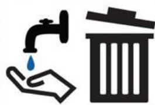

> 🧠 **[Cognis Multimodal Enrichment]**
> * **Classification:** Scientific Figure
> * **VLM Visual Summary:** **FIGURE TYPE:** Safety Signage
>   
>   **SCIENTIFIC PURPOSE:** This figure serves as a safety guideline for proper disposal of laboratory waste.
>   
>   **KEY KNOWLEDGE:**
>   - Properly dispose of anything that breaks, spills, or has broken glass.
>   - Report cuts, spills, and broken glass to the instructor immediately.
>   
>   **LABEL INTERPRETATION:**
>   - **Faucet:** Represents a water source for washing hands.
>   - **Trash Bin:** Represents a receptacle for disposing of waste.
>   
>   **ENGINEERING/SCIENTIFIC INSIGHTS:**
>   - The figure emphasizes the importance of maintaining cleanliness and safety in the laboratory environment.
>   - It highlights the need to handle and dispose of hazardous materials responsibly to prevent accidents and contamination.
>   
>   **USER-RELEVANT INFORMATION:**
>   - The figure provides clear instructions on how to safely dispose of laboratory waste, which can help prevent accidents and maintain a safe working environment.
> * **Figure Caption:** Properlydisposeofanything thatbreaks.Reportcuts, spills,and broken glass to yourinstructorimmediately. | [Section: Lab Safety Rules > Cleanup]
> * **Surrounding Context (+/- 300 words):**
>   * **[Before]:** *... are useful for carrying out research in different areas in Chemical Engineering. Learning Outcomes : Students will be proficient for the use of studied instrumental techniques in chemical engineering research. [Section: Instrumental Methods of Analysis (CHC506) > Index:-] <table><tr><td rowspan=1 colspan=1>Units</td><td rowspan=1 colspan=1>Name of the experiment</td></tr><tr><td rowspan=5 colspan=1> 1. Analytical instruments/equipment</td><td rowspan=1 colspan=1> Size reduction studies using Planetary ball mill</td></tr><tr><td rowspan=1 colspan=1>Particle size distribution measurements using Particle sizeAnalyzer</td></tr><tr><td rowspan=1 colspan=1> Particle size distribution measurements using Zeta Sizer</td></tr><tr><td rowspan=1 colspan=1> Detection of functional groups using FTIR Analysis</td></tr><tr><td rowspan=1 colspan=1> Studies on UV-VIS spectrometry</td></tr><tr><td rowspan=2 colspan=1>2. Flowcharacterization &amp; wettability</td><td rowspan=1 colspan=1>Rheometric analysis of fluids using Rheometer</td></tr><tr><td rowspan=1 colspan=1> Contact angle measurements techniques using Goniometer</td></tr><tr><td rowspan=2 colspan=1> 3. Optical instruments</td><td rowspan=1 colspan=1> Surface characterization using Optical Microscopy</td></tr><tr><td rowspan=1 colspan=1> Refractive index measurement using Refractometer</td></tr><tr><td rowspan=1 colspan=1>4. Elemental analysis</td><td rowspan=1 colspan=1> Ultimate analysis of solid fuel using CHNS analyzer</td></tr></table> Dress appropriately Lab Safety Rules [Section: Lab Safety Rules] Science labs offer great opportunitiesfor learning, teaching,and research. Theyalso pose hazards thatrequire propersafety precautions. Stay safe when conducting your labsby following these guidelines. Proper supervision Dontperform labexperimentswithout instructor supervision (unless given permission todo so). Tieback long hair,and wear suitable gloves, goggles,and otherprotective equipment. [Section: Lab Safety Rules > Know location of emergency numbers&safety equipment] Knowthelocation of safety equipmentand emergencyphone numbers (suchaspoisoncontrol)soyoucanaccessthemquicklyifnecessary [Section: Lab Safety Rules > No food] Donteat ordrink in the laband never taste chemicals. [Section: Lab Safety Rules > ID hazards] Identify hazardousmaterials before beginning labs. Beattentive Beattentive while in the lab. Don'tleavelit Bunsenburners unattended or leaveanexperiment inprogress. [Section: Lab Safety Rules > Becareful when handling hot glassware] Turnoff allheatingappliances when not inuse.Keepflammable objectsawayfromyourworkspace. Keep aclean workspace Don't obstruct work areas, floors,orexits.Keepcoats bags,and otherpersonal items stored indesignatedareas away from thelab.Don'tblock sink drains with debris. Handle glassware carefully Properlydisposeofanything thatbreaks.Reportcuts, spills,and broken glass to yourinstructorimmediately.*
>   * **[After]:** *[Section: Lab Safety Rules > Cleanup] Aftercompleting the lab carefully clean yourworkspace and theequipment,and wash your hands. Lab Manual for Instrumental Methods of Analysis (CHC 506) [Section: Lab Safety Rules > Lab Safety Do's and Don'ts for Students] Use this handy checklist to acquaint students with safety do's and don’ts in the laboratory. [Section: Lab Safety Rules > Conduct] ▪ Do not engage in practical jokes or boisterous conduct in the laboratory. ▪ Never run in the laboratory. ▪ The use of personal audio or video equipment is prohibited in the laboratory ▪ The performance of unauthorized experiments is strictly forbidden ▪ Do not sit on laboratory benches. [Section: Lab Safety Rules > General Work Procedure] Know emergency procedures. ▪ Never work in the laboratory without the supervision of an instructor. ▪ Always perform the experiments or work precisely as directed by your instructor. ▪ Immediately report any spills, accidents, or injuries to your instructor. ▪ Never leave experiments while in progress. ▪ Never attempt to catch a falling object. ▪ Be careful when handling hot glassware and apparatus in the laboratory. Hot glassware looks just like cold glassware. ▪ Never point the open end of a test tube containing a substance at yourself or others. ▪ Never fill a pipette using mouth suction. Always use a pipetting device. ▪ Make sure no flammable solvents are in the surrounding area when lighting a flame. ▪ Do not leave lit Bunsen burners unattended. ▪ Turn off all heating apparatus, gas valves, and water faucets when not in use. ▪ Do not remove any equipment or chemicals from the laboratory ▪ Store coats, bags, and other personal items in designated areas. ▪ Notify your instructor of any sensitivities that you may have to particular chemicals. ▪ Keep the floor clear of all ...*

## Cleanup

Aftercompleting the lab carefully clean yourworkspace and theequipment,and wash your hands.

Lab Manual for Instrumental Methods of Analysis (CHC 506)

## Lab Safety Do's and Don'ts for Students

Use this handy checklist to acquaint students with safety do's and don’ts in the laboratory.

## Conduct

▪ Do not engage in practical jokes or boisterous conduct in the laboratory.

▪ Never run in the laboratory.

▪ The use of personal audio or video equipment is prohibited in the laboratory

▪ The performance of unauthorized experiments is strictly forbidden

▪ Do not sit on laboratory benches.

## General Work Procedure

Know emergency procedures.

▪ Never work in the laboratory without the supervision of an instructor.

▪ Always perform the experiments or work precisely as directed by your instructor.

▪ Immediately report any spills, accidents, or injuries to your instructor.

▪ Never leave experiments while in progress.

▪ Never attempt to catch a falling object.

▪ Be careful when handling hot glassware and apparatus in the laboratory. Hot glassware looks just like cold glassware.

▪ Never point the open end of a test tube containing a substance at yourself or others.

▪ Never fill a pipette using mouth suction. Always use a pipetting device.

▪ Make sure no flammable solvents are in the surrounding area when lighting a flame.

▪ Do not leave lit Bunsen burners unattended.

▪ Turn off all heating apparatus, gas valves, and water faucets when not in use.

▪ Do not remove any equipment or chemicals from the laboratory

▪ Store coats, bags, and other personal items in designated areas.

▪ Notify your instructor of any sensitivities that you may have to particular chemicals.

▪ Keep the floor clear of all objects (e.g., ice, small objects, spilled liquids).

## Housekeeping

Keep work area neat and free of any unnecessary objects.

## Lab Manual for Instrumental Methods of Analysis (CHC 506)

▪ Thoroughly clean your laboratory workspace at the end of the laboratory session.

▪ Do not block the sink drains with debris.

▪ Never block access to exits or emergency equipment.

▪ Inspect all equipment for damage (cracks, defects, etc.) prior to use—do not use damaged equipment.

▪ Never pour chemical waste into sink drains or wastebaskets.

▪ Place chemical waste in appropriately labelled waste containers.

▪ Properly dispose of broken glassware and other sharp objects (e.g., syringe needles) immediately in designated containers.

▪ Properly dispose of weigh boats, gloves, filter paper, and paper towels in the laboratory.

## Apparel in the Laboratory

▪ Always wear appropriate eye protection (i.e., chemical splash goggles) in the laboratory.

Wear disposable gloves, as provided in the laboratory, when handling hazardous materials. Remove the gloves before exiting the laboratory.

▪ Wear a full-length, long-sleeved laboratory coat or chemical-resistant apron.

Wear shoes that adequately cover the whole foot. Low-heeled shoes with non-slip soles are preferable. Do not wear sandals, open-toed shoes, open-backed shoes, or high-heeled shoes.

Avoid wearing shirts exposing the torso, shorts, or short skirts; long pants that completely cover the legs are preferable.

## Experiment No 1: Planetary Ball Mill

Aim: To reduce the size of the particle from micro to nano using planetary ball mill and study the size distribution using particle size analyzer

Apparatus: Feed particles (coal, glass), balls, planetary ball mill.

Theory: Planetary Ball Mills are used wherever the highest degree of fineness is required. Apart from the classical mixing and size reduction processes, the mills also meet all the technical requirements for colloidal grinding and have the energy input necessary for mechanical alloying processes. The extremely high centrifugal forces of planetary ball mills result in very high pulverization energy and therefore, short grinding times.

The planetary ball mill has four ball grinding jars installed on one planetary disk. When the disk rotates, the jars axis makes the planetary rotation in opposite directions, and the balls in the jars grind and mix samples in high-speed movement. The product can smash and blend various products of different materials and granularity with dry or wet methods.

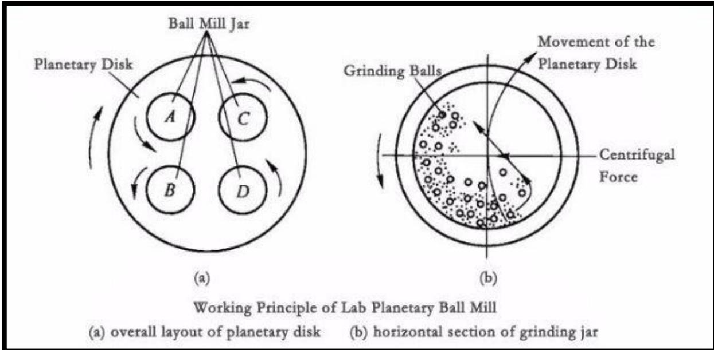

> 🧠 **[Cognis Multimodal Enrichment]**
> * **Classification:** Scientific Figure
> * **Extracted Text (OCR):** `Ball Mill Jar, Planetary Disk, A, B, C, D, Movement of the Planetary Disk, Grinding Balls, Centrifugal Force, Working Principle of Lab Planetary Ball Mill, overall layout of planetary disk, horizontal section of grinding jar`
> * **VLM Visual Summary:** ### FIGURE TYPE:
>   **Experimental Setup**
>   
>   ### SCIENTIFIC PURPOSE:
>   This figure illustrates the working principle of a planetary ball mill, specifically focusing on how the planetary disks and grinding jars interact to achieve fine grinding of materials.
>   
>   ### KEY KNOWLEDGE:
>   1. **Planetary Ball Mill Components**: The mill consists of multiple ball grinding jars mounted on a central planetary disk.
>   2. **Planetary Rotation**: The planetary disk rotates, causing the jars to rotate in opposite directions due to centrifugal forces.
>   3. **Grinding Mechanism**: The grinding balls inside the jars move in high-speed circular motion, effectively grinding and mixing the samples within the jars.
>   4. **Centrifugal Force**: The centrifugal force generated by the rotating planetary disk causes the grinding balls to move towards the outer edge of the jars, enhancing the grinding efficiency.
>   5. **Sample Mixing**: The combination of high-speed rotation and centrifugal forces leads to thorough mixing and grinding of the samples.
>   
>   ### LABEL INTERPRETATION:
>   - **Ball Mill Jar**: The container where the grinding process occurs.
>   - **Planetary Disk**: The central rotating component that drives the jars.
>   - **A, B, C, D**: Labels indicating specific positions within the planetary disk.
>   - **Movement of the Planetary Disk**: The direction of rotation of the planetary disk.
>   - **Centrifugal Force**: The force acting on the grinding balls due to the rotation of the planetary disk.
>   
>   ### ENGINEERING/SCIENTIFIC INSIGHTS:
>   - Understanding the planetary ball mill's design and operation is crucial for optimizing grinding efficiency and achieving desired particle sizes.
>   - The figure highlights the importance of centrifugal forces in enhancing grinding effectiveness.
>   
>   ### USER-RELEVANT INFORMATION:
>   - The figure provides a clear understanding of how the planetary ball mill operates, which is essential for anyone involved in using or designing such equipment.
>   - The detailed layout and movement of the planetary disk and grinding balls offer insights into the dynamic interactions that occur during the grinding process.
> * **Figure Caption:** The planetary ball mill has four ball grinding jars installed on one planetary disk. When the disk rotates, the jars axis makes the planetary rotation in opposite directions, and the balls in the jars grind and mix samples in high-speed movement. The product can smash and blend various products of different materials and granularity with dry or wet methods. | [Section: Lab Safety Rules > Step-wise procedure:]
> * **Surrounding Context (+/- 300 words):**
>   * **[Before]:** *... appropriately labelled waste containers. ▪ Properly dispose of broken glassware and other sharp objects (e.g., syringe needles) immediately in designated containers. ▪ Properly dispose of weigh boats, gloves, filter paper, and paper towels in the laboratory. [Section: Lab Safety Rules > Apparel in the Laboratory] ▪ Always wear appropriate eye protection (i.e., chemical splash goggles) in the laboratory. Wear disposable gloves, as provided in the laboratory, when handling hazardous materials. Remove the gloves before exiting the laboratory. ▪ Wear a full-length, long-sleeved laboratory coat or chemical-resistant apron. Wear shoes that adequately cover the whole foot. Low-heeled shoes with non-slip soles are preferable. Do not wear sandals, open-toed shoes, open-backed shoes, or high-heeled shoes. Avoid wearing shirts exposing the torso, shorts, or short skirts; long pants that completely cover the legs are preferable. [Section: Lab Safety Rules > Experiment No 1: Planetary Ball Mill] Aim: To reduce the size of the particle from micro to nano using planetary ball mill and study the size distribution using particle size analyzer Apparatus: Feed particles (coal, glass), balls, planetary ball mill. Theory: Planetary Ball Mills are used wherever the highest degree of fineness is required. Apart from the classical mixing and size reduction processes, the mills also meet all the technical requirements for colloidal grinding and have the energy input necessary for mechanical alloying processes. The extremely high centrifugal forces of planetary ball mills result in very high pulverization energy and therefore, short grinding times. The planetary ball mill has four ball grinding jars installed on one planetary disk. When the disk rotates, the jars axis makes the planetary rotation in opposite directions, and the balls in the jars grind and mix samples in high-speed movement. The product can smash and blend various products of different materials and granularity with dry or wet methods.*
>   * **[After]:** *[Section: Lab Safety Rules > Step-wise procedure:] 1. Prepare the sample by mechanically grinding the feed particles in a mortar and pestle. 2. Pass the grounded materials through a 200 mesh sieve. 3. Take the particles which are passing through the sieve as feed for the planetary ball mill. 4. Select the size of the balls according to the size of the particles that is needed. 5. Measure the weight of the feed and accordingly take balls in the ratio of 1:3 by weight. [Section: Lab Safety Rules > Lab Manual for Instrumental Methods of Analysis (CHC 506)] 6. Clean the balls and the jar thoroughly with water at first and then acetone and wipe properly with tissue paper. 7. Pour the balls and the particles in the jar and close tightly according to the protocols. 8. Select the time of grinding and pause time according to the size reduction of particles required. 9. Set the jar rpm and the sun rpm in the ratio of 5:1 according to size reduction required. 10. Run the ball mill. 11. After the grinding is done safely take out the particles from the ball mill. 12. Clean the jar and the ball with acetone and water as done in step 6. [Section: Lab Safety Rules > Observation:] Particles taken: Size of particles taken: 200 mesh(underpass) Table:Results of the ball milling <table><tr><td>S1. No</td><td>Sun rpm</td><td>Jar rpm</td><td>Weight of feed(gr ams)</td><td>Weight of balls(gram s）</td><td>Directi onof rotation of jar</td><td>Timeof cycle(min)|pause(min|cycles product(gr</td><td>TimeofNo ofWeight of ）</td><td></td><td>ams)</td></tr><tr><td></td><td></td><td></td><td></td><td></td><td></td><td></td><td></td><td></td><td></td></tr></table> [Section: Lab Safety Rules > Questionnaire:] 1. What is Borosilicate Glass? What are its applications? Which Component in its composition does its grade depend? 2. In a ball mill of diameter 2000 mm, 100 mm dia. steel balls are being used for grinding. Presently, for the material being ground, the mill is run at ...*

## Step-wise procedure:

1. Prepare the sample by mechanically grinding the feed particles in a mortar and pestle.

2. Pass the grounded materials through a 200 mesh sieve.

3. Take the particles which are passing through the sieve as feed for the planetary ball mill.

4. Select the size of the balls according to the size of the particles that is needed.

5. Measure the weight of the feed and accordingly take balls in the ratio of 1:3 by weight.

## Lab Manual for Instrumental Methods of Analysis (CHC 506)

6. Clean the balls and the jar thoroughly with water at first and then acetone and wipe properly with tissue paper.

7. Pour the balls and the particles in the jar and close tightly according to the protocols.

8. Select the time of grinding and pause time according to the size reduction of particles required.

9. Set the jar rpm and the sun rpm in the ratio of 5:1 according to size reduction required.

10. Run the ball mill.

11. After the grinding is done safely take out the particles from the ball mill.

12. Clean the jar and the ball with acetone and water as done in step 6.

## Observation:

Particles taken:

Size of particles taken: 200 mesh(underpass)

Table:Results of the ball milling

<table><tr><td>S1. No</td><td>Sun rpm</td><td>Jar rpm</td><td>Weight of feed(gr ams)</td><td>Weight of balls(gram s）</td><td>Directi onof rotation of jar</td><td>Timeof cycle(min)|pause(min|cycles product(gr</td><td>TimeofNo ofWeight of ）</td><td></td><td>ams)</td></tr><tr><td></td><td></td><td></td><td></td><td></td><td></td><td></td><td></td><td></td><td></td></tr></table>

## Application:

## Precautions:

## Results and Discussion:

## Questionnaire:

1. What is Borosilicate Glass? What are its applications? Which Component in its composition does its grade depend?

2. In a ball mill of diameter 2000 mm, 100 mm dia. steel balls are being used for grinding. Presently, for the material being ground, the mill is run at 15 rpm. At what speed will the mill have to be run if the 100 mm balls are replaced by 50 mm balls, all the other conditions remaining the same?

3. What is the size reduction principle of Planetary Ball mill? What is the maximum ratio of speed(rpm) jar to sun? what is the maximum amount of feed could be used in the planetary ball mill used here?

# Lab Manual for Instrumental Methods of Analysis (CHC 506)

# Experiment No 2: Particle Size Analyzer

Aim: To determine the size of coal and pet coke sample using Particle Size Analyzer.

Apparatus: Microtrac Model S3500 Particle Size Analyzer.

Theory: Particle Size Analyzer determines the size of sub-atomic particles. It is based on the phenomena of scattering of light. A complete Microtrac Model S3500 Particle Size Analyzer system contains a wet sample re-circulator and/or dry sample delivery device, the S3500 analyzer and a computer that is running the Microtrac Application software. The device measures light scattered from particles in a laser beam. The amount and direction of light scattered by the particles, measured by optical detector arrays are analyzed to determine the particle size distribution. The scattering of light used for this was well explained by MIE scattering theory.

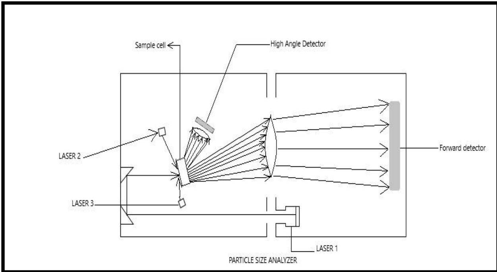

> 🧠 **[Cognis Multimodal Enrichment]**
> * **Classification:** Scientific Figure
> * **Extracted Text (OCR):** `Sample cell, High Angle Detector, Forward detector, LASER 2, LASER 3, LASER 1, PARTICLE SIZE ANALYZER`
> * **VLM Visual Summary:** ### FIGURE TYPE:
>   Instrument Schematic
>   
>   ### SCIENTIFIC PURPOSE:
>   The figure explains the internal components and layout of a Particle Size Analyzer, specifically focusing on how light scattering is used to determine the size of sub-atomic particles.
>   
>   ### KEY KNOWLEDGE:
>   1. **Light Scattering**: The Particle Size Analyzer uses light scattering to measure the size of particles.
>   2. **Mie Scattering Theory**: The scattering of light used for this is explained by Mie scattering theory.
>   3. **Components**:
>      - **Sample Cell**: Where the sample is placed.
>      - **High Angle Detector**: Measures the scattered light at high angles.
>      - **Forward Detector**: Measures the scattered light at forward angles.
>      - **Lasers (LASER 1, LASER 2, LASER 3)**: Provide the laser beams for scattering.
>   4. **Optical Detector Arrays**: Measure the amount and direction of light scattered by particles.
>   5. **Microtrac Model S3500 Particle Size Analyzer System**: Includes a wet sample re-circulator, dry sample delivery device, S3500 analyzer, and computer running Microtrac Application software.
>   
>   ### LABEL INTERPRETATION:
>   - **Sample cell**: Where the sample is placed.
>   - **High Angle Detector**: Measures the scattered light at high angles.
>   - **Forward Detector**: Measures the scattered light at forward angles.
>   - **Lasers (LASER 1, LASER 2, LASER 3)**: Provide the laser beams for scattering.
>   - **Particle Size Analyzer**: The device that measures light scattered from particles in a laser beam.
>   
>   ### ENGINEERING/SCIENTIFIC INSIGHTS:
>   - The figure provides a detailed view of how the Particle Size Analyzer works, highlighting the key components and their roles in determining particle sizes through light scattering.
>   - Understanding the layout and function of each component helps in interpreting the results and ensuring accurate measurements.
>   
>   ### USER-RELEVANT INFORMATION:
>   - The positions and connections of the lasers (LASER 1, LASER 2, LASER 3) and detectors (High Angle Detector, Forward Detector) are crucial for understanding how light scattering is used to measure particle sizes.
>   - The importance of the sample cell and the placement of the detectors within the sample cell is essential for accurate measurements.
>   - The use of Mie scattering theory is fundamental to interpreting the scattering patterns and determining particle sizes.
> * **Figure Caption:** Theory: Particle Size Analyzer determines the size of sub-atomic particles. It is based on the phenomena of scattering of light. A complete Microtrac Model S3500 Particle Size Analyzer system contains a wet sample re-circulator and/or dry sample delivery device, the S3500 analyzer and a computer that is running the Microtrac Application software. The device measures light scattered from particles in a laser beam. The amount and direction of light scattered by the particles, measured by optical detector arrays are analyzed to determine the particle size distribution. The scattering of light used for this was well explained by MIE scattering theory. | [Section: Experiment No 2: Particle Size Analyzer]
> * **Surrounding Context (+/- 300 words):**
>   * **[Before]:** *... the ball with acetone and water as done in step 6. [Section: Lab Safety Rules > Observation:] Particles taken: Size of particles taken: 200 mesh(underpass) Table:Results of the ball milling <table><tr><td>S1. No</td><td>Sun rpm</td><td>Jar rpm</td><td>Weight of feed(gr ams)</td><td>Weight of balls(gram s）</td><td>Directi onof rotation of jar</td><td>Timeof cycle(min)|pause(min|cycles product(gr</td><td>TimeofNo ofWeight of ）</td><td></td><td>ams)</td></tr><tr><td></td><td></td><td></td><td></td><td></td><td></td><td></td><td></td><td></td><td></td></tr></table> [Section: Lab Safety Rules > Questionnaire:] 1. What is Borosilicate Glass? What are its applications? Which Component in its composition does its grade depend? 2. In a ball mill of diameter 2000 mm, 100 mm dia. steel balls are being used for grinding. Presently, for the material being ground, the mill is run at 15 rpm. At what speed will the mill have to be run if the 100 mm balls are replaced by 50 mm balls, all the other conditions remaining the same? 3. What is the size reduction principle of Planetary Ball mill? What is the maximum ratio of speed(rpm) jar to sun? what is the maximum amount of feed could be used in the planetary ball mill used here? [Section: Experiment No 2: Particle Size Analyzer] Aim: To determine the size of coal and pet coke sample using Particle Size Analyzer. Apparatus: Microtrac Model S3500 Particle Size Analyzer. Theory: Particle Size Analyzer determines the size of sub-atomic particles. It is based on the phenomena of scattering of light. A complete Microtrac Model S3500 Particle Size Analyzer system contains a wet sample re-circulator and/or dry sample delivery device, the S3500 analyzer and a computer that is running the Microtrac Application software. The device measures light scattered from particles in a laser beam. The amount and direction of light scattered by the particles, measured by optical detector arrays are analyzed to determine the particle size distribution. The scattering of light used for this was well explained by MIE scattering theory.*
>   * **[After]:** *[Section: Experiment No 2: Particle Size Analyzer] Principle: The Laser diffraction measures particle size distribution by measuring the angular variation in the intensity of light.The particle size is reported as a volume equivalent sphere diameter. Light particles scatter at small angles relative to the laser beam and large particle scatter at lower angles. The angular scattering intensity data is then analyzed to calculate the size of the particles responsible for creating a scattering pattern using the MIE theory of light scattering.The analyzer itself does not measure the particle size; it measures the angle and intensity of light scattered from a particle in the sample.The information is then passed to the analyzer designed to use MIE scattering theory, which transforms the scattered light data into particle size information. Procedure: At first sampling is done. [Section: Experiment No 2: Particle Size Analyzer > Lab Manual for Instrumental Methods of Analysis (CHC 506)] Sample measurement: If a Nanotrac NAS 35 is there we refer to the section below describing the NAS 35 operation. From the measure, menu select instrument, Select the desired Microtrac Product-(e.g. S3500/S3000).A S3500/S3000 measurement window will open. ➢ Click on the setup button to open the measurement setup dialog. ➢ Then click on the options button to open the measurement setup options property. ➢ Set the appropriate measurement setup parameters on each tab of the measurement setup options dialog. ➢ Click on the OK button. ➢ Close the measurement setup dialog. ➢ Save the measurement to the database by clicking on the “save as” option. ➢ Fill the sample system with a clean carrier fluid. ➢ From the main toolbar, click to collect a background level measurement. ➢ Open the sample loading display and add sample to the sample system until the indicator bar in the green zone. Then close ...*

Principle: The Laser diffraction measures particle size distribution by measuring the angular variation in the intensity of light.The particle size is reported as a volume equivalent sphere diameter. Light particles scatter at small angles relative to the laser beam and large particle scatter at lower angles. The angular scattering intensity data is then analyzed to calculate the size of the particles responsible for creating a scattering pattern using the MIE theory of light scattering.The analyzer itself does not measure the particle size; it measures the angle and intensity of light scattered from a particle in the sample.The information is then passed to the analyzer designed to use MIE scattering theory, which transforms the scattered light data into particle size information.

Procedure: At first sampling is done.

## Lab Manual for Instrumental Methods of Analysis (CHC 506)

Sample measurement: If a Nanotrac NAS 35 is there we refer to the section below describing the NAS 35 operation. From the measure, menu select instrument, Select the desired Microtrac Product-(e.g. S3500/S3000).A S3500/S3000 measurement window will open.

➢ Click on the setup button to open the measurement setup dialog.

➢ Then click on the options button to open the measurement setup options property.

➢ Set the appropriate measurement setup parameters on each tab of the measurement setup options dialog.

➢ Click on the OK button.

➢ Close the measurement setup dialog.

➢ Save the measurement to the database by clicking on the “save as” option.

➢ Fill the sample system with a clean carrier fluid.

➢ From the main toolbar, click to collect a background level measurement.

➢ Open the sample loading display and add sample to the sample system until the indicator bar in the green zone. Then close the display or click run to start a sample measurement. This display is periodically updated as indicated by the progress bar in the lower part of the display.

➢ When the data collection is complete, the measurement data is calculated and displayed.

➢ You can print a report of the displayed data by clicking the “Print” button in the data display Toolbar.

## Observation:

<table><tr><td>Percentile</td><td>Respective size of sample(μm)</td></tr><tr><td></td><td></td></tr></table>

## Application:

Precautions:

Results and Discussion:

Questionnaire:

1. What is the main phenomena by the help of which PSA works?

2. Define the phenomena of Diffraction.

3. Describe the working principle of PSA.

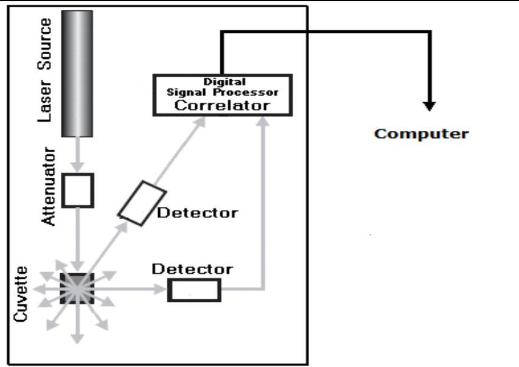

> 🧠 **[Cognis Multimodal Enrichment]**
> * **Classification:** Scientific Figure
> * **Extracted Text (OCR):** `Laser Source, Attenuator, Digital Signal Processor Correlator, Detector, Detector, Cuvette, Computer`
> * **VLM Visual Summary:** ### FIGURE TYPE:
>   Instrument Schematic
>   
>   ### SCIENTIFIC PURPOSE:
>   This figure explains the working principle of a Particle Size Analyzer (PSA).
>   
>   ### KEY KNOWLEDGE:
>   1. **Laser Source**: The laser source emits a beam of light.
>   2. **Attenuator**: The attenuator reduces the intensity of the laser beam.
>   3. **Detector**: The detector measures the scattered light.
>   4. **Digital Signal Processor**: The processor processes the scattered light signal.
>   5. **Correlator**: The correlator analyzes the scattered light signal.
>   6. **Computer**: The computer stores and analyzes the data.
>   
>   ### LABEL INTERPRETATION:
>   - **Laser Source**: The top-left box represents the laser source.
>   - **Attenuator**: The box below the laser source represents the attenuator.
>   - **Detector**: The two boxes connected to the laser source represent the detectors.
>   - **Digital Signal Processor**: The box labeled "Digital Signal Processor" is where the signal processing occurs.
>   - **Correlator**: The box labeled "Correlator" is where the correlation analysis happens.
>   - **Computer**: The box labeled "Computer" is where the final data analysis takes place.
>   
>   ### ENGINEERING/SCIENTIFIC INSIGHTS:
>   A reader should learn that the Particle Size Analyzer uses the principle of dynamic scattering of light to measure particle sizes. The laser beam is directed at a sample, and the scattered light is detected and processed by the digital signal processor and correlator. The computer then analyzes the data to determine the particle size distribution.
>   
>   ### USER-RELEVANT INFORMATION:
>   The information from this figure could help answer future questions about how the Particle Size Analyzer operates, the role of each component, and the overall process of measuring particle sizes using light scattering techniques.
> * **Figure Caption:** 3. Describe the working principle of PSA. | Lab Manual for Instrumental Methods of Analysis (CHC 506)
> * **Surrounding Context (+/- 300 words):**
>   * **[Before]:** *... scattering theory, which transforms the scattered light data into particle size information. Procedure: At first sampling is done. [Section: Experiment No 2: Particle Size Analyzer > Lab Manual for Instrumental Methods of Analysis (CHC 506)] Sample measurement: If a Nanotrac NAS 35 is there we refer to the section below describing the NAS 35 operation. From the measure, menu select instrument, Select the desired Microtrac Product-(e.g. S3500/S3000).A S3500/S3000 measurement window will open. ➢ Click on the setup button to open the measurement setup dialog. ➢ Then click on the options button to open the measurement setup options property. ➢ Set the appropriate measurement setup parameters on each tab of the measurement setup options dialog. ➢ Click on the OK button. ➢ Close the measurement setup dialog. ➢ Save the measurement to the database by clicking on the “save as” option. ➢ Fill the sample system with a clean carrier fluid. ➢ From the main toolbar, click to collect a background level measurement. ➢ Open the sample loading display and add sample to the sample system until the indicator bar in the green zone. Then close the display or click run to start a sample measurement. This display is periodically updated as indicated by the progress bar in the lower part of the display. ➢ When the data collection is complete, the measurement data is calculated and displayed. ➢ You can print a report of the displayed data by clicking the “Print” button in the data display Toolbar. [Section: Experiment No 2: Particle Size Analyzer > Observation:] <table><tr><td>Percentile</td><td>Respective size of sample(μm)</td></tr><tr><td></td><td></td></tr></table> [Section: Experiment No 2: Particle Size Analyzer > Application:] Precautions: Results and Discussion: Questionnaire: 1. What is the main phenomena by the help of which PSA works? 2. Define the phenomena of Diffraction. 3. Describe the working principle of PSA.*
>   * **[After]:** *Lab Manual for Instrumental Methods of Analysis (CHC 506) [Section: Experiment No 2: Particle Size Analyzer > Experiment No 3: Zeta Sizer] Aim: To determine the particle size, zeta potential and molecular weight of the sample. Apparatus: Zetasizer Nano Instrument Theory: The Zetasizer Nano range of instruments provides the ability to measure three characteristics of particles or molecules in a liquid medium. These three fundamental parameters are Particle size, Zeta potential and Molecular weight. By using the technique technology within theZetasizer system, these parameters can be measured over awide range of concentrations. The Zetasizer system also can perform micro-rheology, auto-titration measurements and trend measurements, including the determination of the protein melting point. The Zetasizer range features pre-aligned optics and programmable measurement position for the measurement of size and zeta potential over a wide concentration range and precise temperature control necessary for reproducible, repeatable and accurate measurements. Also other key parameters such as conductivity and with the MPT-2 Titrator, pH can be measured. The Zetasizer Nano range has been designed so that a minimal amount of user interaction is necessary to achieve excellent results. The use of Standard Operating Procedures (SOPs) and features such as the Folded capillary cell alleviate the need for constant attention. Principle: Dynamic scattering of light caused due to Brownian motion. Working of Zetasizer Nano Instrument [Section: Experiment No 2: Particle Size Analyzer > Procedure:] ✓ Prepare aqueous samples with different concentration (volume %) of any nanopowder, which is insoluble in water. ✓ Place all the samples in an ultrasonic bath to ensure a uniform concentration of nanopowder throughout the solution. ✓ Turn on the instrument and enter all the pre-requisite values (such as refractive index, name of the sample, etc.) into the software. ✓ Pour one sample into the cuvette and put it into the Zetasizer ...*

Lab Manual for Instrumental Methods of Analysis (CHC 506)

## Experiment No 3: Zeta Sizer

Aim: To determine the particle size, zeta potential and molecular weight of the sample. Apparatus: Zetasizer Nano Instrument

Theory: The Zetasizer Nano range of instruments provides the ability to measure three characteristics of particles or molecules in a liquid medium. These three fundamental parameters are Particle size, Zeta potential and Molecular weight. By using the technique technology within theZetasizer system, these parameters can be measured over awide range of concentrations. The Zetasizer system also can perform micro-rheology, auto-titration measurements and trend measurements, including the determination of the protein melting point.

The Zetasizer range features pre-aligned optics and programmable measurement position for the measurement of size and zeta potential over a wide concentration range and precise temperature control necessary for reproducible, repeatable and accurate measurements. Also other key parameters such as conductivity and with the MPT-2 Titrator, pH can be measured. The Zetasizer Nano range has been designed so that a minimal amount of user interaction is necessary to achieve excellent results. The use of Standard Operating Procedures (SOPs) and features such as the Folded capillary cell alleviate the need for constant attention.

Principle: Dynamic scattering of light caused due to Brownian motion.

Working of Zetasizer Nano Instrument

## Lab Manual for Instrumental Methods of Analysis (CHC 506)

## Procedure:

✓ Prepare aqueous samples with different concentration (volume %) of any nanopowder, which is insoluble in water.

✓ Place all the samples in an ultrasonic bath to ensure a uniform concentration of nanopowder throughout the solution.

✓ Turn on the instrument and enter all the pre-requisite values (such as refractive index, name of the sample, etc.) into the software.

✓ Pour one sample into the cuvette and put it into the Zetasizer nano instrument and proceed with the type of cuvette used using the software.

✓ After proceeding, analysis of a given sample will start in the instrument, and a set of graphs will appear on the screen. These graphs will show the particle size distribution of the given sample. Save these graphs.

✓ Repeat the procedure for other samples.

Observations:

Results & Discussion

Precautions:

Applications:

## Questionnaire:

1. Explain zeta potential and its significance on the stability of colloidal particle?

2. Explain how Zetasizer measured particle size and molecular weight of the molecules present in colloidal solution.

3. What is Debye length? What is the effect of concentration of electrolyte on it?

Lab Manual for Instrumental Methods of Analysis (CHC 506)

## Experiment No 4:Fourier Transform Infrared Spectroscopy (FTIR)

Aim: To identify the functional group present in the compound.

Apparatus: Agilent Cary 600 series Spectrometer.

Theory: Infrared spectroscopy is the study of the interactions between infrared electromagnetic energy and matter. The technique of infrared spectroscopy measures the vibrations of molecules, allowing for qualitative and quantitative measurements of samples. A Fourier transform infrared (FTIR) spectrometer is an ideal tool for the identification of the unknown organic and inorganic samples where they exist in the form of gas, liquid or a solid. Electromagnetic Spectrum: Radiation in the infrared region is commonly referred to in terms of a unit called a wavenumber (??̅), rather than wavelength (??). Wavenumbers are expressed as reciprocal centimeters $( \mathrm { c m } ^ { - 1 } )$ and are directly proportional to energy. A higher wavenumber corresponds to a higher energy.

The relation between wavenumber and wavelength: $\begin{array} { r } { \bar { v } = \frac { 1 } { \lambda } } \end{array}$

Energy $\mathrm { J } ) = E = h \left( P l a n c k ^ { \prime } s c o n s t a n t , J \cdot s \right) \times c ( s p e e d \ o f l i g h t , c m \cdot s ^ { - 1 } ) \times { \bar { v } } ( { \mathrm { c m } } ^ { - 1 } )$

The diagram given below is the portion of the electromagnetic spectrum showing the relationship of the infrared region to other types of radiation (not shown to scale).

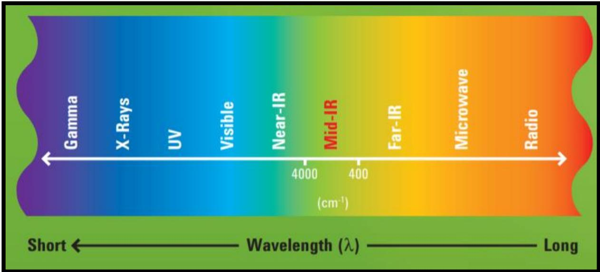

> 🧠 **[Cognis Multimodal Enrichment]**
> * **Classification:** Scientific Figure
> * **Extracted Text (OCR):** `Gamma, X-Rays, UV, Visible, Near-IR, Mid-IR, Far-IR, Microwave, Radio, 4000, 400, (cm^-1), Short, Wavelength (λ), Long`
> * **VLM Visual Summary:** ### FIGURE TYPE:
>   - **Crystal Structure Visualization**
>   
>   ### SCIENTIFIC PURPOSE:
>   This figure illustrates the electromagnetic spectrum, specifically highlighting the infrared (IR) region. It shows how infrared radiation relates to other types of electromagnetic radiation such as gamma rays, X-rays, ultraviolet (UV), visible light, and various forms of infrared radiation like near-infrared (NIR), mid-infrared (MIR), far-infrared (FIR), microwave, and radio waves.
>   
>   ### KEY KNOWLEDGE:
>   1. **Electromagnetic Spectrum**: The electromagnetic spectrum is a continuous range of all possible wavelengths of electromagnetic radiation, including radio waves, microwaves, infrared (IR), visible light, ultraviolet (UV), X-rays, and gamma rays.
>   2. **Wavenumber (cm^-1)**: This is a common unit used to measure the wavelength of electromagnetic radiation. It is defined as the reciprocal of the wavelength in centimeters.
>   3. **Infrared (IR) Region**: The IR region covers wavelengths from approximately 4000 cm^-1 to 400 cm^-1. This range corresponds to frequencies from about 750 cm^-1 to 2500 cm^-1.
>   4. **Applications of IR Spectroscopy**: Infrared spectroscopy is widely used to identify functional groups in organic compounds. It measures the vibrations of molecules, providing qualitative and quantitative information about the chemical structure of substances.
>   
>   ### LABEL INTERPRETATION:
>   - **Gamma**: Represents the shortest wavelength in the electromagnetic spectrum.
>   - **X-Rays**: Represent high-energy radiation.
>   - **UV**: Represents ultraviolet radiation.
>   - **Visible**: Represents visible light.
>   - **Near-IR**: Represents near-infrared radiation.
>   - **Mid-IR**: Represents mid-infrared radiation.
>   - **Far-IR**: Represents far-infrared radiation.
>   - **Microwave**: Represents microwave radiation.
>   - **Radio**: Represents radio waves.
>   
>   ### ENGINEERING/SCIENTIFIC INSIGHTS:
>   A reader should learn that infrared spectroscopy is a powerful analytical technique used to identify functional groups in organic compounds. It provides valuable information about the molecular structure by analyzing the vibrational modes of molecules.
>   
>   ### USER-RELEVANT INFORMATION:
>   The information provided in the figure helps answer future questions related to the identification of functional groups in organic compounds through infrared spectroscopy. Understanding the relationship between different regions of the electromagnetic spectrum is crucial for interpreting spectra and identifying specific functional groups.
> * **Figure Caption:** The diagram given below is the portion of the electromagnetic spectrum showing the relationship of the infrared region to other types of radiation (not shown to scale). | [Section: Experiment No 2: Particle Size Analyzer > Procedure:]
> * **Surrounding Context (+/- 300 words):**
>   * **[Before]:** *... of electrolyte on it? Lab Manual for Instrumental Methods of Analysis (CHC 506) [Section: Experiment No 2: Particle Size Analyzer > Experiment No 4:Fourier Transform Infrared Spectroscopy (FTIR)] Aim: To identify the functional group present in the compound. Apparatus: Agilent Cary 600 series Spectrometer. Theory: Infrared spectroscopy is the study of the interactions between infrared electromagnetic energy and matter. The technique of infrared spectroscopy measures the vibrations of molecules, allowing for qualitative and quantitative measurements of samples. A Fourier transform infrared (FTIR) spectrometer is an ideal tool for the identification of the unknown organic and inorganic samples where they exist in the form of gas, liquid or a solid. Electromagnetic Spectrum: Radiation in the infrared region is commonly referred to in terms of a unit called a wavenumber (??̅), rather than wavelength (??). Wavenumbers are expressed as reciprocal centimeters $( \mathrm { c m } ^ { - 1 } )$ and are directly proportional to energy. A higher wavenumber corresponds to a higher energy. The relation between wavenumber and wavelength: $\begin{array} { r } { \bar { v } = \frac { 1 } { \lambda } } \end{array}$ Energy $\mathrm { J } ) = E = h \left( P l a n c k ^ { \prime } s c o n s t a n t , J \cdot s \right) \times c ( s p e e d \ o f l i g h t , c m \cdot s ^ { - 1 } ) \times { \bar { v } } ( { \mathrm { c m } } ^ { - 1 } )$ The diagram given below is the portion of the electromagnetic spectrum showing the relationship of the infrared region to other types of radiation (not shown to scale).*
>   * **[After]:** *[Section: Experiment No 2: Particle Size Analyzer > Procedure:] There are three quick, simple steps involving a spectrum of a sample: ➢ Record a spectrum with no sample present (known as ‘background’) ➢ Insert the sample into the spectrometer ➢ Record a second spectrum and interpret the data. Lab Manual for Instrumental Methods of Analysis (CHC 506) Schematic Diagram of the FTIR spectrometer is given below: [Section: Experiment No 2: Particle Size Analyzer > Lab Manual for Instrumental Methods of Analysis (CHC 506)] InterpretingSpectra: <table><tr><td colspan="4">Bond Type of Vibration</td></tr><tr><td>C-H</td><td>Alkane (stretch) -CH3 (bend) -CH2- (bend) Alkene (stretch) Aromatic (stretch) Alkyne (stretch)</td><td>1465 (out-of-plane bend) (out-of-plane bend)</td><td>Wavenumber Range (cm-1) 3000-2850 1450&amp;1375 3100-3000 1000-650 3150-3050 900-600 ~3300</td></tr><tr><td>C=C</td><td>Alkene Aromatic</td><td></td><td>2900-2700 1680-1600 1600&amp;1475</td></tr><tr><td>C=C Alkyne Aldehyde</td><td></td><td>2250-2100 1740-1720</td><td></td></tr><tr><td>C=0</td><td>Ketone Carboxylicacid Ester Amide Anhydride</td><td></td><td>1725-1705 1725-1700 1750-1730 1680-1630 1810&amp;1760</td></tr><tr><td>C-0</td><td>Alcoholsers carboxyliccid,</td><td></td><td>1300-1000</td></tr><tr><td>0-H</td><td>Alcohols,phenols Free H-Bonded Carboxylic acids</td><td>3400-3200 3400-2400</td><td>3650-3600</td></tr><tr><td>N-H</td><td>Primary &amp; secondary amines &amp; amides (stretch) (bend)</td><td></td><td>3500-3100 1640-1550</td></tr><tr><td>C-N C=N</td><td>Amines Imines&amp;oximes</td><td>1350-1000 1690-1640</td><td></td></tr><tr><td>C=N</td><td>Nitriles Nitro (R-NO2)</td><td>2260-2240</td><td>1550&amp;1350</td></tr><tr><td>N=0 S-H</td><td>Mercaptans</td><td>2550</td><td></td></tr><tr><td>C-X</td><td>Halides Fluoride Chloride</td><td>1400-1000</td><td>785-540</td></tr></table> [Section: Experiment No 2: Particle Size Analyzer > Lab Manual for Instrumental Methods of Analysis (CHC 506)] Observation: Table 1: <table><tr><td rowspan=1 colspan=1>S1. No.</td><td rowspan=1 colspan=1>Wavenumber (cm-1)</td><td rowspan=1 colspan=1>Transmittance (%)</td></tr><tr><td rowspan=1 colspan=1></td><td rowspan=1 colspan=1></td><td rowspan=1 colspan=1></td></tr><tr><td rowspan=1 colspan=1></td><td rowspan=1 colspan=1></td><td rowspan=1 colspan=1></td></tr></table> Application: Precautions: Results and Discussion: [Section: Experiment No 2: Particle Size Analyzer > Questionnaire:] 1. What is the principle of FTIR? 2. What is the use of FTIR? 3. What is the range of FTIR? [Section: Experiment No 5: UV-VIS SPECTROMETER] Aim: To apply the “Beer-Lambert law” to an aqueous solution containing an absorbing substance by measuring absorbance using Thermo scientific evolution -300 UV-VIS Spectrometer and thus determine the sample concentration. Apparatus: Thermo scientific evolution -300 UV-VIS Spectrometer Theory: UV-VIS refers to absorption spectroscopy or reflectance spectroscopy in the ultraviolet-visible spectral region. It uses light in the visible and UV range. The absorption or reflectance in the visible range ...*

## Procedure:

There are three quick, simple steps involving a spectrum of a sample:

➢ Record a spectrum with no sample present (known as ‘background’)

➢ Insert the sample into the spectrometer

➢ Record a second spectrum and interpret the data.

Lab Manual for Instrumental Methods of Analysis (CHC 506)

Schematic Diagram of the FTIR spectrometer is given below:

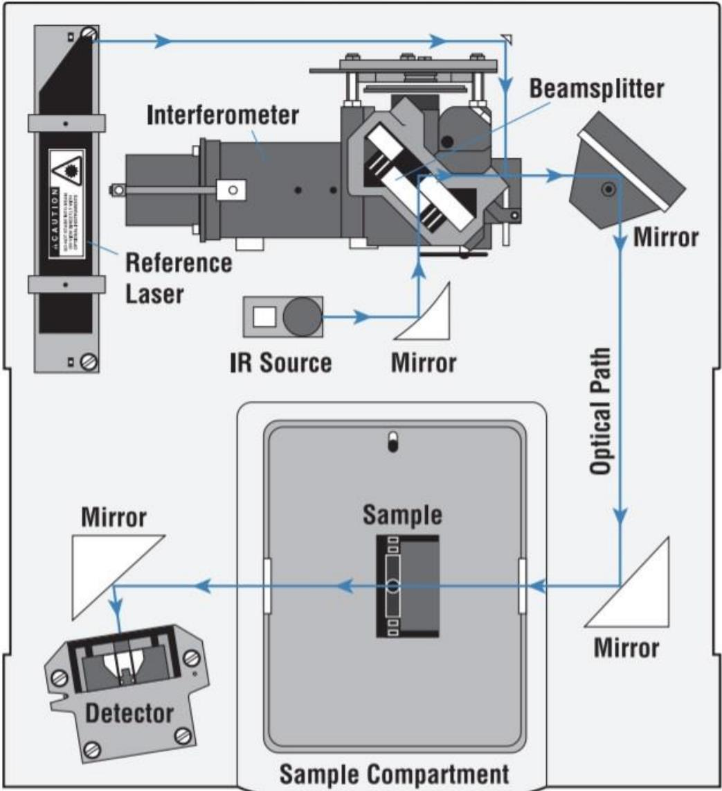

> 🧠 **[Cognis Multimodal Enrichment]**
> * **Classification:** Scientific Figure
> * **Extracted Text (OCR):** `Interferometer, Reference Laser, IR Source, Mirror, Beamsplitter, Mirror, Optical Path, Detector, Sample Compartment`
> * **VLM Visual Summary:** ### FIGURE TYPE:
>   Instrument Schematic
>   
>   ### SCIENTIFIC PURPOSE:
>   The figure illustrates the schematic diagram of a Fourier Transform Infrared (FTIR) spectrometer, which is used for analyzing the vibrational spectra of materials to identify their chemical composition and molecular structure.
>   
>   ### KEY KNOWLEDGE:
>   1. **FTIR Principle**: FTIR measures the vibrational frequencies of molecules in a sample by detecting the interference pattern created when two beams of light pass through the sample.
>   2. **Components**:
>      - **Reference Laser**: Provides a reference signal for comparison.
>      - **Interferometer**: Converts the interference pattern into a frequency spectrum.
>      - **Beamsplitter**: Divides the incoming light into two beams.
>      - **Mirror**: Reflects the beams back towards the interferometer.
>      - **Sample Compartment**: Contains the sample being analyzed.
>      - **Detector**: Captures the interference pattern and converts it into an electrical signal.
>      - **IR Source**: Provides the infrared radiation necessary for the measurement.
>   3. **Optical Path**: The path that light takes through the system, crucial for accurate measurements.
>   
>   ### LABEL INTERPRETATION:
>   - **Interferometer**: The device that converts the interference pattern into a frequency spectrum.
>   - **Reference Laser**: The laser used as a reference signal.
>   - **IR Source**: The source of infrared radiation.
>   - **Mirror**: Reflects the beams back towards the interferometer.
>   - **Sample Compartment**: The area where the sample is placed.
>   - **Detector**: Captures the interference pattern.
>   - **Optical Path**: The path that light travels through the system.
>   
>   ### ENGINEERING/SCIENTIFIC INSIGHTS:
>   A reader should learn that FTIR spectrometers are powerful tools for identifying and characterizing materials based on their vibrational spectra. They are widely used in various fields such as chemistry, materials science, and environmental analysis.
>   
>   ### USER-RELEVANT INFORMATION:
>   The information provided in the figure includes the key components of the FTIR spectrometer, their functions, and how they contribute to the overall operation of the instrument. This understanding will help in interpreting the results of FTIR spectra and applying them to different analytical tasks.
> * **Figure Caption:** Schematic Diagram of the FTIR spectrometer is given below: | [Section: Experiment No 2: Particle Size Analyzer > Lab Manual for Instrumental Methods of Analysis (CHC 506)]
> * **Surrounding Context (+/- 300 words):**
>   * **[Before]:** *... vibrations of molecules, allowing for qualitative and quantitative measurements of samples. A Fourier transform infrared (FTIR) spectrometer is an ideal tool for the identification of the unknown organic and inorganic samples where they exist in the form of gas, liquid or a solid. Electromagnetic Spectrum: Radiation in the infrared region is commonly referred to in terms of a unit called a wavenumber (??̅), rather than wavelength (??). Wavenumbers are expressed as reciprocal centimeters $( \mathrm { c m } ^ { - 1 } )$ and are directly proportional to energy. A higher wavenumber corresponds to a higher energy. The relation between wavenumber and wavelength: $\begin{array} { r } { \bar { v } = \frac { 1 } { \lambda } } \end{array}$ Energy $\mathrm { J } ) = E = h \left( P l a n c k ^ { \prime } s c o n s t a n t , J \cdot s \right) \times c ( s p e e d \ o f l i g h t , c m \cdot s ^ { - 1 } ) \times { \bar { v } } ( { \mathrm { c m } } ^ { - 1 } )$ The diagram given below is the portion of the electromagnetic spectrum showing the relationship of the infrared region to other types of radiation (not shown to scale). [Section: Experiment No 2: Particle Size Analyzer > Procedure:] There are three quick, simple steps involving a spectrum of a sample: ➢ Record a spectrum with no sample present (known as ‘background’) ➢ Insert the sample into the spectrometer ➢ Record a second spectrum and interpret the data. Lab Manual for Instrumental Methods of Analysis (CHC 506) Schematic Diagram of the FTIR spectrometer is given below:*
>   * **[After]:** *[Section: Experiment No 2: Particle Size Analyzer > Lab Manual for Instrumental Methods of Analysis (CHC 506)] InterpretingSpectra: <table><tr><td colspan="4">Bond Type of Vibration</td></tr><tr><td>C-H</td><td>Alkane (stretch) -CH3 (bend) -CH2- (bend) Alkene (stretch) Aromatic (stretch) Alkyne (stretch)</td><td>1465 (out-of-plane bend) (out-of-plane bend)</td><td>Wavenumber Range (cm-1) 3000-2850 1450&amp;1375 3100-3000 1000-650 3150-3050 900-600 ~3300</td></tr><tr><td>C=C</td><td>Alkene Aromatic</td><td></td><td>2900-2700 1680-1600 1600&amp;1475</td></tr><tr><td>C=C Alkyne Aldehyde</td><td></td><td>2250-2100 1740-1720</td><td></td></tr><tr><td>C=0</td><td>Ketone Carboxylicacid Ester Amide Anhydride</td><td></td><td>1725-1705 1725-1700 1750-1730 1680-1630 1810&amp;1760</td></tr><tr><td>C-0</td><td>Alcoholsers carboxyliccid,</td><td></td><td>1300-1000</td></tr><tr><td>0-H</td><td>Alcohols,phenols Free H-Bonded Carboxylic acids</td><td>3400-3200 3400-2400</td><td>3650-3600</td></tr><tr><td>N-H</td><td>Primary &amp; secondary amines &amp; amides (stretch) (bend)</td><td></td><td>3500-3100 1640-1550</td></tr><tr><td>C-N C=N</td><td>Amines Imines&amp;oximes</td><td>1350-1000 1690-1640</td><td></td></tr><tr><td>C=N</td><td>Nitriles Nitro (R-NO2)</td><td>2260-2240</td><td>1550&amp;1350</td></tr><tr><td>N=0 S-H</td><td>Mercaptans</td><td>2550</td><td></td></tr><tr><td>C-X</td><td>Halides Fluoride Chloride</td><td>1400-1000</td><td>785-540</td></tr></table> [Section: Experiment No 2: Particle Size Analyzer > Lab Manual for Instrumental Methods of Analysis (CHC 506)] Observation: Table 1: <table><tr><td rowspan=1 colspan=1>S1. No.</td><td rowspan=1 colspan=1>Wavenumber (cm-1)</td><td rowspan=1 colspan=1>Transmittance (%)</td></tr><tr><td rowspan=1 colspan=1></td><td rowspan=1 colspan=1></td><td rowspan=1 colspan=1></td></tr><tr><td rowspan=1 colspan=1></td><td rowspan=1 colspan=1></td><td rowspan=1 colspan=1></td></tr></table> Application: Precautions: Results and Discussion: [Section: Experiment No 2: Particle Size Analyzer > Questionnaire:] 1. What is the principle of FTIR? 2. What is the use of FTIR? 3. What is the range of FTIR? [Section: Experiment No 5: UV-VIS SPECTROMETER] Aim: To apply the “Beer-Lambert law” to an aqueous solution containing an absorbing substance by measuring absorbance using Thermo scientific evolution -300 UV-VIS Spectrometer and thus determine the sample concentration. Apparatus: Thermo scientific evolution -300 UV-VIS Spectrometer Theory: UV-VIS refers to absorption spectroscopy or reflectance spectroscopy in the ultraviolet-visible spectral region. It uses light in the visible and UV range. The absorption or reflectance in the visible range directly affects the perceived colour of the chemicals involved. Atoms and molecules undergo electronic transition. Principle: When white light falls upon a sample, the light may be reflected, or the light may be absorbed. Molecules containing ?? -electrons or non bonding electron can absorb the energy in the form of ultraviolet or visible light to excite these electrons to higher antibonding molecule orbitals. Beer-Lambert Law: It ...*

## Lab Manual for Instrumental Methods of Analysis (CHC 506)

InterpretingSpectra:
<table><tr><td colspan="4">Bond Type of Vibration</td></tr><tr><td>C-H</td><td>Alkane (stretch) -CH3 (bend) -CH2- (bend) Alkene (stretch) Aromatic (stretch) Alkyne (stretch)</td><td>1465 (out-of-plane bend) (out-of-plane bend)</td><td>Wavenumber Range (cm-1) 3000-2850 1450&amp;1375 3100-3000 1000-650 3150-3050 900-600 ~3300</td></tr><tr><td>C=C</td><td>Alkene Aromatic</td><td></td><td>2900-2700 1680-1600 1600&amp;1475</td></tr><tr><td>C=C Alkyne Aldehyde</td><td></td><td>2250-2100 1740-1720</td><td></td></tr><tr><td>C=0</td><td>Ketone Carboxylicacid Ester Amide Anhydride</td><td></td><td>1725-1705 1725-1700 1750-1730 1680-1630 1810&amp;1760</td></tr><tr><td>C-0</td><td>Alcoholsers carboxyliccid,</td><td></td><td>1300-1000</td></tr><tr><td>0-H</td><td>Alcohols,phenols Free H-Bonded Carboxylic acids</td><td>3400-3200 3400-2400</td><td>3650-3600</td></tr><tr><td>N-H</td><td>Primary &amp; secondary amines &amp; amides (stretch) (bend)</td><td></td><td>3500-3100 1640-1550</td></tr><tr><td>C-N C=N</td><td>Amines Imines&amp;oximes</td><td>1350-1000 1690-1640</td><td></td></tr><tr><td>C=N</td><td>Nitriles Nitro (R-NO2)</td><td>2260-2240</td><td>1550&amp;1350</td></tr><tr><td>N=0 S-H</td><td>Mercaptans</td><td>2550</td><td></td></tr><tr><td>C-X</td><td>Halides Fluoride Chloride</td><td>1400-1000</td><td>785-540</td></tr></table>

## Lab Manual for Instrumental Methods of Analysis (CHC 506)

Observation:

Table 1:

<table><tr><td rowspan=1 colspan=1>S1. No.</td><td rowspan=1 colspan=1>Wavenumber (cm-1)</td><td rowspan=1 colspan=1>Transmittance (%)</td></tr><tr><td rowspan=1 colspan=1></td><td rowspan=1 colspan=1></td><td rowspan=1 colspan=1></td></tr><tr><td rowspan=1 colspan=1></td><td rowspan=1 colspan=1></td><td rowspan=1 colspan=1></td></tr></table>

Application:

Precautions:

Results and Discussion:

## Questionnaire:

1. What is the principle of FTIR?

2. What is the use of FTIR?

3. What is the range of FTIR?

## Lab Manual for Instrumental Methods of Analysis (CHC 506)

# Experiment No 5: UV-VIS SPECTROMETER

Aim: To apply the “Beer-Lambert law” to an aqueous solution containing an absorbing substance by measuring absorbance using Thermo scientific evolution -300 UV-VIS Spectrometer and thus determine the sample concentration.

Apparatus: Thermo scientific evolution -300 UV-VIS Spectrometer

Theory: UV-VIS refers to absorption spectroscopy or reflectance spectroscopy in the ultraviolet-visible spectral region. It uses light in the visible and UV range. The absorption or reflectance in the visible range directly affects the perceived colour of the chemicals involved. Atoms and molecules undergo electronic transition.

Principle: When white light falls upon a sample, the light may be reflected, or the light may be absorbed. Molecules containing ?? -electrons or non bonding electron can absorb the energy in the form of ultraviolet or visible light to excite these electrons to higher antibonding molecule orbitals.

Beer-Lambert Law: It expresses the linear relationship between the absorbance and concentration of a compound at a fixed wavelength.

$$
\begin{array} { r } { l o g \frac { I o } { I } = \varepsilon \times \mathrm { 1 } \times \mathrm { c } } \end{array}
$$

Where Io= Initial light intensity

I = Light intensity after it passes through the sample

ε = molar absorptivity

l = length of the solution the light passes through

c = concentration of the absorbing species

UV-VIS Spectrometer: It uses light over the ultraviolet range (185-400 nm) and visible range (400-700nm ) of the electromagnetic radiation spectrum.

IR Spectrophotometer: It uses light over the infrared range (700-15000 nm) of the electromagnetic radiation spectrum.

Spectrometer: It produces the desired range of wavelength of light. First, a collimator transmits a straight beam of light that passes through a monochromator to split it into several component wavelengths.

Photometer: After the desired range of wavelength of light passes through the solution of a sample in the cuvette. The photometer detects the number of photons that are absorbed.

## Principle :

➢ Source: The source lamp which is something simple as halogen lamp used for visible or complex as deuterium lamp used for the ultraviolet region.

Lab Manual for Instrumental Methods of Analysis (CHC 506)

➢ Monochromator: The next device in line is monochromator, where two slits separated by prism or diffraction grating.

➢ Beam Splitter: It divides the beam of light into two equal parallel beam of light.

➢ Sample Compartment: it consists of cells of both sample and reference.

➢ Detector: This device converts the impact of photons into an electronic current.

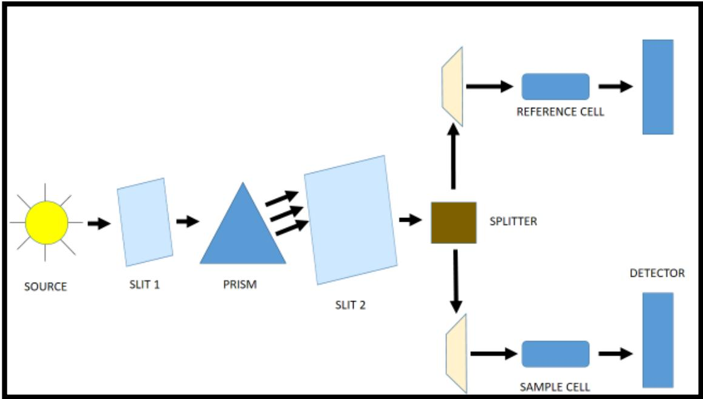

> 🧠 **[Cognis Multimodal Enrichment]**
> * **Classification:** Scientific Figure
> * **Extracted Text (OCR):** `SOURCE, SLIT 1, PRISM, SLIT 2, REFERENCE CELL, SPLITTER, SAMPLE CELL, DETECTOR`
> * **VLM Visual Summary:** ### FIGURE TYPE:
>   Instrument Schematic
>   
>   ### SCIENTIFIC PURPOSE:
>   This figure illustrates the schematic diagram of a spectrometer, which is a device used to measure the properties of light, such as its wavelength, intensity, and polarization. Specifically, it depicts the path of light through various optical components like slits, prisms, beamsplitters, and detectors.
>   
>   ### KEY KNOWLEDGE:
>   1. **Slit 1 and Slit 2**: These are used to create a narrow beam of light.
>   2. **Prism**: Divides the light into its constituent colors (wavelengths).
>   3. **Beam Splitter**: Divides the light into two beams.
>   4. **Sample Cell**: Contains the substance whose properties are being measured.
>   5. **Reference Cell**: Contains a solution of the same solvent but without the substance of interest.
>   6. **Detector**: Converts the photon impact into an electronic current.
>   
>   ### LABEL INTERPRETATION:
>   - **Source**: The light source, typically a lamp.
>   - **Slit 1**: A narrow slit to create a narrow beam of light.
>   - **Prism**: A device that disperses light into its component colors.
>   - **Slit 2**: Another narrow slit to further narrow the beam.
>   - **Beam Splitter**: Divides the beam into two parts.
>   - **Sample Cell**: Contains the substance being analyzed.
>   - **Reference Cell**: Contains a solution of the same solvent but without the substance of interest.
>   - **Detector**: Converts the photon impact into an electronic current.
>   
>   ### ENGINEERING/SCIENTIFIC INSIGHTS:
>   A reader should learn that this spectrometer is designed to analyze the properties of light, particularly its wavelength, by passing it through various optical components. The detector's function is crucial for converting the light's energy into measurable electrical signals, which can then be used to determine the properties of the substance being analyzed.
>   
>   ### USER-RELEVANT INFORMATION:
>   The information about the positions and functions of each component in the spectrometer will help answer questions related to the principles of spectroscopy, the behavior of light in different media, and the use of spectrometers in analytical chemistry. For example, understanding how the spectrometer separates light into its component wavelengths allows for the identification of specific substances based on their unique spectral signatures.
> * **Figure Caption:** ➢ Detector: This device converts the impact of photons into an electronic current. | Schematic of Spectrometer
> * **Surrounding Context (+/- 300 words):**
>   * **[Before]:** *... excite these electrons to higher antibonding molecule orbitals. Beer-Lambert Law: It expresses the linear relationship between the absorbance and concentration of a compound at a fixed wavelength. $$ \begin{array} { r } { l o g \frac { I o } { I } = \varepsilon \times \mathrm { 1 } \times \mathrm { c } } \end{array} $$ Where Io= Initial light intensity I = Light intensity after it passes through the sample ε = molar absorptivity l = length of the solution the light passes through c = concentration of the absorbing species [Section: Experiment No 5: UV-VIS SPECTROMETER] UV-VIS Spectrometer: It uses light over the ultraviolet range (185-400 nm) and visible range (400-700nm ) of the electromagnetic radiation spectrum. IR Spectrophotometer: It uses light over the infrared range (700-15000 nm) of the electromagnetic radiation spectrum. Spectrometer: It produces the desired range of wavelength of light. First, a collimator transmits a straight beam of light that passes through a monochromator to split it into several component wavelengths. Photometer: After the desired range of wavelength of light passes through the solution of a sample in the cuvette. The photometer detects the number of photons that are absorbed. [Section: Experiment No 5: UV-VIS SPECTROMETER > Principle :] ➢ Source: The source lamp which is something simple as halogen lamp used for visible or complex as deuterium lamp used for the ultraviolet region. Lab Manual for Instrumental Methods of Analysis (CHC 506) ➢ Monochromator: The next device in line is monochromator, where two slits separated by prism or diffraction grating. ➢ Beam Splitter: It divides the beam of light into two equal parallel beam of light. ➢ Sample Compartment: it consists of cells of both sample and reference. ➢ Detector: This device converts the impact of photons into an electronic current.*
>   * **[After]:** *Schematic of Spectrometer [Section: Experiment No 5: UV-VIS SPECTROMETER > Procedure :] ➢ Ten different samples of known concentration are prepared. ➢ At first, the cuvette is filled with distilled water to standardise. ➢ Then, one cuvette is filled with distilled water( to be taken as reference ), and in another cuvette, the sample is filled, and reading is taken. ➢ Step 3. Same steps can be repeated for the remaining samples. The final observation is noted and absorbance vs concentration graph is plotted for the calibration. 50 ppm of methylene blue solution is used. 50 ppm = 50mg/L Dilution formula : $$ \Nu _ { 1 } \tt { x } \Nu _ { 1 } = \Nu _ { 2 } \tt { x } \Nu _ { 2 } $$ N1 = normality of solute in 50ml solution = 2mg V1 = volume of solution = 50 ml N2 = normality of methylene blue solution = 50ppm V2 = volume of methylene blue used (unknown) Lab Manual for Instrumental Methods of Analysis (CHC 506) Using the above equation V2is calculated. Observation: <table><tr><td rowspan=1 colspan=1>S1.No.</td><td rowspan=1 colspan=1>Concentration(ppm)</td><td rowspan=1 colspan=1>Absorbance(nm)</td></tr><tr><td rowspan=1 colspan=1></td><td rowspan=1 colspan=1></td><td rowspan=1 colspan=1></td></tr></table> [Section: Experiment No 5: UV-VIS SPECTROMETER > Application:] Precautions: Results and Discussion: [Section: Experiment No 5: UV-VIS SPECTROMETER > Questionnaire:] 1. The ultraviolet spectrum of benzonitrile shows a primary absorption band at 224 nm. If a solution of benzonitrile in water, with a concentration of 1x $1 0 ^ { - 4 }$ molar, is examined at a wavelength of 224 nm, the absorbance is determined to be 1.30. The cell length is 1 cm. What is the molar absorptivity of this absorption band? 2. The ultraviolet spectrum of benzonitrile shows a secondary absorption band at 271 nm. If a solution of benzonitrile ...*

Schematic of Spectrometer

## Procedure :

➢ Ten different samples of known concentration are prepared.

➢ At first, the cuvette is filled with distilled water to standardise.

➢ Then, one cuvette is filled with distilled water( to be taken as reference ), and in another cuvette, the sample is filled, and reading is taken.

➢ Step 3. Same steps can be repeated for the remaining samples.

The final observation is noted and absorbance vs concentration graph is plotted for the calibration.

50 ppm of methylene blue solution is used.

50 ppm = 50mg/L

Dilution formula :

$$
\Nu _ { 1 } \tt { x } \Nu _ { 1 } = \Nu _ { 2 } \tt { x } \Nu _ { 2 }
$$

N1 = normality of solute in 50ml solution = 2mg

V1 = volume of solution = 50 ml

N2 = normality of methylene blue solution = 50ppm

V2 = volume of methylene blue used (unknown)

Lab Manual for Instrumental Methods of Analysis (CHC 506)

Using the above equation V2is calculated.

Observation:

<table><tr><td rowspan=1 colspan=1>S1.No.</td><td rowspan=1 colspan=1>Concentration(ppm)</td><td rowspan=1 colspan=1>Absorbance(nm)</td></tr><tr><td rowspan=1 colspan=1></td><td rowspan=1 colspan=1></td><td rowspan=1 colspan=1></td></tr></table>

## Application:

Precautions:

Results and Discussion:

## Questionnaire:

1. The ultraviolet spectrum of benzonitrile shows a primary absorption band at 224 nm. If a solution of benzonitrile in water, with a concentration of 1x $1 0 ^ { - 4 }$ molar, is examined at a wavelength of 224 nm, the absorbance is determined to be 1.30. The cell length is 1 cm. What is the molar absorptivity of this absorption band?

2. The ultraviolet spectrum of benzonitrile shows a secondary absorption band at 271 nm. If a solution of benzonitrile in water, with a concentration of $1 \times 1 0 ^ { - 4 }$ molar solution is examined at 271 nm, what will be the absorbance reading (ℇ = 1000) and what will be the intensity ratio, IO/I, respectively?

3. What is the wavelength range for UV spectrum of light?

# Lab Manual for Instrumental Methods of Analysis (CHC 506)

# Experiment No 6: RHEOMETER

Aim: To study the rheological characteristics of a material.

Chemical/apparatus required- rheometer, sample, distilled water

## Theory:

Science of flow and deformation of matter(liquid or solid) under the effect of an applied force. A rheometer is a lab device used to measure how liquid suspension or slurry flows in response to applied forces.it is used for those fluids which cannot be defined by a single value of viscosity and therefore require more parameters to be set and measured than is the case for a viscometer. It measures the rheology of the fluid. There are two distinctively different types of rheometers. Rheometers that control the applied shear stress or shear strain are called rotational or shear rheometers, whereas rheometers that apply extensional stress or extensional strain are extensional rheometers. Rotational or shear type rheometers are usually designed as either a native strain-controlled instrument (control and apply a user-defined shear strain which can then measure the resulting shear stress) or a native stress-controlled instrument (control and apply user-defined shear stress and measure the resulting shear strain). A rheometer is a device used to measure the rheological properties of materials; rheology being defined as the study of the flow and deformation of matter, which describes the interrelation between force, deformation and time.

Unlike a viscometer, which can only measure the viscosity of a fluid under a limited range of conditions, a rheometer is capable of measuring viscosity and elasticity of non-Newtonian materials under a wide range of conditions. Some of the most important properties that can be measured using a rheometer include viscoelasticity, yield stress, thixotropy, extensional viscosity, creep compliance and stress relaxation behaviour, as well as process-relevant parameters such as die swell, melt fracture.

In general,either the fluid remains stationary and the object moves through it.or the object is stationary, and the fluid moves past it.the drag caused by the relative motion of fluid and surface is a measure of viscosity.the flow conditions must have viscosity value of Reynolds number less than 2100 for laminar flow.Rotational viscometer uses the idea that torque requiredto turn on an object in a fluid is a function of the viscosity of that fluid. They measure the torque required to rotate a disk or bob in a fluid at a known speed.

Lab Manual for Instrumental Methods of Analysis (CHC 506)

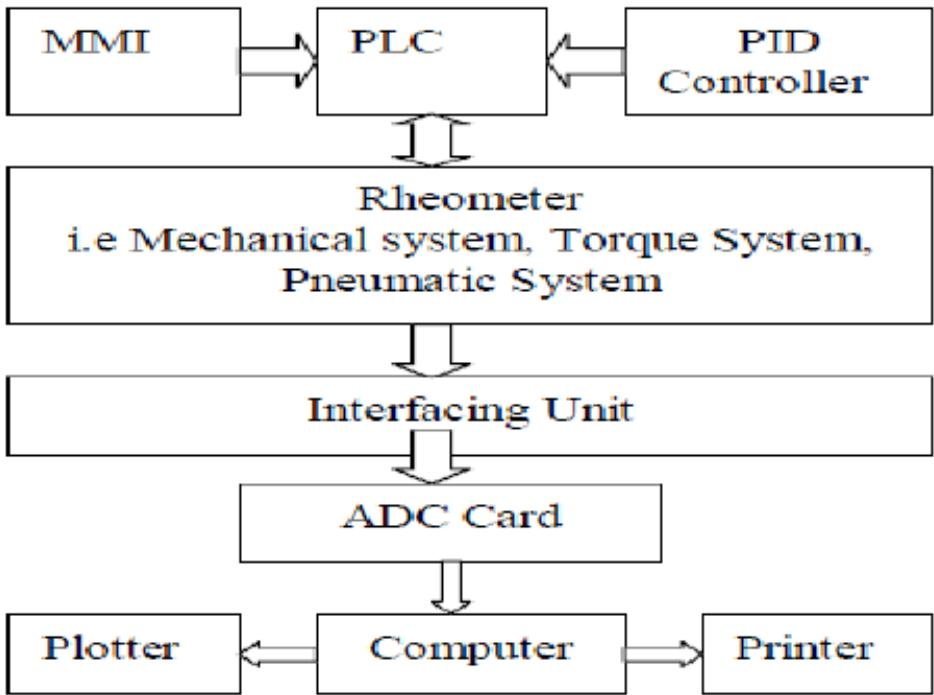

> 🧠 **[Cognis Multimodal Enrichment]**
> * **Classification:** Scientific Figure
> * **Extracted Text (OCR):** `MMI, PLC, PID Controller, Rheometer, Mechanical system, Torque System, Pneumatic System, Interfacing Unit, ADC Card, Plotter, Computer, Printer`
> * **VLM Visual Summary:** ### FIGURE TYPE:
>   Instrument Schematic
>   
>   ### SCIENTIFIC PURPOSE:
>   This figure illustrates the block diagram of a Rheometer, which is a device used to measure the rheological properties of materials.
>   
>   ### KEY KNOWLEDGE:
>   1. **Rheometer Components**:
>      - **MMI (Man-Machine Interface)**: Used for inputting data and instructions.
>      - **PLC (Programmable Logic Controller)**: Manages the operation of the rheometer.
>      - **PID Controller**: Controls the system based on feedback from the rheometer.
>      - **Rheometer**: Includes mechanical, torque, and pneumatic systems.
>      - **Interfacing Unit**: Connects the rheometer to the ADC card.
>      - **ADC Card**: Converts analog signals to digital signals.
>      - **Plotter**: Displays results graphically.
>      - **Computer**: Processes and stores data.
>      - **Printer**: Outputs printed reports.
>   
>   2. **Rheometer Functionality**:
>      - The rheometer measures the viscosity and elasticity of materials under various conditions.
>      - It can measure dynamic viscosity, shear rate, shear stress, speed, torque, temperature, time, kinematic viscosity, fixed points, and deformation.
>   
>   3. **Principle of Operation**:
>      - The fluid is sheared in a narrow gap between concentric cylinders, parallel plates, or a cone and a plate.
>      - The viscosity is defined as the ratio of shear stress to shear rate.
>      - The stress is related to the torque and the shear rate to the angular velocity.
>      - The rheometer allows for multiple experimental modes, including controlling shear rate, shear deformation, or shear stress.
>   
>   4. **Important Properties Measurable**:
>      - Dynamic viscosity
>      - Shear rate
>      - Shear stress
>      - Speed
>      - Torque
>      - Temperature
>      - Time
>      - Kinematic viscosity
>      - Fixed points
>      - Deformation
>   
>   5. **Procedure**:
>      - Turn on the rheometer/viscometer.
>      - Turn on the thermostat water bath.
>      - Turn on the computer and start the rheoplus program.
>      - Initialize the rheometer.
>      - Select the desired tool.
>      - Set the default program.
>      - Start the adjustment.
>      - Position the sample correctly.
>      - Put the sample in place.
>   
>   ### LABEL INTERPRETATION:
>   - **MMI**: Man-Machine Interface
> * **Figure Caption:** Lab Manual for Instrumental Methods of Analysis (CHC 506) | Block diagram of Rheometer.
> * **Surrounding Context (+/- 300 words):**
>   * **[Before]:** *... fluid. There are two distinctively different types of rheometers. Rheometers that control the applied shear stress or shear strain are called rotational or shear rheometers, whereas rheometers that apply extensional stress or extensional strain are extensional rheometers. Rotational or shear type rheometers are usually designed as either a native strain-controlled instrument (control and apply a user-defined shear strain which can then measure the resulting shear stress) or a native stress-controlled instrument (control and apply user-defined shear stress and measure the resulting shear strain). A rheometer is a device used to measure the rheological properties of materials; rheology being defined as the study of the flow and deformation of matter, which describes the interrelation between force, deformation and time. [Section: Experiment No 6: RHEOMETER > Theory:] Unlike a viscometer, which can only measure the viscosity of a fluid under a limited range of conditions, a rheometer is capable of measuring viscosity and elasticity of non-Newtonian materials under a wide range of conditions. Some of the most important properties that can be measured using a rheometer include viscoelasticity, yield stress, thixotropy, extensional viscosity, creep compliance and stress relaxation behaviour, as well as process-relevant parameters such as die swell, melt fracture. In general,either the fluid remains stationary and the object moves through it.or the object is stationary, and the fluid moves past it.the drag caused by the relative motion of fluid and surface is a measure of viscosity.the flow conditions must have viscosity value of Reynolds number less than 2100 for laminar flow.Rotational viscometer uses the idea that torque requiredto turn on an object in a fluid is a function of the viscosity of that fluid. They measure the torque required to rotate a disk or bob in a fluid at a known speed. Lab Manual for Instrumental Methods of Analysis (CHC 506)*
>   * **[After]:** *Block diagram of Rheometer. [Section: Experiment No 6: RHEOMETER > Principle:] The fluid is sheared in a narrow gap between concentric cylinders, parallel plates or a cone and a plate. The viscosity is defined as the ratio of the shear stress and the shear rate. The stress is related to the torque and the shear rate to the angular velocity. One of these quantities is preselected the other is measured, depending on the set-up of the instrument (controlled stress / controlled strain). A great variety of tools is available to cover a large viscosity and shear rate range. Elastic material-functions can be obtained from axial forces acting perpendicular to the plane of shear in cone-plate or plate-plate geometry. Rotational rheometers allow for numerous experimental modes controlling either shear rate, shear deformation or shear stress. PROPERTIES WHICH CAN BE MEASURED: <table><tr><td rowspan=1 colspan=1>1） Dynamic viscosity</td><td rowspan=1 colspan=1>6) temperature</td></tr><tr><td rowspan=1 colspan=1>2 Shear rate</td><td rowspan=1 colspan=1>7)time</td></tr><tr><td rowspan=1 colspan=1>3 Shear stress</td><td rowspan=1 colspan=1>8)kinematic viscosity</td></tr><tr><td rowspan=1 colspan=1>4） Speed</td><td rowspan=1 colspan=1> 9)fixed point</td></tr><tr><td rowspan=1 colspan=1>5） Torque</td><td rowspan=1 colspan=1>10)deformation</td></tr></table> Rotational Rheometer [Section: Experiment No 6: RHEOMETER > Procedure:] ➢ Turn on the rheometer/viscometer. ➢ Turn on the thermostat water bath. The setpoint should be between 20 to $3 0 \mathrm { { } ^ { \circ } C }$ (the bath is used only as a thermal reservoir). ➢ Turn on computer, start the rheoplus program on computer. ➢ In toolbar press the icon “device”, which is a symbol of “rheometer”. ➢ In the control panel tab in the new window, press initialize to start. ➢ Put your desired tool. ➢ In control panel tab, press “set zero gap”. ➢ Set “default program”. ➢ Press “start” to begin adjustment. ➢ In the control panel tab, lift position high enough to put your sample(60mm recommendable). ➢ Put your ...*
  
Block diagram of Rheometer.

## Principle:

The fluid is sheared in a narrow gap between concentric cylinders, parallel plates or a cone and a plate. The viscosity is defined as the ratio of the shear stress and the shear rate. The stress is related to the torque and the shear rate to the angular velocity. One of these quantities is preselected the other is measured, depending on the set-up of the instrument (controlled stress / controlled strain). A great variety of tools is available to cover a large viscosity and shear rate range. Elastic material-functions can be obtained from axial forces acting perpendicular to the plane of shear in cone-plate or plate-plate geometry. Rotational rheometers allow for numerous experimental modes controlling either shear rate, shear deformation or shear stress.

PROPERTIES WHICH CAN BE MEASURED:
<table><tr><td rowspan=1 colspan=1>1） Dynamic viscosity</td><td rowspan=1 colspan=1>6) temperature</td></tr><tr><td rowspan=1 colspan=1>2 Shear rate</td><td rowspan=1 colspan=1>7)time</td></tr><tr><td rowspan=1 colspan=1>3 Shear stress</td><td rowspan=1 colspan=1>8)kinematic viscosity</td></tr><tr><td rowspan=1 colspan=1>4） Speed</td><td rowspan=1 colspan=1> 9)fixed point</td></tr><tr><td rowspan=1 colspan=1>5） Torque</td><td rowspan=1 colspan=1>10)deformation</td></tr></table>

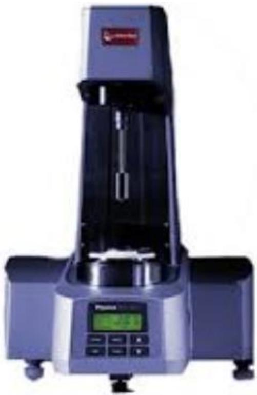

> 🧠 **[Cognis Multimodal Enrichment]**
> * **Classification:** Scientific Figure
> * **VLM Visual Summary:** **FIGURE TYPE:** Laboratory Equipment Photograph
>   
>   **SCIENTIFIC PURPOSE:** This figure illustrates a laboratory equipment, specifically a rotational rheometer, which is used to measure various properties of fluids, including dynamic viscosity, shear rate, shear stress, speed, torque, and kinematic viscosity.
>   
>   **KEY KNOWLEDGE:**
>   1. **Dynamic Viscosity:** The viscosity of a fluid is a measure of its resistance to flow. It is defined as the ratio of shear stress to shear rate.
>   2. **Shear Rate:** The rate at which a fluid is sheared, typically expressed as revolutions per minute (RPM) or revolutions per second (RPS).
>   3. **Shear Stress:** The force applied per unit area that causes a fluid to deform.
>   4. **Speed:** The rate at which the object rotates in the fluid.
>   5. **Torque:** The rotational force required to turn the object in the fluid.
>   6. **Kinematic Viscosity:** The ratio of dynamic viscosity to density, providing a measure of how easily a fluid flows.
>   7. **Temperature:** The temperature at which the measurements are taken.
>   8. **Time:** The duration of the experiment.
>   9. **Fixed Point:** A specific location where the experiment is conducted.
>   10. **Deformation:** The change in shape or size of the fluid due to the applied shear stress.
>   
>   **LABEL INTERPRETATION:**
>   - **1) Dynamic viscosity:** The viscosity of the fluid being measured.
>   - **2) Shear rate:** The rate at which the fluid is sheared.
>   - **3) Shear stress:** The force applied per unit area causing deformation.
>   - **4) Speed:** The rotation speed of the object in the fluid.
>   - **5) Torque:** The force required to turn the object in the fluid.
>   - **6) Temperature:** The temperature at which the measurements are taken.
>   - **7) Time:** The duration of the experiment.
>   - **8) Kinematic viscosity:** The ratio of dynamic viscosity to density.
>   - **9) Fixed point:** The specific location where the experiment is conducted.
>   - **10) Deformation:** The change in shape or size of the fluid due to the applied shear stress.
>   
>   **ENGINEERING/SCIENTIFIC INSIGHTS:**
>   This figure provides a clear view of a rotational rheometer, highlighting its key components and their functions. Understanding the operation of a rheometer is crucial for researchers and engineers working with
> * **Figure Caption:** <table><tr><td rowspan=1 colspan=1>1） Dynamic viscosity</td><td rowspan=1 colspan=1>6) temperature</td></tr><tr><td rowspan=1 colspan=1>2 Shear rate</td><td rowspan=1 colspan=1>7)time</td></tr><tr><td rowspan=1 colspan=1>3 Shear stress</td><td rowspan=1 colspan=1>8)kinematic viscosity</td></tr><tr><td rowspan=1 colspan=1>4） Speed</td><td rowspan=1 colspan=1> 9)fixed point</td></tr><tr><td rowspan=1 colspan=1>5） Torque</td><td rowspan=1 colspan=1>10)deformation</td></tr></table> | Rotational Rheometer
> * **Surrounding Context (+/- 300 words):**
>   * **[Before]:** *... a rheometer include viscoelasticity, yield stress, thixotropy, extensional viscosity, creep compliance and stress relaxation behaviour, as well as process-relevant parameters such as die swell, melt fracture. In general,either the fluid remains stationary and the object moves through it.or the object is stationary, and the fluid moves past it.the drag caused by the relative motion of fluid and surface is a measure of viscosity.the flow conditions must have viscosity value of Reynolds number less than 2100 for laminar flow.Rotational viscometer uses the idea that torque requiredto turn on an object in a fluid is a function of the viscosity of that fluid. They measure the torque required to rotate a disk or bob in a fluid at a known speed. Lab Manual for Instrumental Methods of Analysis (CHC 506) Block diagram of Rheometer. [Section: Experiment No 6: RHEOMETER > Principle:] The fluid is sheared in a narrow gap between concentric cylinders, parallel plates or a cone and a plate. The viscosity is defined as the ratio of the shear stress and the shear rate. The stress is related to the torque and the shear rate to the angular velocity. One of these quantities is preselected the other is measured, depending on the set-up of the instrument (controlled stress / controlled strain). A great variety of tools is available to cover a large viscosity and shear rate range. Elastic material-functions can be obtained from axial forces acting perpendicular to the plane of shear in cone-plate or plate-plate geometry. Rotational rheometers allow for numerous experimental modes controlling either shear rate, shear deformation or shear stress. PROPERTIES WHICH CAN BE MEASURED: <table><tr><td rowspan=1 colspan=1>1） Dynamic viscosity</td><td rowspan=1 colspan=1>6) temperature</td></tr><tr><td rowspan=1 colspan=1>2 Shear rate</td><td rowspan=1 colspan=1>7)time</td></tr><tr><td rowspan=1 colspan=1>3 Shear stress</td><td rowspan=1 colspan=1>8)kinematic viscosity</td></tr><tr><td rowspan=1 colspan=1>4） Speed</td><td rowspan=1 colspan=1> 9)fixed point</td></tr><tr><td rowspan=1 colspan=1>5） Torque</td><td rowspan=1 colspan=1>10)deformation</td></tr></table>*
>   * **[After]:** *Rotational Rheometer [Section: Experiment No 6: RHEOMETER > Procedure:] ➢ Turn on the rheometer/viscometer. ➢ Turn on the thermostat water bath. The setpoint should be between 20 to $3 0 \mathrm { { } ^ { \circ } C }$ (the bath is used only as a thermal reservoir). ➢ Turn on computer, start the rheoplus program on computer. ➢ In toolbar press the icon “device”, which is a symbol of “rheometer”. ➢ In the control panel tab in the new window, press initialize to start. ➢ Put your desired tool. ➢ In control panel tab, press “set zero gap”. ➢ Set “default program”. ➢ Press “start” to begin adjustment. ➢ In the control panel tab, lift position high enough to put your sample(60mm recommendable). ➢ Put your sample on plate. ➢ Set temperature. ➢ In the control panel tab, lift position. ➢ Pressmeasuring position to go to measuring distance. ➢ Remove entered sample. [Section: Experiment No 6: RHEOMETER > Lab Manual for Instrumental Methods of Analysis (CHC 506)] ➢ The status column in your data table is good indication of reliability of measurement. After measurements are done: ✓ Lift the position to clean the plate. ✓ Clean the plate with distilled water or organic solvents(if needed). ✓ Exit rheoplus program. ✓ Take off the tool and clean it with water. ✓ Turn off device, thermostat bath and the computer. [Section: Experiment No 6: RHEOMETER > Observation table] <table><tr><td rowspan=1 colspan=1>S.NO</td><td rowspan=1 colspan=1>Time</td><td rowspan=1 colspan=1>Viscosity</td><td rowspan=1 colspan=1>Shear rate</td><td rowspan=1 colspan=1>Shear stress</td><td rowspan=1 colspan=1>torque</td></tr><tr><td rowspan=1 colspan=1></td><td rowspan=1 colspan=1></td><td rowspan=1 colspan=1></td><td rowspan=1 colspan=1></td><td rowspan=1 colspan=1></td><td rowspan=1 colspan=1></td></tr><tr><td rowspan=1 colspan=1></td><td rowspan=1 colspan=1></td><td rowspan=1 colspan=1></td><td rowspan=1 colspan=1></td><td rowspan=1 colspan=1></td><td rowspan=1 colspan=1></td></tr><tr><td rowspan=1 colspan=1></td><td rowspan=1 colspan=1></td><td rowspan=1 colspan=1></td><td rowspan=1 colspan=1></td><td rowspan=1 colspan=1></td><td rowspan=1 colspan=1></td></tr><tr><td rowspan=1 colspan=1></td><td rowspan=1 colspan=1></td><td rowspan=1 colspan=1></td><td rowspan=1 colspan=1></td><td rowspan=1 colspan=1></td><td rowspan=1 ...*
  
Rotational Rheometer

## Procedure:

➢ Turn on the rheometer/viscometer.

➢ Turn on the thermostat water bath. The setpoint should be between 20 to $3 0 \mathrm { { } ^ { \circ } C }$ (the bath is used only as a thermal reservoir).

➢ Turn on computer, start the rheoplus program on computer.

➢ In toolbar press the icon “device”, which is a symbol of “rheometer”.

➢ In the control panel tab in the new window, press initialize to start.

➢ Put your desired tool.

➢ In control panel tab, press “set zero gap”.

➢ Set “default program”.

➢ Press “start” to begin adjustment.

➢ In the control panel tab, lift position high enough to put your sample(60mm recommendable).

➢ Put your sample on plate.

➢ Set temperature.

➢ In the control panel tab, lift position.

➢ Pressmeasuring position to go to measuring distance.

➢ Remove entered sample.

## Lab Manual for Instrumental Methods of Analysis (CHC 506)

➢ The status column in your data table is good indication of reliability of measurement.

After measurements are done:

✓ Lift the position to clean the plate.

✓ Clean the plate with distilled water or organic solvents(if needed).

✓ Exit rheoplus program.

✓ Take off the tool and clean it with water.

✓ Turn off device, thermostat bath and the computer.

## Observation table

<table><tr><td rowspan=1 colspan=1>S.NO</td><td rowspan=1 colspan=1>Time</td><td rowspan=1 colspan=1>Viscosity</td><td rowspan=1 colspan=1>Shear rate</td><td rowspan=1 colspan=1>Shear stress</td><td rowspan=1 colspan=1>torque</td></tr><tr><td rowspan=1 colspan=1></td><td rowspan=1 colspan=1></td><td rowspan=1 colspan=1></td><td rowspan=1 colspan=1></td><td rowspan=1 colspan=1></td><td rowspan=1 colspan=1></td></tr><tr><td rowspan=1 colspan=1></td><td rowspan=1 colspan=1></td><td rowspan=1 colspan=1></td><td rowspan=1 colspan=1></td><td rowspan=1 colspan=1></td><td rowspan=1 colspan=1></td></tr><tr><td rowspan=1 colspan=1></td><td rowspan=1 colspan=1></td><td rowspan=1 colspan=1></td><td rowspan=1 colspan=1></td><td rowspan=1 colspan=1></td><td rowspan=1 colspan=1></td></tr><tr><td rowspan=1 colspan=1></td><td rowspan=1 colspan=1></td><td rowspan=1 colspan=1></td><td rowspan=1 colspan=1></td><td rowspan=1 colspan=1></td><td rowspan=1 colspan=1></td></tr><tr><td rowspan=1 colspan=1></td><td rowspan=1 colspan=1></td><td rowspan=1 colspan=1></td><td rowspan=1 colspan=1></td><td rowspan=1 colspan=1></td><td rowspan=1 colspan=1></td></tr><tr><td rowspan=1 colspan=1></td><td rowspan=1 colspan=1></td><td rowspan=1 colspan=1></td><td rowspan=1 colspan=1></td><td rowspan=1 colspan=1></td><td rowspan=1 colspan=1></td></tr><tr><td rowspan=1 colspan=1></td><td rowspan=1 colspan=1></td><td rowspan=1 colspan=1></td><td rowspan=1 colspan=1></td><td rowspan=1 colspan=1></td><td rowspan=1 colspan=1></td></tr></table>

## Result/Discussion:

Precautions:

Observation:

## Questionnaire:

Q1. What is the function of Rheometer?

Q2. What are its types?

Q3. Describe the working procedure of Rheometer?

Lab Manual for Instrumental Methods of Analysis (CHC 506)

# Experiment No7: Goniometer/Tensiometer

Aim: To determine the contact angle, surface tension and interfacial angle

Apparatus: Tensiometer DSA25S

Theory: Tensiometer performs high precision, automatic and reliable measurements of surface tension,interfacial tension, critical micelle concentration,contact angle of solid fibres and powder with high quality components and a uniquely wide range of methods.

Contact Angle: it is the angle conventionally measured through liquid, where the liquidvapour interface meets the solid surface. It quantifies the wettability of the solid surface by a liquid via the Young’s equation. A given system of the solid, liquid and vapour at a given temperature and pressure has an unique equilibrium contact angle. If the solid-vapour interfacial energy is denoted by $\gamma _ { \mathrm { s g } } ,$ the solid-liquid energy by $\gamma _ { \mathrm { s l } }$ and the liquid-vapour energy by $\gamma _ { \mathrm { l g } }$ then the equilibrium contact angle $\theta _ { \mathrm { c } }$ is given by

??sg- $\gamma _ { \mathrm { s l } } - \gamma _ { \mathrm { l g } }$ cos $\theta _ { \mathrm { c } } = 0$

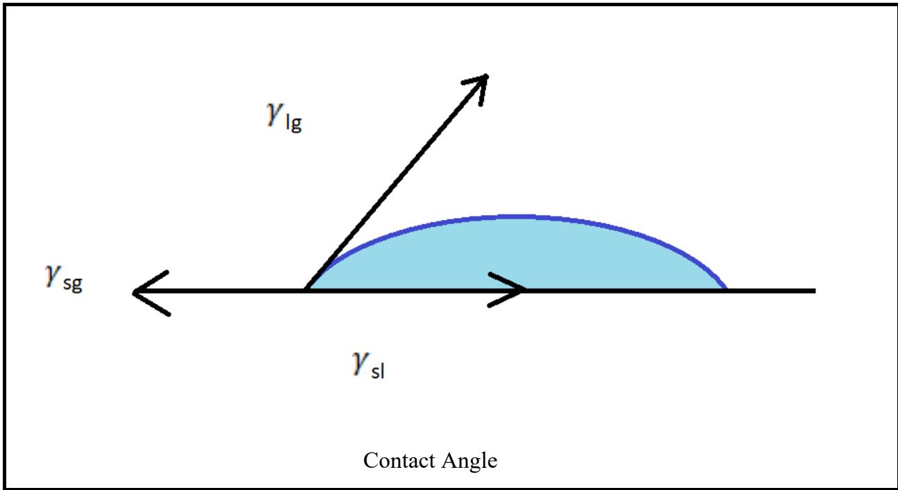

> 🧠 **[Cognis Multimodal Enrichment]**
> * **Classification:** Scientific Figure
> * **Extracted Text (OCR):** `γlg, γsl, γsg, Contact Angle`
> * **VLM Visual Summary:** ### FIGURE TYPE:
>   **Instrument Schematic**
>   
>   ### SCIENTIFIC PURPOSE:
>   This figure illustrates the relationship between the interfacial tensions ($\gamma_{sl}$, $\gamma_{lg}$) and the contact angle ($\theta_c$) using the Young's equation. Specifically, it shows how the contact angle can be determined based on the interfacial tensions involved in the liquid-solid-gas system.
>   
>   ### KEY KNOWLEDGE:
>   1. **Young's Equation**: The equilibrium contact angle $\theta_c$ is given by the equation $\gamma_{sl} - \gamma_{lg} \cos(\theta_c) = 0$. This equation relates the interfacial tensions between the solid-liquid ($\gamma_{sl}$), liquid-vapor ($\gamma_{lg}$), and solid-vapor ($\gamma_{sg}$) interfaces.
>      
>   2. **Interfacial Tensions**: These are the forces that resist the separation of two phases at an interface. They are crucial in understanding wetting behavior and the stability of interfaces.
>   
>   3. **Contact Angle**: This is the angle formed at the point where a liquid meets a solid surface. It is a fundamental parameter in surface science and materials engineering, used to assess the wettability of surfaces.
>   
>   4. **Gibb's Free Energy**: The interfacial tension is related to the Gibbs free energy per unit area at a fixed temperature and pressure, indicating the energy required to separate the two phases at the interface.
>   
>   ### LABEL INTERPRETATION:
>   - **$\gamma_{sl}$**: Solid-Liquid Interfacial Tension
>   - **$\gamma_{lg}$**: Liquid-Vapor Interfacial Tension
>   - **$\gamma_{sg}$**: Solid-Gas Interfacial Tension
>   - **$\theta_c$**: Contact Angle
>   
>   ### ENGINEERING/SCIENTIFIC INSIGHTS:
>   This figure provides a clear visualization of the relationship between the interfacial tensions and the contact angle, which is essential for understanding how liquids interact with solid surfaces. It helps in predicting the behavior of liquids in various applications, such as coating processes, adhesion studies, and the design of microfluidic devices.
>   
>   ### USER-RELEVANT INFORMATION:
>   The information provided by this figure can help answer questions about the conditions under which a liquid will wet a particular surface, the stability of interfaces, and the design of systems that require precise control over liquid behavior. Understanding these relationships is crucial in fields such as
> * **Figure Caption:** ??sg- $\gamma _ { \mathrm { s l } } - \gamma _ { \mathrm { l g } }$ cos $\theta _ { \mathrm { c } } = 0$ | [Section: Experiment No7: Goniometer/Tensiometer]
> * **Surrounding Context (+/- 300 words):**
>   * **[Before]:** *... colspan=1></td><td rowspan=1 colspan=1></td><td rowspan=1 colspan=1></td><td rowspan=1 colspan=1></td><td rowspan=1 colspan=1></td><td rowspan=1 colspan=1></td></tr><tr><td rowspan=1 colspan=1></td><td rowspan=1 colspan=1></td><td rowspan=1 colspan=1></td><td rowspan=1 colspan=1></td><td rowspan=1 colspan=1></td><td rowspan=1 colspan=1></td></tr><tr><td rowspan=1 colspan=1></td><td rowspan=1 colspan=1></td><td rowspan=1 colspan=1></td><td rowspan=1 colspan=1></td><td rowspan=1 colspan=1></td><td rowspan=1 colspan=1></td></tr><tr><td rowspan=1 colspan=1></td><td rowspan=1 colspan=1></td><td rowspan=1 colspan=1></td><td rowspan=1 colspan=1></td><td rowspan=1 colspan=1></td><td rowspan=1 colspan=1></td></tr><tr><td rowspan=1 colspan=1></td><td rowspan=1 colspan=1></td><td rowspan=1 colspan=1></td><td rowspan=1 colspan=1></td><td rowspan=1 colspan=1></td><td rowspan=1 colspan=1></td></tr></table> [Section: Experiment No 6: RHEOMETER > Result/Discussion:] Precautions: Observation: [Section: Experiment No 6: RHEOMETER > Questionnaire:] Q1. What is the function of Rheometer? Q2. What are its types? Q3. Describe the working procedure of Rheometer? Lab Manual for Instrumental Methods of Analysis (CHC 506) [Section: Experiment No7: Goniometer/Tensiometer] Aim: To determine the contact angle, surface tension and interfacial angle Apparatus: Tensiometer DSA25S Theory: Tensiometer performs high precision, automatic and reliable measurements of surface tension,interfacial tension, critical micelle concentration,contact angle of solid fibres and powder with high quality components and a uniquely wide range of methods. Contact Angle: it is the angle conventionally measured through liquid, where the liquidvapour interface meets the solid surface. It quantifies the wettability of the solid surface by a liquid via the Young’s equation. A given system of the solid, liquid and vapour at a given temperature and pressure has an unique equilibrium contact angle. If the solid-vapour interfacial energy is denoted by $\gamma _ { \mathrm { s g } } ,$ the solid-liquid energy by $\gamma _ { \mathrm { s l } }$ and the liquid-vapour energy by $\gamma _ { \mathrm { l g } }$ then the equilibrium contact angle $\theta _ { \mathrm { c } }$ is given by ??sg- $\gamma _ { \mathrm { s l } } - \gamma _ { \mathrm { l g } }$ cos $\theta _ { \mathrm { c } } = 0$*
>   * **[After]:** *[Section: Experiment No7: Goniometer/Tensiometer] Surface Tension: The cohesive forces between the liquid molecules are responsible for the phenomena of surface tension. The molecules at the surface unlike other molecules don’t have surface on all sides. This forms a surface film which makes it more difficult to move an object through the surface then move it when it is completely submerged. Example of surface tension: Walking of small insects on water because their weight is not enough to penetrate the surface. Interfacial Angle: A property of the interface between two immiscible phases. When the phases are both liquid, it is termed as interfacial tension; when one of the phases is air then it [Section: Experiment No7: Goniometer/Tensiometer > Lab Manual for Instrumental Methods of Analysis (CHC 506)] is called Surface Tension. Interfacial Tension is the Gibb’s free energy per unit area at fixed temperature and pressure. Interfacial Tension occurs because a molecule near an interface has different molecular interactions than an equivalent molecule within the bulk fluid. Surfactant molecules preferentially position themselves at the interface and thereby lower the interfacial tension. Principle: In order to measure the contact angle with the DSA25 a drop is placed on a sample located on the sample table. The drop is illuminated from one side and a camera at the drop . The drop image is transferred to the computer and shown on the monitor. The DSA software contains the time proven tools for analysing the drop image with whose help it is possible to calculate the contact angle, surface tension and surface energies. [Section: Experiment No7: Goniometer/Tensiometer > Procedure:] ✓ Open DSA 25 Software. ✓ Before starting the experiment, ensure the fan and A.C. be switched OFF. ✓ Fill the sample into the syringe. ✓ Fix the syringe in the desired location of the ...*

Surface Tension: The cohesive forces between the liquid molecules are responsible for the phenomena of surface tension. The molecules at the surface unlike other molecules don’t have surface on all sides. This forms a surface film which makes it more difficult to move an object through the surface then move it when it is completely submerged. Example of surface tension: Walking of small insects on water because their weight is not enough to penetrate the surface. Interfacial Angle: A property of the interface between two immiscible phases. When the phases are both liquid, it is termed as interfacial tension; when one of the phases is air then it

## Lab Manual for Instrumental Methods of Analysis (CHC 506)

is called Surface Tension. Interfacial Tension is the Gibb’s free energy per unit area at fixed temperature and pressure. Interfacial Tension occurs because a molecule near an interface has different molecular interactions than an equivalent molecule within the bulk fluid. Surfactant molecules preferentially position themselves at the interface and thereby lower the interfacial tension.

Principle: In order to measure the contact angle with the DSA25 a drop is placed on a sample located on the sample table. The drop is illuminated from one side and a camera at the drop . The drop image is transferred to the computer and shown on the monitor. The DSA software contains the time proven tools for analysing the drop image with whose help it is possible to calculate the contact angle, surface tension and surface energies.

## Procedure:

✓ Open DSA 25 Software.

✓ Before starting the experiment, ensure the fan and A.C. be switched OFF.

✓ Fill the sample into the syringe.

✓ Fix the syringe in the desired location of the Tensiometer.

✓ Select the tools-MT wizard-select method-pendant method.

✓ For the pendant drop, form the drop in such a way that it is at the edge of the needle of the syringe.

✓ Select MT setting- measuring quantity- SFT- IFT using pendant drop method.

✓ For presentation and report select displaying items.

✓ For baseline determination draw the line at the interface of the solid and liquid of drop which is shown in the monitor.

✓ Go to the profile extraction menu.

✓ Click on computation.

✓ Run computation series for multiple data.

## Observation:

Table 1:
<table><tr><td rowspan=1 colspan=1>Run No.</td><td rowspan=1 colspan=1> IFT(mN/m)</td><td rowspan=1 colspan=1>Volume(mL)</td></tr><tr><td rowspan=1 colspan=1></td><td rowspan=1 colspan=1></td><td rowspan=1 colspan=1></td></tr></table>

Table 2:
<table><tr><td rowspan=1 colspan=1>Run No.</td><td rowspan=1 colspan=1>IFT(mN/m)</td><td rowspan=1 colspan=1>Volume(mL)0</td><td rowspan=1 colspan=1>c(degree)</td><td rowspan=1 colspan=1>0m(degree)0</td><td rowspan=1 colspan=1>r(degree)</td></tr><tr><td rowspan=1 colspan=1></td><td rowspan=1 colspan=1></td><td rowspan=1 colspan=1></td><td rowspan=1 colspan=1></td><td rowspan=1 colspan=1></td><td rowspan=1 colspan=1></td></tr></table>

Application:

Precautions:

Results and Discussion:

## Questionnaire:

1. What is static contact angle?

2. What are the different procedures of removing the hydrophobicity of a surface?

3. What is super hydrophobicity?

Fig 2: Refraction

## Lab Manual for Instrumental Methods of Analysis (CHC 506)

## Experiment No 8: Refractometer

Aim: To get calibration curve for the Mettler Toledo for mixtures of different liquids.

Apparatus: Mettler Toledo Refractometer.

Theory: The Mettler Toledo Refractometer is used for the simple determination of Refractive Index of liquid Sample. It has the following points:

1. Measures sample with a Refractive Index in the range 1.3200-1.5000.

2. Needs the temperature of sample being measured constant between 15 to $4 0 ^ { \circ } \mathrm { C }$

3. Needs the minimum amount of sample 0.4 mL for measurement.

Refractive Index: The refractive index “n” of a substance is the ratio of the velocity of a ray of light in vacuum to it’s velocity in the medium. If a ray of light at a particular angle passes from air to water, it changes it’s direction except when the incident light is vertical. According to Snell’s law of refraction the ratio of the refractive indices of the two medium is proportional to the ratio of sine of angle of refraction and sine of angle of incidence of ray of light.

$$
\frac { n 1 } { n 2 } = \frac { s i n \beta } { s i n \alpha }
$$

If a ray of light passes into an optically less dense medium from a denser medium it also changes, it’s direction. If the angle of incidence is increased till it reaches it’s critical value(angle of refraction $\beta = 9 0 ^ { \circ } )$ at which the ray of light no longer passes into the optically less dense medium, if this critical angle is exceeded, total internal reflection occurs. The critical angle is used to calculate the Refractive Index.

$$
n 1 = { { n } \ o { 2 } } { \big / } _ { s i n \alpha }
$$

Where $\beta = 9 0 ^ { \circ }$ ,sin $\beta = 1$

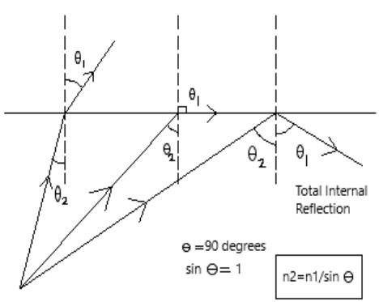

> 🧠 **[Cognis Multimodal Enrichment]**
> * **Classification:** Scientific Figure
> * **Extracted Text (OCR):** `theta1, theta2, Total Internal Reflection, e=90 degrees, sin theta=1, n2=n1/sin theta`
> * **VLM Visual Summary:** ### FIGURE TYPE:
>   **Instrument Schematic**
>   
>   ### SCIENTIFIC PURPOSE:
>   The figure explains the principle of total internal reflection (TIR) and its application in measuring the refractive index of materials.
>   
>   ### KEY KNOWLEDGE:
>   1. **Total Internal Reflection (TIR):** This phenomenon occurs when a light ray traveling from a medium with a higher refractive index to a medium with a lower refractive index encounters the boundary between the two media at an angle greater than the critical angle (\(\theta_1\)).
>   2. **Critical Angle (\(\theta_1\))**: The critical angle is defined as the angle of incidence at which the angle of refraction becomes 90 degrees. At this point, the light ray is completely reflected back into the first medium without passing into the second medium.
>   3. **Snell's Law**: The relationship between the angles of incidence (\(\alpha\)) and refraction (\(\beta\)) is given by Snell's law: \(\frac{n_1}{n_2} = \frac{\sin(\beta)}{\sin(\alpha)}\).
>   
>   ### LABEL INTERPRETATION:
>   - **\(\theta_1\)**: The angle of incidence.
>   - **\(\theta_2\)**: The angle of refraction.
>   - **Total Internal Reflection**: Indicates that the light ray is completely reflected back into the first medium.
>   
>   ### ENGINEERING/SCIENTIFIC INSIGHTS:
>   A reader should learn that total internal reflection is crucial for understanding how light behaves at the interface between different media and how it can be used to measure the refractive index of materials.
>   
>   ### USER-RELEVANT INFORMATION:
>   The information provided in the figure helps answer future questions about the principles of TIR, its applications in various scientific fields, and how it relates to the measurement of refractive index.
> * **Figure Caption:** Where $\beta = 9 0 ^ { \circ }$ ,sin $\beta = 1$ | [Section: Experiment No7: Goniometer/Tensiometer > Procedure:]
> * **Surrounding Context (+/- 300 words):**
>   * **[Before]:** *... simple determination of Refractive Index of liquid Sample. It has the following points: 1. Measures sample with a Refractive Index in the range 1.3200-1.5000. 2. Needs the temperature of sample being measured constant between 15 to $4 0 ^ { \circ } \mathrm { C }$ 3. Needs the minimum amount of sample 0.4 mL for measurement. Refractive Index: The refractive index “n” of a substance is the ratio of the velocity of a ray of light in vacuum to it’s velocity in the medium. If a ray of light at a particular angle passes from air to water, it changes it’s direction except when the incident light is vertical. According to Snell’s law of refraction the ratio of the refractive indices of the two medium is proportional to the ratio of sine of angle of refraction and sine of angle of incidence of ray of light. $$ \frac { n 1 } { n 2 } = \frac { s i n \beta } { s i n \alpha } $$ [Section: Experiment No7: Goniometer/Tensiometer > Experiment No 8: Refractometer] If a ray of light passes into an optically less dense medium from a denser medium it also changes, it’s direction. If the angle of incidence is increased till it reaches it’s critical value(angle of refraction $\beta = 9 0 ^ { \circ } )$ at which the ray of light no longer passes into the optically less dense medium, if this critical angle is exceeded, total internal reflection occurs. The critical angle is used to calculate the Refractive Index. $$ n 1 = { { n } \ o { 2 } } { \big / } _ { s i n \alpha } $$ Where $\beta = 9 0 ^ { \circ }$ ,sin $\beta = 1$*
>   * **[After]:** *[Section: Experiment No7: Goniometer/Tensiometer > Procedure:] ➢ Prepare 10 different mixture sample of given liquids with known mole fractions. ➢ The container for sample is filled till the mark anointed on the equipment. ➢ The OK button was pressed on the meter and the refractive index from the screen was noted. ➢ The prism was cleaned. ➢ Above steps were repeated for next liquid sample mixtures. Observation: Table 1: <table><tr><td rowspan=1 colspan=1>S1. No.</td><td rowspan=1 colspan=1>Mole fraction</td><td rowspan=1 colspan=1>Refractive Index(n)</td><td rowspan=1 colspan=1> Temperature</td></tr><tr><td rowspan=1 colspan=1></td><td rowspan=1 colspan=1></td><td rowspan=1 colspan=1></td><td rowspan=1 colspan=1></td></tr><tr><td rowspan=1 colspan=1></td><td rowspan=1 colspan=1></td><td rowspan=1 colspan=1></td><td rowspan=1 colspan=1></td></tr></table> Table 2: <table><tr><td rowspan=1 colspan=1>Sample</td><td rowspan=1 colspan=1>Refractive Index</td><td rowspan=1 colspan=1>Temperature</td></tr><tr><td rowspan=1 colspan=1></td><td rowspan=1 colspan=1></td><td rowspan=1 colspan=1></td></tr></table> Application: Precautions: Results and Discussion: Questionnaire: 1. What is the principle of refractometer? 2. How does it function? 3. Describe the parts of refractometer using schematic diagram. [Section: Lab Manual for Instrumental Methods of Analysis (CHC 506) > Experiment No9: CHNS Analyzer] Aim: To study the working and operation of FLASH ER 1112 elemental analyser (CHNS). Theory : the CHNS analyzer find the utility in determining the percentage of Carbon , hydrogen, nitrogen, Sulphur and oxygen of organic compounds based on the principal of ‘’Dumas Method’’ which involve the complete and instantaneous oxidation of the sample by “flash combustion”. The combustion products are separated by chromatographic column and detected by the thermal conductivity detector(TCD), which gives an output signal proportional to the concentration of the individual component of the mixture. Carban Analysis: Organiccarban content is determined by using the inorganic carban value from coulometric analysis and calculating the difference between total carbon from CHNS analysis and inorganic carbon analyzed by coulometer. Nitrogen analysis : Nitrogen is one of the important limiting nutrients in the ocean. Biological nitrogen fixation, de nitrification and consumption of nutrient by photo-plankton ...*

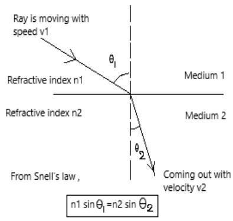

> 🧠 **[Cognis Multimodal Enrichment]**
> * **Classification:** Scientific Figure
> * **Extracted Text (OCR):** `Ray is moving with speed v1, Refractive index n1, Medium 1, Refractive index n2, Medium 2, From Snell's law, n1 sin θ1=n2 sin θ2, Coming out with velocity v2`
> * **VLM Visual Summary:** ### FIGURE TYPE:
>   **Instrument Schematic**
>   
>   ### SCIENTIFIC PURPOSE:
>   This figure illustrates the principle of Snell's Law, which describes how light bends when it moves from one medium to another. Specifically, it shows the relationship between the angles of incidence (\(\theta_1\)) and refraction (\(\theta_2\)) and the refractive indices (\(n_1\) and \(n_2\)) of the two media.
>   
>   ### KEY KNOWLEDGE:
>   1. **Snell's Law**: 
>      - The ratio of the sine of the angle of incidence to the sine of the angle of refraction is equal to the ratio of the refractive indices of the two media.
>      - Mathematically, \( \frac{n_1}{n_2} = \frac{\sin \theta_1}{\sin \theta_2} \).
>   
>   2. **Refractive Index**:
>      - The refractive index \(n\) of a substance is defined as the ratio of the speed of light in vacuum to its speed in the medium.
>      - For example, \( n = \frac{v_{\text{vacuum}}}{v_{\text{medium}}} \).
>   
>   3. **Angle of Incidence** (\(\theta_1\)):
>      - The angle between the incident ray and the normal to the surface of the boundary.
>   
>   4. **Angle of Refraction** (\(\theta_2\)):
>      - The angle between the refracted ray and the normal to the surface of the boundary.
>   
>   5. **Refractive Indices** (\(n_1\) and \(n_2\)):
>      - These are constants that depend on the properties of the materials through which the light travels.
>   
>   ### LABEL INTERPRETATION:
>   - **Ray is moving with speed \(v_1\)**: This indicates the initial speed of the light ray before it enters the second medium.
>   - **Refraction index \(n_1\)**: The refractive index of the first medium.
>   - **Refraction index \(n_2\)**: The refractive index of the second medium.
>   - **From Snell's law**, \(n_1 \sin \theta_1 = n_2 \sin \theta_2\): This equation represents Snell's Law, showing the relationship between the angles and refractive indices.
>   
>   ### ENGINEERING/SCIENTIFIC INSIGHTS:
>   This figure helps readers understand how
> * **Figure Caption:** Where $\beta = 9 0 ^ { \circ }$ ,sin $\beta = 1$ | [Section: Experiment No7: Goniometer/Tensiometer > Procedure:]
> * **Surrounding Context (+/- 300 words):**
>   * **[Before]:** *... simple determination of Refractive Index of liquid Sample. It has the following points: 1. Measures sample with a Refractive Index in the range 1.3200-1.5000. 2. Needs the temperature of sample being measured constant between 15 to $4 0 ^ { \circ } \mathrm { C }$ 3. Needs the minimum amount of sample 0.4 mL for measurement. Refractive Index: The refractive index “n” of a substance is the ratio of the velocity of a ray of light in vacuum to it’s velocity in the medium. If a ray of light at a particular angle passes from air to water, it changes it’s direction except when the incident light is vertical. According to Snell’s law of refraction the ratio of the refractive indices of the two medium is proportional to the ratio of sine of angle of refraction and sine of angle of incidence of ray of light. $$ \frac { n 1 } { n 2 } = \frac { s i n \beta } { s i n \alpha } $$ [Section: Experiment No7: Goniometer/Tensiometer > Experiment No 8: Refractometer] If a ray of light passes into an optically less dense medium from a denser medium it also changes, it’s direction. If the angle of incidence is increased till it reaches it’s critical value(angle of refraction $\beta = 9 0 ^ { \circ } )$ at which the ray of light no longer passes into the optically less dense medium, if this critical angle is exceeded, total internal reflection occurs. The critical angle is used to calculate the Refractive Index. $$ n 1 = { { n } \ o { 2 } } { \big / } _ { s i n \alpha } $$ Where $\beta = 9 0 ^ { \circ }$ ,sin $\beta = 1$*
>   * **[After]:** *[Section: Experiment No7: Goniometer/Tensiometer > Procedure:] ➢ Prepare 10 different mixture sample of given liquids with known mole fractions. ➢ The container for sample is filled till the mark anointed on the equipment. ➢ The OK button was pressed on the meter and the refractive index from the screen was noted. ➢ The prism was cleaned. ➢ Above steps were repeated for next liquid sample mixtures. Observation: Table 1: <table><tr><td rowspan=1 colspan=1>S1. No.</td><td rowspan=1 colspan=1>Mole fraction</td><td rowspan=1 colspan=1>Refractive Index(n)</td><td rowspan=1 colspan=1> Temperature</td></tr><tr><td rowspan=1 colspan=1></td><td rowspan=1 colspan=1></td><td rowspan=1 colspan=1></td><td rowspan=1 colspan=1></td></tr><tr><td rowspan=1 colspan=1></td><td rowspan=1 colspan=1></td><td rowspan=1 colspan=1></td><td rowspan=1 colspan=1></td></tr></table> Table 2: <table><tr><td rowspan=1 colspan=1>Sample</td><td rowspan=1 colspan=1>Refractive Index</td><td rowspan=1 colspan=1>Temperature</td></tr><tr><td rowspan=1 colspan=1></td><td rowspan=1 colspan=1></td><td rowspan=1 colspan=1></td></tr></table> Application: Precautions: Results and Discussion: Questionnaire: 1. What is the principle of refractometer? 2. How does it function? 3. Describe the parts of refractometer using schematic diagram. [Section: Lab Manual for Instrumental Methods of Analysis (CHC 506) > Experiment No9: CHNS Analyzer] Aim: To study the working and operation of FLASH ER 1112 elemental analyser (CHNS). Theory : the CHNS analyzer find the utility in determining the percentage of Carbon , hydrogen, nitrogen, Sulphur and oxygen of organic compounds based on the principal of ‘’Dumas Method’’ which involve the complete and instantaneous oxidation of the sample by “flash combustion”. The combustion products are separated by chromatographic column and detected by the thermal conductivity detector(TCD), which gives an output signal proportional to the concentration of the individual component of the mixture. Carban Analysis: Organiccarban content is determined by using the inorganic carban value from coulometric analysis and calculating the difference between total carbon from CHNS analysis and inorganic carbon analyzed by coulometer. Nitrogen analysis : Nitrogen is one of the important limiting nutrients in the ocean. Biological nitrogen fixation, de nitrification and consumption of nutrient by photo-plankton ...*

## Lab Manual for Instrumental Methods of Analysis (CHC 506)

## Procedure:

➢ Prepare 10 different mixture sample of given liquids with known mole fractions.

➢ The container for sample is filled till the mark anointed on the equipment.

➢ The OK button was pressed on the meter and the refractive index from the screen was noted.

➢ The prism was cleaned.

➢ Above steps were repeated for next liquid sample mixtures.

Observation:

Table 1:

<table><tr><td rowspan=1 colspan=1>S1. No.</td><td rowspan=1 colspan=1>Mole fraction</td><td rowspan=1 colspan=1>Refractive Index(n)</td><td rowspan=1 colspan=1> Temperature</td></tr><tr><td rowspan=1 colspan=1></td><td rowspan=1 colspan=1></td><td rowspan=1 colspan=1></td><td rowspan=1 colspan=1></td></tr><tr><td rowspan=1 colspan=1></td><td rowspan=1 colspan=1></td><td rowspan=1 colspan=1></td><td rowspan=1 colspan=1></td></tr></table>

Table 2:
<table><tr><td rowspan=1 colspan=1>Sample</td><td rowspan=1 colspan=1>Refractive Index</td><td rowspan=1 colspan=1>Temperature</td></tr><tr><td rowspan=1 colspan=1></td><td rowspan=1 colspan=1></td><td rowspan=1 colspan=1></td></tr></table>

Application:

Precautions:

Results and Discussion:

Questionnaire:

1. What is the principle of refractometer?

2. How does it function?

3. Describe the parts of refractometer using schematic diagram.

# Lab Manual for Instrumental Methods of Analysis (CHC 506)

## Experiment No9: CHNS Analyzer

Aim: To study the working and operation of FLASH ER 1112 elemental analyser (CHNS). Theory : the CHNS analyzer find the utility in determining the percentage of Carbon , hydrogen, nitrogen, Sulphur and oxygen of organic compounds based on the principal of ‘’Dumas Method’’ which involve the complete and instantaneous oxidation of the sample by “flash combustion”. The combustion products are separated by chromatographic column and detected by the thermal conductivity detector(TCD), which gives an output signal proportional to the concentration of the individual component of the mixture.

Carban Analysis: Organiccarban content is determined by using the inorganic carban value from coulometric analysis and calculating the difference between total carbon from CHNS analysis and inorganic carbon analyzed by coulometer.

Nitrogen analysis : Nitrogen is one of the important limiting nutrients in the ocean. Biological nitrogen fixation, de nitrification and consumption of nutrient by photo-plankton are the major biological processes of the global nitrogen cycle change in ocean circulation and nutrient supply. Which occur in response to change in environmental condition.

Sulphur analysis : Cycling of sulphur compound is a ubiquitous process in marine sediments that supports a range of microbial metabolic strategies. Element Sulphur enrichments may form at places where the sulfide concentrations were high, resulting from in situ $( \mathrm { S O } _ { 4 } ) _ { 2 }$ reduction.

## Working Principle:

Dried and powdered samples are combusted in a tin sample crucible with vanadium pentoxide catalyst purified by a rector packed with electrolytic copper and copper oxide, separated on a gas chromatographic column and analyzed using a thermal conductivity detector (TCD). Addition of $\mathrm { V } _ { 2 } \mathrm { O } _ { 5 }$ ensures complete conversion of inorganic sulphur in a sample of sulphur dioxide.

When the tin crucible with sample is dropped into the reactor, the oxygen environment triggers a strong exothermic reaction. Temp rises upto $\sim 1 0 0 0 ^ { \mathrm { { o } } } \mathrm { { c } }$ causing the sample to combust. The combustion products are conveyed across the reactor where oxidation is completed. NO₂ and $\mathrm { S O } _ { 2 }$ are reduced to elemental nitrogen and sulphur dioxide and oxygen excess is retained. The gas mixture contain $\mathrm { N } _ { 2 } , \mathrm { C O } _ { 2 } , \mathrm { H } _ { 2 } \mathrm { O }$ and $\mathrm { S O } _ { 2 }$ flows into the chromatographic column where separation takes place . eluted gas are sent to the TCD whereelectrical signals processed by the Eager 300 software provide percentages of nitrogen, carbon, hydrogen and sulphur contain in the sample.

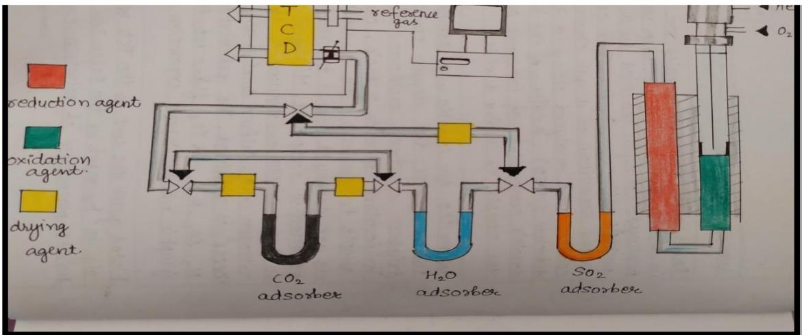

> 🧠 **[Cognis Multimodal Enrichment]**
> * **Classification:** Scientific Figure
> * **Extracted Text (OCR):** `refoence gas, reduction agent, oxidation agent, drying agent, CO2 adsorber, H2O adsorber, SO2 adsorber, O2`
> * **VLM Visual Summary:** ### FIGURE TYPE:
>   Instrument Schematic
>   
>   ### SCIENTIFIC PURPOSE:
>   This figure illustrates the functional diagram of a Vario EL CHNS (Elemental Carbon, Hydrogen, Nitrogen, Sulphur) analyzer, which is used for the analysis of elemental composition of samples.
>   
>   ### KEY KNOWLEDGE:
>   1. **Components**:
>      - **Reduction Agent**: Reduces sulfur compounds to elemental sulfur.
>      - **Oxidation Agent**: Oxidizes nitrogen and sulfur compounds to nitrogen oxides and sulfur dioxide.
>      - **Drying Agent**: Dries the sample before analysis.
>      - **Reference Gas**: Provides a reference for calibration purposes.
>      - **Chromatographic Column**: Separates gases based on their molecular size and polarity.
>      - **Thermal Conductivity Detector (TCD)**: Measures the concentration of gases by detecting changes in electrical current due to thermal conductivity.
>   
>   2. **Process**:
>      - The sample is combusted in a tin crucible with a vanadium pentoxide catalyst.
>      - The combustion products are conveyed through the reactor where oxidation reactions occur.
>      - The resulting gases (CO₂, H₂O, SO₂) are separated using a chromatographic column.
>      - The separated gases are detected by the TCD, providing quantitative data on the elemental composition of the sample.
>   
>   3. **Temperature and Pressure**:
>      - The temperature inside the reactor reaches approximately 1000°C during the combustion process.
>      - The pressure in the system should not exceed 1400 mbar, with oxygen at 2.5 bar.
>   
>   ### LABEL INTERPRETATION:
>   - **Reduction Agent**: Uncertain (not explicitly mentioned in the caption)
>   - **Oxidation Agent**: Uncertain (not explicitly mentioned in the caption)
>   - **Drying Agent**: Uncertain (not explicitly mentioned in the caption)
>   - **Reference Gas**: Reference gas for calibration
>   - **Chromatographic Column**: Separates gases based on molecular size and polarity
>   - **Thermal Conductivity Detector (TCD)**: Measures the concentration of gases by detecting changes in electrical current due to thermal conductivity
>   
>   ### ENGINEERING/SCIENTIFIC INSIGHTS:
>   A reader should learn that the Vario EL CHNS analyzer uses a combination of combustion, oxidation, and chromatography to analyze the elemental composition of samples. The key steps include combustion to convert sulfur compounds to elemental sulfur, oxidation to convert nitrogen and
> * **Figure Caption:** When the tin crucible with sample is dropped into the reactor, the oxygen environment triggers a strong exothermic reaction. Temp rises upto $\sim 1 0 0 0 ^ { \mathrm { { o } } } \mathrm { { c } }$ causing the sample to combust. The combustion products are conveyed across the reactor where oxidation is completed. NO₂ and $\mathrm { S O } _ { 2 }$ are reduced to elemental nitrogen and sulphur dioxide and oxygen excess is retained. The gas mixture contain $\mathrm { N } _ { 2 } , \mathrm { C O } _ { 2 } , \mathrm { H } _ { 2 } \mathrm { O }$ and $\mathrm { S O } _ { 2 }$ flows into the chromatographic column where separation takes place . eluted gas are sent to the TCD whereelectrical signals processed by the Eager 300 software provide percentages of nitrogen, carbon, hydrogen and sulphur contain in the sample. | Fig: functional diagram of vario EL CHNS
> * **Surrounding Context (+/- 300 words):**
>   * **[Before]:** *... Cycling of sulphur compound is a ubiquitous process in marine sediments that supports a range of microbial metabolic strategies. Element Sulphur enrichments may form at places where the sulfide concentrations were high, resulting from in situ $( \mathrm { S O } _ { 4 } ) _ { 2 }$ reduction. [Section: Lab Manual for Instrumental Methods of Analysis (CHC 506) > Working Principle:] Dried and powdered samples are combusted in a tin sample crucible with vanadium pentoxide catalyst purified by a rector packed with electrolytic copper and copper oxide, separated on a gas chromatographic column and analyzed using a thermal conductivity detector (TCD). Addition of $\mathrm { V } _ { 2 } \mathrm { O } _ { 5 }$ ensures complete conversion of inorganic sulphur in a sample of sulphur dioxide. When the tin crucible with sample is dropped into the reactor, the oxygen environment triggers a strong exothermic reaction. Temp rises upto $\sim 1 0 0 0 ^ { \mathrm { { o } } } \mathrm { { c } }$ causing the sample to combust. The combustion products are conveyed across the reactor where oxidation is completed. NO₂ and $\mathrm { S O } _ { 2 }$ are reduced to elemental nitrogen and sulphur dioxide and oxygen excess is retained. The gas mixture contain $\mathrm { N } _ { 2 } , \mathrm { C O } _ { 2 } , \mathrm { H } _ { 2 } \mathrm { O }$ and $\mathrm { S O } _ { 2 }$ flows into the chromatographic column where separation takes place . eluted gas are sent to the TCD whereelectrical signals processed by the Eager 300 software provide percentages of nitrogen, carbon, hydrogen and sulphur contain in the sample.*
>   * **[After]:** *Fig: functional diagram of vario EL CHNS [Section: Lab Manual for Instrumental Methods of Analysis (CHC 506) > 1. Sample preparation:] ➢ Sample preparation is done using Tin boatstake an empty tin boat keep it on the balance and tare it. ➢ Using micro spatula take fine crushed and dried sample into the tin boat. ➢ Pack the tin boat in a way that there is no spillage from tin boat of the sample and there should not be any air gaps in the tin boat. ➢ Weigh the packed tin boat(in mg). ➢ Put the packed sample tin boat on to the autosampler. ➢ Sample position on the auto sampler is indicated in the sequence created in the software. ➢ The sample is now ready for the analysis. 2.Procedure for the operation of various elements CHNS analyzer : [Section: Lab Manual for Instrumental Methods of Analysis (CHC 506) > Instrument Procedure:] ➢ Switch on the power green from the instrument. ➢ Wait for the initializing of the instrument and then start the software-click on vario micro icon.. ➢ Pop up window appears as select carousel position and tick all sample removed from the carcousel. [Section: Lab Manual for Instrumental Methods of Analysis (CHC 506) > Lab Manual for Instrumental Methods of Analysis (CHC 506)] ➢ Set gas regulator pressure from helium – 1.3 bar (1200 mbar at the software displaying) pressure in the system should not exceed 1400 mbar and oxygen at 2.5 bar. ➢ Diagnose the leakage test and click start. ➢ On the temperature tab set combustion tube at 1150o c and reduction tube at 850oc. ➢ Start the analysis procedure and first run blank sample. ➢ Select either auto and single run option. ➢ Put the blank value of the last blank on N, H, C ...*
  
Fig: functional diagram of vario EL CHNS

## Procedure

## 1. Sample preparation:

➢ Sample preparation is done using Tin boatstake an empty tin boat keep it on the balance and tare it.

➢ Using micro spatula take fine crushed and dried sample into the tin boat.

➢ Pack the tin boat in a way that there is no spillage from tin boat of the sample and there should not be any air gaps in the tin boat.

➢ Weigh the packed tin boat(in mg).

➢ Put the packed sample tin boat on to the autosampler.

➢ Sample position on the auto sampler is indicated in the sequence created in the software.

➢ The sample is now ready for the analysis.

2.Procedure for the operation of various elements CHNS analyzer :

## Instrument Procedure:

➢ Switch on the power green from the instrument.

➢ Wait for the initializing of the instrument and then start the software-click on vario micro icon..

➢ Pop up window appears as select carousel position and tick all sample removed from the carcousel.

## Lab Manual for Instrumental Methods of Analysis (CHC 506)

➢ Set gas regulator pressure from helium – 1.3 bar (1200 mbar at the software displaying) pressure in the system should not exceed 1400 mbar and oxygen at 2.5 bar.

➢ Diagnose the leakage test and click start.

➢ On the temperature tab set combustion tube at 1150o c and reduction tube at 850oc.

➢ Start the analysis procedure and first run blank sample.

➢ Select either auto and single run option.

➢ Put the blank value of the last blank on N, H, C and S blank column respectively.

➢ Select the standard form the serial number column and go to math and click factor.

➢ Tick - follow tagged sample only and click O.K.

➢ Analysis gets automatically done. If auto run step in between then click again.

## Shutdown procedure :

➢ Once the sample analysis is over reduce the furnace temperature as.

➢ Set the combustion tube temp = 0 to reduction tube temperature = 0.then click ok.

➢ Wait for the temperature to reduce 300oc.

➢ Close the software and close the oxygen and helium gas supply from regulator and switch off the instrument.

## Observation:

<table><tr><td rowspan=1 colspan=1>S.NO</td><td rowspan=1 colspan=1>WT(mg)</td><td rowspan=1 colspan=1>NAME</td><td rowspan=1 colspan=1>N(%)</td><td rowspan=1 colspan=1>C(%)</td><td rowspan=1 colspan=1>H(%)</td><td rowspan=1 colspan=1>S(%)</td></tr><tr><td rowspan=1 colspan=1>1</td><td rowspan=1 colspan=1></td><td rowspan=1 colspan=1></td><td rowspan=1 colspan=1></td><td rowspan=1 colspan=1></td><td rowspan=1 colspan=1></td><td rowspan=1 colspan=1></td></tr><tr><td rowspan=1 colspan=1>2.</td><td rowspan=1 colspan=1></td><td rowspan=1 colspan=1></td><td rowspan=1 colspan=1></td><td rowspan=1 colspan=1></td><td rowspan=1 colspan=1></td><td rowspan=1 colspan=1></td></tr><tr><td rowspan=1 colspan=1>3</td><td rowspan=1 colspan=1></td><td rowspan=1 colspan=1></td><td rowspan=1 colspan=1></td><td rowspan=1 colspan=1></td><td rowspan=1 colspan=1></td><td rowspan=1 colspan=1></td></tr><tr><td rowspan=1 colspan=1>4.</td><td rowspan=1 colspan=1></td><td rowspan=1 colspan=1></td><td rowspan=1 colspan=1></td><td rowspan=1 colspan=1></td><td rowspan=1 colspan=1></td><td rowspan=1 colspan=1></td></tr><tr><td rowspan=1 colspan=1>5</td><td rowspan=1 colspan=1></td><td rowspan=1 colspan=1></td><td rowspan=1 colspan=1></td><td rowspan=1 colspan=1></td><td rowspan=1 colspan=1></td><td rowspan=1 colspan=1></td></tr><tr><td rowspan=1 colspan=1>6</td><td rowspan=1 colspan=1></td><td rowspan=1 colspan=1></td><td rowspan=1 colspan=1></td><td rowspan=1 colspan=1></td><td rowspan=1 colspan=1></td><td rowspan=1 colspan=1></td></tr><tr><td rowspan=1 colspan=1>7</td><td rowspan=1 colspan=1></td><td rowspan=1 colspan=1></td><td rowspan=1 colspan=1></td><td rowspan=1 colspan=1></td><td rowspan=1 colspan=1></td><td rowspan=1 colspan=1></td></tr><tr><td rowspan=1 colspan=1>8.</td><td rowspan=1 colspan=1></td><td rowspan=1 colspan=1></td><td rowspan=1 colspan=1></td><td rowspan=1 colspan=1></td><td rowspan=1 colspan=1></td><td rowspan=1 colspan=1></td></tr></table>

## Results/Discussion:

Precautions:

Applications:

## Questionnaire:

1. Describe the working procedure with schematic diagram of CHNS analyzer.

2. Why experiments are performed using CHNS analyzer?

3. What is the sample size to be inserted in the CHNS analyzer

# Lab Manual for Instrumental Methods of Analysis (CHC 506)

# Experiment No 10: Optical Microscopy

Aim: To study the microstructure/morphology of lotus leaf structures using optical microscope.

## Theory

There are many small objects or details of objects which cannot be seen by the unaided human eye. The microscope magnifies the image of such objects thus making them visible to the human eye. Microscopes are used to observe the shape of bacteria, fungi, parasites and host cells in various stained and unstained preparations.

## Types of Microscopy

Microscopes used in clinical practice are light microscopes. They are called light microscopes becausethey use a beam of light to view specimens. A compound light microscope is the most common microscope used in microbiology. It consists of two lens systems (combination of lenses) to magnify the image. Each lens has a different magnifying power. A compound light microscope with a single eye-piece is called monocular; one with two eye-pieces is said to be binocular. Microscopes that use a beam of electrons (instead of a beam of light) and electromagnets (instead of glass lenses) for focusing are called electron microscopes. These microscopes provide a higher magnification and are used for observing extremely small microorganisms such as viruses.

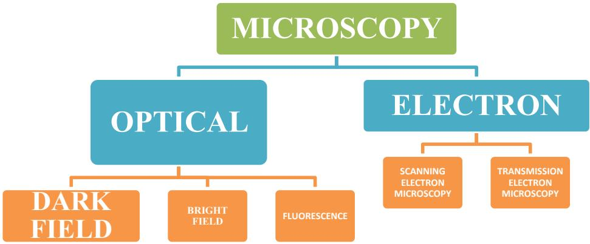

> 🧠 **[Cognis Multimodal Enrichment]**
> * **Classification:** Scientific Figure
> * **Extracted Text (OCR):** `MICROSCOPY, OPTICAL, ELECTRON, DARK FIELD, BRIGHT FIELD, FLUORESCENCE, SCANNING ELECTRON MICROSCOPY, TRANSMISSION ELECTRON MICROSCOPY`
> * **VLM Visual Summary:** **FIGURE TYPE:** 
>   Instrument Schematic
>   
>   **SCIENTIFIC PURPOSE:** 
>   This figure explains the classification of microscopes used in clinical practice based on their type of imaging technology.
>   
>   **KEY KNOWLEDGE:**
>   1. **Microscopy Classification:**
>      - Microscopy can be divided into two main categories: Optical and Electron.
>      - Optical microscopes use a beam of light to view specimens.
>      - Electron microscopes use a beam of electrons instead of light and electromagnets instead of glass lenses.
>   
>   2. **Optical Microscopy Subcategories:**
>      - **Dark Field Microscopy:** The field of view is dark and the organisms are illuminated. A special condenser causes light to reflect from the specimen at an angle.
>      - **Bright Field Microscopy:** The field of view is brightly lit so that organisms and other structures are visible against it due to their different densities.
>      - **Fluorescence Microscopy:** Specimens are stained with fluorochromes or fluorochrome complexes. Light of high energy or short wavelengths excites molecules within the specimen or dye molecules attached to it, causing them to emit light of different wavelengths.
>   
>   3. **Electron Microscopy Subcategories:**
>      - **Scanning Electron Microscopy (SEM):** Provides detailed images of the surface structure of materials.
>      - **Transmission Electron Microscopy (TEM):** Offers high magnification and resolution, useful for observing extremely small microorganisms like viruses.
>   
>   4. **Common Microscopes Used in Clinical Practice:**
>      - **Compound Light Microscope:** The most common microscope used in microbiology, consisting of two lens systems to magnify the image.
>   
>   **LABEL INTERPRETATION:**
>   - **MICROSCOPY:** General category of microscopes.
>   - **OPTICAL:** Subcategory of microscopes using light.
>   - **ELECTRON:** Subcategory of microscopes using electrons.
>   - **DARK FIELD:** Specific type of optical microscopy.
>   - **BRIGHT FIELD:** Specific type of optical microscopy.
>   - **FLUORESCENCE:** Specific type of optical microscopy.
>   - **SCANNING ELECTRON MICROSCOPY (SEM):** Type of electron microscopy.
>   - **TRANSMISSION ELECTRON MICROSCOPY (TEM):** Type of electron microscopy.
>   
>   **ENGINEERING/SCIENTIFIC INSIGHTS:**
>   A reader should learn that microscopes are essential tools for observing and studying microscopic structures and organisms. Understanding the different types of microscopes helps in
> * **Figure Caption:** Microscopes used in clinical practice are light microscopes. They are called light microscopes becausethey use a beam of light to view specimens. A compound light microscope is the most common microscope used in microbiology. It consists of two lens systems (combination of lenses) to magnify the image. Each lens has a different magnifying power. A compound light microscope with a single eye-piece is called monocular; one with two eye-pieces is said to be binocular. Microscopes that use a beam of electrons (instead of a beam of light) and electromagnets (instead of glass lenses) for focusing are called electron microscopes. These microscopes provide a higher magnification and are used for observing extremely small microorganisms such as viruses. | [Section: Experiment No 10: Optical Microscopy > Light Microscopy]
> * **Surrounding Context (+/- 300 words):**
>   * **[Before]:** *... rowspan=1 colspan=1></td><td rowspan=1 colspan=1></td><td rowspan=1 colspan=1></td><td rowspan=1 colspan=1></td></tr><tr><td rowspan=1 colspan=1>7</td><td rowspan=1 colspan=1></td><td rowspan=1 colspan=1></td><td rowspan=1 colspan=1></td><td rowspan=1 colspan=1></td><td rowspan=1 colspan=1></td><td rowspan=1 colspan=1></td></tr><tr><td rowspan=1 colspan=1>8.</td><td rowspan=1 colspan=1></td><td rowspan=1 colspan=1></td><td rowspan=1 colspan=1></td><td rowspan=1 colspan=1></td><td rowspan=1 colspan=1></td><td rowspan=1 colspan=1></td></tr></table> [Section: Lab Manual for Instrumental Methods of Analysis (CHC 506) > Results/Discussion:] Precautions: Applications: [Section: Lab Manual for Instrumental Methods of Analysis (CHC 506) > Questionnaire:] 1. Describe the working procedure with schematic diagram of CHNS analyzer. 2. Why experiments are performed using CHNS analyzer? 3. What is the sample size to be inserted in the CHNS analyzer [Section: Experiment No 10: Optical Microscopy] Aim: To study the microstructure/morphology of lotus leaf structures using optical microscope. [Section: Experiment No 10: Optical Microscopy > Theory] There are many small objects or details of objects which cannot be seen by the unaided human eye. The microscope magnifies the image of such objects thus making them visible to the human eye. Microscopes are used to observe the shape of bacteria, fungi, parasites and host cells in various stained and unstained preparations. [Section: Experiment No 10: Optical Microscopy > Types of Microscopy] Microscopes used in clinical practice are light microscopes. They are called light microscopes becausethey use a beam of light to view specimens. A compound light microscope is the most common microscope used in microbiology. It consists of two lens systems (combination of lenses) to magnify the image. Each lens has a different magnifying power. A compound light microscope with a single eye-piece is called monocular; one with two eye-pieces is said to be binocular. Microscopes that use a beam of electrons (instead of a beam of light) and electromagnets (instead of glass lenses) for focusing are called electron microscopes. These microscopes provide a higher magnification and are used for observing extremely small microorganisms such as viruses.*
>   * **[After]:** *[Section: Experiment No 10: Optical Microscopy > Light Microscopy] Brightfield microscopy: This is the commonly used type of microscope. In brightfield microscopy the field of view is brightly lit so that organisms and other structures are visible against it because of their different densities. It is mainly used with stained preparations. Differential staining may be used depending on the properties of different structures and organisms. Darkfieldmicroscopy: In darkfield microscopy the field of view is dark and the organisms are illuminated. A special condenser is used which causes light to reflect from the specimen at an angle. It is used for observing bacteria such as treponemes (which cause syphilis) and leptospires (which cause leptospirosis) [Section: Experiment No 10: Optical Microscopy > Lab Manual for Instrumental Methods of Analysis (CHC 506)] Phase-contrastmicroscopy : Phase-contrast microscopy allows the examination of live unstained organisms. For phase-contrast microscopy, special condensers and objectives are used. These alter the phase relationships of the light passing through the object and that passing around it. Fluorescencemicroscopy: In fluorescence microscopy specimens are stained with fluorochromes/ fluorochrome complexes. Light of high energy or short wavelengths (from halogen lamps or mercury vapour lamps) is then used to excite molecules within the specimen or dye molecules attached to it. These excited molecules emit light of different wavelengths, often of brilliant colours. Auramine differential staining for acid-fast bacilli is one application of the technique; rapid diagnostic kits have been developed using fluorescent antibodies for identifying many pathogens. [Section: Experiment No 10: Optical Microscopy > Parts of the Microscope] The main parts of the microscope are the eye-pieces, microscope tube, nosepiece, objective, mechanical stage, condenser, coarse and fine focusing knobs, and light source. [Section: Experiment No 10: Optical Microscopy > Functioning of the microscope] There are three main optical pieces in the compound light microscope. ...*

## Light Microscopy

Brightfield microscopy: This is the commonly used type of microscope. In brightfield microscopy the field of view is brightly lit so that organisms and other structures are visible against it because of their different densities. It is mainly used with stained preparations. Differential staining may be used depending on the properties of different structures and organisms.

Darkfieldmicroscopy: In darkfield microscopy the field of view is dark and the organisms are illuminated. A special condenser is used which causes light to reflect from the specimen at an angle. It is used for observing bacteria such as treponemes (which cause syphilis) and leptospires (which cause leptospirosis)

## Lab Manual for Instrumental Methods of Analysis (CHC 506)

Phase-contrastmicroscopy : Phase-contrast microscopy allows the examination of live unstained organisms. For phase-contrast microscopy, special condensers and objectives are used. These alter the phase relationships of the light passing through the object and that passing around it.

Fluorescencemicroscopy: In fluorescence microscopy specimens are stained with fluorochromes/ fluorochrome complexes. Light of high energy or short wavelengths (from halogen lamps or mercury vapour lamps) is then used to excite molecules within the specimen or dye molecules attached to it. These excited molecules emit light of different wavelengths, often of brilliant colours. Auramine differential staining for acid-fast bacilli is one application of the technique; rapid diagnostic kits have been developed using fluorescent antibodies for identifying many pathogens.

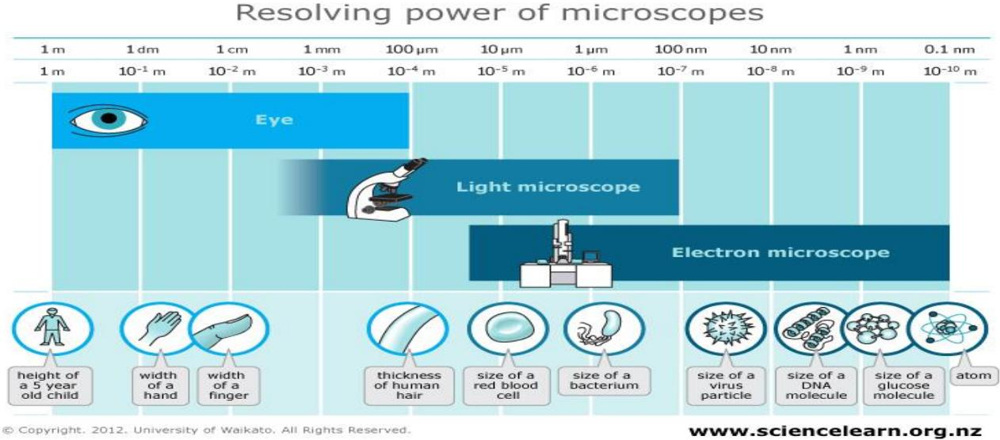

> 🧠 **[Cognis Multimodal Enrichment]**
> * **Classification:** Scientific Figure
> * **Extracted Text (OCR):** `Resolving power of microscopes, Eye, Light microscope, Electron microscope, height of a 5 year old child, width of a hand, width of a finger, thickness of human hair, size of a red blood cell, size of a bacterium, size of a virus particle, size of a DNA molecule, size of a glucose molecule, atom, 1m, 1dm, 1cm, 1mm, 100um, 10um,`
> * **VLM Visual Summary:** ### FIGURE TYPE:
>   Instrument Schematic
>   
>   ### SCIENTIFIC PURPOSE:
>   The figure illustrates the resolving power of various types of microscopes, specifically comparing the capabilities of the human eye, light microscopes, and electron microscopes.
>   
>   ### KEY KNOWLEDGE:
>   1. **Human Eye**: The human eye has a resolving power of approximately 0.1 millimeters (mm), which means it can distinguish objects as small as 0.1 mm apart.
>   2. **Light Microscopes**: Light microscopes have a resolving power ranging from 1 micrometer (μm) to 1 nanometer (nm). This range depends on the wavelength of light used and the quality of the lens system.
>   3. **Electron Microscopes**: Electron microscopes offer even higher resolution, capable of resolving objects down to 0.1 nanometers (nm). This is due to the use of electrons instead of light, which allows for much smaller wavelengths and thus higher resolution.
>   
>   ### LABEL INTERPRETATION:
>   - **Eye**: Represents the human eye's ability to resolve objects.
>   - **Light Microscope**: Represents the resolving power of light microscopes.
>   - **Electron Microscope**: Represents the resolving power of electron microscopes.
>   
>   ### ENGINEERING/SCIENTIFIC INSIGHTS:
>   A reader should learn that microscopes with different types of lenses (light vs. electron) have varying levels of resolution, allowing them to observe different scales of biological and microscopic structures. This knowledge is crucial for understanding how different microscopes are used in various scientific fields, from biology to materials science.
>   
>   ### USER-RELEVANT INFORMATION:
>   The information provided in the figure helps answer questions about the limits of resolution for different types of microscopes, which is fundamental for understanding how microscopes function and their applications in various scientific disciplines.
> * **Figure Caption:** Fluorescencemicroscopy: In fluorescence microscopy specimens are stained with fluorochromes/ fluorochrome complexes. Light of high energy or short wavelengths (from halogen lamps or mercury vapour lamps) is then used to excite molecules within the specimen or dye molecules attached to it. These excited molecules emit light of different wavelengths, often of brilliant colours. Auramine differential staining for acid-fast bacilli is one application of the technique; rapid diagnostic kits have been developed using fluorescent antibodies for identifying many pathogens. | [Section: Experiment No 10: Optical Microscopy > Parts of the Microscope]
> * **Surrounding Context (+/- 300 words):**
>   * **[Before]:** *... a single eye-piece is called monocular; one with two eye-pieces is said to be binocular. Microscopes that use a beam of electrons (instead of a beam of light) and electromagnets (instead of glass lenses) for focusing are called electron microscopes. These microscopes provide a higher magnification and are used for observing extremely small microorganisms such as viruses. [Section: Experiment No 10: Optical Microscopy > Light Microscopy] Brightfield microscopy: This is the commonly used type of microscope. In brightfield microscopy the field of view is brightly lit so that organisms and other structures are visible against it because of their different densities. It is mainly used with stained preparations. Differential staining may be used depending on the properties of different structures and organisms. Darkfieldmicroscopy: In darkfield microscopy the field of view is dark and the organisms are illuminated. A special condenser is used which causes light to reflect from the specimen at an angle. It is used for observing bacteria such as treponemes (which cause syphilis) and leptospires (which cause leptospirosis) [Section: Experiment No 10: Optical Microscopy > Lab Manual for Instrumental Methods of Analysis (CHC 506)] Phase-contrastmicroscopy : Phase-contrast microscopy allows the examination of live unstained organisms. For phase-contrast microscopy, special condensers and objectives are used. These alter the phase relationships of the light passing through the object and that passing around it. Fluorescencemicroscopy: In fluorescence microscopy specimens are stained with fluorochromes/ fluorochrome complexes. Light of high energy or short wavelengths (from halogen lamps or mercury vapour lamps) is then used to excite molecules within the specimen or dye molecules attached to it. These excited molecules emit light of different wavelengths, often of brilliant colours. Auramine differential staining for acid-fast bacilli is one application of the technique; rapid diagnostic kits have been developed using fluorescent antibodies for identifying many pathogens.*
>   * **[After]:** *[Section: Experiment No 10: Optical Microscopy > Parts of the Microscope] The main parts of the microscope are the eye-pieces, microscope tube, nosepiece, objective, mechanical stage, condenser, coarse and fine focusing knobs, and light source. [Section: Experiment No 10: Optical Microscopy > Functioning of the microscope] There are three main optical pieces in the compound light microscope. All three are essential for a sharp and clear image. These are: • Condenser Objectives • Eye-pieces The condenser illuminates the object by converging a parallel beam of light on it from a builtin or natural source. The objective forms a magnified inverted (upside down) image of the object. The eye-piece magnifies the image formed by the objective. This image is formed below the plane of the slide. The total magnification of the microscope is the product of the magnifying powers of the objective and the eye-piece. For example, if the magnifying power of the eye-piece is 10x and that of the objective is 100x, then the total magnification of the compound light microscope is: 10x X 100x = 1000-fold magnification [Section: Experiment No 10: Optical Microscopy > 3. Procedure] Ensure that the voltage supply in the laboratory corresponds to that permitted for the microscope; use a voltage protection device, if necessary Turn on the light source of the microscope • With the light intensity knob, decrease the light while using the low magnification objective Place a specimen slide on the stage. Make sure the slide is not placed upside down. Secure the slide to the slide holder of the mechanical stage • Rotate the nose-piece to the 10x objective, and raise the stage to its maximum. [Section: Experiment No 10: Optical Microscopy > Lab Manual for Instrumental Methods of Analysis (CHC 506)] Move the stage with the adjustment knobs to bring the ...*

## Parts of the Microscope

The main parts of the microscope are the eye-pieces, microscope tube, nosepiece, objective, mechanical stage, condenser, coarse and fine focusing knobs, and light source.

## Functioning of the microscope

There are three main optical pieces in the compound light microscope. All three are essential for a sharp and clear image. These are:

• Condenser

Objectives

• Eye-pieces

The condenser illuminates the object by converging a parallel beam of light on it from a builtin or natural source. The objective forms a magnified inverted (upside down) image of the object. The eye-piece magnifies the image formed by the objective. This image is formed below the plane of the slide.

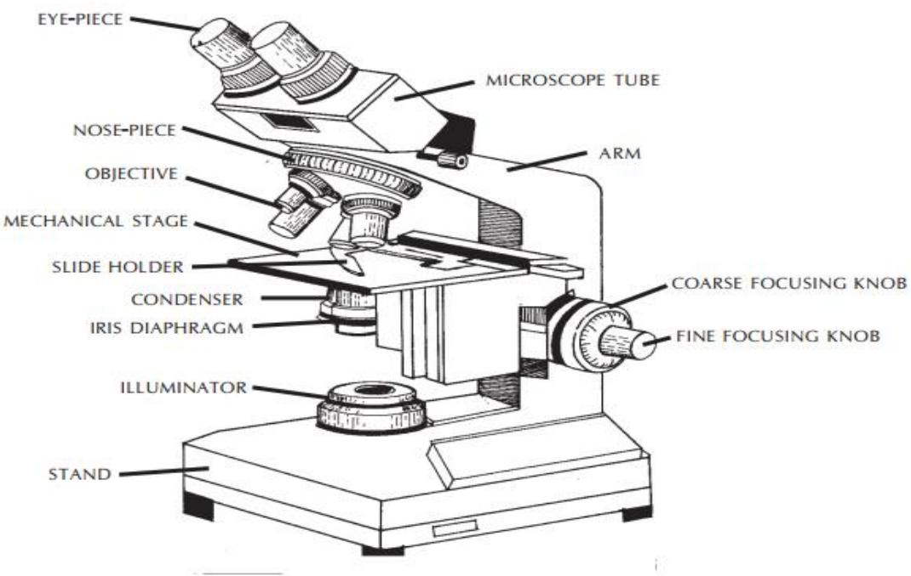

> 🧠 **[Cognis Multimodal Enrichment]**
> * **Classification:** Scientific Figure
> * **Extracted Text (OCR):** `EYE-PIECE,MICROSCOPE TUBE,Nose-Piece,OBJECTIVE,ARM,MECHANICAL STAGE,SLIDE HOLDER,CONDENSER,IRIS DIAPHRAGM,COARSE FOCUSING KNOB,FINE FOCUSING KNOB,ILLUMINATOR,STAND`
> * **VLM Visual Summary:** ### FIGURE TYPE:
>   Instrument Schematic
>   
>   ### SCIENTIFIC PURPOSE:
>   This figure explains the structure and components of a compound light microscope.
>   
>   ### KEY KNOWLEDGE:
>   - **Microscope Tube:** The central part where the objective and eyepiece are mounted.
>   - **Eye-Piece:** The eyepiece magnifies the image formed by the objective.
>   - **Nose-Piece:** Used to hold and rotate objectives.
>   - **Objective:** Forms a magnified inverted image of the object.
>   - **Mechanical Stage:** Holds the slide and provides support.
>   - **Slide Holder:** Secures the slide in place.
>   - **Condenser:** Illuminates the object by converging a parallel beam of light.
>   - **Iris Diaphragm:** Controls the amount of light entering the microscope.
>   - **Coarse Focusing Knob:** Moves the objective up and down for coarse focus adjustments.
>   - **Fine Focusing Knob:** Provides fine adjustments for precise focus.
>   - **Illuminator:** Provides light for illumination.
>   - **Stand:** Supports the entire microscope.
>   
>   ### LABEL INTERPRETATION:
>   - **EYE-PIECE:** The eyepiece magnifies the image formed by the objective.
>   - **MICROSCOPE TUBE:** The central part where the objective and eyepiece are mounted.
>   - **NOSE-PIECE:** Used to hold and rotate objectives.
>   - **OBJECTIVE:** Forms a magnified inverted image of the object.
>   - **MECHANICAL STAGE:** Holds the slide and provides support.
>   - **SLIDE HOLDER:** Secures the slide in place.
>   - **CONDENSER:** Illuminates the object by converging a parallel beam of light.
>   - **IRIS DIAPHRAGM:** Controls the amount of light entering the microscope.
>   - **COARSE FOCUSING KNOB:** Moves the objective up and down for coarse focus adjustments.
>   - **FINE FOCUSING KNOB:** Provides fine adjustments for precise focus.
>   - **ILLUMINATOR:** Provides light for illumination.
>   - **STAND:** Supports the entire microscope.
>   
>   ### ENGINEERING/SCIENTIFIC INSIGHTS:
>   A reader should learn that the compound light microscope consists of several key components that work together to form an image of the specimen. The condenser focuses light onto the specimen, the objective forms an image, and the eyepiece magnifies this image further. Understanding these components helps in interpreting microscope images correctly and performing various
> * **Figure Caption:** The condenser illuminates the object by converging a parallel beam of light on it from a builtin or natural source. The objective forms a magnified inverted (upside down) image of the object. The eye-piece magnifies the image formed by the objective. This image is formed below the plane of the slide. | The total magnification of the microscope is the product of the magnifying powers of the objective and the eye-piece.
> * **Surrounding Context (+/- 300 words):**
>   * **[Before]:** *... microscopy the field of view is dark and the organisms are illuminated. A special condenser is used which causes light to reflect from the specimen at an angle. It is used for observing bacteria such as treponemes (which cause syphilis) and leptospires (which cause leptospirosis) [Section: Experiment No 10: Optical Microscopy > Lab Manual for Instrumental Methods of Analysis (CHC 506)] Phase-contrastmicroscopy : Phase-contrast microscopy allows the examination of live unstained organisms. For phase-contrast microscopy, special condensers and objectives are used. These alter the phase relationships of the light passing through the object and that passing around it. Fluorescencemicroscopy: In fluorescence microscopy specimens are stained with fluorochromes/ fluorochrome complexes. Light of high energy or short wavelengths (from halogen lamps or mercury vapour lamps) is then used to excite molecules within the specimen or dye molecules attached to it. These excited molecules emit light of different wavelengths, often of brilliant colours. Auramine differential staining for acid-fast bacilli is one application of the technique; rapid diagnostic kits have been developed using fluorescent antibodies for identifying many pathogens. [Section: Experiment No 10: Optical Microscopy > Parts of the Microscope] The main parts of the microscope are the eye-pieces, microscope tube, nosepiece, objective, mechanical stage, condenser, coarse and fine focusing knobs, and light source. [Section: Experiment No 10: Optical Microscopy > Functioning of the microscope] There are three main optical pieces in the compound light microscope. All three are essential for a sharp and clear image. These are: • Condenser Objectives • Eye-pieces The condenser illuminates the object by converging a parallel beam of light on it from a builtin or natural source. The objective forms a magnified inverted (upside down) image of the object. The eye-piece magnifies the image formed by the objective. This image is formed below the plane of the slide.*
>   * **[After]:** *The total magnification of the microscope is the product of the magnifying powers of the objective and the eye-piece. For example, if the magnifying power of the eye-piece is 10x and that of the objective is 100x, then the total magnification of the compound light microscope is: 10x X 100x = 1000-fold magnification [Section: Experiment No 10: Optical Microscopy > 3. Procedure] Ensure that the voltage supply in the laboratory corresponds to that permitted for the microscope; use a voltage protection device, if necessary Turn on the light source of the microscope • With the light intensity knob, decrease the light while using the low magnification objective Place a specimen slide on the stage. Make sure the slide is not placed upside down. Secure the slide to the slide holder of the mechanical stage • Rotate the nose-piece to the 10x objective, and raise the stage to its maximum. [Section: Experiment No 10: Optical Microscopy > Lab Manual for Instrumental Methods of Analysis (CHC 506)] Move the stage with the adjustment knobs to bring the desired section of the slide into the field of view • Focus the specimen under 10x objective using the coarse focusing knob and lowering the stage • Make sure the condenser is almost at its top position. Centre the condenser using condenser centring screws if these are provided in the microscope. For this take out one eye-piece and while looking down the tube, close the iris diaphragm till only a pin-hole remains. Check if this is located in the centre of the tube Open the condenser iris diaphragm to 70%–80% to adjust the contrast so that the field is evenly lighted • Adjust the interpupillary distance till the right and left images become one • Focus the image with the right eye by looking into ...*

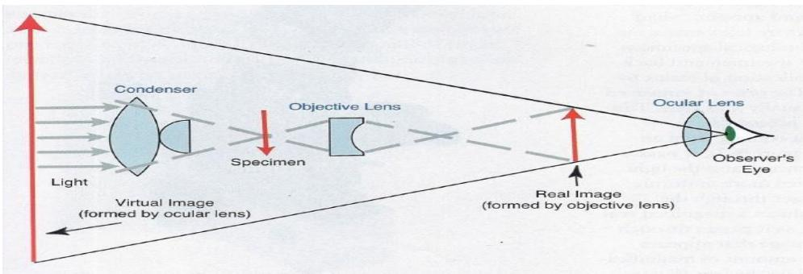

> 🧠 **[Cognis Multimodal Enrichment]**
> * **Classification:** Scientific Figure
> * **Extracted Text (OCR):** `Condenser, Objective Lens, Specimen, Ocular Lens, Observer's Eye, Light, Virtual Image, formed by ocular lens, Real Image, formed by objective lens`
> * **VLM Visual Summary:** ### FIGURE TYPE:
>   Instrument Schematic
>   
>   ### SCIENTIFIC PURPOSE:
>   This figure explains the basic functioning of a compound light microscope.
>   
>   ### KEY KNOWLEDGE:
>   1. **Condenser**: Converges a parallel beam of light onto the specimen.
>   2. **Objective Lens**: Forms a magnified inverted image of the specimen.
>   3. **Ocular Lens**: Magnifies the image formed by the objective lens.
>   4. **Total Magnification**: The product of the magnifying powers of the objective and the ocular lens.
>   
>   ### LABEL INTERPRETATION:
>   - **Light**: Parallel beam of light entering the microscope.
>   - **Condenser**: Device that converges the light beam.
>   - **Specimen**: The object being observed.
>   - **Objective Lens**: Lens that forms the first magnified image.
>   - **Ocular Lens**: Lens that magnifies the image formed by the objective lens.
>   - **Observer's Eye**: The eye of the observer.
>   
>   ### ENGINEERING/SCIENTIFIC INSIGHTS:
>   A reader should learn that a compound light microscope uses multiple lenses to create a magnified image of a specimen. The condenser focuses the light onto the specimen, the objective lens forms the first magnified image, and the ocular lens further magnifies this image. The total magnification is the product of the magnifications of both lenses.
>   
>   ### USER-RELEVANT INFORMATION:
>   - The positions and functions of each component in the microscope.
>   - The relationship between the magnification of the objective and ocular lenses.
>   - The role of the condenser in focusing the light onto the specimen.
> * **Figure Caption:** The condenser illuminates the object by converging a parallel beam of light on it from a builtin or natural source. The objective forms a magnified inverted (upside down) image of the object. The eye-piece magnifies the image formed by the objective. This image is formed below the plane of the slide. | The total magnification of the microscope is the product of the magnifying powers of the objective and the eye-piece.
> * **Surrounding Context (+/- 300 words):**
>   * **[Before]:** *... microscopy the field of view is dark and the organisms are illuminated. A special condenser is used which causes light to reflect from the specimen at an angle. It is used for observing bacteria such as treponemes (which cause syphilis) and leptospires (which cause leptospirosis) [Section: Experiment No 10: Optical Microscopy > Lab Manual for Instrumental Methods of Analysis (CHC 506)] Phase-contrastmicroscopy : Phase-contrast microscopy allows the examination of live unstained organisms. For phase-contrast microscopy, special condensers and objectives are used. These alter the phase relationships of the light passing through the object and that passing around it. Fluorescencemicroscopy: In fluorescence microscopy specimens are stained with fluorochromes/ fluorochrome complexes. Light of high energy or short wavelengths (from halogen lamps or mercury vapour lamps) is then used to excite molecules within the specimen or dye molecules attached to it. These excited molecules emit light of different wavelengths, often of brilliant colours. Auramine differential staining for acid-fast bacilli is one application of the technique; rapid diagnostic kits have been developed using fluorescent antibodies for identifying many pathogens. [Section: Experiment No 10: Optical Microscopy > Parts of the Microscope] The main parts of the microscope are the eye-pieces, microscope tube, nosepiece, objective, mechanical stage, condenser, coarse and fine focusing knobs, and light source. [Section: Experiment No 10: Optical Microscopy > Functioning of the microscope] There are three main optical pieces in the compound light microscope. All three are essential for a sharp and clear image. These are: • Condenser Objectives • Eye-pieces The condenser illuminates the object by converging a parallel beam of light on it from a builtin or natural source. The objective forms a magnified inverted (upside down) image of the object. The eye-piece magnifies the image formed by the objective. This image is formed below the plane of the slide.*
>   * **[After]:** *The total magnification of the microscope is the product of the magnifying powers of the objective and the eye-piece. For example, if the magnifying power of the eye-piece is 10x and that of the objective is 100x, then the total magnification of the compound light microscope is: 10x X 100x = 1000-fold magnification [Section: Experiment No 10: Optical Microscopy > 3. Procedure] Ensure that the voltage supply in the laboratory corresponds to that permitted for the microscope; use a voltage protection device, if necessary Turn on the light source of the microscope • With the light intensity knob, decrease the light while using the low magnification objective Place a specimen slide on the stage. Make sure the slide is not placed upside down. Secure the slide to the slide holder of the mechanical stage • Rotate the nose-piece to the 10x objective, and raise the stage to its maximum. [Section: Experiment No 10: Optical Microscopy > Lab Manual for Instrumental Methods of Analysis (CHC 506)] Move the stage with the adjustment knobs to bring the desired section of the slide into the field of view • Focus the specimen under 10x objective using the coarse focusing knob and lowering the stage • Make sure the condenser is almost at its top position. Centre the condenser using condenser centring screws if these are provided in the microscope. For this take out one eye-piece and while looking down the tube, close the iris diaphragm till only a pin-hole remains. Check if this is located in the centre of the tube Open the condenser iris diaphragm to 70%–80% to adjust the contrast so that the field is evenly lighted • Adjust the interpupillary distance till the right and left images become one • Focus the image with the right eye by looking into ...*

The total magnification of the microscope is the product of the magnifying powers of the objective and the eye-piece.

For example, if the magnifying power of the eye-piece is 10x and that of the objective is 100x, then the total magnification of the compound light microscope is: 10x X 100x = 1000-fold magnification

## 3. Procedure

Ensure that the voltage supply in the laboratory corresponds to that permitted for the microscope; use a voltage protection device, if necessary

Turn on the light source of the microscope

• With the light intensity knob, decrease the light while using the low magnification objective

Place a specimen slide on the stage. Make sure the slide is not placed upside down. Secure the slide to the slide holder of the mechanical stage

• Rotate the nose-piece to the 10x objective, and raise the stage to its maximum.

## Lab Manual for Instrumental Methods of Analysis (CHC 506)

Move the stage with the adjustment knobs to bring the desired section of the slide into the field of view

• Focus the specimen under 10x objective using the coarse focusing knob and lowering the stage

• Make sure the condenser is almost at its top position. Centre the condenser using condenser centring screws if these are provided in the microscope. For this take out one eye-piece and while looking down the tube, close the iris diaphragm till only a pin-hole remains. Check if this is located in the centre of the tube

Open the condenser iris diaphragm to 70%–80% to adjust the contrast so that the field is evenly lighted

• Adjust the interpupillary distance till the right and left images become one

• Focus the image with the right eye by looking into the right eye-piece and turning the focusing knob

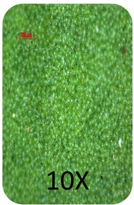

> 🧠 **[Cognis Multimodal Enrichment]**
> * **Classification:** Scientific Figure
> * **Extracted Text (OCR):** `10X`
> * **VLM Visual Summary:** ### FIGURE TYPE:
>   **Other**
>   
>   ### SCIENTIFIC PURPOSE:
>   The figure explains the concept of magnification in optical microscopes.
>   
>   ### KEY KNOWLEDGE:
>   - **Magnification**: The magnification of an image is determined by the product of the magnifying powers of the objective and the eyepiece.
>   - **Objective Magnification**: The objective lens magnifies the object being observed.
>   - **Eyepiece Magnification**: The eyepiece lens magnifies the already magnified image.
>   - **Total Magnification**: The total magnification is calculated by multiplying the magnification of the objective by the magnification of the eyepiece.
>   
>   ### LABEL INTERPRETATION:
>   - **10X**: This indicates the magnification level of the objective lens used in the image.
>   
>   ### ENGINEERING/SCIENTIFIC INSIGHTS:
>   A reader should learn that the magnification of an image in an optical microscope is crucial for observing small details and structures within a sample. Understanding how magnification works helps in interpreting the results of microscopic observations accurately.
>   
>   ### USER-RELEVANT INFORMATION:
>   The information about the magnification level (10X) can help answer future questions related to the resolution and detail that can be observed in a particular sample under a specific magnification setting.
> * **Figure Caption:** • Focus the image with the right eye by looking into the right eye-piece and turning the focusing knob | [Section: Experiment No 10: Optical Microscopy > OBSERVATIONS BY OPTICAL MICROSCOPE]
> * **Surrounding Context (+/- 300 words):**
>   * **[Before]:** *... product of the magnifying powers of the objective and the eye-piece. For example, if the magnifying power of the eye-piece is 10x and that of the objective is 100x, then the total magnification of the compound light microscope is: 10x X 100x = 1000-fold magnification [Section: Experiment No 10: Optical Microscopy > 3. Procedure] Ensure that the voltage supply in the laboratory corresponds to that permitted for the microscope; use a voltage protection device, if necessary Turn on the light source of the microscope • With the light intensity knob, decrease the light while using the low magnification objective Place a specimen slide on the stage. Make sure the slide is not placed upside down. Secure the slide to the slide holder of the mechanical stage • Rotate the nose-piece to the 10x objective, and raise the stage to its maximum. [Section: Experiment No 10: Optical Microscopy > Lab Manual for Instrumental Methods of Analysis (CHC 506)] Move the stage with the adjustment knobs to bring the desired section of the slide into the field of view • Focus the specimen under 10x objective using the coarse focusing knob and lowering the stage • Make sure the condenser is almost at its top position. Centre the condenser using condenser centring screws if these are provided in the microscope. For this take out one eye-piece and while looking down the tube, close the iris diaphragm till only a pin-hole remains. Check if this is located in the centre of the tube Open the condenser iris diaphragm to 70%–80% to adjust the contrast so that the field is evenly lighted • Adjust the interpupillary distance till the right and left images become one • Focus the image with the right eye by looking into the right eye-piece and turning the focusing knob*
>   * **[After]:** *[Section: Experiment No 10: Optical Microscopy > OBSERVATIONS BY OPTICAL MICROSCOPE] 20m -5 ZEXS 10μm EH = 5.0 SgaA:S2 8Sg2015 ZEISS WD=75m ISMDHANBAD 200m EHT=500 WD=5m SgaIA=SE2 Meg= 5000X D 8Sep205 SNCH8A ZEISS 10m SEM IMAGES OF LOTUS LEAF [Section: Experiment No 10: Optical Microscopy > Observation:] Lab Manual for Instrumental Methods of Analysis (CHC 506) Application: Precautions: Results and Discussion: [Section: Experiment No 10: Optical Microscopy > Questionnaire:] 1. What is optical microscopy? 2. What are types of optical microscopy? 3. Show different parts of a microscope using a proper schematic diagram? ...*

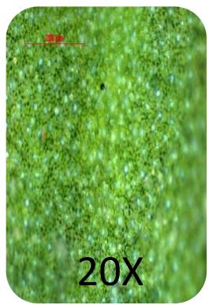

> 🧠 **[Cognis Multimodal Enrichment]**
> * **Classification:** Scientific Figure
> * **Extracted Text (OCR):** `20X`
> * **VLM Visual Summary:** ### FIGURE TYPE:
>   **Other**
>   
>   ### SCIENTIFIC PURPOSE:
>   The figure explains the microscopic observation of a biological sample using an optical microscope.
>   
>   ### KEY KNOWLEDGE:
>   - **Magnification:** The image is magnified 20 times.
>   - **Microscope Components:** The image shows the detailed structure of a biological sample under high magnification.
>   - **Sample Characteristics:** The sample appears to be green and has a textured surface with small, round, and shiny particles.
>   
>   ### LABEL INTERPRETATION:
>   - **20X:** Indicates the magnification level of the image.
>   - **Focus the image with the right eye by looking into the right eye-piece and turning the focusing knob:** Instructions for viewing the image clearly.
>   
>   ### ENGINEERING/SCIENTIFIC INSIGHTS:
>   - **Understanding Biological Structures:** The figure provides a detailed view of the cellular or subcellular structures within the sample, which can be crucial for identifying specific features such as cell walls, organelles, or other biological markers.
>   
>   ### USER-RELEVANT INFORMATION:
>   - **Magnification Level:** The magnification level (20X) is crucial for understanding the fine details of the sample.
>   - **Sample Characteristics:** The color and texture of the sample can provide clues about its type and function, which is essential for further analysis or identification.
> * **Figure Caption:** • Focus the image with the right eye by looking into the right eye-piece and turning the focusing knob | [Section: Experiment No 10: Optical Microscopy > OBSERVATIONS BY OPTICAL MICROSCOPE]
> * **Surrounding Context (+/- 300 words):**
>   * **[Before]:** *... product of the magnifying powers of the objective and the eye-piece. For example, if the magnifying power of the eye-piece is 10x and that of the objective is 100x, then the total magnification of the compound light microscope is: 10x X 100x = 1000-fold magnification [Section: Experiment No 10: Optical Microscopy > 3. Procedure] Ensure that the voltage supply in the laboratory corresponds to that permitted for the microscope; use a voltage protection device, if necessary Turn on the light source of the microscope • With the light intensity knob, decrease the light while using the low magnification objective Place a specimen slide on the stage. Make sure the slide is not placed upside down. Secure the slide to the slide holder of the mechanical stage • Rotate the nose-piece to the 10x objective, and raise the stage to its maximum. [Section: Experiment No 10: Optical Microscopy > Lab Manual for Instrumental Methods of Analysis (CHC 506)] Move the stage with the adjustment knobs to bring the desired section of the slide into the field of view • Focus the specimen under 10x objective using the coarse focusing knob and lowering the stage • Make sure the condenser is almost at its top position. Centre the condenser using condenser centring screws if these are provided in the microscope. For this take out one eye-piece and while looking down the tube, close the iris diaphragm till only a pin-hole remains. Check if this is located in the centre of the tube Open the condenser iris diaphragm to 70%–80% to adjust the contrast so that the field is evenly lighted • Adjust the interpupillary distance till the right and left images become one • Focus the image with the right eye by looking into the right eye-piece and turning the focusing knob*
>   * **[After]:** *[Section: Experiment No 10: Optical Microscopy > OBSERVATIONS BY OPTICAL MICROSCOPE] 20m -5 ZEXS 10μm EH = 5.0 SgaA:S2 8Sg2015 ZEISS WD=75m ISMDHANBAD 200m EHT=500 WD=5m SgaIA=SE2 Meg= 5000X D 8Sep205 SNCH8A ZEISS 10m SEM IMAGES OF LOTUS LEAF [Section: Experiment No 10: Optical Microscopy > Observation:] Lab Manual for Instrumental Methods of Analysis (CHC 506) Application: Precautions: Results and Discussion: [Section: Experiment No 10: Optical Microscopy > Questionnaire:] 1. What is optical microscopy? 2. What are types of optical microscopy? 3. Show different parts of a microscope using a proper schematic diagram? ...*

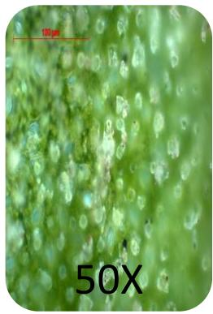

> 🧠 **[Cognis Multimodal Enrichment]**
> * **Classification:** Scientific Figure
> * **Extracted Text (OCR):** `50X`
> * **VLM Visual Summary:** ### FIGURE TYPE:
>   **Other**
>   
>   ### SCIENTIFIC PURPOSE:
>   The figure explains the microscopic observation of a biological sample, likely a plant leaf, under a microscope.
>   
>   ### KEY KNOWLEDGE:
>   - **Microscopic Observation:** The image shows a detailed view of a plant leaf under high magnification (50×), highlighting cellular structures such as cells, cell walls, and possibly chloroplasts.
>   - **Magnification:** The magnification factor is indicated as 50×, which means that each small square in the image represents 50 micrometers (μm) in real life.
>   - **Cellular Structures:** The image reveals intricate details of the leaf's structure, including the arrangement of cells and potential chloroplasts within them.
>   - **Sample Preparation:** The sample appears to be mounted on a slide, suggesting that it was prepared for microscopic examination.
>   
>   ### LABEL INTERPRETATION:
>   - **50X:** Indicates the magnification level of the image.
>   - **100 μm:** Provides a scale reference for the magnified image, showing that each small square represents 100 micrometers in real life.
>   
>   ### ENGINEERING/SCIENTIFIC INSIGHTS:
>   - **Understanding Cell Structure:** This figure helps in understanding the basic cellular structure of plants, which is crucial for studying plant biology and botany.
>   - **Comparative Analysis:** It can be used to compare different parts of the leaf or different species of plants under similar conditions.
>   
>   ### USER-RELEVANT INFORMATION:
>   - **Magnification Factor:** The magnification factor (50×) is crucial for interpreting the detailed structures visible in the image.
>   - **Scale Reference:** The scale (100 μm) provides context for the size of the observed structures, aiding in accurate interpretation of the image.
>   - **Sample Preparation:** The preparation method (mounting on a slide) is essential for understanding how samples are prepared for microscopic examination.
> * **Figure Caption:** • Focus the image with the right eye by looking into the right eye-piece and turning the focusing knob | [Section: Experiment No 10: Optical Microscopy > OBSERVATIONS BY OPTICAL MICROSCOPE]
> * **Surrounding Context (+/- 300 words):**
>   * **[Before]:** *... product of the magnifying powers of the objective and the eye-piece. For example, if the magnifying power of the eye-piece is 10x and that of the objective is 100x, then the total magnification of the compound light microscope is: 10x X 100x = 1000-fold magnification [Section: Experiment No 10: Optical Microscopy > 3. Procedure] Ensure that the voltage supply in the laboratory corresponds to that permitted for the microscope; use a voltage protection device, if necessary Turn on the light source of the microscope • With the light intensity knob, decrease the light while using the low magnification objective Place a specimen slide on the stage. Make sure the slide is not placed upside down. Secure the slide to the slide holder of the mechanical stage • Rotate the nose-piece to the 10x objective, and raise the stage to its maximum. [Section: Experiment No 10: Optical Microscopy > Lab Manual for Instrumental Methods of Analysis (CHC 506)] Move the stage with the adjustment knobs to bring the desired section of the slide into the field of view • Focus the specimen under 10x objective using the coarse focusing knob and lowering the stage • Make sure the condenser is almost at its top position. Centre the condenser using condenser centring screws if these are provided in the microscope. For this take out one eye-piece and while looking down the tube, close the iris diaphragm till only a pin-hole remains. Check if this is located in the centre of the tube Open the condenser iris diaphragm to 70%–80% to adjust the contrast so that the field is evenly lighted • Adjust the interpupillary distance till the right and left images become one • Focus the image with the right eye by looking into the right eye-piece and turning the focusing knob*
>   * **[After]:** *[Section: Experiment No 10: Optical Microscopy > OBSERVATIONS BY OPTICAL MICROSCOPE] 20m -5 ZEXS 10μm EH = 5.0 SgaA:S2 8Sg2015 ZEISS WD=75m ISMDHANBAD 200m EHT=500 WD=5m SgaIA=SE2 Meg= 5000X D 8Sep205 SNCH8A ZEISS 10m SEM IMAGES OF LOTUS LEAF [Section: Experiment No 10: Optical Microscopy > Observation:] Lab Manual for Instrumental Methods of Analysis (CHC 506) Application: Precautions: Results and Discussion: [Section: Experiment No 10: Optical Microscopy > Questionnaire:] 1. What is optical microscopy? 2. What are types of optical microscopy? 3. Show different parts of a microscope using a proper schematic diagram? ...*

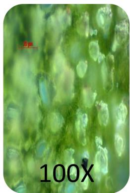

> 🧠 **[Cognis Multimodal Enrichment]**
> * **Classification:** Scientific Figure
> * **Extracted Text (OCR):** `100X`
> * **VLM Visual Summary:** ### FIGURE TYPE:
>   **Other**
>   
>   ### SCIENTIFIC PURPOSE:
>   The figure explains the microscopic observation of a biological sample, likely a plant cell, viewed under a microscope.
>   
>   ### KEY KNOWLEDGE:
>   - **Microscopic Observation:** The image shows a detailed view of a biological sample under high magnification (100x), which is typical for observing cellular structures.
>   - **Cellular Structures:** The cells appear to be green, indicating they might be part of a plant tissue. The presence of vacuoles and other organelles can be identified.
>   - **Magnification:** The magnification factor is clearly marked as 100x, which means the image is highly magnified compared to the actual size of the cells.
>   
>   ### LABEL INTERPRETATION:
>   - **Magnification Factor:** The label "100x" indicates the magnification level of the image.
>   - **Scale Bar:** The scale bar of 5 μm suggests the size of the observed cells in micrometers.
>   
>   ### ENGINEERING/SCIENTIFIC INSIGHTS:
>   - **Understanding Cell Structure:** This figure helps in understanding the detailed structure of plant cells, including their organelles and vacuoles.
>   - **Comparative Analysis:** It can be used to compare different types of cells or to study the effects of certain treatments on cell morphology.
>   
>   ### USER-RELEVANT INFORMATION:
>   - **Magnification Factor:** The magnification factor (100x) is crucial for interpreting the details visible in the image.
>   - **Scale Bar:** The scale bar (5 μm) provides a reference point for the size of the observed cells, aiding in accurate measurements and comparisons.
> * **Figure Caption:** • Focus the image with the right eye by looking into the right eye-piece and turning the focusing knob | [Section: Experiment No 10: Optical Microscopy > OBSERVATIONS BY OPTICAL MICROSCOPE]
> * **Surrounding Context (+/- 300 words):**
>   * **[Before]:** *... product of the magnifying powers of the objective and the eye-piece. For example, if the magnifying power of the eye-piece is 10x and that of the objective is 100x, then the total magnification of the compound light microscope is: 10x X 100x = 1000-fold magnification [Section: Experiment No 10: Optical Microscopy > 3. Procedure] Ensure that the voltage supply in the laboratory corresponds to that permitted for the microscope; use a voltage protection device, if necessary Turn on the light source of the microscope • With the light intensity knob, decrease the light while using the low magnification objective Place a specimen slide on the stage. Make sure the slide is not placed upside down. Secure the slide to the slide holder of the mechanical stage • Rotate the nose-piece to the 10x objective, and raise the stage to its maximum. [Section: Experiment No 10: Optical Microscopy > Lab Manual for Instrumental Methods of Analysis (CHC 506)] Move the stage with the adjustment knobs to bring the desired section of the slide into the field of view • Focus the specimen under 10x objective using the coarse focusing knob and lowering the stage • Make sure the condenser is almost at its top position. Centre the condenser using condenser centring screws if these are provided in the microscope. For this take out one eye-piece and while looking down the tube, close the iris diaphragm till only a pin-hole remains. Check if this is located in the centre of the tube Open the condenser iris diaphragm to 70%–80% to adjust the contrast so that the field is evenly lighted • Adjust the interpupillary distance till the right and left images become one • Focus the image with the right eye by looking into the right eye-piece and turning the focusing knob*
>   * **[After]:** *[Section: Experiment No 10: Optical Microscopy > OBSERVATIONS BY OPTICAL MICROSCOPE] 20m -5 ZEXS 10μm EH = 5.0 SgaA:S2 8Sg2015 ZEISS WD=75m ISMDHANBAD 200m EHT=500 WD=5m SgaIA=SE2 Meg= 5000X D 8Sep205 SNCH8A ZEISS 10m SEM IMAGES OF LOTUS LEAF [Section: Experiment No 10: Optical Microscopy > Observation:] Lab Manual for Instrumental Methods of Analysis (CHC 506) Application: Precautions: Results and Discussion: [Section: Experiment No 10: Optical Microscopy > Questionnaire:] 1. What is optical microscopy? 2. What are types of optical microscopy? 3. Show different parts of a microscope using a proper schematic diagram? ...*

## OBSERVATIONS BY OPTICAL MICROSCOPE

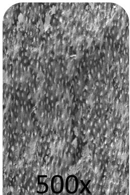

> 🧠 **[Cognis Multimodal Enrichment]**
> * **Classification:** Scientific Figure
> * **Extracted Text (OCR):** `500x`
> * **VLM Visual Summary:** ### FIGURE TYPE:
>   Crystal Structure Visualization
>   
>   ### SCIENTIFIC PURPOSE:
>   This figure illustrates the crystal structure of a material observed under high magnification using an optical microscope.
>   
>   ### KEY KNOWLEDGE:
>   - **Magnification:** The image is magnified 500 times.
>   - **Material:** The material appears to be a crystalline solid.
>   - **Microstructure:** The microstructure shows a pattern of small, regularly spaced dots, which is characteristic of a crystalline lattice.
>   - **Resolution:** The resolution of the image suggests that it captures fine details of the crystal structure.
>   
>   ### LABEL INTERPRETATION:
>   - **Magnification:** The label "500x" indicates the magnification level of the image.
>   - **Microstructure:** The term "Microstructure" refers to the detailed arrangement of atoms or molecules within a material, which can provide insights into the material's properties and behavior.
>   
>   ### ENGINEERING/SCIENTIFIC INSIGHTS:
>   - **Understanding Crystal Structures:** This figure helps in understanding how materials are organized at the atomic level, which is crucial for predicting their physical and chemical properties.
>   - **Material Science:** It aids in identifying the type of crystal structure (e.g., cubic, hexagonal, etc.) and understanding how different structures affect material properties like hardness, ductility, and electrical conductivity.
>   
>   ### USER-RELEVANT INFORMATION:
>   - **Magnification Level:** The magnification level (500x) is significant for identifying fine details in the crystal structure.
>   - **Microstructural Details:** The specific arrangement of dots provides clues about the symmetry and periodicity of the crystal lattice.
>   - **Comparison with Other Magnifications:** Comparing this image with other magnifications can help determine whether the material is amorphous or crystalline.
>   
>   By analyzing this figure, a reader can gain insights into the microscopic organization of materials, which is fundamental in material science and engineering.
> * **Figure Caption:** [Section: Experiment No 10: Optical Microscopy > OBSERVATIONS BY OPTICAL MICROSCOPE] | 20m -5 ZEXS
> * **Surrounding Context (+/- 300 words):**
>   * **[Before]:** *... For example, if the magnifying power of the eye-piece is 10x and that of the objective is 100x, then the total magnification of the compound light microscope is: 10x X 100x = 1000-fold magnification [Section: Experiment No 10: Optical Microscopy > 3. Procedure] Ensure that the voltage supply in the laboratory corresponds to that permitted for the microscope; use a voltage protection device, if necessary Turn on the light source of the microscope • With the light intensity knob, decrease the light while using the low magnification objective Place a specimen slide on the stage. Make sure the slide is not placed upside down. Secure the slide to the slide holder of the mechanical stage • Rotate the nose-piece to the 10x objective, and raise the stage to its maximum. [Section: Experiment No 10: Optical Microscopy > Lab Manual for Instrumental Methods of Analysis (CHC 506)] Move the stage with the adjustment knobs to bring the desired section of the slide into the field of view • Focus the specimen under 10x objective using the coarse focusing knob and lowering the stage • Make sure the condenser is almost at its top position. Centre the condenser using condenser centring screws if these are provided in the microscope. For this take out one eye-piece and while looking down the tube, close the iris diaphragm till only a pin-hole remains. Check if this is located in the centre of the tube Open the condenser iris diaphragm to 70%–80% to adjust the contrast so that the field is evenly lighted • Adjust the interpupillary distance till the right and left images become one • Focus the image with the right eye by looking into the right eye-piece and turning the focusing knob [Section: Experiment No 10: Optical Microscopy > OBSERVATIONS BY OPTICAL MICROSCOPE]*
>   * **[After]:** *20m -5 ZEXS 10μm EH = 5.0 SgaA:S2 8Sg2015 ZEISS WD=75m ISMDHANBAD 200m EHT=500 WD=5m SgaIA=SE2 Meg= 5000X D 8Sep205 SNCH8A ZEISS 10m SEM IMAGES OF LOTUS LEAF [Section: Experiment No 10: Optical Microscopy > Observation:] Lab Manual for Instrumental Methods of Analysis (CHC 506) Application: Precautions: Results and Discussion: [Section: Experiment No 10: Optical Microscopy > Questionnaire:] 1. What is optical microscopy? 2. What are types of optical microscopy? 3. Show different parts of a microscope using a proper schematic diagram? ...*
  
20m -5 ZEXS

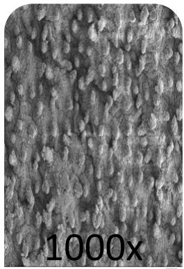

> 🧠 **[Cognis Multimodal Enrichment]**
> * **Classification:** Scientific Figure
> * **Extracted Text (OCR):** `1000x`
> * **VLM Visual Summary:** ### FIGURE TYPE:
>   Crystal Structure Visualization
>   
>   ### SCIENTIFIC PURPOSE:
>   This figure illustrates the crystal structure of a material, likely used for structural analysis or material science research.
>   
>   ### KEY KNOWLEDGE:
>   - The figure shows a detailed view of the crystal lattice, which is composed of repeating units.
>   - The scale bar indicates that the image is magnified 1000 times.
>   - The texture appears to be a crystalline structure with a repetitive pattern.
>   
>   ### LABEL INTERPRETATION:
>   - **1000x**: Indicates the magnification level of the image.
>   - **ZEXS**: Likely refers to a specific type of crystal structure or material.
>   - **EH**: Could stand for Electron-Harmonic or another specific term related to the material's properties.
>   - **SgaA**: Might represent a specific property or characteristic of the material.
>   - **ZEISS**: Indicates the brand of the microscope used to capture the image.
>   - **WD=75m**: Likely refers to the working distance of the objective lens.
>   - **ISMDHANBAD**: Could be a code or identifier for the experiment or sample.
>   - **200m EHT=500 WD=5m**: Indicates additional parameters such as electron beam thickness and working distance.
>   - **Meg= 5000X**: Likely refers to the magnification level of the secondary electron detector.
>   - **8Sep205**: Could be a date or identifier for the experiment.
>   - **SNCH8A**: Likely refers to a specific sample name or identifier.
>   - **ZEISS 10m SEM IMAGES OF LOTUS LEAF**: Indicates that the image is from a scanning electron microscope (SEM) and relates to a lotus leaf sample.
>   
>   ### ENGINEERING/SCIENTIFIC INSIGHTS:
>   - This figure provides a high-resolution view of the crystal structure, which is crucial for understanding the material's composition, bonding, and potential applications.
>   - It can help researchers identify specific phases, defects, or impurities within the material.
>   
>   ### USER-RELEVANT INFORMATION:
>   - The magnification level (1000x) allows for detailed observation of the crystal structure.
>   - The specific terms and codes (e.g., ZEXS, EH, SgaA) provide context about the material's properties and experimental conditions.
>   - The scanning electron microscope (SEM) technique used here is commonly employed in materials science and nanotechnology for detailed surface and internal structure
> * **Figure Caption:** 20m -5 ZEXS | 10μm EH = 5.0 SgaA:S2 8Sg2015 ZEISS WD=75m ISMDHANBAD
> * **Surrounding Context (+/- 300 words):**
>   * **[Before]:** *... the magnifying power of the eye-piece is 10x and that of the objective is 100x, then the total magnification of the compound light microscope is: 10x X 100x = 1000-fold magnification [Section: Experiment No 10: Optical Microscopy > 3. Procedure] Ensure that the voltage supply in the laboratory corresponds to that permitted for the microscope; use a voltage protection device, if necessary Turn on the light source of the microscope • With the light intensity knob, decrease the light while using the low magnification objective Place a specimen slide on the stage. Make sure the slide is not placed upside down. Secure the slide to the slide holder of the mechanical stage • Rotate the nose-piece to the 10x objective, and raise the stage to its maximum. [Section: Experiment No 10: Optical Microscopy > Lab Manual for Instrumental Methods of Analysis (CHC 506)] Move the stage with the adjustment knobs to bring the desired section of the slide into the field of view • Focus the specimen under 10x objective using the coarse focusing knob and lowering the stage • Make sure the condenser is almost at its top position. Centre the condenser using condenser centring screws if these are provided in the microscope. For this take out one eye-piece and while looking down the tube, close the iris diaphragm till only a pin-hole remains. Check if this is located in the centre of the tube Open the condenser iris diaphragm to 70%–80% to adjust the contrast so that the field is evenly lighted • Adjust the interpupillary distance till the right and left images become one • Focus the image with the right eye by looking into the right eye-piece and turning the focusing knob [Section: Experiment No 10: Optical Microscopy > OBSERVATIONS BY OPTICAL MICROSCOPE] 20m -5 ZEXS*
>   * **[After]:** *10μm EH = 5.0 SgaA:S2 8Sg2015 ZEISS WD=75m ISMDHANBAD 200m EHT=500 WD=5m SgaIA=SE2 Meg= 5000X D 8Sep205 SNCH8A ZEISS 10m SEM IMAGES OF LOTUS LEAF [Section: Experiment No 10: Optical Microscopy > Observation:] Lab Manual for Instrumental Methods of Analysis (CHC 506) Application: Precautions: Results and Discussion: [Section: Experiment No 10: Optical Microscopy > Questionnaire:] 1. What is optical microscopy? 2. What are types of optical microscopy? 3. Show different parts of a microscope using a proper schematic diagram? ...*
  
10μm EH = 5.0 SgaA:S2 8Sg2015 ZEISS WD=75m ISMDHANBAD

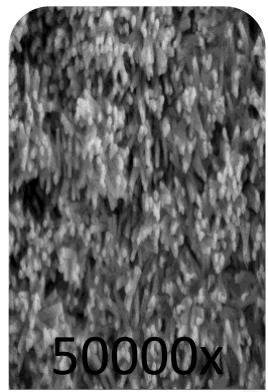

> 🧠 **[Cognis Multimodal Enrichment]**
> * **Classification:** Scientific Figure
> * **Extracted Text (OCR):** `50000x`
> * **VLM Visual Summary:** ### FIGURE TYPE:
>   Crystal Structure Visualization
>   
>   ### SCIENTIFIC PURPOSE:
>   This figure illustrates the crystal structure of a material, likely used for structural analysis in materials science or crystallography.
>   
>   ### KEY KNOWLEDGE:
>   - **Crystal Structure**: The arrangement of atoms, molecules, or ions in a solid material.
>   - **Microscopy**: The study of very small structures using a microscope.
>   - **Magnification**: The ability to see small details, which is crucial for understanding the fine structure of materials.
>   - **SEM (Scanning Electron Microscopy)**: A type of electron microscopy used to visualize the surface and internal structure of materials at high magnifications.
>   
>   ### LABEL INTERPRETATION:
>   - **5000x**: Indicates the magnification level of the image.
>   - **ZEISS**: Likely refers to the brand of the microscope used to capture the image.
>   - **WD=75m**: Indicates the working distance of the objective lens.
>   - **ISMDHANBAD**: Could be a specific identifier or code related to the experiment or data set.
>   - **8Sep205**: Date when the image was taken or recorded.
>   - **SNCH8A**: Another identifier or code possibly related to the experiment.
>   
>   ### ENGINEERING/SCIENTIFIC INSIGHTS:
>   - This figure provides detailed insights into the microstructure of a material, which is essential for understanding its properties and behavior.
>   - It can help identify defects, crystalline orientation, and other structural features that are critical for applications in various fields such as materials science, semiconductor manufacturing, and pharmaceuticals.
>   
>   ### USER-RELEVANT INFORMATION:
>   - The magnification level (5000x) indicates the level of detail visible in the image.
>   - The brand (ZEISS) suggests the quality and precision of the imaging equipment.
>   - The date (8Sep205) provides context about when the data was collected.
>   - The identifiers (ISMDHANBAD, SNCH8A) may provide additional context or reference for the specific experiment or dataset.
> * **Figure Caption:** 10μm EH = 5.0 SgaA:S2 8Sg2015 ZEISS WD=75m ISMDHANBAD | 200m EHT=500 WD=5m SgaIA=SE2 Meg= 5000X D 8Sep205 SNCH8A ZEISS
> * **Surrounding Context (+/- 300 words):**
>   * **[Before]:** *... that of the objective is 100x, then the total magnification of the compound light microscope is: 10x X 100x = 1000-fold magnification [Section: Experiment No 10: Optical Microscopy > 3. Procedure] Ensure that the voltage supply in the laboratory corresponds to that permitted for the microscope; use a voltage protection device, if necessary Turn on the light source of the microscope • With the light intensity knob, decrease the light while using the low magnification objective Place a specimen slide on the stage. Make sure the slide is not placed upside down. Secure the slide to the slide holder of the mechanical stage • Rotate the nose-piece to the 10x objective, and raise the stage to its maximum. [Section: Experiment No 10: Optical Microscopy > Lab Manual for Instrumental Methods of Analysis (CHC 506)] Move the stage with the adjustment knobs to bring the desired section of the slide into the field of view • Focus the specimen under 10x objective using the coarse focusing knob and lowering the stage • Make sure the condenser is almost at its top position. Centre the condenser using condenser centring screws if these are provided in the microscope. For this take out one eye-piece and while looking down the tube, close the iris diaphragm till only a pin-hole remains. Check if this is located in the centre of the tube Open the condenser iris diaphragm to 70%–80% to adjust the contrast so that the field is evenly lighted • Adjust the interpupillary distance till the right and left images become one • Focus the image with the right eye by looking into the right eye-piece and turning the focusing knob [Section: Experiment No 10: Optical Microscopy > OBSERVATIONS BY OPTICAL MICROSCOPE] 20m -5 ZEXS 10μm EH = 5.0 SgaA:S2 8Sg2015 ZEISS WD=75m ISMDHANBAD*
>   * **[After]:** *200m EHT=500 WD=5m SgaIA=SE2 Meg= 5000X D 8Sep205 SNCH8A ZEISS 10m SEM IMAGES OF LOTUS LEAF [Section: Experiment No 10: Optical Microscopy > Observation:] Lab Manual for Instrumental Methods of Analysis (CHC 506) Application: Precautions: Results and Discussion: [Section: Experiment No 10: Optical Microscopy > Questionnaire:] 1. What is optical microscopy? 2. What are types of optical microscopy? 3. Show different parts of a microscope using a proper schematic diagram? ...*
  
200m EHT=500 WD=5m SgaIA=SE2 Meg= 5000X D 8Sep205 SNCH8A ZEISS

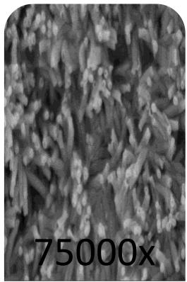

> 🧠 **[Cognis Multimodal Enrichment]**
> * **Classification:** Scientific Figure
> * **Extracted Text (OCR):** `75000x`
> * **VLM Visual Summary:** ### FIGURE TYPE:
>   **Crystal Structure Visualization**
>   
>   ### SCIENTIFIC PURPOSE:
>   The figure illustrates the crystal structure of a material, likely used for structural analysis or material science research.
>   
>   ### KEY KNOWLEDGE:
>   - **Crystal Structure:** The arrangement of atoms, molecules, or ions in a solid material.
>   - **Microscopy:** The study of very small structures using a microscope.
>   - **SEM (Scanning Electron Microscopy):** A type of electron microscopy used to observe the surface morphology of materials at high magnifications.
>   - **Magnification:** The figure is magnified 75,000 times, indicating the detailed observation of the material's structure.
>   
>   ### LABEL INTERPRETATION:
>   - **75000x:** Indicates the magnification level of the image.
>   - **LOTUS LEAF:** Likely refers to the specific material being analyzed, possibly a lotus leaf sample.
>   - **ZEISS:** Indicates the brand of the microscope used for the imaging.
>   
>   ### ENGINEERING/SCIENTIFIC INSIGHTS:
>   - **Understanding Material Properties:** The figure provides insights into the microstructure of the material, which can be crucial for understanding its properties, such as strength, flexibility, or chemical composition.
>   - **Comparative Analysis:** The detailed visualization helps in comparing different samples or materials under similar conditions.
>   
>   ### USER-RELEVANT INFORMATION:
>   - **Magnification Level:** The magnification level (75,000x) indicates the level of detail observed, which is useful for identifying fine features within the material.
>   - **Material Identification:** The specific material (lotus leaf) can provide context about the application or relevance of the study.
>   - **Microscopy Technique:** The use of SEM suggests that the material's surface morphology is being studied, which is valuable for applications like surface chemistry, corrosion resistance, or biological studies.
> * **Figure Caption:** 200m EHT=500 WD=5m SgaIA=SE2 Meg= 5000X D 8Sep205 SNCH8A ZEISS | 10m
> * **Surrounding Context (+/- 300 words):**
>   * **[Before]:** *... of the compound light microscope is: 10x X 100x = 1000-fold magnification [Section: Experiment No 10: Optical Microscopy > 3. Procedure] Ensure that the voltage supply in the laboratory corresponds to that permitted for the microscope; use a voltage protection device, if necessary Turn on the light source of the microscope • With the light intensity knob, decrease the light while using the low magnification objective Place a specimen slide on the stage. Make sure the slide is not placed upside down. Secure the slide to the slide holder of the mechanical stage • Rotate the nose-piece to the 10x objective, and raise the stage to its maximum. [Section: Experiment No 10: Optical Microscopy > Lab Manual for Instrumental Methods of Analysis (CHC 506)] Move the stage with the adjustment knobs to bring the desired section of the slide into the field of view • Focus the specimen under 10x objective using the coarse focusing knob and lowering the stage • Make sure the condenser is almost at its top position. Centre the condenser using condenser centring screws if these are provided in the microscope. For this take out one eye-piece and while looking down the tube, close the iris diaphragm till only a pin-hole remains. Check if this is located in the centre of the tube Open the condenser iris diaphragm to 70%–80% to adjust the contrast so that the field is evenly lighted • Adjust the interpupillary distance till the right and left images become one • Focus the image with the right eye by looking into the right eye-piece and turning the focusing knob [Section: Experiment No 10: Optical Microscopy > OBSERVATIONS BY OPTICAL MICROSCOPE] 20m -5 ZEXS 10μm EH = 5.0 SgaA:S2 8Sg2015 ZEISS WD=75m ISMDHANBAD 200m EHT=500 WD=5m SgaIA=SE2 Meg= 5000X D 8Sep205 SNCH8A ZEISS*
>   * **[After]:** *10m SEM IMAGES OF LOTUS LEAF [Section: Experiment No 10: Optical Microscopy > Observation:] Lab Manual for Instrumental Methods of Analysis (CHC 506) Application: Precautions: Results and Discussion: [Section: Experiment No 10: Optical Microscopy > Questionnaire:] 1. What is optical microscopy? 2. What are types of optical microscopy? 3. Show different parts of a microscope using a proper schematic diagram? ...*
  
10m  
SEM IMAGES OF LOTUS LEAF

## Observation:

Lab Manual for Instrumental Methods of Analysis (CHC 506)

Application:

Precautions:

Results and Discussion:

## Questionnaire:

1. What is optical microscopy?

2. What are types of optical microscopy?

3. Show different parts of a microscope using a proper schematic diagram?