M. Sc. Physics

Materials Science

## Laboratory Manual

## (Based on given experimental data analysis)

By

Prof. H. S. Tewari

Dr. M. P. Sharma

Ms. Kiran Gupta

Ms. Swati Das

2024

DEPARTMENT OF PURE & APPLIED PHYSICS

M. Sc. Physics 3rd Semester

Material Science-I

Lab Course Code: PPPCTD2

Credits = 2 (0+0+2)

## List of experiments:

1. Indexing powder X-ray diffraction (XRD) pattern of a given cubic crystal.

2. Estimation of particle size from given XRD data of powder sample using Scherer formula.

3. To calculate strain produced in a material using Williamson-Hall plot from given XRD data.

4. To study the heat flow associated with physical and chemical transitions in a material as a function of temperature.

5. To analyse Raman spectra and calculate the force constant of a given sample.

6. Determination of band gap using Tauc’s plots for given UV-Visible spectra.

7. To analyse and calculate force constant from FTIR spectra.

8. To find the thickness of the thin films for a given set of samples from UV-Visible spectra.

## EXPERIMENT NO. 1

Aim: Indexing powder X-ray diffraction (XRD) pattern of a given cubic crystal.

Requirements: PowderXRD data of sample.

Theory: XRD is one of several experimental tools used to identify the structures of crystalline solids. XRD pattern determines:

(1) The size and shape of the unit cells determine the relative positions of the diffraction peaks;

(2) Atomic positions within the unit cell determine the relative intensities of the diffraction peaks. For cubic system, expected lines of diffraction pattern can be generated from the following relations:

(1.) The relation between Miller indices of a particular peak and the interplanar spacing d can be written as:

$$
d = { \frac { a } { \sqrt { h ^ { 2 } + k ^ { 2 } + l ^ { 2 } } } }
$$

(2.) Bragg’s law:

$$
\lambda = 2 d \ s i n \theta
$$

For indexing the powder diffraction patterns above two equations are used i.e.,

$$
\frac { \lambda } { 4 a ^ { 2 } } = \frac { s i n ^ { 2 } \theta } { h ^ { 2 } + k ^ { 2 } + l ^ { 2 } } = \frac { s i n ^ { 2 } \theta } { s }
$$

In the above equation:

(1.) $\frac { \lambda } { 4 a ^ { 2 } }$ is always constant for a given crystal.

(2.) $S = h ^ { 2 } + k ^ { 2 } + l ^ { 2 }$ will always be an integer regardless of the sign of each of the h,k,l values.

Each of the four common cubic lattice types has characteristic sequence of X-ray diffraction lines described by their successive ‘S’ values:

1. Simple cubic: 1, 2, 3, 4, 5, 6, 8, 9, 10, 11, 12, 13,.........

2. Body centred cubic: 2, 4, 6, 8, 10 ,12 ,14, 16,......

3. Face cantered cubic: 3, 4, 8, 11, 12, 16,.........

4. Diamond cubic: 3, 8, 11, 16,.........

## Procedure:

(1) Identify the peaks.

(2) Find 2θ from XRD pattern for each peak. Determine sin2θ using Cu $\mathrm { K } \sqcap _ { 1 } = 1 . 5 4 0 2 4 \AA$

(3) Calculate the ratio si $\mathsf { \Omega } ^ { 2 } \mathsf { \theta } / \mathsf { s i n } ^ { 2 } \mathsf { \theta } _ { m i n }$ and multiply by the appropriate integers.

(4) Select the result from (3) that yields $h ^ { 2 } + k ^ { 2 } + l ^ { 2 }$ as an integer.

(5) Compare results with the sequences of $h ^ { 2 } + k ^ { 2 } + l ^ { 2 }$ values to identify the Bravais lattice.

(6) Calculate lattice parameters.  
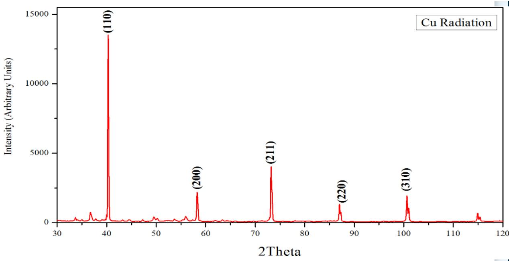

> 🧠 **[Cognis Multimodal Enrichment]**
> * **Classification:** Scientific Figure
> * **Extracted Text (OCR):** `Cu Radiation, 2Theta, Intensity (Arbitrary Units)`
> * **VLM Visual Summary:** ### FIGURE TYPE:
>   Diffraction Pattern
>   
>   ### SCIENTIFIC PURPOSE:
>   This figure represents a X-ray diffraction (XRD) pattern, which is used to determine the crystalline structure of a material by analyzing the diffraction peaks produced when X-rays interact with a sample.
>   
>   ### KEY KNOWLEDGE:
>   1. **Crystal Lattice Types**: The XRD pattern provides information about the crystal lattice type of the material. Different crystal structures have characteristic diffraction patterns.
>   2. **Lattice Parameters**: The positions of the diffraction peaks correspond to specific Bragg angles, which can be used to calculate the lattice parameters of the crystal.
>   3. **Bragg's Law**: The diffraction peaks occur at specific angles where the path difference between the incident and diffracted beams equals an integer multiple of the wavelength of the X-rays.
>   4. **XRD Peaks**: The peaks in the XRD pattern correspond to specific Miller indices (hkl), which are related to the crystal lattice structure.
>   
>   ### LABEL INTERPRETATION:
>   - **Intensity (Arbitrary Units)**: Represents the intensity of the diffraction peaks.
>   - **2Theta**: The angle of incidence of the X-rays relative to the surface of the sample.
>   
>   ### ENGINEERING/SCIENTIFIC INSIGHTS:
>   A reader should learn that the XRD pattern provides critical information about the crystal structure of a material, including the type of crystal lattice, the orientation of the crystal planes, and the presence of impurities or defects.
>   
>   ### USER-RELEVANT INFORMATION:
>   The information from this figure could help answer future questions by providing insights into the crystal structure of the material being analyzed. This includes identifying the type of crystal lattice, understanding the orientation of crystal planes, and detecting any structural anomalies such as dislocations or grain boundaries.
> * **Figure Caption:** (6) Calculate lattice parameters. | [Section: Observations:]
> * **Surrounding Context (+/- 300 words):**
>   * **[Before]:** *... + k ^ { 2 } + l ^ { 2 } } = \frac { s i n ^ { 2 } \theta } { s } $$ In the above equation: (1.) $\frac { \lambda } { 4 a ^ { 2 } }$ is always constant for a given crystal. (2.) $S = h ^ { 2 } + k ^ { 2 } + l ^ { 2 }$ will always be an integer regardless of the sign of each of the h,k,l values. Each of the four common cubic lattice types has characteristic sequence of X-ray diffraction lines described by their successive ‘S’ values: 1. Simple cubic: 1, 2, 3, 4, 5, 6, 8, 9, 10, 11, 12, 13,......... [Section: EXPERIMENT NO. 1] 2. Body centred cubic: 2, 4, 6, 8, 10 ,12 ,14, 16,...... 3. Face cantered cubic: 3, 4, 8, 11, 12, 16,......... 4. Diamond cubic: 3, 8, 11, 16,......... [Section: Procedure:] (1) Identify the peaks. (2) Find 2θ from XRD pattern for each peak. Determine sin2θ using Cu $\mathrm { K } \sqcap _ { 1 } = 1 . 5 4 0 2 4 \AA$ (3) Calculate the ratio si $\mathsf { \Omega } ^ { 2 } \mathsf { \theta } / \mathsf { s i n } ^ { 2 } \mathsf { \theta } _ { m i n }$ and multiply by the appropriate integers. (4) Select the result from (3) that yields $h ^ { 2 } + k ^ { 2 } + l ^ { 2 }$ as an integer. (5) Compare results with the sequences of $h ^ { 2 } + k ^ { 2 } + l ^ { 2 }$ values to identify the Bravais lattice. (6) Calculate lattice parameters.*
>   * **[After]:** *[Section: Observations:] (1) Tabulate the experimental and calculated values in the table below. [Section: Observations:] <table><tr><td rowspan=2 colspan=1>Line</td><td rowspan=2 colspan=1>20</td><td rowspan=2 colspan=1> $\mathbf { s i n ^ { 2 } \mathbf { \theta } \mathbf { \theta } }$ </td><td rowspan=1 colspan=1> $\mathbf { s i n ^ { 2 } \mathbf { \theta } \mathbf { \theta } }$ </td><td rowspan=2 colspan=1> $s = ( h ^ { 2 } + k ^ { 2 } + l ^ { 2 } )$ </td><td rowspan=2 colspan=1>入 $\overline { { 4 { \bf a } ^ { 2 } } }$ </td><td rowspan=2 colspan=1>a $( \mathbf { A } ^ { \bullet } )$ </td><td rowspan=2 colspan=1> $\pmb { d } _ { h k l }$ </td><td rowspan=2 colspan=1>hkl</td></tr><tr><td rowspan=1 colspan=1> $\underline { { \sin ^ { 2 } \theta _ { \mathrm { m i n } } } }$ </td></tr><tr><td rowspan=1 colspan=1>1</td><td rowspan=1 colspan=1></td><td rowspan=1 colspan=1></td><td rowspan=1 colspan=1></td><td rowspan=1 colspan=1></td><td rowspan=1 colspan=1></td><td rowspan=1 colspan=1></td><td rowspan=1 colspan=1></td><td rowspan=1 colspan=1></td></tr><tr><td rowspan=1 colspan=1>2</td><td rowspan=1 colspan=1></td><td rowspan=1 colspan=1></td><td rowspan=1 colspan=1></td><td rowspan=1 colspan=1></td><td rowspan=1 colspan=1></td><td rowspan=1 colspan=1></td><td rowspan=1 colspan=1></td><td rowspan=1 colspan=1></td></tr><tr><td rowspan=1 colspan=1>3</td><td rowspan=1 colspan=1></td><td rowspan=1 colspan=1></td><td rowspan=1 colspan=1></td><td rowspan=1 colspan=1></td><td rowspan=1 colspan=1></td><td rowspan=1 colspan=1></td><td rowspan=1 colspan=1></td><td rowspan=1 colspan=1></td></tr><tr><td rowspan=1 colspan=1>4</td><td rowspan=1 colspan=1></td><td rowspan=1 colspan=1></td><td rowspan=1 colspan=1></td><td rowspan=1 colspan=1></td><td rowspan=1 colspan=1></td><td rowspan=1 colspan=1></td><td rowspan=1 colspan=1></td><td rowspan=1 colspan=1></td></tr><tr><td rowspan=1 colspan=1>5</td><td rowspan=1 colspan=1></td><td rowspan=1 colspan=1></td><td rowspan=1 colspan=1></td><td rowspan=1 colspan=1></td><td rowspan=1 colspan=1></td><td rowspan=1 colspan=1></td><td rowspan=1 colspan=1></td><td rowspan=1 colspan=1></td></tr></table> [Section: Observations:] (2) Discuss obtained results and compare with the actual value of lattice parameters. Analysis: Conclusions: [Section: EXPERIMENT NO. - 2] Aim: Estimation of particle size from given XRD data of powder sample using Scherer formula. Requirements: XRD data of powder sample. Theory: X-ray diffraction is a convenient method for determining the mean size of ...*

## Observations:

(1) Tabulate the experimental and calculated values in the table below.
<table><tr><td rowspan=2 colspan=1>Line</td><td rowspan=2 colspan=1>20</td><td rowspan=2 colspan=1> $\mathbf { s i n ^ { 2 } \mathbf { \theta } \mathbf { \theta } }$ </td><td rowspan=1 colspan=1> $\mathbf { s i n ^ { 2 } \mathbf { \theta } \mathbf { \theta } }$ </td><td rowspan=2 colspan=1> $s = ( h ^ { 2 } + k ^ { 2 } + l ^ { 2 } )$ </td><td rowspan=2 colspan=1>入 $\overline { { 4 { \bf a } ^ { 2 } } }$ </td><td rowspan=2 colspan=1>a $( \mathbf { A } ^ { \bullet } )$ </td><td rowspan=2 colspan=1> $\pmb { d } _ { h k l }$ </td><td rowspan=2 colspan=1>hkl</td></tr><tr><td rowspan=1 colspan=1> $\underline { { \sin ^ { 2 } \theta _ { \mathrm { m i n } } } }$ </td></tr><tr><td rowspan=1 colspan=1>1</td><td rowspan=1 colspan=1></td><td rowspan=1 colspan=1></td><td rowspan=1 colspan=1></td><td rowspan=1 colspan=1></td><td rowspan=1 colspan=1></td><td rowspan=1 colspan=1></td><td rowspan=1 colspan=1></td><td rowspan=1 colspan=1></td></tr><tr><td rowspan=1 colspan=1>2</td><td rowspan=1 colspan=1></td><td rowspan=1 colspan=1></td><td rowspan=1 colspan=1></td><td rowspan=1 colspan=1></td><td rowspan=1 colspan=1></td><td rowspan=1 colspan=1></td><td rowspan=1 colspan=1></td><td rowspan=1 colspan=1></td></tr><tr><td rowspan=1 colspan=1>3</td><td rowspan=1 colspan=1></td><td rowspan=1 colspan=1></td><td rowspan=1 colspan=1></td><td rowspan=1 colspan=1></td><td rowspan=1 colspan=1></td><td rowspan=1 colspan=1></td><td rowspan=1 colspan=1></td><td rowspan=1 colspan=1></td></tr><tr><td rowspan=1 colspan=1>4</td><td rowspan=1 colspan=1></td><td rowspan=1 colspan=1></td><td rowspan=1 colspan=1></td><td rowspan=1 colspan=1></td><td rowspan=1 colspan=1></td><td rowspan=1 colspan=1></td><td rowspan=1 colspan=1></td><td rowspan=1 colspan=1></td></tr><tr><td rowspan=1 colspan=1>5</td><td rowspan=1 colspan=1></td><td rowspan=1 colspan=1></td><td rowspan=1 colspan=1></td><td rowspan=1 colspan=1></td><td rowspan=1 colspan=1></td><td rowspan=1 colspan=1></td><td rowspan=1 colspan=1></td><td rowspan=1 colspan=1></td></tr></table>

(2) Discuss obtained results and compare with the actual value of lattice parameters.

Analysis:

Conclusions:

## EXPERIMENT NO. - 2

Aim: Estimation of particle size from given XRD data of powder sample using Scherer formula.

Requirements: XRD data of powder sample.

Theory: X-ray diffraction is a convenient method for determining the mean size of nanocrystallites in nano-crystalline bulk materials with phase certain. The determination refers to the main peaks of the pattern diffractogram through the approach of Debye Scherer’s equation formulated in Equation. The Scherrer equation, in X-ray diffraction and crystallography, is a formula that relates the size of sub-micrometre crystallites in a solid to the broadening of a peak in a diffraction pattern. It is often referred to, incorrectly, as a formula for particle size measurement or analysis. It is named after Paul Scherrer. It is used in the determination of the size of crystals in the form of powder.

The Scherrer equation can be written as:

$$
\cdot\tag{1}
$$

where:

D is the mean size of the ordered (crystalline) domains, which may be smaller or equal to the grain size, which may be smaller or equal to the particle size.

K is a dimensionless shape factor, with a value close to unity. The shape factor has a typical value of about 0.9 but varies with the actual shape of the crystallite.

??is the X-ray wavelength.

?? is the line broadening at half the maximum intensity (FWHM) as shown in the figure below, after subtracting the instrumental line broadening, in radians.

?? is denoted as Bragg’s law.

## Procedure:

1. Identify the K value.

2. Identify the ?? value.

3. Identify FWHM (β).

To determine the value of FWHM (β) can be done using the following ways:

Step 1: Identify the sharpest peak or crystalline area in the diffraction pattern generated by XRD.

Step 2: Determine the value of 2θ at the peak with the maximum intensity of the XRD diffraction pattern.

Step 3: Determine the value of half of the maximum peak intensity.

Step 4: Determine the minimum 2θ value and the maximum 2θ value at half the maximum intensity of the peak.

Step 5: Determine the FWHM (β) value using Equation $\beta = { \textstyle \frac { 1 } { 2 } } ( 2 \theta _ { m a x } - 2 \theta _ { m i n } )$

4. Determine the value of cos?? from the value of 2?? value.

The steps to determine the value of cos from the value of 2θ are as follows:

Step 1: Divide the value of 2θ theta by the number 2 thus θ is known.

Step 2: Change θ value to ????????.

5. After all the values from step 1 to step 4 are known, the last step is to put these values in Equation (1)to obtain the crystal size.

In short, by performing a curve selection of the diffraction peaks of each plane crystal at position 2θ, we can see a half-peak curve widening value diffraction (FWHM), then with a value of is put into the equation Scherrer to determine the size crystal.

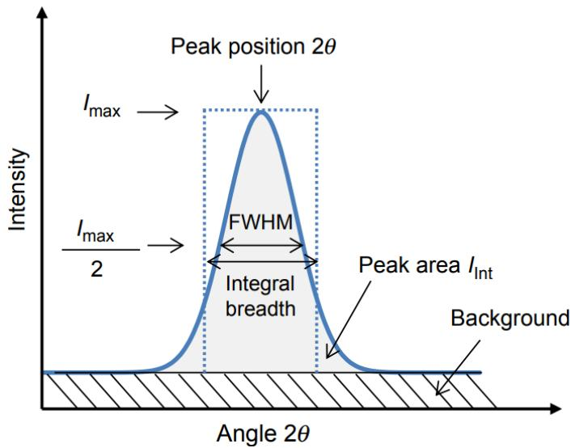

> 🧠 **[Cognis Multimodal Enrichment]**
> * **Classification:** Scientific Figure
> * **Extracted Text (OCR):** `Peak position 2θ, I_max, FWHM, Integral breadth, Peak area I_int, Background, Angle 2θ`
> * **VLM Visual Summary:** ### FIGURE TYPE:
>   Data Plot/Graph
>   
>   ### SCIENTIFIC PURPOSE:
>   This figure explains the concept of the Full Width at Half Maximum (FWHM) in the context of X-ray diffraction patterns. It illustrates how to measure the width of a diffraction peak at half its maximum intensity, which is crucial for determining the size of crystallites using the Scherrer equation.
>   
>   ### KEY KNOWLEDGE:
>   1. **Full Width at Half Maximum (FWHM):** This is the width of a peak at half its maximum intensity. It is often used to determine the size of crystallites.
>   2. **Peak Position (2θ):** This is the angle at which the peak occurs on the X-ray diffraction pattern.
>   3. **Peak Area (I_int):** This is the area under the peak, which can be used to normalize the intensity.
>   4. **Background:** The background intensity is typically subtracted before calculating the FWHM.
>   5. **Peak Intensity (I_max):** This is the maximum intensity of the peak.
>   
>   ### LABEL INTERPRETATION:
>   - **Peak Position (2θ):** The angle at which the peak occurs.
>   - **I_max:** The maximum intensity of the peak.
>   - **FWHM:** The Full Width at Half Maximum, which is the width of the peak at half its maximum intensity.
>   - **Integral Breadth:** The integral breadth is related to the FWHM but measures the area under the peak.
>   - **Peak Area (I_int):** The area under the peak, which can be used to normalize the intensity.
>   - **Background:** The background intensity is typically subtracted before calculating the FWHM.
>   
>   ### ENGINEERING/SCIENTIFIC INSIGHTS:
>   A reader should learn that the FWHM is a critical parameter in X-ray diffraction analysis, particularly when using the Scherrer equation to determine the size of crystallites. By measuring the FWHM, one can indirectly estimate the size of the crystallites based on the relationship between the FWHM and the crystallite size.
>   
>   ### USER-RELEVANT INFORMATION:
>   The information from this figure is essential for understanding how to measure the FWHM accurately. This measurement is crucial for applying the Scherrer equation to calculate the size of crystallites. Additionally, the figure provides a clear visualization of how to identify and measure the FWHM, which is necessary for performing the Scherrer calculation correctly.
> * **Figure Caption:** In short, by performing a curve selection of the diffraction peaks of each plane crystal at position 2θ, we can see a half-peak curve widening value diffraction (FWHM), then with a value of is put into the equation Scherrer to determine the size crystal. | [Section: Observations:]
> * **Surrounding Context (+/- 300 words):**
>   * **[Before]:** *... actual shape of the crystallite. ??is the X-ray wavelength. ?? is the line broadening at half the maximum intensity (FWHM) as shown in the figure below, after subtracting the instrumental line broadening, in radians. ?? is denoted as Bragg’s law. [Section: Procedure:] 1. Identify the K value. 2. Identify the ?? value. 3. Identify FWHM (β). To determine the value of FWHM (β) can be done using the following ways: Step 1: Identify the sharpest peak or crystalline area in the diffraction pattern generated by XRD. Step 2: Determine the value of 2θ at the peak with the maximum intensity of the XRD diffraction pattern. Step 3: Determine the value of half of the maximum peak intensity. Step 4: Determine the minimum 2θ value and the maximum 2θ value at half the maximum intensity of the peak. Step 5: Determine the FWHM (β) value using Equation $\beta = { \textstyle \frac { 1 } { 2 } } ( 2 \theta _ { m a x } - 2 \theta _ { m i n } )$ 4. Determine the value of cos?? from the value of 2?? value. The steps to determine the value of cos from the value of 2θ are as follows: Step 1: Divide the value of 2θ theta by the number 2 thus θ is known. Step 2: Change θ value to ????????. 5. After all the values from step 1 to step 4 are known, the last step is to put these values in Equation (1)to obtain the crystal size. In short, by performing a curve selection of the diffraction peaks of each plane crystal at position 2θ, we can see a half-peak curve widening value diffraction (FWHM), then with a value of is put into the equation Scherrer to determine the size crystal.*
>   * **[After]:** *[Section: Observations:] 1. Tabulate the calculated data for every 2θ in the table below: <table><tr><td rowspan=1 colspan=1>20 (degree)</td><td rowspan=1 colspan=1>0 (degree)</td><td rowspan=1 colspan=1>Cos0</td></tr><tr><td rowspan=1 colspan=1></td><td rowspan=1 colspan=1></td><td rowspan=1 colspan=1></td></tr><tr><td rowspan=1 colspan=1></td><td rowspan=1 colspan=1></td><td rowspan=1 colspan=1></td></tr></table> [Section: Analysis:] <table><tr><td rowspan=1 colspan=1>20()</td><td rowspan=1 colspan=1>cos 0</td><td rowspan=1 colspan=1>K $\left( \mathbf { r a d } / A ^ { \circ } \right)$ </td><td rowspan=1 colspan=1>λ(mm)</td><td rowspan=1 colspan=1>FWHM $\pmb { \beta }$ 0</td><td rowspan=1 colspan=1>FWHM $\pmb { \beta }$ (rad)</td><td rowspan=1 colspan=1>Crystallite Size(nm）</td></tr><tr><td rowspan=1 colspan=1></td><td rowspan=1 colspan=1></td><td rowspan=1 colspan=1></td><td rowspan=1 colspan=1></td><td rowspan=1 colspan=1></td><td rowspan=1 colspan=1></td><td rowspan=1 colspan=1></td></tr><tr><td rowspan=1 colspan=1></td><td rowspan=1 colspan=1></td><td rowspan=1 colspan=1></td><td rowspan=1 colspan=1></td><td rowspan=1 colspan=1></td><td rowspan=1 colspan=1></td><td rowspan=1 colspan=1></td></tr></table> Conclusions: [Section: EXPERIMENT NO. 3] Aim: To calculate strain produced in a material using Williamson-Hall plot from given XRD data. Requirements:XRD data of powder sample. Theory:Williamson-Hall (W-H) analysis is a simplified integral breadth method where both sizeinduced and strain-induced broadening are de-convoluted by considering the peak width as a function of 2θ. W-H analysis is employed for estimating crystallite size and lattice strain. The significance of the broadening of peaks evidences grain refinement along with the large strain associated with the powder. The instrumental broadening $( \beta _ { \mathrm { h k l } } )$ is corrected corresponding to each diffraction peak XRD pattern using the equation: $$ \beta _ { \mathrm { h k l } } ^ { 2 } = ( \beta _ { \mathrm { h k l } } ) _ { \mathrm { M e a s u r e d } } ^ { 2 } - \left( \beta _ { \mathrm { h k l } } \right) _ { \mathrm { I n s t r u m e n t } } ^ { 2 } \quad \dots ( 1 ) ...*

## Observations:

1. Tabulate the calculated data for every 2θ in the table below:

<table><tr><td rowspan=1 colspan=1>20 (degree)</td><td rowspan=1 colspan=1>0 (degree)</td><td rowspan=1 colspan=1>Cos0</td></tr><tr><td rowspan=1 colspan=1></td><td rowspan=1 colspan=1></td><td rowspan=1 colspan=1></td></tr><tr><td rowspan=1 colspan=1></td><td rowspan=1 colspan=1></td><td rowspan=1 colspan=1></td></tr></table>

## Analysis:

<table><tr><td rowspan=1 colspan=1>20()</td><td rowspan=1 colspan=1>cos 0</td><td rowspan=1 colspan=1>K $\left( \mathbf { r a d } / A ^ { \circ } \right)$ </td><td rowspan=1 colspan=1>λ(mm)</td><td rowspan=1 colspan=1>FWHM  $\pmb { \beta }$ 0</td><td rowspan=1 colspan=1>FWHM    $\pmb { \beta }$ (rad)</td><td rowspan=1 colspan=1>Crystallite Size(nm）</td></tr><tr><td rowspan=1 colspan=1></td><td rowspan=1 colspan=1></td><td rowspan=1 colspan=1></td><td rowspan=1 colspan=1></td><td rowspan=1 colspan=1></td><td rowspan=1 colspan=1></td><td rowspan=1 colspan=1></td></tr><tr><td rowspan=1 colspan=1></td><td rowspan=1 colspan=1></td><td rowspan=1 colspan=1></td><td rowspan=1 colspan=1></td><td rowspan=1 colspan=1></td><td rowspan=1 colspan=1></td><td rowspan=1 colspan=1></td></tr></table>

Conclusions:

## EXPERIMENT NO. 3

Aim: To calculate strain produced in a material using Williamson-Hall plot from given XRD data.   
Requirements:XRD data of powder sample.

Theory:Williamson-Hall (W-H) analysis is a simplified integral breadth method where both sizeinduced and strain-induced broadening are de-convoluted by considering the peak width as a function of 2θ. W-H analysis is employed for estimating crystallite size and lattice strain. The significance of the broadening of peaks evidences grain refinement along with the large strain associated with the powder. The instrumental broadening $( \beta _ { \mathrm { h k l } } )$ is corrected corresponding to each diffraction peak XRD pattern using the equation:

$$
\beta _ { \mathrm { h k l } } ^ { 2 } = ( \beta _ { \mathrm { h k l } } ) _ { \mathrm { M e a s u r e d } } ^ { 2 } - \left( \beta _ { \mathrm { h k l } } \right) _ { \mathrm { I n s t r u m e n t } } ^ { 2 } \quad \dots ( 1 )
$$

The average nano-crystalline size was calculated using Debye-Scherer’s formula:

$$
\begin{array} { r } { D = \frac { \textrm { K } \lambda } { \beta \cos \theta } } \end{array}\tag{2}
$$

where D = crystalline size, K = shape factor (0.9), and λ = wavelength of Cu kα radiation.

The strain induced in powders due to crystal imperfection and distortion:

$$
\begin{array} { r } { \mathsf { \Omega } \in \frac { \beta _ { h k l } } { t a n \theta } \qquad \quad \dots \ ( 3 ) } \end{array}
$$

From Equations 2 and 3, it was confirmed that the peak width from crystallite size varies as $\frac { 1 } { c o s \theta }$ strain varies as tanθ. Assuming that the particle size and strain contributions to line broadening are independent to each other and both have a Cauchy-like profile, the observed line breadth is simply the sum of Equations 2 and 3.

$$
\begin{array} { r } { \beta _ { h k l } = \frac { K \lambda } { D c o s \theta } + 4 \epsilon t a n \theta \ldots \ldots \ldots ( 4 ) } \end{array}
$$

By rearranging the above equation, we get:

$$
\beta _ { h k l } = \frac { K \lambda } { D c o s \theta } + 4 \epsilon t a n \theta \ldots \ldots \ldots \ldots ( 5 )
$$

The above equations are W-H equations. A plot is drawn with 4sinθ along the x-axis and $\beta _ { h k l }$ cosθ along the y-axis for as prepared samples. From the linear fit to the data, the crystalline size was estimated from the y-intercept, and the strain ε, from the slope of the fit.

Uniform deformation stress and uniform deformation energy density were taken into account; the anisotropic nature of Young’s modulus of the crystal is more realistic. The generalized Hook’s law referred to the strain, keeping only the linear proportionality between the stress and strain, i.e., $\sigma =$ E. Here, the stress is proportional to the strain, with the constant of proportionality being the modulus of elasticity or Young’s modulus, denoted by E. In this approach, the Williamson-Hall equation is modified by substituting the value of ε in Equation 5.

$$
\beta _ { h k l } c o s \theta = \frac { K \lambda } { D } + \frac { 4 s i n \theta \sigma } { E _ { h k l } }
$$

$E _ { h k l }$ is Young’s modulus in the direction perpendicular to the set of the crystal lattice plane (hkl). The uniform stress can be calculated from the slope line plotted between 4sinθ/Ehkl and βhkl cosθ, and the crystallite size D, from the intercept as shown in the figure below.

Observations:

Conclusions:

Analysis:

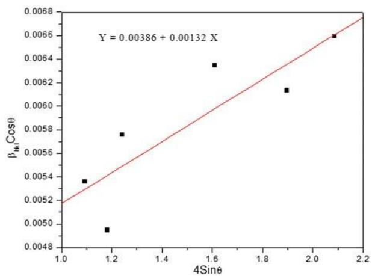

> 🧠 **[Cognis Multimodal Enrichment]**
> * **Classification:** Scientific Figure
> * **Extracted Text (OCR):** `Y = 0.00386 + 0.00132 X, βμ Cosθ, 4Sinθ`
> * **VLM Visual Summary:** ### FIGURE TYPE:
>   Data Plot/Graph
>   
>   ### SCIENTIFIC PURPOSE:
>   The figure explains the relationship between the crystalline size (measured by $\beta_{hkI}$) and the strain ($\epsilon$) in materials, using the Williamson-Hall equation. Specifically, it shows how the crystalline size can be determined from the intercept of a linear fit to the data when plotted against the strain.
>   
>   ### KEY KNOWLEDGE:
>   1. **Williamson-Hall Equation**: 
>      - The equation relates the crystalline size ($D$) to the strain ($\epsilon$) and the angle $\theta$ through the parameter $K$, wavelength $\lambda$, and the elastic modulus $E_{hkI}$.
>      - The equation is $\beta_{hkI} \cos\theta = \frac{K\lambda}{D} + \frac{4\sin\theta\sigma}{E_{hkI}}$.
>      - The term $\frac{4\sin\theta\sigma}{E_{hkI}}$ represents the strain contribution due to the applied stress.
>   
>   2. **Linear Fit**:
>      - The figure shows a linear relationship between $\beta_{hkI} \cos\theta$ and $4\sin\theta$.
>      - The slope of the linear fit gives the strain $\epsilon$.
>      - The y-intercept provides the crystalline size $D$.
>   
>   3. **Strain Calculation**:
>      - The strain $\epsilon$ can be calculated from the slope of the linear fit between $\beta_{hkI} \cos\theta$ and $4\sin\theta$.
>      - The crystalline size $D$ can be derived from the y-intercept of the same linear fit.
>   
>   ### LABEL INTERPRETATION:
>   - **$\beta_{hkI}$**: This is a parameter related to the crystalline size.
>   - **$\cos\theta$**: This is a trigonometric function used in the Williamson-Hall equation.
>   - **$4\sin\theta$**: This term is part of the Williamson-Hall equation and represents the strain contribution due to the applied stress.
>   
>   ### ENGINEERING/SCIENTIFIC INSIGHTS:
>   - The figure demonstrates how to use the Williamson-Hall equation to determine the crystalline size and strain from experimental data.
>   - It highlights the importance of plotting the data correctly and interpreting the intercept and slope of the linear fit to extract meaningful parameters.
>   
>   ### USER
> * **Figure Caption:** Analysis: | [Section: Experiment No 4]
> * **Surrounding Context (+/- 300 words):**
>   * **[Before]:** *... t a n \theta \ldots \ldots \ldots ( 4 ) } \end{array} $$ By rearranging the above equation, we get: $$ \beta _ { h k l } = \frac { K \lambda } { D c o s \theta } + 4 \epsilon t a n \theta \ldots \ldots \ldots \ldots ( 5 ) $$ The above equations are W-H equations. A plot is drawn with 4sinθ along the x-axis and $\beta _ { h k l }$ cosθ along the y-axis for as prepared samples. From the linear fit to the data, the crystalline size was estimated from the y-intercept, and the strain ε, from the slope of the fit. [Section: EXPERIMENT NO. 3] Uniform deformation stress and uniform deformation energy density were taken into account; the anisotropic nature of Young’s modulus of the crystal is more realistic. The generalized Hook’s law referred to the strain, keeping only the linear proportionality between the stress and strain, i.e., $\sigma =$ E. Here, the stress is proportional to the strain, with the constant of proportionality being the modulus of elasticity or Young’s modulus, denoted by E. In this approach, the Williamson-Hall equation is modified by substituting the value of ε in Equation 5. $$ \beta _ { h k l } c o s \theta = \frac { K \lambda } { D } + \frac { 4 s i n \theta \sigma } { E _ { h k l } } $$ $E _ { h k l }$ is Young’s modulus in the direction perpendicular to the set of the crystal lattice plane (hkl). The uniform stress can be calculated from the slope line plotted between 4sinθ/Ehkl and βhkl cosθ, and the crystallite size D, from the intercept as shown in the figure below. Observations: Conclusions: Analysis:*
>   * **[After]:** *[Section: Experiment No 4] Aim: To study the heat flow associated with physical and chemical transitions in materials as a function of temperature. Requirements: DSC instrument, materials Theory and procedure: Endothermic and Exothermic Peaks: Examine the DSC curve for endothermic (heat absorption) and exothermic (heat release) peaks. Peaks indicate phase transitions or chemical reactions. [Section: 1. Thermal Stability:] Onset Temperature of Decomposition: Identify the onset temperature at which the material starts to decompose. A lower onset temperature may indicate lower thermal stability. Peak Temperature of Decomposition: Determine the peak temperature of the decomposition reaction. A higher peak temperature often suggests higher thermal stability. [Section: 2. Purity:] Baseline Assessment: Examine the baseline of the DSC curve. Impurities or contaminants may introduce additional peaks or affect the baseline. Peak Purity: Evaluate the purity of the material based on the sharpness and symmetry of the observed peaks. A pure substance typically exhibits well-defined peaks. [Section: 3. Phase Transitions:] Melting/Freezing Points: Identify melting and freezing points, which can provide insights into the material's crystalline structure. Consistency in melting points across runs indicates purity. Glass Transition Temperature (Tg): Determine the Tg for amorphous materials. Tg is critical for understanding the material's transition from a glassy to a rubbery state. Crystallization Peaks: Look for crystallization peaks after the melting point. The absence of crystallization peaks may suggest the material is amorphous. 4. Enthalpy Changes: Enthalpy of Fusion: Measure the enthalpy change during melting (endothermic peak). Higher enthalpy may indicate higher purity or crystallinity. Assess the enthalpy change for any exothermic peaks corresponding to reactions. Evaluate the significance of the reaction in terms of purity and stability. Figure-2: The working principle of DSC Figure-1: DSC apparatus DSC Data: Prepare your sample and reference materials. The sample and reference should have similar masses. 1. Load the sample and ...*

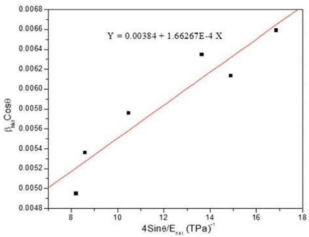

> 🧠 **[Cognis Multimodal Enrichment]**
> * **Classification:** Scientific Figure
> * **Extracted Text (OCR):** `Y = 0.00384 + 1.66267E-4 X`
> * **VLM Visual Summary:** ### FIGURE TYPE:
>   Data Plot/Graph
>   
>   ### SCIENTIFIC PURPOSE:
>   The figure explains the relationship between the crystalline size (estimated from the y-intercept) and the strain (calculated from the slope of the fit) using the Williamson-Hall equation. It shows how the parameter \( \beta_{hk\ell} \cos\theta \) varies with \( 4\sin\theta / E_{hk\ell} \).
>   
>   ### KEY KNOWLEDGE:
>   1. **Williamson-Hall Equation**: 
>      - \( \beta_{hk\ell} = \frac{K\lambda}{D\cos\theta} + 4\tan\theta \)
>      - \( \beta_{hk\ell} \cos\theta = \frac{K\lambda}{D} + \frac{4\sin\theta\sigma}{E_{hk\ell}} \)
>   
>   2. **Crystalline Size**:
>      - The y-intercept of the linear fit provides the crystalline size \( D \).
>   
>   3. **Strain**:
>      - The slope of the linear fit gives the strain \( \varepsilon \).
>   
>   4. **Young's Modulus**:
>      - \( E_{hk\ell} \) is the Young's modulus in the direction perpendicular to the set of the crystal lattice plane (hkl).
>   
>   5. **Linear Relationship**:
>      - The figure demonstrates that \( \beta_{hk\ell} \cos\theta \) is linearly related to \( 4\sin\theta / E_{hk\ell} \).
>   
>   ### LABEL INTERPRETATION:
>   - **Y-Axis**: \( \beta_{hk\ell} \cos\theta \)
>   - **X-Axis**: \( 4\sin\theta / E_{hk\ell} \) (TPa\(^{-1}\))
>   
>   ### ENGINEERING/SCIENTIFIC INSIGHTS:
>   - This figure helps in estimating the crystalline size and strain from experimental data using the Williamson-Hall equation.
>   - It provides a direct method to analyze the relationship between structural parameters and mechanical properties.
>   
>   ### USER-RELEVANT INFORMATION:
>   - The slope of the linear fit gives the strain \( \varepsilon \).
>   - The y-intercept of the linear fit provides the crystalline size \( D \).
>   - The Young's modulus \( E_{hk\ell} \) can be derived from the slope of the
> * **Figure Caption:** Analysis: | [Section: Experiment No 4]
> * **Surrounding Context (+/- 300 words):**
>   * **[Before]:** *... t a n \theta \ldots \ldots \ldots ( 4 ) } \end{array} $$ By rearranging the above equation, we get: $$ \beta _ { h k l } = \frac { K \lambda } { D c o s \theta } + 4 \epsilon t a n \theta \ldots \ldots \ldots \ldots ( 5 ) $$ The above equations are W-H equations. A plot is drawn with 4sinθ along the x-axis and $\beta _ { h k l }$ cosθ along the y-axis for as prepared samples. From the linear fit to the data, the crystalline size was estimated from the y-intercept, and the strain ε, from the slope of the fit. [Section: EXPERIMENT NO. 3] Uniform deformation stress and uniform deformation energy density were taken into account; the anisotropic nature of Young’s modulus of the crystal is more realistic. The generalized Hook’s law referred to the strain, keeping only the linear proportionality between the stress and strain, i.e., $\sigma =$ E. Here, the stress is proportional to the strain, with the constant of proportionality being the modulus of elasticity or Young’s modulus, denoted by E. In this approach, the Williamson-Hall equation is modified by substituting the value of ε in Equation 5. $$ \beta _ { h k l } c o s \theta = \frac { K \lambda } { D } + \frac { 4 s i n \theta \sigma } { E _ { h k l } } $$ $E _ { h k l }$ is Young’s modulus in the direction perpendicular to the set of the crystal lattice plane (hkl). The uniform stress can be calculated from the slope line plotted between 4sinθ/Ehkl and βhkl cosθ, and the crystallite size D, from the intercept as shown in the figure below. Observations: Conclusions: Analysis:*
>   * **[After]:** *[Section: Experiment No 4] Aim: To study the heat flow associated with physical and chemical transitions in materials as a function of temperature. Requirements: DSC instrument, materials Theory and procedure: Endothermic and Exothermic Peaks: Examine the DSC curve for endothermic (heat absorption) and exothermic (heat release) peaks. Peaks indicate phase transitions or chemical reactions. [Section: 1. Thermal Stability:] Onset Temperature of Decomposition: Identify the onset temperature at which the material starts to decompose. A lower onset temperature may indicate lower thermal stability. Peak Temperature of Decomposition: Determine the peak temperature of the decomposition reaction. A higher peak temperature often suggests higher thermal stability. [Section: 2. Purity:] Baseline Assessment: Examine the baseline of the DSC curve. Impurities or contaminants may introduce additional peaks or affect the baseline. Peak Purity: Evaluate the purity of the material based on the sharpness and symmetry of the observed peaks. A pure substance typically exhibits well-defined peaks. [Section: 3. Phase Transitions:] Melting/Freezing Points: Identify melting and freezing points, which can provide insights into the material's crystalline structure. Consistency in melting points across runs indicates purity. Glass Transition Temperature (Tg): Determine the Tg for amorphous materials. Tg is critical for understanding the material's transition from a glassy to a rubbery state. Crystallization Peaks: Look for crystallization peaks after the melting point. The absence of crystallization peaks may suggest the material is amorphous. 4. Enthalpy Changes: Enthalpy of Fusion: Measure the enthalpy change during melting (endothermic peak). Higher enthalpy may indicate higher purity or crystallinity. Assess the enthalpy change for any exothermic peaks corresponding to reactions. Evaluate the significance of the reaction in terms of purity and stability. Figure-2: The working principle of DSC Figure-1: DSC apparatus DSC Data: Prepare your sample and reference materials. The sample and reference should have similar masses. 1. Load the sample and ...*

## Experiment No 4

Aim: To study the heat flow associated with physical and chemical transitions in materials as a function of temperature.

Requirements: DSC instrument, materials

Theory and procedure:

Endothermic and Exothermic Peaks: Examine the DSC curve for endothermic (heat absorption) and exothermic (heat release) peaks. Peaks indicate phase transitions or chemical reactions.

## 1. Thermal Stability:

Onset Temperature of Decomposition: Identify the onset temperature at which the material starts to decompose. A lower onset temperature may indicate lower thermal stability.

Peak Temperature of Decomposition: Determine the peak temperature of the decomposition reaction. A higher peak temperature often suggests higher thermal stability.

## 2. Purity:

Baseline Assessment: Examine the baseline of the DSC curve. Impurities or contaminants may introduce additional peaks or affect the baseline.

Peak Purity: Evaluate the purity of the material based on the sharpness and symmetry of the observed peaks. A pure substance typically exhibits well-defined peaks.

## 3. Phase Transitions:

Melting/Freezing Points: Identify melting and freezing points, which can provide insights into the material's crystalline structure. Consistency in melting points across runs indicates purity.

Glass Transition Temperature (Tg): Determine the Tg for amorphous materials. Tg is critical for understanding the material's transition from a glassy to a rubbery state.

Crystallization Peaks: Look for crystallization peaks after the melting point.

The absence of crystallization peaks may suggest the material is amorphous. 4.

Enthalpy Changes:

Enthalpy of Fusion: Measure the enthalpy change during melting (endothermic peak).

Higher enthalpy may indicate higher purity or crystallinity.

Assess the enthalpy change for any exothermic peaks corresponding to reactions.

Evaluate the significance of the reaction in terms of purity and stability.

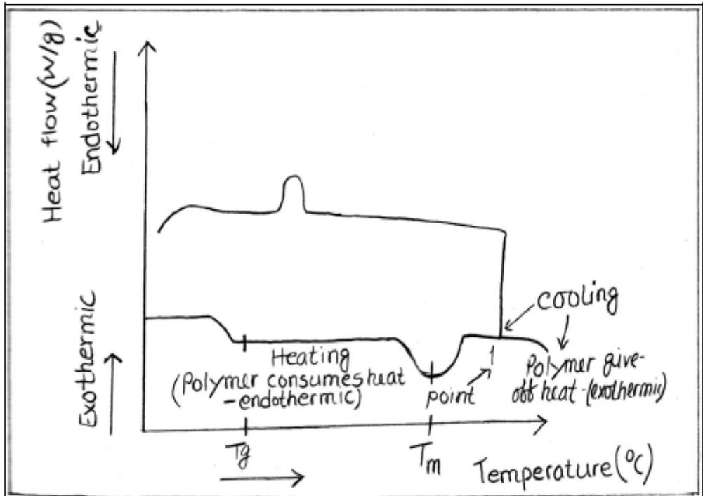

> 🧠 **[Cognis Multimodal Enrichment]**
> * **Classification:** Scientific Figure
> * **Extracted Text (OCR):** `Heat flow (v/g) Endothermic Exothermic Cooling Polymer give off heat (exothermic) Heating (Polymer consumes heat -endothermic) Tg Tm Temperature(°C)`
> * **VLM Visual Summary:** ### FIGURE TYPE:
>   Data Plot/Graph
>   
>   ### SCIENTIFIC PURPOSE:
>   The figure explains the working principle of Differential Scanning Calorimetry (DSC), which is used to study the heat flow associated with physical and chemical transitions in materials as a function of temperature.
>   
>   ### KEY KNOWLEDGE:
>   1. **Endothermic and Exothermic Peaks**: 
>      - **Endothermic Peaks**: These occur when a material absorbs heat, indicated by a positive slope in the graph. They correspond to phase transitions or chemical reactions where energy is absorbed from the surroundings.
>      - **Exothermic Peaks**: These occur when a material releases heat, indicated by a negative slope in the graph. They correspond to reactions where energy is released to the surroundings.
>   
>   2. **Heating and Cooling Curves**:
>      - **Heating Curve**: The heating curve shows the increase in heat flow as the temperature increases. It includes both endothermic and exothermic peaks.
>      - **Cooling Curve**: The cooling curve shows the decrease in heat flow as the temperature decreases. It also includes both endothermic and exothermic peaks.
>   
>   3. **Temperature Range**:
>      - **Glass Transition Temperature (Tg)**: This is the temperature at which a material transitions from a glassy to a rubbery state. It is marked as a flat region in the cooling curve.
>   
>   4. **Melting Point**:
>      - **Melting Peak**: This is the peak temperature at which a solid melts into a liquid. It corresponds to an endothermic peak in the heating curve.
>   
>   5. **Phase Transitions**:
>      - **Melting/Freezing Points**: These are the temperatures at which a material changes from a solid to a liquid (melting) or from a liquid to a solid (freezing). They are represented by sharp peaks in the heating and cooling curves.
>   
>   6. **Enthalpy Changes**:
>      - **Enthalpy of Fusion**: This is the enthalpy change during melting, indicated by an endothermic peak. Higher enthalpy values suggest higher purity or crystallinity.
>   
>   7. **Baseline Assessment**:
>      - **Impurities or Contaminants**: Impurities or contaminants may introduce additional peaks or affect the baseline, making it difficult to determine the purity of the material.
>   
>   8. **Peak Purity**:
>      - **Sharpness and Symmetry**: A pure substance typically exhibits well-defined peaks, indicating high
> * **Figure Caption:** Evaluate the significance of the reaction in terms of purity and stability. | Figure-2: The working principle of DSC
> * **Surrounding Context (+/- 300 words):**
>   * **[Before]:** *... can be calculated from the slope line plotted between 4sinθ/Ehkl and βhkl cosθ, and the crystallite size D, from the intercept as shown in the figure below. Observations: Conclusions: Analysis: [Section: Experiment No 4] Aim: To study the heat flow associated with physical and chemical transitions in materials as a function of temperature. Requirements: DSC instrument, materials Theory and procedure: Endothermic and Exothermic Peaks: Examine the DSC curve for endothermic (heat absorption) and exothermic (heat release) peaks. Peaks indicate phase transitions or chemical reactions. [Section: 1. Thermal Stability:] Onset Temperature of Decomposition: Identify the onset temperature at which the material starts to decompose. A lower onset temperature may indicate lower thermal stability. Peak Temperature of Decomposition: Determine the peak temperature of the decomposition reaction. A higher peak temperature often suggests higher thermal stability. [Section: 2. Purity:] Baseline Assessment: Examine the baseline of the DSC curve. Impurities or contaminants may introduce additional peaks or affect the baseline. Peak Purity: Evaluate the purity of the material based on the sharpness and symmetry of the observed peaks. A pure substance typically exhibits well-defined peaks. [Section: 3. Phase Transitions:] Melting/Freezing Points: Identify melting and freezing points, which can provide insights into the material's crystalline structure. Consistency in melting points across runs indicates purity. Glass Transition Temperature (Tg): Determine the Tg for amorphous materials. Tg is critical for understanding the material's transition from a glassy to a rubbery state. Crystallization Peaks: Look for crystallization peaks after the melting point. The absence of crystallization peaks may suggest the material is amorphous. 4. Enthalpy Changes: Enthalpy of Fusion: Measure the enthalpy change during melting (endothermic peak). Higher enthalpy may indicate higher purity or crystallinity. Assess the enthalpy change for any exothermic peaks corresponding to reactions. Evaluate the significance of the reaction in terms of purity and stability.*
>   * **[After]:** *Figure-2: The working principle of DSC Figure-1: DSC apparatus DSC Data: Prepare your sample and reference materials. The sample and reference should have similar masses. 1. Load the sample and reference into the DSC instrument. 2. Initiate the experiment according to the specified temperature program. 3. Record the heat flow data as a function of temperature. [Section: 3. Phase Transitions:] The sharpness or flatness of peaks in a DSC curve provides insights into the nature and characteristics of the thermal transitions occurring in a material. Sharp peaks are often associated with well-defined processes, while flat peaks may indicate broader or more complex transitions. Observations: Table: 1 Phase transitions or chemical reactions data. <table><tr><td rowspan=1 colspan=1>S.N.</td><td rowspan=1 colspan=1>Peak No.</td><td rowspan=1 colspan=1> Onset Temperature</td><td rowspan=1 colspan=1> Peak Temperature</td><td rowspan=1 colspan=1>Enthalpy Change</td></tr><tr><td rowspan=1 colspan=1></td><td rowspan=1 colspan=1></td><td rowspan=1 colspan=1></td><td rowspan=1 colspan=1></td><td rowspan=1 colspan=1></td></tr><tr><td rowspan=1 colspan=1></td><td rowspan=1 colspan=1></td><td rowspan=1 colspan=1></td><td rowspan=1 colspan=1></td><td rowspan=1 colspan=1></td></tr><tr><td rowspan=1 colspan=1></td><td rowspan=1 colspan=1></td><td rowspan=1 colspan=1></td><td rowspan=1 colspan=1></td><td rowspan=1 colspan=1></td></tr></table> Table:2 Material properties data [Section: 3. Phase Transitions:] <table><tr><td rowspan=1 colspan=1>S.N.</td><td rowspan=1 colspan=1> Peak No.</td><td rowspan=1 colspan=1>Thermal stability</td><td rowspan=1 colspan=1>Purity</td><td rowspan=1 colspan=1> Phase transition(Y/N)</td><td rowspan=1 colspan=1>Enthalpy</td></tr><tr><td rowspan=1 colspan=1></td><td rowspan=1 colspan=1></td><td rowspan=1 colspan=1></td><td rowspan=1 colspan=1></td><td rowspan=1 colspan=1></td><td rowspan=1 colspan=1></td></tr><tr><td rowspan=1 colspan=1></td><td rowspan=1 colspan=1></td><td rowspan=1 colspan=1></td><td rowspan=1 colspan=1></td><td rowspan=1 colspan=1></td><td rowspan=1 colspan=1></td></tr><tr><td rowspan=1 colspan=1></td><td rowspan=1 colspan=1></td><td rowspan=1 colspan=1></td><td rowspan=1 colspan=1></td><td rowspan=1 colspan=1></td><td rowspan=1 colspan=1></td></tr><tr><td rowspan=1 colspan=1></td><td rowspan=1 colspan=1></td><td rowspan=1 colspan=1></td><td rowspan=1 colspan=1></td><td rowspan=1 colspan=1></td><td rowspan=1 colspan=1></td></tr><tr><td rowspan=1 colspan=1></td><td rowspan=1 colspan=1></td><td rowspan=1 colspan=1></td><td rowspan=1 colspan=1></td><td rowspan=1 colspan=1></td><td rowspan=1 colspan=1></td></tr></table> Analysis: Conclusion: [Section: EXPERIMENT NO. 5] Aim: To analyse Raman spectra and calculate the force constant of a given sample. Requirements: Raman spectroscopy instrument, Raman spectra. Theory: Monochromatic light incident on a transparent substance is transmitted with almost no attenuation. A small fraction of the light is scattered by the substance in all directions (though ...*
  
Figure-2: The working principle of DSC

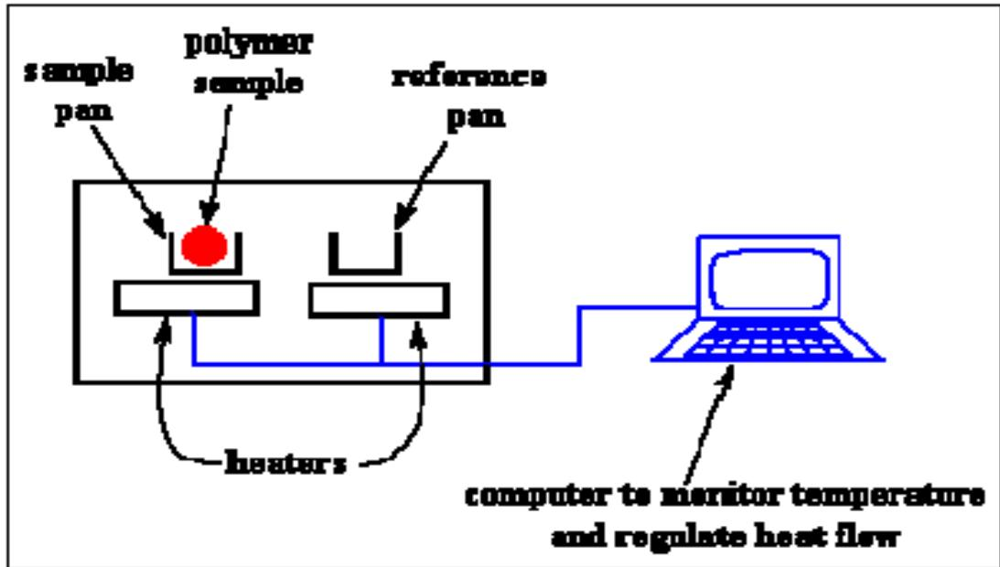

> 🧠 **[Cognis Multimodal Enrichment]**
> * **Classification:** Scientific Figure
> * **Extracted Text (OCR):** `sample pan,polymer sample,reference pan,heaters,computer to monitor temperature and regulate heat flow`
> * **VLM Visual Summary:** ### FIGURE TYPE:
>   Instrument Schematic
>   
>   ### SCIENTIFIC PURPOSE:
>   The figure explains the working principle of a Differential Scanning Calorimeter (DSC).
>   
>   ### KEY KNOWLEDGE:
>   - **Sample Pan:** Contains the sample being analyzed.
>   - **Reference Pan:** Contains a reference material with similar mass to the sample.
>   - **Heaters:** Control the temperature of the sample pan and reference pan.
>   - **Computer:** Used to monitor and regulate the heat flow, recording the temperature changes over time.
>   
>   ### LABEL INTERPRETATION:
>   - **Sample Pan:** The area where the polymer sample is placed.
>   - **Reference Pan:** The area where the reference material is placed.
>   - **Heaters:** The heating elements that control the temperature inside the sample pan and reference pan.
>   - **Computer:** The device used to monitor and record the temperature changes.
>   
>   ### ENGINEERING/SCIENTIFIC INSIGHTS:
>   A reader should learn that DSC is a technique used to measure the heat flow associated with physical and chemical transitions in materials as a function of temperature. It helps in determining the onset temperature of decomposition, peak temperature of decomposition, and the thermal stability and purity of materials.
>   
>   ### USER-RELEVANT INFORMATION:
>   - The computer's role in monitoring and regulating heat flow.
>   - The importance of having similar masses in the sample and reference pans.
>   - The significance of the temperatures and enthalpy changes recorded by the DSC instrument.
> * **Figure Caption:** Figure-2: The working principle of DSC | Figure-1: DSC apparatus
> * **Surrounding Context (+/- 300 words):**
>   * **[Before]:** *... line plotted between 4sinθ/Ehkl and βhkl cosθ, and the crystallite size D, from the intercept as shown in the figure below. Observations: Conclusions: Analysis: [Section: Experiment No 4] Aim: To study the heat flow associated with physical and chemical transitions in materials as a function of temperature. Requirements: DSC instrument, materials Theory and procedure: Endothermic and Exothermic Peaks: Examine the DSC curve for endothermic (heat absorption) and exothermic (heat release) peaks. Peaks indicate phase transitions or chemical reactions. [Section: 1. Thermal Stability:] Onset Temperature of Decomposition: Identify the onset temperature at which the material starts to decompose. A lower onset temperature may indicate lower thermal stability. Peak Temperature of Decomposition: Determine the peak temperature of the decomposition reaction. A higher peak temperature often suggests higher thermal stability. [Section: 2. Purity:] Baseline Assessment: Examine the baseline of the DSC curve. Impurities or contaminants may introduce additional peaks or affect the baseline. Peak Purity: Evaluate the purity of the material based on the sharpness and symmetry of the observed peaks. A pure substance typically exhibits well-defined peaks. [Section: 3. Phase Transitions:] Melting/Freezing Points: Identify melting and freezing points, which can provide insights into the material's crystalline structure. Consistency in melting points across runs indicates purity. Glass Transition Temperature (Tg): Determine the Tg for amorphous materials. Tg is critical for understanding the material's transition from a glassy to a rubbery state. Crystallization Peaks: Look for crystallization peaks after the melting point. The absence of crystallization peaks may suggest the material is amorphous. 4. Enthalpy Changes: Enthalpy of Fusion: Measure the enthalpy change during melting (endothermic peak). Higher enthalpy may indicate higher purity or crystallinity. Assess the enthalpy change for any exothermic peaks corresponding to reactions. Evaluate the significance of the reaction in terms of purity and stability. Figure-2: The working principle of DSC*
>   * **[After]:** *Figure-1: DSC apparatus DSC Data: Prepare your sample and reference materials. The sample and reference should have similar masses. 1. Load the sample and reference into the DSC instrument. 2. Initiate the experiment according to the specified temperature program. 3. Record the heat flow data as a function of temperature. [Section: 3. Phase Transitions:] The sharpness or flatness of peaks in a DSC curve provides insights into the nature and characteristics of the thermal transitions occurring in a material. Sharp peaks are often associated with well-defined processes, while flat peaks may indicate broader or more complex transitions. Observations: Table: 1 Phase transitions or chemical reactions data. <table><tr><td rowspan=1 colspan=1>S.N.</td><td rowspan=1 colspan=1>Peak No.</td><td rowspan=1 colspan=1> Onset Temperature</td><td rowspan=1 colspan=1> Peak Temperature</td><td rowspan=1 colspan=1>Enthalpy Change</td></tr><tr><td rowspan=1 colspan=1></td><td rowspan=1 colspan=1></td><td rowspan=1 colspan=1></td><td rowspan=1 colspan=1></td><td rowspan=1 colspan=1></td></tr><tr><td rowspan=1 colspan=1></td><td rowspan=1 colspan=1></td><td rowspan=1 colspan=1></td><td rowspan=1 colspan=1></td><td rowspan=1 colspan=1></td></tr><tr><td rowspan=1 colspan=1></td><td rowspan=1 colspan=1></td><td rowspan=1 colspan=1></td><td rowspan=1 colspan=1></td><td rowspan=1 colspan=1></td></tr></table> Table:2 Material properties data [Section: 3. Phase Transitions:] <table><tr><td rowspan=1 colspan=1>S.N.</td><td rowspan=1 colspan=1> Peak No.</td><td rowspan=1 colspan=1>Thermal stability</td><td rowspan=1 colspan=1>Purity</td><td rowspan=1 colspan=1> Phase transition(Y/N)</td><td rowspan=1 colspan=1>Enthalpy</td></tr><tr><td rowspan=1 colspan=1></td><td rowspan=1 colspan=1></td><td rowspan=1 colspan=1></td><td rowspan=1 colspan=1></td><td rowspan=1 colspan=1></td><td rowspan=1 colspan=1></td></tr><tr><td rowspan=1 colspan=1></td><td rowspan=1 colspan=1></td><td rowspan=1 colspan=1></td><td rowspan=1 colspan=1></td><td rowspan=1 colspan=1></td><td rowspan=1 colspan=1></td></tr><tr><td rowspan=1 colspan=1></td><td rowspan=1 colspan=1></td><td rowspan=1 colspan=1></td><td rowspan=1 colspan=1></td><td rowspan=1 colspan=1></td><td rowspan=1 colspan=1></td></tr><tr><td rowspan=1 colspan=1></td><td rowspan=1 colspan=1></td><td rowspan=1 colspan=1></td><td rowspan=1 colspan=1></td><td rowspan=1 colspan=1></td><td rowspan=1 colspan=1></td></tr><tr><td rowspan=1 colspan=1></td><td rowspan=1 colspan=1></td><td rowspan=1 colspan=1></td><td rowspan=1 colspan=1></td><td rowspan=1 colspan=1></td><td rowspan=1 colspan=1></td></tr></table> Analysis: Conclusion: [Section: EXPERIMENT NO. 5] Aim: To analyse Raman spectra and calculate the force constant of a given sample. Requirements: Raman spectroscopy instrument, Raman spectra. Theory: Monochromatic light incident on a transparent substance is transmitted with almost no attenuation. A small fraction of the light is scattered by the substance in all directions (though preferentially in the forward direction). The ...*
  
Figure-1: DSC apparatus

DSC Data: Prepare your sample and reference materials. The sample and reference should have similar masses.

1. Load the sample and reference into the DSC instrument.

2. Initiate the experiment according to the specified temperature program. 3.

Record the heat flow data as a function of temperature.

The sharpness or flatness of peaks in a DSC curve provides insights into the nature and characteristics of the thermal transitions occurring in a material. Sharp peaks are often associated with well-defined processes, while flat peaks may indicate broader or more complex transitions.

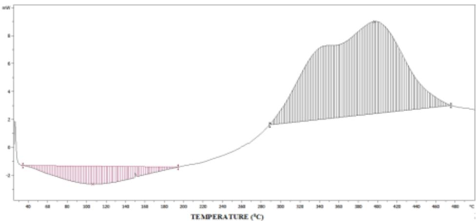

> 🧠 **[Cognis Multimodal Enrichment]**
> * **Classification:** Scientific Figure
> * **Extracted Text (OCR):** `TEMPERATURE (°C)`
> * **VLM Visual Summary:** ### FIGURE TYPE:
>   Data Plot/Graph
>   
>   ### SCIENTIFIC PURPOSE:
>   This figure illustrates a Differential Scanning Calorimetry (DSC) curve, which is used to study the thermal properties of materials. Specifically, it shows how the heat flow (in joules per second) changes with temperature, providing insights into the thermal transitions occurring in the material.
>   
>   ### KEY KNOWLEDGE:
>   1. **Heat Flow vs. Temperature**: The graph plots heat flow (in joules per second) against temperature (in degrees Celsius).
>   2. **Peaks and Transitions**: The peaks in the DSC curve correspond to specific thermal events such as melting, crystallization, or decomposition.
>   3. **Temperature Range**: The temperature range shown is from approximately 40°C to 600°C.
>   4. **Baseline**: The baseline represents the heat flow when there is no thermal event occurring.
>   5. **Peak Temperature**: The peak temperature of each transition is indicated on the x-axis.
>   6. **Enthalpy Change**: The area under each peak represents the enthalpy change associated with that transition.
>   
>   ### LABEL INTERPRETATION:
>   - **X-Axis**: Temperature (°C)
>   - **Y-Axis**: Heat Flow (joules per second)
>   
>   ### ENGINEERING/SCIENTIFIC INSIGHTS:
>   - **Thermal Stability**: The steepness of the baseline indicates the thermal stability of the material. A flatter baseline suggests a broader transition, indicating more complex or broad thermal events.
>   - **Phase Transitions**: The peaks in the DSC curve correspond to phase transitions such as melting, crystallization, or decomposition.
>   - **Material Properties**: The sharpness and symmetry of the peaks can provide insights into the purity and crystallinity of the material.
>   
>   ### USER-RELEVANT INFORMATION:
>   - **Peak Temperatures**: The temperatures at which the peaks occur can be used to identify specific phase transitions.
>   - **Enthalpy Changes**: The areas under the peaks represent the enthalpy changes, which can indicate the energy required for the transition.
>   - **Baseline**: The baseline can help determine the thermal stability of the material by identifying any significant shifts or changes.
>   
>   By analyzing the DSC curve, one can gain valuable insights into the thermal behavior of the material, including its phase transitions, thermal stability, and purity.
> * **Figure Caption:** The sharpness or flatness of peaks in a DSC curve provides insights into the nature and characteristics of the thermal transitions occurring in a material. Sharp peaks are often associated with well-defined processes, while flat peaks may indicate broader or more complex transitions. | Observations:
> * **Surrounding Context (+/- 300 words):**
>   * **[Before]:** *... A lower onset temperature may indicate lower thermal stability. Peak Temperature of Decomposition: Determine the peak temperature of the decomposition reaction. A higher peak temperature often suggests higher thermal stability. [Section: 2. Purity:] Baseline Assessment: Examine the baseline of the DSC curve. Impurities or contaminants may introduce additional peaks or affect the baseline. Peak Purity: Evaluate the purity of the material based on the sharpness and symmetry of the observed peaks. A pure substance typically exhibits well-defined peaks. [Section: 3. Phase Transitions:] Melting/Freezing Points: Identify melting and freezing points, which can provide insights into the material's crystalline structure. Consistency in melting points across runs indicates purity. Glass Transition Temperature (Tg): Determine the Tg for amorphous materials. Tg is critical for understanding the material's transition from a glassy to a rubbery state. Crystallization Peaks: Look for crystallization peaks after the melting point. The absence of crystallization peaks may suggest the material is amorphous. 4. Enthalpy Changes: Enthalpy of Fusion: Measure the enthalpy change during melting (endothermic peak). Higher enthalpy may indicate higher purity or crystallinity. Assess the enthalpy change for any exothermic peaks corresponding to reactions. Evaluate the significance of the reaction in terms of purity and stability. Figure-2: The working principle of DSC Figure-1: DSC apparatus DSC Data: Prepare your sample and reference materials. The sample and reference should have similar masses. 1. Load the sample and reference into the DSC instrument. 2. Initiate the experiment according to the specified temperature program. 3. Record the heat flow data as a function of temperature. [Section: 3. Phase Transitions:] The sharpness or flatness of peaks in a DSC curve provides insights into the nature and characteristics of the thermal transitions occurring in a material. Sharp peaks are often associated with well-defined processes, while flat peaks may indicate broader or more complex transitions.*
>   * **[After]:** *Observations: Table: 1 Phase transitions or chemical reactions data. <table><tr><td rowspan=1 colspan=1>S.N.</td><td rowspan=1 colspan=1>Peak No.</td><td rowspan=1 colspan=1> Onset Temperature</td><td rowspan=1 colspan=1> Peak Temperature</td><td rowspan=1 colspan=1>Enthalpy Change</td></tr><tr><td rowspan=1 colspan=1></td><td rowspan=1 colspan=1></td><td rowspan=1 colspan=1></td><td rowspan=1 colspan=1></td><td rowspan=1 colspan=1></td></tr><tr><td rowspan=1 colspan=1></td><td rowspan=1 colspan=1></td><td rowspan=1 colspan=1></td><td rowspan=1 colspan=1></td><td rowspan=1 colspan=1></td></tr><tr><td rowspan=1 colspan=1></td><td rowspan=1 colspan=1></td><td rowspan=1 colspan=1></td><td rowspan=1 colspan=1></td><td rowspan=1 colspan=1></td></tr></table> Table:2 Material properties data [Section: 3. Phase Transitions:] <table><tr><td rowspan=1 colspan=1>S.N.</td><td rowspan=1 colspan=1> Peak No.</td><td rowspan=1 colspan=1>Thermal stability</td><td rowspan=1 colspan=1>Purity</td><td rowspan=1 colspan=1> Phase transition(Y/N)</td><td rowspan=1 colspan=1>Enthalpy</td></tr><tr><td rowspan=1 colspan=1></td><td rowspan=1 colspan=1></td><td rowspan=1 colspan=1></td><td rowspan=1 colspan=1></td><td rowspan=1 colspan=1></td><td rowspan=1 colspan=1></td></tr><tr><td rowspan=1 colspan=1></td><td rowspan=1 colspan=1></td><td rowspan=1 colspan=1></td><td rowspan=1 colspan=1></td><td rowspan=1 colspan=1></td><td rowspan=1 colspan=1></td></tr><tr><td rowspan=1 colspan=1></td><td rowspan=1 colspan=1></td><td rowspan=1 colspan=1></td><td rowspan=1 colspan=1></td><td rowspan=1 colspan=1></td><td rowspan=1 colspan=1></td></tr><tr><td rowspan=1 colspan=1></td><td rowspan=1 colspan=1></td><td rowspan=1 colspan=1></td><td rowspan=1 colspan=1></td><td rowspan=1 colspan=1></td><td rowspan=1 colspan=1></td></tr><tr><td rowspan=1 colspan=1></td><td rowspan=1 colspan=1></td><td rowspan=1 colspan=1></td><td rowspan=1 colspan=1></td><td rowspan=1 colspan=1></td><td rowspan=1 colspan=1></td></tr></table> Analysis: Conclusion: [Section: EXPERIMENT NO. 5] Aim: To analyse Raman spectra and calculate the force constant of a given sample. Requirements: Raman spectroscopy instrument, Raman spectra. Theory: Monochromatic light incident on a transparent substance is transmitted with almost no attenuation. A small fraction of the light is scattered by the substance in all directions (though preferentially in the forward direction). The weakly scattered radiation contains photons at the incident frequency??0 (elastic or Rayleigh scattering), but also contains other frequencies such $\mathrm { a s } \nu _ { 0 } - \nu _ { i } ,$ where???? is the frequency of a molecular transition (typically rotational or vibrational) of the material. This inelastic light scattering is known as Raman scattering. In a typical Raman experiment, a polarized monochromatic light source (usually a laser) is focused into a sample, and the scattered light at $9 0 ^ { \circ }$ to the laser beam is collected and dispersed ...*

Observations:

Table: 1 Phase transitions or chemical reactions data.
<table><tr><td rowspan=1 colspan=1>S.N.</td><td rowspan=1 colspan=1>Peak No.</td><td rowspan=1 colspan=1> Onset Temperature</td><td rowspan=1 colspan=1> Peak Temperature</td><td rowspan=1 colspan=1>Enthalpy Change</td></tr><tr><td rowspan=1 colspan=1></td><td rowspan=1 colspan=1></td><td rowspan=1 colspan=1></td><td rowspan=1 colspan=1></td><td rowspan=1 colspan=1></td></tr><tr><td rowspan=1 colspan=1></td><td rowspan=1 colspan=1></td><td rowspan=1 colspan=1></td><td rowspan=1 colspan=1></td><td rowspan=1 colspan=1></td></tr><tr><td rowspan=1 colspan=1></td><td rowspan=1 colspan=1></td><td rowspan=1 colspan=1></td><td rowspan=1 colspan=1></td><td rowspan=1 colspan=1></td></tr></table>

Table:2 Material properties data
<table><tr><td rowspan=1 colspan=1>S.N.</td><td rowspan=1 colspan=1> Peak No.</td><td rowspan=1 colspan=1>Thermal stability</td><td rowspan=1 colspan=1>Purity</td><td rowspan=1 colspan=1> Phase transition(Y/N)</td><td rowspan=1 colspan=1>Enthalpy</td></tr><tr><td rowspan=1 colspan=1></td><td rowspan=1 colspan=1></td><td rowspan=1 colspan=1></td><td rowspan=1 colspan=1></td><td rowspan=1 colspan=1></td><td rowspan=1 colspan=1></td></tr><tr><td rowspan=1 colspan=1></td><td rowspan=1 colspan=1></td><td rowspan=1 colspan=1></td><td rowspan=1 colspan=1></td><td rowspan=1 colspan=1></td><td rowspan=1 colspan=1></td></tr><tr><td rowspan=1 colspan=1></td><td rowspan=1 colspan=1></td><td rowspan=1 colspan=1></td><td rowspan=1 colspan=1></td><td rowspan=1 colspan=1></td><td rowspan=1 colspan=1></td></tr><tr><td rowspan=1 colspan=1></td><td rowspan=1 colspan=1></td><td rowspan=1 colspan=1></td><td rowspan=1 colspan=1></td><td rowspan=1 colspan=1></td><td rowspan=1 colspan=1></td></tr><tr><td rowspan=1 colspan=1></td><td rowspan=1 colspan=1></td><td rowspan=1 colspan=1></td><td rowspan=1 colspan=1></td><td rowspan=1 colspan=1></td><td rowspan=1 colspan=1></td></tr></table>

Analysis:

Conclusion:

## EXPERIMENT NO. 5

Aim: To analyse Raman spectra and calculate the force constant of a given sample.

Requirements: Raman spectroscopy instrument, Raman spectra.

Theory: Monochromatic light incident on a transparent substance is transmitted with almost no attenuation. A small fraction of the light is scattered by the substance in all directions (though preferentially in the forward direction). The weakly scattered radiation contains photons at the incident frequency??0 (elastic or Rayleigh scattering), but also contains other frequencies such $\mathrm { a s } \nu _ { 0 } - \nu _ { i } ,$ where???? is the frequency of a molecular transition (typically rotational or vibrational) of the material. This inelastic light scattering is known as Raman scattering. In a typical Raman experiment, a polarized monochromatic light source (usually a laser) is focused into a sample, and the scattered light at $9 0 ^ { \circ }$ to the laser beam is collected and dispersed by a high-resolution monochromator. The incident laser wavelength (chosen such that the sample does not absorb, in ordinary Raman Spectroscopy) is fixed, and the scattered light is dispersed and detected to obtain the frequency spectrum of the scattered light. The scattered light is very weak.

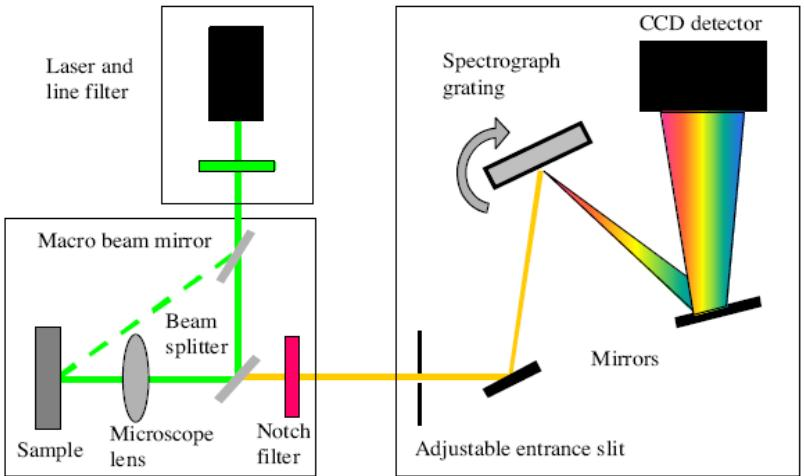

> 🧠 **[Cognis Multimodal Enrichment]**
> * **Classification:** Scientific Figure
> * **Extracted Text (OCR):** `Laser and line filter, Macro beam mirror, Beam splitter, Notch filter, Sample, Microscope lens, Spectrograph grating, CCD detector, Mirrors, Adjustable entrance slit`
> * **VLM Visual Summary:** ### FIGURE TYPE:
>   **Instrument Schematic**
>   
>   ### SCIENTIFIC PURPOSE:
>   This figure illustrates the experimental setup used in Raman spectroscopy, which is a technique used to study the vibrational and rotational transitions of molecules. The setup involves the interaction of a monochromatic laser beam with a sample, scattering of the light at specific angles, and detection of the scattered light to obtain the frequency spectrum of the scattered light.
>   
>   ### KEY KNOWLEDGE:
>   1. **Raman Scattering**: This is the phenomenon where light is scattered by molecules, resulting in the emission of scattered light at frequencies different from the incident light. This scattered light is known as Raman scattered light.
>   2. **Laser Source**: Typically, a polarized monochromatic light source (usually a laser) is used to excite the sample.
>   3. **Sample**: The sample is placed in the path of the laser beam.
>   4. **Beam Splitter**: Divides the incident laser beam into two beams.
>   5. **Microscope Lens**: Focuses the scattered light onto the entrance slit of the spectrometer.
>   6. **Notch Filter**: Removes unwanted wavelengths, allowing only the desired scattered light to pass through.
>   7. **Macro Beam Mirror**: Reflects the scattered light towards the spectrometer.
>   8. **Spectrograph Grating**: Disperses the scattered light into its constituent wavelengths.
>   9. **CCD Detector**: Captures the dispersed light, providing the frequency spectrum of the scattered light.
>   
>   ### LABEL INTERPRETATION:
>   - **Laser and Line Filter**: Laser source with a line filter to select a single wavelength.
>   - **Macro Beam Mirror**: Reflects the scattered light.
>   - **Beam Splitter**: Divides the incident laser beam.
>   - **Microscope Lens**: Focuses the scattered light.
>   - **Notch Filter**: Removes unwanted wavelengths.
>   - **Spectrograph Grating**: Disperses the scattered light.
>   - **CCD Detector**: Captures the dispersed light.
>   
>   ### ENGINEERING/SCIENTIFIC INSIGHTS:
>   A reader should learn that Raman spectroscopy provides detailed information about the vibrational and rotational states of molecules by analyzing the scattered light. The figure demonstrates how this information can be obtained using a well-designed experimental setup.
>   
>   ### USER-RELEVANT INFORMATION:
>   The information provided in the figure helps answer future questions by illustrating the key components and steps involved in performing a Raman spectroscopy experiment. Understanding the layout and function of each
> * **Figure Caption:** Theory: Monochromatic light incident on a transparent substance is transmitted with almost no attenuation. A small fraction of the light is scattered by the substance in all directions (though preferentially in the forward direction). The weakly scattered radiation contains photons at the incident frequency??0 (elastic or Rayleigh scattering), but also contains other frequencies such $\mathrm { a s } \nu _ { 0 } - \nu _ { i } ,$ where???? is the frequency of a molecular transition (typically rotational or vibrational) of the material. This inelastic light scattering is known as Raman scattering. In a typical Raman experiment, a polarized monochromatic light source (usually a laser) is focused into a sample, and the scattered light at $9 0 ^ { \circ }$ to the laser beam is collected and dispersed by a high-resolution monochromator. The incident laser wavelength (chosen such that the sample does not absorb, in ordinary Raman Spectroscopy) is fixed, and the scattered light is dispersed and detected to obtain the frequency spectrum of the scattered light. The scattered light is very weak. | [Section: EXPERIMENT NO. 5]
> * **Surrounding Context (+/- 300 words):**
>   * **[Before]:** *... colspan=1></td></tr><tr><td rowspan=1 colspan=1></td><td rowspan=1 colspan=1></td><td rowspan=1 colspan=1></td><td rowspan=1 colspan=1></td><td rowspan=1 colspan=1></td></tr></table> Table:2 Material properties data [Section: 3. Phase Transitions:] <table><tr><td rowspan=1 colspan=1>S.N.</td><td rowspan=1 colspan=1> Peak No.</td><td rowspan=1 colspan=1>Thermal stability</td><td rowspan=1 colspan=1>Purity</td><td rowspan=1 colspan=1> Phase transition(Y/N)</td><td rowspan=1 colspan=1>Enthalpy</td></tr><tr><td rowspan=1 colspan=1></td><td rowspan=1 colspan=1></td><td rowspan=1 colspan=1></td><td rowspan=1 colspan=1></td><td rowspan=1 colspan=1></td><td rowspan=1 colspan=1></td></tr><tr><td rowspan=1 colspan=1></td><td rowspan=1 colspan=1></td><td rowspan=1 colspan=1></td><td rowspan=1 colspan=1></td><td rowspan=1 colspan=1></td><td rowspan=1 colspan=1></td></tr><tr><td rowspan=1 colspan=1></td><td rowspan=1 colspan=1></td><td rowspan=1 colspan=1></td><td rowspan=1 colspan=1></td><td rowspan=1 colspan=1></td><td rowspan=1 colspan=1></td></tr><tr><td rowspan=1 colspan=1></td><td rowspan=1 colspan=1></td><td rowspan=1 colspan=1></td><td rowspan=1 colspan=1></td><td rowspan=1 colspan=1></td><td rowspan=1 colspan=1></td></tr><tr><td rowspan=1 colspan=1></td><td rowspan=1 colspan=1></td><td rowspan=1 colspan=1></td><td rowspan=1 colspan=1></td><td rowspan=1 colspan=1></td><td rowspan=1 colspan=1></td></tr></table> Analysis: Conclusion: [Section: EXPERIMENT NO. 5] Aim: To analyse Raman spectra and calculate the force constant of a given sample. Requirements: Raman spectroscopy instrument, Raman spectra. Theory: Monochromatic light incident on a transparent substance is transmitted with almost no attenuation. A small fraction of the light is scattered by the substance in all directions (though preferentially in the forward direction). The weakly scattered radiation contains photons at the incident frequency??0 (elastic or Rayleigh scattering), but also contains other frequencies such $\mathrm { a s } \nu _ { 0 } - \nu _ { i } ,$ where???? is the frequency of a molecular transition (typically rotational or vibrational) of the material. This inelastic light scattering is known as Raman scattering. In a typical Raman experiment, a polarized monochromatic light source (usually a laser) is focused into a sample, and the scattered light at $9 0 ^ { \circ }$ to the laser beam is collected and dispersed by a high-resolution monochromator. The incident laser wavelength (chosen such that the sample does not absorb, in ordinary Raman Spectroscopy) is fixed, and the scattered light is dispersed and detected to obtain the frequency spectrum of the scattered light. The scattered light is very weak.*
>   * **[After]:** *[Section: EXPERIMENT NO. 5] bond: Diatomic molecule may be considered as s simple vibrating harmonic oscillator. In such oscillator, the restoring force is proportional to the displacement of the atom from its original position (Hook’s law). According to Hook’s law, $$ { \mathrm { F } } \alpha X { \mathrm { O R ~ F } } = \ker X { \mathrm { O R ~ k } } = { \frac { F } { X } } { \mathrm { ~ w h e r e , ~ k } } = { \mathrm { f o r c e ~ c o n s t a n t } } = { \frac { R e s t o r i n g ~ f o r c e } { D i s p l a c e m e n t } } $$ The restoring force per unit displacement is called as force constant. It is related to the vibrational frequency by the equation. $$ \begin{array} { r } { \omega = \frac { 1 } { 2 \pi } \sqrt { \frac { k } { \mu } } \mathrm { O R } , \omega _ { o s c } ^ { 2 } = \frac { 1 } { 4 \pi ^ { 2 } } * \frac { k } { \mu } } \end{array} $$ Where, ?? = reduced mass = ??1??2 ??1+ ??2 $m _ { 1 } { = } \mathrm { m a s s }$ of one atom $m _ { 1 } = m a s s$ ???? ?????????????? ???????? $$ \omega _ { o s c } = C \overline { { \omega } } _ { o s c } ...*

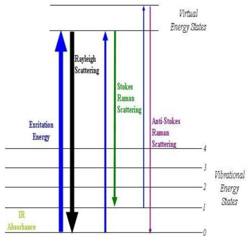

> 🧠 **[Cognis Multimodal Enrichment]**
> * **Classification:** Scientific Figure
> * **Extracted Text (OCR):** `Rayleigh Scattering, Stokes Raman Scattering, Anti-Stokes Raman Scattering, Excitation Energy, Virtual Energy States, IR Absorbance, Vibrational Energy States`
> * **VLM Visual Summary:** ### FIGURE TYPE:
>   - **Other**
>   
>   ### SCIENTIFIC PURPOSE:
>   This figure explains the principles of light scattering and Raman spectroscopy.
>   
>   ### KEY KNOWLEDGE:
>   1. **Rayleigh Scattering**: Occurs when light scatters elastically, meaning the scattered light has the same frequency as the incident light.
>   2. **Stokes Raman Scattering**: Occurs when light scatters inelastically, resulting in scattered light at frequencies higher than the incident light.
>   3. **Anti-Stokes Raman Scattering**: Occurs when light scatters inelastically, resulting in scattered light at frequencies lower than the incident light.
>   4. **Vibrational Energy States**: The energy levels of molecules can be excited by light, leading to various scattering processes.
>   5. **Excitation Energy**: The energy required to excite a molecule to a higher vibrational state.
>   6. **Virtual Energy States**: Higher vibrational states that can be excited by light.
>   
>   ### LABEL INTERPRETATION:
>   - **Excitation Energy**: The energy required to excite a molecule to a higher vibrational state.
>   - **Vibrational Energy States**: The energy levels of molecules that can be excited by light.
>   - **IR Absorbance**: The absorption of infrared light by a molecule.
>   - **Rayleigh Scattering**: Elastic scattering of light.
>   - **Stokes Raman Scattering**: Inelastic scattering of light.
>   - **Anti-Stokes Raman Scattering**: Inelastic scattering of light.
>   - **Vibrational Energy States**: The energy levels of molecules that can be excited by light.
>   
>   ### ENGINEERING/SCIENTIFIC INSIGHTS:
>   A reader should learn that light scattering is a fundamental phenomenon in physics and chemistry, with applications ranging from atmospheric science to materials science. Understanding the different types of scattering (Rayleigh, Stokes, Anti-Stokes) helps in interpreting the scattering patterns observed in various experiments, particularly in Raman spectroscopy.
>   
>   ### USER-RELEVANT INFORMATION:
>   The information about the different types of scattering (Rayleigh, Stokes, Anti-Stokes) and their corresponding energy states can help answer future questions about the mechanisms of light scattering and the interpretation of Raman spectra.
> * **Figure Caption:** Theory: Monochromatic light incident on a transparent substance is transmitted with almost no attenuation. A small fraction of the light is scattered by the substance in all directions (though preferentially in the forward direction). The weakly scattered radiation contains photons at the incident frequency??0 (elastic or Rayleigh scattering), but also contains other frequencies such $\mathrm { a s } \nu _ { 0 } - \nu _ { i } ,$ where???? is the frequency of a molecular transition (typically rotational or vibrational) of the material. This inelastic light scattering is known as Raman scattering. In a typical Raman experiment, a polarized monochromatic light source (usually a laser) is focused into a sample, and the scattered light at $9 0 ^ { \circ }$ to the laser beam is collected and dispersed by a high-resolution monochromator. The incident laser wavelength (chosen such that the sample does not absorb, in ordinary Raman Spectroscopy) is fixed, and the scattered light is dispersed and detected to obtain the frequency spectrum of the scattered light. The scattered light is very weak. | [Section: EXPERIMENT NO. 5]
> * **Surrounding Context (+/- 300 words):**
>   * **[Before]:** *... colspan=1></td></tr><tr><td rowspan=1 colspan=1></td><td rowspan=1 colspan=1></td><td rowspan=1 colspan=1></td><td rowspan=1 colspan=1></td><td rowspan=1 colspan=1></td></tr></table> Table:2 Material properties data [Section: 3. Phase Transitions:] <table><tr><td rowspan=1 colspan=1>S.N.</td><td rowspan=1 colspan=1> Peak No.</td><td rowspan=1 colspan=1>Thermal stability</td><td rowspan=1 colspan=1>Purity</td><td rowspan=1 colspan=1> Phase transition(Y/N)</td><td rowspan=1 colspan=1>Enthalpy</td></tr><tr><td rowspan=1 colspan=1></td><td rowspan=1 colspan=1></td><td rowspan=1 colspan=1></td><td rowspan=1 colspan=1></td><td rowspan=1 colspan=1></td><td rowspan=1 colspan=1></td></tr><tr><td rowspan=1 colspan=1></td><td rowspan=1 colspan=1></td><td rowspan=1 colspan=1></td><td rowspan=1 colspan=1></td><td rowspan=1 colspan=1></td><td rowspan=1 colspan=1></td></tr><tr><td rowspan=1 colspan=1></td><td rowspan=1 colspan=1></td><td rowspan=1 colspan=1></td><td rowspan=1 colspan=1></td><td rowspan=1 colspan=1></td><td rowspan=1 colspan=1></td></tr><tr><td rowspan=1 colspan=1></td><td rowspan=1 colspan=1></td><td rowspan=1 colspan=1></td><td rowspan=1 colspan=1></td><td rowspan=1 colspan=1></td><td rowspan=1 colspan=1></td></tr><tr><td rowspan=1 colspan=1></td><td rowspan=1 colspan=1></td><td rowspan=1 colspan=1></td><td rowspan=1 colspan=1></td><td rowspan=1 colspan=1></td><td rowspan=1 colspan=1></td></tr></table> Analysis: Conclusion: [Section: EXPERIMENT NO. 5] Aim: To analyse Raman spectra and calculate the force constant of a given sample. Requirements: Raman spectroscopy instrument, Raman spectra. Theory: Monochromatic light incident on a transparent substance is transmitted with almost no attenuation. A small fraction of the light is scattered by the substance in all directions (though preferentially in the forward direction). The weakly scattered radiation contains photons at the incident frequency??0 (elastic or Rayleigh scattering), but also contains other frequencies such $\mathrm { a s } \nu _ { 0 } - \nu _ { i } ,$ where???? is the frequency of a molecular transition (typically rotational or vibrational) of the material. This inelastic light scattering is known as Raman scattering. In a typical Raman experiment, a polarized monochromatic light source (usually a laser) is focused into a sample, and the scattered light at $9 0 ^ { \circ }$ to the laser beam is collected and dispersed by a high-resolution monochromator. The incident laser wavelength (chosen such that the sample does not absorb, in ordinary Raman Spectroscopy) is fixed, and the scattered light is dispersed and detected to obtain the frequency spectrum of the scattered light. The scattered light is very weak.*
>   * **[After]:** *[Section: EXPERIMENT NO. 5] bond: Diatomic molecule may be considered as s simple vibrating harmonic oscillator. In such oscillator, the restoring force is proportional to the displacement of the atom from its original position (Hook’s law). According to Hook’s law, $$ { \mathrm { F } } \alpha X { \mathrm { O R ~ F } } = \ker X { \mathrm { O R ~ k } } = { \frac { F } { X } } { \mathrm { ~ w h e r e , ~ k } } = { \mathrm { f o r c e ~ c o n s t a n t } } = { \frac { R e s t o r i n g ~ f o r c e } { D i s p l a c e m e n t } } $$ The restoring force per unit displacement is called as force constant. It is related to the vibrational frequency by the equation. $$ \begin{array} { r } { \omega = \frac { 1 } { 2 \pi } \sqrt { \frac { k } { \mu } } \mathrm { O R } , \omega _ { o s c } ^ { 2 } = \frac { 1 } { 4 \pi ^ { 2 } } * \frac { k } { \mu } } \end{array} $$ Where, ?? = reduced mass = ??1??2 ??1+ ??2 $m _ { 1 } { = } \mathrm { m a s s }$ of one atom $m _ { 1 } = m a s s$ ???? ?????????????? ???????? $$ \omega _ { o s c } = C \overline { { \omega } } _ { o s c } ...*

bond: Diatomic molecule may be considered as s simple vibrating harmonic oscillator. In such oscillator, the restoring force is proportional to the displacement of the atom from its original position (Hook’s law).

According to Hook’s law,

$$
{ \mathrm { F } } \alpha X { \mathrm { O R ~ F } } = \ker X { \mathrm { O R ~ k } } = { \frac { F } { X } } { \mathrm { ~ w h e r e , ~ k } } = { \mathrm { f o r c e ~ c o n s t a n t } } = { \frac { R e s t o r i n g ~ f o r c e } { D i s p l a c e m e n t } }
$$

The restoring force per unit displacement is called as force constant. It is related to the vibrational frequency by the equation.

$$
\begin{array} { r } { \omega = \frac { 1 } { 2 \pi } \sqrt { \frac { k } { \mu } } \mathrm { O R } , \omega _ { o s c } ^ { 2 } = \frac { 1 } { 4 \pi ^ { 2 } } * \frac { k } { \mu } } \end{array}
$$

Where, ?? = reduced mass = ??1??2   
??1+ ??2

$m _ { 1 } { = } \mathrm { m a s s }$ of one atom $m _ { 1 } = m a s s$ ???? ?????????????? ????????

$$
\omega _ { o s c } = C \overline { { \omega } } _ { o s c }
$$

$$
\mathrm { K } = 4 \pi ^ { 2 } \mu C ^ { 2 } { \overline { { \omega } } _ { o s c } } ^ { 2 }
$$

$\overline { { \omega } } _ { o s c } =$ vibrational frequency in term of wave number(in cm-1)

C =velocity of light.

Thus, if $\overline { { \omega } } _ { o s c }$ is known, the force constant of abond can be calculated.

The unit of k is dyne/cm. in CGS system while S.I. unt is newton/meter $( \mathrm { N m } ^ { - 1 } )$ .

## Procedure:

1.) Identify and characterize the internal coordinates used in each structure, implied atoms, number of occurrences in the primitive cell

2.) characteristic value (interatomic distance for stretching coordinates, angle for bending coordinates)

3.) Calculate value of the force constant from the data obtained from the internal coordinates and modes of vibration of the atoms.

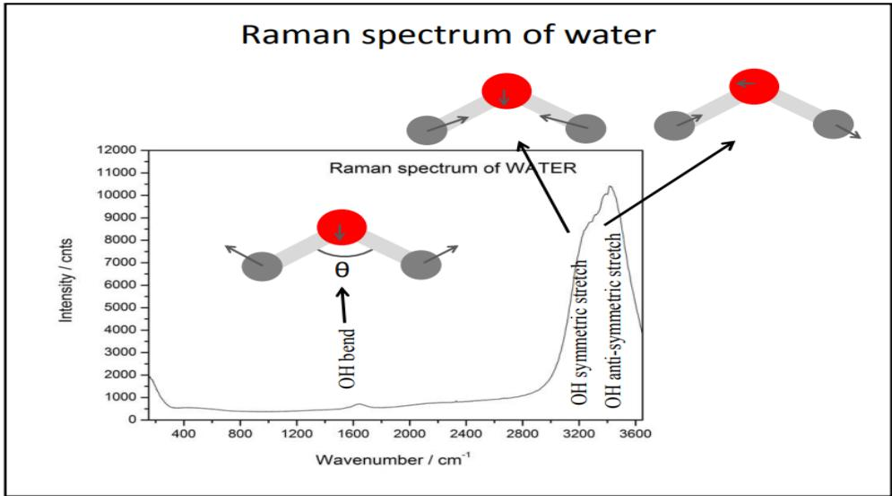

> 🧠 **[Cognis Multimodal Enrichment]**
> * **Classification:** Scientific Figure
> * **Extracted Text (OCR):** `Raman spectrum of water, Raman spectrum of WATER, OH bend, OH symmetric stretch, OH anti-symmetric stretch, 12000, 11000, 10000, 9000, 8000, 7000, 6000, 5000, 4000, 3000, 2000, 1000,`
> * **VLM Visual Summary:** ### FIGURE TYPE:
>   Data Plot/Graph
>   
>   ### SCIENTIFIC PURPOSE:
>   The figure illustrates the Raman spectrum of water, which is a graphical representation of the vibrational modes of the water molecule. It shows how different vibrational modes correspond to specific wavenumbers (cm^-1) and intensities (counts).
>   
>   ### KEY KNOWLEDGE:
>   1. **Vibrational Modes**: The figure highlights three main vibrational modes of the water molecule: OH bend, OH symmetric stretch, and OH anti-symmetric stretch.
>      - **OH Bend**: This mode occurs around 1600 cm^-1 and involves the bending motion of the hydrogen bond.
>      - **OH Symmetric Stretch**: This mode is observed at approximately 3500 cm^-1 and corresponds to the stretching of the O-H bond without rotation.
>      - **OH Anti-symmetric Stretch**: This mode is found at around 3700 cm^-1 and involves the stretching of the O-H bond with rotation.
>   
>   2. **Raman Spectra**: The intensity of the Raman signal increases with increasing wavenumber, showing the strength of the vibrational modes.
>   
>   3. **Wavenumber Range**: The wavenumber range shown covers from 400 to 3800 cm^-1, which is typical for the vibrational modes of water.
>   
>   ### LABEL INTERPRETATION:
>   - **Raman Spectrum of Water**: This label indicates that the graph represents the Raman spectrum of water.
>   - **Raman spectrum of WATER**: This label reinforces the identification of the spectrum being related to water.
>   - **θ**: This label likely refers to the angle associated with the OH bend mode, though its exact meaning is not specified in the text.
>   
>   ### ENGINEERING/SCIENTIFIC INSIGHTS:
>   A reader should learn that the Raman spectrum provides detailed information about the molecular vibrations of water, which can be used to study the dynamics of water molecules in various environments. Understanding these vibrational modes helps in interpreting the Raman spectra and gaining insights into the structural and dynamic properties of water.
>   
>   ### USER-RELEVANT INFORMATION:
>   The information from this figure could help answer future questions by providing a clear visualization of the vibrational modes of water, which is crucial for understanding the molecular dynamics and interactions involving water. This knowledge can be applied in fields such as chemistry, physics, and materials science to study water's behavior under different conditions.
> * **Figure Caption:** 3.) Calculate value of the force constant from the data obtained from the internal coordinates and modes of vibration of the atoms. | Figure:- Raman spectra of water molecule indicating various vibrational modes and stretching. Observations:
> * **Surrounding Context (+/- 300 words):**
>   * **[Before]:** *... equation. $$ \begin{array} { r } { \omega = \frac { 1 } { 2 \pi } \sqrt { \frac { k } { \mu } } \mathrm { O R } , \omega _ { o s c } ^ { 2 } = \frac { 1 } { 4 \pi ^ { 2 } } * \frac { k } { \mu } } \end{array} $$ Where, ?? = reduced mass = ??1??2 ??1+ ??2 $m _ { 1 } { = } \mathrm { m a s s }$ of one atom $m _ { 1 } = m a s s$ ???? ?????????????? ???????? $$ \omega _ { o s c } = C \overline { { \omega } } _ { o s c } $$ $$ \mathrm { K } = 4 \pi ^ { 2 } \mu C ^ { 2 } { \overline { { \omega } } _ { o s c } } ^ { 2 } $$ $\overline { { \omega } } _ { o s c } =$ vibrational frequency in term of wave number(in cm-1) C =velocity of light. Thus, if $\overline { { \omega } } _ { o s c }$ is known, the force constant of abond can be calculated. The unit of k is dyne/cm. in CGS system while S.I. unt is newton/meter $( \mathrm { N m } ^ { - 1 } )$ . [Section: Procedure:] 1.) Identify and characterize the internal coordinates used in each structure, implied atoms, number of occurrences in the primitive cell 2.) characteristic value (interatomic distance for stretching coordinates, angle for bending coordinates) 3.) Calculate value of the force constant from the data obtained from the internal coordinates and modes of vibration of the atoms.*
>   * **[After]:** *Figure:- Raman spectra of water molecule indicating various vibrational modes and stretching. Observations: Tabulate the data from the calculated values. <table><tr><td>Name</td><td>Atoms vibrational modes</td><td>Occurrences</td><td>Interatomic distances (Ao)</td><td>Force Constant $\mathbf { ( N c m ^ { - 1 } ) }$ </td></tr><tr><td></td><td></td><td></td><td></td><td></td></tr></table> Conclusions: Analysis: [Section: Experiment No. 6] Aim: Determination of band gap using Tauc’s plots for given UV-Visible spectra. Requirements: UV- Visible spectrum data of a sample. Theory:Ultraviolet- visible (UV-Vis) spectroscopy is an analytical technique that measures the amount of discrete wavelengths of UV or visible light that are absorbed by or transmitted through a sample in comparison to a reference (or blank) sample. The band gap energy of a semiconductor describes the energy needed to excite an electron from the valence band to the conduction band.In 1966 Tauc proposed a method of estimating the band gap energy of semiconductors using optical absorption spectra.The Tauc method is based on the assumption that the energy-dependent absorption coefficient (α) can be expressed by the following equation (1). $( \mathbf { a h v } ) ^ { \gamma } { = } \mathbf { A } ( \mathbf { h v - E _ { g } } )$ ..(1) Where α is the absorption coefficient h is the planks constant A is the proportionality constant $\mathbf { E _ { g } }$ is the band gap energy and γdenotes the nature of the electronic transitions γ=2 for direct allowed transitions γ=1/2 for indirect allowed transitions γ=2/3 for direct forbidden transition γ=1/3 for indirect forbidden transition Procedure:The determination of band gap energy by using Tauc’s plot 1. Plotting the value of (αhυ)γ with hυ [Section: Experiment No. 6] 2. Taking the extrapolation in the linear area across the energy axis in the corresponding graph 3. The intersection with energy-axis is the estimation ...*
  
Figure:- Raman spectra of water molecule indicating various vibrational modes and stretching. Observations:

Tabulate the data from the calculated values.

<table><tr><td>Name</td><td>Atoms vibrational modes</td><td>Occurrences</td><td>Interatomic distances (Ao)</td><td>Force Constant  $\mathbf { ( N c m ^ { - 1 } ) }$ </td></tr><tr><td></td><td></td><td></td><td></td><td></td></tr></table>

Conclusions:

Analysis:

## Experiment No. 6

Aim: Determination of band gap using Tauc’s plots for given UV-Visible spectra.

Requirements: UV- Visible spectrum data of a sample.

Theory:Ultraviolet- visible (UV-Vis) spectroscopy is an analytical technique that measures the amount of discrete wavelengths of UV or visible light that are absorbed by or transmitted through a sample in comparison to a reference (or blank) sample. The band gap energy of a semiconductor describes the energy needed to excite an electron from the valence band to the conduction band.In 1966 Tauc proposed a method of estimating the band gap energy of semiconductors using optical absorption spectra.The Tauc method is based on the assumption that the energy-dependent absorption coefficient (α) can be expressed by the following equation (1).

$( \mathbf { a h v } ) ^ { \gamma } { = } \mathbf { A } ( \mathbf { h v - E _ { g } } )$ ..(1)

Where α is the absorption coefficient   
h is the planks constant   
A is the proportionality constant   
$\mathbf { E _ { g } }$ is the band gap energy and   
γdenotes the nature of the electronic transitions   
γ=2 for direct allowed transitions   
γ=1/2 for indirect allowed transitions   
γ=2/3 for direct forbidden transition   
γ=1/3 for indirect forbidden transition

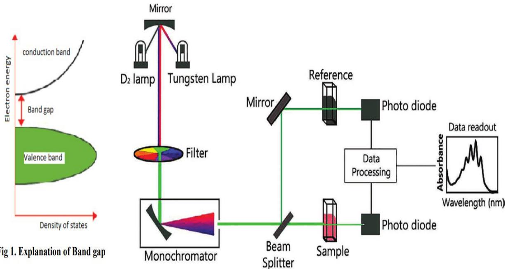

> 🧠 **[Cognis Multimodal Enrichment]**
> * **Classification:** Scientific Figure
> * **Extracted Text (OCR):** `D2 lamp,Tungsten Lamp,Mirror,Filter,Monochromator,Beam Splitter,Sample,Reference,Photo diode,Data Processing,Photo diode,Data readout,Absorbance,Wavelength(nm),Fig 1,Explanation of Band gap,Electron energy,conduction band,Band gap,Density of states,Valence band`
> * **VLM Visual Summary:** ### FIGURE TYPE:
>   **Instrument Schematic**
>   
>   ### SCIENTIFIC PURPOSE:
>   The figure explains the principle of determining the band gap energy using Tauc's plot in ultraviolet-visible (UV-Vis) spectroscopy.
>   
>   ### KEY KNOWLEDGE:
>   1. **Band Gap Energy**: The energy required to excite an electron from the valence band to the conduction band.
>   2. **Tauc's Equation**: $(\alpha h\nu)^{\gamma} = A(h\nu - E_{g})$, where $\alpha$ is the absorption coefficient, $h$ is Planck's constant, $A$ is a proportionality constant, $\nu$ is the frequency of the incident light, and $E_{g}$ is the band gap energy.
>   3. **Tauc's Method**: Based on the assumption that the energy-dependent absorption coefficient ($\alpha$) can be expressed by the above equation.
>   4. **Tauc's Plot**: A graphical representation where the absorbance ($\alpha h\nu$) is plotted against the energy ($h\nu$) to determine the band gap energy.
>   
>   ### LABEL INTERPRETATION:
>   - **D2 lamp**: A type of gas-discharge lamp used to produce ultraviolet light.
>   - **Tungsten Lamp**: A lamp used to produce visible light.
>   - **Filter**: Used to select specific wavelengths of light.
>   - **Monochromator**: A device that disperses light into its constituent wavelengths.
>   - **Beam Splitter**: Divides the light beam into two parts.
>   - **Sample**: The material being analyzed.
>   - **Reference**: A sample with known properties used for calibration.
>   - **Photo Diode**: A photodetector that converts light into electrical signals.
>   - **Data Processing**: The process of analyzing and interpreting the data collected from the experiment.
>   - **Absorbance**: The measure of how much light is absorbed by a substance.
>   - **Wavelength (nm)**: The distance between successive crests in a wave, measured in nanometers (nm).
>   
>   ### ENGINEERING/SCIENTIFIC INSIGHTS:
>   - Understanding the relationship between the absorption coefficient ($\alpha$), the energy of the incident light ($h\nu$), and the band gap energy ($E_{g}$) is crucial for determining the band gap of materials.
>   - The use of Tauc's plot allows for the calculation of the band gap energy from UV-Vis spectra, providing insights into the electronic
> * **Figure Caption:** γ=1/3 for indirect forbidden transition | Procedure:The determination of band gap energy by using Tauc’s plot
> * **Surrounding Context (+/- 300 words):**
>   * **[Before]:** *... in each structure, implied atoms, number of occurrences in the primitive cell 2.) characteristic value (interatomic distance for stretching coordinates, angle for bending coordinates) 3.) Calculate value of the force constant from the data obtained from the internal coordinates and modes of vibration of the atoms. Figure:- Raman spectra of water molecule indicating various vibrational modes and stretching. Observations: Tabulate the data from the calculated values. <table><tr><td>Name</td><td>Atoms vibrational modes</td><td>Occurrences</td><td>Interatomic distances (Ao)</td><td>Force Constant $\mathbf { ( N c m ^ { - 1 } ) }$ </td></tr><tr><td></td><td></td><td></td><td></td><td></td></tr></table> Conclusions: Analysis: [Section: Experiment No. 6] Aim: Determination of band gap using Tauc’s plots for given UV-Visible spectra. Requirements: UV- Visible spectrum data of a sample. Theory:Ultraviolet- visible (UV-Vis) spectroscopy is an analytical technique that measures the amount of discrete wavelengths of UV or visible light that are absorbed by or transmitted through a sample in comparison to a reference (or blank) sample. The band gap energy of a semiconductor describes the energy needed to excite an electron from the valence band to the conduction band.In 1966 Tauc proposed a method of estimating the band gap energy of semiconductors using optical absorption spectra.The Tauc method is based on the assumption that the energy-dependent absorption coefficient (α) can be expressed by the following equation (1). $( \mathbf { a h v } ) ^ { \gamma } { = } \mathbf { A } ( \mathbf { h v - E _ { g } } )$ ..(1) Where α is the absorption coefficient h is the planks constant A is the proportionality constant $\mathbf { E _ { g } }$ is the band gap energy and γdenotes the nature of the electronic transitions γ=2 for direct allowed transitions γ=1/2 for indirect allowed transitions γ=2/3 for direct forbidden transition γ=1/3 for indirect forbidden transition*
>   * **[After]:** *Procedure:The determination of band gap energy by using Tauc’s plot 1. Plotting the value of (αhυ)γ with hυ [Section: Experiment No. 6] 2. Taking the extrapolation in the linear area across the energy axis in the corresponding graph 3. The intersection with energy-axis is the estimation of the corresponding energy gap Calculations of α (absorption coefficient) and hυ (energy) 1. α can be estimated by using formula α=2.303×Absorbance (for liquid sample) and α=Absorbance/film thickness (for thin film sample) 2. Energy (hυ) can be calculated by using formula E= hυ=hc/λ=1240/ λ Observations: (1) Tabulate the experimental and calculated values in the table below. <table><tr><td rowspan=1 colspan=1>Wavelength (λ)</td><td rowspan=1 colspan=1>Absorbance (A)</td><td rowspan=1 colspan=1>Absorption coefficient(q)</td><td rowspan=1 colspan=1>Energy (hv)</td><td rowspan=1 colspan=1>(ahv)</td></tr><tr><td rowspan=1 colspan=1></td><td rowspan=1 colspan=1></td><td rowspan=1 colspan=1></td><td rowspan=1 colspan=1></td><td rowspan=1 colspan=1></td></tr><tr><td rowspan=1 colspan=1></td><td rowspan=1 colspan=1></td><td rowspan=1 colspan=1></td><td rowspan=1 colspan=1></td><td rowspan=1 colspan=1></td></tr><tr><td rowspan=1 colspan=1></td><td rowspan=1 colspan=1></td><td rowspan=1 colspan=1></td><td rowspan=1 colspan=1></td><td rowspan=1 colspan=1></td></tr><tr><td rowspan=1 colspan=1></td><td rowspan=1 colspan=1></td><td rowspan=1 colspan=1></td><td rowspan=1 colspan=1></td><td rowspan=1 colspan=1></td></tr></table> Analysis: Conclusions: [Section: Experiment No.-7] Aim: To analyse and calculate force constant from FTIR spectra. Requirements: FTIR instrument, FTIR spectra. Theory and procedure:IR spectroscopy is a very powerful method for the identification of functional groups. The most important regions of the IR spectrum are ${ > } 1 6 5 0 \ \mathrm { c m } ^ { - 1 }$ , whereas the fingerprint region $( 6 0 0 - 1 5 0 0 \mathrm { c m } ^ { - 1 } )$ of the spectrum cannot easily be used for identification of unknown compounds. Many references exist which tabulate the IR frequencies for various functional groups and organic compounds (a short table appears at the end of this section). However, the most valuable resource available to you for the interpretation of IR spectra is understanding the five basic ...*

Procedure:The determination of band gap energy by using Tauc’s plot

1. Plotting the value of (αhυ)γ with hυ

2. Taking the extrapolation in the linear area across the energy axis in the corresponding graph

3. The intersection with energy-axis is the estimation of the corresponding energy gap Calculations of α (absorption coefficient) and hυ (energy)

1. α can be estimated by using formula α=2.303×Absorbance (for liquid sample) and α=Absorbance/film thickness (for thin film sample)

2. Energy (hυ) can be calculated by using formula E= hυ=hc/λ=1240/ λ Observations:

(1) Tabulate the experimental and calculated values in the table below.

<table><tr><td rowspan=1 colspan=1>Wavelength (λ)</td><td rowspan=1 colspan=1>Absorbance (A)</td><td rowspan=1 colspan=1>Absorption   coefficient(q)</td><td rowspan=1 colspan=1>Energy (hv)</td><td rowspan=1 colspan=1>(ahv)</td></tr><tr><td rowspan=1 colspan=1></td><td rowspan=1 colspan=1></td><td rowspan=1 colspan=1></td><td rowspan=1 colspan=1></td><td rowspan=1 colspan=1></td></tr><tr><td rowspan=1 colspan=1></td><td rowspan=1 colspan=1></td><td rowspan=1 colspan=1></td><td rowspan=1 colspan=1></td><td rowspan=1 colspan=1></td></tr><tr><td rowspan=1 colspan=1></td><td rowspan=1 colspan=1></td><td rowspan=1 colspan=1></td><td rowspan=1 colspan=1></td><td rowspan=1 colspan=1></td></tr><tr><td rowspan=1 colspan=1></td><td rowspan=1 colspan=1></td><td rowspan=1 colspan=1></td><td rowspan=1 colspan=1></td><td rowspan=1 colspan=1></td></tr></table>

Analysis:

Conclusions:

## Experiment No.-7

Aim: To analyse and calculate force constant from FTIR spectra.

Requirements: FTIR instrument, FTIR spectra.

Theory and procedure:IR spectroscopy is a very powerful method for the identification of functional groups. The most important regions of the IR spectrum are ${ > } 1 6 5 0 \ \mathrm { c m } ^ { - 1 }$ , whereas the fingerprint region $( 6 0 0 - 1 5 0 0 \mathrm { c m } ^ { - 1 } )$ of the spectrum cannot easily be used for identification of unknown compounds. Many references exist which tabulate the IR frequencies for various functional groups and organic compounds (a short table appears at the end of this section). However, the most valuable resource available to you for the interpretation of IR spectra is understanding the five basic principles of IR spectroscopy. Transitions between vibrational energy levels follow the same equation as for a classical harmonic oscillator:

Equation for the Classical Harmonic Oscillator:

$$
\begin{array} { r } { \mathrm { v } = { \frac { 1 } { 2 P C } } { \sqrt { \frac { k } { \mu } } } , \ \mu = \mathrm { r e d u c e d ~ m a s s } = { \frac { m _ { 1 } m _ { 2 } } { m _ { 1 } + m _ { 2 } } } } \end{array}
$$

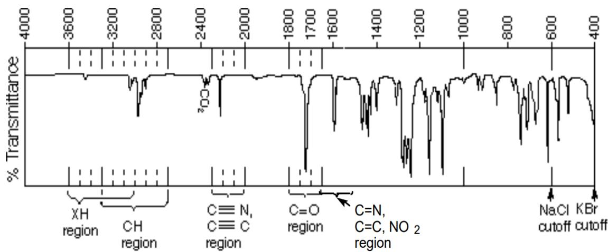

> 🧠 **[Cognis Multimodal Enrichment]**
> * **Classification:** Scientific Figure
> * **VLM Visual Summary:** ### FIGURE TYPE:
>   Data Plot/Graph
>   
>   ### SCIENTIFIC PURPOSE:
>   The figure explains the use of Fourier Transform Infrared (FTIR) spectroscopy to analyze and calculate force constants from infrared (IR) spectra. Specifically, it shows the absorption spectrum of a compound, highlighting key regions such as the XH, CH, C=C, C=N, and C=O regions, which correspond to different functional groups.
>   
>   ### KEY KNOWLEDGE:
>   1. **IR Spectroscopy**: IR spectroscopy is a powerful tool for identifying functional groups in molecules.
>   2. **Important Regions**:
>      - **XH Region**: Represents hydrogen bonding.
>      - **CH Region**: Represents carbon-hydrogen bonds.
>      - **C=C Region**: Represents double bonds.
>      - **C=N Region**: Represents nitrogen-containing groups.
>      - **C=O Region**: Represents carbonyl groups.
>   3. **Force Constant (k)**: Proportional to bond strength or bond order. Different carbonyl groups have varying force constants due to resonance structures.
>   4. **Reduced Mass (μ)**: Heavier atoms have slower vibrations and lower energy.
>   5. **Overtone Peaks**: Small peaks at slightly less than twice the normal frequency of a vibration, often corresponding to transitions involving multiple vibrational states.
>   
>   ### LABEL INTERPRETATION:
>   - **% Transmittance**: Represents the percentage of light transmitted through the sample.
>   - **Region Labels**: Indicate specific regions of the IR spectrum where certain functional groups are likely present.
>   - **Cutoff**: Indicates the limits of the spectrum, typically marked by NaCl and KBr filters.
>   
>   ### ENGINEERING/SCIENTIFIC INSIGHTS:
>   - **Understanding Vibrational Energy Levels**: The figure demonstrates how vibrational energy levels transition within a molecule, crucial for interpreting IR spectra.
>   - **Identification of Functional Groups**: By analyzing specific regions of the IR spectrum, one can identify the presence of particular functional groups in a compound.
>   - **Calculation of Force Constants**: The figure provides insights into how to calculate force constants from IR spectra, which is essential for understanding molecular dynamics and chemical bonding.
>   
>   ### USER-RELEVANT INFORMATION:
>   - **Key Regions**: Understanding the XH, CH, C=C, C=N, and C=O regions helps in identifying specific functional groups.
>   - **Force Constants**: The figure illustrates how force constants vary among different carbonyl groups, providing insight into their structural properties.
>   - **
> * **Figure Caption:** $$ | [Section: Experiment No.-7]
> * **Surrounding Context (+/- 300 words):**
>   * **[Before]:** *... colspan=1>Absorption coefficient(q)</td><td rowspan=1 colspan=1>Energy (hv)</td><td rowspan=1 colspan=1>(ahv)</td></tr><tr><td rowspan=1 colspan=1></td><td rowspan=1 colspan=1></td><td rowspan=1 colspan=1></td><td rowspan=1 colspan=1></td><td rowspan=1 colspan=1></td></tr><tr><td rowspan=1 colspan=1></td><td rowspan=1 colspan=1></td><td rowspan=1 colspan=1></td><td rowspan=1 colspan=1></td><td rowspan=1 colspan=1></td></tr><tr><td rowspan=1 colspan=1></td><td rowspan=1 colspan=1></td><td rowspan=1 colspan=1></td><td rowspan=1 colspan=1></td><td rowspan=1 colspan=1></td></tr><tr><td rowspan=1 colspan=1></td><td rowspan=1 colspan=1></td><td rowspan=1 colspan=1></td><td rowspan=1 colspan=1></td><td rowspan=1 colspan=1></td></tr></table> Analysis: Conclusions: [Section: Experiment No.-7] Aim: To analyse and calculate force constant from FTIR spectra. Requirements: FTIR instrument, FTIR spectra. Theory and procedure:IR spectroscopy is a very powerful method for the identification of functional groups. The most important regions of the IR spectrum are ${ > } 1 6 5 0 \ \mathrm { c m } ^ { - 1 }$ , whereas the fingerprint region $( 6 0 0 - 1 5 0 0 \mathrm { c m } ^ { - 1 } )$ of the spectrum cannot easily be used for identification of unknown compounds. Many references exist which tabulate the IR frequencies for various functional groups and organic compounds (a short table appears at the end of this section). However, the most valuable resource available to you for the interpretation of IR spectra is understanding the five basic principles of IR spectroscopy. Transitions between vibrational energy levels follow the same equation as for a classical harmonic oscillator: Equation for the Classical Harmonic Oscillator: $$ \begin{array} { r } { \mathrm { v } = { \frac { 1 } { 2 P C } } { \sqrt { \frac { k } { \mu } } } , \ \mu = \mathrm { r e d u c e d ~ m a s s } = { \frac { m _ { 1 } m _ { 2 } } { m _ { 1 } + m _ { 2 } } } } \end{array} $$*
>   * **[After]:** *[Section: Experiment No.-7] 1) k is the force constant: k is proportional to bond strength or bond order. C=O vibrates at a higher frequency than C-O. Furthermore, the change in the force constant of different carbonyl groups can be understood based on the contribution of resonance structures. The base value for the stretching frequency of a carbonyl (e.g., acetone) is $\nu _ { c o } \sim 1 7 1 5 \ \mathrm { c m } ^ { - 1 }$ Acid chlorides have bond order slightly greater than 2 because an acylium ion resonance structure may be drawn $( \nu _ { c o } \sim 1 8 0 0 \ \mathrm { c m } { - 1 } )$ . Alternatively, Phenyl ketones, vinyl ketones and amides have a CO bond order slightly less than 2 and display a lower energy $\nu _ { c o }$ 2) ??is the reduced mass: Heavier atoms slower vibration, lower energy. Compare C-O vs. H-O or H-O vs H-S. 3) Overtone Peaks: Notice in the above spectrum that a small peak is found at $3 4 5 0 ~ \mathrm { c m } ^ { - 1 }$ ， even though the compound does not contain any O-H or C-H bonds. This peak is the overtone of the C=O vibration $( \mathrm { a t ~ 1 7 3 5 ~ c m ^ { - 1 } } )$ . It corresponds to the transition from the ground vibrational state (n=0) to the second vibrationally excited state $- 5 - \ ( \mathrm { n } { = } 2 )$ rather than the first. Carbonyl overtones are always small and are easily found at slightly less than twice the normal C=O frequency. [Section: Experiment No.-7] 4) ...*

1) k is the force constant: k is proportional to bond strength or bond order. C=O vibrates at a higher frequency than C-O. Furthermore, the change in the force constant of different carbonyl groups can be understood based on the contribution of resonance structures. The base value for the stretching frequency of a carbonyl (e.g., acetone) is $\nu _ { c o } \sim 1 7 1 5 \ \mathrm { c m } ^ { - 1 }$ Acid chlorides have bond order slightly greater than 2 because an acylium ion resonance structure may be drawn $( \nu _ { c o } \sim 1 8 0 0 \ \mathrm { c m } { - 1 } )$ . Alternatively, Phenyl ketones, vinyl ketones and amides have a CO bond order slightly less than 2 and display a lower energy $\nu _ { c o }$

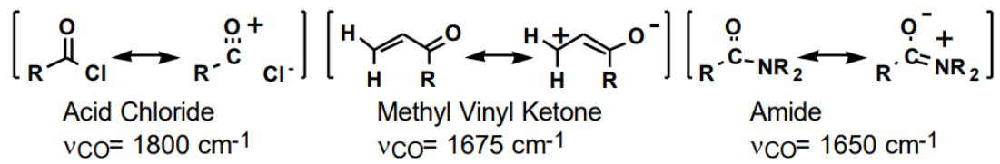

> 🧠 **[Cognis Multimodal Enrichment]**
> * **Classification:** Scientific Figure
> * **Extracted Text (OCR):** `Acid Chloride, vCO= 1800 cm-1, Methyl Vinyl Ketone, vCO= 1675 cm-1, Amide, vCO= 1650 cm-1`
> * **VLM Visual Summary:** ### FIGURE TYPE:
>   Other
>   
>   ### SCIENTIFIC PURPOSE:
>   The figure explains the relationship between the chemical structure of molecules containing a carbonyl group (C=O) and their infrared (IR) stretching frequencies.
>   
>   ### KEY KNOWLEDGE:
>   1. **Chemical Structures and Vibrational Frequencies**:
>      - **Acid Chloride**: The IR stretching frequency of an acid chloride is approximately 1800 cm⁻¹.
>      - **Methyl Vinyl Ketone**: The IR stretching frequency of methyl vinyl ketone is approximately 1675 cm⁻¹.
>      - **Amide**: The IR stretching frequency of an amide is approximately 1650 cm⁻¹.
>   
>   2. **Force Constant and Bond Order**:
>      - The force constant (k) is proportional to the bond strength or bond order. 
>      - For example, acid chlorides have a bond order slightly greater than 2 due to the presence of an acylium ion resonance structure, which results in a higher IR stretching frequency (1800 cm⁻¹).
>   
>   3. **Reduced Mass**:
>      - Heavier atoms result in slower vibrations and lower energy levels. 
>      - Comparisons include C-O vs. H-O or H-O vs H-S.
>   
>   4. **Overtone Peaks**:
>      - Overtones of the C=O vibration are observed at slightly less than twice the normal C=O frequency. 
>      - For instance, the overtone peak at 3450 cm⁻¹ corresponds to the transition from the ground vibrational state (n=0) to the second vibrationally excited state (n=2).
>   
>   5. **Dipole Moment**:
>      - The intensity of IR peaks is related to changes in dipole moment during vibration.
>      - Polar C=O bonds give very intense bands due to their greater electronegativity.
>   
>   ### LABEL INTERPRETATION:
>   - **k**: Force constant, proportional to bond strength or bond order.
>   - **Reduced Mass**: μ, the reduced mass, affects vibration frequency; heavier atoms slow down vibrations.
>   - **Overtone Peaks**: Small peaks at slightly less than twice the normal C=O frequency.
>   - **Dipole Moment**: Changes in dipole moment determine the intensity of IR peaks.
>   
>   ### ENGINEERING/SCIENTIFIC INSIGHTS:
>   - Understanding the chemical structure of molecules containing a carbonyl group helps predict their IR
> * **Figure Caption:** 1) k is the force constant: k is proportional to bond strength or bond order. C=O vibrates at a higher frequency than C-O. Furthermore, the change in the force constant of different carbonyl groups can be understood based on the contribution of resonance structures. The base value for the stretching frequency of a carbonyl (e.g., acetone) is $\nu _ { c o } \sim 1 7 1 5 \ \mathrm { c m } ^ { - 1 }$ Acid chlorides have bond order slightly greater than 2 because an acylium ion resonance structure may be drawn $( \nu _ { c o } \sim 1 8 0 0 \ \mathrm { c m } { - 1 } )$ . Alternatively, Phenyl ketones, vinyl ketones and amides have a CO bond order slightly less than 2 and display a lower energy $\nu _ { c o }$ | 2) ??is the reduced mass: Heavier atoms slower vibration, lower energy. Compare C-O vs. H-O or H-O vs H-S.
> * **Surrounding Context (+/- 300 words):**
>   * **[Before]:** *... the IR frequencies for various functional groups and organic compounds (a short table appears at the end of this section). However, the most valuable resource available to you for the interpretation of IR spectra is understanding the five basic principles of IR spectroscopy. Transitions between vibrational energy levels follow the same equation as for a classical harmonic oscillator: Equation for the Classical Harmonic Oscillator: $$ \begin{array} { r } { \mathrm { v } = { \frac { 1 } { 2 P C } } { \sqrt { \frac { k } { \mu } } } , \ \mu = \mathrm { r e d u c e d ~ m a s s } = { \frac { m _ { 1 } m _ { 2 } } { m _ { 1 } + m _ { 2 } } } } \end{array} $$ [Section: Experiment No.-7] 1) k is the force constant: k is proportional to bond strength or bond order. C=O vibrates at a higher frequency than C-O. Furthermore, the change in the force constant of different carbonyl groups can be understood based on the contribution of resonance structures. The base value for the stretching frequency of a carbonyl (e.g., acetone) is $\nu _ { c o } \sim 1 7 1 5 \ \mathrm { c m } ^ { - 1 }$ Acid chlorides have bond order slightly greater than 2 because an acylium ion resonance structure may be drawn $( \nu _ { c o } \sim 1 8 0 0 \ \mathrm { c m } { - 1 } )$ . Alternatively, Phenyl ketones, vinyl ketones and amides have a CO bond order slightly less than 2 and display a lower energy $\nu _ { c o }$*
>   * **[After]:** *2) ??is the reduced mass: Heavier atoms slower vibration, lower energy. Compare C-O vs. H-O or H-O vs H-S. 3) Overtone Peaks: Notice in the above spectrum that a small peak is found at $3 4 5 0 ~ \mathrm { c m } ^ { - 1 }$ ， even though the compound does not contain any O-H or C-H bonds. This peak is the overtone of the C=O vibration $( \mathrm { a t ~ 1 7 3 5 ~ c m ^ { - 1 } } )$ . It corresponds to the transition from the ground vibrational state (n=0) to the second vibrationally excited state $- 5 - \ ( \mathrm { n } { = } 2 )$ rather than the first. Carbonyl overtones are always small and are easily found at slightly less than twice the normal C=O frequency. [Section: Experiment No.-7] 4) Dipole moment: The strength of an IR peak is roughly dependent on the change in dipole moment during vibration. C=O bonds are very polar because of the greater electronegativity of oxygen and so give very intense bands. Also note that if a molecule is so symmetrical that the stretching of a bond does not produce any change in dipole moment, then no IR peak will be found in the spectrum. Compare the spectra of 1-butyne and 3-hexyne. 1-butyne shows an alkyne C-H stretch at 3280 cm-1 and an alkyne $\mathrm { C } \mathrm { = ~ \small ~ \underline { ~ } { ~ C ~ } ~ }$ stretch at $2 0 8 0 ~ \mathrm { { c m } ^ { - 1 } }$ . -hexyne shows no $\mathrm { C } \mathrm { = } \mathrm { ~ \underline { ~ } C }$ stretching ...*

2) ??is the reduced mass: Heavier atoms slower vibration, lower energy. Compare C-O vs. H-O or H-O vs H-S.

3) Overtone Peaks: Notice in the above spectrum that a small peak is found at $3 4 5 0 ~ \mathrm { c m } ^ { - 1 }$ ， even though the compound does not contain any O-H or C-H bonds. This peak is the overtone of the C=O vibration $( \mathrm { a t ~ 1 7 3 5 ~ c m ^ { - 1 } } )$ . It corresponds to the transition from the ground vibrational state (n=0) to the second vibrationally excited state $- 5 - \ ( \mathrm { n } { = } 2 )$ rather than the first. Carbonyl overtones are always small and are easily found at slightly less than twice the normal C=O frequency.

4) Dipole moment: The strength of an IR peak is roughly dependent on the change in dipole moment during vibration. C=O bonds are very polar because of the greater electronegativity of oxygen and so give very intense bands. Also note that if a molecule is so symmetrical that the stretching of a bond does not produce any change in dipole moment, then no IR peak will be found in the spectrum. Compare the spectra of 1-butyne and 3-hexyne. 1-butyne shows an alkyne C-H stretch at 3280 cm-1 and an alkyne $\mathrm { C } \mathrm { = ~ \small ~ \underline { ~ } { ~ C ~ } ~ }$ stretch at $2 0 8 0 ~ \mathrm { { c m } ^ { - 1 } }$ . -hexyne shows no $\mathrm { C } \mathrm { = } \mathrm { ~ \underline { ~ } C }$ stretching peak.

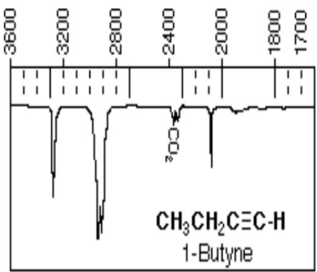

> 🧠 **[Cognis Multimodal Enrichment]**
> * **Classification:** Scientific Figure
> * **Extracted Text (OCR):** `CH3CH2C≡C-H, 1-Butyne`
> * **VLM Visual Summary:** ### FIGURE TYPE:
>   - **Data Plot/Graph**
>   
>   ### SCIENTIFIC PURPOSE:
>   The figure illustrates the infrared (IR) spectrum of 1-butyne, specifically highlighting its characteristic peaks corresponding to specific chemical bonds and vibrations.
>   
>   ### KEY KNOWLEDGE:
>   1. **Peak Locations**:
>      - **C-H Stretch**: At 3280 cm⁻¹
>      - **Alkyne C=C Stretch**: At 2080 cm⁻¹
>   
>   2. **Dipole Moment**:
>      - The strength of an IR peak is related to the change in dipole moment during vibration.
>      - Polar bonds like C=O give intense peaks.
>      - Symmetrical molecules do not show peaks for certain vibrations.
>   
>   3. **Vibrational Modes**:
>      - Vibrations of neighboring bonds can couple into symmetric and antisymmetric modes.
>      - Fermi coupling explains the observation of multiple peaks when a functional group's normal vibrational frequency coincides with a weak overtone peak of a neighboring bond.
>   
>   4. **Other Spectral Features**:
>      - **O-H and C-H Bonds**: Absence of peaks indicates no such bonds.
>      - **O-C=O Overtones**: Small peaks at 3450 cm⁻¹ correspond to the overtone of the C=O vibration.
>   
>   5. **Crystal Structure Visualization**:
>      - The figure provides detailed information about the vibrational modes and their frequencies.
>   
>   ### LABEL INTERPRETATION:
>   - **C-H Stretch**: Indicates the stretching vibration of the hydrogen atom bonded to the carbon atom.
>   - **Alkyne C=C Stretch**: Indicates the stretching vibration of the double bond between two carbon atoms in an alkyne.
>   
>   ### ENGINEERING/SCIENTIFIC INSIGHTS:
>   - Understanding the IR spectrum helps identify the functional groups and structural features of organic compounds.
>   - The presence or absence of specific peaks can provide insights into the molecular structure and bonding types.
>   
>   ### USER-RELEVANT INFORMATION:
>   - The specific peak locations (3280 cm⁻¹ and 2080 cm⁻¹) can be used to identify 1-butyne in spectroscopic analyses.
>   - The dipole moment concept helps in understanding why certain bonds give intense peaks and others do not.
>   - The vibrational modes and their couplings provide deeper insights into the molecular dynamics and interactions within the molecule.
> * **Figure Caption:** 4) Dipole moment: The strength of an IR peak is roughly dependent on the change in dipole moment during vibration. C=O bonds are very polar because of the greater electronegativity of oxygen and so give very intense bands. Also note that if a molecule is so symmetrical that the stretching of a bond does not produce any change in dipole moment, then no IR peak will be found in the spectrum. Compare the spectra of 1-butyne and 3-hexyne. 1-butyne shows an alkyne C-H stretch at 3280 cm-1 and an alkyne $\mathrm { C } \mathrm { = ~ \small ~ \underline { ~ } { ~ C ~ } ~ }$ stretch at $2 0 8 0 ~ \mathrm { { c m } ^ { - 1 } }$ . -hexyne shows no $\mathrm { C } \mathrm { = } \mathrm { ~ \underline { ~ } C }$ stretching peak. | [Section: Experiment No.-7]
> * **Surrounding Context (+/- 300 words):**
>   * **[Before]:** *... ??is the reduced mass: Heavier atoms slower vibration, lower energy. Compare C-O vs. H-O or H-O vs H-S. 3) Overtone Peaks: Notice in the above spectrum that a small peak is found at $3 4 5 0 ~ \mathrm { c m } ^ { - 1 }$ ， even though the compound does not contain any O-H or C-H bonds. This peak is the overtone of the C=O vibration $( \mathrm { a t ~ 1 7 3 5 ~ c m ^ { - 1 } } )$ . It corresponds to the transition from the ground vibrational state (n=0) to the second vibrationally excited state $- 5 - \ ( \mathrm { n } { = } 2 )$ rather than the first. Carbonyl overtones are always small and are easily found at slightly less than twice the normal C=O frequency. [Section: Experiment No.-7] 4) Dipole moment: The strength of an IR peak is roughly dependent on the change in dipole moment during vibration. C=O bonds are very polar because of the greater electronegativity of oxygen and so give very intense bands. Also note that if a molecule is so symmetrical that the stretching of a bond does not produce any change in dipole moment, then no IR peak will be found in the spectrum. Compare the spectra of 1-butyne and 3-hexyne. 1-butyne shows an alkyne C-H stretch at 3280 cm-1 and an alkyne $\mathrm { C } \mathrm { = ~ \small ~ \underline { ~ } { ~ C ~ } ~ }$ stretch at $2 0 8 0 ~ \mathrm { { c m } ^ { - 1 } }$ . -hexyne shows no $\mathrm { C } \mathrm { = } \mathrm { ~ \underline { ~ } C }$ stretching peak.*
>   * **[After]:** *[Section: Experiment No.-7] 5)Vibrational Modes. The vibrations of two neighboring bonds can be coupled into symmetric and antisymmetric vibrational modes. One example is the vibration of CH2 groups within an alkane (or the NH2 group of a primary amine). The symmetric stretch requires slightly more energy $( 2 9 2 5 ~ \mathrm { { c m } ^ { - 1 } ) }$ for a transition while an antisymmetric stretch requires slightly less energy $( 2 8 5 0 ~ \mathrm { c m ^ { - 1 } } )$ . For acetic anhydride, notice that although the two $\mathrm { C } { = } \mathrm { O }$ groups are identical by symmetry, two peaks are found in the C=O region of the IR spectrum. If a functional group's normal vibrational frequency happens to coincide in frequency with a weak overtone peak of a neighboring bond, then the peak will be observed as a Fermi doublet. In the case of aliphatic aldehydes, the aldehydic C-H stretching frequency at 2720 cm-1 couples with the overtone of the C-H bending transition at 1380 cm-1. Fermi coupling also explains the observation of two peaks near 2300 cm-1 in the spectrum of CO2. CHARACTERISTIC IR FREQUENCIES [Section: Experiment No.-7] <table><tr><td colspan="4"> XH Region (3600 cmr1 to 2400 cmr1)</td></tr><tr><td> $\overline { { \mathbf { c m } ^ { - 1 } } }$ </td><td></td><td>comments</td><td></td></tr><tr><td>3600</td><td>ν(free OH) Sharp peak</td><td colspan="2">Alcohol or Phenol free OH</td></tr><tr><td>3600-2800</td><td>v(H-bonded</td><td> Very Broad peak: Alcohol:</td><td>3400 to 3200 cm-1</td></tr><tr><td rowspan="3"></td><td rowspan="3">0H)</td><td rowspan="3">Phenol:</td><td>3600 to 3000 cm-1</td></tr><tr><td>Carboxylic Acid: 3600 to 2400 cm-1</td></tr><tr><td>Amines show broad peaks, Amides show sharp peaks</td></tr><tr><td colspan="2">3500-3300 ）v(NH)</td><td colspan="2">Primary Amines display two peaks $( \mathrm { v _ { s } }$ and $\nu _ { \mathrm { a s } } )$ </td></tr></table> <table><tr><td colspan="3">CH Region (3300 ...*

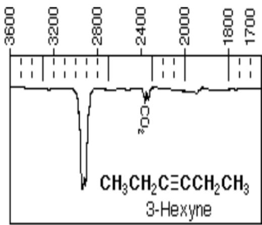

> 🧠 **[Cognis Multimodal Enrichment]**
> * **Classification:** Scientific Figure
> * **Extracted Text (OCR):** `CH3CH2C≡CCCH2CH3, 3-Hexyne`
> * **VLM Visual Summary:** ### FIGURE TYPE:
>   Data Plot/Graph
>   
>   ### SCIENTIFIC PURPOSE:
>   The figure illustrates the infrared (IR) spectrum of 3-hexyne, specifically focusing on the vibrational modes of its molecular structure. The spectrum provides detailed information about the different types of vibrations present in the molecule, such as stretching and bending vibrations.
>   
>   ### KEY KNOWLEDGE:
>   1. **Vibrational Modes**: The figure shows the different vibrational frequencies of the molecule, which correspond to specific modes of vibration.
>   2. **Symmetric and Antisymmetric Vibrations**: The symmetric and antisymmetric stretches of CH2 groups within the molecule are highlighted.
>   3. **C=O Group Vibrations**: The vibrations of the C=O groups in the molecule are shown, indicating their distinct frequencies.
>   4. **Fermi Doublets**: The presence of Fermi doublets in the spectrum due to the coupling of vibrational modes is explained.
>   5. **Normal Vibrational Frequencies**: The normal vibrational frequencies of the molecule are indicated, providing insight into the molecular structure.
>   
>   ### LABEL INTERPRETATION:
>   - **CH2 Groups**: The symmetric and antisymmetric stretches of CH2 groups are labeled.
>   - **C=O Groups**: The vibrations of the C=O groups are labeled.
>   - **Fermi Doublets**: The presence of Fermi doublets is noted.
>   
>   ### ENGINEERING/SCIENTIFIC INSIGHTS:
>   A reader should learn that the IR spectrum provides a detailed view of the molecular vibrations, which can be used to identify the molecule and understand its structural properties. The coupling of vibrational modes and the presence of Fermi doublets are key concepts that can help in interpreting complex molecular spectra.
>   
>   ### USER-RELEVANT INFORMATION:
>   The information from this figure can help answer future questions by providing a detailed understanding of the vibrational modes of 3-hexyne, which can be crucial for identifying the molecule and understanding its chemical properties.
> * **Figure Caption:** [Section: Experiment No.-7] | 5)Vibrational Modes. The vibrations of two neighboring bonds can be coupled into symmetric and antisymmetric vibrational modes. One example is the vibration of CH2 groups within an alkane (or the NH2 group of a primary amine). The symmetric stretch requires slightly more energy $( 2 9 2 5 ~ \mathrm { { c m } ^ { - 1 } ) }$ for a transition while an antisymmetric stretch requires slightly less energy $( 2 8 5 0 ~ \mathrm { c m ^ { - 1 } } )$ . For acetic anhydride, notice that although the two $\mathrm { C } { = } \mathrm { O }$ groups are identical by symmetry, two peaks are found in the C=O region of the IR spectrum.
> * **Surrounding Context (+/- 300 words):**
>   * **[Before]:** *... mass: Heavier atoms slower vibration, lower energy. Compare C-O vs. H-O or H-O vs H-S. 3) Overtone Peaks: Notice in the above spectrum that a small peak is found at $3 4 5 0 ~ \mathrm { c m } ^ { - 1 }$ ， even though the compound does not contain any O-H or C-H bonds. This peak is the overtone of the C=O vibration $( \mathrm { a t ~ 1 7 3 5 ~ c m ^ { - 1 } } )$ . It corresponds to the transition from the ground vibrational state (n=0) to the second vibrationally excited state $- 5 - \ ( \mathrm { n } { = } 2 )$ rather than the first. Carbonyl overtones are always small and are easily found at slightly less than twice the normal C=O frequency. [Section: Experiment No.-7] 4) Dipole moment: The strength of an IR peak is roughly dependent on the change in dipole moment during vibration. C=O bonds are very polar because of the greater electronegativity of oxygen and so give very intense bands. Also note that if a molecule is so symmetrical that the stretching of a bond does not produce any change in dipole moment, then no IR peak will be found in the spectrum. Compare the spectra of 1-butyne and 3-hexyne. 1-butyne shows an alkyne C-H stretch at 3280 cm-1 and an alkyne $\mathrm { C } \mathrm { = ~ \small ~ \underline { ~ } { ~ C ~ } ~ }$ stretch at $2 0 8 0 ~ \mathrm { { c m } ^ { - 1 } }$ . -hexyne shows no $\mathrm { C } \mathrm { = } \mathrm { ~ \underline { ~ } C }$ stretching peak. [Section: Experiment No.-7]*
>   * **[After]:** *5)Vibrational Modes. The vibrations of two neighboring bonds can be coupled into symmetric and antisymmetric vibrational modes. One example is the vibration of CH2 groups within an alkane (or the NH2 group of a primary amine). The symmetric stretch requires slightly more energy $( 2 9 2 5 ~ \mathrm { { c m } ^ { - 1 } ) }$ for a transition while an antisymmetric stretch requires slightly less energy $( 2 8 5 0 ~ \mathrm { c m ^ { - 1 } } )$ . For acetic anhydride, notice that although the two $\mathrm { C } { = } \mathrm { O }$ groups are identical by symmetry, two peaks are found in the C=O region of the IR spectrum. If a functional group's normal vibrational frequency happens to coincide in frequency with a weak overtone peak of a neighboring bond, then the peak will be observed as a Fermi doublet. In the case of aliphatic aldehydes, the aldehydic C-H stretching frequency at 2720 cm-1 couples with the overtone of the C-H bending transition at 1380 cm-1. Fermi coupling also explains the observation of two peaks near 2300 cm-1 in the spectrum of CO2. CHARACTERISTIC IR FREQUENCIES [Section: Experiment No.-7] <table><tr><td colspan="4"> XH Region (3600 cmr1 to 2400 cmr1)</td></tr><tr><td> $\overline { { \mathbf { c m } ^ { - 1 } } }$ </td><td></td><td>comments</td><td></td></tr><tr><td>3600</td><td>ν(free OH) Sharp peak</td><td colspan="2">Alcohol or Phenol free OH</td></tr><tr><td>3600-2800</td><td>v(H-bonded</td><td> Very Broad peak: Alcohol:</td><td>3400 to 3200 cm-1</td></tr><tr><td rowspan="3"></td><td rowspan="3">0H)</td><td rowspan="3">Phenol:</td><td>3600 to 3000 cm-1</td></tr><tr><td>Carboxylic Acid: 3600 to 2400 cm-1</td></tr><tr><td>Amines show broad peaks, Amides show sharp peaks</td></tr><tr><td colspan="2">3500-3300 ）v(NH)</td><td colspan="2">Primary Amines display two peaks $( \mathrm { v _ { s } }$ and $\nu _ { \mathrm { a s } } )$ </td></tr></table> <table><tr><td colspan="3">CH Region (3300 cmr1 to 2700 ...*
  
5)Vibrational Modes. The vibrations of two neighboring bonds can be coupled into symmetric and antisymmetric vibrational modes. One example is the vibration of CH2 groups within an alkane (or the NH2 group of a primary amine). The symmetric stretch requires slightly more energy $( 2 9 2 5 ~ \mathrm { { c m } ^ { - 1 } ) }$ for a transition while an antisymmetric stretch requires slightly less energy $( 2 8 5 0 ~ \mathrm { c m ^ { - 1 } } )$ . For acetic anhydride, notice that although the two $\mathrm { C } { = } \mathrm { O }$ groups are identical by symmetry, two peaks are found in the C=O region of the IR spectrum.

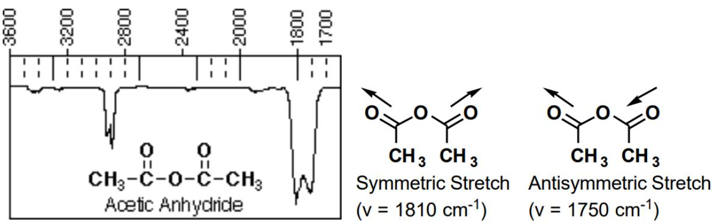

> 🧠 **[Cognis Multimodal Enrichment]**
> * **Classification:** Scientific Figure
> * **Extracted Text (OCR):** `Acetic Anhydride, Symmetric Stretch, Antisymmetric Stretch, v = 1810 cm^-1, v = 1750 cm^-1`
> * **VLM Visual Summary:** ### FIGURE TYPE:
>   - **Other**
>   
>   ### SCIENTIFIC PURPOSE:
>   The figure illustrates the infrared (IR) spectroscopy of acetic anhydride, specifically focusing on the vibrations of the carbonyl groups (C=O) within the molecule.
>   
>   ### KEY KNOWLEDGE:
>   1. **Vibrational Modes**: The vibrations of two neighboring bonds can be coupled into symmetric and antisymmetric vibrational modes.
>   2. **Symmetric Stretch**: Requires slightly more energy (2925 cm⁻¹) compared to the antisymmetric stretch (2850 cm⁻¹).
>   3. **Fermi Coupling**: When a functional group's normal vibrational frequency coincides with a weak overtone peak of a neighboring bond, the peak will appear as a Fermi doublet.
>   4. **IR Spectra**: The IR spectrum of acetic anhydride shows two peaks in the C=O region due to Fermi coupling between the symmetric and antisymmetric stretches of the two identical C=O groups.
>   
>   ### LABEL INTERPRETATION:
>   - **Symmetric Stretch**: The symmetric stretch of the C=O bond.
>   - **Antisymmetric Stretch**: The antisymmetric stretch of the C=O bond.
>   
>   ### ENGINEERING/SCIENTIFIC INSIGHTS:
>   A reader should learn that the IR spectrum provides detailed information about the molecular structure and functional groups present in a compound. The presence of two peaks in the C=O region indicates Fermi coupling, which helps in identifying the specific vibrational modes of the molecule.
>   
>   ### USER-RELEVANT INFORMATION:
>   - The normal vibrational frequencies of the C=O bond.
>   - The energy difference between symmetric and antisymmetric stretches.
>   - The presence of Fermi coupling in the IR spectrum.
>   - The identification of specific functional groups based on their characteristic vibrational frequencies.
> * **Figure Caption:** 5)Vibrational Modes. The vibrations of two neighboring bonds can be coupled into symmetric and antisymmetric vibrational modes. One example is the vibration of CH2 groups within an alkane (or the NH2 group of a primary amine). The symmetric stretch requires slightly more energy $( 2 9 2 5 ~ \mathrm { { c m } ^ { - 1 } ) }$ for a transition while an antisymmetric stretch requires slightly less energy $( 2 8 5 0 ~ \mathrm { c m ^ { - 1 } } )$ . For acetic anhydride, notice that although the two $\mathrm { C } { = } \mathrm { O }$ groups are identical by symmetry, two peaks are found in the C=O region of the IR spectrum. | If a functional group's normal vibrational frequency happens to coincide in frequency with a weak overtone peak of a neighboring bond, then the peak will be observed as a Fermi doublet. In the case of aliphatic aldehydes, the aldehydic C-H stretching frequency at 2720 cm-1 couples with the overtone of the C-H bending transition at 1380 cm-1. Fermi coupling also explains the observation of two peaks near 2300 cm-1 in the spectrum of CO2.
> * **Surrounding Context (+/- 300 words):**
>   * **[Before]:** *... small and are easily found at slightly less than twice the normal C=O frequency. [Section: Experiment No.-7] 4) Dipole moment: The strength of an IR peak is roughly dependent on the change in dipole moment during vibration. C=O bonds are very polar because of the greater electronegativity of oxygen and so give very intense bands. Also note that if a molecule is so symmetrical that the stretching of a bond does not produce any change in dipole moment, then no IR peak will be found in the spectrum. Compare the spectra of 1-butyne and 3-hexyne. 1-butyne shows an alkyne C-H stretch at 3280 cm-1 and an alkyne $\mathrm { C } \mathrm { = ~ \small ~ \underline { ~ } { ~ C ~ } ~ }$ stretch at $2 0 8 0 ~ \mathrm { { c m } ^ { - 1 } }$ . -hexyne shows no $\mathrm { C } \mathrm { = } \mathrm { ~ \underline { ~ } C }$ stretching peak. [Section: Experiment No.-7] 5)Vibrational Modes. The vibrations of two neighboring bonds can be coupled into symmetric and antisymmetric vibrational modes. One example is the vibration of CH2 groups within an alkane (or the NH2 group of a primary amine). The symmetric stretch requires slightly more energy $( 2 9 2 5 ~ \mathrm { { c m } ^ { - 1 } ) }$ for a transition while an antisymmetric stretch requires slightly less energy $( 2 8 5 0 ~ \mathrm { c m ^ { - 1 } } )$ . For acetic anhydride, notice that although the two $\mathrm { C } { = } \mathrm { O }$ groups are identical by symmetry, two peaks are found in the C=O region of the IR spectrum.*
>   * **[After]:** *If a functional group's normal vibrational frequency happens to coincide in frequency with a weak overtone peak of a neighboring bond, then the peak will be observed as a Fermi doublet. In the case of aliphatic aldehydes, the aldehydic C-H stretching frequency at 2720 cm-1 couples with the overtone of the C-H bending transition at 1380 cm-1. Fermi coupling also explains the observation of two peaks near 2300 cm-1 in the spectrum of CO2. CHARACTERISTIC IR FREQUENCIES [Section: Experiment No.-7] <table><tr><td colspan="4"> XH Region (3600 cmr1 to 2400 cmr1)</td></tr><tr><td> $\overline { { \mathbf { c m } ^ { - 1 } } }$ </td><td></td><td>comments</td><td></td></tr><tr><td>3600</td><td>ν(free OH) Sharp peak</td><td colspan="2">Alcohol or Phenol free OH</td></tr><tr><td>3600-2800</td><td>v(H-bonded</td><td> Very Broad peak: Alcohol:</td><td>3400 to 3200 cm-1</td></tr><tr><td rowspan="3"></td><td rowspan="3">0H)</td><td rowspan="3">Phenol:</td><td>3600 to 3000 cm-1</td></tr><tr><td>Carboxylic Acid: 3600 to 2400 cm-1</td></tr><tr><td>Amines show broad peaks, Amides show sharp peaks</td></tr><tr><td colspan="2">3500-3300 ）v(NH)</td><td colspan="2">Primary Amines display two peaks $( \mathrm { v _ { s } }$ and $\nu _ { \mathrm { a s } } )$ </td></tr></table> <table><tr><td colspan="3">CH Region (3300 cmr1 to 2700 cm-1)</td></tr><tr><td> $\mathbf { c m } ^ { - 1 }$ </td><td></td><td> comments</td></tr><tr><td>3300</td><td> Alkyne ν(CH)</td><td> strong, sharp</td></tr><tr><td></td><td>3150-3000 Alkene or Phenyl v(CH)</td><td> medium intensity</td></tr><tr><td>3050</td><td>Cyclopropane or Epoxide v(CH)</td><td>weak</td></tr><tr><td></td><td>2960,2870 Alkane v(CH)</td><td>vs(CH), vas(CH) observed for $\mathrm { C H } _ { 2 }$ or CH3 groups</td></tr><tr><td>2750</td><td>Aldehyde v(CH)</td><td> sharp, medium intensity</td></tr></table> [Section: Experiment No.-7] <table><tr><td colspan="4"> -C=N, -C=C-, &gt;C=C=C&lt; Region (2300 cmr1 to 2000 cmr1)</td></tr><tr><td> $\overline { { \mathbf { c m } ^ { - 1 } } }$ </td><td></td><td> comments</td><td></td></tr><tr><td>2250 2150</td><td>ν(-C=N) ν(RC=CH)</td><td colspan="2">sharp, weak to med intens, almost always observed sharp, weak to med intens, check for v(C-H) at 3300</td></tr><tr><td>2260-2190 v(R-C=C-R)s</td><td></td><td colspan="2">sharp, weak to med intens, obsd only for R,R&#x27; different</td></tr><tr><td colspan="4">1950 v(&gt;C=C=C&lt;) sharp, strong allene &gt;C=O Region (1800 cmr1 to 1650 cmr1)</td></tr><tr><td> $\mathbf { c m 1 }$ ...*
  
If a functional group's normal vibrational frequency happens to coincide in frequency with a weak overtone peak of a neighboring bond, then the peak will be observed as a Fermi doublet. In the case of aliphatic aldehydes, the aldehydic C-H stretching frequency at 2720 cm-1 couples with the overtone of the C-H bending transition at 1380 cm-1. Fermi coupling also explains the observation of two peaks near 2300 cm-1 in the spectrum of CO2.

CHARACTERISTIC IR FREQUENCIES
<table><tr><td colspan="4"> XH Region (3600 cmr1 to 2400 cmr1)</td></tr><tr><td> $\overline { { \mathbf { c m } ^ { - 1 } } }$ </td><td></td><td>comments</td><td></td></tr><tr><td>3600</td><td>ν(free OH) Sharp peak</td><td colspan="2">Alcohol or Phenol free OH</td></tr><tr><td>3600-2800</td><td>v(H-bonded</td><td> Very Broad peak: Alcohol:</td><td>3400 to 3200 cm-1</td></tr><tr><td rowspan="3"></td><td rowspan="3">0H)</td><td rowspan="3">Phenol:</td><td>3600 to 3000 cm-1</td></tr><tr><td>Carboxylic Acid: 3600 to 2400 cm-1</td></tr><tr><td>Amines show broad peaks, Amides show sharp peaks</td></tr><tr><td colspan="2">3500-3300 ）v(NH)</td><td colspan="2">Primary Amines display two peaks  $( \mathrm { v _ { s } }$  and  $\nu _ { \mathrm { a s } } )$ </td></tr></table>

<table><tr><td colspan="3">CH Region (3300 cmr1 to 2700 cm-1)</td></tr><tr><td> $\mathbf { c m } ^ { - 1 }$ </td><td></td><td> comments</td></tr><tr><td>3300</td><td> Alkyne ν(CH)</td><td> strong, sharp</td></tr><tr><td></td><td>3150-3000 Alkene or Phenyl v(CH)</td><td> medium intensity</td></tr><tr><td>3050</td><td>Cyclopropane or Epoxide v(CH)</td><td>weak</td></tr><tr><td></td><td>2960,2870 Alkane v(CH)</td><td>vs(CH), vas(CH) observed for  $\mathrm { C H } _ { 2 }$  or CH3 groups</td></tr><tr><td>2750</td><td>Aldehyde v(CH)</td><td> sharp, medium intensity</td></tr></table>

<table><tr><td colspan="4"> -C=N, -C=C-, &gt;C=C=C&lt; Region (2300 cmr1 to 2000 cmr1)</td></tr><tr><td> $\overline { { \mathbf { c m } ^ { - 1 } } }$ </td><td></td><td> comments</td><td></td></tr><tr><td>2250 2150</td><td>ν(-C=N) ν(RC=CH)</td><td colspan="2">sharp, weak to med intens, almost always observed sharp, weak to med intens, check for v(C-H) at 3300</td></tr><tr><td>2260-2190 v(R-C=C-R)s</td><td></td><td colspan="2">sharp, weak to med intens, obsd only for R,R&#x27; different</td></tr><tr><td colspan="4">1950 v(&gt;C=C=C&lt;) sharp, strong allene &gt;C=O Region (1800 cmr1 to 1650 cmr1)</td></tr><tr><td> $\mathbf { c m 1 }$ </td><td></td><td colspan="2">comments</td></tr><tr><td>1800</td><td> Acid Chloride</td><td> $| _ { R } ^ { 0 } | _ { c _ { 1 } } \xrightarrow [ ] { 0 } _ { R ^ { - } } \frac { 0 } { c } _ { a } ^ { + } = |$ </td><td>CO Bond Order &gt;2</td></tr><tr><td>1820,1760 Anhydride</td><td></td><td>two peaks are observed  $( \mathrm { v _ { s } \ v _ { a s } } )$ </td><td></td></tr><tr><td>1735</td><td>Ester</td><td> $\operatorname { R C O } 2 \operatorname { R } ^ { \prime }$ </td><td></td></tr><tr><td>1755</td><td>Carbonate</td><td> $\mathsf { R O C O } _ { 2 } \mathrm { R } ^ { \prime }$ </td><td></td></tr><tr><td>1735</td><td> Urethane</td><td> $\operatorname { R O C O N R } ^ { \prime } _ { 2 }$ </td><td></td></tr><tr><td>1720</td><td>e</td><td>Aldehyde/Ketonaldehyde has v(CH) at  $2 7 5 0 \mathrm { c m } ^ { - 1 }$ </td><td></td></tr><tr><td>1650</td><td>Amide</td><td> $[ \underset { R ^ { - } } { \overset { \circ } { \cdot } } \overset { \quad } \underset { \mathbb { N } \mathbb { R } _ { 2 } } { \longrightarrow } \overset { \quad \mathbb { O } ^ { - } } { \underset { \mathbb { R } ^ { - } } { \overset { \cdot } { \subset } } } \overset { \quad } \underset { \mathbb { N } \mathbb { R } _ { 2 } } { \longrightarrow } ]$ </td><td>CO Bond Order &lt;2</td></tr><tr><td>1630</td><td>Urea</td><td> $\mathrm { R } _ { 2 } \mathrm { N C O N R } ^ { \prime } { } _ { 2 }$ </td><td></td></tr><tr><td>C=N, C=C, NO2 Region (1660 cmr1 to 1500 cm-1)</td><td></td><td></td><td></td></tr><tr><td> $\overline { { \mathbf { c m } ^ { - 1 } } }$ </td><td></td><td></td><td></td></tr><tr><td></td><td></td><td> comments</td><td></td></tr><tr><td>1690-1640 v(C=N) 1660-1640 v(C=C)</td><td></td><td>weak to med intensity, sharp weak to med intensity, sharp</td><td></td></tr></table>

Conclusions:

Analysis:

## Experiment No. 8

Aim: To find the thickness of the thin films for a given set of samples from UV-Visible spectra.

Requirements: UV-Visible instrument and its spectra.

Theory: UV-Visible spectrometer measures the intensity of light passing through the sample (I) and compares it to the calibrated intensity $\left( \mathrm { I } _ { 0 } \right)$ . The ratio $\mathrm { I } / \mathrm { I } _ { 0 }$ is called the transmittance for a particular wavelength. The absorbance A is defined as,

$$
\mathbf { A } = - \mathbf { L o g } \left( \mathbf { I } / \mathbf { I _ { 0 } } \right)
$$

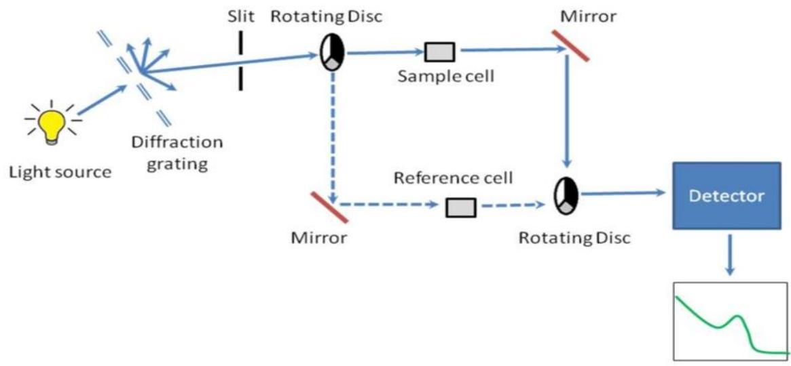

> 🧠 **[Cognis Multimodal Enrichment]**
> * **Classification:** Scientific Figure
> * **Extracted Text (OCR):** `Slit, Rotating Disc, Mirror, Light source, Diffraction grating, Sample cell, Reference cell, Detector, Rotating Disc`
> * **VLM Visual Summary:** ### FIGURE TYPE:
>   **Instrument Schematic**
>   
>   ### SCIENTIFIC PURPOSE:
>   This figure illustrates the schematic setup of a spectrophotometer, specifically designed for measuring the thickness of thin films using UV-Visible spectroscopy.
>   
>   ### KEY KNOWLEDGE:
>   1. **Light Source**: The light source emits monochromatic light that passes through the diffraction grating.
>   2. **Diffraction Grating**: The diffraction grating disperses the light into its constituent wavelengths.
>   3. **Slit**: The slit narrows the beam of light before it enters the sample cell.
>   4. **Sample Cell**: The sample cell contains the thin film whose thickness needs to be measured.
>   5. **Reference Cell**: The reference cell contains a standard solution with known properties to ensure accurate measurements.
>   6. **Mirror**: Mirrors reflect the light path, allowing the light to pass through both the sample and reference cells.
>   7. **Rotating Disc**: This component ensures that the sample and reference cells are exposed to the same light path at all times.
>   8. **Detector**: The detector measures the transmitted light intensity.
>   9. **Transmittance**: The ratio of the transmitted light intensity to the incident light intensity is used to calculate the absorbance.
>   10. **Absorbance**: Absorbance is calculated using the formula \( A = -\log(I/I_0) \), where \( I \) is the intensity of the coated sample and \( I_0 \) is the intensity of the plain glass plate.
>   
>   ### LABEL INTERPRETATION:
>   - **Light Source**: Uncertain (not explicitly labeled)
>   - **Diffraction Grating**: Uncertain (not explicitly labeled)
>   - **Slit**: Uncertain (not explicitly labeled)
>   - **Sample Cell**: Uncertain (not explicitly labeled)
>   - **Reference Cell**: Uncertain (not explicitly labeled)
>   - **Mirror**: Uncertain (not explicitly labeled)
>   - **Rotating Disc**: Uncertain (not explicitly labeled)
>   - **Detector**: Uncertain (not explicitly labeled)
>   
>   ### ENGINEERING/SCIENTIFIC INSIGHTS:
>   A reader should learn that this spectrophotometer uses the principle of UV-Visible spectroscopy to measure the thickness of thin films. The key insight is that the absorbance of the sample can be related to its thickness through the Beer-Lambert law, which states that the absorbance is proportional to the product of the concentration and the path length of the light through the sample.
>   
>   ###
> * **Figure Caption:** $$ | Thickness calculations:
> * **Surrounding Context (+/- 300 words):**
>   * **[Before]:** *... 5 0 \mathrm { c m } ^ { - 1 }$ </td><td></td></tr><tr><td>1650</td><td>Amide</td><td> $[ \underset { R ^ { - } } { \overset { \circ } { \cdot } } \overset { \quad } \underset { \mathbb { N } \mathbb { R } _ { 2 } } { \longrightarrow } \overset { \quad \mathbb { O } ^ { - } } { \underset { \mathbb { R } ^ { - } } { \overset { \cdot } { \subset } } } \overset { \quad } \underset { \mathbb { N } \mathbb { R } _ { 2 } } { \longrightarrow } ]$ </td><td>CO Bond Order &lt;2</td></tr><tr><td>1630</td><td>Urea</td><td> $\mathrm { R } _ { 2 } \mathrm { N C O N R } ^ { \prime } { } _ { 2 }$ </td><td></td></tr><tr><td>C=N, C=C, NO2 Region (1660 cmr1 to 1500 cm-1)</td><td></td><td></td><td></td></tr><tr><td> $\overline { { \mathbf { c m } ^ { - 1 } } }$ </td><td></td><td></td><td></td></tr><tr><td></td><td></td><td> comments</td><td></td></tr><tr><td>1690-1640 v(C=N) 1660-1640 v(C=C)</td><td></td><td>weak to med intensity, sharp weak to med intensity, sharp</td><td></td></tr></table> [Section: Experiment No.-7] Conclusions: Analysis: [Section: Experiment No. 8] Aim: To find the thickness of the thin films for a given set of samples from UV-Visible spectra. Requirements: UV-Visible instrument and its spectra. Theory: UV-Visible spectrometer measures the intensity of light passing through the sample (I) and compares it to the calibrated intensity $\left( \mathrm { I } _ { 0 } \right)$ . The ratio $\mathrm { I } / \mathrm { I } _ { 0 }$ is called the transmittance for a particular wavelength. The absorbance A is defined as, $$ \mathbf { A } = - \mathbf { L o g } \left( \mathbf { I } / \mathbf { I _ { 0 } } \right) $$*
>   * **[After]:** *Thickness calculations: Absorbance, $\mathbf { A } = - \mathbf { \Gamma } \mathbf { L o g } ( \mathbf { I } / \mathbf { I _ { 0 } } )$ $$ \mathbf { I } = \mathbf { \delta I _ { 0 } } e ^ { - t / \delta } $$ Where, $\mathrm { I } _ { 0 }$ = intensity of the glass plate, I = intensity of the coated glass sample, t = thickness of the sample, δ = skin depth of the material. $$ \delta = { \sqrt { \frac { \rho \lambda } { \pi c \mu } } } $$ Where, ?? =resistivity λ = wavelength c = velocity of light. µ = absolute magnetic permeability. Calculate thickness for 3 wavelengths for a given sample/slide and take the average of them. Procedure: 1. First turn on the switch provided back side of the device and leave it for 15 minutes for warm up. 2. Take air as reference. [Section: Experiment No. 8] 3. Scan plain glass plate sample and take the reading as $\mathrm { I } _ { 0 }$ . 4. Scan the coated sample and take the reading as I for your further calculation. Observations: Conclusions: Analysis: ...*

Thickness calculations:

Absorbance, $\mathbf { A } = - \mathbf { \Gamma } \mathbf { L o g } ( \mathbf { I } / \mathbf { I _ { 0 } } )$

$$
\mathbf { I } = \mathbf { \delta I _ { 0 } } e ^ { - t / \delta }
$$

Where, $\mathrm { I } _ { 0 }$ = intensity of the glass plate,

I = intensity of the coated glass sample,

t = thickness of the sample,

δ = skin depth of the material.

$$
\delta = { \sqrt { \frac { \rho \lambda } { \pi c \mu } } }
$$

Where,

?? =resistivity

λ = wavelength

c = velocity of light.

µ = absolute magnetic permeability.

Calculate thickness for 3 wavelengths for a given sample/slide and take the average of them.

Procedure:

1. First turn on the switch provided back side of the device and leave it for 15 minutes for warm up.

2. Take air as reference.

3. Scan plain glass plate sample and take the reading as $\mathrm { I } _ { 0 }$ .

4. Scan the coated sample and take the reading as I for your further calculation.

Observations:

Conclusions:

Analysis: