Welcome to this first edition of the Fazl Ali College Laboratory Operations Manual. The College is committed to maintaining a healthy and safe workplace for all laboratory workers, students and faculty. This SOP is an instruction necessary to understand the operation and therefore enable optimal use of the equipment during experiments, as well as a reference for good work practices and safe handling.

The information is meant to act as a guide for safe working procedures and a reference during practicals and research works. It does not, however, replace laboratory specific training and risk communication. If any additional information not covered in this manual is required, please contact the teachers before any operation.

# GENERAL LABORATORY SAFETY PROCEDURES

## DO

 Know the potential hazards of the materials used in the laboratory. Review the container label prior to using a chemical and the safety labels in instruments.

 Know the location of safety equipment such as emergency call numbers, emergency showers, eyewashes, fire extinguishers, fire alarms, first aid kits, and spill kits which can be found in the College.

 Review your laboratory’s emergency procedures with your teacher, Lab Supervisor, or Lab attendants to ensure that necessary supplies and equipment are available for responding to laboratory accidents.

 Practice good housekeeping to minimize unsafe work conditions such as obstructed exits and safety equipment, cluttered benches and hoods, and accumulated chemical waste.

 Wear the appropriate personal protective apparel for the chemicals you are working with. This includes eye protection, lab coat, gloves, and appropriate foot protection (no sandals or open toed shoes). Gloves must be made of a material known to be resistant to permeation by the chemical in use.

 Clothing is to be chosen so as to minimize exposed skin below the neck. Long pants and shirts with sleeves are examples of appropriate clothing. Avoid rolled up sleeves. Shorts (including cargo shorts), capris and, miniskirts are inappropriate clothing in laboratories. Synthetic fabrics must be avoided in high-hazard areas where flammable liquids and reactive chemicals are utilized.

 Contact lenses are not recommended but are permitted. Appropriate safety eyewear is still required for those that use contact lenses. Inform the lab supervisor of the use of contact lenses.

 Wash skin promptly if contacted by any chemical, regardless of corrosivity or toxicity.

 Label all new chemical containers with the “date received” and “date opened.”

 Label and store chemicals properly. All chemical containers must be labeled to identify the container contents (no abbreviations or formulas) and should identify hazard information. Chemicals must be stored by hazard groups and chemical compatibilities.

 Use break-resistant bottle carriers when transporting chemicals in glass containers that are greater than 500 milliliters. Use lab carts for multiple containers. Do not use unstable carts.

 Use fume hoods when processes or experiments may result in the release of toxic or flammable vapours, fumes, or dusts.

 Restrain and confine long hair and loose clothing. Pony tails and scarves used to control hair must not present a loose tail that could catch fire or get caught in moving parts of machinery.

## DON’T

 Eat, drink, chew gum, or apply cosmetics in rooms or laboratories where chemicals are used or stored.

 Store food in laboratory refrigerators, ice chests, cold rooms, or ovens.

 Drink water from laboratory water sources.

 Use laboratory glassware to prepare or consume food.

 Smell chemicals, taste chemicals, or pipette by mouth.

 Work alone in the laboratory without prior approval from the teacher. Avoid chemical work or hazardous activities during off-hours.

 Leave potentially hazardous experiments or operations unattended without prior approval from the Principal Investigator, Lab Manager, or Lab Supervisor. In such instances, the lights in the laboratory should be left on and emergency phone numbers posted at the laboratory entrance.

## SOP FOR VARIOUS INSTRUMENTS

## AUTOCLAVE

1. Inspect that the autoclave is not hot and all previous materials have been removed.

2. Make sure that the water inside the autoclave is at the optimal level.

3. All samples must be wrapped in appropriate material, plugged tightly with cotton plugs liquids in plastic container/bottles can be left little loose.

4. All containers and packaging must be made of autoclavable materials (such as grade 5 PP, given below)

## SPI Resin Recycling Codes

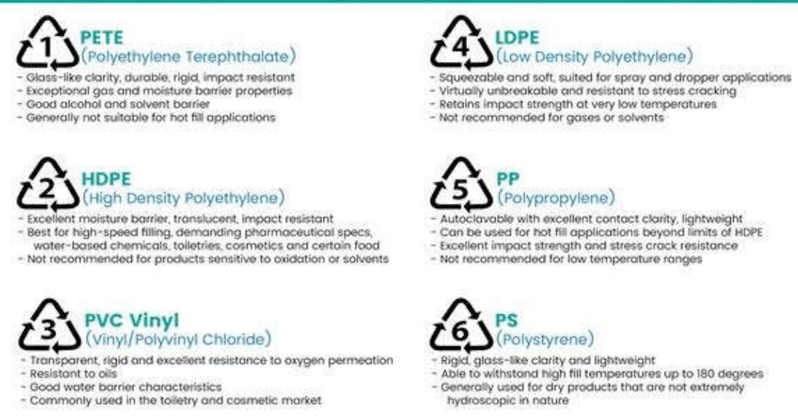

> 🧠 **[Cognis Multimodal Enrichment]**
> * **Classification:** Scientific Figure
> * **Extracted Text (OCR):** `PETE Polyethylene Terephthalate 1 Glass-like clarity, durable, rigid, impact resistant Exceptional gas and moisture barrier properties Good alcohol and solvent barrier Generally not suitable for hot fill applications LDPE Low Density Polyethylene 4 Squeezable and soft, suited for spray and dropper applications Virtually unbreakable and resistant to stress cracking Retains impact strength at very low temperatures Not recommended for gases or solvents HDPE High Density Polyethylene 2 Excellent moisture barrier, translucent`
> * **VLM Visual Summary:** ### FIGURE TYPE:
>   - **Safety Signage**
>   
>   ### SCIENTIFIC PURPOSE:
>   - **Understanding Resin Recycling Codes**
>   
>   ### KEY KNOWLEDGE:
>   1. **PETE (Polyethylene Terephthalate)**:
>      - Glass-like clarity
>      - Durable, rigid, and impact resistant
>      - Excellent gas and moisture barrier properties
>      - Good alcohol and solvent barrier
>      - Generally not suitable for hot fill applications
>   
>   2. **LDPE (Low Density Polyethylene)**:
>      - Squeezable and soft
>      - Suited for spray and dropper applications
>      - Virtually unbreakable and resistant to stress cracking
>      - Retains impact strength at very low temperatures
>      - Not recommended for gases or solvents
>   
>   3. **HDPE (High Density Polyethylene)**:
>      - Excellent moisture barrier
>      - Translucent
>      - Impact resistant
>      - Best for high-speed filling, demanding pharmaceutical specifications
>      - Water-based chemicals, toiletries, cosmetics, and certain food
>      - Not recommended for products sensitive to oxidation or solvents
>   
>   4. **PP (Polypropylene)**:
>      - Autoclavable with excellent contact clarity
>      - Lightweight
>      - Can be used for hot fill applications beyond limits of HDPE
>      - Excellent impact strength and stress crack resistance
>      - Not recommended for low temperature ranges
>   
>   5. **PVC Vinyl**:
>      - Transparent, rigid, and excellent resistance to oxygen permeation
>      - Resistant to oils
>      - Good water barrier characteristics
>      - Commonly used in the toiletry and cosmetic market
>   
>   6. **PS (Polystyrene)**:
>      - Rigid, glass-like clarity, and lightweight
>      - Able to withstand high fill temperatures up to 180 degrees Celsius
>      - Generally used for dry products that are not extremely hygroscopic in nature
>   
>   ### LABEL INTERPRETATION:
>   - **PETE**: Uncertain
>   - **LDPE**: Uncertain
>   - **HDPE**: Uncertain
>   - **PP**: Uncertain
>   - **PVC Vinyl**: Uncertain
>   - **PS**: Uncertain
>   
>   ### ENGINEERING/SCIENTIFIC INSIGHTS:
>   - This figure provides a comprehensive overview of different resin types, their properties, and suitability for various applications in packaging and manufacturing.
>   
>   ### USER-RELEVANT INFORMATION:
>   - The specific resin codes (1 through 6) and their
> * **Figure Caption:** [Section: GENERAL LABORATORY SAFETY PROCEDURES > SPI Resin Recycling Codes] | 5. Ensure that all pipes are tightly closed without leakage and lock the lid tightly.
> * **Surrounding Context (+/- 300 words):**
>   * **[Before]:** *... by hazard groups and chemical compatibilities.  Use break-resistant bottle carriers when transporting chemicals in glass containers that are greater than 500 milliliters. Use lab carts for multiple containers. Do not use unstable carts.  Use fume hoods when processes or experiments may result in the release of toxic or flammable vapours, fumes, or dusts.  Restrain and confine long hair and loose clothing. Pony tails and scarves used to control hair must not present a loose tail that could catch fire or get caught in moving parts of machinery. [Section: GENERAL LABORATORY SAFETY PROCEDURES > DON’T]  Eat, drink, chew gum, or apply cosmetics in rooms or laboratories where chemicals are used or stored.  Store food in laboratory refrigerators, ice chests, cold rooms, or ovens.  Drink water from laboratory water sources.  Use laboratory glassware to prepare or consume food.  Smell chemicals, taste chemicals, or pipette by mouth.  Work alone in the laboratory without prior approval from the teacher. Avoid chemical work or hazardous activities during off-hours.  Leave potentially hazardous experiments or operations unattended without prior approval from the Principal Investigator, Lab Manager, or Lab Supervisor. In such instances, the lights in the laboratory should be left on and emergency phone numbers posted at the laboratory entrance. [Section: GENERAL LABORATORY SAFETY PROCEDURES > AUTOCLAVE] 1. Inspect that the autoclave is not hot and all previous materials have been removed. 2. Make sure that the water inside the autoclave is at the optimal level. 3. All samples must be wrapped in appropriate material, plugged tightly with cotton plugs liquids in plastic container/bottles can be left little loose. 4. All containers and packaging must be made of autoclavable materials (such as grade 5 PP, given below) [Section: GENERAL LABORATORY SAFETY PROCEDURES > SPI Resin Recycling Codes]*
>   * **[After]:** *5. Ensure that all pipes are tightly closed without leakage and lock the lid tightly. 6. Switch on the power and allow the pressure to raise to the recommended level (normally @ 15ppi). 7. Leave the autoclave on for sterilization for 15-20 minutes at the recommended pressure. 8. Switch of the power and allow the autoclave to cool off. 9. Open only when the pressure is decreased to the minimum (Usually after 1 hour after switching off). 10. Open the lid slowly to let off any stores pressure. 11. Remove the autoclaved items wearing appropriate gloves and lab coats. 12. Ensure that the water level is at the optimum, fill in cold tap water if the water is less. 13. Close the lid and wipe off any water/substances on the autoclave. [Section: GENERAL LABORATORY SAFETY PROCEDURES > MICROSCOPY] 1. Ensure that all microscope are clean and wipe off any dirt or dust using a clean cloth. 2. Set the non electric based microscope mirror to let in optimal light to the objective lense. In electric microscope switch on the light and very slowly increase the light intensity (Abrupt increase in light intensity will cause the bulb filament to break) 3. Set the objective lense with the lowest magnification (usually 5X) 4. Use clean slides and clean the slide with a cloth for any excess stains or liquids before loading on the microscope. 5. Place the slide and observe the same by increasing the magnification as required. 6. After observing the slide, gradually decrease the light intensity of the bulb before switching off the microscope. Bring the focus with the objective lense with minimum magnification. 7. Clean the microscope with a clean cloth before leaving. [Section: GENERAL LABORATORY SAFETY PROCEDURES > 1) INSPECT THE OVEN] I. Make sure the electric power ...*

5. Ensure that all pipes are tightly closed without leakage and lock the lid tightly.

6. Switch on the power and allow the pressure to raise to the recommended level (normally @ 15ppi).

7. Leave the autoclave on for sterilization for 15-20 minutes at the recommended pressure.

8. Switch of the power and allow the autoclave to cool off.

9. Open only when the pressure is decreased to the minimum (Usually after 1 hour after switching off).

10. Open the lid slowly to let off any stores pressure.

11. Remove the autoclaved items wearing appropriate gloves and lab coats.

12. Ensure that the water level is at the optimum, fill in cold tap water if the water is less.

13. Close the lid and wipe off any water/substances on the autoclave.

## MICROSCOPY

1. Ensure that all microscope are clean and wipe off any dirt or dust using a clean cloth.

2. Set the non electric based microscope mirror to let in optimal light to the objective lense. In electric microscope switch on the light and very slowly increase the light intensity (Abrupt increase in light intensity will cause the bulb filament to break)

3. Set the objective lense with the lowest magnification (usually 5X)

4. Use clean slides and clean the slide with a cloth for any excess stains or liquids before loading on the microscope.

5. Place the slide and observe the same by increasing the magnification as required.

6. After observing the slide, gradually decrease the light intensity of the bulb before switching off the microscope. Bring the focus with the objective lense with minimum magnification.

7. Clean the microscope with a clean cloth before leaving.

## OVEN

## 1) INSPECT THE OVEN

I. Make sure the electric power connections are made correctly and that the power cable is not damaged.

II. Make sure that the area around the oven is clear. The oven should have 6 inches clearance around it.

III. Inspect the inside of the oven to make sure it is clean and that no one has left their samples or items in it.

## 2) START HEATING

I. Turn on the oven by pressing the main power switch in the lower right. the controller will perform a brief self test during which the display shows.

II. Press and hold the display buttons to increase and decrease the temperature as required.

## 3) LOAD THE SPECIMEN

I. Before you put anything in the oven make sure it is safe to heat this part to the desired temperature.

II. Make sure you have everything you are going to need i.e. safety equipments, tools etc.

III. Make sure there is a clear and safe place to put the part when you eventually take it out.

IV. Always use protective equipments such as gloves, aprons etc.

V. Open the oven store. The power to the heating elements is automatically turned off.

VI. Load your specimen. Make sure it is not touching the heating elements or electric short might occur when you close the door.

VII. Close the door.

VIII. Clean up the area around the oven and store the protective equipments.

4) REMOVING THE SPECIMEN

A. Always use protective equipments. Use what you think is appropriate for the material's temperature.

B. Open the oven store.

C. Remove your specimen carefully. Place it on a heat resistant surface.

D. Close the door.

E. Clean up the area around the oven and store the protective equipment properly.

5) FINISHING UP

A. Turn off the oven.

B. Clean up the area inside the oven.

C. Put all tools and protective equipments back in their proper places.

D. Remove your oven in use and displace of it.

## MICROTOME

1) Wind back the coarse feeding mechanism and lock the hand wheel.

2) Clamp cassette in position, orientating the tissue as desired.

3) Ensuring that the knife holder is at safe distance from the cassette, carefully place a blade into the holder and tighten securely.

4) Loosen back lever of knife holder and advance towards the cassette until there is a 0.2-   
0.5mm interval between blade edge and cassette surface.

5) Tighten back the lever of knife holder.

6) Unlock wheel and trim away surplus wax from tissue surface by advancing the coarse feed mechanism before commencing each turn of the wheel.

7) Trim all tissue carefully until the desired surface is exposed.

8) Reduce section thickness to 3-5 microns using adjustment knob.

9) Cut tissue sections and place them on tissue floatation bath to remove wax.

## HAEMOCYTOMETER

1. Clean haemocytometer & coverslip with 70 % ethanol, followed by distilled water.

2. Set up the haemocytometer ensuring the coverslip is resting on the raised supports & adhered to the haemocytometer.

3. Mix the cell suspension to suspend cells.

4. Transfer a small volume of cell suspension to each counting chamber using a Pasteur pipette.

5. Let the cells settle onto the counting chamber grid, about 5-10 min.

NOTE: PLACE THE HAEMOCYTOMETER ONTO THE MICROSCOPE STAGE & FOCUSSED ON LOW POWER (40X).

6. When counting the cells that fall on the grid lines , only count the cells on the TOP & RIGHT HAND LINES of each square.

NOTE: DONOT COUNT THE ONES ON THE BOTTOM OR LEFT-HAND LINES.

This prevents cells from being counted twice.

## SPECTROPHOTOMETER

1. Carefully clean the sample holder,especially after using corrosive or salt solution.

2. Mop up any spilt liquid and brush any spilt chemical from the spectrophotometer and adjacent areas.

3. Wash the cuvettes immediately after use.Rinse the cuvettes with deionised water atleast 3 times, allow them to drain and dry them inverted

## SAFETY CHECKS-

1. Check that electrical connections are fully coupled that cords are not frayed and that there is no liquid on or about the spectrophotometer. 2. Unidentified spilt chemicals should be removed with extreme caution.

## CENTRIFUGE

1. Connect the instrument to the electrical connection and switch on the light

2. Open using the level and clean the inside using a cloth.

3. Before using centrifuge check that the correct rotors are being used and the weight is balanced on both sides.

4. Place into terminal rings positioning balanced tubes opposite to one another.

5. Once tubes are in place and all rotor positions are filled. Close the lid of centrifuge tightly.

6. Set the desired time on timer.

7. Select appropriate speed and temperature setting on centrifuge with the speed selection knob. This simultaneously turns ON the centrifuge.

8. Once centrifuge is turned ON, lid must be kept closed.

9. Do not re-open it until it comes to a complete stop at end of run.

10. Then centrifuge has stopped. Carefully remove tubes without agitating contents.

11. Clean and then close the lid of centrifuge.

12. Properly dispose of any waste material disposable bin and clean up the area around the centrifuge.

## LAMINAR AIR FLOW

1. Before one hour of your work start the laminar air flow main power switch ON.

2. Then clean the platform of laminar air flow with 70% ethanol.

3. Close the door of laminar.

4. Now switch on the UV light of laminar air flow for at least 45-60 minutes.

5. After then wash your hand with any disinfectant to avoid contamination.

6. Switch off the UV light.

7. Start laminar air flow and open the door of laminar air flow.

8. Flame the burner and start your work.

9. After completion of your work. Wash your hands.

10. Clean the platform with 70% ethanol.

11. Close the door and switch off the power of laminar air flow.

## WEIGHING BALANCE

1. Clean your hand before using the Weighing Balance.

2. Clean the container & wipe Basic Weighing Function.

3. Turn on the balance scale.

4. Place container on balance.

5. Tare the Balance.

6. Place the sample in container & note down the weight.

7. After removing the sample, switch the balance off and clean the balance with a tissue paper or cloth before closing it.

8.

# GEL ELECTROPHORESIS

## Pre-Operation

1. Select a good location for the placement and use of the equipment. Place the unit on the laboratory bench in such a way that the power supply (on/off switch) is easy to reach, so it is not necessary to reach across the apparatus, and the power-indicator light is easily seen. Select a location where it will not be easily knocked over or tripped on. Avoid unintentional grounding points and conductors such as sinks, metal plates, jewellery, other metal objects or surfaces.

2. Inspect the apparatus to be used. Examine the insulation on the high voltage leads for signs of deterioration (e.g., exposed wires, cracks or breaks, etc.) Check the buffer tanks for cracks or leaks, and missing covers.

3. Ensure that all switches, lights, and all safety interlock features are in proper working condition and that “Danger-High Voltage” warning signs are in place on the power supply and buffer tanks.

4. Report any and all machine deficiencies prior to use and use only apparatuses in proper working condition.

5. Make sure adequate clearance is established around the apparatus. Never allow the leads to dangle below the laboratory bench.

6. Locate all emergency power source shut-off locations.

## Operation

1. Wear all appropriate personal protective equipment (gloves, laboratory coat, and eye protection).

2. Be aware that high voltage surges can occur when the apparatus is first turned on, even if the voltage is set to zero.

3. Changes in load, equipment failure, or power surges could raise the voltage at any time.

4. Make sure that the power is off before connecting the electrical leads. Connect both supply leads at the same time (to prevent one lead from being live in your hand) to the power supply before turning on the power supply. Otherwise, connect one lead at a time using one hand only.

5. Ensure that your gloved hands are dry while connecting leads. A thin film of moisture can act as a good conductor of electricity.

6. Always think and look before touching any part of the apparatus. Never touch any part of the apparatus while the power is “ON”, not even the plastic parts.

7. If the electrophoresis buffer (the conductive fluid) is spilled or is leaking from the gel box, stop the run, turn off the equipment, clean up the bench top and inspect the device immediately before proceeding.

8. Never open the gel box lid or reach inside the gel box until the power has been turned off. Do not rely on safety interlocks, as they may fail.

9. Do not override safety devices.

## Post-Operation

1. Turn off the main power supply switch and wait 15 seconds before removing the lid and/or making any disconnection or connections. This ensures proper time was allowed to ensure complete voltage discharge.

2. Properly dispose of the conductive fluid and gels.

## Hazards of Gels

1. Ethidium Bromide, commonly used to visualize nucleic acid, is a potent mutagen and should be handled with caution, even when mixed in the gel. Ethidium Bromide can be absorbed through the skin so it is also important to avoid any direct contact with the chemical.

2. Various catalysts, denaturants, stains and solubilizing agents contain a variety of chemicals, including formamide, phenol and acrylamide. This can result in unforeseen results. For example, a Canadian university analyzed agarose gels and found heavy metals, even though no metals or metal-containing reagents were used in the gel preparation. Presumably, the metals leached from the electrical contacts while the electrophoresis took place.

3. Acrylamide is a potent nerve toxin in its unpolymerized state and poses significant hazards. Although it is less toxic when polymerized, when making gels, the polymerization process is never fully complete and small amounts of acrylamide monomer are always present.

4. Handle gels with caution, wear gloves and wash hands often.

5. Measure, mix and handle all hazardous powdered chemicals or gel prep mixtures with hazardous components in the fume hood (e. g., acrylamide monomer, ethidium bromide, phenol, ammonium persulfate and formaldehyde).

6. Consider using ethidium bromide substitutes.

7. Always review the material safety data sheet and other sources of hazard information prior to working with any hazardous material.

## INCUBATOR

1. Hazards and risk associated with the use of incubator and precautions to be taken.

2. All containers/materials placed in incubator should be labelled with name, date and contents.

3. Containers/materials should be removed after the appropriate time of incubation to prevent overcrowding or contamination of the incubator.

4. Any spillage should be reported immediately to the laboratory technician/teacher and should be cleaned up in a manner appropriate to the material spilled.

5. Where temperature in excess of $3 7 0 ^ { \circ } \mathrm { C }$ are in use, appropriate gloves must be worn.

6. Any faults associated with an incubator should be reported immediately to the laboratory technician/teacher. If an incubator is faulty, it should be switched off until repaired.

7. Incubator should be subject to servicing based on manufacturers recommendations.

8. Any cuts/burns sustained should be dealt with by first aid personnel and reported.

Heat, electricity, chemicals, microorganisms, damaged containers

## Risks associated with the use of incubators

Microbial contamination of body, clothing. Burns to skin electrical shock Chemical contamination of body ,clothing.

People at risk when using incubators

Students, Academic Staff, Technicians.

## UV-TRANSILLUMINATOR

## General Safety Guidelines:

UV radiation can irreversibly damage the eyes and skin. You must take precautions by adhering to standard operating procedure (SOP) and using personal protective equipment (PPE) where applicable.

The use of UV in the laboratory is governed by ‘The control of Artificial Optical Radiation at Work Regulations 2010’, UV light emitted from a transilluminator has peak outputs at 254nm or 312nm – within biologically active UV-C and UV-B regions.

The following safety precautions are advised:

1. UV boxes should be kept in low occupancy areas, preferably in separate rooms.

2. Minimize contact time with the UV source.

3. Maximize distance by working at arms’ length and avoid stooping over the work surface.

4. Wear a full face shield designed for UV filtration (this is provided).

5. Wearing safety spectacles in addition to the full face shield improves protection and is recommended.

6. Wear a full button lab coat with neck protection and full sleeves.

7. Wear nitrile gloves at all times whilst UV light is in operation.

## Symptoms of UV over exposure:

Skin reddening, blistering and discomfort. A sandy, gritty feeling may be felt in the eyes.

## MAGNETIC STIRRER

## Maintenance and Usage Recommendations

1. Magnetic stirrer should be used on level surfaces.

2. If hazardous vapours will not be produced, hot plates should be in an area free of drafts to ensure heating efficiency.

3. Keep the top surface of the magnetic stirrer clean. Use a non-abrasive cleaner to clean the surface and the outside of the unit.

4. Replace the top surface if damage.

5. Maintain the instrument logbook, containing this SOP, temperature control record and/or maintenance repair logs, and associated instruction manuals in the immediate vicinity of the instrument.

## Magnetic Stirrer Operation

1. Stir bar should be placed in the sample vessel prior to mixing. Place the vessel on the stirrer so that it is centred. For stirrers with multiple stirring blocks, centre the sample vessel over a stirring block.

2. Turn the instrument on (refer to instruction manual for instrument-specific procedures).

3. Set the stirring speed (refer to instruction manual for instrument-specific procedures).

4. Note that the stirring speed will be affected by liquid viscosity, the size of the stir bar, vessel size, and thickness of vessel bottom.

5. When stirring is complete, turn magnetic stirrer off and remove sample.

## HOT PLATE

## Maintenance and Usage Recommendations

1. Hot plate should be used on level surfaces.

2. If hazardous vapours will not be produced, hot plates should be in an area free of drafts to ensure heating efficiency.

3. Keep the top surface of the hot plate clean. Use a non-abrasive cleaner to clean the surface and the outside of the unit.

4. Replace the top surface if damaged.

5. Do not use metal foil on hot plates.

6. Maintain the instrument logbook, containing this SOP, temperature control record and/or maintenance repair logs, and associated instruction manuals in the immediate vicinity of the instrument.

## Hot Plate Operation

1. Note that during initial operation of a hot plate, some odour and vapours may be produced from the heating element, which is normal.

2. Place the sample vessel on the hot plate so that it is centred, where practical. For hot plates with multiple heating elements, centre the vessel over a heating element, where practical.

3. Turn the instrument on and set the thermostat to the desired setting (as specified in the study plan). Refer to the instrument’s instruction manual for instrument specific procedures.

Allow around 10 minutes for hot plate and liquid temperatures to stabilize.

4. If necessary, adjust the temperature by adjusting the thermostat.

5. When heating is complete, turn the unit off.

## ROTARY SHAKER

## Pre-Analysis Checklist

1. Make sure you have your required safety equipment of glasses, closed toe shoes, gloves, and laboratory coat.

2. Check the machine for any previous samples left inside.

3. Remove any dust or other foreign objects from the incubator platform with a soft towel or cloth.

4. Make sure the machine is plugged in.

## Equipment Operation Loading the Shaker

1. Put your sample material in an acceptable container with a lid.

2. Gently press the container in one of the spring housings until it is securely in place.

## Shaker operation

1. Close the lid of the incubator and turn on the machine using the power switch to the right hand side. The LED display will momentarily show the model number. (NOTE: the shaker will not operate of the lid is open)

2. Once the machine is powered on, the incubator may start running. Pressing the start/stop button will cause the shaking to stop.

3. Press the select button until the RPM indicator is illuminated on the left hand side of the control panel.

4. Use the arrow keys to set the RPM of the shaker. A value from 50 to 400 RPM is available. The number will set when no buttons are pressed.

5. Press the select key until the ºC INDICATOR illuminates.

6. Set the temperature using the arrow keys. Temperature range is from 4º to 60ºC

7. Press the select key until the HRS INDICATOR is illuminated.

8. Use the arrow keys to set the TIME of the shaker. This can be a value from .1 to 99.9.

9. he number will set when no buttons are pressed. If a continuous run time is desired, simply press the start stop button.

10. Press the START/STOP key. The shaker will start in untimed mode.

11. Press the START/STOP key again. The shaker will stop and the display will read OFF.

12. Press the START/STOP key a third time; the time indicator will light and the shaker will now start the timed run.

13. The machine will come to a stop once the timed run has ended. If running in untimed mode, the START/STOP key can be pressed at any desired time.

## Machine Shutdown

1. Make sure the machine has come to a complete stop and open the lid.

2. Remove any samples you need. Use a hot glove if high temperatures were set.

3. Turn off the power by flipping the switch off.

SOME HAZARD WARNING ICONS DEFINITION
<table><tr><td colspan="1" rowspan="1">Laboratory WarningIcon</td><td colspan="1" rowspan="1">Icon definition</td></tr><tr><td colspan="1" rowspan="1">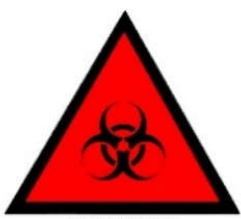BIOHAZARD</td><td colspan="1" rowspan="1">Indication of a biological agent, capable of self-replication,which presents or may present a hazard to the health or well-being of humans</td></tr><tr><td colspan="1" rowspan="1">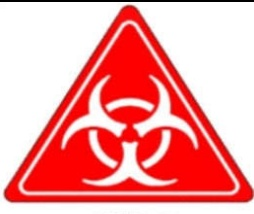BSL2Agent</td><td colspan="1" rowspan="1">The agent is a human blood borne pathogen or work withthe agent has been assigned to be handled in a BiosafetyLevel (BSL) 2 or ，BSL-3 ，or BSL-4 laboratory based ontheguidelines established in the CDC /NIH book"BiosafetyinMicrobiologicalandBiomedicalLaboratories'.</td></tr><tr><td colspan="1" rowspan="1">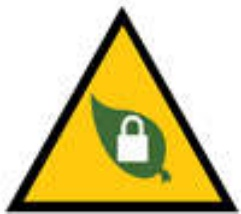</td><td colspan="1" rowspan="1">Researchers have an IBC protocol that specifies BL1-P orBL2-P containment. Researchers that work with transgenic plants.Main species are Arabidopsis thaliana, tobaccomaize,tomato,and grapevine.These are not necessary tothe only types of plants in use. Researchers who work withnon-exotic plant pathogens</td></tr><tr><td colspan="1" rowspan="1">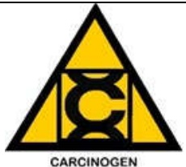</td><td colspan="1" rowspan="1">The material contains any amount of High or Extreme hazardchemical that can/are known to cause cancer.</td></tr><tr><td colspan="1" rowspan="1">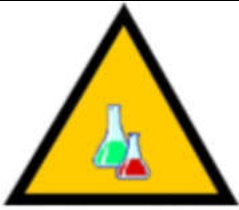CHEMICALUSE</td><td colspan="1" rowspan="1">Chemicals are used or stored in the room; this symbol istypically used in conjunction with one of the smaller hazardwarning icons</td></tr><tr><td colspan="1" rowspan="1">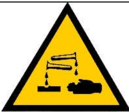CORROSIVEMATERIALS</td><td colspan="1" rowspan="1">Indication of presence of a corrosive material, thatisdefined as a solid caustic substance or a liquid which has a2 &lt;pH&lt;12.</td></tr><tr><td colspan="1" rowspan="1">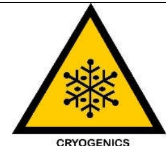</td><td colspan="1" rowspan="1"> Indication of Cryogenic materials which are liquefied gases that are kept in their liquid state at very low temperatures.These liquids have boiling points below -238F (-150C).</td></tr><tr><td colspan="1" rowspan="1">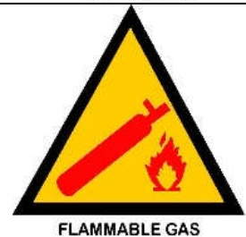</td><td colspan="1" rowspan="1">Indication of a flammable gas which is defined as any gasthat has a flash point below 100 F (37.8 C) with a container pressure of 40 psig at 100 °F.</td></tr><tr><td colspan="1" rowspan="1">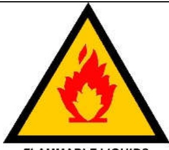FLAMMABLELIQUIDS</td><td colspan="1" rowspan="1">Indication of a flammable liquid which is defined as anyliquid that has a flash point below 1OO degrees Fahrenheit(F) or 37.8 degrees Centigrade (C)</td></tr><tr><td colspan="1" rowspan="1">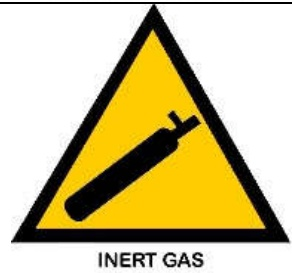</td><td colspan="1" rowspan="1">Indication of an inert gas which is a gas which does notundergo chemical reactions under a set of given conditions(generally, is non-reactive with other substances).</td></tr><tr><td colspan="1" rowspan="1">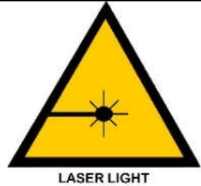</td><td colspan="1" rowspan="1">Indication of class 3B or 4 lasers as defined by ANSIStandard Z136.1.</td></tr><tr><td colspan="1" rowspan="1"></td><td colspan="1" rowspan="1">Indication of any sources that produce magnetic fields of0.5mT or greater (for both static fields and time varyingfields over 30kHz)</td></tr><tr><td colspan="1" rowspan="1"></td><td colspan="1" rowspan="1">Indication of unbound (not affixed to a surfaceor imbedded in a matrix) engineered nanomaterials that may pose occupational health risks by means of inhalation,ingestion or dermal exposure.Nanoparticles are defined as a material with at least onedimension, ranging between 1 to 100 nanometers in size.</td></tr><tr><td colspan="1" rowspan="1">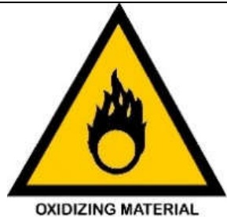</td><td colspan="1" rowspan="1">Indication of any oxidizer that is defined as a substance thatwill cause any increase in the burning rate of a combustiblematerial.</td></tr><tr><td colspan="1" rowspan="1">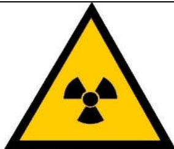RADIOACTIVEMATERIAL</td><td colspan="1" rowspan="1">Indication of any amount of radioactive material.</td></tr><tr><td colspan="1" rowspan="1"></td><td colspan="1" rowspan="1">Indication of any work involving recombinant DNA</td></tr><tr><td colspan="1" rowspan="1"></td><td colspan="1" rowspan="1">Indication of any amount of a toxic gas (inhalation 200 &lt;LC50 &lt; 200O ppm) or highly toxic gas (inhalation LC50 &lt;200 ppm).</td></tr><tr><td colspan="1" rowspan="1">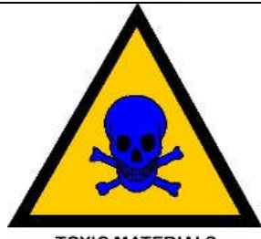TOXICMATERIALS</td><td colspan="1" rowspan="1">Indication of any toxic chemical which is a substance with an oral LD5O of less than 50 mg/kg or skin toxicity of lessthan 200 mg/kg</td></tr></table>

## References:

1.  (2016) Oregon State University pp1-4.

2.  Office of Environment, Health and Safety, Berkeley, University of California.

Compiled by:

P.Tiatemsu

Department of Botany

Fazl Ali College; Mokokchung

Nagaland