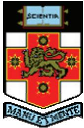

# Radiation Safety Guidelines for Use of X-ray Diffraction Units

X-ray Diffraction Laboratory Analytical Centre University of New South Wales

> 🧠 **[Cognis Multimodal Enrichment]**
> * **Classification:** Logo / Decorative Image (filtered out)

Emergency Contact

<table><tr><td rowspan=1 colspan=1>Radiation Safety Supervisor</td><td rowspan=1 colspan=1>Yu Wang (x54527)</td></tr><tr><td rowspan=1 colspan=1>Analytical Centre First Aid Officer</td><td rowspan=1 colspan=1></td></tr><tr><td rowspan=1 colspan=1>UNSW Radiation Safety Coordinator</td><td rowspan=1 colspan=1>Bob Armstrong (x52912)</td></tr><tr><td rowspan=1 colspan=1>UNSW Security</td><td rowspan=1 colspan=1>(x56666)</td></tr></table>

## Contents

Emergency Contact..   
1. Radiation Safety Legislation and Code of Practice 3   
1.1 Radiation Safety Legislation, Code of Practice and Rules . 3   
1.2 Radiation Licensing and Training 3   
1.3 Radiation Supervision. 4   
1.4 Risk Assessment 4   
1.5 Radiation Safety Information Board in XRD Laboratory 4   
2. Working with X-ray Diffraction Instruments. 5   
2.1 Characteristics of X-ray Radiation . 5   
2.2 Radiation monitoring and Permitted dose. 5   
2.3 Radiation Protection Features in XRD instrument 6   
2.4 Understanding Lab safety Features and Requirements 6   
2.5 Medical Requirements . 7   
Radiation Safety Rules for Use of XRD Instruments 8

## 1. Radiation Safety Legislation and Code of Practice

## 1.1 Radiation Safety Legislation, Code of Practice and Rules

Besides the general occupational health and safety (OHS） practice, working with sealed/unsealed radiation sources in NSW is regulated under the NSW Radiation Control Regulation (2003). Australian Standard 2234.4 - 1994 and Code of Practice for Protection Against Ionising Radiation Emitted from X-ray Analysis Equipment (1984). We have a statutory obligation to comply with the requirements and practices described in these documents. The documents can be access through UNsW Library's online services.

The University of New South Wales has developed its own radiation policy - “Radiation Safety Policy and Program - Part A Ionising Radiation". It is accessible from the UNSW web site (http://www.riskman.unsw.edu.au/ohs/radiationsafety.shtml). The policy clearly outlines the all practical requirements and responsibilities of those, who are working with radiation sources or supervising the use of radiation sources in UNSW. All XRD users must read this policy before starting their XRD work.

The X-ray diffraction laboratory in the Analytical Centre UNSW has fully complied with all of the above legislation, codes and policies. All users/operators have responsibility to follow these continuously.

## 1.2 Radiation Licensing and Training

All intending users of ionising radiation sources must first obtain a radiation licence from the Environment Protection Authority (EPA) (http://www.epa.nsw.gov.au/home.htm). This applies to most users. The licence will indicate the type of radiation sources to be permitted, where appropriate and conditions.

An exception to this rule is all users working with sealed radiation sources at a fixed location. In this case,a Licensing Exception Approval has to be provided in writing, identifying the student, the supervisor and the details of the work to be taken and any conditions associated with it. Using X-ray diffraction units, at X-ray diffraction laboratory, Analytical Centre UNSW, is licensing excepted.

All users (licensed and licensing excepted) must undertake a training program for radiation safety and instrument operation before they can use X-ray diffraction units in the XRD laboratory. Only qualified and licensed staff can provide this type of training. The training program must have appropriate record of trainer/trainee, date and associated. Trainee should obtain a copy of radiation guidelines (Management Document OO1/2007) and standard operating procedure for specified XRD unit.

## 1.3 Radiation Supervision

In the XRD laboratory, only qualified staff can provide radiation supervision. Their names have be displayed on the radiation safety information board in the lab.

The responsibilities of the Radiation Safety Supervisor include.

Obtain and maintain knowledge of the principles and practices of protection against radiation and of potential hazards;

·Training users for radiation safety and standard operation;

·Approving standard operating procedures;

·Approving student exception to access XRD units, and

Identifying local radiation risk areas.

In the school of Materials Science and Engineering, radiation safety supervisor is Dr. Yu Wang (x54527). UNSW radiation safety coordinator is Bob Armstrong (x52912). Any issue related to radiation safety must be passed to those people directly.

## 1.4 Risk Assessment

Before a new user can start his/her own XRD test, a risk assessment must be carried out. After that the user must fill the Risk assessment form and submit to the radiation safety supervisor and the safety officer at Analytical Centre.

## 1.5 Radiation Safety Information Board in XRD Laboratory

The Radiation Safety Information Board in the XRD Laboratory provides all information about radiation safety，which includes licenced staff names， student names under radiation licensing exception， radiation footprint， emergency evacuation procedure, incident reporting procedure and radiation legislation documents.

## 2. Working with X-ray Diffraction Instruments

## 2.1 Characteristics of X-ray Radiation

X-rays are a very energetic form of electromagnetic radiation that will ionise matter with which they interact, by ejecting electrons from their atoms. They are classified as sealed radiation sources， when devices or materials, which generate X-rays，have been permanently bonded or fixed in a capsule or tube to prevent release and dispersal of radiation under the most severe conditions,and unsealed radiation sources such as radioactive substances. The X-rays used in X-ray diffraction (XRD) unit is the sealed radiation sources which is enclosed in X-ray tube housing and produced only when they are energized.

X-ray radiation is harmful to the human body. A localised dose is sufficient to cause a severe radiation burn (human tissues are killed). Doses are also accumulated in the human body by long term exposed to radiation that produce irradiated cells. The hazards include an increased risk of leukaemia, cancer and genetic or hereditary effects.

Injury may occur to the operator and/or other personnel close to X-ray equipment due to exposure to a primary beam or leakage or scattered radiation.

X-ray's wavelength, used with XRD, is around 1 - 4 A. They are invisible to naked eye and strongly penetrative. However， they are generated by electric power. Once the electric power being cut off, X-rays will completely vanish and no radioactive contamination retains in the area, no radiation hazard exists.

Three major factors are considered in preventing radiation hazard - time, distance and shielding.

## 2.2 Radiation monitoring and Permitted dose

The IS measurement of X-ray intensity is the Sievert (Sv)， corresponding to the absorption of one joule in one kilogram of biological matter, taking into account the quality factor and other modifying factors.

The radiation monitor measures the radiation in terms of rate - μSv/hr (micro-Sievert per hour). Normal background radiation level in our XRD lab is on the order of O.2 -0.5 μSv/hr. At this rate, one would expect to receive maximum 0.5x 24 hr = 12 μSv of exposure per day or 0.5x24x365 = 4.38 mSv/year.

Standard limits of effective dose are 2O mSv/year for occupational and 1 mSv/year for general public. Although the standard prescribe limits on an annual basis, it is useful to ensure that doses received do not exceed lmSv/week. It should note that natural background radiation to which everybody is exposed from the environment is in an order of 2 mSv/year.

A radiation monitor is provided in the XRD laboratory. All users need to know how to use the monitor. The results from lab inspections show on the Radiation Safety Information Board.

## 2.3 Radiation Protection Features in XRD Instrument

All X-ray difraction instruments have equipped with many radiation protection features.   
Understanding of these features is the most important step to ensure radiation safety.

X-ray tube housing Each X-ray tube is enclosed in a tube housing that can not be fractured or deformed by normal use, accidental impact or misuse.

The tube housing shutter (X-ray beam stop) is placed close to the housing aperture so that to attenuate the radiation doses. The shutter is opened only when measurement starts.

X-ray energised warning indicator (light) indicates X-ray tube is in operation and X-ray are generated, but they could be enclosed in the tube housing only.

Shutter warning indicator If it is on, it indicates the shuter is opened. X-rays are in the working chamber. In this case no one is allowed to open the door of chamber.

Interlocks Many microswitches are fit on each XRD system to ensure that the sample chamber has been properly enclosed before shutter opens. Any attempt to open the chamber, when the shutter is opened, will lead to system de-energised immediately.

Sample chamber It houses the test samples and prevents accessing the primary X-ray beams. The chamber is constructed of appropriate materials to attenuate Xray radiation during measurement.

## 2.4 Understanding Lab safety Features and Requirements

Push-off button (Red Push Button) each XRD unit has a push-off button to shut down electric power. They are all labeled with red “Power Off’ whatever its location and type. Users should know its location and push it in emergency case.

It can only be used in case of emergency.

Service/disruption Notice (Yellow Note) A yellow note is stored in the operating procedure folder of each unit. When user finds a problem of operation or safety, please shut down the unit, put the note in front of the unit and then inform lab safety supervisor.

When user find a yellow note has been placed to a XRD unit, don't use that unit until a school technical staff takes it off.

Users are not allowed to do any repair， adjustment or modification of XRD hardware. Anyone, who tries to do so, will be dismissed from use XRDs in the laboratory.

Safe Samples To maintain a safe environment of the lab, the safety supervisor may ask users to provide certain information of their samples. Users should insure that their samples are safety samples, which means that to performing a XRD test will not lead to pollute or contaminate the lab.

User must report to safety supervisor if their samples may contain radioactive substances, nano-powders, something which may produce toxic gases under the low heat, or lead to contaminate instrument. Without taking necessary precautions, user can not perform any test to those samples.

The lab can not be used as sample preparation room and not store any type of samples.

## 2.5 Medical Requirements

The operator or any other person involved in the use of XRD equipment should undergo a medical examination following any known or suspected occasion when the person has been exposed to a primary beam from XRD equipment.

## Radiation Safety Rules for Use of XRD Instruments

1.1 Check the placard on the door to know main potential hazards, the personal protective equipment to be worn and the names and phone numbers of the persons to be contacted for emergencies.

1.2 No person is permitted to operate XRD equipment unless they have taken training of radiation safety and operating procedures, and done risk assessment. All users must follow the standard operating procedure to use XRD unit.

1.3 Check “Service/Disruption Notice” (Yellow note). If one has been placed to a XRD unit, don't use that instrument until technical staff takes it out.

1.4 Check shutter indicator before opening the door of sample chamber. If the indicator lights on, don't open the door of chamber at any circumstance.

Shutter indicator lights on is to say there are X-ray in the chamber.

1.5 Turn off the equipment immediately when potentially hazardous situations occur arising from X-ray beam, due to any reason. Report to the radiation safety supervisor any actual or suspected case of radiation exposure.

In the case of a building emergency, switch off the equipment completely before leaving the laboratory.

1.6 In the case of radiation exposure incident, you must follow “Hazard and Incident Reporting and Investigation Procedure” on the radiation safety information board or http://www.riskman.unsw.edu.au/ohs/hazard.shtml.

1.7 Recording your usage time, with actual operator's name (not research group), in the specific XRD logbook after use.