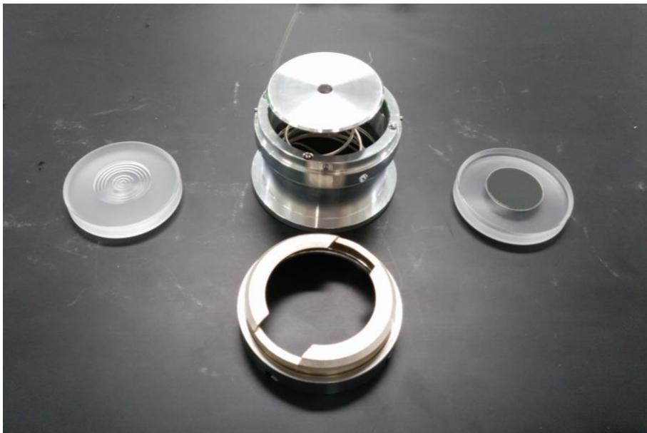
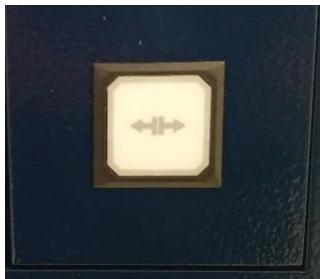
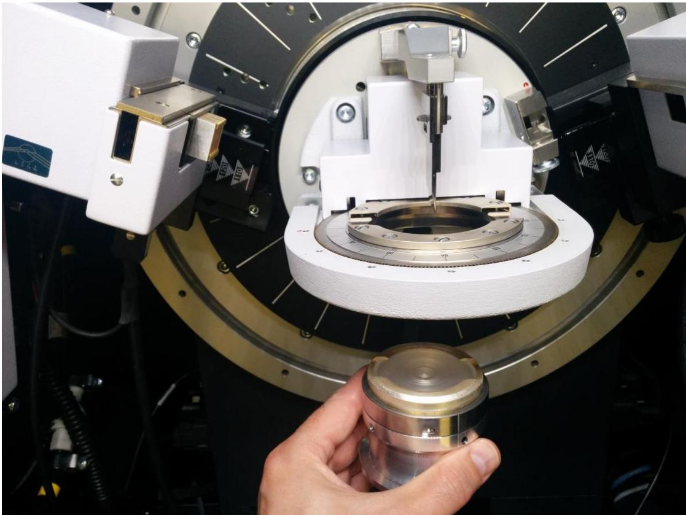
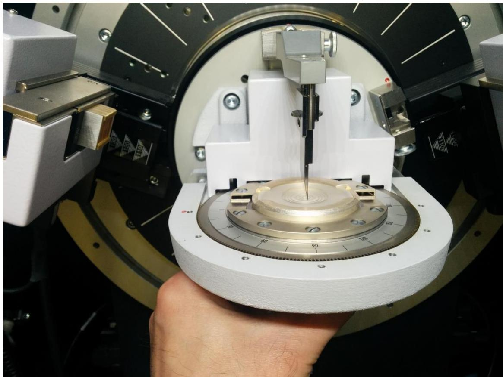
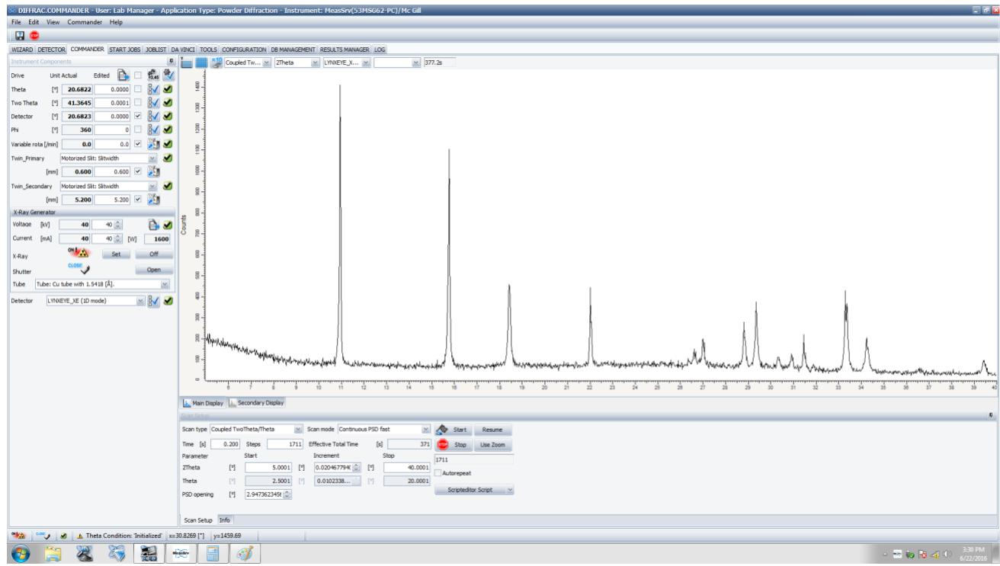
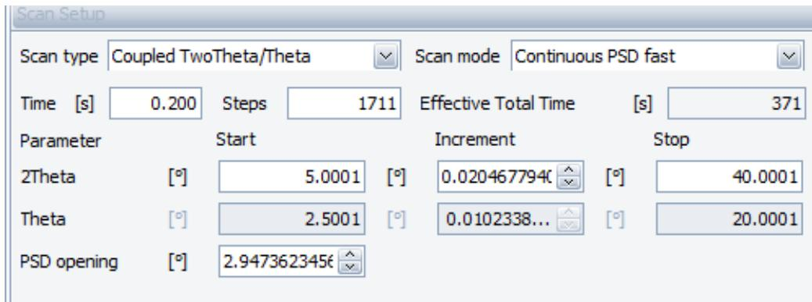
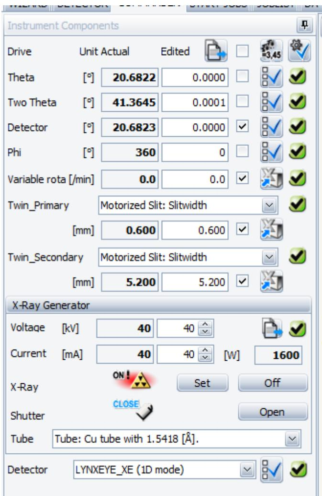
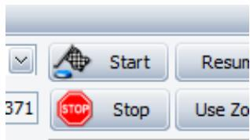
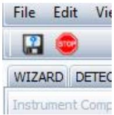

# Powder X-ray Diffraction Protocol/SOP

Note: the usage of the machine is NOT allowed without a proper training by the manager of the facility!

## Introduction

Powder X-ray diffraction (PXRD) is used to gain information about the crystallinity of materials in the solid state. An amorphous (disordered, non-crystalline) material will not diffract, while a material with any ordering/crystallinity, even if mixed with amorphous material, will diffract.

It is usually not possible to determine the structure of a material of unknown structure using PXRD, so if a structure determination is desired, single-crystal X-ray diffraction (SCXRD) is the preferred method. Usually with small molecules it is possible to grow crystals of sufficient size (at least \~30 microns on a side) to perform a SCXRD structure determination. PXRD is useful for materials that cannot be obtained as single crystals, as is generally true for polymers such as biomass or extended-crystalline materials such as metal-organic frameworks.

Even though PXRD generally does not yield a crystal structure, it does offer other information. The presence of known crystalline phases (e.g., AgCl) as impurities in a sample can be determined. For samples with very small crystallite sizes (10-20 nm or smaller), the average crystallite size can be determined using the Scherrer equation. For samples that diffract well, it is often possible to determine the unit cell dimensions. Finally, if the crystal structure of a material is known (usually from a SCXRD structure determination), a theoretical PXRD pattern can be compared to an experimental pattern to determine if a bulk multicrystalline sample is the same material with the same structure.

## Sample Preparation

If \~200 mg or more of sample is available, the regular sample holder can be used (see Figure 1 below). Keep in mind that PXRD is a non-destructive technique, so the sample will be unchanged after data collection and can be saved and re-used for other purposes. The height of the sample has a significant effect on the 2θ angle of the peaks observed, and the instrument is adjusted such that the top of the sample should be flush with the top of the outer ring on the sample holder. It is convenient to use a glass microscope slide to tamp down a sample so that it is flat and flush with the top of the sample holder.

The low Zero-background sample holder, at right in Figure 1, is useful and popular, and can work with as little as a few mg of sample. It is a single-crystal piece of silicon, cut at an angle such that no diffraction from it will occur. Your sample can be applied as a powder (again tamping down with a microscope slide so that it is flat and extends only a fraction of a millimeter above the top of the silicon), or as an evaporated film of a polymer, or even as a suspension of solid within a liquid/solvent directly from a reaction mixture. For the last method, be aware that the liquid will attenuate the X-rays that reach the detector, sometimes significantly.

Once your sample is loaded into either the regular or low-background sample holder, the sample holder is placed on top of the spring-loaded mechanism shown in Figure 1, and the final piece shown at the bottom is locked in place on the top.

> 🧠 **[Cognis Multimodal Enrichment]**
> * **Classification:** Scientific Figure
> * **VLM Visual Summary:** **FIGURE TYPE:** Laboratory Equipment Photograph
>   
>   **SCIENTIFIC PURPOSE:** This figure illustrates different types of sample holders used in Powder X-ray Diffraction (PXRD) experiments. The purpose is to provide a visual guide for selecting the appropriate sample holder based on the amount of sample available and the desired range of diffraction angles.
>   
>   **KEY KNOWLEDGE:**
>   1. **PXRD Regular Sample Holder:** Suitable for samples weighing over 200 mg, ensuring that the sample's top aligns with the top of the outer ring on the sample holder.
>   2. **Low-Zero Background Sample Holder:** Useful for samples weighing less than 200 mg, made of single-crystal silicon cut at an angle to prevent diffraction from interfering with the PXRD results.
>   3. **Spring-Loaded Sample Holder:** Provides a magnetic hold for the sample, with notches to ensure proper alignment for data collection between 5° and 40° 2θ angles.
>   
>   **LABEL INTERPRETATION:**
>   - **PXRD Regular Sample Holder:** The holder designed for larger sample sizes.
>   - **Low-Zero Background Sample Holder:** The holder made of silicon to minimize background interference.
>   - **Spring-Loaded Sample Holder:** The holder with a magnetic attachment for holding the sample in place.
>   
>   **ENGINEERING/SCIENTIFIC INSIGHTS:**
>   A reader should learn how to choose the correct sample holder based on the sample weight and the required diffraction angle range to ensure accurate PXRD data collection.
>   
>   **USER-RELEVANT INFORMATION:**
>   The information provided in the figure helps in understanding the importance of sample size and alignment in PXRD experiments, which is crucial for obtaining reliable diffraction patterns.
> * **Figure Caption:** Figure 1. PXRD regular sample holder (left), low-background sample holder (right), and spring-loaded sample holder (top and bottom). There is a third sample holder which is more advised to use since this one cut intensities at low angles.
> * **Surrounding Context (+/- 300 words):**
>   * **[Before]:** *... same structure. [Section: Powder X-ray Diffraction Protocol/SOP > Sample Preparation] If \~200 mg or more of sample is available, the regular sample holder can be used (see Figure 1 below). Keep in mind that PXRD is a non-destructive technique, so the sample will be unchanged after data collection and can be saved and re-used for other purposes. The height of the sample has a significant effect on the 2θ angle of the peaks observed, and the instrument is adjusted such that the top of the sample should be flush with the top of the outer ring on the sample holder. It is convenient to use a glass microscope slide to tamp down a sample so that it is flat and flush with the top of the sample holder. The low Zero-background sample holder, at right in Figure 1, is useful and popular, and can work with as little as a few mg of sample. It is a single-crystal piece of silicon, cut at an angle such that no diffraction from it will occur. Your sample can be applied as a powder (again tamping down with a microscope slide so that it is flat and extends only a fraction of a millimeter above the top of the silicon), or as an evaporated film of a polymer, or even as a suspension of solid within a liquid/solvent directly from a reaction mixture. For the last method, be aware that the liquid will attenuate the X-rays that reach the detector, sometimes significantly. [Section: Powder X-ray Diffraction Protocol/SOP > Sample Preparation] Once your sample is loaded into either the regular or low-background sample holder, the sample holder is placed on top of the spring-loaded mechanism shown in Figure 1, and the final piece shown at the bottom is locked in place on the top.*
>   * **[After]:** *Figure 1. PXRD regular sample holder (left), low-background sample holder (right), and spring-loaded sample holder (top and bottom). There is a third sample holder which is more advised to use since this one cut intensities at low angles. [Section: Powder X-ray Diffraction Protocol/SOP > Collecting Data] First check that the diffractometer is not currently running. If it not, the door can be opened, but only after first pushing the door-open button on the right side of the front face of the diffractometer: Mount your sample from the bottom as shown below. It is held in place magnetically. Note that there are notches in both the sample holder and place where it is mounted. It is best to line them up, in particular if you will collect data below $2 \theta = 1 0 ^ { \circ }$ (keep in mind the intensities below 10° will be lower than they supposed to be with this holder). Close the front door of the diffractometer once your sample is in place. In general you will find the software control program open on the computer, which will look like this: At the bottom are most of the parameters used to set up your experiment. The most common experiment type will be a “Coupled TwoTheta/Theta” scan (Do not change it). Some typical parameters are shown below: [Section: Powder X-ray Diffraction Protocol/SOP > Collecting Data] Here 2θ is scanned from $5 ^ { \circ }$ to $4 0 ^ { \circ } .$ . If your compound is strongly diffracting and has small unit cell axes (as in inorganic solids such as ZnO), then useful data can be found at higher angles and you can collect to $6 0 ^ { \circ }$ or more as appropriate. If your compound has big unit cell axes and ...*
  
Figure 1. PXRD regular sample holder (left), low-background sample holder (right), and spring-loaded sample holder (top and bottom). There is a third sample holder which is more advised to use since this one cut intensities at low angles.

## Collecting Data

First check that the diffractometer is not currently running. If it not, the door can be opened, but only after first pushing the door-open button on the right side of the front face of the diffractometer:

> 🧠 **[Cognis Multimodal Enrichment]**
> * **Classification:** Scientific Figure
> * **VLM Visual Summary:** ### FIGURE TYPE:
>   **Experimental Setup**
>   
>   ### SCIENTIFIC PURPOSE:
>   The figure illustrates the process of mounting a sample in a powder X-ray diffractometer. This setup is crucial for preparing samples for X-ray diffraction experiments, which are commonly used to determine the crystal structure and phase composition of materials.
>   
>   ### KEY KNOWLEDGE:
>   1. **Sample Mounting**: The sample must be mounted from the bottom using a magnetic holder.
>   2. **Sample Preparation**: The sample can be in the form of a powder, evaporated film, or suspension, depending on its nature.
>   3. **Sample Holder**: The sample holder is designed to hold the sample securely and is often used in conjunction with a zero-background sample holder to minimize background scattering.
>   4. **Instrument Operation**: The diffractometer must be turned off before opening the door, and the door can only be opened after pressing the door-open button.
>   5. **Data Collection Parameters**: The software controls the scanning parameters, including the range of 2θ angles (from 5° to 40° for typical experiments).
>   
>   ### LABEL INTERPRETATION:
>   - **Door Open Button**: The button used to open the diffractometer door.
>   - **Sample Holder**: The device holding the sample in place during the experiment.
>   - **Spring-Loaded Mechanism**: The mechanism that holds the sample holder in place.
>   
>   ### ENGINEERING/SCIENTIFIC INSIGHTS:
>   A reader should learn how to properly prepare and mount samples for X-ray diffraction, ensuring that the sample is correctly positioned and secured to avoid movement during the experiment. Understanding the importance of using a zero-background sample holder and the correct scanning parameters is crucial for obtaining accurate results.
>   
>   ### USER-RELEVANT INFORMATION:
>   - **Sample Mounting Position**: The sample should be mounted from the bottom.
>   - **Sample Preparation Methods**: The sample can be prepared as a powder, evaporated film, or suspension.
>   - **Instrument Operation**: Turning off the instrument before opening the door and using the door-open button are essential safety precautions.
>   - **Data Collection Parameters**: The range of 2θ angles used in typical experiments helps determine the crystal structure and phase composition of materials.
> * **Figure Caption:** First check that the diffractometer is not currently running. If it not, the door can be opened, but only after first pushing the door-open button on the right side of the front face of the diffractometer: | Mount your sample from the bottom as shown below. It is held in place magnetically.
> * **Surrounding Context (+/- 300 words):**
>   * **[Before]:** *... top of the sample should be flush with the top of the outer ring on the sample holder. It is convenient to use a glass microscope slide to tamp down a sample so that it is flat and flush with the top of the sample holder. The low Zero-background sample holder, at right in Figure 1, is useful and popular, and can work with as little as a few mg of sample. It is a single-crystal piece of silicon, cut at an angle such that no diffraction from it will occur. Your sample can be applied as a powder (again tamping down with a microscope slide so that it is flat and extends only a fraction of a millimeter above the top of the silicon), or as an evaporated film of a polymer, or even as a suspension of solid within a liquid/solvent directly from a reaction mixture. For the last method, be aware that the liquid will attenuate the X-rays that reach the detector, sometimes significantly. [Section: Powder X-ray Diffraction Protocol/SOP > Sample Preparation] Once your sample is loaded into either the regular or low-background sample holder, the sample holder is placed on top of the spring-loaded mechanism shown in Figure 1, and the final piece shown at the bottom is locked in place on the top. Figure 1. PXRD regular sample holder (left), low-background sample holder (right), and spring-loaded sample holder (top and bottom). There is a third sample holder which is more advised to use since this one cut intensities at low angles. [Section: Powder X-ray Diffraction Protocol/SOP > Collecting Data] First check that the diffractometer is not currently running. If it not, the door can be opened, but only after first pushing the door-open button on the right side of the front face of the diffractometer:*
>   * **[After]:** *Mount your sample from the bottom as shown below. It is held in place magnetically. Note that there are notches in both the sample holder and place where it is mounted. It is best to line them up, in particular if you will collect data below $2 \theta = 1 0 ^ { \circ }$ (keep in mind the intensities below 10° will be lower than they supposed to be with this holder). Close the front door of the diffractometer once your sample is in place. In general you will find the software control program open on the computer, which will look like this: At the bottom are most of the parameters used to set up your experiment. The most common experiment type will be a “Coupled TwoTheta/Theta” scan (Do not change it). Some typical parameters are shown below: [Section: Powder X-ray Diffraction Protocol/SOP > Collecting Data] Here 2θ is scanned from $5 ^ { \circ }$ to $4 0 ^ { \circ } .$ . If your compound is strongly diffracting and has small unit cell axes (as in inorganic solids such as ZnO), then useful data can be found at higher angles and you can collect to $6 0 ^ { \circ }$ or more as appropriate. If your compound has big unit cell axes and therefore diffracts at angles less than $5 ^ { \circ }$ (no lower than $3 ^ { \circ }$ or higher than 120°), then you can decrease the starting 2θ angle appropriately. However, it is best to decrease the “PSD opening” (position sensitive detector and area detectors, which allow collection from multiple angles at once) to half of the lowest 2θ. For example, if you are starting at $2 \Theta = 3 ^ { \circ }$ , then decrease “PSD opening” to ...*

Mount your sample from the bottom as shown below. It is held in place magnetically.

> 🧠 **[Cognis Multimodal Enrichment]**
> * **Classification:** Scientific Figure
> * **VLM Visual Summary:** **FIGURE TYPE:** Laboratory Equipment Photograph
>   
>   **SCIENTIFIC PURPOSE:** This figure illustrates the process of mounting a sample for powder X-ray diffraction (PXRD) measurements using a specific sample holder.
>   
>   **KEY KNOWLEDGE:**
>   1. **Sample Holder Design:** The sample holder is designed to hold samples magnetically and is equipped with notches to ensure proper alignment.
>   2. **Sample Preparation:** The sample can be prepared in various ways, including as a powder, evaporated film, or suspension, depending on the material properties.
>   3. **Sample Loading:** The sample is placed at the bottom of the sample holder, which is then secured by a spring-loaded mechanism.
>   4. **Data Collection Parameters:** The figure suggests setting up the experiment parameters, such as the range of 2θ angles (from 5° to 40°) and adjusting the PSD opening based on the sample's diffraction properties.
>   
>   **LABEL INTERPRETATION:**
>   - **Sample Holder:** The central part of the image shows the sample holder being mounted.
>   - **Notches:** The notches mentioned in the caption are likely used for alignment purposes.
>   - **Spring-Loaded Mechanism:** The mechanism that secures the sample holder in place.
>   
>   **ENGINEERING/SCIENTIFIC INSIGHTS:**
>   - Understanding how to properly mount and align the sample is crucial for accurate PXRD data collection.
>   - The use of a low-background sample holder is recommended to minimize background scattering and improve data quality.
>   - Proper sample preparation and alignment are essential for obtaining reliable diffraction patterns.
>   
>   **USER-RELEVANT INFORMATION:**
>   - The specific design of the sample holder and its alignment features.
>   - The range of 2θ angles suitable for different materials.
>   - The importance of adjusting the PSD opening based on the sample's diffraction properties.
> * **Figure Caption:** Mount your sample from the bottom as shown below. It is held in place magnetically. | Note that there are notches in both the sample holder and place where it is mounted. It is best to line them up, in particular if you will collect data below $2 \theta = 1 0 ^ { \circ }$ (keep in mind the intensities below 10° will be lower than they supposed to be with this holder). Close the front door of the diffractometer once your sample is in place.
> * **Surrounding Context (+/- 300 words):**
>   * **[Before]:** *... the sample holder. It is convenient to use a glass microscope slide to tamp down a sample so that it is flat and flush with the top of the sample holder. The low Zero-background sample holder, at right in Figure 1, is useful and popular, and can work with as little as a few mg of sample. It is a single-crystal piece of silicon, cut at an angle such that no diffraction from it will occur. Your sample can be applied as a powder (again tamping down with a microscope slide so that it is flat and extends only a fraction of a millimeter above the top of the silicon), or as an evaporated film of a polymer, or even as a suspension of solid within a liquid/solvent directly from a reaction mixture. For the last method, be aware that the liquid will attenuate the X-rays that reach the detector, sometimes significantly. [Section: Powder X-ray Diffraction Protocol/SOP > Sample Preparation] Once your sample is loaded into either the regular or low-background sample holder, the sample holder is placed on top of the spring-loaded mechanism shown in Figure 1, and the final piece shown at the bottom is locked in place on the top. Figure 1. PXRD regular sample holder (left), low-background sample holder (right), and spring-loaded sample holder (top and bottom). There is a third sample holder which is more advised to use since this one cut intensities at low angles. [Section: Powder X-ray Diffraction Protocol/SOP > Collecting Data] First check that the diffractometer is not currently running. If it not, the door can be opened, but only after first pushing the door-open button on the right side of the front face of the diffractometer: Mount your sample from the bottom as shown below. It is held in place magnetically.*
>   * **[After]:** *Note that there are notches in both the sample holder and place where it is mounted. It is best to line them up, in particular if you will collect data below $2 \theta = 1 0 ^ { \circ }$ (keep in mind the intensities below 10° will be lower than they supposed to be with this holder). Close the front door of the diffractometer once your sample is in place. In general you will find the software control program open on the computer, which will look like this: At the bottom are most of the parameters used to set up your experiment. The most common experiment type will be a “Coupled TwoTheta/Theta” scan (Do not change it). Some typical parameters are shown below: [Section: Powder X-ray Diffraction Protocol/SOP > Collecting Data] Here 2θ is scanned from $5 ^ { \circ }$ to $4 0 ^ { \circ } .$ . If your compound is strongly diffracting and has small unit cell axes (as in inorganic solids such as ZnO), then useful data can be found at higher angles and you can collect to $6 0 ^ { \circ }$ or more as appropriate. If your compound has big unit cell axes and therefore diffracts at angles less than $5 ^ { \circ }$ (no lower than $3 ^ { \circ }$ or higher than 120°), then you can decrease the starting 2θ angle appropriately. However, it is best to decrease the “PSD opening” (position sensitive detector and area detectors, which allow collection from multiple angles at once) to half of the lowest 2θ. For example, if you are starting at $2 \Theta = 3 ^ { \circ }$ , then decrease “PSD opening” to 1.5. The last parameter you can adjust is the “Time”. This time corresponds to the ...*

> 🧠 **[Cognis Multimodal Enrichment]**
> * **Classification:** Scientific Figure
> * **VLM Visual Summary:** **FIGURE TYPE:** Laboratory Equipment Photograph
>   
>   **SCIENTIFIC PURPOSE:** This figure illustrates the setup of a powder X-ray diffraction (PXRD) instrument, specifically focusing on the sample holder and its magnetic mounting system.
>   
>   **KEY KNOWLEDGE:**
>   1. **Sample Holder Design:** The sample holder is designed to hold samples magnetically, ensuring stability during data collection.
>   2. **Sample Placement:** Samples are mounted from the bottom, aligned with notches for precise positioning.
>   3. **Sample Size:** The holder can accommodate samples ranging from a few milligrams to larger quantities depending on the application.
>   4. **Sample Preparation:** The sample can be prepared as a powder, evaporated film, or suspension, depending on the material properties.
>   5. **Data Collection Parameters:** The figure suggests setting up the experiment using a "Coupled TwoTheta/Theta" scan, with specific parameters like 2θ range and PSD opening adjustments based on the sample's diffraction properties.
>   
>   **LABEL INTERPRETATION:**
>   - **Sample Holder:** The central component holding the sample.
>   - **Magnetic Mounting System:** Ensures the sample remains stationary during data collection.
>   - **Notches:** Used for precise alignment of the sample holder and sample mount.
>   
>   **ENGINEERING/SCIENTIFIC INSIGHTS:**
>   - Understanding the importance of proper sample preparation and alignment is crucial for accurate PXRD data.
>   - The magnetic mounting system provides a stable environment for the sample, reducing motion artifacts.
>   - Proper adjustment of scan parameters is essential for obtaining reliable diffraction patterns.
>   
>   **USER-RELEVANT INFORMATION:**
>   - The specific design of the sample holder and its magnetic mounting system.
>   - The recommended sample preparation methods (powder, film, suspension).
>   - The importance of aligning the sample holder with notches for optimal performance.
>   - The significance of adjusting scan parameters based on the sample's diffraction properties.
> * **Figure Caption:** Mount your sample from the bottom as shown below. It is held in place magnetically. | Note that there are notches in both the sample holder and place where it is mounted. It is best to line them up, in particular if you will collect data below $2 \theta = 1 0 ^ { \circ }$ (keep in mind the intensities below 10° will be lower than they supposed to be with this holder). Close the front door of the diffractometer once your sample is in place.
> * **Surrounding Context (+/- 300 words):**
>   * **[Before]:** *... the sample holder. It is convenient to use a glass microscope slide to tamp down a sample so that it is flat and flush with the top of the sample holder. The low Zero-background sample holder, at right in Figure 1, is useful and popular, and can work with as little as a few mg of sample. It is a single-crystal piece of silicon, cut at an angle such that no diffraction from it will occur. Your sample can be applied as a powder (again tamping down with a microscope slide so that it is flat and extends only a fraction of a millimeter above the top of the silicon), or as an evaporated film of a polymer, or even as a suspension of solid within a liquid/solvent directly from a reaction mixture. For the last method, be aware that the liquid will attenuate the X-rays that reach the detector, sometimes significantly. [Section: Powder X-ray Diffraction Protocol/SOP > Sample Preparation] Once your sample is loaded into either the regular or low-background sample holder, the sample holder is placed on top of the spring-loaded mechanism shown in Figure 1, and the final piece shown at the bottom is locked in place on the top. Figure 1. PXRD regular sample holder (left), low-background sample holder (right), and spring-loaded sample holder (top and bottom). There is a third sample holder which is more advised to use since this one cut intensities at low angles. [Section: Powder X-ray Diffraction Protocol/SOP > Collecting Data] First check that the diffractometer is not currently running. If it not, the door can be opened, but only after first pushing the door-open button on the right side of the front face of the diffractometer: Mount your sample from the bottom as shown below. It is held in place magnetically.*
>   * **[After]:** *Note that there are notches in both the sample holder and place where it is mounted. It is best to line them up, in particular if you will collect data below $2 \theta = 1 0 ^ { \circ }$ (keep in mind the intensities below 10° will be lower than they supposed to be with this holder). Close the front door of the diffractometer once your sample is in place. In general you will find the software control program open on the computer, which will look like this: At the bottom are most of the parameters used to set up your experiment. The most common experiment type will be a “Coupled TwoTheta/Theta” scan (Do not change it). Some typical parameters are shown below: [Section: Powder X-ray Diffraction Protocol/SOP > Collecting Data] Here 2θ is scanned from $5 ^ { \circ }$ to $4 0 ^ { \circ } .$ . If your compound is strongly diffracting and has small unit cell axes (as in inorganic solids such as ZnO), then useful data can be found at higher angles and you can collect to $6 0 ^ { \circ }$ or more as appropriate. If your compound has big unit cell axes and therefore diffracts at angles less than $5 ^ { \circ }$ (no lower than $3 ^ { \circ }$ or higher than 120°), then you can decrease the starting 2θ angle appropriately. However, it is best to decrease the “PSD opening” (position sensitive detector and area detectors, which allow collection from multiple angles at once) to half of the lowest 2θ. For example, if you are starting at $2 \Theta = 3 ^ { \circ }$ , then decrease “PSD opening” to 1.5. The last parameter you can adjust is the “Time”. This time corresponds to the ...*

Note that there are notches in both the sample holder and place where it is mounted. It is best to line them up, in particular if you will collect data below $2 \theta = 1 0 ^ { \circ }$ (keep in mind the intensities below 10° will be lower than they supposed to be with this holder). Close the front door of the diffractometer once your sample is in place.

In general you will find the software control program open on the computer, which will look like this:

> 🧠 **[Cognis Multimodal Enrichment]**
> * **Classification:** Scientific Figure
> * **VLM Visual Summary:** ### FIGURE TYPE:
>   Software Interface Screenshot
>   
>   ### SCIENTIFIC PURPOSE:
>   This figure illustrates a powder X-ray diffraction (PXRD) pattern, which is used to determine the crystalline structure of a material by analyzing the diffraction peaks produced when X-rays interact with a powdered sample.
>   
>   ### KEY KNOWLEDGE:
>   1. **Diffraction Peaks**: The peaks in the diffraction pattern correspond to specific crystallographic planes of the material being analyzed.
>   2. **2θ Angle**: The 2θ angle indicates the Bragg angle, which is related to the spacing between the lattice planes of the crystal.
>   3. **Crystal Structure**: The positions and relative intensities of the diffraction peaks provide clues about the crystal structure, including the number of atoms per unit cell, the arrangement of atoms, and the symmetry of the crystal.
>   4. **Sample Preparation**: The sample must be in a powdered form to allow all its lattice planes to diffract X-rays effectively.
>   5. **Instrument Parameters**: The instrument settings, such as voltage, current, and scan parameters, affect the quality and resolution of the diffraction pattern.
>   
>   ### LABEL INTERPRETATION:
>   - **Theta**: The scattering angle of the X-rays.
>   - **Two Theta**: Twice the scattering angle, often used in diffraction patterns.
>   - **Detector**: The device that measures the intensity of the diffracted X-rays.
>   - **X-Ray Generator**: The source of X-rays used in the diffraction process.
>   - **Shutter**: Controls the exposure time of the detector to X-rays.
>   - **Detector**: The detector used to measure the diffracted X-rays.
>   
>   ### ENGINEERING/SCIENTIFIC INSIGHTS:
>   - **Understanding Crystal Structures**: The diffraction pattern provides critical information about the crystal structure, which is essential for identifying materials and understanding their properties.
>   - **Quality Control**: The quality of the diffraction pattern can indicate the purity and homogeneity of the sample.
>   - **Material Identification**: Different materials have unique diffraction patterns that can be used to identify them.
>   
>   ### USER-RELEVANT INFORMATION:
>   - **Effective Total Time**: The total time the diffractometer collects data, which affects the signal-to-noise ratio of the diffraction pattern.
>   - **Scan Parameters**: The range of 2θ angles scanned (e.g., 5° to 40°) and the increment size (e.g., 0.02047°) influence the
> * **Figure Caption:** In general you will find the software control program open on the computer, which will look like this: | At the bottom are most of the parameters used to set up your experiment. The most common experiment type will be a “Coupled TwoTheta/Theta” scan (Do not change it). Some typical parameters are shown below:
> * **Surrounding Context (+/- 300 words):**
>   * **[Before]:** *... microscope slide so that it is flat and extends only a fraction of a millimeter above the top of the silicon), or as an evaporated film of a polymer, or even as a suspension of solid within a liquid/solvent directly from a reaction mixture. For the last method, be aware that the liquid will attenuate the X-rays that reach the detector, sometimes significantly. [Section: Powder X-ray Diffraction Protocol/SOP > Sample Preparation] Once your sample is loaded into either the regular or low-background sample holder, the sample holder is placed on top of the spring-loaded mechanism shown in Figure 1, and the final piece shown at the bottom is locked in place on the top. Figure 1. PXRD regular sample holder (left), low-background sample holder (right), and spring-loaded sample holder (top and bottom). There is a third sample holder which is more advised to use since this one cut intensities at low angles. [Section: Powder X-ray Diffraction Protocol/SOP > Collecting Data] First check that the diffractometer is not currently running. If it not, the door can be opened, but only after first pushing the door-open button on the right side of the front face of the diffractometer: Mount your sample from the bottom as shown below. It is held in place magnetically. Note that there are notches in both the sample holder and place where it is mounted. It is best to line them up, in particular if you will collect data below $2 \theta = 1 0 ^ { \circ }$ (keep in mind the intensities below 10° will be lower than they supposed to be with this holder). Close the front door of the diffractometer once your sample is in place. In general you will find the software control program open on the computer, which will look like this:*
>   * **[After]:** *At the bottom are most of the parameters used to set up your experiment. The most common experiment type will be a “Coupled TwoTheta/Theta” scan (Do not change it). Some typical parameters are shown below: [Section: Powder X-ray Diffraction Protocol/SOP > Collecting Data] Here 2θ is scanned from $5 ^ { \circ }$ to $4 0 ^ { \circ } .$ . If your compound is strongly diffracting and has small unit cell axes (as in inorganic solids such as ZnO), then useful data can be found at higher angles and you can collect to $6 0 ^ { \circ }$ or more as appropriate. If your compound has big unit cell axes and therefore diffracts at angles less than $5 ^ { \circ }$ (no lower than $3 ^ { \circ }$ or higher than 120°), then you can decrease the starting 2θ angle appropriately. However, it is best to decrease the “PSD opening” (position sensitive detector and area detectors, which allow collection from multiple angles at once) to half of the lowest 2θ. For example, if you are starting at $2 \Theta = 3 ^ { \circ }$ , then decrease “PSD opening” to 1.5. The last parameter you can adjust is the “Time”. This time corresponds to the time the diffractometer would collect data at each angular increment $( 0 . 0 2 0 4 7 ^ { \circ }$ in the setup above, preferred increment for publication), even though it is actually performing a continuous scan. Increasing the time will, obviously, increase the total scan time, and will also increase the signal-to-noise of your diffraction pattern. The total time for your scan is calculated and shown at “Effective Total Time,” 371 seconds (just over 6 minutes) in the setup above. Some more relevant experimental parameters are ...*

At the bottom are most of the parameters used to set up your experiment. The most common experiment type will be a “Coupled TwoTheta/Theta” scan (Do not change it). Some typical parameters are shown below:

> 🧠 **[Cognis Multimodal Enrichment]**
> * **Classification:** Scientific Figure
> * **Extracted Text (OCR):** `Scan Setup, Scan type, Coupled TwoTheta/Theta, Scan mode, Continuous PSD fast, Time, 0.200, Steps, 1711, Effective Total Time, 371, Parameter, Start, Increment, Stop, 2Theta, 5.0001, 0.020467794, 40.0001, Theta, 2.5001, 0`
> * **VLM Visual Summary:** ### FIGURE TYPE:
>   Software Interface Screenshot
>   
>   ### SCIENTIFIC PURPOSE:
>   This figure illustrates the settings and parameters used for a "Coupled TwoTheta/Theta" scan in a powder X-ray diffraction (PXRD) experiment. The goal is to understand how to configure the scan parameters effectively for different types of samples and experimental conditions.
>   
>   ### KEY KNOWLEDGE:
>   1. **Scan Type**: The scan type is specified as "Coupled TwoTheta/Theta," which indicates that the experiment involves scanning two angles simultaneously.
>   2. **Scan Mode**: The scan mode is set to "Continuous PSD fast," suggesting that the scan will be performed continuously using position-sensitive detection (PSD) technology.
>   3. **Time**: The total effective scan time is 371 seconds (just over 6 minutes).
>   4. **Steps**: The number of steps taken during the scan is 1711.
>   5. **Parameters**:
>      - **2Theta**: The range of 2Theta values is from 5.0001° to 40.0001°.
>      - **Theta**: The range of Theta values is from 2.5001° to 20.0001°.
>      - **PSD Opening**: The PSD opening value is 2.947362345°.
>   6. **Increment**: The increment between each step is 0.020467794° for 2Theta and 0.0102338...° for Theta.
>   
>   ### LABEL INTERPRETATION:
>   - **Scan type**: Uncertain (from the image alone)
>   - **Scan mode**: Continuous PSD fast
>   - **Time**: 0.200 seconds
>   - **Steps**: 1711
>   - **Effective Total Time**: 371 seconds
>   - **Parameter Start Values**: 5.0001° for 2Theta, 2.5001° for Theta
>   - **Increment Values**: Increment for 2Theta is 0.020467794°, for Theta is 0.0102338...°
>   - **PSD Opening**: 2.947362345°
>   
>   ### ENGINEERING/SCIENTIFIC INSIGHTS:
>   - Understanding the specific parameters required for a PXRD
> * **Figure Caption:** At the bottom are most of the parameters used to set up your experiment. The most common experiment type will be a “Coupled TwoTheta/Theta” scan (Do not change it). Some typical parameters are shown below: | [Section: Powder X-ray Diffraction Protocol/SOP > Collecting Data]
> * **Surrounding Context (+/- 300 words):**
>   * **[Before]:** *... solid within a liquid/solvent directly from a reaction mixture. For the last method, be aware that the liquid will attenuate the X-rays that reach the detector, sometimes significantly. [Section: Powder X-ray Diffraction Protocol/SOP > Sample Preparation] Once your sample is loaded into either the regular or low-background sample holder, the sample holder is placed on top of the spring-loaded mechanism shown in Figure 1, and the final piece shown at the bottom is locked in place on the top. Figure 1. PXRD regular sample holder (left), low-background sample holder (right), and spring-loaded sample holder (top and bottom). There is a third sample holder which is more advised to use since this one cut intensities at low angles. [Section: Powder X-ray Diffraction Protocol/SOP > Collecting Data] First check that the diffractometer is not currently running. If it not, the door can be opened, but only after first pushing the door-open button on the right side of the front face of the diffractometer: Mount your sample from the bottom as shown below. It is held in place magnetically. Note that there are notches in both the sample holder and place where it is mounted. It is best to line them up, in particular if you will collect data below $2 \theta = 1 0 ^ { \circ }$ (keep in mind the intensities below 10° will be lower than they supposed to be with this holder). Close the front door of the diffractometer once your sample is in place. In general you will find the software control program open on the computer, which will look like this: At the bottom are most of the parameters used to set up your experiment. The most common experiment type will be a “Coupled TwoTheta/Theta” scan (Do not change it). Some typical parameters are shown below:*
>   * **[After]:** *[Section: Powder X-ray Diffraction Protocol/SOP > Collecting Data] Here 2θ is scanned from $5 ^ { \circ }$ to $4 0 ^ { \circ } .$ . If your compound is strongly diffracting and has small unit cell axes (as in inorganic solids such as ZnO), then useful data can be found at higher angles and you can collect to $6 0 ^ { \circ }$ or more as appropriate. If your compound has big unit cell axes and therefore diffracts at angles less than $5 ^ { \circ }$ (no lower than $3 ^ { \circ }$ or higher than 120°), then you can decrease the starting 2θ angle appropriately. However, it is best to decrease the “PSD opening” (position sensitive detector and area detectors, which allow collection from multiple angles at once) to half of the lowest 2θ. For example, if you are starting at $2 \Theta = 3 ^ { \circ }$ , then decrease “PSD opening” to 1.5. The last parameter you can adjust is the “Time”. This time corresponds to the time the diffractometer would collect data at each angular increment $( 0 . 0 2 0 4 7 ^ { \circ }$ in the setup above, preferred increment for publication), even though it is actually performing a continuous scan. Increasing the time will, obviously, increase the total scan time, and will also increase the signal-to-noise of your diffraction pattern. The total time for your scan is calculated and shown at “Effective Total Time,” 371 seconds (just over 6 minutes) in the setup above. Some more relevant experimental parameters are found at the left of the screen: [Section: Powder X-ray Diffraction Protocol/SOP > Collecting Data] The numbers in the right column are set by the user, and those in the left column reflect the actual ...*

Here 2θ is scanned from $5 ^ { \circ }$ to $4 0 ^ { \circ } .$ . If your compound is strongly diffracting and has small unit cell axes (as in inorganic solids such as ZnO), then useful data can be found at higher angles and you can collect to $6 0 ^ { \circ }$ or more as appropriate. If your compound has big unit cell axes and therefore diffracts at angles less than $5 ^ { \circ }$ (no lower than $3 ^ { \circ }$ or higher than 120°), then you can decrease the starting 2θ angle appropriately. However, it is best to decrease the “PSD opening” (position sensitive detector and area detectors, which allow collection from multiple angles at once) to half of the lowest 2θ. For example, if you are starting at $2 \Theta = 3 ^ { \circ }$ , then decrease “PSD opening” to 1.5. The last parameter you can adjust is the “Time”. This time corresponds to the time the diffractometer would collect data at each angular increment $( 0 . 0 2 0 4 7 ^ { \circ }$ in the setup above, preferred increment for publication), even though it is actually performing a continuous scan. Increasing the time will, obviously, increase the total scan time, and will also increase the signal-to-noise of your diffraction pattern. The total time for your scan is calculated and shown at “Effective Total Time,” 371 seconds (just over 6 minutes) in the setup above.

Some more relevant experimental parameters are found at the left of the screen:

> 🧠 **[Cognis Multimodal Enrichment]**
> * **Classification:** Scientific Figure
> * **Extracted Text (OCR):** `Instrument Components, Drive, Unit Actual, Edited, Theta, [°], 20.6822, 0.0000, Two Theta, [°], 41.3645, 0.0001, Detector, [°], 20.6823, 0.0000, Phi, [°], 360, 0, Variable rota [min], [°/min`
> * **VLM Visual Summary:** ### FIGURE TYPE:
>   Software Interface Screenshot
>   
>   ### SCIENTIFIC PURPOSE:
>   This figure illustrates the interface of a powder X-ray diffraction instrument, specifically focusing on the settings and configurations used during data collection.
>   
>   ### KEY KNOWLEDGE:
>   1. **Instrument Settings**: The figure shows the current settings of various instrument components, including drive angles, detector settings, and X-ray generator parameters.
>   2. **Standby Mode**: The instrument can enter a standby mode after an extended period of inactivity, indicated by the lower voltage and current settings.
>   3. **Sample Rotation**: The ability to rotate the sample using the "Variable rota" feature, which allows for better averaging of crystallite orientations.
>   4. **Safety Instructions**: Important safety instructions are provided, such as not touching the shutter bottoms and never turning off the X-ray generator.
>   
>   ### LABEL INTERPRETATION:
>   - **Drive**: Indicates the current drive angles.
>   - **Theta**: Shows the current theta values.
>   - **Two Theta**: Displays the current two-theta values.
>   - **Detector**: Indicates the current detector settings.
>   - **Phi**: Shows the current phi value.
>   - **Variable rota**: Controls the rotation speed of the sample.
>   - **X-Ray Generator**: Displays the current voltage and current settings.
>   - **Safety Warning**: Indicates the importance of following safety guidelines.
>   
>   ### ENGINEERING/SCIENTIFIC INSIGHTS:
>   - Understanding the current settings of the instrument is crucial for ensuring accurate data collection.
>   - The ability to rotate the sample helps improve the quality of the diffraction pattern by averaging out crystallite orientations.
>   - Safety precautions are essential to prevent damage to the equipment and ensure safe operation.
>   
>   ### USER-RELEVANT INFORMATION:
>   - The current settings of the instrument (e.g., drive angles, detector settings).
>   - The standby mode settings (lower voltage and current).
>   - The sample rotation speed (settable via the "Variable rota" feature).
>   - Safety instructions for operating the X-ray generator.
> * **Figure Caption:** [Section: Powder X-ray Diffraction Protocol/SOP > Collecting Data] | The numbers in the right column are set by the user, and those in the left column reflect the actual instrument state. For example, the X-ray generator is usually set at 40 kV and 40 mA for data collection. If the instrument has been idle for an extended period (30-40 mins), it will go into standby mode at 20 kV and 5 mA (as shown by the numbers at the left), but the settings at the right stay at 40 kV and 40 mA and will ramp up to that automatically when you start the data acquisition. Do not touch the shutter bottoms at any circumstances. Never turn off the X-ray generator.
> * **Surrounding Context (+/- 300 words):**
>   * **[Before]:** *... most common experiment type will be a “Coupled TwoTheta/Theta” scan (Do not change it). Some typical parameters are shown below: [Section: Powder X-ray Diffraction Protocol/SOP > Collecting Data] Here 2θ is scanned from $5 ^ { \circ }$ to $4 0 ^ { \circ } .$ . If your compound is strongly diffracting and has small unit cell axes (as in inorganic solids such as ZnO), then useful data can be found at higher angles and you can collect to $6 0 ^ { \circ }$ or more as appropriate. If your compound has big unit cell axes and therefore diffracts at angles less than $5 ^ { \circ }$ (no lower than $3 ^ { \circ }$ or higher than 120°), then you can decrease the starting 2θ angle appropriately. However, it is best to decrease the “PSD opening” (position sensitive detector and area detectors, which allow collection from multiple angles at once) to half of the lowest 2θ. For example, if you are starting at $2 \Theta = 3 ^ { \circ }$ , then decrease “PSD opening” to 1.5. The last parameter you can adjust is the “Time”. This time corresponds to the time the diffractometer would collect data at each angular increment $( 0 . 0 2 0 4 7 ^ { \circ }$ in the setup above, preferred increment for publication), even though it is actually performing a continuous scan. Increasing the time will, obviously, increase the total scan time, and will also increase the signal-to-noise of your diffraction pattern. The total time for your scan is calculated and shown at “Effective Total Time,” 371 seconds (just over 6 minutes) in the setup above. Some more relevant experimental parameters are found at the left of the screen: [Section: Powder X-ray Diffraction Protocol/SOP > Collecting Data]*
>   * **[After]:** *The numbers in the right column are set by the user, and those in the left column reflect the actual instrument state. For example, the X-ray generator is usually set at 40 kV and 40 mA for data collection. If the instrument has been idle for an extended period (30-40 mins), it will go into standby mode at 20 kV and 5 mA (as shown by the numbers at the left), but the settings at the right stay at 40 kV and 40 mA and will ramp up to that automatically when you start the data acquisition. Do not touch the shutter bottoms at any circumstances. Never turn off the X-ray generator. You can have your sample rotate, which gives a better averaging over crystallite orientations, by setting “Variable rota” to something like 15 rot/min and clicking the check box. However (true for sample holder in Figure 1, for the usage of the second holder ignore this note), for data below about 10° 2θ, the metal ridges on the sample holder will interfere with data collection. If you have data below 10°, it is advisable not to rotate the sample, but instead set Phi to 0 degrees and click the checkbox for Phi. This will rotate the sample stage such that the notches will align with the source and detector. Once the parameters are set, click the start button near the bottom to begin the experiment. [Section: Powder X-ray Diffraction Protocol/SOP > Collecting Data] When data collection is complete, save your data by clicking the save icon at the upper left. Save your data in C:\data\your folder (create “your folder” if you haven’t already). It is recommended that you save the data in three formats: BRML file (Bruker mark-up language, useful to open your data in Eva or TOPAS), RAW ...*

The numbers in the right column are set by the user, and those in the left column reflect the actual instrument state. For example, the X-ray generator is usually set at 40 kV and 40 mA for data collection. If the instrument has been idle for an extended period (30-40 mins), it will go into standby mode at 20 kV and 5 mA (as shown by the numbers at the left), but the settings at the right stay at 40 kV and 40 mA and will ramp up to that automatically when you start the data acquisition. Do not touch the shutter bottoms at any circumstances. Never turn off the X-ray generator.

You can have your sample rotate, which gives a better averaging over crystallite orientations, by setting “Variable rota” to something like 15 rot/min and clicking the check box. However (true for sample holder in Figure 1, for the usage of the second holder ignore this note), for data below about 10° 2θ, the metal ridges on the sample holder will interfere with data collection. If you have data below 10°, it is advisable not to rotate the sample, but instead set Phi to 0 degrees and click the checkbox for Phi. This will rotate the sample stage such that the notches will align with the source and detector.

Once the parameters are set, click the start button near the bottom to begin the experiment.

> 🧠 **[Cognis Multimodal Enrichment]**
> * **Classification:** Scientific Figure
> * **Extracted Text (OCR):** `Start, Resum, STOP, Stop, Use Zone`
> * **VLM Visual Summary:** ### FIGURE TYPE:
>   Software Interface Screenshot
>   
>   ### SCIENTIFIC PURPOSE:
>   The figure illustrates the interface of a powder X-ray diffraction (PXRD) system, specifically highlighting the controls and buttons used to initiate and manage the data collection process.
>   
>   ### KEY KNOWLEDGE:
>   1. **Start Button**: Clicking this button initiates the data collection process.
>   2. **Stop Button**: Clicking this button stops the ongoing data collection.
>   3. **Resume Button**: Clicking this button resumes the data collection after it has been stopped.
>   4. **Effective Total Time**: Indicates the total time required for the data collection, which is 371 seconds (approximately 6 minutes).
>   
>   ### LABEL INTERPRETATION:
>   - **Start Button**: The button labeled "Start" is used to begin the data collection process.
>   - **Stop Button**: The button labeled "Stop" is used to halt the current data collection.
>   - **Resume Button**: The button labeled "Resume" is used to restart the data collection after it has been stopped.
>   - **Effective Total Time**: The number "371" represents the total time required for the data collection, which is 371 seconds (just over 6 minutes).
>   
>   ### ENGINEERING/SCIENTIFIC INSIGHTS:
>   A reader should understand how to use the software interface to start, stop, and resume data collection processes in a powder X-ray diffraction experiment. They should also recognize the importance of the total time required for the data collection and how to interpret the effective total time displayed on the interface.
>   
>   ### USER-RELEVANT INFORMATION:
>   - The specific time required for the data collection (371 seconds).
>   - The functionality of each button (Start, Stop, Resume).
>   - The importance of stopping the data collection before saving the data to avoid unnecessary data loss.
> * **Figure Caption:** Once the parameters are set, click the start button near the bottom to begin the experiment. | [Section: Powder X-ray Diffraction Protocol/SOP > Collecting Data]
> * **Surrounding Context (+/- 300 words):**
>   * **[Before]:** *... the time will, obviously, increase the total scan time, and will also increase the signal-to-noise of your diffraction pattern. The total time for your scan is calculated and shown at “Effective Total Time,” 371 seconds (just over 6 minutes) in the setup above. Some more relevant experimental parameters are found at the left of the screen: [Section: Powder X-ray Diffraction Protocol/SOP > Collecting Data] The numbers in the right column are set by the user, and those in the left column reflect the actual instrument state. For example, the X-ray generator is usually set at 40 kV and 40 mA for data collection. If the instrument has been idle for an extended period (30-40 mins), it will go into standby mode at 20 kV and 5 mA (as shown by the numbers at the left), but the settings at the right stay at 40 kV and 40 mA and will ramp up to that automatically when you start the data acquisition. Do not touch the shutter bottoms at any circumstances. Never turn off the X-ray generator. You can have your sample rotate, which gives a better averaging over crystallite orientations, by setting “Variable rota” to something like 15 rot/min and clicking the check box. However (true for sample holder in Figure 1, for the usage of the second holder ignore this note), for data below about 10° 2θ, the metal ridges on the sample holder will interfere with data collection. If you have data below 10°, it is advisable not to rotate the sample, but instead set Phi to 0 degrees and click the checkbox for Phi. This will rotate the sample stage such that the notches will align with the source and detector. Once the parameters are set, click the start button near the bottom to begin the experiment.*
>   * **[After]:** *[Section: Powder X-ray Diffraction Protocol/SOP > Collecting Data] When data collection is complete, save your data by clicking the save icon at the upper left. Save your data in C:\data\your folder (create “your folder” if you haven’t already). It is recommended that you save the data in three formats: BRML file (Bruker mark-up language, useful to open your data in Eva or TOPAS), RAW V3 is useful for PXRD based software packages like EVA and X'pert HighScore, and TXT file (which you can later open in Excel or origin for data manipulation and presentation). Clean up the sample holder and you are done ONLY with alcohols. The control program on the computer remains open and the diffractometer remains on. [Section: Powder X-ray Diffraction Protocol/SOP > Data Presentation] PXRD is most commonly used in our group to determine if a material contains any known solids (phase identification) using the following protocol: 1. Prepare a single figure containing the PXRD pattern of the material being characterized along with either measured or calculated PXRDs of known materials.  In general, if the PXRD of a known phase is not plotted against the sample, then one cannot say whether that phase is present or absent. 2. Normalize the data on a 0 to 100 scale in order to make visual comparison of all PXRD patterns possible. Use different colors to represent different scans. 3. By visually comparing the patterns, assign each PXRD peak from the sample as belonging to one of the known materials or as a new phase. 4. Depending on the goal of the measurement, certain peaks should be emphasized (for instance, all matching peaks of a known phase to prove that phase was made, all unmatching peaks compared to a starting material to prove a reaction occurred). Emphasize these peaks in ...*

When data collection is complete, save your data by clicking the save icon at the upper left.

> 🧠 **[Cognis Multimodal Enrichment]**
> * **Classification:** Scientific Figure
> * **Extracted Text (OCR):** `File, Edit, View, STOP, WIZARD, DETECT, Instrument`
> * **VLM Visual Summary:** ### FIGURE TYPE:
>   Software Interface Screenshot
>   
>   ### SCIENTIFIC PURPOSE:
>   The figure explains the process of saving collected data after completing a powder X-ray diffraction (PXRD) experiment.
>   
>   ### KEY KNOWLEDGE:
>   1. **Data Collection Completion**: The figure indicates that once data collection is complete, the next step is to save the data.
>   2. **Save Icon Location**: The save icon is located at the upper left corner of the interface.
>   3. **File Formats**: The data should be saved in three formats:
>      - **BRML File**: Useful for opening data in software like Eva or TOPAS.
>      - **RAW V3**: Useful for PXRD-based software packages like EVA and X'pert HighScore.
>      - **TXT File**: Useful for later manipulation and presentation in Excel or Origin.
>   
>   ### LABEL INTERPRETATION:
>   - **Save Icon**: Uncertain (no specific label provided)
>   - **Wizard**: Uncertain (no specific label provided)
>   - **Detector**: Uncertain (no specific label provided)
>   
>   ### ENGINEERING/SCIENTIFIC INSIGHTS:
>   A reader should learn that after completing a PXRD experiment, they need to save their data in three different formats for optimal use in various software applications. This ensures that the data can be easily accessed and analyzed further.
>   
>   ### USER-RELEVANT INFORMATION:
>   - The location of the save icon (upper left corner).
>   - The recommended file formats for saving data (BRML, RAW V3, TXT).
>   - The importance of saving data in multiple formats for comprehensive analysis.
> * **Figure Caption:** When data collection is complete, save your data by clicking the save icon at the upper left. | Save your data in C:\data\your folder (create “your folder” if you haven’t already). It is recommended that you save the data in three formats: BRML file (Bruker mark-up language, useful to open your data in Eva or TOPAS), RAW V3 is useful for PXRD based software packages like EVA and X'pert HighScore, and TXT file (which you can later open in Excel or origin for data manipulation and presentation).
> * **Surrounding Context (+/- 300 words):**
>   * **[Before]:** *... is calculated and shown at “Effective Total Time,” 371 seconds (just over 6 minutes) in the setup above. Some more relevant experimental parameters are found at the left of the screen: [Section: Powder X-ray Diffraction Protocol/SOP > Collecting Data] The numbers in the right column are set by the user, and those in the left column reflect the actual instrument state. For example, the X-ray generator is usually set at 40 kV and 40 mA for data collection. If the instrument has been idle for an extended period (30-40 mins), it will go into standby mode at 20 kV and 5 mA (as shown by the numbers at the left), but the settings at the right stay at 40 kV and 40 mA and will ramp up to that automatically when you start the data acquisition. Do not touch the shutter bottoms at any circumstances. Never turn off the X-ray generator. You can have your sample rotate, which gives a better averaging over crystallite orientations, by setting “Variable rota” to something like 15 rot/min and clicking the check box. However (true for sample holder in Figure 1, for the usage of the second holder ignore this note), for data below about 10° 2θ, the metal ridges on the sample holder will interfere with data collection. If you have data below 10°, it is advisable not to rotate the sample, but instead set Phi to 0 degrees and click the checkbox for Phi. This will rotate the sample stage such that the notches will align with the source and detector. Once the parameters are set, click the start button near the bottom to begin the experiment. [Section: Powder X-ray Diffraction Protocol/SOP > Collecting Data] When data collection is complete, save your data by clicking the save icon at the upper left.*
>   * **[After]:** *Save your data in C:\data\your folder (create “your folder” if you haven’t already). It is recommended that you save the data in three formats: BRML file (Bruker mark-up language, useful to open your data in Eva or TOPAS), RAW V3 is useful for PXRD based software packages like EVA and X'pert HighScore, and TXT file (which you can later open in Excel or origin for data manipulation and presentation). Clean up the sample holder and you are done ONLY with alcohols. The control program on the computer remains open and the diffractometer remains on. [Section: Powder X-ray Diffraction Protocol/SOP > Data Presentation] PXRD is most commonly used in our group to determine if a material contains any known solids (phase identification) using the following protocol: 1. Prepare a single figure containing the PXRD pattern of the material being characterized along with either measured or calculated PXRDs of known materials.  In general, if the PXRD of a known phase is not plotted against the sample, then one cannot say whether that phase is present or absent. 2. Normalize the data on a 0 to 100 scale in order to make visual comparison of all PXRD patterns possible. Use different colors to represent different scans. 3. By visually comparing the patterns, assign each PXRD peak from the sample as belonging to one of the known materials or as a new phase. 4. Depending on the goal of the measurement, certain peaks should be emphasized (for instance, all matching peaks of a known phase to prove that phase was made, all unmatching peaks compared to a starting material to prove a reaction occurred). Emphasize these peaks in the figure with a circle or box and give the 2-theta and intensity values. ...*

Save your data in C:\data\your folder (create “your folder” if you haven’t already). It is recommended that you save the data in three formats: BRML file (Bruker mark-up language, useful to open your data in Eva or TOPAS), RAW V3 is useful for PXRD based software packages like EVA and X'pert HighScore, and TXT file (which you can later open in Excel or origin for data manipulation and presentation).

Clean up the sample holder and you are done ONLY with alcohols. The control program on the computer remains open and the diffractometer remains on.

## Data Presentation

PXRD is most commonly used in our group to determine if a material contains any known solids (phase identification) using the following protocol:

1. Prepare a single figure containing the PXRD pattern of the material being characterized along with either measured or calculated PXRDs of known materials.

 In general, if the PXRD of a known phase is not plotted against the sample, then one cannot say whether that phase is present or absent.

2. Normalize the data on a 0 to 100 scale in order to make visual comparison of all PXRD patterns possible. Use different colors to represent different scans.

3. By visually comparing the patterns, assign each PXRD peak from the sample as belonging to one of the known materials or as a new phase.

4. Depending on the goal of the measurement, certain peaks should be emphasized (for instance, all matching peaks of a known phase to prove that phase was made, all unmatching peaks compared to a starting material to prove a reaction occurred).

Emphasize these peaks in the figure with a circle or box and give the 2-theta and intensity values.